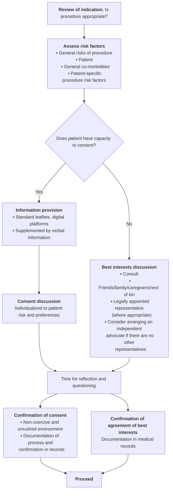

# Informed consent for endoscopic procedures: European Society of Gastrointestinal Endoscopy (ESGE) Position Statement

## Authors

Simon M. Everett¹, Konstantinos Triantafyllou², Cesare Hassan³·⁴, Klaus Mergener⁵, Tony C. Tham⁶, Nuno Almeida⁷·⁸, Giulio Antonelli⁹·¹⁰, Andrew Axon¹¹, Raf Bisschops¹²·¹³, Michael Bretthauer¹⁴, Vianna Costil¹⁵, Farid Foroutan¹⁶·¹⁷, James Gauci¹⁸, Istvan Hritz¹⁹, Helmut Messmann²⁰, Maria Pellisé²¹, Philip Roelandt¹²·¹³, Andrada Seicean²²·²³, Georgios Tziatzios²⁴, Andrei Voiosu²⁵, Ian M. Gralnek²⁶·²⁷

## Institutions

1. Department of Gastroenterology, Leeds Teaching Hospitals NHS Trust, Leeds, UK
2. Hepatogastroenterology Unit, Second Department of Propaedeutic Internal Medicine, Medical School, National and Kapodistrian University of Athens, Attikon University General Hospital, Athens, Greece
3. Department of Biomedical Sciences, Humanitas University, Pieve Emanuele, Milan, Italy
4. Endoscopy Unit, IRCCS Humanitas Research Hospital, Rozzano, Milan, Italy
5. University of Washington, Seattle, Washington, USA
6. Division of Gastroenterology, Ulster Hospital, Dundonald, Belfast, Northern Ireland
7. Gastroenterology Department, Centro Hospitalar e Universitário de Coimbra, Coimbra, Portugal
8. Faculty of Medicine, University of Coimbra, Coimbra, Portugal
9. Department of Anatomical, Histological, Forensic Medicine and Orthopedics Sciences, "Sapienza" University of Rome, Rome, Italy
10. Gastroenterology and Digestive Endoscopy Unit, Ospedale dei Castelli Hospital, Ariccia, Rome, Italy
11. Parklane Plowden Chambers, Newcastle, UK
12. Department of Gastroenterology and Hepatology, UZ Leuven, Leuven, Belgium
13. Translational Research in Gastrointestinal Diseases (TARGID), Department of Chronic Diseases, Metabolism and Ageing (CHROMETA), KU Leuven, Leuven, Belgium
14. Clinical Effectiveness Group, Department of Transplantation Medicine, Oslo University Hospital and University of Oslo, Oslo, Norway
15. Clinique du Trocadéro, Paris, France
16. Department of Health Research Methods, Evidence, and Impact, McMaster University, Hamilton, Ontario, Canada
17. MAGIC Evidence Ecosystem Foundation
18. Department of Gastroenterology, Pinderfields Hospital, Mid Yorkshire Hospitals NHS Trust, Wakefield, UK
19. Department of Surgery, Transplantation and Gastroenterology, Center for Therapeutic Endoscopy, Semmelweis University, Budapest, Hungary
20. Department of Gastroenterology, Faculty of Medicine, University of Augsburg, Augsburg, Germany
21. Department of Gastroenterology, Hospital Clínic de Barcelona, Institut d'Investigacions Biomèdiques August Pi i Sunyer (IDIBAPS), Centro de Investigación Biomédica en Red de Enfermedades Hepáticas y Digestivas (CIBEREHD), University of Barcelona, Barcelona, Spain
22. Regional Institute of Gastroenterology and Hepatology Cluj-Napoca, Cluj-Napoca, Romania
23. University of Medicine and Pharmacy "Iuliu Hatieganu" Cluj-Napoca, Cluj-Napoca, Romania
24. Department of Gastroenterology, "Konstantopoulio-Patision" General Hospital, Athens, Greece
25. Gastroenterology and Hepatology Department, Colentina Clinical Hospital and Internal Medicine and Gastroenterology, Carol Davila University of Medicine and Pharmacy, Bucharest, Romania
26. Institute of Gastroenterology and Hepatology, Emek Medical Center, Afula, Israel
27. Rappaport Faculty of Medicine, Technion Israel Institute of Technology, Haifa, Israel

**published online** 0.0.2023

**Bibliography**
Endoscopy 2023; 55: 1–15
**DOI** 10.1055/a-2133-3365
**ISSN** 0013-726X
© 2023. European Society of Gastrointestinal Endoscopy
All rights reserved.
This article is published by Thieme.
Georg Thieme Verlag KG, Rüdigerstraße 14,
70469 Stuttgart, Germany

**Corresponding author**
Simon Everett, MD, Department of Gastroenterology, Leeds Teaching Hospitals NHS Trust, St James's Hospital, Beckett Street, Harehills, Leeds, LS9 7TF, UK
simon.everett@nhs.net

### MAIN STATEMENTS

All endoscopic procedures are invasive and carry risk. Accordingly, all endoscopists should involve the patient in the decision-making process about the most appropriate endoscopic procedure for that individual, in keeping with a patient's right to self-determination and autonomy. Recognition of this has led to detailed guidelines on informed consent for endoscopy in some countries, but in many no such guidance exists; this may lead to variations in care and exposure to risk of litigation. In this document, the European Society of Gastrointestinal Endoscopy (ESGE) sets out a series of statements that cover best practice in informed consent for endoscopy. These statements should be seen as a minimum standard of practice, but practitioners must be aware of and adhere to the law in their own country.

**1** Patients should give informed consent for all gastrointestinal endoscopic procedures for which they have capacity to do so.

**2** The healthcare professional seeking consent for an endoscopic procedure should ensure that the patient has the capacity to consent to that procedure.

**3** For patients who lack capacity, healthcare personnel should at all times try to engage with people close to the patient, such as family, friends, or caregivers, to achieve consensus on the appropriateness of performing the procedure.

**4** Where a patient lacks capacity to provide informed consent, the best interest decision should be clearly documented in the medical record. This should include information about the capacity assessment, reason(s) that the decision cannot be delayed for capacity recovery (or if recovery is not expected), who has been consulted, and where relevant the form of authority for the decision.

**5** There should be a systematic and transparent disclosure of the expected benefits and harms that may reasonably affect patient choice on whether or not to undergo any diagnostic or interventional endoscopic procedure. Information about possible alternatives, as well as the consequences of doing nothing, should also be provided when relevant.

**6** The information provided on the benefit and harms of an endoscopic procedure should be adapted to the procedure and patient-specific risk factors, and the preferences of the patient should be central to the consent process.

**7** The consent discussion should be undertaken by an individual who is familiar with the procedure and its risks, and is able to discuss these in the context of the individual patient.

**8** Patients should confirm consent to an endoscopic procedure in a private, unrushed, and non-coercive environment.

**9** If a patient requests that an endoscopic procedure be discontinued, the procedure should be paused and the patient's capacity for decision making assessed. If a competent patient continues to object to the procedure, or if a conclusive determination of capacity is not feasible, the examination should be terminated as soon as it is safe to do so.

**10** Informed consent should be sufficiently detailed to cover all findings that can be reasonably anticipated during an endoscopic examination. The scope of this consent should not be expanded, nor a patient's implicit consent for additional interventions assumed, unless failure to proceed with such interventions would result in immediate and predictable harm to the patient.

> ### SCOPE AND PURPOSE
>
> This Position Statement from the European Society of Gastrointestinal Endoscopy reviews the current legislature and guidelines related to informed consent in gastrointestinal endoscopy. It stresses the need to obtain individualized informed consent from patients undergoing endoscopy and aims to provide a framework to support clinicians seeking consent for endoscopy in most common clinical scenarios.

## Introduction

The role of endoscopy in the diagnosis and management of gastrointestinal (GI) diseases is a rapidly changing field. Patients require prompt access to diagnostic endoscopy to exclude neoplasia, yet an increasing number of less invasive alternative diagnostic options exist. On the other hand, with improved techniques, training, and equipment, advanced interventional endoscopy is now commonplace, but carries with it significantly increased risks of adverse events, along with alternative treatment options.
As the field of GI endoscopy has advanced, so has an appreciation of the patient's right to self-determination. We live in an age where patient autonomy is taken very seriously. Patients are no longer viewed as uninformed or incapable of understanding medical matters. Despite technical advances, medical treatment is uncertain of success and involves a balance of risk to benefit. Informed consent is the mechanism by which a patient is able to choose the medical treatment they receive, as it is they who will live with the consequences.

An adult person of sound mind is therefore entitled to decide which, if any, of the available forms of treatment to undergo, and their consent must be obtained before treatment is undertaken. Patients are no longer treated as placing themselves in the hands of their doctors (and then being prone to sue them in the event of a disappointing outcome) but are treated, so far as possible, as adults who are capable of understanding that medical treatment is uncertain of success and may involve risks, accepting responsibility for the taking of risks affecting their own lives, and living with the consequences of their choices [1].

In 2002, a European Society of Gastrointestinal Endoscopy (ESGE) survey demonstrated significant variation and deficiencies in the process of informed consent for endoscopy in European Member Societies [2]. This was followed by a workshop in the same year that yielded 10 recommendations on informed consent for digestive endoscopy [3]. A subsequent workshop in 2006 provided further recommendations in relation to consent for elderly patients who lack capacity and for the administration of sedation [4].

In recent years, recognition of the importance of informed consent and new legislation has led to further detailed guidelines [5–7], but in many countries no such guidance exists and individual practitioners are left to determine what is best practice [8]. This may lead to variations in care and exposure to risk of litigation. Good consent practice, on the other hand, leads to more satisfied patients and greater efficiency owing to improved appropriateness of procedure selection and reduced complaints.

In this Position Statement, ESGE sets out a series of statements that cover best practice in informed consent for GI endoscopy. It is recognized that opinions, attitudes, and legal frameworks differ between countries; however, endoscopy of all sorts is an invasive procedure that has inherent risk. ESGE recognizes this and seeks to stress the importance of informed consent for all endoscopic procedures. This Position Statement cannot cover the differing legislations within each ESGE Member Society. Instead, we set out a series of statements that should be seen as a minimum standard, but practitioners must be aware of and adhere to the law in their own country.

## Methods

ESGE commissioned this Position Statement in accordance with the current ESGE Publication policy [9]. The ESGE Guideline Committee chair (K.T.) assigned the topic to the Position Statement leader (S.E.), who developed the task force. Applications to contribute to the task force were also sought from ESGE Member Societies. In addition, specific legal (A.A.) and methodological (F.F.) advice was invited. The Position Statement leader (S.E.) worked with task force leaders (C.H., K.M., and T.C.T.) to lead predefined sections of work.

A survey of two representative members from each of the ESGE Member Societies was undertaken in 2022 to understand legislation and key issues that would inform the development of this Position Statement [8]. This demonstrated regional variation in practice in a number of key areas, including confirmation of consent, assessment of capacity, and management of patients who lack capacity; there was a lack of local guidance in the majority of countries (56 %).

Following this, a series of Key Questions were developed and discussed at an initial online meeting (November 2022). Questions were amended and allocated to a task force member. Initial statements were submitted by task force leaders for a second online meeting (January 2023). Further individual discussions and meetings occurred with a final online meeting in April 2023, at which the statements and the text of this Position Statement were agreed.

Owing to the paucity of high quality evidence, this is a Position Statement not a Guideline. In accordance with the limitations to the GRADE approach, in this circumstance, ESGE has provided good practice statements that are not weighted according to their strength, rather than recommendations [10].

Each statement was reviewed through a series of meetings. Where there was disagreement amongst the task force, the statement was amended prior to repeat discussion and ratification at the final meeting. Only statements for which there was 100 % agreement are included.

Consistency of terminology around informed consent is important and recognizes that a patient should give consent of their own free will and that it is their right to change that decision at any point. Therefore, in this document, we have used the terminology described by Burr et al. [7]. We have avoided the term "taking" consent; instead, we refer to either "obtaining" or "seeking" consent through a process that concludes with the patient "giving" consent voluntarily. "Confirmation" of consent can occur at any point in the pathway after the patient has given their consent, as can withdrawal of consent.

> ### ABBREVIATIONS
>
> | Abbreviation | Definition |
> |---|---|
> | **DAE** | direct access endoscopy |
> | **EMR** | endoscopic mucosal resection |
> | **ERCP** | endoscopic retrograde cholangiopancreatography |
> | **ESD** | endoscopic submucosal dissection |
> | **ESGE** | European Society of Gastrointestinal Endoscopy |
> | **EUS** | endoscopic ultrasound |
> | **GI** | gastrointestinal |
> | **LEE** | live endoscopy event |
> | **NHS** | National Health Service |
> | **PIL** | patient information leaflet |
> | **SDA** | shared decision aid |
# 1 General principles and assessment of capacity

## 1.1 General principles

> ### STATEMENTS
>
> Patients should give informed consent for all gastrointestinal endoscopic procedures for which they have capacity to do so.
>
> The consent process and discussions should be documented in the patient's medical record.
>
> Endoscopy units should have a written policy for obtaining and documenting informed consent that should accord with local regulations and the relevant national legal framework.

There is a vast array of GI endoscopic procedures, varying in complexity, but all are invasive and potentially uncomfortable. Adverse events are recognized for all procedures, the risk of which depends on patient, procedural, and endoscopist factors, but do not necessarily imply negligence or error [11]. Further, there are invariably alternative approaches, including the option of doing nothing. Therefore, informed consent should be given by a patient for every endoscopic procedure.

To give informed consent, the patient must be provided with information about the indication and potential benefits of the proposed procedure, as well as the risks and alternatives, including the option of not proceeding. Consent is only valid if the patient receives sufficient information to understand, consider, and voluntarily authorize the procedure [6]. This should occur through a process of dialogue between clinical staff and patients in a shared decision-making model [12].

Legislation about informed consent differs from one country to another, with some jurisdictions requiring that the consent decision be documented in writing, with the patient signing a consent form, whereas in others, verbal consent is considered satisfactory, dependent on the complexity of the procedure.

It should be noted that, whilst a signature on a consent form constitutes evidence that a process has occurred, it should not be relied upon to confirm that the process was adequate. Regardless of the process that is undertaken for seeking confirmation of the patient's consent, in order to defend against claims that information was not given or was inadequate, it is important that there are contemporaneous notes of the discussion and all of the risks considered are recorded in the patient's medical records in a way that allows future scrutiny (summarized in ▶Fig. 1). Consent does not however need to be a time-consuming process, although the time allocated to the discussion will depend on the complexity of the decision or whether the patient has had the procedure previously [12]. Nonetheless, repetition of an endoscopic procedure (e.g. a surveillance examination) does not mean that the process of informed consent can be avoided and indeed the risk–benefit equation may have changed with, for example, the patient's advancing age.

Methods used to minimize discomfort in endoscopy range from topical pharyngeal anesthesia, nitrous oxide gas, moderate sedation with opiates and/or benzodiazepines, and deep sedation with propofol or general anesthesia. The sedation may be delivered by the endoscopist, sedation practitioners, or anesthetists. The benefits and risks of each approach vary according to the complexity of the procedure being undertaken and the patient's co-morbidities. Patients may however have strong preferences with respect to the option of sedation or anesthesia, so patient expectations, along with the available options, benefits, risks, and limitations, as well as alternatives for sedation, should be discussed and documented as part of the consent process [13, 14].

Whether a second consent form is required for sedation and/or anesthesia will depend on local legislation. ESGE recommends that informed consent for non-anesthesiologist administration of propofol may be incorporated into the main body of the endoscopy consent form, and UK guidelines for general anesthesia state that a separate form is not required where anesthesia is used to facilitate another treatment [14–16]. However, practitioners should be aware of the local legislation and use a separate form if required.

It is evident from the above that an individual consent process will vary according to the nature of the procedure being undertaken, the circumstances of the referral, procedure booking processes, as well as local practice and legislation. Each unit should therefore develop a standardized policy describing how to obtain and document informed consent for every endoscopic procedure, which must be in accordance with the regulations of their facility and the national legal framework.

## 1.2 Assessment of capacity

> ### STATEMENTS
>
> The healthcare professional seeking consent for an endoscopic procedure should ensure that the patient has the capacity to consent to that procedure.
>
> The healthcare professional should be familiar with the relevant legislation in their country in the assessment of capacity and can use available tools to assist in this assessment.

Although the law on mental capacity varies between countries in Europe, in principle it requires a presumption that all adult patients have the capacity to make decisions about their treatment and medical care, unless there is significant evidence to suggest otherwise [5, 17–20]. A person lacks capacity if their mind is impaired or disturbed in some way, which means they are unable to make a decision at that time. Examples include: mental health conditions, such as schizophrenia or bipolar disorder; dementia; learning disabilities; brain damage, such as from a stroke or other brain injury; physical or mental condi-
tions that cause confusion, drowsiness, or a loss of consciousness; and intoxication caused by drug or alcohol misuse.

Someone with such an impairment is thought to be unable to make a decision if they cannot understand information about the procedure or intervention, remember that information, weigh up that information as part of the process of making the decision, or communicate their decision by talking, using sign language, or any other means. It should be noted however that the criteria by which capacity is determined varies in different countries and endoscopists should be aware of the laws and definitions that apply to their practice locally.

There are some principles to consider when assessing a patient's capacity to provide consent [20, 21].

- As capacity can change over time, it should be assessed at the time that consent is required.
- Capacity is "decision specific," meaning someone can lack capacity to make complex decisions (for example to decide on financial issues) but still have the capacity to make simple decisions about healthcare. The assessment of capacity to provide informed consent therefore best involves someone who has understanding and/or experience of the procedure but it may require the involvement of a multidisciplinary team to come to a consensus decision.
- It is important to make adjustments to help the patient make their own decisions where possible. This may include altering the location or time of the discussion; the way in which information is explained or presented, so that it is easier for them to understand (for example by using visual aids); using different methods of communication, such as nonverbal communication; and involving a family member, caregiver, or advocate. Consideration should be given to whether the patient's capacity may improve if the decision can be safely delayed.
- A person should not be treated as lacking the capacity to make a decision just because they make a decision you or others may deem "unwise."
- Treatment and care that is provided to someone who lacks capacity should be the treatment or care that is least restrictive of their basic rights, freedoms, and future options. It includes considering whether there is a need to act or make a decision at all.
- Any decision or action taken on behalf of a patient who lacks capacity must be in the best interests of that person.
- A patient who lacks capacity can express their preferences for care and treatment in advance. Such an advanced directive, if legally valid, must be honored.

**▶ Fig. 1** Suggested flowchart of the process for obtaining informed consent in the elective setting.

Mental capacity can be assessed using a two-stage test of capacity [21].

1. Does the person have an impairment of their mind or brain, whether it is a result of an illness, or external factors such as alcohol or drug use?
2. Does the impairment mean the person is unable to make a specific decision when they need to? Patients can lack capacity to make some decisions but have capacity to make others, and mental capacity can also fluctuate with time.

There are numerous online toolkits available to help assess capacity, but clinicians should ensure that these toolkits are relevant to their country of practice\*. In most cases, capacity assessment is very straightforward but, when it is not, advice should be sought from other professionals, such as another endoscopist, a psychiatrist, pediatrician, or elderly care physician, and legal advice may on occasion be required.

## 1.3 Decision making on behalf of patients who lack capacity

> ### STATEMENTS
>
> For patients who lack capacity and have appointed a representative, or a legal representative has been appointed by the relevant authorities, this representative shall be engaged in shared decision making and informed consent on behalf of the patient.
>
> For patients who lack capacity, healthcare personnel should at all times try to engage with people close to the patient, such as family, friends, or caregivers, to achieve consensus on the appropriateness of performing the procedure.
>
> Where a patient lacks capacity to provide informed consent, the best interest decision should be clearly documented in the medical record. This should include information about the capacity assessment, reason(s) that the decision cannot be delayed for capacity recovery (or if recovery is not expected), who has been consulted, and, where relevant, the form of authority for the decision.

All individuals have the right to appoint a representative who shall be consulted on their behalf to engage in shared decision making for their medical care (legal representative or power of attorney [POA]). Where such a representative has been appropriately appointed according to local legislation, healthcare personnel must make every effort to consult with that person and engage them in shared decision making. Likewise, if a patient has a representative appointed by the relevant legal authority, that person must be consulted. However, even when there is a nominated deputy, that person should only make decisions where the individual lacks capacity for that specific decision.

Regardless of whether or not there is a legally appointed representative, healthcare personnel should attempt to engage with other individuals who are close to the patient. This may include next of kin, family, partner, close friends, or caregivers. In all circumstances, the goal is to achieve consensus that represents the best interests and wishes of the patient.

Some jurisdictions have proposed a hierarchy of eligible persons who should be considered as the patient's representative in a situation where there is no legally appointed representative, whereas in many countries, if there is no appointed representative, the decision maker is the doctor caring for the patient [22]. Accordingly, it is important that healthcare personnel have knowledge of the relevant legislation in their jurisdiction about assessment of capacity, patient representatives, and legal directives, and ensure that decisions are always taken with the patient's best interests in mind.

In situations that involve complex or high risk invasive treatments where a patient lacks capacity and there is no legal representative, it may be appropriate to appoint an independent advocate to support decision making. Where consensus cannot be achieved by consultation with family, friends, caregivers, and independent advocates, it may be necessary to seek further advice from legal professionals.

Where a decision has been taken on behalf of a patient who lacks capacity, it is essential that the decision-making process is documented in the medical records. Many countries or organizations employ a dedicated consent form to record this discussion in a systematic way. Given the legal implications, such an approach is encouraged, but any documentation pertaining to a best interest decision for a patient who lacks capacity should include at a minimum:

- the capacity assessment
- reasons why delaying to allow capacity to recover is not possible (e.g. the patient is not likely to regain capacity and/or the treatment cannot wait until that time)
- the individuals who were consulted in reaching the decision and how the decision was reached including, where appropriate, multidisciplinary team discussions
- where a person is acting as a legal representative, written confirmation of that person's authority to make the decision.

\* Examples include http://www.bma.org.uk/advice-and-support/ethics/adults-who-lack-capacity/mental-capacity-act-toolkit and www.gmc-uk.org/ethical-guidance/ethical-hub/mental-capacity
# 2 Information provision and the consent discussion

## 2.1 Providing information to the patient

> ### STATEMENT
>
> There should be a systematic and transparent disclosure of the expected benefits and harms that may reasonably affect patient choice on whether or not to undergo any diagnostic or interventional endoscopic procedure. Information about possible alternatives, as well as the consequences of doing nothing, should also be provided when relevant.

Clinical decisions are based on a balance of the benefit outweighing the potential harms of any intervention. This results in strong recommendations where there is clear dominance of benefit over harm, or vice versa, and in weak recommendations when the balance is less clear. This approach should form the basis of the dialogue between the endoscopist and patient during informed consent.

Information on benefits and harm may be acquired from the published literature for many endoscopic interventions and, where available, this information should be provided systematically to a patient where it reasonably applies to them. In order to facilitate shared decision making, these benefits and harms should be transparently explained and, where possible, quantified numerically in a form that the patient can best understand.

Information should clarify the balance between the recommended intervention and possible alternatives, including doing nothing, such that it should be clear to the patient why a physician would recommend a specific intervention over the alternatives.

In dialogue with the patient, the person seeking consent must strive for balance between giving excessive detail and oversimplifying, in order to inform thoroughly while avoiding cognitive overload. This may be aided by information leaflets, visual or electronic aids, and shared decision-making tools [23]. Key moments of the procedure, certain technical details, whether a trainee will be involved, and statistics reflecting likely procedural outcomes should be presented clearly. Information related to procedure preparation, such as withholding anticoagulants or bowel preparation, and any risks related to these steps should be included in the information.

Defining what is a relevant risk of harm or what constitutes reasonable disclosure can vary, so it is recommended that all physicians keep up to date with the legal requirements of informed consent and what are considered to be reasonable expectations in this field, because court rulings can dramatically alter practice [1, 24, 25].

Informed consent is not just a legal formality and should be understood as a process aimed at offering the patient truthful, pertinent, up-to-date, and scientifically sound information regarding the proposed procedure to allow them to reach a decision. Because there is an inherent asymmetry in the informed consent process, the endoscopist should be sensitive to each patient's context and use the conversation as an aid for shared decision making [23, 26]. It should be stressed that withholding information from a patient is not permissible, except in exceptional cases where a physician considers that sharing particular information may lead the patient to serious harm. When faced with such exceptional circumstances, it is recommended that legal advice is sought [12].

Special consideration should be given to procedures that are not yet widely accessible, fully standardized, or mainstream, as is the case for more advanced and emerging interventional endoscopy. In such cases, the physician should offer full disclosure regarding the reason for the procedure being considered (e.g. its particular advantages, suitability, and the lack of superior alternatives), its technical aspects, and discuss the limited available data on its safety or success. Disclosing previous performance or audited data of the center or the endoscopist in the proposed management plan is advisable and best practice, where available.

## 2.2 Individualization of the consent process

> ### STATEMENT
>
> The information provided on the benefit and harms of an endoscopic procedure should be adapted to the procedure and patient-specific risk factors, and the preferences of the patient should be central to the consent process.

The fact that any medical recommendation is based on a balance between the chance of benefit on the one hand and the risk of an adverse outcome on the other does not mean that the patient must accept it. Patients have the right to refuse a proposed intervention, irrespective of the strength of recommendation, even if this seems irrational. The priorities of the individual patient may differ from those of the endoscopist and it is therefore the duty of the endoscopist to try to understand these patient priorities and adapt the decision-making process to them.

The risk of a given procedure will vary between individual patients. This may relate to the patient's co-morbidities (e.g. cardiac disease, anticoagulant therapy) that increase the risk of an adverse event occurring (e.g. bleeding) or increase the risk of severe consequences should an adverse event happen.

In addition, the chance of benefit and the risk of adverse events for a specific procedure in an individual patient will vary according to their background and the purpose of the procedure. For example, specific risk factors for post-endoscopic retrograde cholangiopancreatography (ERCP) pancreatitis among individual patients have been defined and should be incorporated into a discussion with the patient [27]. It is essential that this individual variation in the chance of benefit and risk of adverse events is reflected in the consent process and discussion [7].

Historically, consent for medical interventions followed a paternalistic style, where the physician would determine the course of investigation and treatment, based upon the
patient's clinical interests. This approach has changed to a patient-centered model, where an open discussion is held between the patient and the clinician. As established in the Montgomery ruling in the UK (2015) [1], the doctor is under a duty to take reasonable care to ensure that the patient is aware of any material risks involved in any recommended treatment, and of any reasonable alternative or variant treatments. The test of materiality is "whether, in the circumstances of the particular case, a reasonable person in the patient's position would be likely to attach significance to the risk, or the doctor is or should reasonably be aware that the particular patient would be likely to attach significance to it" [1].

The UK General Medical Council (GMC) guidance on consent (2020) suggests that the dialogue leading to decision making is an essential part of the consent process [12]. This step allows the clinician to give patients the information they want or need to come to a decision. This includes the delivery of information on the proposed procedure, any alternatives, and the desired outcomes, as well as the risks of harm and any uncertainties.

It is not appropriate to share every potential risk of harm, complication, or side effect, but the GMC recommends including information on the following.

- Expected harms, including common side effects and what to do if they occur.
- Recognized risks of harm that the clinician believes anyone in the patient's position would want to know.
- Any risk of serious harm, however unlikely it is to occur.
- The effect of the patient's individual clinical circumstances on the probability of a benefit or harm occurring. A distinction should therefore be made between procedure-specific and patient-specific risk factors. The effect of the patient's individual clinical and personal circumstances, compared with the population level risk, should be taken into account and communicated with the patient.
- Risks of harm and potential benefits that the patient would consider significant for any reason. These should be established through the dialogue leading to decision making, when patients are encouraged to express what matters to them about their health. The discussion should, in turn, reveal which risks they would and would not be prepared to take in order to achieve a desired outcome, and how the likelihood of a particular outcome might influence their choice.

Importantly, the patient's preferences must be kept central to the decision-making process. This should occur through exploring the patient's needs, values, and priorities, hence avoiding any assumptions. Such a process should allow the physician to provide the relevant information and support the patient in making their decision.

## 2.3 Form and timing of information provision

> ### STATEMENTS
>
> For common endoscopic procedures, patients should receive written information in plain language that they can understand prior to the procedure. Such information may be supported by the use of electronic aids, where possible.
>
> Written information leaflets should form the minimum level of information provision and these should be supplemented by verbal information and an opportunity for discussion to support an individualized approach in all cases.
>
> Where written information leaflets are not available or do not cover the proposed procedure, dedicated time should be given to support a verbal discussion in advance of performing the procedure.
>
> Written information should be provided to the patient prior to the procedure with sufficient time for them to read and consider the information and to ask questions if desired. The time allocated to the provision of information and consent discussion should be commensurate with the procedure complexity and invasiveness.

There are multiple means and opportunities for providing information to patients in respect of planned endoscopic procedures. The choice will depend on the complexity of the procedure, its urgency, the patient's previous experience of endoscopic procedures, and their preferences.

For the majority of common endoscopic procedures (both diagnostic and therapeutic), standardized written patient information leaflets (PILs) are available and it is recommended that these are provided to patients. Leaflets should avoid medical jargon, use simplified terminology, and be available in the languages common to the area where they are in use.

However, it should be noted that standardized leaflets do not cover the variation of benefit and risk related to individuals, nor deal with patient preferences, so they should be seen as a minimum dataset. Verbal information should be provided for every procedure and patients should have the opportunity for further dialogue in a timely and unrushed manner, if they desire it. Where benefits are more nuanced, for example for surveillance procedures, time should be set aside to describe the balance of risk to benefit to the patient. In these closely balanced situations, shared decision aids (SDAs) could be of benefit [28]. There are a number of online examples of SDAs and resources that can assist clinicians in these circumstances\*\*.

---

\*\* Examples include: https://choosingwisely.co.uk/shared-decision-making-resources/
https://www.england.nhs.uk/publication/decision-support-tools-making-a-decision-about-a-health-condition/
https://www.nice.org.uk/guidance/ng197/resources/shared-decision-making-learning-package-9142488109
Given the expanding and ever-changing nature of endoscopy, not every procedure can be covered by PILs. Where standardized leaflets are not available, time should be set aside to discuss the procedure with the patient well in advance and it is good practice to copy clinic notes to the patient so they have a record of that discussion. Independent interpreters (either present or via online resources) should be used to facilitate consent discussions where there are language barriers.

Other opportunities to provide information include digital tools such as online videos and interactive multimedia web applications. Systematic reviews of digital technologies for informed consent have found that they can improve recall, especially if adjusted for reading age [29, 30].

eConsent platforms have been in use for some time in clinical research, but are less common in clinical practice. These systems employ an online platform that provides digital information, following which the patient provides an electronic signature documenting that they agree to proceed [7]. Whilst this offers some advantages, particularly for high volume procedures, caution is required. Firstly, no platform has been validated for use in a clinical context. Secondly, there needs to be verification that the person signing the form online is the same person undergoing the procedure. Thirdly, it is important that any use of digital information does not discriminate against those people who do not have access to such information.

A Joint Statement from the UK National Health Service (NHS) Health Research Authority stresses that eConsent does not absolve clinicians of the responsibility to communicate adequately with participants and concludes that, in clinical trials of investigational medicinal products, an interview (however conducted) is mandatory [31]. Similar principles are recommended in clinical practice. It is possible that, in future, artificial intelligence platforms will offer opportunities to enhance the consent process (for example by adapting language to health literacy or educational attainment), but these are not yet available and care will need to be taken to ensure any new developments are properly evaluated and comply with the principles laid out in this Position Statement.

In all circumstances, a patient should have sufficient time to evaluate and absorb the information that has been provided and seek further clarification prior to undergoing the procedure. The time required will depend on the procedure characteristics and complexity, and its clinical urgency. Whilst local practice varies, every effort should be made to provide patients with time to reflect and question the clinician proposing the procedure.

Outpatients attending diagnostic procedures should be provided with information in the days before attending for the procedure. For complex interventional procedures with higher risk and more alternatives, we recommend dedicating adequate time-slots in the weeks or days before the procedure to consult with the patient, permitting the time and space for questions and understanding. For patients in hospital, such discussions should occur on the ward before the patient attends the endoscopy unit for the procedure.

## 2.4 Confirmation of consent

> ### STATEMENTS
>
> The consent discussion should be undertaken by an individual who is familiar with the procedure and its risks, and is able to discuss these in the context of the individual patient.
>
> Patients should confirm consent to an endoscopic procedure in a private, unrushed, and non-coercive environment.

The consent process begins at the time of referral, at which point the referring clinician should discuss their recommendation with the patient. The process concludes with the patient confirming their agreement to proceed.

Regardless of whether a signature is required, there should be a consultation with the patient that is conducted by an adequately trained individual. In all circumstances, the person conducting the consultation should have sufficient knowledge of the procedure to offer an individualized discussion with the patient. Where the procedure is complex or higher risk, it is likely that the person having the discussion will be trained to perform the procedure itself. In other circumstances, where the procedure is more common and lower risk (e.g. diagnostic procedures), this responsibility can be delegated to someone who does not perform the procedure themselves (e.g. an endoscopy nurse). However, in all cases, it is the endoscopist who is responsible for ensuring that the requirements of the consent process have been adequately met.

For any endoscopic procedure, the patient should confirm their agreement to proceed in advance. Confirmation of consent and, where required, signing of the consent form in the endoscopy room immediately before the procedure should be avoided. Instead, the patient should be given an appropriate amount of time and an acceptable, unrushed, non-coercive, and private environment in which to reach their decision and confirm it to the endoscopist before they proceed. In rare circumstances (e.g. because of infection control concerns), the patient must be brought directly into the endoscopy room. In this situation, the endoscopist must be confident that every step has been taken to provide the patient with adequate information before they have entered the room.
# 3 Specific circumstances

## 3.1 Direct access endoscopy

> ### STATEMENT
>
> Informed consent in direct access endoscopy (DAE) is a multistep process consisting of providing the patient with comprehensive procedure information prior to the date of the intervention and establishing a process by which questions and concerns can be identified and addressed to the patient's satisfaction prior to or on the day of the endoscopic procedure. The ultimate responsibility for ensuring the adequacy of informed consent in DAE lies with the endoscopist.

Direct access (or open access) endoscopy (DAE) describes a process by which patients are scheduled for an endoscopic procedure without first being seen by an endoscopist for a consultation, avoiding the costs and time delays associated with pre-procedure visits. DAE is most commonly used for diagnostic procedures, including for screening colonoscopies.

There are unique challenges related to obtaining informed consent in DAE [32]. The patient needs to receive adequate information about the procedure, its risks, benefits, and the alternatives ahead of the time of the intervention to avoid the risk of being coerced into proceeding after having already taken bowel preparation or having completed pre-procedure steps, such as placement of an intravenous line. The information provided to the patient needs to be comprehensive and include important planning aspects, such as the need to modify anticoagulant and other medication use in the days prior to the procedure.

Accordingly, it is important that the referral for the procedure contains sufficient medical information, including the patient's co-morbidities and medication, to ensure that the indication is correct and to allow safe patient triage. The referral should also confirm that the patient has agreed to a direct access approach and has capacity to consent for the procedure.

Standard PILs can be provided ahead of the procedure, supported by online or video resources where appropriate [29, 30, 33]. Where this information has been provided in advance, patients should still have the opportunity to make a consultation appointment with an adequately trained individual prior to the date of their procedure, in the event of any remaining questions or concerns.

Just as for conventional endoscopic scheduling, the final step in the consent process for DAE procedures is confirmation of consent. While legislative requirements vary for each country, the endoscopist is ultimately responsible for ensuring the adequacy of the informed consent process and the patient's suitability for the intervention, while at the same time addressing any questions or concerns for those patients who may still feel incompletely informed. Sufficient time should be allocated to DAE appointments to allow such dialogue to occur in an unrushed way.

## 3.2 Informed consent in the emergency setting

> ### STATEMENTS
>
> In an emergency, endoscopists should make all reasonable efforts to obtain informed consent.
>
> When consent cannot be obtained because of the circumstances or the nature of the emergency and if immediate endoscopic intervention is required, procedures considered necessary and in the patient's best interests should be undertaken, and the rationale for proceeding without formal consent should be clearly documented in the patient's medical record.

In GI endoscopy, obtaining valid informed consent is particularly challenging in situations that require urgent interventions, for example GI hemorrhage, perforation, or foreign body impaction. Patient distress caused by acute symptoms, analgesic medication, or fatigue may make it difficult for patients and their families to comprehend the vast amount of information necessary to provide valid consent [34].

Therefore, for life-threatening medical conditions that require immediate intervention, the provision of comprehensive pre-procedure patient education and the obtaining of consent may not always be possible. Time constraints due to the emergent nature of the illness, as well as variations in awareness and consciousness level, may further hinder the patient's capacity to provide consent.

Research into this topic has been limited and has focused mainly on emergency surgery. A recent systematic review and meta-analysis of 11 observational studies evaluating the informed consent process for patients undergoing emergent vs. elective surgery showed that both patient recall and satisfaction were significantly lower among those undergoing emergent compared with elective interventions (50.6 % vs. 72.0 % for recall, 69.5 % vs. 82.9 % for satisfaction) [35–38].

Despite these limitations, it is of paramount importance that physicians attempt to deliver to their patients the usual detailed overview of the procedure, any treatments, and their potential adverse events, as much as emergency circumstances allow. If informed consent cannot be obtained, patients may receive treatment without formal consent in an emergency, provided that the expected benefits outweigh potential harms and that the medical intervention is deemed necessary to save the patient's life or prevent further deterioration of their clinical state.
## 3.3 Refusal of consent and waiver of consent discussion

> ### STATEMENT
>
> If a competent patient makes a voluntary decision to refuse treatment, this decision must be respected, and the related assessments and discussions appropriately documented.

Informed consent and its counterpart, informed refusal, are recognized as the core of a patient's individual autonomy and competent adults maintain the right to refuse medical treatment at any time of their evaluation, even if deemed irrational by the physician [39, 40].

When a patient refuses endoscopy, providers should initially assess the clinician–patient communication route, ensuring that all necessary information has been properly outlined in a way that is appropriate for the patient's level of education and health literacy [41]. Proper communication remains the most important step in the entire consent process and can be hampered for a variety of reasons (e.g. physical and emotional distress or financial concerns) [42]. In this context, the role of friends or family may be vital, assisting the patient to fully comprehend the risks and benefits associated with different treatment modalities. Additionally, offering the patient a consultation with another endoscopist may be beneficial. Nonetheless, competent patients may still refuse medical care, but psychiatric consultation may be useful in select cases to evaluate capacity more formally.

Informed refusal of an intended endoscopic procedure should be appropriately documented, incorporating the following elements: assessment of the patient's decisional capacity; information delivered about the proposed intervention, expected outcome, risks of refusal, and reasonable alternatives; the individual's voluntary choice; discharge instructions given; and the opportunity for them to change their mind in the future [43]. Such detailed documentation of medical advice refusal may offer protection against future litigation but remains suboptimal in everyday clinical practice [44, 45]. It should be understood that informed refusal of treatment does not preclude the patient from seeking evaluation and treatment for the same clinical condition in the future.

At times, endoscopists may be confronted with a patient who does not refuse the procedure itself, but requests that the provider "just go ahead" with a procedure, without first conducting a more detailed informed consent discussion, a situation sometimes labelled as "waiver of informed consent" [6]. Such a request might be made because a patient may feel that listening to all the potential risks and downsides of an intervention might cause additional undue stress.

While provisions exist for waiving consent in certain clinical research settings [46], a request to "waive consent" for an endoscopic procedure needs to be carefully considered. A procedural consent discussion may be abbreviated but still needs to convey the basic aspects of the planned procedure and sedation process. The provider should also carefully explore the reasons why the patient does not want to receive additional information to determine whether underlying concerns or fears can be addressed. The request by the patient to voluntarily relinquish the right to a more detailed discussion should then be appropriately documented in the patient's medical record. The consent itself for the physician to proceed with the intervention will still need to be provided and documented in the standard fashion.

## 3.4 Withdrawal of consent

> ### STATEMENTS
>
> If a patient requests that an endoscopic procedure be discontinued, the procedure should be paused and the patient's capacity for decision making assessed. If a competent patient continues to object to the procedure or a conclusive determination of capacity is not feasible, the examination should be terminated as soon as it is safe to do so.
>
> The policy on withdrawal of consent should be included in the endoscopy unit's main policy document.

Informed consent is a dynamic process, not a one-time irreversible event. A competent patient may provide and withdraw consent at any point in time [47, 48]. A difficult and potentially contentious situation can arise when patients under moderate sedation indicate that they want their procedure stopped, for example because of distress and discomfort. If this occurs, the endoscopist should pause the procedure and assess whether the patient is fully aware of their surroundings and the context of the request [5]. The rest of the healthcare team should be empowered to suggest this if necessary. If the patient's concerns and symptoms can be addressed to their satisfaction, for example by administering additional analgesia, the endoscopist may be able to resume the procedure.

Special consideration needs to be given to instances where termination of an ongoing intervention may cause immediate harm to the patient (for example, in the event of trying to control ongoing bleeding). Under such extraordinary circumstances, the endoscopy team members may need to restrain a patient and reassess sedation to allow safe continuation of the procedure until a life-threatening or harmful situation has been brought under control. It will usually be helpful to discuss decisions about continuing or discontinuing the procedure with the other health professionals caring for the patient to ensure that all members of the team are in agreement and understand the rationale for the decision.

In all other circumstances, if a competent patient continues to indicate their wish that the procedure be terminated or a clear-cut determination of the patient's capacity is not possible, the endoscopist needs to err on the side of caution and terminate the procedure. Persisting with an intervention despite the patient's objection violates the principles of patient
autonomy and decision-making capacity and could be considered battery, a potentially criminal offense. Circumstances that result in the withdrawal of consent should be noted in the endoscopy report. The policy in relation to withdrawal of consent should be included in the endoscopy unit's main policy document.

## 3.5 Unexpected findings and different therapeutic options during endoscopy – "expanding" informed consent

> ### STATEMENT
>
> Informed consent should be sufficiently detailed to cover all findings and interventions that can be reasonably anticipated during an endoscopic procedure. The scope of this consent should not be expanded, nor a patient's implicit consent for additional interventions assumed, unless failure to proceed with such interventions would result in immediate and predictable harm to the patient.

On occasion, an endoscopic examination may yield an unexpected finding (e.g. a large polyp or a stricture) which, in the opinion of the endoscopist, would benefit from an additional intervention. For example, during the course of a diagnostic colonoscopy an unexpected large polyp may require endoscopic mucosal resection (EMR), or an intestinal stricture may require dilation to allow the intent of the procedure to be completed. The question then arises as to whether the patient would have wanted the endoscopist to simply proceed with the additional intervention during the same procedure or whether a repeat consent discussion should occur first.

The legal concept of "implied consent" describes a type of consent that is not expressly given but is inferred from the circumstances. In essence, the provider needs to determine whether the patient and any reasonable person under similar circumstances would want the additional intervention performed during the index procedure rather than it being delayed. Implied consent may often be assumed in the case of an emergency, especially if the resultant clinical situation is potentially life-threatening (for example, a massive GI bleed or an urgently required closure of a perforation). However, for a non-emergent situation the benefits and downsides of proceeding without explicit consent need to be carefully weighed, especially if such an intervention carries substantial risks. While the patient's preferences might be guessed at, they can rarely be fully known. If in doubt, clinicians should err on the side of caution, terminate the procedure, and allow the patient to regain consciousness to discuss the new circumstances before proceeding with a separate procedure after explicit consent has been obtained [5, 6].

This situation is particularly relevant when considering therapeutic procedures where a goal may be achieved by different means. Examples include ERCP in biliary obstruction, where it may be felt necessary to switch to endoscopic ultrasound (EUS)-guided biliary drainage, or where a lesion cannot be removed by EMR and it is necessary to step up to endoscopic submucosal dissection (ESD). These circumstances result in a change of risk profile. Where it can be anticipated that this may occur, the endoscopist should ensure this possibility has been discussed with the patient in advance. If they have not done so, they need to consider carefully whether the risk profile described to the patient in the consent discussion covers the new intervention. Where it does not, with the exception of emergencies described above, it will be more appropriate to discontinue and have further discussions with the patient.

The need to invoke implied consent can be minimized by diligent pre-procedure planning and an initial informed consent discussion that is sufficiently broad and detailed to anticipate and include all eventualities and possible findings.

## 3.6 Informed consent for live endoscopy procedures

> ### STATEMENT
>
> For video transmission of endoscopic procedures as part of a live endoscopy event (LEE), additional separate written consent should be obtained from the patient.

Patients undergoing an endoscopic procedure during videoconferencing (e.g. as part of a live endoscopy event [LEE]) should be approached according to established recommendations provided by the ESGE [49]. In addition to the standard informed consent process, patients who have agreed to be included in an LEE should receive and sign an additional separate consent form documenting the unique elements related to participating in the event.

Specifically, patients should be informed of the purpose of the event and the intended audience, as well as its voluntary nature and their option to refuse or withdraw their consent without suffering any disadvantage to their care. Patients should also be informed of ownership/copyright of the recording, its permanent nature once the broadcast has occurred, and that every attempt will be made to avoid inadvertent disclosure of protected health information and ensure the patient's anonymity during the event [50].

## 3.7 Consent in pediatric patients

> ### STATEMENT
>
> In pediatric patients undergoing GI endoscopic procedures, informed consent and assent processes should be conducted in a manner that is developmentally appropriate and consistent with local law.

Adult gastroenterologists are sometimes asked to perform procedures on pediatric patients, for example if a specialized intervention is required that is rarely performed on minors and a pediatric endoscopist with proficiency in this intervention is therefore not available. In this situation, the endoscopist per-

forming the procedure should work closely with their pediatric counterparts to make sure that all relevant information about the procedure, its risks, benefits, and alternatives are conveyed to the patient and their parents (or surrogates) in a manner that is constructive and appropriate to the age of the patient. As with procedures in adult patients, the ultimate responsibility for obtaining informed consent lies with the endoscopist performing the procedure [6].

Informed consent for endoscopy can only be given by a person of legal capacity and for pediatric patients is therefore generally provided by their parents or their surrogates. The age of majority is the age at which a child becomes an adult and acquires full legal capacity. The age of majority is 18 in many countries, but national legal regulations differ in regard to the question of when a child has the full right to give their autonomous consent [8, 51]. Additionally, in some countries, a child may gain full legal capacity before reaching the age of majority, for example if they become a parent or marry at an earlier age [52]. Referring to the United Nations Convention on Children's Rights, courts in the UK have held that children under the age of 16 may have the competence to consent to a medical intervention if they have sufficient maturity and intelligence to understand the nature and implications of that treatment [5, 53]. Endoscopists who are asked to perform procedures on children should therefore have a detailed understanding of their local laws and obtain the necessary input from pediatric colleagues and legal counsel.

Pediatric assent, a unique component of the care of children, describes the process by which an adolescent patient is included in the consent discussion and decision making [54]. Informed assent means a child's agreement to a medical procedure in circumstances where they are not legally authorized or lack sufficient understanding to give consent competently. The American Academy of Pediatrics' policy statement entitled "Informed consent in decision-making in pediatric practice" advocates that "patients should participate in decision-making commensurate with their development" and that "they should provide assent to care whenever reasonable" [55]. Therefore, doctors should carefully listen to the opinion and wishes of children who are not able to give full consent and should strive to obtain their assent [51].

Although assent is not legally binding and the ultimate consent still needs to be provided by the patient's parents (or surrogates), it is imperative in pediatrics that the patient be involved in the consent process. For example, in pediatric gastroenterology, the adolescent may not want an elective endoscopy to be performed [52]. If such an endoscopy were to be performed against the adolescent's wishes, even in the setting of consent provided by a parent, this could potentially be considered battery and is neither ethically nor legally recommended [56]. Under such circumstances, it would be wise to seek legal counsel.

As with all circumstances related to informed consent, any consent and assent discussion related to a pediatric patient and their family should be carefully documented in the patient record.

# Conclusions

As the complexity of endoscopic procedures expands, so has our appreciation of patient autonomy, which should be central to any decision to proceed with an invasive procedure. Before any endoscopic procedure is undertaken, it should be preceded by a shared decision-making process characterized by dialogue and information provision that includes individualization of patient-specific risk factors, their preferences, and possible alternatives. The components of this process, along with a number of other scenarios, have been summarized in this document. Adherence to the principles and statements laid out here will enhance patient care and protect individuals and organizations from future litigation.

# Disclaimer

ESGE Position Statements represent a consensus of best practice based on the available evidence at the time of preparation. This is NOT a guideline but a proposal for best practice in obtaining informed consent for endoscopy. The statements may not apply in all situations and should be interpreted in the light of specific clinical situations. This ESGE Position Statement is intended to be an educational device to provide information that may assist endoscopists in providing care to patients. The recommendations are not rules and should not be construed as establishing a legal standard of care or as encouraging, advocating, requiring, or discouraging any particular treatment. The legal disclaimer for ESGE guidelines applies to the present position statement.

# Acknowledgments

ESGE wishes to thank the external reviewers, Professor Roland Valori, Consultant Gastroenterologist, Gloucestershire Hospitals NHS Foundation Trust, Gloucester, UK and Professor Jaroslaw Regula, Head of Department, Centre of Postgraduate Medical Education, National Research Institute of Oncology, Warsaw, Poland, for their critical appraisal of this position statement.

# Competing interests

The authors declare that they have no conflict of interest.

# References

- [1] Montgomery (appellant) v Lanarkshire Health Board (Respondent) (Scotland). [2015] UKSC 11. Accessed: 10 July 2023. Available from: https://www.supremecourt.uk/cases/uksc-2013-0136.html
- [2] Triantafyllou K, Stanciu C, Kruse A et al. Informed consent for gastrointestinal endoscopy: a 2002 ESGE survey. Dig Dis 2002; 20: 280–283
- [3] Stanciu C, Novis B, Ladas S et al. Recommendations of the ESGE workshop on Informed Consent for Digestive Endoscopy. First European Symposium on Ethics in Gastroenterology and Digestive Endoscopy, Kos, Greece, June 2003. Endoscopy 2003; 35: 772–724
- [4] Ladas SD, Novis B, Triantafyllou K et al. Ethical issues in endoscopy: patient satisfaction, safety in elderly patients, palliation, and relations with industry. Second European Symposium on Ethics in Gastroenterology and Digestive Endoscopy, Kos, Greece, July 2006. Endoscopy 2007; 39: 556–565
- [5] Everett SM, Griffiths H, Nandasoma U et al. Guideline for obtaining valid consent for gastrointestinal endoscopy procedures. Gut 2016; 65: 1585–1601
- [6] ASGE Standards of Practice Committee, Storm AC, Fishman DS et al. American Society for Gastrointestinal Endoscopy guideline on informed consent for GI endoscopic procedures. Gastrointest Endosc 2022; 95: 207–215.e2
- [7] Burr NE, Penman ID, Griffiths H et al. Individualised consent for endoscopy: update on the 2016 BSG guidelines. Frontline Gastroenterol 2023; 14: 278–281
- [8] Tziatzios G, Gauci J, Triantafyllou K et al. P0982 Informed consent for gastrointestinal endoscopy: Results of a survey on current practices in member societies of the European Society of Gastrointestinal Endoscopy. United Eur Gastroenterol 2022; 10: (Suppl. 08): 1068
- [9] Hassan C, Ponchon T, Bisschops R et al. European Society of Gastrointestinal Endoscopy (ESGE) Publications Policy – Update 2020. Endoscopy 2020; 52: 123–126
- [10] Guyatt GH, Schunemann HJ, Djulbegovic B et al. Guideline panels should not GRADE good practice statements. J Clin Epidemiol 2015; 68: 597–600
- [11] Neumann H, Meier PN. Complications in gastrointestinal endoscopy. Dig Endosc 2016; 28: 534–536
- [12] GMC. Decision making and consent 2020. Accessed: 10 July 2023. Available from: www.gmc-uk.org/ethical-guidance/ethical-guidance-for-doctors/decision-making-and-consent
- [13] ASGE Standards of Practice Committee, Early DS, Lightdale JR et al. Guidelines for sedation and anesthesia in GI endoscopy. Gastrointest Endosc 2018; 87: 327–337
- [14] Dumonceau JM, Riphaus A, Schreiber F et al. Non-anesthesiologist administration of propofol for gastrointestinal endoscopy: European Society of Gastrointestinal Endoscopy, European Society of Gastroenterology and Endoscopy Nurses and Associates Guideline – Updated June 2015. Endoscopy 2015; 47: 1175–1189
- [15] Dumonceau JM, Riphaus A, Aparicio JR et al. European Society of Gastrointestinal Endoscopy, European Society of Gastroenterology and Endoscopy Nurses and Associates, and the European Society of Anaesthesiology Guideline: Non-anesthesiologist administration of propofol for GI endoscopy. Endoscopy 2010; 42: 960–974
- [16] Yentis SM, Hartle AJ, Barker IR et al. AAGBI: Consent for anaesthesia 2017: Association of Anaesthetists of Great Britain and Ireland. Anaesthesia 2017; 72: 93–105
- [17] Alzheimer Europe. Legal capacity and decision making. The ethical implications of lack of legal capacity on the lives of people with dementia: summary report. 2020. Accessed: 10 July 2023. Available from: www.alzheimer-europe.org/sites/default/files/2021-11/Alzheimer%20Europe%20summary%20on%202020%20Report%20Legal%20capacity%20and%20decision%20making%20summary.pdf
- [18] Council of Europe Commissioner for Human Rights. Who gets to decide? Right to legal capacity for persons with intellectual and psychosocial disabilities. 2012. Accessed: 10 July 2023. Available from: https://rm.coe.int/who-gets-to-decide-right-to-legal-capacity-for-persons-with-intellectu/16807bb0f9%20Page%205
- [19] European Union Agency for Fundamental Rights. Legal capacity of persons with intellectual disabilities and persons with mental health problems. 2013. Accessed: 10 July 2023. Available from: https://fra.europa.eu/sites/default/files/legal-capacity-intellectual-disabilities-mental-health-problems.pdf
- [20] Mental Capacity Act. 2005. Accessed: 10 July 2023. Available from: www.legislation.gov.uk/ukpga/2005/9/contents
- [21] NHS. Mental Capacity Act. 2021. Accessed: 10 July 2023. Available from: www.nhs.uk/conditions/social-care-and-support-guide/making-decisions-for-someone-else/mental-capacity-act/
- [22] Helsedirektoratet. Next of Kin Supervisor. 2019. Accessed: 10 July 2023. Available from: www.helsedirektoratet.no/veiledere/parorende-veileder
- [23] NHS England and NHS Improvement Group. Shared Decision Making Summary Guide. 2019. Accessed: 10 July 2023. Available from: www.england.nhs.uk/wp-content/uploads/2019/01/shared-decision-making-summary-guide-v1.pdf
- [24] Chan SW, Tulloch E, Cooper ES et al. Montgomery and informed consent: where are we now? BMJ 2017; 357: j2224
- [25] Fernandez Lynch H, Joffe S, Feldman EA. Informed consent and the role of the treating physician. NEJM 2018; 379: e25
- [26] Millum J, Bromwich D. Informed consent: what must be disclosed and what must be understood? Am J Bioeth 2021; 21: 46–58
- [27] Dumonceau JM, Kapral C, Aabakken L et al. ERCP-related adverse events: European Society of Gastrointestinal Endoscopy (ESGE) Guideline. Endoscopy 2020; 52: 127–149
- [28] Stacey D, Legare F, Lewis K et al. Decision aids for people facing health treatment or screening decisions (Review). Cochrane Database Syst Rev 2017; 4: CD001431
- [29] Gesualdo F, Daverio M, Palazzani L et al. Digital tools in the informed consent process: a systematic review. BMC Med Ethics 2021; 22: 18
- [30] Farrell EH, Whistance RN, Phillips K et al. Systematic review and meta-analysis of audio-visual information aids for informed consent for invasive healthcare procedures in clinical practice. Patient Educ Couns 2014; 94: 20–32
- [31] Health Research Authority. Joint statement on seeking consent by electronic methods. 2018. Accessed: 10 July 2023. Available from: https://s3.eu-west-2.amazonaws.com/www.hra.nhs.uk/media/documents/hra-mhra-econsent-statement-sept-18.pdf
- [32] Segarajasingam DS, Pawlik J, Forbes GM. Informed consent in direct access colonoscopy. J Gastroenterol Hepatol 2007; 22: 2081–2085
- [33] Agre P, Kurtz RC, Krauss BJ. A randomized trial using videotape to present consent information for colonoscopy. Gastrointest Endosc 1994; 40: 271–276
- [34] Patel MD, Namboodri BL, Platts-Mills TF. Modernizing informed consent during emergency care. Ann Emerg Med 2020; 76: 350–352
- [35] Sava J, Ciesla D, Williams M et al. Is informed consent in trauma a lost cause? A prospective evaluation of acutely injured patients' ability to give consent. J Am Coll Surg 2007; 205: 405–408
- [36] D'Souza RS, Johnson RL, Bettini L et al. Room for improvement: a systematic review and meta-analysis on the informed consent process for emergency surgery. Mayo Clin Proc 2019; 94: 1786–1798
- [37] Feinstein MM, Adegboye J, Niforatos JD et al. Informed consent for invasive procedures in the emergency department. Am J Emerg Med 2021; 39: 114–120
- [38] Lin YK, Liu KT, Chen CW et al. How to effectively obtain informed consent in trauma patients: a systematic review. BMC Med Ethics 2019; 20: 8
- [39] Magauran BG Jr. Risk management for the emergency physician: competency and decision-making capacity, informed consent, and refusal of care against medical advice. Emerg Med Clin North Am 2009; 27: 605–614, viii
- [40] Wicks E. The right to refuse medical treatment under the European Convention on Human Rights. Med Law Rev 2001; 9: 17–40
- [41] Moskop JC. Informed consent and refusal of treatment: challenges for emergency physicians. Emerg Med Clin North Am 2006; 24: 605–618
- [42] Alfandre D, Schumann JH. What is wrong with discharges against medical advice (and how to fix them). JAMA 2013; 310: 2393–2394
- [43] Monico EP, Schwartz I. Leaving against medical advice: facing the issue in the emergency department. J Healthc Risk Manag 2009; 29: 6–9, 13, 15
- [44] Levy F, Mareiniss DP, Iacovelli C. The importance of a proper against-medical-advice (AMA) discharge: how signing out AMA may create significant liability protection for providers. J Emerg Med 2012; 43: 516–520
- [45] Schaefer MR, Monico EP. Documentation proficiency of patients who leave the emergency department against medical advice. Conn Med 2013; 77: 461–466
- [46] Klein L, Moore J, Biros M. A 20-year review: the use of exception from informed consent and waiver of informed consent in emergency research. Acad Emerg Med 2018; 25: 1169–1177
- [47] Tweeddale MG. Grasping the nettle–what to do when patients withdraw their consent for treatment: (a clinical perspective on the case of Ms B). J Med Ethics 2002; 28: 236–237
- [48] Yee C, Himmelwright RS, Klyce W et al. Putting the "No" in non nocere: surgery, anesthesia, and a patient's right to withdraw consent. R I Med J (2013) 2017; 100: 38–40
- [49] Webster GJ, El Menabawey T, Arvanitakis M et al. Live endoscopy events (LEEs): European Society of Gastrointestinal Endoscopy Position Statement – Update 2021. Endoscopy 2021; 53: 842–849
- [50] Khashab MA, Muthusamy VR, Akshintala VS et al. Best live endoscopy practices: an ASGE white paper. Gastrointest Endosc 2023; 97: 383–393.e3
- [51] De Lourdes Levy M, Larcher V, Kurz R et al. Informed consent/assent in children. Statement of the Ethics Working Group of the Confederation of European Specialists in Paediatrics (CESP). Eur J Pediatr 2003; 162: 629–633
- [52] Palmer R, Gillespie G. Consent and capacity in children and young people. Arch Dis Child Educ Pract Ed 2014; 99: 2–7
- [53] Griffith R. What is Gillick competence? Hum Vaccin Immunother 2016; 12: 244–247
- [54] Lee KJ, Havens PL, Sato TT et al. Assent for treatment: clinician knowledge, attitudes, and practice. Pediatrics 2006; 118: 723–730
- [55] Katz AL, Webb SA. Committee On Bioethics. Informed consent in decision-making in pediatric practice. Pediatrics 2016; 138: e20161485
- [56] Alessandri AJ. Parents know best: or do they? Treatment refusals in paediatric oncology. J Paediatr Child Health 2011; 47: 628–631