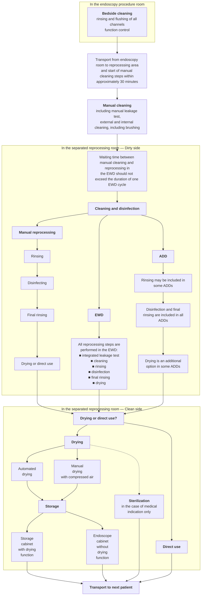

# Reprocessing of flexible endoscopes and endoscopic accessories used in gastrointestinal endoscopy: Position Statement of the European Society of Gastrointestinal Endoscopy (ESGE) and European Society of Gastroenterology Nurses and Associates (ESGENA) – Update 2018

## Authors

Ulrike Beilenhoff¹, Holger Biering², Reinhard Blum³, Jadranka Brljak⁴, Monica Cimbro⁵, Jean-Marc Dumonceau⁶, Cesare Hassan⁷, Michael Jung⁸, Birgit Kampf³, Christiane Neumann⁹, Michael Pietsch¹⁰, Lionel Pineau¹¹, Thierry Ponchon¹², Stanislav Rejchrt¹³, Jean-François Rey¹⁴, Verona Schmidt¹⁵, Jayne Tillett¹⁶, Jeanin E. van Hooft¹⁷

## Institutions

1. ESGENA Scientific Secretary, Ulm, Germany
2. Grevenbroich, Germany
3. Olympus Europa, Hamburg, Germany
4. University Hospital KBC-Zagreb-Rebro, Zagreb, Croatia
5. Medical Devices Division, CBC Europe Srl, Nova Milanese (MB), Italy
6. Gedyt Endoscopy Center, Buenos Aires, Argentina
7. Digestive Endoscopy Unit, Catholic University, Rome, Italy
8. 2nd Department of Internal Medicine, Katholisches Klinikum, Mainz, Germany
9. ESGENA Past President, Birmingham, UK
10. Department of Hygiene and Infection Prevention, Medical Center, University Hospital, Mainz, Germany
11. Biotech Germande, Marseille, France
12. Digestive Diseases Department, Hôpital Edouard Herriot, Lyon, France
13. 2nd Department of Internal Medicine, Charles University Teaching Hospital, Hradec Králové, Czech Republic
14. Institut Arnault Tzanck, St. Laurent du Var, France
15. Microbiology and Hygiene Department, Chemische Fabrik Dr. Weigert, Hamburg, Germany
16. St. Woolos Hospital, Newport, UK
17. Department of Gastroenterology and Hepatology, Amsterdam University Medical Centers, University of Amsterdam, The Netherlands

## Bibliography

DOI https://doi.org/10.1055/a-0759-1629

Published online: 20.11.2018 | Endoscopy 2018; 50: 1205–1234

© Georg Thieme Verlag KG Stuttgart · New York

ISSN 0013-726X

## Corresponding author

Ulrike Beilenhoff, ESGENA Scientific Secretariat, Ferdinand-Sauerbruch-Weg 16, 89075 Ulm, Germany

info@esgena.org

## ABSTRACT

This Position Statement from the European Society of Gastrointestinal Endoscopy (ESGE) and the European Society of Gastroenterology Nurses and Associates (ESGENA) sets standards for the reprocessing of flexible endoscopes and endoscopic devices used in gastroenterology. An expert working group of gastroenterologists, endoscopy nurses, chemists, microbiologists, and industry representatives provides updated recommendations on all aspects of reprocessing in order to maintain hygiene and infection control.

## Definitions of terms

**Automated disinfection devices (ADDs)** These are intended to disinfect loads containing flexible endoscopes and their accessories in a closed system after manual cleaning; thus their cycle includes disinfection and rinse steps but not cleaning.

**Bedside cleaning (Precleaning)** Rinsing and flushing of scope channels and wiping of the outer surfaces of the endoscope insertion tubes with dedicated detergent solution, at the examination site.

**Cleaning** Removal of blood, secretions, and any other contaminants and residues from endoscopes and accessories.

**Clinical service provider** An organization, person, or persons legally responsible for the provision of a clinical service. This could be an institution (such as a health service), a hospital or department, or a doctor working in their own premises.

**Detergent** A compound or a mixture of compounds intended to assist cleaning of medical devices (e.g. endoscopes).

**Disinfection** Reduction of microorganisms present on a product to a level previously specified as appropriate for its intended further handling or use (EN ISO 15883).

**Endoscope components** Detachable/removable parts of endoscopes (valves, distal caps, balloons for echoendoscopes, etc.).

**Endoscope product family** This refers to commercially available thermolabile endoscopes. Selection criteria for the endoscope product family are based on the principal endoscope characteristics, including the number, construction, and purpose of the different endoscope channels and their clinical applications [1].

**Endoscope washer-disinfector (EWD)** Device intended for cleaning and disinfection of flexible thermolabile endoscopes and their endoscope components within a closed system (according to EN ISO 15883–4).

**Endoscopes** In this Position Statement, the thermolabile flexible endoscopes used in gastroenterology.

**Endoscopic accessories** All devices used in conjunction with an endoscope to perform diagnosis and treatment, excluding peripheral equipment.

**Compressed air for drying** Compressed air for drying purposes with the following minimum specifications:

- No oil content;
- No dust or particle content;
- Low residual humidity (i.e., dew point lower than –40 °C).

**Process chemicals** All chemicals used during reprocessing procedures, including detergents, disinfectants, etc.

**Shelf-life of endoscopes** Longest storage time that can safely elapse between the last reprocessing and use on the next patient without any further reprocessing.

**Sterilization** Complete destruction of all microorganisms including bacterial spores; also a validated process used to render a device free from all forms of viable microorganism (EN ISO 11139).

**Storage cabinet** Equipment designed to provide a controlled environment for the storage of endoscope(s) and, if specified, drying of the endoscope including the endoscope(s) channels (EN 16442).

**Type test** Testing to verify conformity of washer-disinfectors or EWDs to standards, and to establish reference data in subsequent tests (EN ISO 15883).

**User** Person or department using equipment; organization(s) or persons within those organization(s) who operate and/or use the equipment.

**Validation** Documented procedure for obtaining, recording, and interpreting the results required to establish that a process will consistently yield products/outcomes complying with predetermined specifications (EN ISO 15883).

**ABBREVIATIONS**

| Abbreviation | Definition |
|---|---|
| ADD | automated disinfection device |
| CRE | carbapenem-resistant Enterobacteriaceae |
| CSSD | central sterilization and supply department |
| EN | European Standard |
| ERCP | endoscopic retrograde cholangiopancreatography |
| ESGE | European Society of Gastrointestinal Endoscopy |
| ESGENA | European Society of Gastrointestinal Endoscopy Nurses and Associates |
| EWD | endoscope washer-disinfector |
| GI | gastrointestinal |
| IFU | instructions for use (manufacturer's) |
| ISO | international standard (International Organization for Standardization) |
| OPA | orthophthalaldehyde |
| PAA | peracetic acid |
| PPE | personal protective equipment |
| PTC | percutaneous transhepatic cholangiography |
| RPE | respiratory protective equipment |

**Washer-disinfector** Device intended to clean and disinfect medical devices within a closed system (EN ISO 15883); typically applying thermal disinfection methods (e.g. 90 °C).

## 1. Introduction, and scope of position statement

Endoscopy procedures are well established in gastrointestinal (GI) endoscopy, playing an integral part in the prevention, diagnosis, and treatment of GI diseases. Endoscopy has significantly changed over the last 30 years, as technological developments have established a huge variety of diagnostic and therapeutic options. The increasing number of invasive procedures entails substantial infrastructure and specialized, trained, and competent staff.

Flexible endoscopes are reusable sophisticated medical devices with multiple lumens and narrow channels. Their thermolabile nature and complex design demand a specialized approach to decontamination. Appropriate reprocessing of flexible endoscopes and endoscopic accessories are an essential part of patient safety and quality assurance in GI endoscopy.

Since 1994, the Guideline Committee of the European Society of Gastrointestinal Endoscopy (ESGE) and the European Society of Gastrointestinal Endoscopy Nurses and Associates (ESGENA) has developed a number of guidelines and position statements focused on hygiene and infection control in endoscopy [2–8].

The aims of this updated ESGE–ESGENA document are:

- To set standards for the reprocessing of endoscopes and endoscopic devices prior to each individual endoscopic procedure, whether performed in endoscopy centers, hospitals, private clinics, ambulatory health centers, medical offices, or other areas where flexible endoscopes are used;
- To support individual endoscopy departments/healthcare providers in developing local standards and protocols for reprocessing of endoscopic equipment;
- To support national societies and official bodies in developing national recommendations and quality assurance programs for hygiene and infection control in GI endoscopy.

This Position Statement focuses only on flexible endoscopes, endoscope components, and endoscopic accessories used in gastrointestinal endoscopy.

It is important to follow the manufacturer's instructions for use (IFU) at all times.

The recommendations in this Position Statement should be adapted locally to comply with local regulations and national law.

## 2. Method

This ESGE-ESGENA Position Statement is based on a multidisciplinary consensus from an expert working group, consisting of gastroenterologists, endoscopy nurses, chemists, microbiologists, and industry representatives, with experience in developing national and international recommendations for hygiene and infection control.

Most recommendations on reprocessing of endoscopes are based on expert opinions, in turn based on evaluation of national guidelines available in English, German, and French [9–21]. Recommendations are also established on the basis of microbiological studies, reviews, or conclusions from case reports. Clinical trials in the field of endoscope decontamination are scarce because of the reluctance to expose any control arm patients to a potential infection risk.

A literature search was carried out that evaluated publications during the period 2008–2018. Based on the assessment of the literature reviews and advice from various official national bodies, this Position Statement reflects expert opinion on what constitutes good clinical practice [22, 23]. The quality of evidence and strength of recommendations were not formally graded as they were generally low [24].

The authors met three times during 2016–2018. A consensus document was agreed upon in 2018. The manuscript was sent to all ESGE and ESGENA member societies and individual members and to two ESGE Governing Board members for approval, resulting in this final version, agreed by all authors.

## 3. Endoscopy-related infections

Since the late 1970s there have been sporadic reports of nosocomial infections linked to endoscopic procedures [25–27]. The majority of documented cases were caused by noncompliance with national and international guidelines (including inadequate reprocessing, drying, or storage of endoscopes and endoscopic accessories). Damage, design limitations, contaminated water, and contaminated endoscope washer-disinfectors (EWDs) were also reported [25–27].

Endoscopy-related infections are categorized as follows:

- Endogenous infections from the patient's own microbial flora;
- Exogenous infections caused by inadequately reprocessed equipment. Endoscopes, endoscope components, and reusable endoscopic accessories can be vehicles for pathogenic or opportunistic microorganisms that are transmitted from previous patients or water.

Detailed information about endoscopy-related infections is given in Appendix 1.

## 4. Classification of endoscopic equipment

**Noncritical:** According to the Spaulding classification (▶**Table 1**) [28], reusable medical devices that come into contact only with the skin and mucosa are defined as noncritical devices (e.g. mouthguards, blood pressure cuffs, finger tips, or electrodes), and must undergo cleaning and disinfection but do not need to be sterile.

**Semicritical:** Most flexible endoscopes used in GI endoscopy are classified as semicritical devices, as they come into contact with intact mucous membranes and do not ordinarily penetrate sterile tissue [9–21]. Semicritical devices require cleaning and disinfection with bactericidal, fungicidal, mycobactericidal, and virucidal activity.

**Critical devices:** Endoscopic accessories that penetrate the mucosal barrier (e.g. biopsy forceps, guidewires, polypectomy snares, injection needles, etc.) are classified as critical devices and must be sterile at the point of use [9–21].

Flexible endoscopes used in sterile body cavities such as laparoscopic endoscopes should be sterile at the point of use.

Endoscopes inserted through natural orifices into sterile cavities (e.g., during natural orifice transluminal endoscopic surgery [NOTES], peroral endoscopic myotomy [POEM], peroral choledochoscopy) enter via naturally colonized body cavities. Endoscopes used during percutaneous cholangioscopy enter the biliary system via a stable track previously established during a percutaneous transhepatic cholangiography (PTC). Currently the minimum requirement is that freshly reprocessed endoscopes should be used for these purposes. The question of whether these endoscopes should be sterilized has not yet been answered. National regulations should be followed.

Single-use devices should not be reprocessed at any time [6, 9–21].

## 5. Preconditions and general issues

### 5.1 Principles of infection control

> **▶Table 1** Spaulding classification and reprocessing of medical devices.

| Spaulding classification | Examples in GI endoscopy | Reprocessing |
|---|---|---|
| Noncritical devices | - Fingertip for pulse oximetry - Blood pressure cuff - Electrodes for high frequency surgery and ECG - Mouthguard | - Manual cleaning and disinfection attaining at least a given level of bactericidal and yeasticidal activity |
| Semicritical devices | - Flexible endoscopes and their endoscope components | - Thorough manual cleaning including brushing is mandatory, followed by: Reprocessing, including cleaning, disinfection (attaining at least a given level of minimum bactericidal, fungicidal, mycobactericidal, and virucidal activity), and rinsing - Automated reprocessing in an EWD is strongly recommended - Thorough drying before storage in closed cabinets or storage cabinets with a drying function  Competent staff specially trained in endoscope reprocessing (in line with national laws and regulations) are required. |
| Critical devices | - Endoscopic accessories, e.g. biopsy forceps, polypectomy snares, ERCP accessories, etc. - Flexible endoscopes only if medical indication for sterilization is given | For reusable devices, validated and standardized reprocessing, preferably in a CSSD is strongly recommended, including: - Thorough cleaning - Automated reprocessing systems - Sterile packages - Sterilization  Proof of structured training for reprocessing medical devices (in line with national laws and regulations) |

GI, gastrointestinal; ECG, electrocardiogram; EWD, endoscope washer-disinfector; ERCP, endoscopic retrograde cholangiopancreatography; CSSD, central sterilization and supply department.

> **RECOMMENDATION**
>
> Patients undergoing digestive endoscopy should be examined and treated without risks of transmission of infection or of side effects that may result from inadequate reprocessing of endoscopes and endoscope components.

> **RECOMMENDATION**
>
> As the carrier status of patients is often unknown, all patients should be treated as potentially infectious.

## RECOMMENDATION

All endoscopes and reusable endoscopic accessories should be reprocessed with a uniform, standardized reprocessing procedure following every endoscopic procedure (universal precautions).

## RECOMMENDATION

A traceability system should be in place to allow recall of patients in the case of an outbreak.

## RECOMMENDATION

The endoscopy department should be informed about the carrier status of the patient, so any pertinent precautions can be taken.

In daily routine, patients with known infections or special risks are often scheduled to undergo their procedure at the end of the daily patient list. However, given the universal endoscope reprocessing regime, which presumes that all patients are potentially infectious, it is no longer recommended that patients with known infections should be examined only at the end of the endoscopy list. Nevertheless, infection control policies often include this recommendation in order to make staff aware and to ensure appropriate cleaning and disinfection of the working environment.

### 5.2. Health and safety aspects of endoscope reprocessing

> **RECOMMENDATION**
>
> Endoscopy staff should be protected against infectious material during the endoscopic procedure as well as against direct contact with contaminated equipment or potentially harmful chemicals during the reprocessing procedures.

> **RECOMMENDATION**
>
> A department-specific health and safety policy as well as appropriate equipment should be available regarding spillages, handling of sharp instruments, chemicals, and body fluids.

> **RECOMMENDATION**
>
> All staff involved in the reprocessing procedure should wear appropriate personal protective equipment (PPE) including:
>
> - Chemically resistant single-use gloves (EN 374);
> - Protective eyewear (glasses or visors), face masks, and surgical scrub cap-type hair covering;
> - Respiratory protective equipment (RPE) when handling chemicals, especially disinfectants containing respiratory sensitizers;
> - Long-sleeved, moisture-resistant protection gowns (EN 14126).
>
> Splashing should be avoided throughout the entire reprocessing procedure in order to avoid contact with infectious material, detergents, and disinfectants.

> **RECOMMENDATION**
>
> Regular health surveillance is recommended for all staff working with potentially sensitizing or allergy-inducing chemicals.

> **RECOMMENDATION**
>
> It is recommended that all staff should be offered appropriate vaccination against infectious agents.

> **RECOMMENDATION**
>
> Staff known to be disease carriers should avoid duties that could transmit their disease to patients. Treatment should be offered if applicable.

Reprocessing staff are exposed to the following health and safety hazards while reprocessing endoscopic equipment [9–21, 29–32]:

- Biological hazards (direct contact with body fluids, contaminated equipment, and potentially infectious material);
- Chemical hazards (contact with process chemicals as liquids and vapors, drugs, and potential allergens such as latex);
- Ergonomic and physical hazards (e.g. working in standing and bending positions, with risk of musculoskeletal disorders);
- Risk of injuries (e.g. from needles or other sharp instruments);
- Psychological hazards (e.g., noise, workload).

The implementation of health and safety policies is as mandatory for endoscopy as it is for surgery or ambulatory care [29–32]. Regular health checks as well as staff protection measures are essential to ensure a safe working environment.

General infection prevention principles are essential to maintain a safe environment and prevent the spread of disease to patients and endoscopy personnel. The ESGE-ESGENA statement on health and safety issues should be followed [33].

## 5.3. Staff requirements

> **RECOMMENDATION**
>
> To ensure appropriate and adequate reprocessing, the following requirements should be considered:
>
> - Sufficient numbers of trained, dedicated, competent staff and sufficient time are prerequisites for correct reprocessing of endoscopes and endoscopic accessories.
> - As the design of endoscopes varies depending on the type of endoscope and on manufacturer, it is essential that staff are familiar with the design and construction of all equipment used in their departments. This also includes any loan endoscopes.
> - Endoscopy and reprocessing staff should follow a formal officially recognized endoscopy reprocessing training program, followed by regular practice and periodically updated training to maintain competency.
> - Regular audits should be performed in order to assess compliance with guidelines and recommendations and to identify any noncompliance or lack of competence at an early stage. If any bad practice or lack of knowledge is identified, immediate action should be taken (e. g. practice corrections, additional training) followed by a reassessment of competence.

Shortage of staff increases the risk of nosocomial infections, as data from hospital infections and from intensive care units have shown. Hugonnet et al. found that higher staffing levels were associated with a > 30 % reduction of infection risk [34]. In a systematic review Erasmus et al. showed that lower compliance with hand hygiene guidelines is associated with heavy workload [35]. Santos et al. evaluated hand hygiene compliance in endoscopy and showed the positive effect of staff training in hand hygiene [36].

In a survey, 75 % of reprocessing staff reported on time pressure, noncompliance with guidelines, and occupational health problems related to reprocessing [37]. The survey also reported on the positive effect of staff training and regular audits to ensure compliance with guidelines.

Systematic reviews of endoscopy-related infections showed that the majority of reported outbreaks originated from noncompliance with existing national and international guidelines [25–27]. In a recent outbreak of multidrug-resistant *Klebsiella pneumoniae* related to endoscopic retrograde cholangiopancreatography (ERCP), insufficient cleaning and drying of endoscopes were identified as the responsible factors [38]. Additional training followed by strict adherence to guidelines could stop any such outbreak.

Reprocessing of endoscopes requires specialized knowledge and skills [9–21]. Formal training has been established in several European countries. ESGENA has developed a European Curriculum for Reprocessing in GI endoscopy [39] based on the European job profile for endoscopy nurses [40].

## 5.4 Design of endoscope reprocessing area

> **RECOMMENDATION**
>
> Reprocessing of endoscopic equipment should only be performed in a separate purpose-designed reprocessing room, in order to:
>
> - Minimize the risk of infection and contamination for other personnel and the general public;
> - Protect from chemicals used in cleaning and disinfection procedures;
> - Protect from cross-contamination with potentially infectious material, blood, and other body fluids.

> **RECOMMENDATION**
>
> The room should have:
>
> - Appropriate size and lighting, and ventilation and fume extraction in order to minimize the risks from chemical vapors;
> - Appropriate technical equipment and protective measures in order to ensure safe reprocessing following standardized and validated reprocessing procedures;
> - Strict spatial or at least operational separation of dirty and clean/storage areas, in order to avoid recontamination of reprocessed endoscopes and endoscopic accessories.
>
> This should be supported by the room architecture and design as well as by the one-way workflow from dirty to clean areas. Ideally, the standards should comply with those of the central sterilization and supply department (CSSD) in the particular country.

> **RECOMMENDATION**
>
> It is the responsibility of the clinical service provider to ensure that adequate facilities for reprocessing are available.

> **RECOMMENDATION**
>
> Independently of the distance between endoscopy rooms and reprocessing area, the workflow should ensure immediate reprocessing of used equipment.

The size and design of the reprocessing area depend on several factors. Some of these are:

- Workload (number of patients and procedures managed);
- Number and types of endoscopes reprocessed in this area;
- Number and types of EWDs/washer-disinfectors, storage, and/or drying cabinets.

Irrespective of the size and design of the reprocessing area, and depending on the set-up of the reprocessing workflow, the following should be present [9–21]:

- Personal protective equipment (PPE);
- Separate dedicated hand-washing basins and hand-disinfection facilities in dirty and clean working areas;
- Separate sinks of adequate size for cleaning, disinfection, and rinsing, ideally height-adjustable (even though an EWD is being used);
- Protection lids at sinks and purpose-designed fume extraction facilities in order to minimize the risks from chemical vapors;
- Adequate equipment for manual cleaning steps (e.g., brushes, cleaning adapters, endoscope leak test units);
- EWD;
- Appropriate storage of process chemicals;
- Compressed air with suitable technical specifications, for drying;
- Storage facilities for endoscopes, ideally storage cabinets with/without a drying function;
- Transport facilities between clinical areas and reprocessing, and vice versa, for endoscopes in closed containers;
- Documentation and traceability equipment.

There is a trend from one-room to two-room reprocessing concepts with separate rooms for dirty and clean work zones and the use of "pass-through" EWDs [12, 14].

Centralized reprocessing areas can be either located in the endoscopy units or in the CSSD. The Dutch and British guidelines provide helpful diagrams and flowcharts showing the design and organization of reprocessing units, adapted to the available space and the workload [12, 14].

The separation into dirty and clean reprocessing rooms reduces the risks of recontamination of reprocessed equipment and reduces risks of environmental contamination. The spread of contaminated aerosols, droplets, and dust particles can be minimized by using negative pressure ventilation.

Standards for CSSDs are available in all European countries. As endoscopy requires a level of safety similar to that of a CSSD, the long-term aim is to translate CSSD standards into those of endoscope reprocessing units. These standards cover the material used for working surfaces, sinks, and cleaning accessories, the electrical systems, floors, walls, ceilings, doors, lighting, temperature, humidity, and ventilation [12, 14, 17].

## 5.5 Principles for the use of process chemicals

> **RECOMMENDATION**
>
> Process chemicals must be compatible with endoscopes and endoscope components, endoscopic accessories, and the reprocessing equipment (e.g. EWDs).

> **RECOMMENDATION**
>
> Reprocessing should employ single-use chemicals only.

> **RECOMMENDATION**
>
> Detergents should be compatible with the applied disinfectant and any detergent residue carried over into the disinfectant solution should not impair the microbiological efficacy of the disinfectant.

> **RECOMMENDATION**
>
> Deposition of process chemicals should be avoided.

Process chemicals used for endoscope reprocessing are designed, tested, and manufactured according to the European Medical Device Directive and their claimed activity has been demonstrated [41]:

- Detergents are class I medical device products recognized by the CE sign on the label;
- Disinfectants are class IIb medical device products recognized by the CE sign plus a four-digit number on the label.

Material compatibility tests are performed on test pieces or on complete endoscopes using the detergent and the disinfectant alone and in combination. Manufacturers of process chemicals, endoscopes, and EWDs should provide information about material compatibility [41]. Slight cosmetic changes with no negative impact on the functionality of the endoscopes can be accepted.

Any kind of deposition can be of concern for microbiological growth.

### 5.5.1 Detergents

> **RECOMMENDATION**
>
> Detergent solutions applied for manual cleaning should not be reused.

> **RECOMMENDATION**
>
> Detergent solutions with a claim of antimicrobial activity (for staff and environment protection) can be reused, and should be freshly prepared at least on a daily basis. The frequency of changing these detergent solutions depends on the number of reprocessed endoscopes. However, if a solution is visibly dirty, it must be changed immediately.

> **RECOMMENDATION**
>
> Detergents containing aldehydes should not be used for the manual cleaning step, as they denature and coagulate protein (fixation).

Detergents can be divided into two main groups (see **Appendix 2**):

- Those with an enzymatic and/or alkaline booster;
- Those containing antimicrobial active substances.

Detergents containing antimicrobial active substances are used only for the bedside and the manual cleaning steps.

### 5.5.2 Disinfectants

> **RECOMMENDATION**
>
> Disinfectants used for reprocessing flexible endoscopes should be tested according to the European Standard EN 14885. The required disinfection efficacy must be:
>
> - Bactericidal;
> - Mycobactericidal;
> - Fungicidal; and
> - Virucidal against enveloped and non-enveloped viruses.

> **RECOMMENDATION**
>
> Disinfectant activity should be demonstrated under "use" conditions in the presence of interfering substances, according to EN ISO 15883.

The EN 14885 standard specifies the requirements for disinfection efficacy and the test protocols that should be applied to prove the efficacy. The EN ISO 15883 standard requires additional tests under use conditions (e. g. of temperature and time) to demonstrate that there is no negative effect from carry-over of residues from previous cycles (residues from the load or from the detergent).

Disinfectants containing oxidizing substances or aldehydes act by chemical reactions with microorganisms and they are broadly efficacious against them. See more information about disinfectants in **Appendix 2**.

Alcohols, phenols, and quaternary ammonium compounds are not recommended for endoscope disinfection as they do not show the required efficacy against all relevant microorganisms.

In the United Kingdom and France, national guidelines recommend against using aldehyde- and alcohol-based disinfectants in endoscope reprocessing because of their protein-fixative properties [10, 15, 16, 42].

### 5.5.3 Rinse aid

> **RECOMMENDATION**
>
> If a rinsing aid is used to improve drying of endoscopes, its toxicological characteristics should be assessed according to ISO 10993 – 1 *(Biological Assessment of Medical Devices)* as this substance remains on endoscope surfaces.

### 5.5.4 Combination of products from different manufacturers

> **RECOMMENDATION**
>
> Detergents and disinfectants as well as rinsing aids should only be used and combined in compliance with the recommendations of the manufacturers of endoscopes, EWDs, and process chemicals.

The combination of different product groups for cleaning and disinfection could cause compatibility problems. Therefore, the manufacturers' recommendations must be followed at all times. Interactions can cause a change of color of endoscope surfaces and depositions or sedimentation on surfaces of endoscopes and inside EWDs. For example, the combination of glutaraldehyde with detergents containing antimicrobial substances based on amine compounds may cause colored residues as a result of chemical interaction. Any kind of deposition can be of concern regarding microbiological growth.

### 5.5.5 Change of process chemicals

If an endoscopy department plans to change detergents and/or disinfectants:

- The user should consult the persons/department responsible for infection control and occupational health, as well as the relevant personnel of the clinical service provider.
- Manufacturers of endoscopes, EWDs, and process chemicals must provide compatibility evidence.
- Any necessity for requalification of the reprocessing procedure/EWD must be clarified.
- Staff must be trained in the changed reprocessing procedure taking into account the new products.

Prior to the use of different process chemistry, it is strongly recommended that a requalification of the process should be performed in order to demonstrate efficacy [7]. The qualification of EWD processes should be performed according to the requirements of EN ISO 15883-4 [7, 43]. Unauthorized use of chemical products may invalidate guarantees and/or service contracts.

Staff training must include information about contact time, concentration of products, and personal protection measures [39].

## 6. Reprocessing of endoscopes

### 6.1 General considerations

> **RECOMMENDATION**
>
> Each endoscopy unit should have department-specific standard operating procedures based on manufacturers' IFUs.

> **RECOMMENDATION**
>
> Detailed instructions should be given for the treatment of each of the different types of equipment (including endoscopes) used in the department.

> **RECOMMENDATION**
>
> The reprocessing staff should be aware of the risks and of the importance of each reprocessing process step.

> **RECOMMENDATION**
>
> Department-specific protocols should periodically be updated and archived.

GI endoscopes can have a normal bacterial load of 10⁸⁻¹⁰ (8–10 log₁₀) [44]. Standardized automated reprocessing cycles lead to an 8–12 log₁₀ reduction in microorganisms. Consequently, the safety margin is very low, at 0–2 log₁₀. Therefore, it is essential to adhere to the standardized protocols.

The efficacy of endoscope reprocessing depends on the reprocessing staff´s comprehensive knowledge of the construction and function of the equipment. Hence, it is essential to have detailed protocols describing the different steps of reprocessing necessary for each type of endoscope. Reprocessing protocols need to be updated on a regular basis, taking into account, for example, new equipment, technical modifications, and updated guidelines and laws/regulations. Reprocessing staff must be informed accordingly about such changes.

The reprocessing workflow consists of four different phases (▶Fig. 1):

- Bedside cleaning;
- Manual cleaning at the reprocessing area (including leak testing and brushing of endoscope channels);
- Cleaning and disinfection;
- Drying and storage (if required).

> **RECOMMENDATION**
>
> Endoscope reprocessing should always be performed immediately after finishing the procedure, regardless of where the endoscopic procedure is performed.

> **RECOMMENDATION**
>
> The time that elapses between manual cleaning and reprocessing in the EWD should not exceed the time of one EWD cycle.

For safe and effective reprocessing, it is essential to follow all the steps of the reprocessing workflow in a thorough and timely manner. The clinical service provider must document and explain any deviation from their specific reprocessing workflow.

Cleaning is the most important step in reprocessing. It is impossible to effectively disinfect or even sterilize an inadequately cleaned instrument.

Bedside cleaning and the manual cleaning steps with flushing and brushing of the entire channel systems are the most important steps for the removal of debris, blood, and body fluids. Remaining protein debris can become fixed by drying or by the use of inappropriate chemicals. Biofilm formation is possible if the cleaning and rinsing steps have not been carried out correctly. As some Gram-negative bacteria can undergo cell division every 20 to 30 minutes, it is essential to complete all reprocessing steps quickly, before bacterial growth and debris begin to dry on surfaces [45–47]. Microorganisms embedded in biofilms are 10 to 100 times more resistant to process chemicals than planktonic (free-floating) microorganisms [46] and are frequently released from biofilms. Therefore it is important to follow the IFU of the endoscope manufacturer and the national guidelines. Some national guidelines recommend performance of all manual reprocessing steps within 30 minutes after completion of the patient examination [8, 21, 47] (see ▶Fig. 1). If endoscope reprocessing is delayed, augmented cleaning steps may be considered.

Endoscopes that are immersed into detergent or disinfecting solutions for several hours may be damaged.

### 6.2 Bedside cleaning

> **RECOMMENDATION**
>
> Bedside cleaning of the endoscope should start immediately after the endoscope has been withdrawn from the patient, in order to:
>
> - Remove debris from external and internal surfaces;
> - Prevent any drying of body fluids, blood, or debris;
> - Reduce any build-up of bio burden or growth of biofilms;
> - Carry out a first check for correct functioning of the endoscope channels.

**▶ Fig. 1** Different methods of endoscope reprocessing. EWD, endoscope washer-disinfector; ADD, automated disinfection device.

The insertion tube and critical components (e.g. the distal end of duodenoscopes and echoendoscopes) should be wiped externally with cleaning solution, using a soft, disposable cloth/sponge, and checked for any macroscopic damage.

Typically, air/water channels should be flushed with water from the water bottle. It is important to consider the use of cleaning valves for the air/water channel, according to the manufacturer's IFU.

Before the endoscope is detached from the light source and video processor, detergent solution should be sucked through the instrument/suction channel. European and national guidelines recommend flushing with a volume of 200–250 mL or for a duration of 10–20 seconds as a benchmark [6, 11, 21]. Flushing must be continued until clear suction liquid demonstrates the cleanliness of the channel system.

Additional channels should be rinsed/flushed according to the manufacturer's IFU.

The presence of any faults, such as blockages or defects, must be communicated to the reprocessing staff so that they can be addressed appropriately.

### 6.3 Transport of contaminated equipment

> **RECOMMENDATION**
>
> After completion of bedside cleaning, each precleaned endoscope and its components and accessories should be transported in a closed container, clearly marked as contaminated equipment, to the reprocessing room.

> **RECOMMENDATION**
>
> Such containers should be cleaned and disinfected manually using surface disinfectants or automatically in CSSDs.

Transport in closed containers avoids contamination of the environment and third parties.

Even if several endoscopes are used during one procedure, each endoscope should be transported in a separate container, in order to avoid any damage and to enable separation from other equipment. In the United Kingdom, the endoscope and its valves stay together as a traceable unique set and the valves should not be used with any other endoscope [15, 16].

### 6.4 Manual cleaning in the reprocessing area

#### 6.4.1 Leak test

> **RECOMMENDATION**
>
> The manual leak test should be performed according to the manufacturer's IFU, after bedside cleaning but before starting any further cleaning steps.

> **RECOMMENDATION**
>
> The manual leak test should be performed in addition to automated leak tests in the EWD in order to identify any damage at an early stage.

> **RECOMMENDATION**
>
> In the case of any detected leakage, the reprocessing procedure must be interrupted immediately, and repair of the endoscope should be initiated. In such cases, the user should clearly mark the endoscope as "Not disinfected" prior to shipment to the nearest repair center.

Outbreaks in gastroenterological, bronchoscopic, and cardiological settings showed that damaged parts of endoscopes may become reservoirs for microorganisms that cause cross-contamination and severe infections [25–27, 48–55]. Therefore, it is essential that the manual leak test is performed at the start of each reprocessing cycle.

#### 6.4.2. Equipment for manual cleaning

> **RECOMMENDATION**
>
> During manual cleaning stages, only single-use cleaning solutions, brushes and other cleaning devices (such as sponges and cloths) should be used. This is in order to:
>
> - Ensure maximum and standardized effectiveness of cleaning;
> - Avoid any damage to endoscope components;
> - Reduce any tissue carry-over and cross-contamination.

> **RECOMMENDATION**
>
> The endoscopes should be placed into sinks of appropriate size and fully immersed in detergent solution before brushing activities are started.

> **RECOMMENDATION**
>
> The size (length and diameter) and type of cleaning brush should appropriately match the size and type of the endoscope channel to ensure contact with channel walls, and access to all small/narrow lumens.

> **RECOMMENDATION**
>
> Purpose-designed brushes should be used for cleaning of critical endoscope components (such as the elevator mechanism of duodenoscopes and echoendoscopes), according to the manufacturer's IFU.

> **RECOMMENDATION**
>
> Special connectors and cleaning devices should be available for each type of endoscope used in a department. Reusable connectors should be cleaned and maintained according to standardized reprocessing protocols and according to the manufacturer's IFU.

Single-use brushes ensure a standardized cleaning quality as these have undamaged bristles without any tissue remaining from previous examinations. Consequently, European and national guidelines recommend use of single-use brushes only [6, 10, 15, 16].

Damage to fragile endoscope components may be caused by damaged cleaning brushes. Following outbreaks of carbapenem-resistant Enterobacteriaceae (CRE) infections in the United States, reviews and surveys considered the off-label use of cleaning brushes that may have promoted the outbreaks [56–59]. The outbreaks stopped when the departments changed to single-use brushes [51, 53]. Reusable brushes may carry risks from insufficiently cleaned bristles and from kinks that may damage internal surfaces of endoscopes. In order to avoid any cross-contamination, reusable brushes must be reprocessed between each endoscope reprocessing.

Various types of brushes are available for different channel diameters and for special endoscope components such as valves, ports, or distal tips. The different endoscope channels and components should be reprocessed according to the manufacturer's IFU.

All types of duodenoscopes require meticulous manual cleaning, since crevices behind the elevator cannot easily be reached with conventional brushes. Manufacturers provide purpose-designed small brushes and reprocessing recommendations, which should be incorporated into existing department-specific reprocessing protocols [60]. In addition, various design improvements for endoscopes have been developed in recent years, including single-use components for distal tips and removable elevator mechanisms that can be autoclaved. ESGE and ESGENA [8], as well as national bodies and professional societies [60–63], have also published statements focusing on CRE infections and duodenoscope reprocessing.

All endoscopes are supplied with the appropriate cleaning adapters that ensure appropriate access to and rinsing of all accessible endoscope channels. These cleaning adapters should be used in manual cleaning steps according to the manufacturer's IFU.

#### 6.4.3 Manual cleaning steps

> **RECOMMENDATION**
>
> Thorough cleaning should cover all external surfaces, critical components (e. g. elevator mechanism, valves) and all accessible endoscope channels, in line with the manufacturer's IFU.

> **RECOMMENDATION**
>
> Special attention should be given to complex endoscopes such as duodenoscopes and echoendoscopes.

> **RECOMMENDATION**
>
> Detergent concentrations and contact times of the detergent should follow its manufacturer's recommendations.

Thorough manual cleaning with detergent is the most important step of the endoscope reprocessing procedure as any debris that remains may impair the efficacy of subsequent reprocessing steps and may support the formation of biofilms.

Cleaning steps for the endoscope include:

- Full immersion of the endoscope in detergent solution.
- Cleaning of all external surfaces, valve ports, channel openings, and distal tips (including the elevator mechanism of duodenoscopes or the balloon of echoendoscopes), using a soft disposable cloth, sponges, and/or purpose-designed brushes.
- Brushing of all accessible channels using flexible, purpose-designed single-use brushes, until there is no visible debris. The direction and order of brushing should be considered, according to the manufacturer's IFU.
- Flushing of all lumens in order to remove organic material (blood, tissue, stool, etc.) after brushing. Endoscope type-specific cleaning adapters must be used in order to access all channels.
- Even if they have not been used during the endoscopic procedure, all the auxiliary water channels, wire channels, and balloon channels (in echoendoscopes and probes) must be flushed with detergents. Because of the capillary effect, all the endoscope channels become contaminated and partly filled with fluids/debris even when they have not been directly used in the endoscopic procedure.
- Flushing of the endoscope channels also confirms the correct functioning and patency of the endoscope channels.

There is a clear trend toward single-use endoscope components (e.g. biopsy ports, valves, distal caps). If these detachable endoscope components are reusable, they must be cleaned using dedicated brushes, according to the manufacturer's IFU.

During manual cleaning it is important to follow the detergent contact time, temperature, and concentration as recommended by its manufacturer in order to ensure the detergent's efficacy. Flushing of endoscope channels can be done manually or can be supported by automated flushing/rinsing devices.

All guidelines emphasize the thorough cleaning of endoscope channels [9–21]. French guidelines recommend double cleaning [10]. Multiple cleaning procedures may show positive reprocessing results [64–66]. However, it is difficult to exactly calculate the optimal number of brushing cycles, as contamination varies greatly from patient to patient.

#### 6.4.4 Intermediate rinsing

> **RECOMMENDATION**
>
> Fresh water (drinking water of defined quality, without any pathogens) should be used as the rinsing solution for each endoscope.

> **RECOMMENDATION**
>
> It is recommended to use a separate rinsing sink of appropriate size in addition to the cleaning sink.

Rinsing of external surfaces and all channels removes residual debris and detergent to a level that avoids any critical interactions in the subsequent reprocessing phases.

Depending on the detergent used, this rinsing step may also be performed in the EWD as a first rinse before starting the automated cleaning and disinfection cycles.

### 6.5 Cleaning and disinfection

#### 6.5.1 Automated versus manual reprocessing of flexible endoscopes

> **RECOMMENDATION**
>
> EWDs compliant with EN ISO 15883 standard series should be the first choice for endoscope cleaning and disinfection, in order to:
>
> - Provide a standardized and validated reprocessing cycle in a closed environment;
> - Document the process steps automatically (via a printer or electronically);
> - Provide reliable and reproducible reprocessing;
> - Minimize staff contact with chemicals and contaminated equipment;
> - Minimize contamination of the environment;
> - Facilitate the work involved for personnel;
> - Lower the risk of damage to endoscopes.

The process set-up in an EWD is standardized and allows automated documentation of all critical process parameters. (See **▶Table 2** for the advantages and disadvantages of EWDs). Documentation and traceability are important for verification of reprocessing quality and to achieve the highest possible EWD level of safety for patients.

Manual reprocessing may also give reliable results, if staff perform the reprocessing conscientiously, according to defined standard operating procedures. These procedures should be controlled and documented in order to verify the process. Manual reprocessing is more difficult to standardize and prone to human error and the risk of recontamination. Moreover, staff may have increased exposure to chemicals and infectious material.

**▶Table 2** Advantages and disadvantages of endoscope washer-disinfectors (EWDs).

| Advantages | Disadvantages |
|---|---|
| ▪ High level of standardization in reprocessing | ▪ Potentially high costs |
| ▪ Low infection risk for patients and staff | ▪ Requires dedicated user skills/knowledge; more complex and more training required |
| ▪ Complete documentation | ▪ Additional validation costs to be covered by users |
| ▪ Full compatibility with latest European norms | ▪ Risk of infection if not regularly maintained |
| ▪ Economical use of chemicals and other resources | ▪ If EWD breaks down, endoscopy procedure may have to be cancelled |
| ▪ User-friendly | |
| ▪ Reliable | |
| ▪ Less workload compared to full manual reprocessing | |
| ▪ Validation of full process for increased reliability | |

#### 6.5.2 Cleaning and disinfection in EWDs

> **RECOMMENDATION**
>
> EWDs compliant with the EN ISO 15883 standard series should be used for endoscope reprocessing.

> **RECOMMENDATION**
>
> After completion of bedside and manual cleaning, endoscopes and their components should be placed correctly in the EWD.

> **RECOMMENDATION**
>
> All endoscope channels should be connected to the EWD according to the manufacturer's IFU, even if they have not been used during the patient procedure.

The EN ISO 15883 standard series provides specifications and requirements for EWDs [43, 67, 68]. This standard has enabled ESGE and ESGENA as well as European countries (Netherlands, Germany, Austria, UK) to prepare guidelines on validation [7].

However, if EWDs are not maintained appropriately, they may themselves become an infection risk by contamination of endoscopes during reprocessing [29]. Regular maintenance and validation of reprocessing cycles is mandatory in order to ensure safe performance under the specifications of the EWD [7].

In addition to cleaning, disinfection, rinsing steps, and self-disinfection, the following features of an EWD may be helpful:

- Leak testing;
- Means for providing water of the required microbiological quality;

- Automatic air purging;
- Drying function;
- Detection of channel obstruction;
- Channel non-connection testing;
- Elements for providing and maintaining required temperature throughout the cleaning and disinfection steps;
- Means for documentation of cycle parameters, and identification of the endoscope and the operator.

The distributor or company installing the EWD should carry out detailed training of every user. At a minimum, the training should cover:

- The EWD settings;
- Correct loading and unloading of endoscopes;
- Correct adaptation/use of connectors;
- User troubleshooting activities required in case of errors;
- EWD maintenance (relevant for daily, weekly, or monthly checks).

> **RECOMMENDATION**
>
> All users of EWDs should be trained prior to first use. Regular training updates should be considered, and all training should be documented by the clinical service provider.

> **RECOMMENDATION**
>
> Manual reprocessing procedures should be in place in case of malfunctioning or defects.

Staff must be trained in manual reprocessing procedures. Additional access to EWDs in neighboring units may also be an option, provided that access and compatibility has been proven.

#### 6.5.3 Disinfection in automated disinfection devices (ADDs)

> **RECOMMENDATION**
>
> Wherever possible, EWDs complying with EN ISO 15883 standard series, should be used. If ADDs are used, they should at least comply with the relevant parts of the EN ISO 15883-4 standard.

The automated disinfection process does not usually have an integrated automated cleaning stage. ADDs are intended to disinfect flexible endoscopes in a closed system after complete and careful manual cleaning.

Some ADDs offer:

- Integrated leakage testing;
- Rinsing step;
- Air purge.

See **▶Table 3** for the advantages and disadvantages of ADDs.

**▶Table 3** Advantages and disadvantages of automated disinfection devices (ADDs).

| Advantages | Disadvantages |
|---|---|
| ▪ Lower purchasing costs compared with EWDs | ▪ Greater workload compared with EWDs |
| ▪ Less workload compared with full manual reprocessing | ▪ No European standard available for design, type testing, performance requirements, and validation |
| | ▪ In the case of reuse of disinfectant, effective concentration must be confirmed, if applicable |
| | ▪ Increased workload of routine testing (i. e., disinfectant efficacy testing) |
| | ▪ Traceability and documentation activities are more time-consuming |
| | ▪ More complex; more training required |
| | ▪ Risk of infection if not regularly maintained |

EWDs, endoscope washer-disinfectors.

#### 6.5.4 Manual endoscope disinfection

> **RECOMMENDATION**
>
> Wherever possible, EWDs that comply with EN ISO 15883 standard series should be used. If this is not possible manual reprocessing should be performed based on standard operating procedures.

ESGE and ESGENA are aware of the varying economic situations in different countries. Nevertheless, hygiene standards for patient and staff safety should have the highest priority. National guidelines emphasize the preference for automated reprocessing after manual cleaning [9–21]. However, the British and Dutch guidelines clearly state that manual disinfection is no longer acceptable, except in the case of technical problems with the EWD [12–16].

Ultimately, it is the responsibility of the clinical service provider to choose an effective reprocessing method in line with national laws and regulations.

See **▶Table 4** for the advantages and disadvantages of manual disinfection.

**▶Table 4** Advantages and disadvantages of manual endoscope disinfection.

| Advantages | Disadvantages |
|---|---|
| ▪ Easy to establish | ▪ No standards/guideline available for validation of manual disinfection |
| ▪ Moderate investments | ▪ Validation difficult, however, standardization for all reprocessing steps is possible |
| | ▪ Increased risk of human error (inconsistencies, mistakes, etc) |
| | ▪ Staff exposure to process chemicals and potentially infectious material; additional precautionary measures necessary |
| | ▪ Increased workload, because staff involved in each reprocessing step |
| | ▪ In the case of reuse of disinfectant, efficacy problems to be considered |
| | ▪ Traceability and documentation activities are more time-consuming and more difficult |
| | ▪ Increased risk of recontamination, followed by increased risk of infections for patients |
| | ▪ Increased risk of health problems for staff (infection, injuries, allergies, etc.) |

> **RECOMMENDATION**
>
> In the case of manual disinfection:
>
> - A sufficient number of sinks of suitable size for endoscope reprocessing should be available.
> - All cleaning steps should be performed prior to disinfection.
> - An intermediate rinsing step is necessary between cleaning and disinfection.
> - For disinfection, the endoscope should be immersed completely, and all channels should be filled completely with disinfectant.
> - The manufacturer's recommendations regarding correct concentration, temperature, contact time, and number of reuse cycles (if applicable) should be followed, and this compliance should be documented, in order to ensure adequate disinfection.

If the disinfectant is a concentrated product, it must be diluted, in the correct dilution ratio, with filtered water or drinking water of defined quality. Freshly prepared disinfecting solution provides the largest safety margin. Use of the disinfecting solution for a longer period risks lowering the concentration by, for example:

- Decomposition of the active substance:
- Adsorption of active substance onto surfaces;
- Inactivation of the active substance by reaction with protein;
- Dilution of the disinfecting solution by rinse water remaining in the endoscope from the previous reprocessing step.

### 6.6 Final rinsing

> **RECOMMENDATION**
>
> Disinfectant solution should be rinsed from the internal and external surfaces of the endoscope with sterile filtered water. National requirements regarding water quality should be followed.

> **RECOMMENDATION**
>
> Rinsing water should *not* be reused at any time.

Rinse water quality is an important issue. It must be at least of drinking water quality and should be free of pathogens such as *Pseudomonas aeruginosa*. Preferably, sterile filtered water may be used for rinsing.

Insufficient rinsing can cause severe damage to patients. Disinfectant residues on endoscope surfaces can cause severe complications such as colitis, abdominal cramps, and bloody diarrhea. This occurs mainly after manual reprocessing procedures [69–73].

Up to 50 mL of solution can remain in an endoscope (depending on endoscope type) if not removed by compressed air.

### 6.7 Drying of endoscopes

> **RECOMMENDATION**
>
> The endoscope and its components should be dried after completion of the cleaning and disinfection process. The required intensity of drying depends heavily on the intended further use of the endoscope:
>
> - If the endoscope is to be used for the next patient examination within a short period of time, removal only of major water residues from the endoscope channels and outer surfaces will be sufficient.
> - If the endoscope is not to be reused immediately and is to be stored, the endoscope channels and outer surfaces should be dried thoroughly, in order to avoid any microorganism growth leading to recontamination.
> - If the endoscope is used directly after reprocessing, it must be placed in a clean and covered transport tray.

Thorough drying of endoscope surfaces and channels is necessary to prevent any growth of waterborne microorganisms [27, 74–76]. Several outbreaks of *P. aeruginosa*, *K. pneumoniae*, *Acinetobacter* spp. and other pathogens have been caused by insufficient drying [25–27, 74–76]. Furthermore, biofilms and embedded microorganisms need moisture for survival [27, 45, 46].

Endoscope valves can also show contamination after reprocessing and may be the source of infections if cleaning, drying, storage, and hand hygiene are inadequate [56]. There is an increasing trend for using detachable endoscope components as

single-use products to enable full traceability and to prevent cross-infection caused by inadequately reprocessed detachable components such as valves and distal caps [14, 16].

All external parts and all endoscope channels must be dried carefully with compressed air specially provided for drying [11, 16, 21, 76].

Manual drying processes can be avoided by using EWDs with a dedicated endoscope drying function or by use of specialized endoscope storage and/or drying cabinets that comply with EN 16442 standard.

In various countries the use of alcohol is banned, because of potential protein fixation risks [10, 12, 14, 15, 42]. There is no clear evidence that flushing with alcohol is effective in either drying of endoscopes or in preventing the proliferation of waterborne bacteria [11, 18].

> **RECOMMENDATION**
>
> Flushing of endoscope channels with alcohol for drying purposes is not recommended.

However, attitudes to the use of alcohol for drying endoscope channels are quite diverse [75]. Some guidelines still recommended flushing with 70 %– 90 % ethanol or isopropyl alcohol to facilitate the drying of endoscope channels [20]. Updated national guidelines consequently recommend the use of drying cabinets [10, 12, 15, 16].

### 6.8. Storage of endoscopes

> **RECOMMENDATION**
>
> Endoscopes should be stored:
>
> - Vertically in well-ventilated, closed cupboards; or
> - In purpose-designed storage cabinets with/without a drying function.

> **RECOMMENDATION**
>
> During storage, endoscope components such as valves and distal caps should be disconnected from the endoscope. Whenever possible, endoscope components should stay with the named endoscope as a set, to enable full traceability and to prevent cross-infection.

> **RECOMMENDATION**
>
> Endoscopes should never be stored wet or before decontamination has been completed as such storage supports the growth of microorganisms and biofilms.

Outbreaks connected to insufficient drying and storage were mainly reported when instructions for drying had not been followed [27, 38, 74]. Storage in a controlled environment is aimed at preventing any secondary contamination.

For storage of endoscopes, suitable and well-ventilated locations, generally for vertical placement, should be selected [9, 11, 17–21]. If nonvertical storage is chosen, special attention will be needed to ensure that no residual moisture will cause recontamination of the endoscope. Updated national guidelines consequently recommend the use of drying cabinets [10, 12, 15, 16].

For reasons of traceability and prevention of cross-infection, endoscope components such valves or detachable distal caps stay with the endoscope, but are disconnected in order to avoid any air blockage/any moist chamber in the endoscope channels. There is a clear trend toward single use of these components [12, 14, 16].

#### 6.8.1 Storage cabinets with/without a drying function

> **RECOMMENDATION**
>
> In the storage cabinets:
>
> - Only fully cleaned and disinfected endoscopes should be stored.
> - All endoscope channels should be connected using purpose-designed adapters for air ventilation purposes.
> - Endoscope components (such as valves) should also be stored and dried with the endoscope that they have been used with.

> **RECOMMENDATION**
>
> If storage in cabinets with/without a drying function is used:
>
> - Maximum storage duration should be consistent with the manufacturer's IFU of the cabinet and in line with local regulations.
> - Regular maintenance should be performed.
> - Routine microbiological surveillance should be done when the maximum storage time specified by the manufacturer has elapsed.

The European standard for endoscope storage cabinets (EN 16442) sets minimum product specifications and deals with all aspects of product type testing and performance qualification. EN 16442 specifies how storage cabinets must be designed in order to achieve a controlled environment, and to prevent recontamination risks [77].

A number of national guidelines recommend the use of storage cabinets [10, 12, 14, 16, 64].

The main performance requirements are [77]:

- Cabinets must be able to at least keep the microbiological quality of cleaned and disinfected endoscopes unchanged during storage.
- The quality of air inside the cabinet must be specified.

- The maximum storage period for endoscopes must be determined.
- Cabinets without an endoscope drying function must have instructions for the user on how to dry endoscopes prior to placement in the cabinets.
- If drying is part of the cabinet function, maximum drying times must be specified.
- The cabinets must be provided with suitable connectors for all compatible endoscopes.
- The connectors must assure sufficient airflow though all channels of compatible endoscopes.

#### 6.8.2 Shelf-life of reprocessed endoscopes/Expiration of storage

> **RECOMMENDATION**
>
> Local policies should be in place regarding the shelf-life of endoscopes, as the recommended shelf-life of endoscopes depends on the storage conditions, national guidelines, and the manufacturer's IFU for storage cabinets that comply with EN 16442.

The storage time of reprocessed endoscopes (shelf-life) has been the subject of debate and differing interpretations in many countries. If endoscopes are stored vertically in closed cabinets, British, Dutch and French guidelines define a time limit up till when the endoscope may be used. This time limit differs between 3 to 12 hours [10, 12, 15, 16]. If this time limit is exceeded, the whole reprocessing cycle must be repeated.

Studies with small numbers have shown contamination after 5–7 days, and up to 14 days, identifying mainly common skin organisms rather than significant pathogens [78–81]. The American multisociety guidelines and the German guidelines rated the data as not significant enough to define any maximum shelf-life [11, 20, 82]. They emphasize that the shelf-life depends on the microbiological quality of the final rinse inside the EWD, the effectiveness of drying, and possibly the risk of recontamination.

In a systematic review Schmelzer et al. concluded that appropriately disinfected endoscopes can be stored for up to 7 days, if regular microbiological surveillance confirms the effectiveness of reprocessing [83].

Manufacturers of storage cabinets compliant with EN 16442 specify, based on type test results [77]:

- Compatible endoscopes;
- Safe storage periods; and
- Means to validate storage conditions.

### 6.9. Routine inspection

> **RECOMMENDATION**
>
> Visual inspections of reprocessed endoscopes should be performed after each reprocessing cycle and/or before each patient use in order to identify small cracks and wear and tear and to detect any remaining debris.

> **RECOMMENDATION**
>
> Routine maintenance programs offered by manufacturers must be followed.

Recent outbreaks related to ERCP suggest that it may be difficult to be detect microlesions by routine leak tests [48–52]. Therefore, an additional inspection, for example with magnifying glasses, may be helpful to identify cracks and wear and tear.

This is recommended especially for complex and fragile components such as the elevator mechanism or glass lenses.

In order to prevent the consolidation of microlesions, manufacturers offer routine maintenance and exchange of components that are exposed to increased mechanical stress and wear and tear.

### 6.10 Sterilization of endoscopes

> **RECOMMENDATION**
>
> Only if medical indications show that sterilization of flexible endoscopes may be appropriate, a low temperature sterilization process can be applied.

Because of their material and design restrictions, most flexible endoscopes are not temperature-resistant. Therefore, steam sterilization processes at elevated temperatures cannot be applied for sterilization of flexible endoscopes. The following alternative low temperature processes are available:

- Ethylene oxide gas sterilization;
- Hydrogen peroxide gas sterilization with and without plasma;
- Low temperature steam and formaldehyde sterilization.

It must be recognized that low temperature sterilization processes are only effective if thorough cleaning has already been done. Manual reprocessing and use of an EWD before sending the endoscope to a CSSD for sterilization will be important in order to protect reprocessing staff.

Most European countries do not accept immersion of endoscopes into liquid chemical sterilants, because the devices are not wrapped in sterile packages until the next use. A critical point is also the quality of the final rinse water which might impair the sterilization effect.

At present the hydrogen peroxide gas sterilization used on some GI endoscopes has technical limitations. Gastroscopes, colonoscopies, and duodenoscopes have from three to seven long separate channels and therefore exceed the lumen capacity of existing sterilizers.

Further development and research will be needed.

### 6.11 Transport of ready-to-use reprocessed endoscopes

> **RECOMMENDATION**
>
> Hand disinfection should be done before reprocessed endoscopes are handled.

> **RECOMMENDATION**
>
> Reprocessed endoscopes should be transported in a disinfected closed container, clearly marked as "clean equipment ready for use."
>
> Endoscope components should also be transported in this closed container.

Transport in closed containers reduces the risk of recontamination and prevents any damage to the endoscope during the transportation phase [12, 15].

Hand hygiene compliance in endoscopy is a crucial point [34]. Reprocessed endoscopes can be recontaminated if hand hygiene is insufficient.

If several endoscopes are used during one procedure, each endoscope should be transported in a separate container to avoid any damage.

## 7. Documentation and traceability

### 7.1 Documentation

> **RECOMMENDATION**
>
> The complete reprocessing cycle should be documented:
>
> - Each reprocessing step (including bedside cleaning, manual cleaning, and automated reprocessing in an EWD or ADD) should be recorded manually or electronically, including the names of the persons undertaking each step.
> - The process parameters of the EWD and storage cabinets should be documented by printouts or electronically.
> - All endoscopes should have a record of their reprocessing showing that they are ready for use on patients.
> - The reprocessing record should be documented in the patient's files.

The documentation of the reprocessing procedure should include [12, 15, 16, 19]:

- The patient on whom the endoscope was last used;
- The endoscope identification;
- The whole reprocessing cycle including all manual cleaning steps, and identification of the EWD/ADD and storage cabinet used (if applicable);
- The time-frame for reprocessing and storage (see section 6.1.)
- Identification of the staff member involved in reprocessing of that endoscope;
- Identification of the staff who check the correct performance of the reprocessing cycle and release the endoscope for use on the next patient.

Quality assurance entails that the evidence of correct reprocessing is included in the file of the next patient. Therefore an interface between electronic documentation of medical endoscopy reports and reprocessing is essential to allow data transfer. In cases of suspicious infection this data exchange is a necessary tool for investigating nosocomial infections.

### 7.2 Maintenance

> **RECOMMENDATION**
>
> Regular maintenance of all technical equipment, including endoscopes, EWDs, and storage cabinets, should be defined according to the manufacturer's IFU.

> **RECOMMENDATION**
>
> It is the responsibility of the clinical service provider to contact the relevant manufacturer as well as regulatory bodies if:
>
> - The manufacturer's recommendations are unclear;
> - Any problems arise while using or reprocessing their equipment;
> - Suspicious infections occur in conjunction with a specific device (e. g. endoscope, EWD, ADD, storage cabinet, sterilization device).

In the case of technical problems, endoscopes, EWD, ADDs, storage cabinets, or sterilization devices may pose a potential infection risk. Therefore they must:

- Be cleaned/disinfected and maintained according to manufacturer's IFU on a daily basis;
- Have regular engineering maintenance;
- Undergo regular microbiological surveillance according to EN ISO 15883, and for storage cabinets according to EN 16442.

### 7.3. Loan endoscopes and prototypes

> **RECOMMENDATION**
>
> Prior to first use on patients, loan endoscopes and prototypes should be reprocessed, following the whole reprocessing cycle including manual brushing, and should be checked for correct functioning.

> **RECOMMENDATION**
>
> If a loan endoscope and prototypes differ from endoscopes usually used in the department, endoscopy and reprocessing staff should receive instructions from the supplier about the equipment, including the channel configuration and reprocessing information.

> **RECOMMENDATION**
>
> The clinical service provider must check whether this type of endoscope can be reprocessed in the local EWD.

> **RECOMMENDATION**
>
> The specifications of each loan endoscope and prototypes should be included in the database of the endoscopy department as well as in the database for the local EWDs and storage cabinets (if applicable) in order to enable appropriate documentation.

Staff must be familiar with the channel configuration of loan endoscopes and prototypes in order to ensure safe reprocessing. Because of legal issues, it is necessary to document the use of loan endoscopes and prototypes in all relevant patient- and hygiene-focused documentation systems.

The clinical service provider must check whether the type of the loan endoscopes and prototypes can be reprocessed in the local EWD [8]. If necessary, the clinical service provider should contact the EWD/ADD supplier to receive information about compatibility with the process chemicals, and about necessary connectors for the EWD, ADD, and storage cabinets in order to ensure safe reprocessing.

## 8. Outbreak management

> **RECOMMENDATION**
>
> The clinical service provider should establish procedures detailing the management of any suspicious infection as well as suspected or identified breaches in reprocessing. The procedure should indicate the management of the potentially affected patients, staff, and equipment.

> **RECOMMENDATION**
>
> If any contamination is found, it is the responsibility of the clinical service provider to take the suspected piece of equipment out of service (e.g. endoscopes, EWD, ADD, storage cabinet, accessories, etc), until corrective actions have been taken and satisfactory results have been achieved.

> **RECOMMENDATION**
>
> Outbreaks should be managed within the multidisciplinary team of endoscopy departments, hospital hygiene experts, microbiologists, manufacturers, and regulatory bodies, if applicable.

Staff training, adherence to guidelines and manufacturers' IFUs, regular quality assessment with audits, regular microbiological surveillance, and validation of reprocessing cycles are important tools in the prevention of infections. European and national guidelines already provide helpful flowcharts concerning outbreak management [6, 9, 12].

## 9. Reprocessing of endoscopic accessories

### 9.1 General recommendations

> **RECOMMENDATION**
>
> The employment of single-use endoscopic accessories whenever possible is strongly recommended.

> **RECOMMENDATION**
>
> Endoscopic accessories defined as single-use devices should be discarded directly after use.

---

Beilenhoff Ulrike et al. Reprocessing in GI endoscopy: ESGE–ESGENA Position Statement – Update 2018 … Endoscopy 2018; 50

> **RECOMMENDATION**
>
> Endoscopic accessories defined as reusable critical devices [28] should be reprocessed immediately after use by standardized and validated reprocessing procedures based on the manufacturer's IFU (EN ISO 17664).

> **RECOMMENDATION**
>
> Heat-stable endoscopic accessories should be reprocessed in washer-disinfectors employing thermal disinfection.

> **RECOMMENDATION**
>
> Reusable endoscopic accessories defined as critical devices should undergo sterilization processes prior to reuse.

Endoscopic accessories are available as reusable and single-use devices. Disposable medical products are available in many cases. The trend to single-use devices is increasing in many western European countries, as their use:

- Prevents cross-infection both to patients and staff;
- Prevents potential staff injuries during cleaning steps;
- Ensures a fully functioning accessory each time.

> **RECOMMENDATION**
>
> As most reusable accessories are thermostable devices, this equipment should be reprocessed at a CSSD having appropriate facilities for automated reprocessing of such devices.

Reusable endoscopic accessories require the same level of safety as surgical equipment; and automated reprocessing has a number of advantages.

Some EWDs offer separate programs for reprocessing thermostable equipment. But reprocessing of heat-labile endoscopes and other medical devices that are heat-stable should not be mixed as the devices require different reprocessing conditions.

### 9.2 Water bottles and their connectors

> **RECOMMENDATION**
>
> Water bottles and their connectors should be changed and filled exclusively with sterile water for each endoscopy session.

> **RECOMMENDATION**
>
> Reusable water bottles should be cleaned and sterilized according to the manufacturer's IFU at least on a daily basis.

> **RECOMMENDATION**
>
> Water bottles should be included in regular microbiological surveillance.

Water bottles can be a source of endoscope contamination. This can be caused by using tap water instead of sterile water, by inadequate cleaning, and by lack of sterilization [84]. Therefore, water bottles and connecting tubes must be cleaned and sterilized on a daily basis. Water bottles should be filled with sterile water. It is not recommended to add any other solutions to water bottles, such as simethicone, as this might leave residues in small lumina [85, 86]. If simethicone is used, if should be applied directly via the instrument channel [86]. Additionally, testing of water bottles should be part of regular quality control [6, 84].

### 9.2 Reprocessing cycle for endoscopic accessories

#### 9.2.1 Manual cleaning

> **RECOMMENDATION**
>
> After manual cleaning with dismantling and brushing, endoscopic accessories should be cleaned in an ultrasonic cleaner. Further reprocessing can be performed:
>
> - Manually;
> - Using an automated washer-disinfector; and
> - By sterilization at a CSSD.

Manual cleaning of reusable endoscope accessories is most important. They should be cleaned manually immediately after use to prevent any body fluids or debris drying on the instruments. Prolonged delay before cleaning might lead to ineffective reprocessing or malfunction of the accessory.

Manual cleaning should consist of:

- Dismantling of accessories as far as possible (follow manufacturers' recommendations);
- Cleaning of external surfaces using a soft, disposable cloth/sponge and brushes;
- Thorough brushing of complex devices;
- Flushing all available channel lumens;
- Ultrasonic cleaning;
- Rinsing.

Ultrasonic cleaning is essential for the removal of debris from inaccessible spaces of complex accessories. The tray of the ultrasonic cleaner should not be overloaded, in order to avoid ultrasound "shadows"/dead space. Ultrasonic cleaning must be performed before any disinfection and/or sterilization. The use of an ultrasonic cleaning device, dedicated for medical applications, offering a frequency range over 30 kHz (38 to 47 kHz) and a maximum operating temperature of 40 °C, is recommended.

If the accessories will be forwarded to sterilization immediately, without any automated cleaning and disinfection under thermal process conditions, accurate and thorough manual cleaning is even more important.

The water quality available in the endoscopy unit should be specified.

#### 9.2.2 Optional reprocessing in washer-disinfectors

> **RECOMMENDATION**
>
> Thermal disinfection programs are recommended for the reprocessing of accessories (EN ISO 15883).

Some washer-disinfectors for flexible endoscopes offer special programs for heat-stable accessories. Washer-disinfectors for surgical instruments that comply with EN ISO 15883-2 also offer loading systems and programs for heat-stable accessories.

#### 9.2.3 Sterilization

> **RECOMMENDATION**
>
> After thorough rinsing and drying, endoscopic accessories should be packed according to the EN 868 standard and sterilized according to European sterilization standards (e. g. EN 285) and local regulations.

#### 9.2.4 Storage

> **RECOMMENDATION**
>
> Endoscopic accessories should be stored in a closed cupboard. Before use the sterile package must be checked for any damage and for expiry date (EN 868).

## Appendix 1: Endoscopy-related infections

Microorganisms may be spread by inadequately reprocessed equipment from one patient to another, or from patients to staff members [25, 27]. There are a number of weaknesses and potential deficiencies in periendoscopy patient care and endoscope reprocessing. These include human error and technical features that can be sources of microbial contamination and transmission of infectious material (▶**Table 5**).

**Bacterial infections** have been acquired during endoscopy, caused for example by *Salmonella* spp., [87], *Helicobacter pylori* [88, 89] and *Pseudomonas* spp. [76].

Sources of Gram-negative bacteria such as *P. aeruginosa* and *K. pneumoniae* are not restricted to patients' colonized bowels. The bacterium may originate from the environment. Examples include water bottles, EWDs, and duodenoscopes. Moreover, inadequate cleaning, disinfection, and drying of the elevator wire channel of duodenoscopes may result in ERCP-related infections [90].

**Infections by multidrug-resistant organisms** have become increasingly problematic for health care systems worldwide. Since 2010 severe nosocomial infections due to multidrug-resistant organisms have also been linked to ERCP [38, 48–52]. Multidrug-resistant Enterobacteriaceae including *K. pneumoniae*, *E. coli* and *Enterobacter* spp. as well as *P. aeruginosa* were found in duodenoscopes, especially at the distal end and around the forceps elevator mechanism. Small cracks as well as wear and tear, which required maintenance and repairs despite lack of obvious malfunction, were observed in a number of endoscopes, again especially at the distal end and around the forceps elevator mechanisms [48–52]. These small defects became the reservoir for debris and microorganisms. In some cases the outbreaks happened despite the use of apparently appropriate reprocessing protocols [48–52]. In other cases insufficient cleaning and drying permitted the outbreak [38]. Insufficient hand hygiene was also identified as a factor which facilitated transmission from one patient to another [51]. European, American, and Australian official bodies as well as professional societies have published statements to raise awareness among health care professionals that the complex design, especially of duodenoscopes, may impede effective reprocessing. They have initiated appropriate actions and published recommendations to improve endoscope reprocessing [8, 61–64]. Reviews and editorials have discussed these outbreaks, but have not reached in any consensus regarding causation [57–60].

**Virus infections.** Only three cases of hepatitis B virus transmission from inadequately disinfected endoscopes have been reported. Cases of hepatitis C virus transmission have been related to inadequate cleaning and disinfection of endoscopes and accessories and to the use of contaminated anesthetic vials or syringes [90–92]. Neither the inadequate reprocessing nor the reuse of anesthetic vials or syringes could definitely be

**▶ Table 5** Potential weaknesses and deficiencies in periendoscopic patient care and endoscope reprocessing that may facilitate endoscopy-related infections.

| Area | Details |
|---|---|
| Personnel factors | ▪ Lack of knowledge, experience, training, and awareness concerning endoscope reprocessing and infection control |
| | ▪ Shortage of staff, time pressure |
| | ▪ Incomplete performance or interruptions of reprocessing cycles |
| | ▪ Shortcuts because of insufficient number of endoscopes and/or reprocessing resources for the clinical workload |
| Insufficient hygiene in periendoscopic patient care and in reprocessing | ▪ Inadequate hand hygiene (e.g., in contact with patients, before handling a reprocessed endoscope) |
| | ▪ Inappropriate handling of medical devices before, during, and after endoscopic procedures |
| | ▪ Use of non-sterile accessories in invasive diagnosis and therapy (e.g., non-sterile biopsy forceps, polypectomy snares) |
| | ▪ Inappropriate management of intravenous medication (e.g., contaminated and time-expired syringes, tubes, or medication) |
| | ▪ Insufficient cleaning and decontamination of patient environment |
| | ▪ No strict separation between clean and contaminated working areas and workflows |
| Design limitations and damage regarding endoscopes and their components | ▪ Design of endoscopes and their components (e.g., valves) that hamper cleaning |
| | ▪ Small and narrow lumens and branched channels, not accessible to cleaning brushes (risk of biofilms) |
| | ▪ Invisible damage to endoscope surfaces (internal and external) |
| Inadequate reprocessing of endoscopes and accessories / Contaminated or defective endoscope, EWD, or ADD / Contaminated water used in the endoscopy unit | ▪ Inappropriate cleaning (e.g., insufficient brushing of endoscope channels, distal ends, elevator systems, valve ports) |
| | ▪ Incomplete cleaning and disinfection of endoscopes due to single channels being missed and not cleaned and disinfected (e.g., auxiliary channel, elevator channel) |
| | ▪ Contaminated cleaning accessories (e.g., cleaning brushes, adapters) |
| | ▪ Use of unsuitable or incompatible detergents and disinfectants |
| | ▪ Inadequate concentrations, contact durations, and temperatures of process chemicals |
| | ▪ Contaminated or time-expired solutions |
| | ▪ Contaminated pipes, containers, final rinsing water, filters, dosing system, etc. |
| | ▪ Biofilm in EWD or ADD, water pipes, containers, etc. |
| | ▪ Inadequate reprocessing of water bottles and rinsing systems (e.g., insufficient cleaning, no sterilization) |
| | ▪ Use of contaminated water in endoscope reprocessing |
| | ▪ Mechanical/electronic defects of EWD or ADD |
| | ▪ Incorrect use of EWD (e.g., wrong connections) |
| | ▪ Wrong or inadequate load |
| | ▪ Lack of regular maintenance of EWD or ADD |
| | ▪ No performance of self-disinfection cycle as recommended by manufacturer |
| Inadequate drying, transport and storage of endoscopes | ▪ Insufficient drying before storage (e.g., linked to *Pseudomonas* spp.) |
| | ▪ Inappropriate storage conditions and storage time |
| | ▪ Contaminated drying/storage cabinets |
| | ▪ Inadequate transport of reprocessed endoscopes (risk of recontamination) |
| | ▪ Use of inadequate air quality during drying or storage |

EWD, endoscope washer-disinfector; ADD, automated disinfection device.

identified as the actual cause of the infection. Hepatitis B and C transmission have not been associated with endoscopy when appropriate disinfection procedures have been performed [93].

No cases of human immunodeficiency virus (HIV) transmission attributed to endoscopy have been reported so far [25, 27].

**Patients with immune deficiency syndrome** or severe neutropenia, those undergoing immunosuppressive chemotherapy, and those having artificial cardiac valves have an increased risk of infection. Therefore, therapeutic procedures carry a higher risk of infection. Patients harboring clinically latent infections (e.g. hepatitis, tuberculosis, salmonellosis, infections caused by *H. pylori* or HIV) may not be aware of their carrier status, and therefore, all patients should be considered potentially infective.

Additionally, **fungi** can be transmitted via endoscopic procedures [94–96].

**Mycobacterial infection** is becoming more common. The emergence of multidrug-resistant strains of *Mycobacterium tuberculosis* and the high incidence of infections with *M. avium intracellulare* among HIV-infected patients has led to a greater awareness of the risk of transmission of mycobacteria during bronchoscopy. Most reports on mycobacterial outbreaks describe colonization from the endoscope in the absence of infection in immunocompromised patients with a history of lung cancer, HIV, AIDS, or hematological malignancies [27]. Mycobacteria in general, and especially some waterborne mycobacteria (such as *M. chelonae*), show resistance to glutaraldehyde and may contaminate EWDs [15, 97].

*Clostridium difficile* infection is a growing problem in health care facilities. To date endoscopy has not been considered to be a risk factor for *C. difficile* transmission [98, 99].

**Creutzfeldt–Jakob disease (CJD)** and **variant-CJD** are transmitted by infectious agents called prions (protein particles without nucleic acid) and are extremely resistant to standard reprocessing procedures. In classical CJD prion proteins are concentrated in the central nervous system, but in variant-CJD prion proteins accumulate in lymphoid tissue, including in the GI tract [16]. Endoscopic transmission of variant-CJD remains theoretically possible, but no reports of such transmission have been published [16, 27].

## Appendix 2: Process chemicals

### A1. Detergents

Detergents can be divided in two main groups:

- Detergents with an enzymatic and/or alkaline booster;
- Detergents containing antimicrobial active substances.

Detergents containing antimicrobial active substances are used only for the bedside cleaning and the manual cleaning step.

### A1.1 pH-Neutral detergents with or without enzymatic boosters

pH-Neutral detergents are widely used because of their excellent compatibility with materials. They are available with or without enzymatic boosters. Detergents with enzymatic boosters contain one or more different types of enzymes, for example protease, amylase, or lipase. Enzymes are proteins with biological activity. Protease breaks protein debris into smaller subunits that are more soluble. Amylase catalyzes the breakdown of starch and lipase breaks up fat-containing debris. These types of detergent require a specific contact time as recommended by the manufacturer. When enzymatic detergents are used for ultrasonic cleaning on endoscope accessories the container must be covered tightly to prevent the inhalation of enzyme-containing aerosols.

### A1.2 Detergents with an alkaline booster

Detergents with alkaline boosters contain alkaline chemical substances forming a mild alkaline cleaner. Alkaline substances lift off soil and help to dissolve it in the cleaning solution. Strong alkaline cleaners in the pH range > 11 are not recommended for flexible endoscope cleaning because of possible incompatibility with the materials of some endoscope parts.

### A1.3 Detergents with alkaline and enzymatic booster

Detergents with alkaline and enzymatic boosters combine the properties of enzymatic and alkaline detergents.

### A1.4 Detergents containing antimicrobial active substances

In some European countries detergents containing antimicrobial active substances are commonly used and recommended by health authorities for the bedside cleaning and the manual cleaning steps. The application of this product type may reduce the infection risk to reprocessing personnel. The efficacy of these antimicrobial active detergents should be assessed according to the European standard EN 14885. Tests demonstrating disinfection efficacy should be performed under dirty conditions. For minimum efficacy there should be bactericidal and yeasticidal activity and activity against enveloped viruses.

Commonly used active substances in this type of detergent are, for example, amine compounds, peracetic acid and its salts, and quaternary ammonium compounds.

The use of pH-optimized peracetic acid in detergents is currently under discussion because of the potential fixation of proteins on surfaces. A laboratory study has shown fixation of fibrin (a polymer protein molecule) to stainless steel surfaces [100]. On the other hand, another laboratory study showed no findings related to fixation of proteins on polymer surfaces [101]. Furthermore, no residue formation by fixation of proteins on endoscope surfaces was observed in a field study investigating used endoscopes disinfected by pH-optimized peracetic acid under practical endoscope reprocessing conditions [102].

Detergents based on pH-optimized peracetic acid have the advantage of being effective against bacterial spores, including *C. difficile*, under clinical use conditions [103].

The application of detergents with antimicrobial active substances does not replace the disinfection step.

### A2. Disinfectants

Active substances, such as oxidizing substances and aldehydes, act against microorganisms by means of chemical reactions. These groups of disinfecting substances show the required broad efficacy against microorganisms. Examples of aldehydes include glutaraldehyde and orthophthalaldehyde and examples of oxidizing substances include hypochlorous acid, chlorine dioxide, and peracetic acid and its salts.

In the United Kingdom and France national guidelines recommend against the use of aldehyde- and alcohol-based disinfectants in endoscope reprocessing because of their fixative properties [10, 15, 42].

Non-active substances such as alcohols, phenols, and quaternary ammonium compounds are not recommended for endoscope disinfection as they do not show the required efficacy against microorganisms.

#### A2.1 Glutaraldehyde

Disinfectants based on glutaraldehyde are available as concentrated or as ready-to-use products. They can be used manually, in ADDs, and in EWDs.

Ready-to-use glutaraldehyde solutions range in concentration from 2.4 % to 2.6 % and have variable maximum use lives. Accurate monitoring of the glutaraldehyde concentration is required, as lower concentrations do not guarantee efficacy. The required duration of immersion to cover the full range of microorganisms is variable depending on the product and should be determined according to EN 14885 or local standards.

The dilution ratio of concentrated glutaraldehyde-based disinfectants depends on their composition and on the detected concentration/duration relationship as tested according to EN 14885 or local standards. Concentrated products based on glutaraldehyde are often used in combination with other aldehydes such as glyoxal and succinic aldehyde or with other active substances such as quaternary ammonium compounds. Equivalent microbiological efficacy is achieved with a reduced concentration of glutaraldehyde in the application solution.

Glutaraldehyde has the advantages that it is effective, relatively inexpensive, and does not damage endoscopes, accessories, or processing equipment.

However, there are a number of disadvantages, both for clinical staff and patients, in using glutaraldehyde. It is an irritant and has sensitizing properties. It can cause allergic reactions such as dermatitis, conjunctivitis, nasal and throat irritation, and occupational asthma [16, 34, 104]. Glutaraldehyde has been found to exhibit cytotoxic properties in cultured human cells [105]. The hazards of glutaraldehyde use for staff are considerable, and toxicity has been suspected in 35 % of endoscopic units and detrimental effects established in up to 80 % [16, 106]. Use in a well-ventilated area and storage in closed containers with tight-fitting lids is recommended.

Residues of glutaraldehyde after insufficient rinsing of devices can cause colitis, abdominal cramps, and bloody diarrhea in patients [71–73].

Another disadvantage of glutaraldehyde is the coagulation and fixation of proteins in combination with adsorption effects on endoscope surfaces. Glutaraldehyde is adsorbed by the plastic surfaces of endoscopes, and remains even after thorough rinsing. The adsorbed glutaraldehyde is not a toxicological risk for patients [107, 108], but it can react with proteins during examination of the patient, forming large molecules and increasing the fixation risk. Deposits on outer surfaces can be visually detected by yellow/brown discoloration of marking rings up to the point where the endoscope has been inserted into the patient [109].

Furthermore, the isolation of atypical mycobacteria, with less susceptibility to glutaraldehyde, from ADDs/EWDs has been reported [97]. This may create diagnostic problems in bronchoscopy and the risk of cross-infection in immunocompromised patients with, for instance, organisms of the *M. avium* complex.

Advantages and disadvantages of glutaraldehyde are listed in ▶**Table 6**.

**▶ Table 6** Advantages and disadvantages of glutaraldehyde.

| Advantages | Disadvantages |
|---|---|
| ▪ Extended in-use solution stability | ▪ Slow action against bacterial spores at 25 °C |
| ▪ Excellent material compatibility, does not damage endoscopes | ▪ Irritant to eyes and mucus membranes including respiratory tract. Sensitizing (vapor and contact), requires appropriate ventilation |
| ▪ Can be used in automated and manual disinfection | ▪ Adverse effects for patients after insufficient rinsing |
| | ▪ Adsorbed by endoscope surfaces after disinfection and even after thorough rinsing |
| | ▪ Stains insertion tube surfaces and human skin (if inappropriate gloves are worn) |
| | ▪ Fixes proteins, promotes residue film creation, requiring thorough rinsing |
| | ▪ Environmental controls are expensive |

#### A2.2 Orthophthalaldehyde

Disinfectants based on orthophthalaldehyde (OPA) are offered as ready-to-use solutions containing 0.55 % active substance. Commercially available products can be utilized manually, in ADDs, and in EWDs. Studies have shown improved microbiological efficacy in comparison to glutaraldehyde. OPA does not produce noxious fumes, requires no activation, and is stable at a wider pH range of 3 to 9.

---

Beilenhoff Ulrike et al. Reprocessing in GI endoscopy: ESGE–ESGENA Position Statement – Update 2018 … Endoscopy 2018; 50

Exposure to OPA vapors may be irritating to the respiratory tract and eyes [104]. Use in a well-ventilated area and in closed containers with tight-fitting lids is recommended.

In non-GI endoscopy areas OPA has caused 'anaphylaxis-like' reactions after repeated use [110].

An advantage of OPA is its higher efficacy compared to glutaraldehyde. Accurate monitoring of the OPA concentration is always required.

There are some disadvantages of OPA, and its efficacy and properties need to be evaluated further. Little data are available on safe exposure levels and the hazards of long-term exposure. OPA causes coagulation and fixation of proteins. Exposure to the agent can lead to staining of linen, clothing, skin, instruments etc. because of reactions with amino and thiol groups. Specific detailed instructions are necessary to ensure adequate rinsing of equipment.

Advantages and disadvantages of OPA are listed in ▶**Table 7**.

**▶ Table 7** Advantages and disadvantages of orthophthalaldehyde (OPA).

| Advantages | Disadvantages |
|---|---|
| ▪ Extended in-use solution stability | ▪ Slow action against bacterial spores |
| ▪ Excellent material compatibility, does not damage endoscopes | ▪ Irritant to eyes and mucus membranes including respiratory tract; requires appropriate ventilation |
| ▪ Can be used in automated and manual disinfection | ▪ Stains human skin if inappropriate gloves are worn |
| | ▪ Stains textiles and some equipment |
| | ▪ "Anaphylaxis-like" reactions after repeated use have been reported in non-GI endoscopy application areas [110] |

#### A2.3 Peracetic acid

Disinfectants based on peracetic acid (PAA) and its salts are commercially available as liquids or powder for reprocessing of endoscopes. They are also available as two-component systems including two liquids or liquid and powder. They are used at room or at elevated temperatures (typically ≤ 40 °C). Concentrated products must be diluted with water in a ratio determined by microbiological testing according to European or local standards. Powdered products should be dissolved completely according to the manufacturer's IFU, to avoid interaction of solid particles with endoscopes. The efficacy of PAA is influenced by the pH value of the disinfecting solution.

With respect to staff safety, pH-optimized PAA is claimed to cause less irritation than glutaraldehyde and to be safer for the environment. However, skin, eye, and respiratory irritation and asthma have been linked to PAA [106]. Adverse effects are strongly linked to the pH value of the disinfectant solution with minimal effects observed in a pH range between 7.5 and 10.0. It would, however, seem unwise to state that PAA can be used safely without adequate ventilation or personal protective measures, especially during manual reprocessing. In a closed automated reprocessing system the pH value of the used solution is less relevant with respect to staff safety and to the environment.

pH-Optimized PAA has the ability to remove hardened material from biopsy channels that has resulted from the prior use of glutaraldehyde [111, 112]. In its long history of use in the food industry and medicine, development of microorganism resistance has not been reported; its broad spectrum of chemical reactivity suggests that microorganisms are unlikely to develop resistance to it.

One disadvantage of liquid PAA is that it is less stable than glutaraldehyde. Multiply used solutions require replacement more often, depending on the PAA concentration in the solution. Very accurate monitoring of the PAA concentration is required (e.g. with test strips). The shelf-life of liquid products containing PAA is between 12 and 18 months depending on storage conditions. The shelf-life of powder products is 3 years.

Further disadvantages of PAA are its vinegary odor and corrosive action, depending on the formulation. Both properties are strongly linked to the pH value, temperature, PAA concentration, and the composition of the disinfectant (i.e., inclusion of an anticorrosive agent, etc.). The oxidizing ability of PAA may expose the leaks in internal channels of the endoscope, especially if the endoscope has previously been disinfected with glutaraldehyde, where organic layers might have covered minor perforations. PAA may also cause cosmetic changes to endoscope surfaces, but without any functional impairment.

It should be noted that various brands of disinfectants based on PAA are available, with differences in effectiveness and side-effects. There are also PAA-based disinfectants on the market, that have various label claims depending on composition and the test procedure applied to check microbiological efficacy.

Recent studies with non pH-adjusted PAA show that a minimum of 1500 ppm in the working solution (35 °C, 5 minutes) is necessary to guarantee full virucidal activity, including against poliovirus, complying with EN 14476 [113].

In patients, residues of PAA in devices can cause colitis, which appears to be less severe than that which occurs with glutaraldehyde [73].

Advantages and disadvantages of PAA are listed in ▶**Table 8**.

**▶ Table 8** Advantages and disadvantages of peracetic acid (PAA).

| Advantages | Disadvantages |
|---|---|
| ▪ Fast disinfection including sporicidal activity | ▪ Depending on pH value: irritant to eyes and mucus membranes including respiratory tract, requires appropriate ventilation |
| ▪ Environmentally friendly substance | ▪ Material compatibility depends on the pH value and temperature; endorsement of compatibility with endoscopes and processor is required |
| ▪ No chemical cross-linking of protein residues | ▪ Acid-related coagulation of proteins is possible, depending on pH value |
| ▪ Can be used in automated and manual disinfection | ▪ May damage endoscopes depending on pH value |

#### A2.4 Chlorine dioxide

Disinfectants based on chlorine dioxide are commercially available as two-component systems, applicable manually or in ADDs. Chlorine dioxide is more effective than glutaraldehyde.

Depending on their composition, they can be more damaging to equipment, than glutaraldehyde. If chlorine dioxide is used in ADDs, contact times are likely to be much longer and, therefore, damage is more likely. Experience with chlorine dioxide has demonstrated discoloration of the black plastic casing of flexible endoscopes, but this change may be only cosmetic. Chlorine dioxide is another possible alternative to glutaraldehyde, provided it has been approved by the instrument and processor manufacturers.

Advantages and disadvantages of chlorine dioxide are listed in ▶**Table 9**.

**▶ Table 9** Advantages and disadvantages of chlorine dioxide.

| Advatages | Disadvantages |
|---|---|
| ▪ Fast disinfection including sporicidal activity | ▪ Irritant to eyes and mucus membranes including respiratory tract, requires appropriate ventilation |
| ▪ Can be used in automated and manual disinfection | ▪ Endoscope damage has been reported; endorsement of compatibility with endoscopes is required (an additional coating might be required with some types of endoscopes – manufacturer-specific) |
| | ▪ Waste water restriction for chlorine compounds in some countries |

#### A2.5 Electrolytically generated disinfectants

Electrolytically generated disinfectants are produced on site by electrolysis of sodium chloride solutions. The efficacy of the disinfectant is influenced by the concentration and ratio of oxidant constituents governed by the pH value. An advantage of these disinfectants is that commercially available systems at different pH levels are much more effective than glutaraldehyde. Additionally electrolytically generated disinfectants have excellent user and patient safety profiles. A disadvantage of these disinfectants is that the biocidal effect is decreased in the presence of soil load. To ensure a full microbicidal effect, it is essential to perform thorough cleaning. Antimicrobial efficacy and material compatibility are strongly influenced by the pH value and the oxidant concentration. Similarly to some PAA-based products, electrolytically generated disinfectants are able to remove organic layers and biofilm from surfaces. Development of microorganism resistance has not been reported and the broad spectrum of chemical reactivity suggests that microorganisms are unlikely to develop resistance to it.

**Electrolyzed acid water (EAW)** systems operate with pH 2.7, oxidation – reduction potential (ORP) > 1000 mV, and free released chlorine concentration (FRCC) 10 ± 2 ppm. The generation and use of EAW must take place at the same time in the same device. Since the pH and the oxidation – reduction potential are constantly monitored, this method minimizes the major disadvantage of electrolyzed acid water, namely, its instability. In spite of its strong acidity, EAW rarely shows adverse effects on human skin and mucosa, unlike hydrochloric acid and other solutions with the same acidity.

**Electrolytically generated hypochlorous acid** systems operate with pH 5.75 – 6.75 and ≥ 180 ppm of available free chlorine. Typically the disinfectant is produced and supplied on site via an external generator that directly supplies the EWD. The generator controls disinfectant production utilizing validated system monitoring that ensures that only 'in specification' product is delivered to the EWD. The generator controls pH, conductivity, power, and cell flow rate with each parameter having a specific tolerance range that is continually checked by the monitoring system. The disinfectant is safe to handle, requiring minimal personal protective equipment. It is non-toxic, non-sensitizing, non-irritating, and non-mutagenic.

Advantages and disadvantages of electrolytically generated disinfectants are listed in ▶**Table 10**.

**▶ Table 10** Advantages and disadvantages of electrolytically generated disinfectants.

| Advantages | Disadvantages |
|---|---|
| ▪ Fast disinfection including sporicidal activity | ▪ Fast deactivation of in-use solution in the case of presence of residual organic load |
| ▪ In-use solution is reusable as long as the generator works | ▪ Prior accurate cleaning and rinsing required |
| | ▪ May damage endoscopes |
| | ▪ Endorsement of material compatibility with endoscopes is required (an additional coating might be required with some types of endoscopes – manufacturer-specific) |
| | ▪ Acid-related coagulation of proteins is possible depending on pH value |
| | ▪ Waste water restriction for chlorine compounds in some countries |

## Competing interests

U. Beilenhoff has provided consultancy to Boston Scientific since July 2017. H. Biering has done customer presentations and trainings, moderated workshops, and provided consultancy to Richard Wolf GmbH, Olympus Europa, Dr. Weigert, and Ecolab. R. Blum is employed by Olympus Europa, who hold patents on endoscopes in general; he is a member of the DIN/CEN/ISO TC/198/WG13 standards group for safe reprocessing of endoscopes. M. Cimbro has been employed by CBC Europe since 2002; she has been a consultant since 2011 to ANOTE-ANIGEA (Italian Association of Gastroenterology and Endoscopy Nurses). M. Jung's hospital has received sponsorship from Olympus Optical and other companies for an EUS/endoscopy course (22nd September 2017). B. Kampf is employed by Olympus Europa, who hold patents on endoscopes in general. M. Pietsch's department has received third-party funding from Olympus for a research project, from 2015 to 2017. L. Pineau has provided training on hygiene and medical device evaluation for Pentax, Olympus, and Fujifilm, from 1999 to 2017. T. Ponchon has served on an advisory board for Fujifilm (January 2015 to October 2017). J. Brljak, J.-M. Dumonceau, C. Hassan, C. Neumann, S. Rejchrt, J.-F. Rey, V. Schmidt, J. Tillett, and J. van Hooft have no competing interests.

## References

- [1] Kampf B, Makowski T, Weiss H et al. ESGE Newsletter: Definition of "endoscope families" as used in EN ISO 15883-4. Endoscopy 2013; 45: 156–157
- [2] Guidelines on cleaning and disinfection in GI endoscopy. Endoscopy 2000; 32: 76–83
- [3] ESGE/ESGENA Technical Note on Cleaning and disinfection (2003). Endoscopy 2003; 35: 869–877
- [4] Beilenhoff U, Neumann CS, Rey JF et al. ESGE-ESGENA guideline for quality assurance in reprocessing: Microbiological surveillance testing in endoscopy. Endoscopy 2007; 39: 175–181
- [5] Beilenhoff U, Neumann CS, Rey JF et al. ESGE/ESGENA guideline for process validation and routine testing for reprocessing endoscopes in washer-disinfectors, according to the European Standard prEN ISO 15883 parts 1, 4 and 5. Endoscopy 2007; 39: 85–94
- [6] Beilenhoff U, Neumann CS, Rey JF et al. ESGE-ESGENA guideline: Cleaning and disinfection in gastrointestinal endoscopy. Update 2008. Endoscopy 2008; 40: 939–957
- [7] Beilenhoff U, Biering H, Blum R et al. ESGE-ESGENA technical specification for process validation and routine testing of endoscope reprocessing in washer-disinfectors according to EN ISO 15883, parts 1, 4, and ISO/TS 15883-5. Endoscopy 2017; 49: 1262–1275
- [8] Beilenhoff U, Biering H, Blum R et al. Prevention of multidrug-resistant infections from contaminated duodenoscopes: Position Statement of the European Society of Gastrointestinal Endoscopy (ESGE) and European Society of Gastroenterology Nurses and Associates (ESGENA). Endoscopy 2017; 49: 1098–1106
- [9] Gastroenterological Society of Australia and Gastroenterological Nurses College of Australia. Infection control in endoscopy. 2010; 3rd: edn. Available at: http://www.genca.org/public/5/files/Endoscopy_infection_control%20(low).pdf [Accessed 13 Oct 2018]
- [10] Ministère des affaires sociales et de la santé. Instruction N° DGOS/PF2/DGS/VSS1/2016/220 du 4 juillet 2016 relative à relative au traitement des endoscopes souples thermosensibles à canaux au sein des lieux de soins. Available at: http://www.cclin-arlin.fr/nosobase/Reglementation/2016/instruction/4072016.pdf [Accessed 13 Oct 2018]
- [11] Empfehlung der Kommission für Krankenhaushygiene und Infektionsprävention (KRINKO) beim Robert-Koch-Institut (RKI) und des Bundesinstituts für Arzneimittel und Medizinprodukt (BfArM). Anforderungen an die Hygiene bei der Aufbereitung von Medizinprodukten. Bundesgesundheitsbl 2012; 55: 1244–1310
- [12] Dutch Advisory Board Cleaning and Disinfection Flexible Endoscopes (SFERD). Professional standard handbook – Cleaning and disinfection flexible endoscopes. Version 4.1. 2017: Available from: http://www.infectiepreventieopleidingen.nl/downloads/SFERDHandbook3_1.pdf [Accessed 11 Mar 2018]
- [13] Health Technical Memorandum (HTM) 01–06: Management and decontamination of flexible endoscopes (HTM 01–06). Part A: Decontamination of flexible endoscopes – policy and management 03 2016: Available from: https://www.gov.uk/government/publications/management-and-decontamination-of-flexible-endoscopes [Accessed 13 Oct 2018]
- [14] Health Technical Memorandum (HTM) 01–06: Management and decontamination of flexible endoscopes (HTM 01–06). Part B: Decontamination of flexible endoscopes: design and installation. 03 2016: Available from: https://www.gov.uk/government/publications/management-and-decontamination-of-flexible-endoscopes [Accessed 13 Oct 2018]
- [15] Health Technical Memorandum (HTM) 01–06: Management and decontamination of flexible endoscopes (HTM 01–06). Part C: Decontamination of flexible endoscopes: operational management. 2016: Available from: https://www.gov.uk/government/publications/management-and-decontamination-of-flexible-endoscopes [Accessed 13 Oct 2018]
- [16] British Society of Gastroenterology. BSG guidance on decontamination of equipment for gastrointestinal endoscopy: the report of a working party of the British Society of Gastroenterology Endoscopy Committee. 06 2014: [Available at: https://www.evidence.nhs.uk/search?q=endoscopy%20decontamination]
- [17] Association for the Advancement of Medical Instrumentation. ANSI/AAMI ST91:2015. Flexible and semi-rigid endoscope processing in health care facilities. ISBN 1-57020-585-X Available at: http://www.aami.org
- [18] Association of periOperative Registered Nurses (AORN). Guideline for processing flexible endoscopes. Guidelines for perioperative practice 2017 .doi:10.6015/psrp.17.01.717
- [19] Society of Gastroenterology Nurses and Associates (SGNA). Standards of infection prevention in reprocessing flexible gastrointestinal endoscopes 2016. Available from: https://www.sgna.org/practice/standards-practice-guidelines
- [20] American Society for Gastrointestinal Endoscopy (ASGE). Multisociety guideline on reprocessing flexible GI endoscopes: 2016 update. Gastrointest Endosc 2017; 85: 282e–294e
- [21] Bertschinger P, Brenneisen M, Cathomas A et al. Schweizerische Richtlinie zur Aufbereitung flexibler Endoskope. Gemeinsame Richtlinie der Schweizerischen Gesellschaft für Gastroenterologie (SGG), Schweizerischen Gesellschaft für Pneumologie (SGP), Schweizerischen Gesellschaft für Spitalhygiene (SGSH), Schweizerischen Vereinigung für Endoskopiepersonal (SVEP) German Available at: https://svep-aspe.ch/fileadmin/user_upload/pdf/Schweizerische_Hygienerichtlinie2013.pdf
- [22] Guyatt GH, Schünemann HJ, Djulbegovic B et al. Guideline panels should not GRADE good practice statements. J Clin Epidemiol 2015; 68: 597–600
- [23] Guyatt GH, Alonso-Coello P, Schünemann HJ. Guideline panels should seldom make good practice statements: guidance from the GRADE Working Group. J Clin Epidemiol 2016; 80: 3–7
- [24] Dumonceau JM, Hassan C, Riphaus A et al. European Society of Gastrointestinal Endoscopy (ESGE) Guideline development policy. Endoscopy 2012; 44: 626–629
- [25] Spach DH, Silverstein FE, Stamm WE. Transmission of infection by gastrointestinal endoscopy. Ann Intern Med 1993; 118: 117–128
- [26] Nelson DB, Muscarella LF. Current issues in endoscope reprocessing and infection control during gastrointestinal endoscopy. World J Gastroenterol 2006; 12: 3953–3964
- [27] Kovaleva J, Peters FTM, van der Mei HC et al. Transmission of infection by flexible gastrointestinal endoscopy and bronchoscopy. Clin Microbiol Rev 2013; 26: 231–254
- [28] Spaulding EH. Chemical disinfection and antisepsis in the hospital. J Hosp Res 1972; 9: 5–31
- [29] American Society for Gastrointestinal Endoscopy (ASGE) Technology Committee. Technology Status Evaluation Report. Minimizing occupational hazards in endoscopy: personal protective equipment, radiation safety, and ergonomics. Gastrointest Endosc 2010; 72: 227–235
- [30] Herrin A, Loyola M, Bocian S et al. Society of Gastroenterology Nurses and Associates (SGNA) Practice Committee. Standards of infection prevention in the gastroenterology setting 2015.https://www.sgna.org/Portals/0/Education/PDF/Standards-Guidelines/Standard%20of%20Infection%20Prevention_FINAL.pdf
- [31] Gutterman E, Horgensen L, Mitchell A et al. Adverse staff health outcomes associated with endoscope reprocessing. Biomed Instrum Technol 2013: 172–179
- [32] Drysdale SA. The incidence of upper extremity injuries in endoscopy nurses working in the United States. Gastroenterol Nurs 2013; 36: 329–338
- [33] Beilenhoff U, Brljak J, Neumann C et al. European Society of Gastroenterology Nurses and Associates (ESGENA). ESGENA Position Statement on health and safety in GI endoscopy. [In press] www.esgena.org
- [34] Hugonnet S, Chevrolet JC, Pittet D. The effect of workload on infection risk in critically ill patients. Crit Care Med 2007; 35: 76–81
- [35] Erasmus V, Daha TJ, Brug H et al. Systematic review of studies on compliance with hand hygiene guidelines in hospital care. Infect Control Hosp Epidemiol 2010; 31: 283–294
- [36] Santos LY, Souza Dias MB, Borrasca VL et al. Improving hand hygiene adherence in an endoscopy unit. Endoscopy 2013; 45: 421–425
- [37] Ofstead CL, Wetzler HP, Snyder AK et al. Endoscope reprocessing methods: a prospective study on the impact of human factors and automation. Gastroenterol Nurs 2010; 33: 304–311
- [38] Aumeran C, Poincloux L, Souweine B et al. Multidrug-resistant Klebsiella pneumoniae outbreak after endoscopic retrograde cholangiopancreatography. Endoscopy 2010; 42: 895–899
- [39] Beilenhoff U, Brljak J, Neumann C. European Society of Gastroenterology Nurses and Associates (ESGENA). et al. European curriculum for reprocessing of flexible endoscopes 2018. [In press] www.esgena.org
- [40] European Society of Gastroenterology Nurses and Associates (ESGENA). European job profile for endoscopy nurses. Endoscopy 2004; 36: 1025–1030
- [41] European Council. Council Directive 93/42/EEC of 14 June 1993 concerning medical devices. Official Journal L169, 12/07/1993 P0001–0043 . Available at: https://eur-lex.europa.eu/legal-content/EN/TXT/?uri=CELEX:31993L0042
- [42] Costa DM, Lopes LKO, Hu H et al. Alcohol fixation of bacteria to surgical instruments increases cleaning difficulty and may contribute to sterilization inefficacy. Am J Infect Control 2017; 45: e81–e86
- [43] International Organization for Standardization. ISO 15883–4: Washer-disinfectors – Part 4: Requirements and tests for washer-disinfectors employing chemical disinfection for thermolabile endoscopes. 2008: Available at: https://www.iso.org/standard/63696.html
- [44] Rutala WA, Weber DJ. Gastrointestinal endoscopes: a need to shift from disinfection to sterilization? JAMA 2014; 312: 1405–1406
- [45] Roberts CG. The role of biofilms in reprocessing medical devices. Am J Infect Control 2013; 41: S77–S80
- [46] Otter JA, Vickery K, Walker JT et al. Surface-attached cells, biofilms and biocide susceptibility: implications for hospital cleaning and disinfection. J Hosp Infect 2015; 89: 16–27
- [47] Gastroenterological Society of Australia/Gastroenterological Nurses College of Australia (GESA/GENCA). Draft document for discussion. Infection control in endoscopy – Multidrug resistant outbreaks response. 04 2016: Available from: http://www.genca.org/public/5/files/Infection%20Control%20Guidelines%20Draft%20April%202016.pdf
- [48] Epstein L, Hunter JC, Arwady MA et al. New Delhi metallo-β-lactamase-producing carbapenem-resistant Escherichia coli associated with exposure to duodenoscopes. JAMA 2014; 312: 1447–1455
- [49] Wendorf K, Kay M, Baliga C et al. Endoscopic retrograde cholangiopancreatography-associated AmpC Escherichia coli outbreak. Infect Control Hosp Epidemiol 2015; 36: 634–642
- [50] Smith ZL, Young SO, Saeian K et al. Transmission of carbapenem-resistant Enterobacteriaceae during ERCP: time to revisit the current reprocessing guidelines. Gastrointest Endosc 2015; 81: 1041–1045
- [51] Kola A, Piening B, Pape UF et al. An outbreak of carbapenem-resistant OXA-48-producing Klebsiella pneumonia associated to duodenoscopy. Antimicrob Resist Infect Control 2015; 4: 8
- [52] Verfaillie CJ, Bruno MJ, in't holt Voor AF et al. Withdrawal of a novel-design duodenoscope ends outbreak of a VIM-2-producing Pseudomonas aeruginosa. Endoscopy 2015; 47: 493–502
- [53] Klebisch FR, Schweizer C, Kola A et al. A flexible bronchoscope as a source of an outbreak with OXA-48 carbapenemase producing Klebsiella pneumoniae. Hyg Med 2015; 40: 8–14
- [54] Ramsey AH, Oemig TV, Davis JP et al. An outbreak of bronchoscopy-related Mycobacterium tuberculosis infections due to lack of bronchoscope leak testing. Chest 2002; 121: 976–981
- [55] Seki M, Hashiguchi K, Tanaka A et al. Characteristics and disease severity of healthcare-associated pneumonia among patients in a hospital in Kitakyushu, Japan. J Infect Chemother 2011; 17: 363–369
- [56] Riebe O, Beilenhoff U, von Rheinbaben F et al. HYGENDA 2013 hygiene in endoscope reprocessing: a study on the reprocessing of flexible endoscopes in hospitals and private practices. Hyg Med 2015; 40: 8–16
- [57] Muscarella LF. Risk of transmission of carbapenem-resistant Enterobactericeae and related "superbugs" during gastrointestinal endoscopy. World J Gastrointest Endosc 2014; 6: 457–474
- [58] Petersen BT. Duodenoscope reprocessing: risk and options coming into view. Gastrointest Endosc 2015; 82: 484–486
- [59] Humphries RM, McDonnell G. Superbugs on duodenoscopes: the challenge of cleaning and disinfection of reusable devices. J Clin Microbiol 2015; 53: 3118–3125
- [60] U.S. Food and Drug Administration. Medical Device Safety Communications. Design of Endoscopic Retrograde Cholangiopancreatography (ERCP) Duodenoscopes May Impede Effective Cleaning: FDA Safety Communication March 4, 2015 Available at: https://wayback.archive-it.org/7993/20170723124407/https:/www.fda.gov/downloads/AdvisoryCommittees/CommitteesMeetingMaterials/MedicalDevices/MedicalDevicesAdvisoryCommittee/Gastroenterology-UrologyDevicesPanel/UCM445597.pdf [Accessed 13 Oct 2018]
- [61] Empfehlungen des BfArM: Hinweis des BfArM und des RKI zu komplex aufgebauten Endoskopen (Duodenoskopen), deren Aufbereitung und damit verbundenen Infektionsrisiken. 17.07 2015: https://www.bfarm.de/SharedDocs/Risikoinformationen/Medizinprodukte/DE/bfarm_rki_aufbereitung_endoskop.html [Accessed 13 Oct 2018]
- [62] Jung M, Beilenhoff U. Multiresistente Darmkeime und kontaminierte Endoskope. Z Gastroenterol 2016; 54: 173–176
- [63] Gastroenterological Society of Australia/Gastroenterological Nurses College of Australia (GESA/GENCA). Infection Control in Endoscopy Consensus Statements on carbapenemase-producing Enterobacteriaceae. 08 2017: Available at: http://cart.gesa.org.au/membes/files/Clinical%20Guidelines%20and%20Updates/Infection%20Control%20in%20Endoscopy%20Consensus%20Statements%2020170821.pdf, or www.genca.org/standards-positions/position-statements/ [Accessed 13 Oct 2018]
- [64] Pietsch M. Safe storage of endoscopes: change in our guidelines? Endoscopy 2007; 39: 831–832
- [65] Rex DK, Sieber M, Lehmann GA et al. A double-reprocessing high-level disinfection protocol does not eliminate positive cultures from the elevators of duodenoscopes. Endoscopy 2018; 50: 588–596

- [66] Sethi S, Huang RJ, Barakat MT et al. Adenosine triphosphate bioluminescence for bacteriologic surveillance and reprocessing strategies for minimizing risk of infection transmission by duodenoscopes. Gastrointest Endosc 2017; 85: 1180–1187
- [67] International Organization for Standardization. ISO 15883–1: Washer-disinfectors – Part 1: General requirements, terms and definitions and tests. 2006: https://www.iso.org/standard/41076.html [Accessed 13 Oct 2018]
- [68] International Organization for Standardization. ISO/TS 15883–5: Washer-disinfectors – Part 5: Test soils and methods for demonstrating cleaning efficacy. 2005: https://www.iso.org/standard/41175.html [Accessed 13 Oct 2018]
- [69] West AB, Kuan SF, Bennick M et al. Glutaraldehyde colitis following endoscopy: clinical and pathological features and investigation of an outbreak. Gastroenterology 1995; 108: 1250–1255
- [70] Ryan CK, Potter GD. Disinfectant colitis. Rinse as well as you wash. J Clin Gastroenterol 1995; 21: 6–9
- [71] Janos G, Mahoney A, Murray J et al. Chemical colitis due to endoscope cleaning solutions: a mimic of pseudomembranous colitis. Gastroenterology 1988; 95: 1403–1408
- [72] Hanson JM, Plusa SM, Bennett MK. Glutaraldehyde as a possible cause of diarrhoea after sigmoidoscopy. Br J Surg 1998; 85: 1385–1387
- [73] Zullo A, Hassan C, Guarini A et al. Chemical colitis due to peracetic acid: A case report and review of literature. J Dig Endosc 2011; 2: 15–17
- [74] Pineau L, Villard E, Duc DL et al. Endoscope drying/storage cabinet: interest and efficacy. J Hosp Infect 2008; 68: 59–65
- [75] Muscarella LF. Inconsistencies in endoscope-reprocessing and infection-control guidelines: the importance of endoscope drying. Am J Gastroenterol 2006; 101: 2147–2154
- [76] Moayyedi P, Lynch D, Axon A. Pseudomonas and endoscopy. Endoscopy 1994; 26: 554–558
- [77] European Committee for Standardization (Cen). European Standard EN 16442: Controlled environment storage cabinet for processed thermolabile endoscopes. 2015: Available at: https://www.din.de/en/getting-involved/standards-committees/named/european-committees/wdc-beuth:din21:216540194 [Accessed 13 Oct 2018]
- [78] Osborne S, Reynolds S, George N et al. Challenging endoscopy reprocessing guidelines: a prospective study investigating the safe shelf life of flexible endoscopes in a tertiary gastroenterology unit. Endoscopy 2007; 39: 825–830
- [79] Rejchrt S et al. Bacteriologic testing of endoscopes after high-level disinfection. Gastrointest Endosc 2004; 60: 76–78
- [80] Riley R, Beanland C, Bos H. Establishing the shelf life of flexible colonoscopes. Gastroenterol Nurs 2002; 25: 114–119
- [81] Vergis AS, Thonson D, Pieroni P et al. Reprocessing flexible gastrointestinal endoscopes after a period of disuse: is it necessary? Endoscopy 2007; 39: 737–739
- [82] Kommentar zur Anlage 8 "Anforderungen an die Hygiene bei der Aufbereitung flexibler Endoskope und endoskopischen Zusatzinstrumentariums" der Empfehlung "Anforderungen an die Hygiene bei der Aufbereitung von Medizinprodukten" (1). Epidemiologisches Bulletin Nr. 28 des Robert-Koch-Institutes vom 15. Juli 2013 https://www.rki.de/DE/Content/Infekt/EpidBull/Archiv/2013/Ausgaben/28_13.pdf?__blob=publicationFile
- [83] Schmelzer M, Daniels G, Hough H. Safe storage time for reprocessed flexible endoscopes: a systematic review. JBI Database System Rev Implement Rep 2015; 13: 187–243
- [84] Bader L, Blumenstock G, Birkner B. HYGEA (Hygiene in der Gastroenterologie−Endoskop−Aufbereitung): Studie zur Qualität der Aufbereitung von flexiblen Endoskopen in Klinik und Praxis [HYGEA (Hygiene in gastroenterology – endoscope reprocessing): Study on quality of reprocessing flexible endoscopes in hospitals and in the practice setting]. Z Gastroenterol 2002; 40: 157–170
- [85] Ofstead CL, Wetzler HP, Johnson EA et al. Simethicone residue remains inside gastrointestinal endoscopes despite reprocessing. Am J Infect Control 2016; 44: 1237–1240
- [86] van Stiphout SH, Laros IF, van Wezel RA et al. Crystallization in the waterjet channel in colonoscopes due to simethicone. Endoscopy 2016; 48: (Suppl. 01): E394–E395
- [87] Dwyer DM, Klein EG, Istre GR et al. Salmonella newport infections transmitted by fiberoptic colonoscopy. Gastrointest Endosc 1987; 33: 84–87
- [88] Langenberg W, Rauws EA, Oudbier JH et al. Patient to patient transmission of Camphylobacter pylori by fiberoptic gastroduodenoscopy and biopsy. J Infect Dis 1990; 161: 507–511
- [89] Nürnberg M, Schulz HJ, Rüden H et al. Do conventional cleaning and disinfection techniques avoid the risk of endoscopic Helicobacter pylori transmission? Endoscopy 2003; 35: 295–299
- [90] Muscarella LF. Investigation and prevention of infectious outbreaks during endoscopic retrograde cholangiopancreatography. Endoscopy 2010; 42: 957–959
- [91] Birnie GG, Quigley EM, Clements GB et al. Endoscopic transmission of hepatitis B virus. Gut 1983; 24: 171–174
- [92] Bronowicki JP, Vernard V, Botte C et al. Patient-to-patient transmission of hepatitis C virus during colonoscopy. N Engl J Med 1997; 337: 237–240
- [93] Ciancio A. Digestive endoscopy is not a major risk factor for transmitting hepatitis C virus. Ann Intern Med 2005; 142: 903–909
- [94] Singh S, Singh R, Kochhar R et al. Contamination of an endoscope due to Trichosporon beigelli. J Hosp Infect 1989; 14: 49–53
- [95] Fronmeyer L, Bihl P, Schmidt-Wilcke HA. Iatrogene Candidainfektion von Pankreaspseudozsten. Z. Gastroenterol 1991; 29: 392–394
- [96] Lo Passo C, Pernice I, Celeste A et al. Transmission of Trichosporon asahii oesophagitis by a contaminated endoscope. Mycoses 2001; 44: 13–21
- [97] Griffiths PA, Babb JR, Bradley CR. Glutaraldehyde resistant Mycobacterium chelonae from endoscope washer disinfectors. J Appl Microbiol 1997; 82: 519–526
- [98] Muscarella LF. Evaluation of the risk of transmission of bacterial biofilms and Clostridium difficile during gastrointestinal endoscopy. Gastroenterol Nurs 2010; 33: 28–35
- [99] Selinger CP, Greer S, Sutton CJ. Is gastrointestinal endoscopy a risk factor for Clostridium difficile associated diarrhea? Am J Infect Control 2010; 38: 581–582
- [100] Kampf G, Bloss R, Martiny H. Surface fixation of dried blood by glutaraldehyde and peracetic acid. J Hosp Infect 2004; 57: 139–143
- [101] Strodtholz I, Kamer M, Tschoerner M. Reiniger zur Vorbehandlung flexibler Endoskope. Endo-Praxis 2013; 29: 90–92
- [102] Pineau L, De Phillippe E. Evaluation of endoscope cleanliness after reprocessing: a clinical-use study. Zentralsterilisation – Central Service 2013; 21: 15–27
- [103] Büttgen S, Gebel J, Hornei B et al. Comparison of chemo resistance of Clostridium difficile ribotype 027 spores and Bacillus subtilis spores against disinfectants. Hyg Med 2008; 33: 513–517
- [104] Rideout K, Teschke K, Dimich-Ward H et al. Considering risks to healthcare workers from glutaraldehyde alternatives in high-level disinfection. J Hosp Infect 2005; 59: 4–11
- [105] Wen SunH, Feigal RJ, Meser HH. Cytoxicity of glutaraldehyde and formaldehyde in relation to time of exposure and concentration. Pediatr Dent 1990; 12: 303–307
- [106] Cowan RE, Manning AP, Ayliffe GAJ et al. Aldehyde disinfectants and health in endoscopy units. British Society of Gastroenterology Endoscopy Committee. Gut 1993; 34: 1641–1645
- [107] Van Drongelen AW, de Bruijn ACP, Janssen PJCM et al. Aldehyde residues on endoscopes – practical values and allowable limits. Hyg Med 2006; 31: 453–456
- [108] Emmrich M, Bloss R, Martiny H. Glutaraldehyde (GA) residues in flexible endoscopes Part II: Analytical method and factors for detection of GA residues. Zentralsterilisation - Central Service 2014; 22: 84–87
- [109] Biering H. The impact of disinfectant substances on residue formation on the surfaces of flexible endoscopes. Zentralsterilisation - Central Service 2014; 22: 99–101
- [110] Medicine and Healthcare product Regulatory Agency (MHRA). Cidex OPA ortho-phthalaldehyde high level disinfectant solution. MDA/2004/022. Available at: https://mhra.filecamp.com/public/file/29fq-loq9kim0 [Accessed 13 Oct 2018]
- [111] Tucker RC, Lestini BJ, Marchant RE. Surface analysis of clinically used expanded PTFE endoscopic tubing treated by the STERIS process. ASAIO J 1996; 42: 306–313
- [112] Meyer B. Cleaning efficacy of peracetic acid based disinfectants for medical instruments. Hyg Med 2004; 29: 110–112
- [113] Becker B, Brill FHH, Todt D et al. Virucidal efficacy of peracetic acid for instrument disinfection. Antimicrob Resist Infect Control 2017; 6: 114