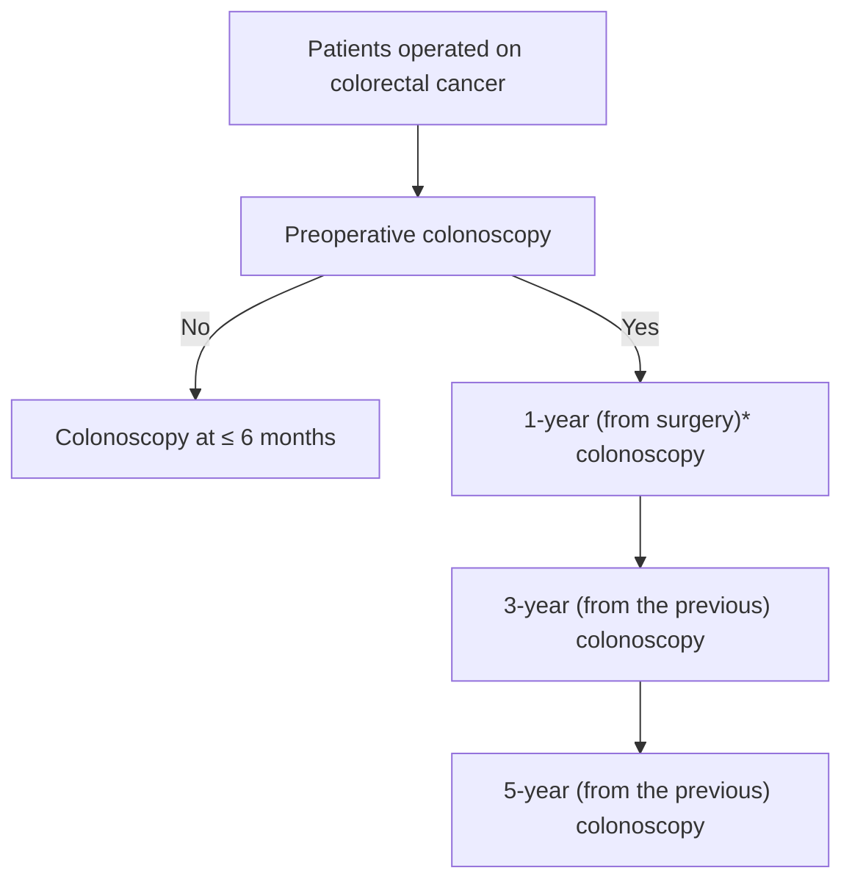

# Endoscopic surveillance after surgical or endoscopic resection for colorectal cancer: European Society of Gastrointestinal Endoscopy (ESGE) and European Society of Digestive Oncology (ESDO) Guideline

## Authors

Cesare Hassan1, Piotr Tomasz Wysocki2, Lorenzo Fuccio3, Thomas Seufferlein4, Mário Dinis-Ribeiro5, Catarina Brandão5, Jaroslaw Regula6, Leonardo Frazzoni3, Maria Pellise7, Sergio Alfieri8, Evelien Dekker9, Rodrigo Jover10, Gerardo Rosati11, Carlo Senore12, Cristiano Spada13, Ian Gralnek14, Jean-Marc Dumonceau15, Jeanin E. van Hooft9, Eric van Cutsem16, Thierry Ponchon17

## Institutions

1. Gastroenterology Unit, Nuovo Regina Margherita Hospital, Rome, Italy
2. Maria Sklodowska-Curie Memorial Cancer Centre and Institute of Oncology, Warsaw, Poland
3. Department of Medical and Surgical Sciences, S. Orsola-Malpighi Hospital, University of Bologna, Bologna, Italy
4. Department of Internal Medicine I, Ulm University Hospital, Ulm, Germany
5. CIDES/CINTESIS, Faculty of Medicine, University of Porto, Porto, Portugal
6. Medical Centre for Postgraduate Education, Maria Sklodowska-Curie Memorial Cancer Centre and Institute of Oncology, Warsaw, Poland
7. Gastroenterology Department, Endoscopy Unit, ICMDiM, Hospital Clinic, CIBEREHD, IDIBAPS, University of Barcelona, Catalonia, Spain
8. Fondazione Policlinico A. Gemelli, IRCCS, Università Cattolica del Sacro Cuore, Rome, Italy
9. Department of Gastroenterology and Hepatology, Amsterdam University Medical Centers, University of Amsterdam, Amsterdam, The Netherlands;
10. Service of Digestive Medicine, Alicante Institute for Health and Biomedical Research (ISABIAL-FISABIO Foundation), Alicante, Spain
11. Medical Oncology Unit, S. Carlo Hospital, Potenza, Italy
12. Azienda Ospedaliero Universitaria Cittá della Salute e della Scienza Centro per l'Epidemiologia e la Prevenzione Oncologica in Piemonte, Turin, Italy
13. Digestive Endoscopy Unit, Fondazione Poliambulanza, Brescia, Italy
14. Institute of Gastroenterology, Hepatology and Nutrition, Emek Medical Center, Afula, Israel
15. Gedyt Endoscopy Center, Buenos Aires, Argentina
16. University Hospitals Gasthuisberg, Leuven, Belgium
17. Gastroenterology and Endoscopy, Edouard Herriot Hospital, Lyon, France

Appendix 1s – 3s, Table 1s – 3s
Online content viewable at:
https://doi.org/10.1055/a-0831-2522

## Bibliography

DOI https://doi.org/10.1055/a-0831-2522
Published online: 5.2.2019 | Endoscopy 2019; 51: 266–277
© Georg Thieme Verlag KG Stuttgart · New York
ISSN 0013-726X

## Corresponding author

Cesare Hassan, MD, Gastroenterology Unit, Nuovo Regina Margherita Hospital, Via E. Morosini 30, 00153 Rome, Italy
cesareh@hotmail.com

## MAIN RECOMMENDATIONS

1. We recommend post-surgery endoscopic surveillance for CRC patients after intent-to-cure surgery and appropriate oncological treatment for both local and distant disease.
Strong recommendation, low quality evidence.
2. We recommend a high quality perioperative colonoscopy before surgery for CRC or within 6 months following surgery.
Strong recommendation, low quality evidence.
3. We recommend performing surveillance colonoscopy 1 year after CRC surgery.
Strong recommendation, moderate quality evidence.
4. We do not recommend an intensive endoscopic surveillance strategy, e.g. annual colonoscopy, because of a lack of proven benefit.
Strong recommendation, moderate quality evidence.
5. After the first surveillance colonoscopy following CRC surgery, we suggest the second colonoscopy should be performed 3 years later, and the third 5 years after the second. If additional high risk neoplastic lesions are detected, subsequent surveillance examinations at shorter intervals may be considered.
Weak recommendation, low quality evidence.
6. After the initial surveillance colonoscopy, we suggest halting post-surgery endoscopic surveillance at the age of 80 years, or earlier if life-expectancy is thought to be limited by comorbidities.
Weak recommendation, low quality evidence.
7. In patients with a low risk pT1 CRC treated by endoscopy with an R0 resection, we suggest the same endoscopic surveillance schedule as for any CRC.
Weak recommendation, low quality evidence.

> **PUBLICATION INFORMATION**
>
> This Guideline is an official statement of the European Society of Gastrointestinal Endoscopy (ESGE) and Digestive Oncology (ESDO) on the surveillance of colorectal cancer after endoscopic or surgical resection. The Grading of Recommendations Assessment, Development, and Evaluation (GRADE) system was adopted to define the strength of recommendations and the quality of evidence.

| Abbreviation | Definition |
|---|---|
| **AFAP** | attenuated familial adenomatous polyposis |
| **CEA** | carcinoembryonic antigen |
| **CI** | confidence interval |
| **CRC** | colorectal cancer |
| **CTC** | computed tomography colonography |
| **ESDO** | European Society of Digestive Oncology |
| **ESGAR** | European Society of Gastrointestinal and Abdominal Radiology |
| **ESGE** | European Society of Gastrointestinal Endoscopy |
| **FAP** | familial adenomatous polyposis |
| **FIT** | fecal immunochemical test |
| **GRADE** | Grading of Recommendations Assessment, Development, and Evaluation |
| **LVI** | lymphovascular invasion |
| **OR** | odds ratio |
| **PICO** | population, intervention, comparator, outcome |
| **PNI** | perineural invasion |
| **RCT** | randomized controlled trial |
| **SIR** | standardized incidence ratio |
| **SPS** | serrated polyposis syndrome |

## Introduction

Endoscopic surveillance after surgery for colorectal cancer (CRC) requires a multidisciplinary approach among several specialties, including endoscopy, oncology, and surgery. Its relevance is expected to increase in the near future, being directly related to the high prevalence of CRC, which now ranks as the third most prevalent cancer in Western countries [1].

The role of surveillance endoscopy in this setting relates to the detection of metachronous and recurrent CRC, and its efficacy in thereby improving outcomes for CRC. This is in contrast to the setting of post-polypectomy colonoscopy surveillance, where clinically relevant precancerous lesions, rather than already developed CRCs, are the main target of the intervention. Surveillance colonoscopy represents the primary modality for the prevention and early detection of metachronous CRC and is usually integrated with other biochemical and radiological tests for the detection of local and distal malignant recurrences [2]. However, endoscopy capacity is limited, so the appropriate use of endoscopy resources in surveillance post-CRC surgery is desirable.

Endoscopic surveillance is also performed following complete endoscopic resection of early (invasive) CRCs, previously known as "malignant polyps." The rate of early CRC amenable to endoscopic resection – i.e. with low risk of lymph node or distant metastasis – increased dramatically with the implementation of organized programs [3]. Approximately 10 % of CRCs diagnosed in fecal immunochemical test (FIT)-based programs are removed endoscopically, accounting for nearly a half of all CRCs detected at an early stage [4, 5].

The aim of this joint guideline by the European Society of Gastrointestinal Endoscopy (ESGE) and the European Society of Digestive Oncology (ESDO) is to provide guidance on the use of colonoscopy surveillance after surgery for CRC, as well as after complete endoscopic resection of an early CRC.

## Methods

This guideline was commissioned by the ESGE and the ESDO. Each society nominated four or five experts for a multidisciplinary task force. In 2017, subgroups were formed, each of which was in charge of a series of clearly defined key questions that were formulated using the PICO (population, intervention, comparator, outcome) methodology [6], as detailed in **Appendix 1s** (see online-only Supplementary Material).

The guideline committee chairs (C.H., J.R., L.F., T.S., and M.P.) worked with the subgroup leaders to identify pertinent systematic search terms that included "colon," "rectum," "general surgery/surgery," "resection," "colectomy," "colonoscopy," "endoscopy," "surveillance," and "follow up." Searches were performed (at least) on Medline (via PubMed) and the Cochrane Central Register of Controlled Trials up to October 2017. Evidence tables were generated for each key question, summarizing the level of evidence from the available studies. For important outcomes, articles were individually assessed using the GRADE system to grade the evidence levels and recommendation strengths [7] (**Appendix 2s**). According to the GRADE system, a hierarchy across the main outcomes according to clinical relevance was set before the risk/benefit ratio was assessed, as detailed in **Appendix 3s**.

It was decided that the issues of computed tomography colonography (CTC) in patients with obstructing CRC and "quality of colonoscopy" would be excluded from the content of this guideline as these topics have been addressed in a previously published joint guideline by the ESGE and the European Society of Gastrointestinal and Abdominal Radiology (ESGAR) [8], and in a dedicated document by the ESGE and United European Gastroenterology [9]. In addition, patients with genetic or environmental syndromes of CRC, such as Lynch syndrome, serrated polyposis syndrome (SPS), familial adenomatous polyposis (FAP), attenuated FAP (AFAP), and MYH-associated polyposis (MAP), were excluded from this guideline; surveillance in these high risk conditions will be addressed in a future ESGE guideline. Therefore, this guideline applies only to those operated on for sporadic CRC and those in whom a low risk T1 CRC has been completely removed at endoscopy.

The different subgroups developed draft proposals that were presented to the entire group for general discussion during a meeting held in July 2018 in Munich. Further details on the methodology of ESGE guidelines have been reported elsewhere [10]. In July 2018, a draft prepared by C.H., J.R., L.F., and P.W. was sent to all group members. After the agreement of all group members had been obtained, the manuscript was reviewed by two members of the ESGE governing board and two external reviewers, and was then sent for further comments to the ESGE national societies and individual members. After this it was submitted to *Endoscopy* for publication.
This guideline was issued in 2018 and will be considered for update in 2023. Any interim updates will be noted on the ESGE website: http://www.esge.com/esge-guidelines.html.

## 1 Prerequisites for surveillance

### 1.1 Surveillance after intent-to-cure surgery

> **RECOMMENDATION**
>
> We recommend post-surgery endoscopic surveillance for CRC patients after intent-to-cure surgery and appropriate oncological treatment for both local and distant disease.
> Strong recommendation, low quality evidence.

Postoperative surveillance in patients treated for CRC by curative surgery has been investigated in multiple studies using multimodal examination protocols that usually include postoperative colonoscopy [11–18]. While the survival benefit associated with intensive multimodal follow-up of CRC patients is questionable [19–22], results of two meta-analyses suggest that inclusion of colonoscopy in the follow-up protocol is associated with lower mortality (as compared to patients followed with surveillance strategies lacking endoscopy), although a frequent colonoscopy does not result in any additional survival benefit [21, 22]. In another study, colonoscopy was responsible for the detection of the highest proportion of resectable recurrences (44%) out of all examination modalities [12], providing further evidence in favor of colonoscopy surveillance after CRC surgery.

Candidacy for colonoscopic surveillance is often poorly defined. We identified 61 studies that evaluated colonoscopy as a primary method for detection of intraluminal recurrences or metachronous neoplasia in postoperative CRC patients (**Table 1s**). Among 54 studies with full text available, 22 (41%) enrolled CRC patients after curative surgery (with only six studies offering some definition of the curative treatment [23–28]), 14 (26%) included patients after intent-to-cure surgery, while 18 (33%) contained no information on the surgical intent or outcomes. Furthermore, the studies included patients in various CRC stages: 27 (50%) evaluated patients after treatment of non-metastatic CRC only, 16 (30%) included some patients treated for metastatic disease (but offered no stratified data on endoscopic surveillance in those patients with metastatic disease), and 11 (20%) lacked information on the CRC stage.

Little information has been offered on the use of adjuvant treatment and its effect on endoscopic surveillance – six studies presented some data on the use of postoperative treatment and one study reported no association between the use of adjuvant chemotherapy and metachronous neoplasia rates [29]. There are no data on endoscopic surveillance in CRC patients in palliative care either for the primary CRC or metastatic disease; however, with a median overall survival of 17 months, even after palliative resection of the primary tumor [30, 31], these patients are unlikely to benefit from colonoscopic surveillance. Hence, because of a lack of specific data with regard to the influence of surgical intent (curative vs. intent-to-cure), primary disease stage, and oncological therapy on endoscopic surveillance results, we conclude that colonoscopy should be offered to CRC patients in all stages of disease who have undergone intent-to-cure surgery and appropriate oncological treatment.

### 1.2 Perioperative colonoscopy for CRC surgery

> **RECOMMENDATION**
>
> We recommend a high quality perioperative colonoscopy before surgery for CRC or within 6 months following surgery.
> Strong recommendation, low quality evidence.

Patients receiving surgery for CRC remain at slightly increased risk of metachronous CRC, with an increase of 1.5–2 fold compared with the general population, which corresponds to a 1%–2% long-term risk [32–35]. The quality of colonoscopy is likely to play a major role in this risk for the following reasons. First, most of the increased risk appears to be concentrated in the initial 2–3 years following surgery [32, 35–37]. Second, a substantial proportion of metachronous CRC lesions are diagnosed early after the planned surveillance colonoscopy [33]. Third, it has been estimated that approximately half of the metachronous CRC risk is related to a lesion that was missed at index colonoscopy [34]. Fourth, subtle, small or flat morphology lesions – more prone to be missed at baseline examination – were frequently associated with metachronous CRC [34]. Fifth, metachronous CRC rates appear to be higher in the proximal colon [35], the bowel segment where neoplasia detection requires a higher degree of operator competence. Sixth, previous colorectal surgery has been associated with a higher risk of inadequate bowel preparation [38–41]. Seventh, a small subset of CRC patients (2%–4%) is affected by synchronous CRC and, when such lesions are missed at index colonoscopy, they may be later misinterpreted as metachronous lesions [42, 43].

### 1.3 Quality of colonoscopy

The quality of colonoscopy has been strongly associated with the risk of post-colonoscopy CRC [44, 45, 46]. Incomplete colonoscopy, rapid withdrawal time, and suboptimal adenoma detection rate have all been associated with a higher risk of post-colonoscopy CRCs [44, 47–49]. Conversely, an improvement in the quality of colonoscopy, along with a meticulous and proficient examination technique have been associated with a substantial reduction in the risk of post-colonoscopy CRC, as well as an increased detection of precancerous lesions [50–52]. Although studies in the setting of post-surgical CRC are lacking, an improvement in the quality of colonoscopy is likely to represent the most effective and efficient response to this increased risk of metachronous CRC [53].

The ESGE have already provided a detailed document on the quality indicators of colonoscopy, and all of these indicators may be applicable to this specific setting [9, 54]. Of note, most of these quality indicators require an ongoing audit within the endoscopy center that by itself should represent the main prerequisite in order to achieve high quality of colonoscopy [9, 54].

It is beyond the scope of this document to re-address the colonoscopy quality indicators already published by ESGE [9, 54]. However, our group decided to emphasize the role of split-dose colonoscopy preparation and meticulous examination. First, a randomized study in patients having surgery for CRC has shown the high degree of efficacy of two cleansing regimens – one high volume and one low volume – when delivered in a split-dose regimen [55]. Second, a higher risk for metachronous CRC located in the proximal colon has been shown in this setting, as well as more frequent flat morphology [34]. Therefore, a high degree of competence in the detection of these subtle lesions is required, as in the detection of dysplasia in inflammatory bowel disease [56] or Lynch syndrome [57].

Despite the lack of direct evidence, indicators of a quality examination should include a meticulous and slow examination of the mucosa during colonoscope withdrawal, use of high definition colonoscopy, and competence in detecting non-polypoid neoplasia.

### 1.4 Timing

Perioperative high quality colonoscopy should ideally be performed prior to surgery. Its clinical relevance relates to accurately locating the CRC lesion (e.g. with use of anatomical landmarks or endoscopic tattooing) for surgical planning, as well as to identifying synchronous lesions that may alter the surgical approach. When synchronous lesions are identified and are located close to the CRC lesion but are not endoscopically removed, it may be useful to place two tattoos, one distally and one proximally to the synchronous lesion(s). Before the patient is entered into a post-surgical surveillance program, complete surgical removal of these synchronous lesions should be completed. When synchronous lesions are found in a bowel segment different from the location of the index CRC, endoscopic resection of these synchronous lesions should be performed before surgery.

In some situations, preoperative colonoscopy may not be feasible. For example, when there is an obstructing CRC, a previous ESGE document recommended presurgical CTC [8]. In this case, as well as for any other circumstances where the colonoscopy is suboptimal or incomplete, perioperative colonoscopy should be performed very early after surgery, within 6 months at the most, in order to detect possible synchronous invasive or advanced lesions. In particular, if adjuvant chemotherapy is planned, colonoscopy should be performed prior to chemotherapy, but chemotherapy should not be delayed.

> **RECOMMENDATION**
>
> We recommend performing surveillance colonoscopy 1 year after CRC surgery.
> **Strong recommendation, moderate quality evidence.**

## 2 Post-CRC endoscopic surveillance

The two main targets of endoscopic surveillance are early diagnosis of metachronous CRC and/or intraluminal recurrence of the index cancer.

### 2.1 Metachronous CRC

#### 2.1.1 Epidemiology studies

In a Dutch study with 39 974 person-years of follow-up, the mean annual incidence of metachronous CRC was 0.3%. This corresponds to a cumulative incidence of 1.1% at 3 years, 2.0% at 6 years, and 3.1% at 10 years (standardized incidence ratio [SIR] 1.3, 95% confidence interval [CI] 1.1–1.5). This difference was observed particularly during the first 3 years following the initial CRC diagnosis (SIR 1.4, 95%CI 1.1–1.8) [43]. These data were confirmed by an absolute estimate of 1.8% for metachronous CRCs at 81 months.

In a post hoc analysis of a large clinical study with 15 345 person-years of follow-up, a cumulative incidence of 1.5% (95% CI 1.1% – 2.0%) was found for metachronous CRC at 5 years, corresponding to an SIR of 1.6 (95% CI 1.2 – 2.2) as compared to the general population [33]. In a French study including 61 879 person-years of follow-up, the incidence of metachronous CRC following the diagnosis of an initial CRC was higher than expected (SIR 1.5, 95% CI 1.3 – 1.7). It remained higher throughout the study period, significantly so between the first and the fifth years following diagnosis (SIR 1.9, 95% CI 1.6 – 2.3) [58]. While direct comparisons are lacking, such excessive risk of metachronous cancer compared with the general population would appear to be of the same magnitude as that following resection of high risk precancerous lesions [53, 59].

The risk of metachronous CRC appears to be substantially higher in older studies or in those where preoperative colonoscopy was not systematically performed. For instance, in a clinical study from Korea, the risk of metachronous cancer in a population of 1049 subjects followed up for a mean of 41 months was approximately 0.2% per year [60]. A similar estimate was observed in smaller Korean and UK studies [29, 61]. No metachronous cancer was detected in a French series where patients with metachronous cancer detected at perioperative colonoscopy were excluded [26].

#### 2.1.2 Endoscopic studies

We recently performed a systematic review of endoscopic studies in the setting of post-CRC surgery, in order to provide a reliable estimate of the adjusted incidence rate of metachronous CRC [62]. We included 27 studies that enrolled 15 589 patients for a total of 15 803 index CRCs. The mean length of follow-up ranged from 18 to 108 months. The overall cumulative incidence of metachronous CRC was 2.2% (95% CI 1.8% – 2.9%).

#### 2.1.3 Timing of metachronous CRC

Most studies indicate a higher risk for metachronous CRC in the initial years following surgery. A higher incidence in the first 2–3 years of follow-up has been reported in several epidemiological studies [32, 34, 36, 37, 63, 64]. This finding was also confirmed in our systematic review of endoscopic studies, which clearly showed that the risk of metachronous CRC was highest in the first 36 months following surgical resection and significantly decreased thereafter [62]. Notably, about half of all metachronous CRCs discovered were diagnosed within 36 months and 70% within 60 months following surgical resection. This may be related to the quality of perioperative colonoscopy being undefined, as most of the series included in our systematic review commenced enrollment before 2000, with some as early as the 1970s.

In a large series of 3846 Chinese patients where a perioperative colonoscopy was systematically required to be performed, the majority of CRCs developed after 40 months from the index surgery [65]. Similarly, other studies have shown low to no risk of early CRC in multiple cohorts with the systematic use of perioperative colonoscopy [66–71]; however, a lead time bias cannot be excluded. For instance, a large study reported an inverse association between the time-interval of surveillance colonoscopy and the risk of metachronous CRC [72].

#### 2.1.4 Risk stratification

A few epidemiological and clinical studies have assessed whether the risk of metachronous CRC following surgery differs according to the main clinical or pathological features of the baseline cancer (**Table 2s**). Among the demographic variables, increasing age and sex were assessed and were not related to an increased risk of metachronous CRC [32, 58, 65, 72–74]. The site of the primary CRC being located proximally to the splenic flexure was associated with an increased risk of metachronous CRC in a population-based prospective study conducted among 5006 Swiss patients [73] and in a population-based study comprising 7863 subjects from the USA, Canada, Australia, and New Zealand [72]. However, a Dutch study including 10 283 patients [32], a French study including 10 801 patients [58], and a recent Portuguese study including 535 patients [74] have failed to confirm these findings. Conversely, a Spanish study reported an increased risk of metachronous adenomas and CRCs in patients with left-sided primary tumors [75]. Absence of a high quality baseline colonoscopy, defined as a complete examination with fair or good bowel cleansing, was linked to an increased risk of metachronous CRC in one small retrospective study [74].

In conclusion, data on the risk factors for metachronous CRC are limited and often conflicting, therefore a recommendation for risk stratification for endoscopic surveillance cannot be made in this guideline.

#### 2.1.5 Rate of early stage at diagnosis and cure of metachronous CRC

Studies consistently demonstrate that metachronous CRCs detected during colonoscopy surveillance are less advanced than index cancers and most are early stage lesions that are amenable to reoperation with curative intent [13, 27, 33, 58, 65, 66, 74, 76–83]. Kahi et al. performed an analysis of pooled data from 31 studies, which showed that approximately two-thirds of metachronous CRCs are asymptomatic, detected at an early stage (TNM I-II, or Dukes A-B), and operated on with curative intent [84]. Radical surgery is possible more often for metachronous CRC than for local recurrence (67%–86% vs. 7%–22%, respectively) [77]. Consequently, the survival from metachronous CRC appears not to be compromised relative to that observed in patients with a single CRC lesion [85, 86].

### 2.2 Intraluminal recurrence

#### 2.2.1 Timing of intraluminal recurrence

According to our meta-analysis, intraluminal CRC recurrences are more frequently detected endoscopically within the first 24 months postoperatively than in the more distant follow-up period [62]. During the initial 2 years, the cumulative proportion of recurrent intraluminal cancers detected is 70.5%, with the highest rates being observed 6–12 months following CRC resection (recurrence in 1.7% of patients).
Furthermore, a separate study demonstrated that early postoperative colonoscopy is cost-effective. The number of 1-year colonoscopies needed to detect one CRC and to prevent one CRC-related death was 143 and 926, respectively. Moreover, the incremental cost of performing a 1-year colonoscopy (as compared to not performing it) is $40 313 per life-year gained [87]. Given these results, it appears that early surveillance colonoscopy (performed within 1 year following surgery) is economically justified.

#### 2.2.2 Risk stratification

**2.2.2.1 Tumor location** Although the incidence of malignant recurrence at the site of surgical anastomosis varies widely, reports consistently demonstrate a higher prevalence of rectal cancer recurrences [88–96] than colon cancer recurrences [89, 91, 97–99]. It has been estimated that more than 80% of all malignant recurrences occur in the rectum or distal colon [84]. This is further supported by the results of a recent meta-analysis that demonstrated a higher rate of endoscopically detected malignant relapses in patients with rectal cancer than with colon cancer (odds ratio [OR] 2.66, 95%CI 1.31–5.41) [62]. It also appears that the specific rectal cancer location (upper, middle, or lower rectum) is not related to the recurrence risk [95]. For colon cancer, while one study failed to identify differences between left- and right-sided colonic tumors in terms of recurrence incidence [89], others observed that malignant recurrences are more common for primary tumors located in the left side of the colon [100].

**2.2.2.2 Other risk factors** Multiple studies have investigated factors other than tumor location on the risk of anastomotic or intraluminal CRC recurrence, yet they have largely produced inconclusive results (**Table 2s**). For example, tumor size larger than 5–6 cm [88, 89], stage T3–T4 [95], and advanced nodal involvement (N2) [89] have been reported to influence tumor recurrence rates in rectal cancer, with other studies contradicting these associations [92, 101]. With regards to histology, degree of differentiation (grade) appears not to influence the risk of malignant recurrence [89, 91, 95, 101]. Nonetheless, it has been reported that the anastomotic and intraluminal recurrence risks are associated with mucinous differentiation of tumor cells [88, 89], lymphovascular invasion (LVI) [89, 101, 102], and perineural invasion (PNI) [89], with the impact of LVI and PNI in rectal cancer being questioned [92, 95].

It has been shown that, in patients undergoing total mesorectal excision, a clear distal margin of < 10 mm is adequate to prevent anastomotic recurrences in rectal cancer [89, 92, 95, 96], with Nash et al. reporting otherwise when the margin is smaller than 8 mm [101]. Although involvement of the circumferential margin is an established risk factor for local relapses in rectal cancer [103, 104], it appears not to influence the anastomotic recurrence rates specifically [92, 95].

Other factors studied in the context of their influence on anastomotic recurrence risk include intraoperative bowel lavage, use of staplers in rectal cancer surgery [105–108], use of adjuvant treatment [89, 92, 95, 109], perioperative complications [89], and patient age, among others [89, 91, 92, 95]. With limited and conflicting evidence on the contribution of these factors to recurrence risk, no position can be taken on their use in stratifying patients with CRC to distinct colonoscopy surveillance strategies.

### 2.3 Summary

The main reason to perform surveillance colonoscopy at 1 year following surgical resection (or the perioperative colonoscopy) is the known early (within 12–24 months) intraluminal recurrence rate following CRC surgery. A similar pattern of early recurrence has also been demonstrated for metachronous CRC, which therefore further supports an early rather than delayed surveillance colonoscopy.

### 2.4 Intensive endoscopic surveillance

> **RECOMMENDATION**
>
> We do not recommend an intensive endoscopic surveillance strategy, e.g. annual colonoscopy, because of a lack of proven benefit.
> Strong recommendation, moderate quality evidence.

The benefit associated with intensive multimodality follow-up of postoperative CRC patients remains controversial. Although most individual trials [11–14, 17, 77, 110] have failed to demonstrate a survival benefit with intensive follow-up, several older meta-analyses have reported an improvement in overall survival in intensively surveilled populations. Interestingly however there was no improvement in CRC-specific survival [21, 22, 111, 112].

In an attempt to bring clarity to this matter, two large follow-up trials were recently performed using computed tomography (CT) and carcinoembryonic antigen (CEA) testing in retrospective [113] and prospective settings (examinations at 6, 12, 18, 24, and 36 months after surgery in the intensive group vs. at 12 and 36 months after surgery in the routine group) [114]. These studies failed to demonstrate any benefit of intensive follow-up, either in CRC-specific or overall survival, of patients following curative CRC surgery. The findings are in agreement with the results of a recent meta-analysis [19] and a Cochrane systematic review [20]. While the aforementioned studies generally do not contain information on the specific impact of endoscopy on patient outcomes, it is reasonable to assume that the lack of benefit from intensive multimodality follow-up also relates to the absence of benefit from the intensive use of each of the individual examinations, including colonoscopy.

Of the limited number of studies that have separately analyzed colonoscopy follow-up, two meta-analyses have suggested that more frequent endoscopic examination does appear to translate into additional survival benefit [21, 22]. One randomized controlled trial (RCT) evaluated the role of colonoscopy intensity specifically, performing examinations at 3-monthly intervals for 1 year, at 6-monthly intervals for the next 2 years, and once a year thereafter in an "intensive" follow-up group, and at 6 months, 30 months, and 60 months postoperatively in a "routine" follow-up group [23]. While the authors of this study reported that more frequent examinations resulted in higher detection rates of asymptomatic recurrence, more curative surgeries, and improved survival in patients who had intraluminal recurrences, they failed to observe improved overall survival in the intensive surveillance group.

Accordingly, in light of the evidence, we deem intensive surveillance in general and intensive endoscopic surveillance in particular not to be justified.

### 2.5 Second and subsequent colonoscopies

> **RECOMMENDATION**
>
> After the first surveillance colonoscopy following CRC surgery, we suggest the second colonoscopy should be performed 3 years later, and the third 5 years after the second. If additional high risk neoplastic lesions are detected, subsequent surveillance examinations at shorter intervals may be considered.
> Weak recommendation, low quality evidence.

According to epidemiological studies, the long-term risk of metachronous CRC is not, or is only slightly, increased compared with the general population [32, 33, 53, 58, 59, 115]. As reported above, such risk is mainly concentrated in the early period following surgery, thereby supporting a missed lesion at the time of index colonoscopy being the most plausible reason. The sequence of two high quality colonoscopies – i.e. perioperative and 1 year after CRC surgery – appears to be an effective response to minimize such risk, at least in those patients without additional synchronous or metachronous lesions.

The main reason for subsequent surveillance colonoscopies is therefore that CRC prevention is based on the detection of precancerous lesions. However, unlike in post-polypectomy surveillance, the issue of cancer prevention in CRC patients has rarely been addressed in the literature. Specifically, following CRC surgery, the risk of metachronous advanced adenomas, which may be considered to be a surrogate for CRC prevention, has been estimated in only a few studies and without direct comparison to any reference standard (**Table 3s**). For example, a Korean study estimated a 4.4% incidence of advanced adenomas at 41 months [60]. Similarly, a ≤ 10% risk of advanced neoplasia has been estimated in smaller clinical studies [29, 61, 116], with a higher incidence described in patients with a history of left colonic resection [68, 117].

These risks appear in general to be lower than, or equivalent to, those reported at post-polypectomy surveillance in patients with high risk adenomas [118–120]. As the ESGE guidelines on post-polypectomy surveillance suggest 3-year and 5-year intervals for the first and subsequent surveillance colonoscopies following resection of advanced adenomas [121], these same recommendations may be applied following a 1-year surveillance colonoscopy (**Fig. 1**).

---

**Fig. 1** Endoscopic surveillance intervals following surgical or endoscopic resection of colorectal cancer. \*From the perioperative colonoscopy in those with no preoperative colonoscopy

---

### 2.5.1 Metachronous high risk neoplasia

Patients undergoing surgery for CRC may be diagnosed with an advanced adenoma that by itself requires additional surveillance. According to epidemiological studies, 4.5% of patients with CRC have a synchronous CRC [43] and approximately 21% of patients have a synchronous adenoma [58]. A recent endoscopy-based study found higher percentages of synchronous adenomas and advanced adenomas at 28% and 19%, respectively [74]. Interestingly, these percentages were even higher when the analysis was restricted to high quality baseline colonoscopy, reaching 38% for adenomas and 27% for advanced adenomas.

The role of synchronous CRC as a risk factor for metachronous CRC is controversial: some studies have reported synchronous CRC to be associated [32, 72] with an increased risk of metachronous CRC, while others have not [58, 65]. Synchronous advanced adenomas have been reported to be associated with an increased probability of metachronous CRC [74, 75]; however, this is based on small retrospective studies and therefore no firm conclusion can be drawn.

As a result, it is acceptable to propose a subsequent surveillance colonoscopy at 3 years following the second surveillance colonoscopy in those patients with additional advanced lesions at previous examinations.

## 2.5.2 Discontinuation of surveillance

> **RECOMMENDATION**
>
> After the initial surveillance colonoscopy, we suggest halting post-surgery endoscopic surveillance at the age of 80 years, or earlier if life-expectancy is thought to be limited by comorbidities.
> **Weak recommendation, low quality evidence.**

In line with what has been reported for post-polypectomy surveillance, endoscopic surveillance is of limited, if any, benefit in patients ≥ 80 years of age owing to the significant risk of competing causes of mortality, such as cardiovascular and other malignant diseases [122]. This also applies to younger patients with severe comorbidities that affect their expected lifespan. Therefore, individualized recommendations should be based on general health status, comorbidity, and the findings at previous colonoscopies.

## 3 Endoscopic surveillance of T1 cancers that are endoscopically removed

> **RECOMMENDATION**
>
> In patients with a low risk pT1 CRC treated by endoscopy with an R0 resection, we suggest the same endoscopic surveillance schedule as for any CRC.
> Weak recommendation, low quality evidence.

T1 CRCs are usually classified as high risk T1 CRC if one or more of the following criteria are present: (i) poor differentiation, (ii) deep submucosal invasion (i.e. ≥ 1000 μm, meaning SM2–3 in non-pedunculated tumors and Haggitt 4 in pedunculated tumors), (iii) LVI, (iv) intense tumor budding, and (v) resection margins that are positive (R1) or cannot be determined (Rx). When all these factors are absent, T1 CRCs are considered low risk [123–125].

Whereas most of these characteristics are intrinsic to the polyp biology, the resection margin is related to the technique of resection, namely en bloc or piecemeal. The definition of a positive resection margin varies between authors and has been defined as: cancer that is within the diathermy margin, within one high-power field of the margin, ≤ 0.1 mm from the margin, ≤ 1 mm from the margin, or ≤ 2 mm from the margin. Current European guidelines recommend a level of ≤ 1 mm should be considered to represent margin involvement [126, 127].

Low risk T1 CRC polyps that are removed endoscopically with clear margins will not need additional surgical resection. There are no data in the literature specifically addressing the question of surveillance following endoscopic resection of pT1 cancer, only data addressing the prognosis of pT1 CRC, from which we can indirectly infer the need for further surveillance.

It is considered that the risk of local and distant recurrence after an R0 resection of a low risk pT1 CRC is negligible [5]. Asian studies have reported an overall adverse event rate of 0.8% (1/120) and 1.7% (1/60) in patients with low risk T1 CRC in whom a "wait-and-see" policy was followed [128, 129]. In a recent retrospective, multicenter, Dutch cohort study, whose main objective was to assess the incidence of and risk factors for incomplete endoscopic resection of a low risk T1 CRC after a macroscopically complete endoscopic resection, only 1/140 patients had an incomplete histologic resection margin (0.7%, 95%CI 0–2.1%) [130]. Eckhart et al. showed no difference in metachronous disease between patients followed up after benign polyp excision and those followed up for severely dysplastic or malignant polyps [131].

In summary, the risk of residual local disease following an R0 endoscopic resection of a low risk T1 CRC appears to be negligible and well offset by the 1-year surveillance recommended for CRC patients in general.

## Disclaimer

The legal disclaimer for ESGE Guidelines [10] applies to the current Guideline.

## Acknowledgments

The authors gratefully acknowledge Dr. Enrique Quintero, Gastroenterology Department, University Hospital of the Canary Islands, Tenerife, Spain for his critical review of the guideline.

### Competing interests

E. Dekker has provided consultancy to Olympus (2017) and Fujifilm (2016–2017), has received a speaker's fee from Olympus (April 2018), and is a co-editor for *Endoscopy*. R. Jover is an advisor to Norgine (2010–2018) and to Alfa-Sigma (2017–2018). T. Ponchon has been on the advisory board of Olympus (2018) and his department has received clinical research funding from Fujifilm (2018). T. Seufferlein is vice-president of the German Cancer Society (2018). J. E. van Hooft received lecture fees from Medtronics (2014–2015) and provided consultancy to Boston Scientific (2014–2016), her department has received research grants from Cook Medical (2014–2018) and Abbott (2014–2017). A. Alfieri, M. Dinis-Ribeiro, J.-M. Dumonceau, L. Frazzoni, L. Fuccio, I. Gralnek, C. Hassan, C. Lopes Brandão, M. Pellisé, J. Regula, G. Rosati, C. Senore, C. Spada, E. van Cutsem, and P. Wysocki have no competing interests.

## References

[1] Torre LA, Bray F, Siegel RL et al. Global cancer statistics, 2012. CA Cancer J Clin 2015; 65: 87–108

[2] van der Stok EP, Spaander MCW, Grünhagen DJ et al. Surveillance after curative treatment for colorectal cancer. Nat Rev Clin Oncol 2016; 14: 297

[3] Levin TR, Corley DA, Jensen CD et al. Effects of organized colorectal cancer screening on cancer incidence and mortality in a large, community-based population. Gastroenterology 2018; 155: 1383–1391.e5

[4] Logan RF, Patnick J, Nickerson C et al. Outcomes of the bowel cancer screening programme (BCSP) in England after the first 1 million tests. Gut 2012; 61: 1439–1446

[5] Williams JG, Pullan RD, Hill J et al. Management of the malignant colorectal polyp: ACPGBI position statement. Colorectal Dis 2013; 15: (Suppl. 02): 1–38

[6] Richardson WS, Wilson MC, Nishikawa J et al. The well-built clinical question: A key to evidence-based decisions. ACP J Club 1995; 123: A12–A13

[7] Atkins D, Best D, Briss PA et al. Grading quality of evidence and strength of recommendations. BMJ 2004; 328: 1490

[8] Spada C, Stoker J, Alarcon O et al. Clinical indications for computed tomographic colonography: European Society of Gastrointestinal Endoscopy (ESGE) and European Society of Gastrointestinal and Abdominal Radiology (ESGAR) Guideline. Endoscopy 2014; 46: 897–915

[9] Kaminski MF, Thomas-Gibson S, Bugajski M et al. Performance measures for lower gastrointestinal endoscopy: a European Society of Gastrointestinal Endoscopy (ESGE) quality improvement initiative. United European Gastroenterol J 2017; 5: 309–334

[10] Dumonceau JM, Hassan C, Riphaus A et al. European Society of Gastrointestinal Endoscopy (ESGE) Guideline Development Policy. Endoscopy 2012; 44: 626–629

[11] Rosati G, Ambrosini G, Barni S et al. A randomized trial of intensive versus minimal surveillance of patients with resected Dukes B2-C colorectal carcinoma. Ann Oncol 2016; 27: 274–280

[12] Rodriguez-Moranta F, Salo J, Arcusa A et al. Postoperative surveillance in patients with colorectal cancer who have undergone curative resection: a prospective, multicenter, randomized, controlled trial. J Clin Oncol 2006; 24: 386–393

[13] Schoemaker D, Black R, Giles L et al. Yearly colonoscopy, liver CT, and chest radiography do not influence 5-year survival of colorectal cancer patients. Gastroenterology 1998; 114: 7–14

[14] Makela JT, Laitinen SO, Kairaluoma MI. Five-year follow-up after radical surgery for colorectal cancer. Results of a prospective randomized trial. Arch Surg 1995; 130: 1062–1067

[15] Secco GB, Fardelli R, Gianquinto D et al. Efficacy and cost of risk-adapted follow-up in patients after colorectal cancer surgery: a prospective, randomized and controlled trial. Eur J Surg Oncol 2002; 28: 418–423

[16] Wattchow DA, Weller DP, Esterman A et al. General practice vs surgical-based follow-up for patients with colon cancer: randomised controlled trial. Br J Cancer 2006; 94: 1116–1121

[17] Grossmann EM, Johnson FE, Virgo KS et al. Follow-up of colorectal cancer patients after resection with curative intent-the GILDA trial. Surg Oncol 2004; 13: 119–124

[18] Pietra N, Sarli L, Costi R et al. Role of follow-up in management of local recurrences of colorectal cancer: a prospective, randomized study. Dis Colon Rectum 1998; 41: 1127–1133

[19] Mokhles S, Macbeth F, Farewell V et al. Meta-analysis of colorectal cancer follow-up after potentially curative resection. Br J Surg 2016; 103: 1259–1268

[20] Jeffery M, Hickey BE, Hider PN et al. Follow-up strategies for patients treated for non-metastatic colorectal cancer. Cochrane Database Syst Rev 2016; 11: Cd002200

[21] Pita-Fernandez S, Alhayek-Ai M, Gonzalez-Martin C et al. Intensive follow-up strategies improve outcomes in nonmetastatic colorectal cancer patients after curative surgery: a systematic review and meta-analysis. Ann Oncol 2015; 26: 644–656

[22] Tjandra JJ, Chan MK. Follow-up after curative resection of colorectal cancer: a meta-analysis. Dis Colon Rectum 2007; 50: 1783–1799

[23] Wang T, Cui Y, Huang WS et al. The role of postoperative colonoscopic surveillance after radical surgery for colorectal cancer: a prospective, randomized clinical study. Gastrointest Endosc 2009; 69: 609–615

[24] Choe EK, Park KJ, Chung SJ et al. Colonoscopic surveillance after colorectal cancer resection: who needs more intensive follow-up? Digestion 2015; 91: 142–149

[25] Platell C, Salama P, Barwood N et al. Performing a colonoscopy 12 months after surgery for colorectal neoplasia. ANZ J Surg 2005; 75: 282–285

[26] Barrier A, Houry S, Huguier M. The appropriate use of colonoscopy in the curative management of colorectal cancer. Int J Colorectal Dis 1998; 13: 93–98

[27] Barillari P, Ramacciato G, Manetti G et al. Surveillance of colorectal cancer: effectiveness of early detection of intraluminal recurrences on prognosis and survival of patients treated for cure. Dis Colon Rectum 1996; 39: 388–393

[28] Lautenbach E, Forde KA, Neugut AI. Benefits of colonoscopic surveillance after curative resection of colorectal cancer. Ann Surg 1994; 220: 206–211

[29] Moon CM, Cheon JH, Choi EH et al. Advanced synchronous adenoma but not simple adenoma predicts the future development of metachronous neoplasia in patients with resected colorectal cancer. J Clin Gastroenterol 2010; 44: 495–501

[30] Gresham G, Renouf DJ, Chan M et al. Association between palliative resection of the primary tumor and overall survival in a population-based cohort of metastatic colorectal cancer patients. Ann Surg Oncol 2014; 21: 3917–3923

[31] 't Lam-Boer J, Van der Geest LG, Verhoef C et al. Palliative resection of the primary tumor is associated with improved overall survival in incurable stage IV colorectal cancer: A nationwide population-based propensity-score adjusted study in the Netherlands. Int J Cancer 2016; 139: 2082–2094

[32] Mulder SA, Kranse R, Damhuis RA et al. The incidence and risk factors of metachronous colorectal cancer: an indication for follow-up. Dis Colon Rectum 2012; 55: 522–531

[33] Green RJ, Metlay JP, Propert K et al. Surveillance for second primary colorectal cancer after adjuvant chemotherapy: an analysis of Intergroup 0089. Ann Intern Med 2002; 136: 261–269

[34] le Clercq CM, Winkens B, Bakker CM et al. Metachronous colorectal cancers result from missed lesions and non-compliance with surveillance. Gastrointest Endosc 2015; 82: 325–333.e322

[35] Liu L, Lemmens VE, De Hingh IH et al. Second primary cancers in subsites of colon and rectum in patients with previous colorectal cancer. Dis Colon Rectum 2013; 56: 158–168

[36] Chen TA, Horng JT, Lin WC. Metachronous colorectal cancer in Taiwan: analyzing 20 years of data from Taiwan Cancer Registry. Int J Clin Oncol 2013; 18: 267–272

[37] Couch DG, Bullen N, Ward-Booth SE et al. What interval between colorectal cancer resection and first surveillance colonoscopy? An audit of practice and yield. Colorectal Dis 2013; 15: 317–322

[38] Chung YW, Han DS, Park KH et al. Patient factors predictive of inadequate bowel preparation using polyethylene glycol: a prospective study in Korea. J Clin Gastroenterol 2009; 43: 448–452

[39] Hassan C, Fuccio L, Bruno M et al. A predictive model identifies patients most likely to have inadequate bowel preparation for colonoscopy. Clin Gastroenterol Hepatol 2012; 10: 501–506

[40] Lim SW, Seo YW, Sinn DH et al. Impact of previous gastric or colonic resection on polyethylene glycol bowel preparation for colonoscopy. Surg Endosc 2012; 26: 1554–1559

[41] Pontone S, Leonetti G, Lamazza A et al. A retrospective case-control study evaluating the bowel preparation quality during surveillance colonoscopy after colonic resection. ISRN Gastroenterol 2014; 2014: 681978

[42] Pinol V, Andreu M, Castells A et al. Synchronous colorectal neoplasms in patients with colorectal cancer: predisposing individual and familial factors. Dis Colon Rectum 2004; 47: 1192–1200

[43] Mulder SA, Kranse R, Damhuis RA et al. Prevalence and prognosis of synchronous colorectal cancer: a Dutch population-based study. Cancer Epidemiol 2011; 35: 442–447

[44] Kaminski MF, Regula J, Kraszewska E et al. Quality indicators for colonoscopy and the risk of interval cancer. NEJM 2010; 362: 1795–1803

[45] Rex DK, Bond JH, Winawer S et al. Quality in the technical performance of colonoscopy and the continuous quality improvement process for colonoscopy: recommendations of the U.S. Multi-Society Task Force on Colorectal Cancer. Am J Gastroenterol 2002; 97: 1296–1308

[46] Rex DK, Petrini JL, Baron TH et al. Quality indicators for colonoscopy. Am J Gastroenterol 2006; 101: 873–885

[47] Barclay RL, Vicari JJ, Doughty AS et al. Colonoscopic withdrawal times and adenoma detection during screening colonoscopy. NEJM 2006; 355: 2533–2541

[48] Rex DK. Colonoscopic withdrawal technique is associated with adenoma miss rates. Gastrointest Endosc 2000; 51: 33–36

[49] Cooper GS, Xu F, Barnholtz Sloan JS et al. Prevalence and predictors of interval colorectal cancers in medicare beneficiaries. Cancer 2012; 118: 3044–3052

[50] Kaminski MF, Wieszczy P, Rupinski M et al. Increased rate of adenoma detection associates with reduced risk of colorectal cancer and death. Gastroenterology 2017; 153: 98–105

[51] Lee RH, Tang RS, Muthusamy VR et al. Quality of colonoscopy withdrawal technique and variability in adenoma detection rates (with videos). Gastrointest Endosc 2011; 74: 128–134

[52] Shaukat A, Rector TS, Church TR et al. Longer withdrawal time is associated with a reduced incidence of interval cancer after screening colonoscopy. Gastroenterology 2015; 149: 952–957

[53] Atkin W, Wooldrage K, Brenner A et al. Adenoma surveillance and colorectal cancer incidence: a retrospective, multicentre, cohort study. Lancet Oncol 2017; 18: 823–834

[54] Rutter MD, Senore C, Bisschops R et al. The European Society of Gastrointestinal Endoscopy Quality Improvement Initiative: developing performance measures. United European Gastroenterol J 2016; 4: 30–41

[55] Mussetto A, Frazzoni L, Paggi S et al. Split dosing with a low-volume preparation is not inferior to split dosing with a high-volume preparation for bowel cleansing in patients with a history of colorectal resection: a randomized trial. Endoscopy 2015; 47: 917–924

[56] Carballal S, Maisterra S, Lopez-Serrano A et al. Real-life chromoendoscopy for neoplasia detection and characterisation in longstanding IBD. Gut 2018; 67: 70–77

[57] Rahmi G, Lecomte T, Malka D et al. Impact of chromoscopy on adenoma detection in patients with Lynch syndrome: a prospective, multicenter, blinded, tandem colonoscopy study. Am J Gastroenterol 2015; 110: 288–298

[58] Bouvier AM, Latournerie M, Jooste V et al. The lifelong risk of metachronous colorectal cancer justifies long-term colonoscopic follow-up. Eur J Cancer 2008; 44: 522–527

[59] Loberg M, Kalager M, Holme O et al. Long-term colorectal-cancer mortality after adenoma removal. NEJM 2014; 371: 799–807

[60] Lee SY, Kim BC, Han KS et al. Incidence and risk factors of metachronous colorectal neoplasm after curative resection of colorectal cancer in Korean patients. J Dig Dis 2014; 15: 367–376

[61] Patel A, Williams N, Parsons N et al. Risk factors for metachronous adenoma in the residual colon of patients undergoing curative surgery for colorectal cancer. Int J Colorectal Dis 2017; 32: 1609–1616

[62] Fuccio L, Rex D, Ponchon T et al. New and recurrent colorectal cancers after resection: a systematic review and meta-analysis of endoscopic surveillance studies. Gastroenterology 2018: doi:10.1053/j.gastro.2018.12.006

[63] Hyman N, Moore J, Cataldo P et al. The high yield of 1-year colonoscopy after resection: is it the handoff? Surg Endosc 2010; 24: 648–652

[64] Rulyak SJ, Lieberman DA, Wagner EH et al. Outcome of follow-up colon examination among a population-based cohort of colorectal cancer patients. Clin Gastroenterol Hepatol 2007; 5: 470–476; quiz 407

[65] Lan YT, Lin JK, Li AF et al. Metachronous colorectal cancer: necessity of post-operative colonoscopic surveillance. Int J Colorectal Dis 2005; 20: 121–125

[66] Battersby NJ, Coupland A, Bouliotis G et al. Metachronous colorectal cancer: a competing risks analysis with consideration for a stratified approach to surveillance colonoscopy. J Surg Oncol 2014; 109: 445–450

[67] Cone MM, Beck DE, Hicks TE et al. Timing of colonoscopy after resection for colorectal cancer: are we looking too soon? Dis Colon Rectum 2013; 56: 1233–1236

[68] Fuccio L, Spada C, Frazzoni L et al. Higher adenoma recurrence rate after left- versus right-sided colectomy for colon cancer. Gastrointest Endosc 2015; 82: 337–343

[69] McFall MR, Woods WG, Miles WF. Colonoscopic surveillance after curative colorectal resection: results of an empirical surveillance programme. Colorectal Dis 2003; 5: 233–240

[70] Rajaratnam SG, Dennett ER. Development of metachronous neoplasms after colorectal cancer resection: absence of synchronous neoplasms predicts a lower risk. N Z Med J 2009; 122: 61–66

[71] Sakamoto T, Matsuda T, Nakajima T et al. How often should we perform surveillance colonoscopy after surgery for colorectal cancer? Int J Colorectal Dis 2013; 28: 835–840

[72] Jayasekara H, Reece JC, Buchanan DD et al. Risk factors for metachronous colorectal cancer following a primary colorectal cancer: A prospective cohort study. Int J Cancer 2016; 139: 1081–1090

[73] Gervaz P, Bucher P, Neyroud-Caspar I et al. Proximal location of colon cancer is a risk factor for development of metachronous colorectal cancer: a population-based study. Dis Colon Rectum 2005; 48: 227–232

[74] Marques-Antunes J, Libanio D, Goncalves P et al. Incidence and predictors of adenoma after surgery for colorectal cancer. Eur J Gastroenterol Hepatol 2017; 29: 932–938

[75] Borda A, Martinez-Penuela JM, Borda F et al. Drawing up an individual risk index for development of metachronous neoplastic lesions in resected colorectal cancer. Rev Esp Enferm Dig 2012; 104: 291–297

[76] Hollington P, Tiong L, Young G. Timing and detection of metachronous colorectal cancer. ANZ J Surg 2011; 81: 272–274

[77] Kjeldsen B, Kronborg O, Fenger C et al. A prospective randomized study of follow‐up after radical surgery for colorectal cancer. Br J Surg 1997; 84: 666–669

[78] Park IJ, Yu CS, Kim HC et al. Metachronous colorectal cancer. Colorectal Dis 2006; 8: 323–327

[79] Chen HS, Sheen-Chen SM. Synchronous and "early" metachronous colorectal adenocarcinoma: analysis of prognosis and current trends. Dis Colon Rectum 2000; 43: 1093–1099

[80] Chen F, Stuart M. Colonoscopic follow-up of colorectal carcinoma. Dis Colon Rectum 1994; 37: 568–572

[81] Granqvist S, Karlsson T. Postoperative follow-up of patients with colorectal carcinoma by colonoscopy. Eur J Surg 1992; 158: 307–312

[82] Juhl G, Larson GM, Mullins R et al. Six-year results of annual colonoscopy after resection of colorectal cancer. World J Surg 1990; 14: 255–260; discussion 260–251

[83] Togashi K, Konishi F, Ozawa A et al. Predictive factors for detecting colorectal carcinomas in surveillance colonoscopy after colorectal cancer surgery. Dis Colon Rectum 2000; 43: S47–S53

[84] Kahi CJ, Boland CR, Dominitz JA et al. Colonoscopy surveillance after colorectal cancer resection: recommendations of the US Multi-Society Task Force on Colorectal Cancer. Am J Gastroenterol 2016; 111: 337–346; quiz 347

[85] Fajobi O, Yiu CY, Sen-Gupta SB et al. Metachronous colorectal cancers. Br J Surg 1998; 85: 897–901

[86] Papadopoulos V, Michalopoulos A, Basdanis G et al. Synchronous and metachronous colorectal carcinoma. Tech Coloproctol 2004; 8: (Suppl. 01): s97–s100

[87] Hassan C, Pickhardt PJ, Zullo A et al. Cost-effectiveness of early colonoscopy surveillance after cancer resection. Dig Liver Dis 2009; 41: 881–885

[88] Hojo K. Anastomotic recurrence after sphincter-saving resection for rectal cancer. Length of distal clearance of the bowel. Dis Colon Rectum 1986; 29: 11–14

[89] Jung WB, Yu CS, Lim SB et al. Anastomotic Recurrence After Curative Resection for Colorectal Cancer. World J Surg 2017; 41: 285–294

[90] Matsuda K, Hotta T, Takifuji K et al. Clinicopathological features of anastomotic recurrence after an anterior resection for rectal cancer. Langenbecks Arch Surg 2010; 395: 235–239

[91] Obrand DI, Gordon PH. Incidence and patterns of recurrence following curative resection for colorectal carcinoma. Dis Colon Rectum 1997; 40: 15–24

[92] de Chaisemartin C, Penna C, Goere D et al. Presentation and prognosis of local recurrence after total mesorectal excision. Colorectal Dis 2009; 11: 60–66

[93] McDermott FT, Hughes ES, Pihl E et al. Local recurrence after potentially curative resection for rectal cancer in a series of 1008 patients. Br J Surg 1985; 72: 34–37

[94] Patel SA, Chen YH, Hornick JL et al. Early-stage rectal cancer: clinical and pathologic prognostic markers of time to local recurrence and overall survival after resection. Dis Colon Rectum 2014; 57: 449–459

[95] Kim Y-W, Kim N-K, Min B-S et al. Factors associated with anastomotic recurrence after total mesorectal excision in rectal cancer patients. J Surg Oncol 2009; 99: 58–64

[96] Kang DW, Kwak HD, Sung NS et al. Oncologic outcomes in rectal cancer patients with a ≤ 1-cm distal resection margin. Int J Colorectal Dis 2017; 32: 325–332

[97] Stulc JP, Petrelli NJ, Herrera L et al. Anastomotic recurrence of adenocarcinoma of the colon. Arch Surg 1986; 121: 1077–1080

[98] Pihl E, Hughes ES, McDermott FT et al. Recurrence of carcinoma of the colon and rectum at the anastomotic suture line. Surg Gynecol Obstet 1981; 153: 495–496

[99] Harris GJ, Church JM, Senagore AJ et al. Factors affecting local recurrence of colonic adenocarcinoma. Dis Colon Rectum 2002; 45: 1029–1034

[100] Bowne WB, Lee B, Wong WD et al. Operative salvage for locoregional recurrent colon cancer after curative resection: an analysis of 100 cases. Dis Colon Rectum 2005; 48: 897–909

[101] Nash GM, Weiss A, Dasgupta R et al. Close distal margin and rectal cancer recurrence after sphincter-preserving rectal resection. Dis Colon Rectum 2010; 53: 1365–1373

[102] Hogan J, Chang KH, Duff G et al. Lymphovascular invasion: a comprehensive appraisal in colon and rectal adenocarcinoma. Dis Colon Rectum 2015; 58: 547–555

[103] Nagtegaal ID, Quirke P. What is the role for the circumferential margin in the modern treatment of rectal cancer? J Clin Oncol 2008; 26: 303–312

[104] Adam IJ, Mohamdee MO, Martin IG et al. Role of circumferential margin involvement in the local recurrence of rectal cancer. Lancet 1994; 344: 707–711

[105] Matsuda A, Kishi T, Musso G et al. The effect of intraoperative rectal washout on local recurrence after rectal cancer surgery: a meta-analysis. Ann Surg Oncol 2013; 20: 856–863

[106] Zhou C, Ren Y, Wang K et al. Intra-operative rectal washout with saline solution can effectively prevent anastomotic recurrence: a meta-analysis. Asian Pac J Cancer Prev 2013; 14: 7155–7159

[107] Terzi C, Unek T, Sagol O et al. Is rectal washout necessary in anterior resection for rectal cancer? A prospective clinical study. World J Surg 2006; 30: 233–241

[108] Docherty JG, McGregor JR, Akyol AM et al. Comparison of manually constructed and stapled anastomoses in colorectal surgery. West of Scotland and Highland Anastomosis Study Group. Ann Surg 1995; 221: 176–184

[109] van den Brink M, Stiggelbout AM, van den Hout WB et al. Clinical nature and prognosis of locally recurrent rectal cancer after total mesorectal excision with or without preoperative radiotherapy. J Clin Oncol 2004; 22: 3958–3964

[110] Ohlsson B, Breland U, Ekberg H et al. Follow-up after curative surgery for colorectal carcinoma. Randomized comparison with no follow-up. Dis Colon Rectum 1995; 38: 619–626

[111] Figueredo A, Rumble RB, Maroun J et al. Follow-up of patients with curatively resected colorectal cancer: a practice guideline. BMC Cancer 2003; 3: 26

[112] Renehan AG, Egger M, Saunders MP et al. Mechanisms of improved survival from intensive followup in colorectal cancer: a hypothesis. Br J Cancer 2005; 92: 430–433

[113] Snyder RA, Hu C, Cuddy A et al. Association between intensity of posttreatment surveillance testing and detection of recurrence in patients with colorectal cancer. JAMA 2018; 319: 2104–2115

[114] Wille-Jørgensen P, Syk I, Smedh K et al. Effect of more vs less frequent follow-up testing on overall and colorectal cancer–specific mortality in patients with stage ii or iii colorectal cancer: The colofol randomized clinical trial. JAMA 2018; 319: 2095–2103

[115] Siegel RL, Miller KD, Jemal A. Cancer statistics, 2018. CA Cancer J Clin 2018; 68: 7–30

[116] Cubiella J, Gomez R, Sanchez E et al. Endoscopic follow-up of patients after curative surgery for colorectal cancer: results of a medical assistance protocol. Rev Esp Enferm Dig 2003; 95: 273–281

[117] Yun GY, Moon HS, Kwon IS et al. Left-sided colectomy: one of the important risk factors of metachronous colorectal adenoma after colectomy for colon cancer. Dig Dis Sci 2018; 63: 1052–1061

[118] Matsuda T, Fujii T, Sano Y et al. Five-year incidence of advanced neoplasia after initial colonoscopy in Japan: a multicenter retrospective cohort study. Jpn J Clin Oncol 2009; 39: 435–442

[119] Yoshida N, Naito Y, Siah KT et al. High incidence of metachronous advanced adenoma and cancer after endoscopic resection of colon polyps >/=20 mm in size. Dig Endosc 2016; 28: 194–202

[120] Kim NH, Jung YS, Park JH et al. Risk of developing metachronous advanced colorectal neoplasia after colonoscopic polypectomy in patients aged 30 to 39 and 40 to 49 years. Gastrointest Endosc 2018; 88: 715–772

[121] Hassan C, Quintero E, Dumonceau JM et al. Post-polypectomy colonoscopy surveillance: European Society of Gastrointestinal Endoscopy (ESGE) Guideline. Endoscopy 2013; 45: 842–851

[122] Yazdanyar A, Newman AB. The burden of cardiovascular disease in the elderly: morbidity, mortality, and costs. Clin Geriatr Med 2009; 25: 563–577

[123] Labianca R, Nordlinger B, Beretta GD et al. Early colon cancer: ESMO Clinical Practice Guidelines for diagnosis, treatment and follow-up. Ann Oncol 2013; 24: (Suppl. 06): vi64–vi72

[124] Watanabe T, Muro K, Ajioka Y et al. Japanese Society for Cancer of the Colon and Rectum (JSCCR) guidelines 2016 for the treatment of colorectal cancer. Int J Clin Oncol 2018; 23: 1–34

[125] Benson AB 3rd, Venook AP, Al-Hawary MM et al. Rectal cancer, Version 2.2018, NCCN Clinical Practice Guidelines in Oncology. J Natl Compr Cancer Netw 2018; 16: 874–901

[126] Quirke P, Risio M, Lambert R et al. European guidelines for quality assurance in colorectal cancer screening and diagnosis. First Edition–Quality assurance in pathology in colorectal cancer screening and diagnosis. Endoscopy 2012; 44: (Suppl. 03): Se116–Se130

[127] Poston GJ, Tait D, O'Connell S et al. Diagnosis and management of colorectal cancer: summary of NICE guidance. BMJ 2011; 343: d6751

[128] Ikematsu H, Yoda Y, Matsuda T et al. Long-term outcomes after resection for submucosal invasive colorectal cancers. Gastroenterology 2013; 144: 551–559; quiz e514

[129] Yoshii S, Nojima M, Nosho K et al. Factors associated with risk for colorectal cancer recurrence after endoscopic resection of T1 tumors. Clin Gastroenterol Hepatol 2014; 12: 292–302.e293

[130] Backes Y, de Vos Tot Nederveen Cappel WH, van Bergeijk J et al. Risk for incomplete resection after macroscopic radical endoscopic resection of t1 colorectal cancer: a multicenter cohort study. Am J Gastroenterol 2017; 112: 785–796

[131] Eckardt VF, Fuchs M, Kanzler G et al. Follow-up of patients with colonic polyps containing severe atypia and invasive carcinoma. Compliance, recurrence, and survival. Cancer 1988; 61: 2552–2557

> **CORRECTION**
>
> **Hassan C, Wysocki PT, Fuccio L et al. Endoscopic surveillance after surgical or endoscopic resection for colorectal cancer: European Society of Gastrointestinal Endoscopy (ESGE) and European Society of Digestive Oncology (ESDO) Guideline**
>
> Endoscopy 2019, 51: DOI: 10.1055/a-0831-2522
>
> In the above-mentioned article, the text at 2.3 Summary and Figure 1 have been corrected. This was corrected in the online version on February 14, 2019