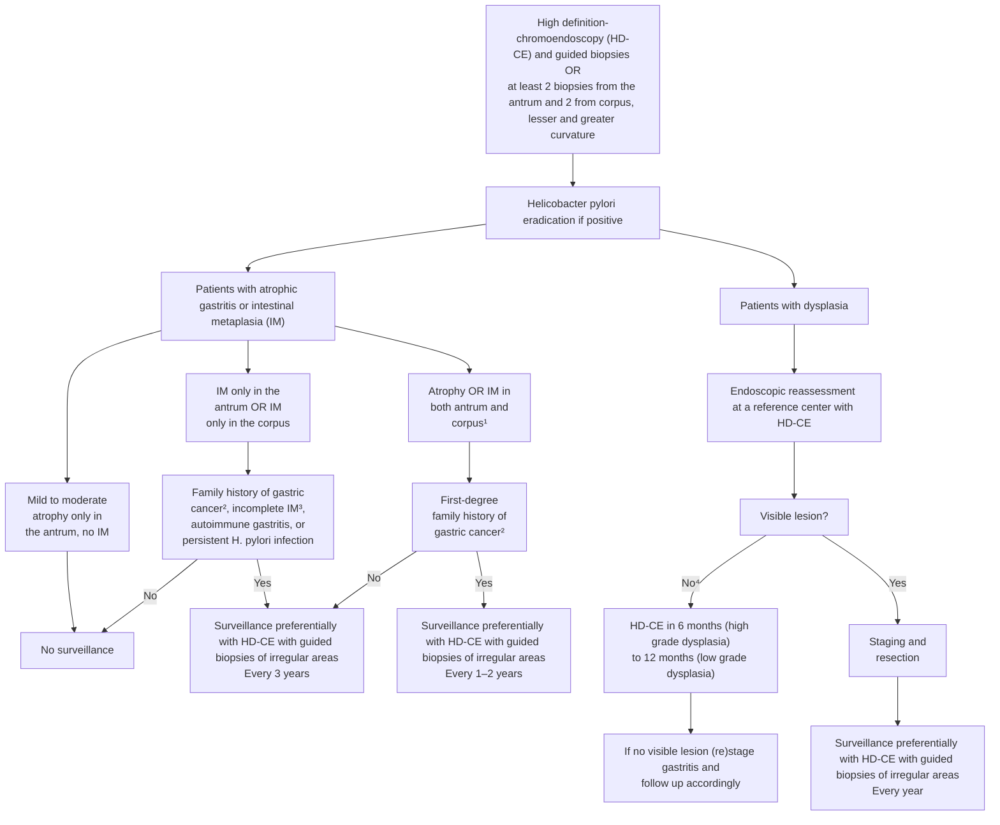

# Guideline

# Management of epithelial precancerous conditions and lesions in the stomach (MAPS II): European Society of Gastrointestinal Endoscopy (ESGE), European *Helicobacter* and Microbiota Study Group (EHMSG), European Society of Pathology (ESP), and Sociedade Portuguesa de Endoscopia Digestiva (SPED) guideline update 2019

## Authors

Pedro Pimentel-Nunes1, 2, 3, Diogo Libânio1, 2, Ricardo Marcos-Pinto2, 4, Miguel Areia2, 5, Marcis Leja6, Gianluca Esposito7, Monica Garrido4, Ilze Kikuste6, Francis Megraud8, Tamara Matysiak-Budnik9, Bruno Annibale7, Jean-Marc Dumonceau10, Rita Barros11, 12, Jean-François Fléjou13, Fátima Carneiro11, 12, 14, Jeanin E. van Hooft15, Ernst J. Kuipers16, Mario Dinis-Ribeiro1, 2

## Institutions

1. Gastroenterology Department, Portuguese Oncology Institute of Porto, Portugal
2. Center for Research in Health Technologies and Information Systems (CINTESIS), Faculty of Medicine, Porto, Portugal
3. Surgery and Physiology Department, Faculty of Medicine of the University of Porto, Porto, Portugal,
4. Department of Gastroenterology, Porto University Hospital Centre, Institute of Biomedical Sciences, University of Porto (ICBAS/UP), Portugal
5. Gastroenterology Department, Portuguese Oncology Institute of Coimbra, Portugal
6. Institute of Clinical and Preventive Medicine, University of Latvia, Digestive Diseases Center, GASTRO, Riga, Latvia
7. Department of Medicine, Surgery and Translational Medicine University Hospital Sant'Andrea, University Sapienza Roma, Rome, Italy
8. INSERM U1053, Université de Bordeaux and CHU Pellegrin, Laboratoire de Bacteriologie, Bordeaux, France
9. IMAD, Hepato-Gastroenterology and Digestive Oncology, CHU de Nantes, University of Nantes, France
10. Gedyt Endoscopy Center, Buenos Aires, Argentina
11. Institute of Molecular Pathology and Immunology at the University of Porto (Ipatimup), Porto, Portugal
12. Instituto de Investigação e Inovação em Saúde (i3S), University of Porto, Porto, Portugal
13. Service d'Anatomie Pathologique, Hôpital Saint-Antoine, AP-HP, Faculté de Médecine Sorbonne Université, Paris, France
14. Pathology Department, Centro Hospitalar de São João and Faculty of Medicine, Porto, Portugal
15. Department of Gastroenterology and Hepatology, Amsterdam UMC, University of Amsterdam, The Netherlands
16. Department of Gastroenterology and Hepatology, Erasmus MC University Medical Center, Rotterdam, The Netherlands

## Bibliography

DOI https://doi.org/10.1055/a-0859-1883
Published online: 0.0.2019 | Endoscopy 2019; 51: 365–388
© Georg Thieme Verlag KG Stuttgart · New York
ISSN 0013-726X

## Corresponding author

Pedro Pimentel-Nunes, MD PhD, Gastroenterology Department, Portuguese Oncology Institute of Porto, Rua Dr. Bernardino de Almeida, 4200-072 Porto, Portugal
Fax: +351-22-5513646
pedronunesml@gmail.com

## Supplementary material

Online content viewable at:
https://doi.org/10.1055/a-0859-1883

## MAIN RECOMMENDATIONS

Patients with chronic atrophic gastritis or intestinal metaplasia (IM) are at risk for gastric adenocarcinoma. This underscores the importance of diagnosis and risk stratification for these patients. High definition endoscopy with chromoendoscopy (CE) is better than high definition white-light endoscopy alone for this purpose. Virtual CE can guide biopsies for staging atrophic and metaplastic changes and can target neoplastic lesions. Biopsies should be taken from at least two topographic sites (antrum and corpus) and labelled in two separate vials. For patients with mild to moderate atrophy restricted to the antrum there is no evidence to recommend surveillance. In patients with IM at a single location but with a family history of gastric cancer, incomplete IM, or persistent *Helicobacter pylori* gastritis, endoscopic surveillance with CE and guided biopsies may be considered in 3 years. Patients with advanced stages of atrophic gastritis should be followed up with a high quality endoscopy every 3 years. In patients with dysplasia, in the absence of an endoscopically defined lesion, immediate high quality endoscopic reassessment with CE is recommended. Patients with an endoscopically visible lesion harboring low or high grade dysplasia or carcinoma should undergo staging and treatment. *H. pylori* eradication heals nonatrophic chronic gastritis, may lead to regression of atrophic gastritis, and reduces the risk of gastric cancer in patients with these conditions, and it is recommended. *H. pylori* eradication is also recommended for patients with neoplasia after endoscopic therapy. In intermediate to high risk regions, identification and surveillance of patients with precancerous gastric conditions is cost-effective.

## SOURCE AND SCOPE

This Guideline is an official statement of the European Society of Gastrointestinal Endoscopy (ESGE), the European Helicobacter and Microbiota Study Group (EHMSG), the European Society of Pathology (ESP), and the Sociedade Portuguesa de Endoscopia Digestiva (SPED). Based on new evidence, it makes recommendations on the diagnostic assessment and management of individuals with atrophic gastritis, intestinal metaplasia and dysplasia of the stomach, updating the 2012 MAPS guideline.

## ABBREVIATIONS

| Abbreviation | Definition |
|---|---|
| AGREE | Appraisal of Guidelines for Research and Evaluation |
| AUC | area under the curve |
| CE | chromoendoscopy |
| CI | confidence interval |
| COX | cyclo-oxygenase |
| EGC | early gastric cancer |
| EHMSG | European Helicobacter and Microbiota Study Group |
| ESD | endoscopic submucosal dissection |
| ESGE | European Society of Gastrointestinal Endoscopy |
| ESP | European Society of Pathology |
| GI | gastrointestinal |
| GRADE | Grading of Recommendations Assessment, Development, and Evaluation |
| HD-WLE | high definition white-light endoscopy |
| HGD | high grade dysplasia |
| HR | hazard ratio |
| IM | intestinal metaplasia |
| LGD | low grade dysplasia |
| MAPS | Management of precancerous conditions and lesions in stomach |
| NBI | narrow-band imaging |
| NSAID | nonsteroidal anti-inflammatory drug |
| OLGA | Operative Link on Gastritis Assessment |
| OLGIM | Operative Link on Gastritis Assessment based on Intestinal Metaplasia |
| OR | odds ratio |
| RCT | randomized controlled trial |
| RR | relative risk |
| SIR | standardized incidence ratio |
| SPED | Sociedade Portuguesa de Endoscopia Digestiva |

## 1 Introduction

Gastric cancer is still a major world problem, ranking fifth for incidence and third for cancer-related mortality worldwide in the latest published global cancer statistics [1]. Even though early recognition and treatment is possible, most cases are diagnosed at a late stage and thus most patients with a diagnosis of gastric cancer die of the disease [1]. Screening and surveillance of people at risk may decrease gastric cancer mortality by allowing early detection and treatment, often by endoscopy instead of more invasive surgery, and have therefore been recommended [2, 3].

In 2012, the European Society of Gastrointestinal Endoscopy (ESGE), the Sociedade Portuguesa de Endoscopia Digestiva (SPED), the European Helicobacter and Microbiota Study Group (EHMSG), and the European Society of Pathology (ESP) produced the first international guideline on the management of precancerous conditions and lesions in the stomach (MAPS) [4, 5]. Its recommendations were then presented in various countries, and were adapted and translated in some. Moreover, the MAPS Guideline was incorporated into ESGE guidelines on quality parameters for upper gastrointestinal (GI) endoscopy [6].

This document aims to update the first MAPS guideline (referred to here as MAPS I) and to summarize current evidence on the management of patients with precancerous conditions and lesions, focusing on the evidence published after 2010.

## Scope

Management (diagnostic assessment, treatment, and surveillance) of individuals with atrophic gastritis, intestinal metaplasia, and dysplasia of the stomach.

## 2 Methods

These recommendations were developed according to the Appraisal of Guidelines for Research and Evaluation (AGREE) process for the development of clinical practice guidelines [7]. In October 2016, on behalf of ESGE, EHMSG, ESP, and SPED, the coordinators of the previous 2012 Guideline (MAPS I) assembled a panel of European gastroenterologists and pathologists in order to produce an updated guideline, MAPS II.

Working groups were set up to cover the following topics: (1) Definitions and prevalence; (2) Endoscopic diagnosis; (3) Biopsies and histology; (4) Noninvasive assessment; (5) Follow-up; (6) *Helicobacter pylori* treatment; (7) Other therapies; (8) Management; and (9) Cost-effectiveness. (See online-only **Supplementary material**.)

The evidence-based Delphi process was applied to develop consensus statements. First, key questions were agreed and statements were proposed by the MAPS II coordinators (P.P.N. and M.D.R.), considering previous MAPS I statements and potential changes to previous recommendations. Each working group considered their statements, and changed these according to evidence if necessary. A literature search was done using PubMed (until March 2018) with a focus on articles published after the MAPS I literature search (November 2010). Each working group rated the quality level of the available evidence and the strength of recommendations using the Grading of Recommendations Assessment, Development, and Evaluation (GRADE) process [8, 9]. The MAPS II coordinators evaluated and grouped each statement and evidence in a single document with all the necessary bibliography. This document was then sent to every participant and statements were voted upon online. At this stage, changes were made if necessary and statements with less than 75 % agreement were excluded. A final version with the consensus recommendations (▶Table 1) was sent to and approved by every author. Finally, the manuscript was reviewed by two members of the ESGE Governing Board and sent for further comments to the National Societies and Individual Members. Suggestions were considered, and after agreement on a final version the manuscript was submitted for publication.

## 3 Definitions and prevention aims

### 3.1 Gastric carcinogenesis

> **STATEMENT**
> **1** Patients with chronic atrophic gastritis or intestinal metaplasia are at risk for gastric adenocarcinoma.
> High quality evidence (100 % agree [94 % strongly or moderately agree]).

> **STATEMENT**
> **2** Histologically confirmed intestinal metaplasia is the most reliable marker of atrophy in gastric mucosa.
> High quality evidence (100 % agree [100 % strongly or moderately agree]).

> **RECOMMENDATION**
> **3** Patients with advanced stages of gastritis, that is, atrophy and/or intestinal metaplasia affecting both antral and corpus mucosa, should be identified as they are considered to be at higher risk for gastric adenocarcinoma.
> Moderate quality evidence, strong recommendation (94 % agree [94 % strongly or moderately agree]).

> **RECOMMENDATION**
> **4** High grade dysplasia and invasive carcinoma should be regarded as the outcomes to be prevented when patients with chronic atrophic gastritis or intestinal metaplasia are managed.
> Moderate quality evidence, strong recommendation (100 % agree [100 % strongly or moderately agree]).

Intestinal-type gastric adenocarcinoma represents the final outcome of the inflammation–atrophy–metaplasia–dysplasia–carcinoma sequence, known as the Correa cascade [10–14].

Chronic atrophic gastritis and intestinal metaplasia (IM) are considered to be *precancerous conditions* because they independently confer a risk for development of gastric cancer and constitute the background in which dysplasia and adenocarcinoma may occur [11, 15–17]. Diverse efforts have been made to stage or classify individuals according to the severity and/or extent of these changes. Advanced stages of atrophic gastritis should be defined as significant (moderate to marked) atrophy or as IM (as the best and more reliable marker of atrophy) affecting both antral and corpus mucosa.

In MAPS I, the Operative Link on Gastritis Assessment (OLGA), and Operative Link on Gastritis Assessment based on Intestinal Metaplasia (OLGIM) systems were proposed for staging of atrophy and IM, respectively. A large body of evidence, consolidated in a recent meta-analysis, is now available ascertaining OLGA/OLGIM reliability, with minor differences between the two systems regarding predictive value for gastric cancer risk [18]. A recent study pointed out that the likelihood for progression to gastric cancer of high versus low OLGIM stages is two times that of high versus low OLGA stages [19]. As the diagnosis of atrophic gastritis needs grading of the severity of gland loss and this shows poor inter- and intraobserver agreement, we recommend that OLGIM should be preferred whenever the aim is staging of mucosal changes [19–24]. OLGIM can be widely applied with higher accuracy and cost-effectiveness, and also has lower technical requirements regarding orientation of

**▶ Table 1**

Management of epithelial precancerous conditions and lesions in the stomach (MAPS) Guidelines: summary of all MAPS I and MAPS II recommendations. Changes from MAPS I (new or modified recommendations) are shown in bold.

| MAPS I | MAPS II (in bold if modified) |
|---|---|
| **Definitions and prevention aims** | |
| 1 Patients with chronic atrophic gastritis or intestinal metaplasia should be considered to be at higher risk for gastric adenocarcinoma | 1 Patients with chronic atrophic gastritis or intestinal metaplasia are at risk for gastric adenocarcinoma (high quality evidence) |
| | 2 Histologically confirmed intestinal metaplasia is the most reliable marker of atrophy in gastric mucosa (high quality evidence) |
| | 3 Patients with advanced stages of gastritis, that is atrophy and/or intestinal metaplasia affecting both antral and corpus mucosa, should be identified as they are considered to be at higher risk for gastric adenocarcinoma (moderate quality evidence, strong recommendation) |
| 2 High grade dysplasia and invasive carcinoma should be regarded as the outcomes to be prevented when patients with chronic atrophic gastritis or intestinal metaplasia are managed | 4 High grade dysplasia and invasive carcinoma should be regarded as the outcomes to be prevented when patients with chronic atrophic gastritis or intestinal metaplasia are managed (moderate quality evidence, strong recommendation) |
| 3 Patients with endoscopically visible high grade dysplasia or carcinoma should undergo staging and adequate management | 5 **Patients with an endoscopically visible lesion harboring low or high grade dysplasia or carcinoma should undergo staging and treatment (high quality evidence, strong recommendation)** |
| **Diagnosis and staging** | |
| 4 Conventional white light endoscopy cannot accurately differentiate and diagnose preneoplastic gastric conditions | |
| 5 Magnification chromoendoscopy and narrow band imaging (NBI), with or without magnification, improve the diagnosis of gastric preneoplastic conditions/lesions | 6 **High definition endoscopy with chromoendoscopy (CE) is better than high definition white-light endoscopy alone for the diagnosis of gastric precancerous conditions and early neoplastic lesions (high quality evidence)** |
| 6 Within this context, diagnostic upper gastrointestinal endoscopy should include gastric biopsies sampling | 7 **Whenever available and after proper training, virtual CE, with or without magnification, should be used for the diagnosis of gastric precancerous conditions, by guiding biopsy for staging atrophic and metaplastic changes and by helping to target neoplastic lesions (moderate quality evidence, strong recommendation)** |
| 7 Atrophic gastritis and intestinal metaplasia are often unevenly distributed throughout the stomach. For adequate staging and grading of gastric precancerous conditions, at least four non-targeted biopsies of two topographic sites (at the lesser and greater curvature, from both the antrum and the corpus) should be taken and clearly labelled in separate vials; additional target biopsies of lesions should be taken | 8 **For adequate staging of gastric precancerous conditions, a first-time diagnostic upper gastrointestinal endoscopy should include gastric biopsies both for *Helicobacter pylori* infection diagnosis and for identification of advanced stages of atrophic gastritis (moderate quality evidence, strong recommendation)** |
| | 9 **Biopsies of at least two topographic sites (from both the antrum and the corpus, at the lesser and greater curvature of each) should be taken and clearly labelled in two separate vials. Additional biopsies of visible neoplastic suspicious lesions should be taken (moderate quality evidence, strong recommendation)** |
| 8 Systems for histopathological staging (e. g. operative link for gastritis assessment [OLGA] and operative link for gastric intestinal metaplasia [OLGIM] assessment) may be useful for categorization of risk of progression to gastric cancer | 10 **Systems for histopathological staging (e. g. Operative Link on Gastritis Assessment [OLGA] and Operative Link on Gastric Intestinal Metaplasia [OLGIM] assessment) can be used to identify patients with advanced stages of gastritis. If these systems are used to stratify patients, additional biopsy of the incisura should be considered (moderate quality evidence, weak recommendation)** |
| 9 Serum pepsinogen levels can predict extensive atrophic gastritis | |
| 10 In patients with low pepsinogen test levels, *H. pylori* serology may be useful for further detection of high risk individuals | 11 **Low pepsinogen I serum levels or/and low pepsinogen I/II ratio identify patients with advanced stages of atrophic gastritis and endoscopy is recommended for these patients, particularly if *H. pylori* serology is negative (moderate quality evidence, strong recommendation)** |
| 11 Family history of gastric cancer should be taken into account in the follow-up of precancerous conditions | |

▶ **Table 1** (Continuation)

| MAPS I | MAPS II (in bold if modified) |
|---|---|
| 12 Even though diverse studies assessed age, gender, and *H. pylori* virulence factors as well as host genetic variations, no clinical recommendations can be made for targeted management based on these factors with regard to diagnosis and surveillance | 12 Even though diverse studies assessed age, gender, and *H. pylori* virulence factors, as well as host genetic variations, no clinical recommendations regarding diagnosis and surveillance can be made for targeted management based on these factors (low quality evidence, weak recommendation) |
| **Surveillance** | |
| 13 Patients with low grade dysplasia in the absence of an endoscopically defined lesion should receive follow-up within 1 year after diagnosis. In the presence of an endoscopically defined lesion, endoscopic resection should be considered, to obtain a more accurate histological diagnosis | 13 **In patients with dysplasia in the absence of an endoscopically defined lesion immediate high quality endoscopic reassessment with CE (virtual or dye-based) is recommended. If no lesion is detected in this high quality endoscopy, biopsies for staging of gastritis (if not previously done) and endoscopic surveillance within 6 months (if high grade dysplasia) to 12 months (if low grade dysplasia) are recommended (low quality evidence, strong recommendation)** |
| 14 For patients with high grade dysplasia in the absence of endoscopically defined lesions, immediate endoscopic reassessment with extensive biopsy sampling and surveillance at 6-month to 1-year intervals is indicated | |
| 15 For those patients with mild to moderate atrophy/intestinal metaplasia restricted to the antrum there is no evidence to recommend surveillance | 14 For patients with mild to moderate atrophy restricted to the antrum there is no evidence to recommend surveillance (moderate quality evidence, strong recommendation) |
| | 15 **Patients with IM at a single location have a higher risk of gastric cancer. However, this increased risk does not justify surveillance in most cases, particularly if a high quality endoscopy with biopsies has excluded advanced stages of atrophic gastritis (moderate quality evidence, strong recommendation)** |
| | 16 **In patients with IM at a single location but with a family history of gastric cancer, or with incomplete IM, or with persistent *H. pylori* gastritis, endoscopic surveillance with chromoendoscopy and guided biopsies in 3 years' time may be considered (low quality evidence, weak recommendation)** |
| 16 Endoscopic surveillance should be offered to patients with extensive atrophy and/or intestinal metaplasia (i. e., atrophy and/or intestinal metaplasia in the antrum and corpus) | |
| 17 Patients with extensive atrophy and/or intestinal metaplasia should receive follow-up every 3 years after diagnosis | 17 **Patients with advanced stages of atrophic gastritis (severe atrophic changes or intestinal metaplasia in both antrum and corpus, OLGA/OLGIM III/IV) should be followed up with a high quality endoscopy every 3 years (low quality evidence, strong recommendation)** |
| | 18 **Patients with advanced stages of atrophic gastritis and with a family history of gastric cancer may benefit from a more intensive follow-up (e. g. every 1 – 2 years after diagnosis) (low quality evidence, weak recommendation)** |
| | 19 **Patients with autoimmune gastritis may benefit from endoscopic follow-up every 3 – 5 years (low quality evidence, weak recommendation)** |
| **Therapy** | |
| 18 *H. pylori* eradication heals nonatrophic chronic gastritis and it may lead to partial regression of atrophic gastritis | 20 ***H. pylori* eradication heals nonatrophic chronic gastritis, may lead to regression of atrophic gastritis, and reduces the risk of gastric cancer in patients with nonatrophic and atrophic gastritis, and, therefore, it is recommended in patients with these conditions (high quality evidence, strong recommendation)** |
| 19 In patients with intestinal metaplasia, *H. pylori* eradication does not appear to reverse intestinal metaplasia but it may slow progression to neoplasia, and therefore it is recommended | 21 **In patients with established IM, *H. pylori* eradication does not appear to significantly reduce the risk of gastric cancer, at least in the short term, but reduces inflammation and atrophy and, therefore, it should be considered (low quality evidence, weak recommendation)** |

biopsy samples [23]. OLGIM III and IV stages may thus identify patients at a higher risk for gastric cancer [18, 19].

Gastric dysplasia represents the penultimate stage of the gastric carcinogenesis sequence. It is defined as histologically unequivocal neoplastic epithelium without evidence of tissue invasion, and is thus a direct neoplastic *precancerous lesion* [25]. The World Health Organization (WHO) has reiterated the classification of dysplasia/intraepithelial neoplasia [26]:

- *Intraepithelial neoplasia/dysplasia* comprises unequivocally epithelial and neoplastic proliferations characterized by variable cellular and architectural atypia, but without convincing evidence of invasion.
- *Low grade intraepithelial neoplasia/dysplasia* shows minimal architectural disarray and only mild to moderate cytological atypia.
- *High grade intraepithelial neoplasia/dysplasia* comprises neoplastic cells that are usually cuboidal, rather than columnar, with a high nucleus-to-cytoplasm ratio, prominent amphophilic nucleoli, more pronounced architectural disarray, and numerous mitoses, which can be atypical. Importantly, the nuclei frequently extend into the luminal aspect of the cell, and nuclear polarity is usually lost. Most patients harboring lesions classified as *high grade dysplasia* (HGD) are at high risk for either synchronous invasive carcinoma or its rapid development.
- *Intramucosal invasive neoplasia/intramucosal carcinoma* defines carcinomas that invade the lamina propria and are distinguished from intraepithelial neoplasia/dysplasia not only by desmoplastic changes that can be minimal or absent, but also by distinct structural anomalies, such as marked glandular crowding, excessive branching, budding, and fused or cribriform glands. The diagnosis of intramucosal carcinoma means that there is an increased risk of lymphatic invasion and lymph node metastasis, although with certain features this risk is absent or minimal.

Guidelines for endoscopic treatment of early gastric cancer (EGC) are beyond the scope of this manuscript but can be found in published ESGE guidelines [2, 3].

### 3.2 Gastric precancerous and early cancer lesions

> **RECOMMENDATION**
> **5** Patients with an endoscopically visible lesion harboring low or high grade dysplasia or carcinoma should undergo staging and treatment.
> High quality evidence, strong recommendation (94 % agree [94 % strongly or moderately agree]).

In the MAPS I Guideline, we recommended that "Patients with endoscopically visible high grade dysplasia or carcinoma should undergo staging and adequate management." However, several studies have shown that low grade dysplasia (LGD) also has a real potential for malignancy and, even more importantly, visible lesions with LGD on biopsy may in fact already be malignant lesions. Moreover, some biopsies may be negative for dysplasia in the face of a true neoplastic lesion [27]. In a Western endoscopic submucosal dissection (ESD) series, there was a histological upstaging after resection for 33 % of the lesions [28]. Similarly, an Eastern study that analyzed 1850 lesions, focusing on the discrepancy between endoscopy biopsies and endoscopic resection specimens, concluded that the overall discrepancy rate was 32 % [27]. A meta-analysis that specifically investigated the upstaging of gastric LGD after endoscopic

---

▶ **Table 1** (Continuation)

| MAPS I | MAPS II (in bold if modified) |
|---|---|
| 20 *H. pylori* eradication is recommended for patients with previous neoplasia after endoscopic or surgical therapy | 22 *H. pylori* eradication is recommended for patients with gastric neoplasia after endoscopic therapy (high quality evidence, strong recommendation) |
| 21 Currently, the use of cyclo-oxgenase-2 (COX-2) inhibitors cannot be supported as an approach to decrease the risk of progression of gastric precancerous lesions | 23 **Even though cyclo-oxygenase (COX)-1 or COX-2 inhibitors may slow progression of gastric precancerous conditions, they cannot be recommended specifically for this purpose (low quality evidence, weak recommendation)** |
| 22 The use of dietary supplementation with antioxidants (ascorbic acid and betacarotene) cannot be supported as a therapy to reduce the prevalence of atrophy or intestinal metaplasia | 24 **Low dose daily aspirin may be considered for prevention of various cancers, including gastric cancer, in selected patients (moderate quality evidence, weak recommendation)** |
| **Cost-effectiveness** | |
| 23 After endoscopic resection of early gastric cancer, *H. pylori* eradication is cost-effective | 25 **In intermediate to high risk regions, identification and surveillance of patients with precancerous gastric conditions is cost-effective (moderate quality evidence)** |
| 24 Currently available evidence does not allow an accurate estimation of the cost-effectiveness of surveillance for premalignant gastric conditions worldwide | |

resection found that this happens in 25 % of lesions, with 7 % being upstaged to malignant [29]. Taking all this evidence together, we can conclude that endoscopic biopsies are insufficient for correct diagnosis of visible gastric lesions and that an endoscopically visible lesion with any neoplastic change should be considered for treatment.

## 4 Diagnosis and staging

### 4.1 Endoscopy

> **STATEMENT**
> **6** High definition endoscopy with chromoendoscopy (CE) is better than high definition white-light endoscopy alone for the diagnosis of gastric precancerous conditions and early neoplastic lesions.
> High quality evidence (94 % agree [94 % strongly or moderately agree.

> **RECOMMENDATION**
> **7** Whenever available and after proper training, virtual CE, with or without magnification, should be used for the diagnosis of gastric precancerous conditions, by guiding biopsy for staging atrophic and metaplastic changes and by helping to target neoplastic lesions.
> Moderate quality evidence, strong recommendation (94 % agree [94 % strongly or moderately agree]).

Classical studies of conventional white-light endoscopy (WLE) showed that the correlation between histological and endoscopic findings for the diagnosis of gastric precancerous conditions was poor [30 – 34]. However, recent studies with high definition WLE (HD-WLE) presented promising results. For preneoplastic conditions, a cross-sectional study showed that HD-WLE had a global accuracy of 88 % for the diagnosis of IM with a sensitivity of 75 % and specificity of 94 % [35]. In a real-time multicenter prospective study, the global accuracy of HD-WLE was 83 %, with a specificity of 98 % for IM but with only 53 % sensitivity [36]. These results were confirmed in another multicenter prospective study, that showed a 98 % specificity for IM but again with a low sensitivity of 59 % [37]. For the diagnosis of neoplastic lesions these two studies showed low sensitivities of 74 % and 29 %, respectively, although the specificities were higher than 95 % [36, 37]. HD-WLE with magnification may improve these results; however, the data are too scarce to provide definitive conclusions [38 – 40]. So, even though these results for HD-WLE are satisfactory for IM and for early neoplastic lesions they are far from perfect, particularly regarding the sensitivity in the diagnosis of these lesions.

Conventional CE with application of dyes (indigo carmine, methylene blue, acetic acid, or hematoxylin) has consistently been associated with the detection of gastric preneoplastic or neoplastic conditions or lesions with high accuracy [41 – 45]. In a recently published meta-analysis including 10 studies, 699 patients, and 902 lesions, the pooled sensitivity, specificity, and area under the curve (AUC) of dye-CE were 0.90 (95 % confidence interval [CI] 0.87 – 0.92), 0.82 (95 %CI 0.79 – 0.86), and 0.95, respectively, these results being significantly better than WLE alone (risk difference of 0.36 for neoplasia and 0.17 for premalignant conditions) [46]. However, dye-CE is cumbersome and significantly lengthens endoscopic procedures. This favors virtual CE which is available at the touch of a button.

Several studies focused on the role of virtual CE in the diagnosis of gastric precancerous conditions. A systematic review showed that most studies addressed narrow-band imaging (NBI) (mainly with magnification). The pooled sensitivity and specificity for the diagnosis of IM were 86 % and 77 %, and for dysplasia/early cancer these values were 90 % and 83 %, respectively [47]. However, the authors concluded that few studies addressed interobserver reliability and that there was no validated classification. Other investigators evaluated all the NBI patterns previously described, and created and validated a simplified NBI (without magnification) classification using only reproducible NBI features (▶Fig. 1) [48]. The global accuracy for the diagnosis of IM was 84 % and for dysplasia it was 95 %. However, these results clearly depend on training and are better with experienced endoscopists [48, 49]. External validation of this classification in a prospective multicenter study involving five international Western centers (some using near-focus and second-generation NBI) showed a sensitivity and specificity of 87 % and 97 % for the diagnosis of IM and 92 % and 99 % for the diagnosis of dysplasia [36]. The diagnostic accuracy rate was of 94 % (11 % higher than HD-WLE), with the greatest advantage of NBI over or after WLE being sensitivity for detecting IM (87 % vs. 53 %, P < 0.001) and sensitivity for neoplasia (92 % vs. 74 %) [36]. Altogether these results supported the ESGE Technology Review on advanced imaging which suggested this classification as the one to be used in this context [50].

Other studies comparing HD-WLE to NBI consistently showed better results with NBI for detecting both IM and EGC. A large multicenter prospective randomized study reached the same conclusions this time in an Eastern population. Again, even though specificities for IM and cancer were the same, the sensitivities for IM (92 % vs. 59 %) and particularly for cancer (100 % vs. 29 %) were much higher with second-generation NBI when compared to HD-WLE [37]. In an Indian randomized prospective crossover study the conclusions were very similar regarding IM, with the frequency of IM detection by NBI being significantly higher than by WLE (P = 0.001) [51].

We can conclude that NBI is better than HD-WLE for the detection and diagnosis of IM, but is it better than standard nontargeted biopsy sampling? In a comparative study including 119 patients, the overall sensitivity, specificity, and accuracy of WLE nontargeted biopsies taken according to the Sydney-Houston protocol were compared with NBI-guided biopsies. For predicting atrophy, the WLE nontargeted biopsies vs. NBI results were 86 % vs. 62 %, 100 % vs. 97 %, and 93 % vs. 80 %, respectively; for IM they were 80 % vs. 72 %, 100 % vs. 93 %, and 90 % vs. 82 %. These results were slightly better for nontargeted protocol biopsies. This was only significant with respect to the detection of atrophy (P = 0.03) and not for IM or dysplasia [52].

A prospective blinded trial detected higher proportions of patients with IM by NBI-guided (65 %) or WLE nontargeted mapping (76 %) versus HD-WLE-guided biopsies (29 %; P < 0.005 for both comparisons). In this study the best results would have been obtained by combining NBI with mapping (detection of 100 % of patients with IM and 95 % of areas with IM), with NBI identifying different patients and sites with IM that would not have been detected by mapping alone [53]. We can firstly conclude that random biopsies may detect some cases that are not detected by NBI alone. However, most of these cases will have mild/moderate atrophy (that has no validated NBI pattern) or mild/focal IM that does not require surveillance. In fact, it has been shown that, with an appropriately experienced operator, second-generation NBI may detect almost every case of extensive atrophy/IM without the need of biopsies [54]. Secondly, in expert hands, NBI-guided biopsies may increase the diagnostic yield of mapping biopsies. When the two modalities are combined, they will detect almost all cases of gastric precancerous conditions. Finally, it seems clear that atrophic changes and IM are unevenly distributed throughout the stomach. In this context, an Endoscopic Grading of Gastric Intestinal Metaplasia (EGGIM) system has been proposed, and in theory it may allow better staging of gastritis than histology alone since it takes into account complete assessment of the gastric mucosa [36]. However, future studies are needed to validate the EGGIM classification before routine clinical application.

Regarding EGC diagnosis, other investigators showed that magnifying NBI was better than HD-WLE with an accuracy of 90 % (vs. 65 %, P < 0.001) [55]. A recent meta-analysis also concluded that magnifying NBI is better than WLE alone with an AUC of 0.96 for diagnosing EGC [56]. Two studies (one Eastern, the other Western) compared NBI without magnification to HD-WLE and suggested increased diagnostic accuracy of NBI over HD-WLE alone [36, 37]. In one study, 7 EGC lesions were detected by NBI, but only 2 by HD-WLE [37]. In another study, 5 EGC lesions were misdiagnosed by WLE alone, with 2 of them being only seen with NBI [36]. Even though both studies were underpowered for this purpose, they support the estimate that use of only HD-WLE may miss almost 10 % of neoplastic lesions. This estimate is in accordance with the 10 % miss rate for gastric cancer observed during upper GI endoscopy [57, 58]. Thus, NBI outperforms HD-WLE for diagnosis and characterization and it may increase detection of EGC lesions.

---

▶ **Fig. 1** Simplified narrow-band imaging (NBI) classification for the endoscopic diagnosis of gastric precancerous conditions and lesions.
**a** Antrum (upper panel) and body (lower panel): normal gastric mucosa. A regular and circular/oval mucosal pattern with regular thin/peripheral (body) or thick/central (antrum) vessels is highly predictive of a normal mucosa. **b** Intestinal metaplasia (IM). Regular vessels with ridge/tubular or tubulovillous glands, particularly with a light blue crest, are highly suggestive of IM. In general, these areas of mucosa alternate with areas of normal but atrophic mucosa. **c** Dysplasia/carcinoma. Irregular vessels and glands (upper panel, high grade dysplasia lesion), or absent glands with complete architectural loss of the mucosal and vascular pattern (lower panel, intramucosal adenocarcinoma) predict neoplastic changes of the mucosa.

---

There is less evidence to support other methods of virtual CE such as i-Scan digital contrast and flexible spectral imaging color enhancement (FICE). There are currently insufficient data to recommend routine clinical use of these techniques, even though in theory and after proper training they could have similar applications [47, 59]. A few prospective studies suggested that blue laser imaging may achieve similar results to NBI [60 – 62]. Other emerging technologies, such as confocal endomicroscopy, endocytoscopy, Raman spectroscopy, and polarimetry, may have a future role but at this stage cannot be recommended for routine clinical use [59].

### 4.2 Biopsy sampling

> **RECOMMENDATION**
> **8** For adequate staging of gastric precancerous conditions, a first-time diagnostic upper gastrointestinal endoscopy should include gastric biopsies both for *H. pylori* infection diagnosis and for identification of advanced stages of atrophic gastritis.
> Moderate quality evidence, strong recommendation (88 % agree [77 % strongly or moderately agree]).

> **RECOMMENDATION**
> **9** Biopsies of at least two topographic sites (from both the antrum and the corpus, at the lesser and greater curvature of each) should be taken and clearly labelled in two separate vials. Additional biopsies of visible neoplastic suspicious lesions should be taken.
> Moderate quality evidence, strong recommendation (94 % agree [82 % strongly or moderately agree]).

> **RECOMMENDATION**
> **10** Systems for histopathological staging (e. g. OLGA and OLGIM assessment) can be used to identify patients with advanced stages of atrophic gastritis. If these systems are used to stratify patients, additional biopsy of the incisura should be considered.
> Moderate quality evidence, weak recommendation (88 % agree [58 % strongly or moderately agree]).

Considering that most endoscopists are not yet familiar with advanced imaging patterns, at present we cannot recommend exclusively endoscopic staging of gastritis without biopsies. However, current evidence suggests that CE-targeted biopsies plus mapping biopsies are the best way of detecting most cases of advanced gastritis. For these reasons we recommend that, when available, CE should be used for targeted biopsies.

When CE is not available (or the endoscopist doubts the advanced imaging diagnosis), the number of biopsies needed for correct staging is debated. More biopsies will allow better staging. However, in clinical practice more biopsies mean more time and higher procedure costs. In the MAPS I Guideline, we recommended at least two biopsies from the antrum and two from the corpus, and the lack of obligatory biopsy of the incisura was a matter of some controversy. In fact, the incisura may be the anatomical location with the highest incidence and severity of IM [63 – 65]. This is used to support an additional biopsy of the incisura. The updated Sydney system is the most widely accepted protocol for the classification and grading of gastritis. It recommends at least five biopsies: two from the antrum (from the greater and lesser curvature, 3 cm from the pylorus); one from the incisura; and two from the body (from the lesser curvature, 4 cm proximal to the incisura, and from the greater curvature, middle). This differed from the initial Sydney protocol that recommended only two biopsies from the corpus and two from the antrum [20]. However, the need to sample the incisura was based mostly on the notion that atrophic/metaplastic changes appear first in the incisura even though there were no data suggesting a clinical benefit. In this regard a large study, published after the MAPS I Guideline, evaluated 400 738 biopsy sets and found that compliance with the original Sydney system (two antrum, two corpus) had the highest yield for the diagnosis of *H. pylori* infection and IM when compared with all other biopsy strategies [66]. More biopsies or inclusion of an incisura biopsy yielded minimal additional diagnostic information with more costs. Some studies, published after MAPS I, specifically addressed the benefit of incisura biopsy sampling. The inclusion of incisura biopsy increased the proportion of patients classified with high risk stages (OLGA III/IV or OLGIM III/IV) in three studies (two European studies including nonselected populations [65, 67] and one Korean study in high risk patients [64]). All found that the incisura biopsy increased the proportion of patients with high risk stages. Considering the two European studies from nonselected populations together, without the incisura biopsy, there was a downgrading from high risk OLGA stages to low risk OLGA in 14/1048 patients (absolute difference 1.33 %) and from high risk OLGIM to low risk OLGIM in 13/1048 patients (absolute difference 1.24 %). This translates into a number needed to treat of 75 – 80, meaning that one in 75 – 80 patients will not be correctly included in a high risk group if incisura biopsy is not performed. Another European study evaluated classification systems in a high risk population (first-degree relatives of early onset gastric cancer patients) using OLGA and OLGIM staging systems that were modified by exclusion of the incisura biopsy, and demonstrated an overall 15 % and 30 % downgrade of staging in comparison with the original OLGA/OLGIM systems. In high risk stages, the downgrade of staging was less pronounced (5 %) for both modified staging systems in comparison with the original OLGA system [68]. Another study comparing different biopsy protocols reported that biopsy of the incisura did not provide additional benefit as the prevalence of IM in the incisura was similar to that in other biopsy sites, although the impact of incisura biopsies in high risk phenotypes was not assessed [66].

In summary, this small additional yield from an incisura biopsy needs to be balanced against costs and workload. We therefore recommend a minimum of two biopsies from the antrum and two biopsies from the corpus, noting that adding an incisura biopsy can be considered in order to maximize the detection of patients with precancerous conditions, especially in cases where CE is not available to target biopsies. Moreover, this additional biopsy will allow more precise evaluation of OLGA and OLGIM stages, that have been proven to correlate with risk for cancer progression [69 – 71].

Regarding the number of vials, even though separate vials may not be required among expert pathologists, as antral and corpus mucosa can be easily distinguished in the absence of severe atrophic changes, use of a single vial cannot be recommended in all cases. Future studies should evaluate specific scenarios when antrum, incisura, and corpus samples can be sent in the same vial.

### 4.3 Noninvasive assessment

As stated in the MAPS I Guideline, a low pepsinogen I serum level, a low pepsinogen I/II ratio, or both, are good indicators of atrophic changes in the gastric mucosa. A 2004 meta-analysis suggested that pepsinogen I ≤ 50 ng/mL and pepsinogen I/II ratio ≤ 3 were the best cutoff values for dysplasia diagnosis [72]. Several articles published after MAPS I confirm levels of pepsinogens to be good indicators of extensive atrophic gastritis and of gastric cancer [73, 74]. A 2015 meta-analysis on pepsinogen tests in gastric cancer and atrophic gastritis suggested a good correlation between decreased pepsinogen serum levels and atrophy [75]. In this meta-analysis, the summary sensitivity and summary specificity for gastric cancer diagnosis were 0.69 (95 %CI 0.60 – 0.76) and 0.73 (95 %CI 0.62 – 0.82), respectively. Corresponding values for atrophic gastritis diagnosis were 0.69 (95 %CI 0.55 – 0.80) and 0.88 (95 %CI 0.77 – 0.94), respectively. The AUC for gastric cancer diagnosis was 0.76 (95 %CI 0.72 – 0.80) and for atrophic gastritis it was 0.85 (95 %CI 0.82 – 0.88). A Fagan plot indicated that the use of pepsinogen serum levels could moderately improve the gastric cancer and atrophy detection rate, confirming a moderate efficiency of pepsinogen serum levels for gastric cancer and atrophic gastritis diagnosis.

In a subgroup analysis the authors concluded that combining low pepsinogen I level with the pepsinogen I/II ratio is the best way of detecting gastric cancer (AUC 0.78) and atrophic gastritis (AUC 0.87). However, different cutoff values were used, although most studies used pepsinogen I < 70 ng/mL and pepsinogen I/II ratio < 3 as the best cutoff values. In fact, these are widely accepted cutoff values for gastric cancer screening in Japan [76]. The authors concluded that pepsinogen serum levels have a potentially significant role in the identification of populations at high risk for gastric cancer and could be used for mass screening. However, they note that there was great heterogeneity between studies. Moreover, different methods are used for quantifying levels of pepsinogens and in this meta-analysis enzyme-linked immunoassay (ELISA) was slightly superior to the other methods, with this difference possibly inducing heterogeneity [75]. In fact, different methods may be used for pepsinogen quantification and results may differ between tests [77]. Therefore, cutoff values validated for a particular assay should be used, and cannot be generalized to all assays.

Other serum molecule levels were studied as markers of gastric atrophy. A 2017 systematic review and meta-analysis focused on the combination of pepsinogen I/II, gastrin-17, and anti-*Helicobacter* antibodies for diagnosing atrophic gastritis [78]. However, the design of this meta-analysis does not allow assessment of the individual performance of each marker for detecting atrophy. Moreover, previously published evidence demonstrated little yield from adding gastrin-17 to pepsinogen assessment for detecting atrophy [79]. On the other hand, adding *H. pylori* serology to pepsinogen level evaluation may help to detect patients at higher risk of gastric cancer [80, 81]. In a 2014 cohort of 4655 patients followed up for 16 years, there was a progressive increase in cancer risk, going from those with no gastritis to those with chronic *H. pylori*-positive gastritis without extensive atrophy (*H. pylori*-positive, normal pepsinogen levels; hazard ratio [HR] 8.9, 95 %CI 2.7 – 54.7), to those with extensive chronic atrophic gastritis (defined by pepsinogen I < 70 ng/mL and pepsinogen I/II ratio < 3) with *H. pylori*-positive serology (HR 17.7, 95 %CI 5.4 – 108), and finally to those with atrophic gastritis with *H. pylori*-negative serology, suggestive of extensive IM (HR 69.7, 95 %CI 14 – 503) [81].

Other methods for noninvasive assessment of gastric mucosal atrophy, including evaluation of decreased serum ghrelin [82 – 84], trefoil factors [85], a panel of microRNAs [86], and volatile organic compounds in exhaled air [87], have been suggested, with good results. However, the available evidence for these tests is not sufficient and further studies are required before they can be recommended for clinical application.

In conclusion, pepsinogen serum levels are currently the best evaluated noninvasive test for detecting patients with advanced atrophic gastritis. Low pepsinogen I serum levels, particularly when associated with *H. pylori*-negative serological status, may identify patients at higher risk of gastric cancer to whom endoscopy should be offered.

> **RECOMMENDATION**
> **11** Low pepsinogen I serum levels or/and a low pepsinogen I/II ratio identify patients with advanced stages of atrophic gastritis, and endoscopy is recommended for these patients, particularly if *H. pylori* serology is negative.
> Moderate quality evidence, strong recommendation (88 % agree [76 % strongly or moderately agree]).

## 4.4 Additional risk factors

> **RECOMMENDATION**
> **12** Even though diverse studies assessed age, gender, and *H. pylori* virulence factors, as well as host genetic variations, no clinical recommendations regarding diagnosis and surveillance can be made for targeted management based on these factors.
> Low quality evidence, weak recommendation (100 % agree [88 % strongly or moderately agree]).

Assuming the gene-environment interaction for gastric cancer, multiple risk factors have been linked to the multistep progression from chronic nonatrophic gastritis to atrophic gastritis, IM, dysplasia, and finally cancer [10].

*H. pylori* plays a pivotal role in this progression and was classified as a type 1 carcinogen in 1994 by the WHO [88]. It is believed that the combination of a virulent organism in a genetically susceptible host is associated with more severe chronic inflammation and more rapid progression to gastric cancer, at least for the Lauren intestinal type [89 – 91].

Different strains of *H. pylori* vary in their carcinogenic potential, with those containing virulence factors, such as the cytotoxin-associated antigen (cagA) protein and the vacuolating toxin A (vacA), inducing a higher degree of inflammation and increasing the risk for gastric cancer [92 – 97]. Nevertheless, there are no studies addressing the clinical usefulness of genotyping *H. pylori* strains with regard to the management and surveillance of gastric precancerous conditions/lesions.

An immense number of studies have addressed the implications of genes and genetic host variations for gastric carcinogenesis. The best characterized are those that play a role in the inflammatory response to *H. pylori* infection and inflammation of the gastric mucosa, leading to mucosal atrophy and progression to cancer. These include host genetic interleukin polymorphisms of IL-1B, IL1-receptor antagonist (IL-1RN), IL8, IL10, and TNF-α [98 – 104]. However, the heterogeneity of the results makes it difficult to translate them into recommendations for daily clinical practice.

## 5 Surveillance

### 5.1 Dysplasia

> **RECOMMENDATION**
> **13** In patients with dysplasia in the absence of an endoscopically defined lesion immediate high quality endoscopic reassessment with CE (virtual or dye-based) is recommended. If no lesion is detected in this high quality endoscopy, biopsies for staging of gastritis (if not previously done) and endoscopic surveillance within 6 months (if high grade dysplasia) to 12 months (if low grade dysplasia) are recommended.
> Low quality evidence, strong recommendation (88 % agree [88 % strongly or moderately agree]).

Most routine gastroscopies are performed with standard definition WLE. As we have seen, CE (virtual or dye-based) increases accuracy for detection of dysplasia. A prospective study that included 20 patients with a diagnosis of HGD or carcinoma, without visible endoscopic lesions in the index endoscopy, showed that immediate endoscopic reassessment with high definition endoscopes and virtual CE allowed the identification of visible lesions and adequate treatment in 18 patients [105]. Conventional CE also improves the detection of precancerous conditions and lesions [106]. A systematic review and meta-analysis reported that approximately 10 % of the patients with a gastric cancer diagnosis had undergone a recent endoscopy in which the gastric cancer was not diagnosed (because of both missed endoscopic lesions or nonmalignant pathology diagnosis). A recent study also showed that 8.6 % of the patients with EGCs had a simultaneous lesion that was not detected in the diagnostic endoscopy [57, 107]. The rate of missed lesions tended to be higher in primary care and screening settings than in secondary and tertiary care. Another study showed that a longer endoscopy time (> 7 minutes) was associated with a higher likelihood of detecting neoplastic lesions (odds ratio [OR] 3.42, 95 %CI 1.25 – 10.38) [108]. Moreover, a finding of dysplasia in nontargeted biopsies significantly increases the risk of gastric cancer, which may be as high as 6 % per year [109]. A recent Swedish study, that to the best of our knowledge is the largest follow-up study to date among patients with gastric precancerous conditions, suggested a lower risk of gastric cancer for patients with dysplasia. However, they excluded the first 2 years of follow-up and concluded that this might be the reason for the lower risk of gastric cancer since many lesions might have been there already [110].

"Indefinite for dysplasia/neoplasia" should not be viewed initially as an innocuous diagnosis although in the majority of patients the prognosis is favorable. Indeed, a study found that 26.8 % of resected lesions that had been characterized as indefinite for dysplasia/neoplasia in preresection biopsies were in fact neoplastic (5.0 % adenomas and 21.8 % EGCs) [111]. Another study found that reassessment of indefinite for dysplasia biopsies by three expert gastrointestinal pathologists changed the diagnosis to dysplasia in 11/46 patients (10 LGD and 1 HGD) [112].

All of this suggests that patients with diagnoses from nontargeted biopsies of indefinite for dysplasia, of dysplasia, or of carcinoma benefit from a careful endoscopic reassessment in centers with experience in the diagnosis and endoscopic treatment of EGC. We recommend that pathology slides should be reviewed by an expert GI pathologist and recommend immediate (as soon as possible) high quality endoscopic reassessment with CE. If a lesion is seen and the endoscopic assessment suggests dysplasia, we recommend resection without need of further biopsies. If endoscopic reassessment with CE does not reveal a visible lesion and repeat nontargeted biopsies do not show dysplasia/neoplasia, then staging the severity and extent of preneoplastic conditions in such cases can help to define the surveillance program. A retrospective study of patients with indefinite for dysplasia lesions at enrollment and OLGA staging, with a median follow-up of 31 months, did not detect dysplasia in any patient with OLGA 0/I/II, while 6 cases of LGD/HGD were detected in 25 patients with OLGA III/IV during follow-up [113].

With the above considerations in mind, patients with a diagnosis of indefinite for dysplasia/neoplasia or of dysplasia/intramucosal carcinoma in random biopsies (i. e., no clear lesion identified at endoscopy) should be promptly referred to an expert endoscopy center and have an endoscopic reassessment with high definition endoscopes and CE (dye or virtual). If no lesion is identified in this high quality endoscopy, endoscopic revaluation is recommended at a 6-month (if previous HGD) to 12-month (if previous LGD) interval, with further adjustment according to the severity and extent of precancerous conditions (▶Fig. 2).

### 5.2 Atrophic gastritis/intestinal metaplasia

> **RECOMMENDATION**
> **14** For patients with mild to moderate atrophy restricted to the antrum there is no evidence to recommend surveillance.
> Moderate quality evidence, strong recommendation (100 % agree [100 % strongly or moderately agree]).

> **RECOMMENDATION**
> **15** Patients with IM at a single location have a higher risk of gastric cancer. However, this increased risk does not justify surveillance in most cases, particularly if a high quality endoscopy with biopsies has excluded advanced stages of atrophic gastritis.
> Moderate quality evidence, strong recommendation (100 % agree [82 % strongly or moderately agree]).

> **RECOMMENDATION**
> **16** In patients with IM at a single location but with a family history of gastric cancer, or with incomplete IM, or with persistent *H. pylori* gastritis, endoscopic surveillance with CE and guided biopsies in 3 years' time may be considered.
> Low quality evidence, weak recommendation (82 % agree [76 % strongly or moderately agree]).

> **RECOMMENDATION**
> **17** Patients with advanced stages of atrophic gastritis (severe atrophic changes or IM in both antrum and corpus, OLGA/OLGIM III/IV) should be followed up with a high quality endoscopy every 3 years.
> Low quality evidence, strong recommendation (100 % agree [94 % strongly or moderately agree]).

> **RECOMMENDATION**
> **18** Patients with advanced stages of atrophic gastritis and with a family history of gastric cancer may benefit from a more intensive follow-up (e. g. every 1 – 2 years after diagnosis).
> Low quality evidence, weak recommendation (82 % agree [65 % strongly or moderately agree]).

Gastric precancerous conditions are frequent in the general population (although with wide geographical variability according to *H. pylori* infection prevalence). The annual incidence of gastric cancer has been reported to be 0.1 % – 0.25 % in patients with chronic atrophic gastritis and 0.25 % in patients with IM, and may be as high as 1.36 % person-year for any gastric neoplasia (including dysplasia and neuroendocrine tumors) [109, 114]. Cumulative incidences of gastric cancer of 2.4 % at 10 years in patients with IM were reported, and a Swedish study reported a cumulative incidence at 20 years of approximately 2 % in patients with atrophic gastritis and of 2.5 % in patients with IM [110]. A Japanese study found higher cumulative incidences of gastric cancer at 5 years, reaching 1.9 % – 10 % in patients with extensive endoscopic atrophy and 5.3 % – 9.8 % in patients with IM [115].

Surveillance of patients with precancerous conditions allows the detection of lesions at early stages (with a significant proportion being amenable to endoscopic resection) and was recommended in the MAPS I Guideline in patients with extensive atrophy or IM (in both corpus and antrum). The extent of preneoplastic changes was identified as a risk factor for progression, as well as family history of gastric cancer and type III incomplete IM.

**Extent and presence of IM** Some recent studies confirmed the presence and extent of IM as risk factors for gastric cancer. An Italian prospective study found a significantly increased risk of gastric neoplasia in patients with OLGA and OLGIM stages III/IV at baseline, while extensive atrophy (antrum and corpus) was also associated with a trend to higher risk of progression although this was not statistically significant on multivariable analysis (HR 7.2, 95 %CI 0.7 – 6.84) [114]. Extensive IM was also found to be associated with a higher risk of progression in a US study [116]. A Japanese study also found that IM in the corpus (isolated or antrum and corpus) and extensive endoscopic atrophy at baseline were independent predictors of gastric cancer at follow-up [115]. A case-control study found that OLGIM II-IV (but not OLGA II-IV) and corpus-predominant gastritis were significantly more frequent in gastric cancer patients than in controls [117]. Another case-control study found that OLGA III/IV, OLGIM III/IV, and endoscopically classified moderate-to-severe atrophy were significantly more frequent in gastric cancer patients [118]. Another study using endoscopic grading of atrophy found that gastric cancer risk was increased in patients with extensive atrophy (5.33 % in patients with atrophy present in the entire stomach vs. 0 % and 0.25 % in patients with atrophy limited to the gastric antrum and atrophy in the incisura or lower corpus, respectively) [119]. A Korean study reported that OLGA III/IV and OLGIM I – IV were independent risk factors for gastric cancer, especially the intestinal type, showing that even nonextensive IM may significantly increase the risk of gastric cancer [120]. The adjusted odds ratios for the different stages were: OLGA III 2.09, OLGA IV 2.04; OLGIM I 2.38, OLGIM II 2.97, OLGIM III 7.89, OLGIM IV 13.20 (all statistically significant). OLGA IV, histological IM, and a higher classification of endoscopic atrophy were also identified as independent risk factors in a prospective Korean study with follow-up > 3 years [121]. These studies suggest that the presence of IM (as a surrogate of advanced gastritis) may be of equal or more importance than the extent of atrophy without IM, since the risk of gastric cancer was higher with OLGIM I/II than with OLGA III/IV. This accords with other previous studies that evaluated the risk of gastric cancer in patients with only atrophy or IM (independently of extent), and which showed that the risk of gastric cancer is higher in IM patients (not considering extent) than in patients with atrophy [109]. In agreement, a recent study in Sweden that analyzed more than 400 000 patients concluded that IM (independently of extent) significantly increases the risk of gastric cancer. Interestingly, it showed that a second endoscopic surveillance with biopsies can have significant prognostic value, since downgrading of gastritis (to no IM detected) is associated with less risk of progression to cancer (and then these patients may not benefit from follow-up) [110].

Nevertheless, the prevalence of focal IM in the population may be as high as 25 % and it seems unreasonable to follow up all of these patients [122]. Moreover, even though the present authors recognize that focal IM may increase the risk of gastric cancer compared to no IM or even to only atrophy, this risk appears too small to justify surveillance [19]. On the other hand, extensive IM significantly increases the risk of gastric cancer compared to focal IM, and in this scenario, surveillance is recommended.

Other factors may influence the risk for cancer:

**Incomplete IM** A Spanish prospective multicenter study with a mean follow-up of 12 years found that incomplete IM was associated with a significantly higher risk of gastric cancer when compared with complete IM (HR 2.57, 95 %CI 1.06 – 6.26) [123]. A systematic review from the same authors also reported that in 10 follow-up studies, incomplete type III IM was associated with significantly higher risk of gastric cancer in 6 studies, with a 6 – 11-fold higher risk [124]. A recent study with a follow-up of 16 years also showed that incomplete-type IM was associated with a higher risk of progression to cancer than the complete type (OR 11.3, 95 %CI 1.4 – 91.4) [19]. These findings suggest that incomplete IM is associated with a risk of progression similar to that attributed to extensive atrophy or family history of gastric cancer. For these reasons, when reported, this information can have prognostic value and can aid in the selection of patients for surveillance. However, incomplete IM is not always found in the gastrectomy specimens of gastric cancer patients [125 – 127]. Additional studies are required before subtyping can be routinely recommended.

**Family history** Although most gastric cancers are sporadic, some kind of familial aggregation occurs in 10 % of cases [128]. Having a first-degree relative with gastric cancer is a consistent risk factor for gastric cancer, with an odds ratio varying from 2 to 10 in relation to geographic region and ethnicity [129]. Importantly, adjustment for environmental factors does not alter this risk. Having a second-degree relative with gastric cancer also confers a higher risk of development of the disease, but to a lesser extent [130]. It is believed that this familial clustering of gastric cancer is due to an inherited genetic susceptibility, shared environmental or lifestyle factors, shared susceptibility to *H. pylori*, sharing the same cytotoxic *H. pylori* strain, or a combination of these factors. Accordingly, a meta-analysis showed that first-degree relatives of gastric cancer patients have an increased prevalence of *H. pylori* infection (OR 1.93), gastric atrophy (OR 2.2) and IM (OR 1.98) [131]. Also, first-degree relatives of early-onset gastric cancer patients have increased prevalences of high stage gastritis (OLGA stage III/IV) and dysplasia that seem to be associated with high virulence *H. pylori* strains and pro-inflammatory host genotypes [68, 132].

Thus, these data show that first-degree relatives of gastric cancer patients have an increased prevalence of *H. pylori* infection and precancerous conditions/lesions, as well as an increased risk for gastric cancer.

Regarding progression of precancerous conditions, a US study found an increased risk for progression in patients with IM and a family history of gastric cancer (P = 0.002) [116]. In an Italian cohort, family history was also associated with a higher risk for progression in patients with gastric atrophy although this was not statistically significant [114]. Although there is only scarce evidence that precancerous conditions in relatives of a gastric cancer patient progress more rapidly through the carcinogenic cascade to cancer than similar conditions in matched controls in a general population, it seems reasonable to recommend a more intensive follow-up in patients with extensive atrophy/IM and a first-degree family history of gastric cancer.

In sum, there is a significantly higher risk of progression to cancer in patients with dysplasia, extensive atrophy/IM, and/or OLGA/OLGIM stage III/IV, and we recommend endoscopic surveillance of these patients, ideally by a high quality endoscopy. However, the risk of gastric cancer is also increased, even though with a lower magnitude, in patients with less advanced stages of preneoplastic change, such as those with focal IM (OLGIM I/II), particularly if there is also incomplete IM and/or a family history of gastric cancer. There are also some practical problems related to the adequate staging of precancerous conditions in routine clinical practice, since an important proportion of gastroscopies are performed with standard definition WLE (nontargeted biopsies) and the adherence to biopsy protocols is variable. We thus recommend (based on expert opinion) that patients with only nonguided biopsies at the antrum showing IM should be reassessed after 3 years with biopsies from antrum and corpus in separate vials, ideally with HD-NBI to allow targeted biopsies and restaging, if this was not previously done. If this high quality endoscopy excludes extensive IM then these patients may be released from endoscopic surveillance. Exceptions may be cases of family history of gastric cancer, incomplete IM in biopsies, and persistent *H. pylori*.

The benefit of doing nontargeted biopsies in patients under surveillance and already with correct staging of gastritis has not been established. For this reason, for patients with an indication for surveillance we recommend a high quality endoscopy with CE and biopsies of only the irregular/suspicious for dysplasia areas with no further biopsies being needed (▶Fig. 2).

Regarding the schedule for surveillance, the MAPS I Guideline recommended, based on expert opinion, surveillance every 3 years in patients at higher risk for gastric cancer. A recent prospective cohort study supports this recommendation, showing a neoplasia risk of 36.5 per 1000 person-years in OLGA III patients (95 %CI 13.7 – 97.4) and 63.1 per 1000 person-years in

**▶Fig. 2** Proposed management for patients with atrophic gastritis, gastric intestinal metaplasia, or gastric epithelial dysplasia. OLGA, Operative Link on Gastritis Assessment; OLGIM, Operative Link on Gastritis Assessment based on Intestinal Metaplasia.

¹Advanced stages of atrophic gastritis warranting surveillance should be defined as significant (moderate to marked) atrophy or intestinal metaplasia (IM) affecting both antral and corpus mucosa or as OLGA/OLGIM stages III/IV. Mild atrophy without IM, even when affecting antrum and corpus, should not be considered to be an advanced stage of gastritis.

²First-degree family history of gastric cancer is an important risk factor for gastric cancer and even though the evidence is scarce these patients may benefit from a more intensive follow-up. These recommendations do not apply to hereditary/familial diffuse gastric cancer.

³When reported, incomplete IM may identify patients with a higher risk of gastric cancer. However, additional studies are required before subtyping can be routinely recommended.

⁴After diagnosis of dysplasia, revision of pathology slides by an expert gastrointestinal pathologist should be considered, particularly when no lesion is seen after a high quality endoscopy. If expert revision does not confirm the diagnosis of dysplasia then the patient may be released from intensive follow-up.

OLGA IV patients (95 %CI 20.3 – 195.6) [133]. The authors suggested that the best follow-up surveillance interval would be 2 instead of 3 years. However, the cost-effectiveness of a 2-year interval for every patient may not be ideal and the evidence is not strong enough to change the recommended 3-year surveillance interval. Nevertheless, the present authors recognize that patients with extensive IM, and also with at least one of persistent *H. pylori* infection, incomplete IM, or, particularly, a first-degree family history of gastric cancer, may benefit from a tighter endoscopic surveillance schedule (e. g. every 1 – 2 years). These recommendations do not apply to hereditary/familial diffuse gastric cancer, for which there are specific guidelines [134].

### 5.3 Autoimmune gastritis

> **RECOMMENDATION**
> **19** Patients with autoimmune gastritis may benefit from endoscopic follow-up every 3 – 5 years.
> Low quality evidence, weak recommendation (82 % agree [76 % strongly or moderately agree]).

Autoimmune gastritis is a chronic progressive inflammatory condition that results in the replacement of the parietal cell mass by atrophic and metaplastic mucosa, leading to a corpus-predominant atrophic gastritis, reduced or absent acid production, and loss of intrinsic factor which may progress to a severe form of vitamin B12-deficiency anemia known as pernicious anemia. Both gastric carcinoma and neuroendocrine tumors are the most dreaded long-standing complications of pernicious anemia.

Most of the evidence on the risk of gastric cancer associated with pernicious anemia comes from case-control [135, 136] and cohort studies [114, 137 – 144]. One study based on the Surveillance, Epidemiology, and End Results (SEER) database compared 1 138 390 pernicious anemia cases to 100 000 matched individuals [135]. Individuals with pernicious anemia were at increased risk for noncardia gastric adenocarcinoma (OR 2.18, 95 %CI 1.94 – 2.45) and gastric carcinoid tumors (OR 11.43, 95 %CI 8.90 – 14.69). However, the diagnosis of autoimmune gastritis in this study was rather flawed as it was solely based on low levels of vitamin B12 [145]. Therefore, many of the patients supposedly with autoimmune gastritis probably had other causes of low serum vitamin B12, and the risk of cancer for genuine autoimmune gastritis patients was likely underestimated. A Swedish study followed 21 265 patients with pernicious anemia for an average of 7.1 years [138]. These patients had a significant excess risk for gastric cancer distal to the cardia (standardized incidence ratio [SIR] 2.4, 95 %CI 2.1 – 2.7). The excess risks increased with increasing follow-up duration. Among distal gastric cancers, the most conspicuous excess risk was for carcinoid tumors (SIR 26.4, 95 %CI 14.8 – 43.5). The abovementioned criticism with respect to the diagnosis of autoimmune gastritis also pertained to this study.

A recent meta-analysis with 27 studies and a total of 22 417 patients showed that the calculated pooled gastric cancer incidence rate was 0.27 % per person-year and the overall gastric cancer relative risk in pernicious anemia was 6.8 (95 %CI 2.6 – 18.1) [146]. The drawback of this meta-analysis is again that many patients included in these studies may have had low vitamin B12 serum levels because of conditions other than autoimmune gastritis.

Therefore, there is some evidence suggesting that autoimmune gastritis is a precancerous condition that may justify endoscopic monitoring. Nevertheless, there is no recommended follow-up interval to date.

Since the largest excess risk of gastric cancer incidence among patients with pernicious anemia has been found during the first year of follow-up [141, 143], there is evidence to recommend endoscopic screening to all patients at the time of the diagnosis.

Several cohort studies prospectively evaluated the risk of gastric cancer in patients with pernicious anemia, with varying follow-up intervals from 3 to 7 years [114, 139, 140, 142, 147 – 149]. One study [147] performed follow-up gastroscopies 3 years after primary screening examination of 56 patients and identified on follow-up 2 patients with gastric adenocarcinoma, no patient with HGD, and 49 patients with IM. Another study [142] followed up a group of 27 patients for 6 to 7 years after initial investigation. None of the patients had developed gastric cancer since the initial endoscopy and the distribution of dysplasia was virtually unchanged. The only randomized controlled trial (RCT) to determine the most effective time interval for the first follow-up endoscopy after diagnosis of corpus-predominant atrophic gastritis randomly assigned 24 patients to a 24- or 48-month follow-up interval [148]. No gastric cancer was found in either group, but a patient from the 48-month group developed a neuroendocrine tumor. The authors concluded that the first follow-up need not be earlier than 4 years after diagnosis, with this interval being satisfactory for detection of potential neoplastic lesions. Considering the heterogeneity of the described cohorts and the absence of larger RCTs with longer follow-up, we recommend follow-up endoscopy at 3- to 5-year intervals in patients with autoimmune gastritis.

## 6 Therapy

### 6.1 Helicobacter pylori eradication

> **RECOMMENDATION**
> **20** *H. pylori* eradication heals nonatrophic chronic gastritis, may lead to regression of atrophic gastritis, and reduces the risk of gastric cancer in patients with nonatrophic and atrophic gastritis, and, therefore, it is recommended in patients with these conditions.
> High quality evidence, strong recommendation (87 % agree [87 % strongly or moderately agree]).

> **RECOMMENDATION**
> **21** In patients with established IM, *H. pylori* eradication does not appear to significantly reduce the risk of gastric cancer, at least in the short term, but reduces inflammation and atrophy and, therefore, it should be considered.
> Low quality evidence, weak recommendation (87 % agree [75 % strongly or moderately agree]).

> **RECOMMENDATION**
> **22** *H. pylori* eradication is recommended for patients with gastric neoplasia after endoscopic therapy.
> High quality evidence, strong recommendation (100 % agree [100 % strongly or moderately agree]).

Since publication of the MAPS I Guideline, three meta-analyses have been performed regarding the effect of *H. pylori* eradication on chronic gastritis and risk of gastric cancer [150–152]. The first meta-analysis included only prospective trials and RCTs on *H. pylori* eradication with a focus on histology (before and after treatment) and not on the risk of gastric cancer [151]. The authors concluded that IM in the antrum and atrophic gastritis in both the antrum and corpus regressed after eradication of *H. pylori*, although this effect was not seen for IM in the corpus. This meta-analysis was statistically more powerful than previous ones on this subject and strongly suggests that *H. pylori* eradication halts progression of precancerous conditions even after IM has appeared. In fact, when studies with a longer follow-up (> 5 years) and with larger groups are analyzed, they do show a statistical improvement for IM both at the antrum and at the corpus after *H. pylori* eradication therapy has been received [19, 153–155]. One study even showed no statistically significant difference with regard to IM in comparison to an *H. pylori*-negative group, for the corpus 3 years after *H. pylori* eradication and for the antrum 5 years after *H. pylori* eradication [153]. Despite the possibility of sampling error, it appears logical that for a lesion that occurs after decades of infection, reversion also only occurs after a very long period and the risk of gastric cancer may also only decrease in the long but not the short term.

Both meta-analyses that focused on the risk of gastric cancer after *H. pylori* eradication concluded that *H. pylori* eradication significantly decreases the risk of gastric cancer in patients with chronic atrophic or nonatrophic gastritis (pooled relative risk [RR] 0.64, 95 %CI 0.48–0.85) but not in patients with IM or dysplasia (RR 0.88, 95 %CI 0.59–1.31) [150, 152]. However, only a few of the studies included in these meta-analyses had a long follow-up period (more than 10 years).

In conclusion, there is strong evidence suggesting that *H. pylori* eradication is highly beneficial in patients with chronic nonatrophic and atrophic gastritis, both histologically and in reducing gastric cancer risk. At later stages of gastritis (established IM) weaker evidence suggests that *H. pylori* eradication has beneficial histological effects, with no conclusive effect, however, on gastric cancer risk reduction. Nevertheless, no study suggested that *H. pylori* eradication has negative effects on patients with IM and, so, considering the positive histological effects of *H. pylori* eradication, it is the opinion of the present authors that *H. pylori* eradication should also be offered to patients with IM. It is also important to note that *H. pylori* infection is now considered an infectious disease and eradication is recommended in most cases, regardless of the presence of precancerous conditions [156].

There is also controversy about *H. pylori* eradication therapy after endoscopic removal of gastric superficial neoplasia. After publication of the MAPS I Guideline, a multicenter retrospective study including six Japanese centers and 268 patients contradicted its recommendation in favor of such treatment [157]. In that study, even though metachronous gastric cancer developed in 14.3 % versus 8.5 % of the patients of the *H. pylori*-persistent vs. the *H. pylori*-eradicated group, the baseline severity of mucosal atrophy and a follow-up of more than 5 years were the only independent risk factors for metachronous neoplasia [157]. A prospective RCT that included 901 patients failed to show that *H. pylori* eradication reduced the risk of metachronous lesions (2.2 % treated vs. 3.7 % nontreated, P = 0.15) [158]. This trial contradicted another previously published RCT on this subject that showed a significant reduction of gastric cancer in *H. pylori*-eradicated patients [159]. Moreover, in another retrospective study that included 2089 patients who underwent endoscopic resection of a superficial lesion, the incidence of metachronous gastric cancer was 10.9 cases per 1000 person-years in the *H. pylori*-negative group, 14.7 cases per 1000 person-years in the *H. pylori*-eradicated group, and 29.7 cases per 1000 person-years in the group without *H. pylori* eradication (HR 1.9 when compared to *H. pylori*-eradicated group, P = 0.02) [160]. Two meta-analyses on this subject included the same 10 studies (8 nonrandomized, 2 randomized), but with 5914 and 5881 patients because of different inclusion criteria. They reached the identical conclusion that *H. pylori* eradication reduces the risk of metachronous lesions with a risk ratio of 0.467 (95 %CI 0.362–0.602; P < 0.001) [161, 162]. Finally, a 2018 double-blind, placebo-controlled RCT that included 396 patients in the intention-to-treat analysis conclusively showed that *H. pylori* eradication in this group of patients reduced the risk of metachronous lesions to almost half (7 % vs. 13 %; HR 0.5, 95 %CI 0.26–0.94) [163].

In summary, *H. pylori* eradication has the largest impact on gastric cancer risk in patients with nonatrophic gastritis and early stages of atrophy. Nevertheless, a small benefit of eradication is still seen at later stages of gastritis and even after resection of a lesion. For this reason, we recommend that *H. pylori* eradication should always be considered.

### 6.2 Other therapies

> **RECOMMENDATION**
> **23** Even though cyclo-oxygenase (COX)-1 or COX-2 inhibitors may slow progression of gastric precancerous conditions, they cannot be recommended specifically for this purpose.
> Low quality evidence, weak recommendation (100 % agree [94 % strongly or moderately agree]).

> **RECOMMENDATION**
> **24** Low dose daily aspirin may be considered for prevention of various cancers, including gastric cancer, in selected patients.
> Moderate quality evidence, weak recommendation (94 % agree [47 % strongly or moderately agree]).

**COX inhibitors** Earlier meta-analyses (2003, 2010) had suggested a lower risk of gastric cancer in users of COX-inhibitors [164, 165]. Since the publication of MAPS I, few studies have specifically addressed this issue but all added evidence supporting this position. In 2013, a prospective nonrandomized study reported on the role of selective COX-2 inhibitor treatment in patients with precancerous gastric conditions: after 1 year of treatment with celecoxib following *H. pylori* eradication, IM regression was more frequent in the treatment versus the control group (44.3 % vs. 14.3 %, total 140 patients) [166]. Other studies suggest that inhibition of COX may slow progression of gastric precancerous conditions and in theory may decrease the risk of gastric cancer development. A double-blind RCT, including 1024 participants who received *H. pylori* eradication treatment or placebo followed by celecoxib or placebo (i. e., four different groups studied), showed that regression of gastric precancerous conditions significantly increased both in the eradication group (59 % vs. 41 % placebo) and in the celecoxib group (53 % vs. 41 % placebo) with an OR of 1.72 (95 %CI 1.07 – 2.76) for celecoxib and 2.19 (95 %CI 1.32 – 3.64) for *H. pylori* eradication [167]. However, in this study no statistically significant benefit was observed for celecoxib after *H. pylori* eradication. Moreover, 9 cancers developed in this study but it was underpowered to show a therapeutic benefit of any strategy.

**Nonsteroidal anti-inflammatory drugs (NSAIDs)** Several meta-analyses investigating the role of aspirin and other NSAIDs on the risk of gastric cancer have accumulated, all of them showing a favorable effect [168 – 173]. In the most recent meta-analysis, which included 24 studies, both nonaspirin NSAIDs (RR 0.86, 95 %CI 0.80 – 0.94) and aspirin (RR 0.70, 95 %CI 0.62 – 0.80) significantly reduced noncardia gastric cancer risk [168]. However, the vast majority of original studies did not include patients with precancerous gastric conditions. Moreover, the protective effect of aspirin/NSAIDs was more marked for noncardia gastric cancer and in *H. pylori*-positive individuals. In fact, when only *H. pylori*-negative patients were considered, the effect of aspirin was nonsignificant (RR 0.81, 95 %CI 0.52 – 1.26). In sum, evidence suggests that NSAIDs may slow down the progression of gastric precancerous conditions. However, this effect is small and eventually nonsignificant after *H. pylori* eradication or in more advanced lesions. Considering that NSAIDs have a potential for serious adverse events it is the opinion of the present authors that they cannot be recommended specifically for this purpose. The exception may be low dose aspirin since it has a better safety profile and its beneficial effects are more generalized, reducing also cardiovascular death risk and the risk of development of other cancers, and therefore it could be considered in selected patients.

**Rebamipide and moluodan** The effects of two other drugs on pathological findings has been investigated; the drugs were administered for 6 – 12 months following *H. pylori* eradication therapy if required. Rebamipide, a free-radical scavenger, reduced inflammation, IM, and LGD in one RCT [174], and reduced chronic inflammation but not IM in another RCT [175]; the RCTs included a total of 280 patients. Moluodan, a preparation of Chinese medicine herbs, was associated with a decrease in the dysplasia score, with dysplasia disappearance reported in 24.6 % of patients in an RCT (196 patients) [176]. Future studies should confirm these results before any recommendation can be made regarding these therapies.

**Antioxidant vitamins** With respect to antioxidant vitamin supplementation, no new studies evaluating their effects on gastric precancerous conditions were identified. In the general population, intake of some vitamins may decrease the risk of gastric cancer (RR 0.77, 95 %CI 0.71 – 0.83) according to a meta-analysis of 47 studies including 1 221 392 participants [177]. A significant risk reduction of approximately one third was found for vitamins A, C, and E at daily doses of 1.5 mg, 100 mg, and 10 mg, respectively. The risk reduction was noted only in studies where low dose dietary vitamins were used, not when vitamins were administered at high dose or as a drug supplement. Some authors have suggested that an efficient intervention would aim at nutrient repletion (i. e., with physiological as opposed to pharmacological doses) in high risk populations with poor nutrition [178]. Regarding potential harm, a meta-analysis (53 RCTs, 241 883 participants) found that supplementation with vitamins A and E in doses higher than the recommended daily allowances (as used in some of the studies included in the abovementioned meta-analysis [177]) were associated with increased mortality [179].

In line with this, two meta-analyses found a twofold higher risk of gastric cancer in individuals consuming low versus high amounts of allium vegetables [180], and in those consuming a "Western/unhealthy" diet, rich in starchy foods, meat, and fats, versus a "prudent/healthy" diet rich in fruits and vegetables [181].

## 7 Cost-effectiveness of surveillance and screening

> **RECOMMENDATION**
> **25** In intermediate to high risk regions, identification and surveillance of patients with precancerous gastric conditions is cost-effective.
> Moderate quality evidence (100 % agree [94 % strongly or moderately agree]).

**Surveillance of precancerous conditions** In 2012 when the MAPS I Guideline was issued, three studies had been published regarding the cost-effectiveness of surveillance of precancerous conditions. They had provided conflicting results, mainly because of different estimates for progression to dysplasia or cancer. Since then only three further studies have been published, all in intermediate risk countries.

Areia et al. used a Markov model for Portugal, comparing the cost-utility of three different endoscopic surveillance strategies, every 3, 5, or 10 years, for patients with extensive precancerous conditions aged 50 – 75 years [182]. It showed that endoscopic surveillance of patients with extensive precancerous conditions every 3 years was cost-effective compared to no surveillance and was better than the 5- and 10-year strategies.

Zhou et al. also applied a Markov model in Singapore and compared the cost-utility of several endoscopic surveillance or screening strategies, every 1 or 2 years, for patients aged 50 – 69 [183]. It showed that endoscopic surveillance of patients with precancerous conditions every 2 years was the most cost-effective strategy while screening strategies were extendedly dominated (i. e., had a lower incremental cost-effectiveness or were cost-ineffective).

A third cost-utility model from Wu et al., also for Singapore, compared endoscopic surveillance every 1 year versus endoscopic screening every 2 years versus nothing, for patients aged 50 – 69, and concluded that annual endoscopic surveillance was cost-effective for patients with precancerous conditions [184].

All three models demonstrated that endoscopic surveillance of patients with precancerous conditions in countries with an intermediate risk for gastric cancer was cost-effective, as suggested by the MAPS I Guideline. The recommended 3-year interval was specifically modelled only in the study from Portugal and proved to be better than longer 5- or 10-year intervals, while the studies from Singapore showed that a 1- or 2-year interval was most suitable but did not model the 3-year option.

In conclusion, endoscopic surveillance every 3 years of patients with precancerous conditions in countries with an intermediate risk for gastric cancer is cost-effective, but further economic studies would be welcome to further define the optimal interval for endoscopy.

**Endoscopic screening for gastric cancer.** Regarding endoscopic screening for gastric cancer in the general population, at present it is applied only in high risk populations, such as those of Japan and Korea, and several economic studies have already been published proving its cost-effectiveness [185].

Since 2012, two further studies have been published for the Korean population, again concluding that endoscopic screening for this high risk population is cost-effective. Chang et al., using a cost-utility model from a societal perspective for the population aged 50 – 80 years, concluded that endoscopic screening annually for men and biennially for women was the optimal cost-effective option among 12 different strategies [186]. Another cost-effectiveness model, also from a societal perspective in patients older than 40 years, demonstrated that annual endoscopic screening was better than X-ray screening or no screening [187].

Regarding the cost-effectiveness of endoscopic screening for gastric cancer in intermediate or low incidence countries, three models have been published since preparation of the MAPS I Guideline. Yeh et al. investigated a one-time gastric cancer screening strategy for an American population at age 50, with a cost-utility analysis from a societal perspective, comparing serum pepsinogen test screening followed by endoscopy if results were positive versus endoscopic screening; they concluded that for this low risk population neither option was cost-effective [188]. Others also used a Markov cost-utility model for the US population, and analyzed the option of adding a one-time screening upper endoscopy at the time of screening colonoscopy in 50-year-old patients. They concluded that this option was not cost-effective for this low risk population despite the reduced endoscopy costs [189]. Finally, Areia et al. modelled the option of adding a screening upper endoscopy at the time of screening colonoscopy, in Portugal, an intermediate to high risk country for gastric cancer [190]. Using a Markov cost-utility analysis they compared three screening strategies: stand-alone upper endoscopy, endoscopy combined with a colorectal cancer screening colonoscopy after a positive fecal occult blood test, or pepsinogen serology screening. The conclusion was that endoscopic gastric cancer screening was cost-effective if combined with a screening colonoscopy in Portugal. Furthermore, this strategy might prove to be cost-effective in other European countries with a gastric cancer risk ≥ 10 per 100 000 inhabitants, depending on further specific economic studies for each local setting.

## 8 Research agenda

During the updating of this Guideline, gaps in evidence remained noticeable. Further research is needed, including:

- Large randomized trials with different surveillance schedules, that would elucidate the natural history of each stage of gastric changes (and identify further variables for predicting progression), and also clarify the benefit of each surveillance interval;
- Adequately designed trials to assess the effect of interventions such as *H. pylori* eradication and others regarding the premalignant stomach;
- Studies to address methodologies and target populations for screening these lesions in Western countries.

## Disclaimer

The legal disclaimer for ESGE guidelines [191] applies to the current Guideline.

## Acknowledgments

The authors gratefully thank Dr. Cesare Hassan, Nuovo Regina Margherita Hospital, Rome, Italy, and Professor Konstantinos Triantafyllou, Hepatogastroenterology Unit, Attikon University General Hospital, Athens, Greece, for their critical review of the Guideline.

## Competing interests

M. Leja has shares in and receives a salary from the Digestive Diseases Centre GASTRO, SIA (from approximately 2000 to present); his department receives research support with a special offer for reagents (including for pepsinogen detection) from Eiken Chemical (2013 to present); he is a Board member of the Latvian Association of Gastroenterology (from approximately 2000 to present), F. Megraud's department has received a grant from Allergan (2014 to February 2019). J. E. van Hooft has received lecture fees from Medtronic (2014 – 2015) and consultancy fees from Boston Scientific (2014 – 2016); her department has received research grants from Cook Medical (2014 – 2018) and Abbott (2014 – 2017). B. Annibale, M. Areia, R. Barros, F. Carneiro, M. Dinis-Ribeiro, J.-M. Dumonceau, G. Esposito, J.-F. Fléjou, M. Garrido, I. Kikuste, E. J. Kuipers, D. Libânio, R. Marcos-Pinto, T. Matysiak-Budnik, and P. Pimentel-Nunes have no competing interests.

## References

[1] Bray F, Ferlay J, Soerjomataram I et al. Global cancer statistics 2018: GLOBOCAN estimates of incidence and mortality worldwide for 36 cancers in 185 countries. CA Cancer J Clin 2018; 68: 393 – 424
[2] Pimentel-Nunes P, Dinis-Ribeiro M. Endoscopic submucosal dissection in the treatment of gastrointestinal superficial lesions: Follow the guidelines! GE Port J Gastroenterol 2015; 22: 184 – 186
[3] Pimentel-Nunes P, Dinis-Ribeiro M, Ponchon T et al. Endoscopic submucosal dissection: European Society of Gastrointestinal Endoscopy (ESGE) Guideline. Endoscopy 2015; 47: 829 – 854
[4] Dinis-Ribeiro M, Areia M, de Vries AC et al. Management of precancerous conditions and lesions in the stomach (MAPS): guideline from the European Society of Gastrointestinal Endoscopy (ESGE), European Helicobacter Study Group (EHSG), European Society of Pathology (ESP), and the Sociedade Portuguesa de Endoscopia Digestiva (SPED). Endoscopy 2012; 44: 74 – 94
[5] Dinis-Ribeiro M, Areia M, de Vries AC et al. Management of precancerous conditions and lesions in the stomach (MAPS): guideline from the European Society of Gastrointestinal Endoscopy (ESGE), European Helicobacter Study Group (EHSG), European Society of Pathology (ESP), and the Sociedade Portuguesa de Endoscopia Digestiva (SPED). Virchows Arch 2012; 460: 19 – 46
[6] Bisschops R, Areia M, Coron E et al. Performance measures for upper gastrointestinal endoscopy: a European Society of Gastrointestinal Endoscopy (ESGE) Quality Improvement Initiative. Endoscopy 2016; 48: 843 – 864
[7] AGREE Collaboration. Development and validation of an international appraisal instrument for assessing the quality of clinical practice guidelines: the AGREE project. Qual Saf Health Care 2003; 12: 18 – 23
[8] Atkins D, Eccles M, Flottorp S et al. Systems for grading the quality of evidence and the strength of recommendations I: critical appraisal of existing approaches The GRADE Working Group. BMC Health Serv Res 2004; 4: 38
[9] Guyatt GH, Oxman AD, Vist GE et al. GRADE: an emerging consensus on rating quality of evidence and strength of recommendations. BMJ 2008; 336: 924 – 926
[10] Correa P. Human gastric carcinogenesis: a multistep and multifactorial process – First American Cancer Society Award Lecture on Cancer Epidemiology and Prevention. Cancer Res 1992; 52: 6735 – 6740
[11] Kapadia CR. Gastric atrophy, metaplasia and dysplasia: a clinical perspective. J Clin Gastroenterol 2003; 36 : S29 – 36
[12] Carneiro F, Machado JC, David L et al. Current thoughts on the histopathogenesis of gastric cancer. Eur J Cancer Prev 2001; 10: 101 – 102
[13] Ihamaki T, Sankkonen M, Siurala M. Long-term observation of subjects with normal mucosa and with superficial gastritis: results of 23 – 27 years' follow-up examinations. Scand J Gastroenterol 1978; 13: 771 – 775
[14] Ormiston MC, Gear MW, Codling BW. Five year follow-up study of gastritis. J Clin Pathol 1982; 35: 757 – 760
[15] Laurèn P. The two histological main types of gastric carcinoma: diffuse and so-called intestinal-type carcinoma. Acta Pathol Microbiol Scand 1965; 64: 31 – 49
[16] Fukao A, Hisamichi S, Ohsato N et al. Correlation between the prevalence of gastritis and gastric cancer in Japan. Cancer Causes Control 1993; 4: 17.20
[17] Genta RM. Gastric atrophy and atrophic gastritis – nebulous concepts in search of a definition. Aliment Pharmacol Ther 1998; 12: 17 – 23
[18] Yue H, Shan L, Bin L. The significance of OLGA and OLGIM staging systems in the risk assessment of gastric cancer: a systematic review and meta-analysis. Gastric Cancer 2018; 21: 579 – 587, Epub 2018 Feb 19
[19] Mera RM, Bravo LE, Camargo MC et al. Dynamics of Helicobacter pylori infection as a determinant of progression of gastric precancerous lesions: 16-year follow-up of an eradication trial. Gut 2018; 67: 1239 – 1246, Epub 2017 Jun 24
[20] Dixon MF, Genta RM, Yardley JH et al. Classification and grading of gastritis. The updated Sydney System. International workshop on the histopathology of gastritis, Houston 1994. Am J Surg Pathol 1996; 20: 1161 – 1181
[21] Misiewicz JJ. The Sydney System: a new classification of gastritis. Introduction. J Gastroenterol Hepatol 1991; 6: 207 – 208
[22] Plummer M, Buiatti E, Lopez G et al. Histological diagnosis of precancerous lesions of the stomach: a reliability study. Int J Epidemiol 1997; 26: 716 – 720
[23] Cotruta B, Gheorghe C, Iacob R et al. The orientation of gastric biopsy samples improves the inter-observer agreement of the OLGA staging system. J Gastrointestin Liver Dis 2017; 26: 351 – 356
[24] Isajevs S, Liepniece-Karele I, Janciauskas D et al. Gastritis staging: interobserver agreement by applying OLGA and OLGIM systems. Virchows Arch 2014; 464: 403 – 407
[25] Correa P. Clinical implications of recent developments in gastric cancer pathology and epidemiology. Semin Oncol 1985; 12: 2 – 10
[26] Lauwers G, Carneiro F, Graham D et al. Gastric carcinoma. In: Theise N, ed. WHO Classification of tumours of the digestive system. Lyon: IARC Press; 2010: 48 – 58
[27] Lim H, Jung HY, Park YS et al. Discrepancy between endoscopic forceps biopsy and endoscopic resection in gastric epithelial neoplasia. Surg Endosc 2014; 28: 1256 – 1262
[28] Pimentel-Nunes P, Mourao F, Veloso N et al. Long-term follow-up after endoscopic resection of gastric superficial neoplastic lesions in Portugal. Endoscopy 2014; 46: 933 – 940
[29] Zhao G, Xue M, Hu Y et al. How commonly is the diagnosis of gastric low grade dysplasia upgraded following endoscopic resection? A meta-analysis PLoS One 2015; 10: e0132699
[30] Atkins L, Benedict EB. Correlation of gross gastroscopic findings with gastroscopic biopsy in gastritis. N Engl J Med 1956; 254: 641 – 644
[31] Carpenter HA, Talley NJ. Gastroscopy is incomplete without biopsy: clinical relevance of distinguishing gastropathy from gastritis. Gastroenterology 1995; 108: 917 – 924
[32] Eshmuratov A, Nah JC, Kim N et al. The correlation of endoscopic and histological diagnosis of gastric atrophy. Dig Dis Sci 2010; 55: 1364 – 1375
[33] Redéen S, Petersson F, Jönsson KA et al. Relationship of gastroscopic features to histological findings in gastritis and Helicobacter pylori infection in a general population sample. Endoscopy 2003; 35: 946 – 950
[34] Stathopoulos G, Goldberg RD, Blackstone MO. Endoscopic diagnosis of intestinal metaplasia. Gastrointest Endosc 1990; 36: 544 – 545
[35] Panteris V, Nikolopoulou S, Lountou A et al. Diagnostic capabilities of high-definition white light endoscopy for the diagnosis of gastric intestinal metaplasia and correlation with histologic and clinical data. Eur J Gastroenterol Hepatol 2014; 26: 594 – 601
[36] Pimentel-Nunes P, Libanio D, Lage J et al. A multicenter prospective study of the real-time use of narrow-band imaging in the diagnosis of premalignant gastric conditions and lesions. Endoscopy 2016; 48: 723 – 730
[37] Ang TL, Pittayanon R, Lau JY et al. A multicenter randomized comparison between high-definition white light endoscopy and narrow band imaging for detection of gastric lesions. Eur J Gastroenterol Hepatol 2015; 27: 1473 – 1478
[38] Anagnostopoulos GK, Yao K, Kaye P et al. High-resolution magnification endoscopy can reliably identify normal gastric mucosa, Helicobacter pylori-associated gastritis, and gastric atrophy. Endoscopy 2007; 39: 202 – 207
[39] Gonen C, Simsek I, Sarioglu S et al. Comparison of high resolution magnifying endoscopy and standard videoendoscopy for the diagnosis of Helicobacter pylori gastritis in routine clinical practice: a prospective study. Helicobacter 2009; 14: 12 – 21
[40] Tahara T, Shibata T, Nakamura M et al. Gastric mucosal pattern by using magnifying narrow-band imaging endoscopy clearly distinguishes histological and serological severity of chronic gastritis. Gastrointest Endosc 2009; 70: 246 – 253
[41] Areia M, Amaro P, Dinis-Ribeiro M et al. External validation of a classification for methylene blue magnification chromoendoscopy in premalignant gastric lesions. Gastrointest Endosc 2008; 67: 1011 – 1018
[42] Dinis-Ribeiro M, da Costa-Pereira A, Lopes C et al. Magnification chromoendoscopy for the diagnosis of gastric intestinal metaplasia and dysplasia. Gastrointest Endosc 2003; 57: 498 – 504
[43] Kono Y, Takenaka R, Kawahara Y et al. Chromoendoscopy of gastric adenoma using an acetic acid indigocarmine mixture. World J Gastroenterol 2014; 20: 5092 – 5097
[44] Mouzyka S, Fedoseeva A. Chromoendoscopy with hematoxylin in the classification of gastric lesions. Gastric Cancer 2008; 11: 15 – 21; discussion 21–12
[45] Tanaka K, Toyoda H, Kadowaki S et al. Surface pattern classification by enhanced-magnification endoscopy for identifying early gastric cancers. Gastrointest Endosc 2008; 67: 430 – 437
[46] Zhao Z, Yin Z, Wang S et al. Meta-analysis: The diagnostic efficacy of chromoendoscopy for early gastric cancer and premalignant gastric lesions. J Gastroenterol Hepatol 2016; 31: 1539 – 1545
[47] Kikuste I, Marques-Pereira R, Monteiro-Soares M et al. Systematic review of the diagnosis of gastric premalignant conditions and neoplasia with high-resolution endoscopic technologies. Scand J Gastroenterol 2013; 48: 1108 – 1117
[48] Pimentel-Nunes P, Dinis-Ribeiro M, Soares JB et al. A multicenter validation of an endoscopic classification with narrow band imaging for gastric precancerous and cancerous lesions. Endoscopy 2012; 44: 236 – 246
[49] Dias-Silva D, Pimentel-Nunes P, Magalhaes J et al. The learning curve for narrow-band imaging in the diagnosis of precancerous gastric lesions by using web-based video. Gastrointest Endosc 2014; 79: 910 – 920; quiz 983-e911, 983 e914
[50] East JE, Vleugels JL, Roelandt P et al. Advanced endoscopic imaging: European Society of Gastrointestinal Endoscopy (ESGE) Technology Review. Endoscopy 2016; 48: 1029 – 1045
[51] Dutta AK, Sajith KG, Pulimood AB et al. Narrow band imaging versus white light gastroscopy in detecting potentially premalignant gastric lesions: a randomized prospective crossover study. Indian J Gastroenterol 2013; 32: 37 – 42
[52] Xirouchakis E, Laoudi F, Tsartsali L et al. Screening for gastric premalignant lesions with narrow band imaging, white light and updated Sydney protocol or both? Dig Dis Sci 2013; 58: 1084 – 1090
[53] Buxbaum JL, Hormozdi D, Dinis-Ribeiro M et al. Narrow-band imaging versus white light versus mapping biopsy for gastric intestinal metaplasia: a prospective blinded trial. Gastrointest Endosc 2017; 86: 857 – 865
[54] Lage J, Pimentel-Nunes P, Figueiredo PC et al. Light-NBI to identify high-risk phenotypes for gastric adenocarcinoma: do we still need biopsies? Scand J Gastroenterol 2016; 51: 501 – 506
[55] Ezoe Y, Muto M, Uedo N et al. Magnifying narrowband imaging is more accurate than conventional white-light imaging in diagnosis of gastric mucosal cancer. Gastroenterology 2011; 141: 2017 – 2025 e2013
[56] Zhang Q, Wang F, Chen ZY et al. Comparison of the diagnostic efficacy of white light endoscopy and magnifying endoscopy with narrow band imaging for early gastric cancer: a meta-analysis. Gastric Cancer 2016; 19: 543 – 552
[57] Pimenta-Melo AR, Monteiro-Soares M, Libanio D et al. Missing rate for gastric cancer during upper gastrointestinal endoscopy: a systematic review and meta-analysis. Eur J Gastroenterol Hepatol 2016; 28: 1041 – 1049
[58] Pimentel-Nunes P, Libanio D, Dinis-Ribeiro M. Evaluation and management of gastric superficial neoplastic lesions. GE Port J Gastroenterol 2017; 24: 8 – 21
[59] Lee JW, Lim LG, Yeoh KG. Advanced endoscopic imaging in gastric neoplasia and preneoplasia. BMJ Open Gastroenterol 2017; 4: e000105
[60] Dohi O, Yagi N, Majima A et al. Diagnostic ability of magnifying endoscopy with blue laser imaging for early gastric cancer: a prospective study. Gastric Cancer 2017; 20: 297 – 303
[61] Dohi O, Yagi N, Yoshida S et al. Magnifying blue laser imaging versus magnifying narrow-band imaging for the diagnosis of early gastric cancer: a prospective, multicenter, comparative study. Digestion 2017; 96: 127 – 134
[62] Kaneko K, Oono Y, Yano T et al. Effect of novel bright image enhanced endoscopy using blue laser imaging (BLI). Endosc Int Open 2014; 2: E212 – 219
[63] Mao XY, Xu SF, Liu Q et al. Anatomical predilection of intestinal metaplasia based on 78,335 endoscopic cases. Saudi J Gastroenterol 2016; 22: 154 – 160
[64] Kim YI, Kook MC, Cho SJ et al. Effect of biopsy site on detection of gastric cancer high-risk groups by OLGA and OLGIM stages. Helicobacter 2017: doi:10.1111/hel.12442
[65] Isajevs S, Liepniece-Karele I, Janciauskas D et al. The effect of incisura angularis biopsy sampling on the assessment of gastritis stage. Eur J Gastroenterol Hepatol 2014; 26: 510 – 513
[66] Lash JG, Genta RM. Adherence to the Sydney System guidelines increases the detection of Helicobacter gastritis and intestinal metaplasia in 400738 sets of gastric biopsies. Aliment Pharmacol Ther 2013; 38: 424 – 431
[67] Varbanova M, Wex T, Jechorek D et al. Impact of the angulus biopsy for the detection of gastric preneoplastic conditions and gastric cancer risk assessment. J Clin Pathol 2016; 69: 19 – 25
[68] Marcos-Pinto R, Carneiro F, Dinis-Ribeiro M et al. First-degree relatives of patients with early-onset gastric carcinoma show even at young ages a high prevalence of advanced OLGA/OLGIM stages and dysplasia. Aliment Pharmacol Ther 2012; 35: 1451 – 1459
[69] Rugge M, Meggio A, Pennelli G et al. Gastritis staging in clinical practice: the OLGA staging system. Gut 2007; 56: 631 – 636
[70] Rugge M, de Boni M, Pennelli G et al. Gastritis OLGA-staging and gastric cancer risk: a twelve-year clinico-pathological follow-up study. Aliment Pharmacol Ther 2010; 31: 1104 – 1111
[71] Capelle LG, de Vries AC, Haringsma J et al. The staging of gastritis with the OLGA system by using intestinal metaplasia as an accurate alternative for atrophic gastritis. Gastrointest Endosc 2010; 71: 1150 – 1158
[72] Dinis-Ribeiro M, Yamaki G, Miki K et al. Meta-analysis on the validity of pepsinogen test for gastric carcinoma, dysplasia or chronic atrophic gastritis screening. J Med Screen 2004; 11: 141 – 147
[73] Cho JH, Jeon SR, Kim HG et al. The serum pepsinogen levels for risk assessment of gastric neoplasms: New proposal from a case-control study in Korea. Medicine (Baltimore) 2017; 96: e7603
[74] Tong Y, Wu Y, Song Z et al. The potential value of serum pepsinogen for the diagnosis of atrophic gastritis among the health check-up populations in China: a diagnostic clinical research. BMC Gastroenterol 2017; 17: 88
[75] Huang YK, Yu JC, Kang WM et al. Significance of serum pepsinogens as a biomarker for gastric cancer and atrophic gastritis screening: a systematic review and meta-analysis. PLoS One 2015; 10: e0142080
[76] Kitahara F, Kobayashi K, Sato T et al. Accuracy of screening for gastric cancer using serum pepsinogen concentrations. Gut 1999; 44: 693 – 697
[77] Leja M, Camargo MC, Polaka I et al. Detection of gastric atrophy by circulating pepsinogens: A comparison of three assays. Helicobacter 2017: doi:10.1111/hel.12393
[78] Zagari RM, Rabitti S, Greenwood DC et al. Systematic review with meta-analysis: diagnostic performance of the combination of pepsinogen, gastrin-17 and anti-Helicobacter pylori antibodies serum assays for the diagnosis of atrophic gastritis. Aliment Pharmacol Ther 2017; 46: 657 – 667
[79] Leja M, Kupcinskas L, Funka K et al. Value of gastrin-17 in detecting antral atrophy. Adv Med Sci 2011; 56: 145 – 150
[80] Watabe H, Mitsushima T, Yamaji Y et al. Predicting the development of gastric cancer from combining Helicobacter pylori antibodies and serum pepsinogen status: a prospective endoscopic cohort study. Gut 2005; 54: 764 – 768
[81] Yoshida T, Kato J, Inoue I et al. Cancer development based on chronic active gastritis and resulting gastric atrophy as assessed by serum levels of pepsinogen and Helicobacter pylori antibody titer. Int J Cancer 2014; 134: 1445 – 1457
[82] Kawashima J, Ohno S, Sakurada T et al. Circulating acylated ghrelin level decreases in accordance with the extent of atrophic gastritis. J Gastroenterol 2009; 44: 1046 – 1054
[83] Eun Bae S, Hoon Lee J, Soo Park Y et al. Decrease of serum total ghrelin in extensive atrophic gastritis: comparison with pepsinogens in histological reference. Scand J Gastroenterol 2016; 51: 137 – 144
[84] Kasai C, Sugimoto K, Moritani I et al. Changes in plasma ghrelin and leptin levels in patients with peptic ulcer and gastritis following eradication of Helicobacter pylori infection. BMC Gastroenterol 2016; 16: 119
[85] Shi SQ, Cai JT, Yang JM. Expression of trefoil factors 1 and 2 in precancerous condition and gastric cancer. World J Gastroenterol 2006; 12: 3119 – 3122
[86] Link A, Schirrmeister W, Langner C et al. Differential expression of microRNAs in preneoplastic gastric mucosa. Scientific reports 2015; 5: 8270
[87] Amal H, Leja M, Funka K et al. Detection of precancerous gastric lesions and gastric cancer through exhaled breath. Gut 2016; 65: 400 – 407
[88] [Anonymous] Schistosomes, liver flukes and Helicobacter pylori. IARC Working Group on the evaluation of carcinogenic risks to humans. Lyon, 7–14 June 1994. IARC Monogr Eval Carcinog Risks Hum 1994; 61: 1 – 241
[89] Figueiredo C, Machado JC, Pharoah P et al. Helicobacter pylori and interleukin 1 genotyping: an opportunity to identify high-risk individuals for gastric carcinoma. J Natl Cancer Inst 2002; 94: 1680 – 1687
[90] Amieva MR, El-Omar EM. Host-bacterial interactions in Helicobacter pylori infection. Gastroenterology 2008; 134: 306 – 323
[91] Machado JC, Figueiredo C, Canedo P et al. A proinflammatory genetic profile increases the risk for chronic atrophic gastritis and gastric carcinoma. Gastroenterology 2003; 125: 364 – 371
[92] Huang JQ, Zheng GF, Sumanac K et al. Meta-analysis of the relationship between cagA seropositivity and gastric cancer. Gastroenterology 2003; 125: 1636 – 1644
[93] Basso D, Zambon CF, Letley DP et al. Clinical relevance of Helicobacter pylori cagA and vacA gene polymorphisms. Gastroenterology 2008; 135: 91 – 99
[94] Rizzato C, Kato I, Plummer M et al. Risk of advanced gastric precancerous lesions in Helicobacter pylori infected subjects is influenced by ABO blood group and cagA status. Int J Cancer 2013; 133: 315 – 322
[95] Palli D, Masala G, Del Giudice G et al. CagA+ Helicobacter pylori infection and gastric cancer risk in the EPIC-EURGAST study. Int J Cancer 2007; 120: 859 – 867
[96] Winter JA, Letley DP, Cook KW et al. A role for the vacuolating cytotoxin, VacA, in colonization and Helicobacter pylori-induced metaplasia in the stomach. J Infect Dis 2014; 210: 954 – 963
[97] Cover TL. Helicobacter pylori diversity and gastric cancer risk. MBio 2016; 7: e01869 – 01815
[98] El-Omar EM, Carrington M, Chow WH et al. Interleukin-1 polymorphisms associated with increased risk of gastric cancer. Nature 2000; 404: 398 – 402
[99] Persson C, Canedo P, Machado JC et al. Polymorphisms in inflammatory response genes and their association with gastric cancer: a huge systematic review and meta-analyses. Am J Epidemiol 2011; 173: 259 – 270
[100] Wang P, Xia HH-X, Zhang J-Y et al. Association of interleukin-1 gene polymorphisms with gastric cancer: A meta-analysis. Int J Cancer 2007; 120: 552 – 562
[101] Camargo MC, Mera R, Correa P et al. Interleukin-1beta and interleukin-1 receptor antagonist gene polymorphisms and gastric cancer: a meta-analysis. Cancer Epidemiol Biomarkers Prev 2006; 15: 1674 – 1687
[102] Xue H, Lin B, Ni P et al. Interleukin-1B and interleukin-1 RN polymorphisms and gastric carcinoma risk: a meta-analysis. J Gastroenterol Hepatol 2010; 25: 1604 – 1617
[103] Loh M, Koh KX, Yeo BH et al. Meta-analysis of genetic polymorphisms and gastric cancer risk: variability in associations according to race. Eur J Cancer 2009; 45: 2562 – 2568
[104] Hnatyszyn A, Wielgus K, Kaczmarek-Rys M et al. Interleukin-1 gene polymorphisms in chronic gastritis patients infected with Helico-
[105] Simone A, Casadei A, De Vergori E et al. Rescue endoscopy to identify site of gastric dysplasia or carcinoma found at random biopsies. Dig Liver Dis 2011; 43: 721 – 725
[106] Yep-Gamarra V, Diaz-Velez C, Araujo I et al. [Usefulness of systematic chromoendoscopy with a double dye staining technique for the detection of dysplasia in patients with premalignant gastric lesions]. Gastroenterol Hepatol 2016; 39: 49 – 54
[107] Gong EJ, Lee JH, Jung K et al. Characteristics of missed simultaneous gastric lesions based on double-check analysis of the endoscopic image. Clin Endosc 2017; 50: 261 – 269
[108] Teh JL, Tan JR, Lau LJ et al. Longer examination time improves detection of gastric cancer during diagnostic upper gastrointestinal endoscopy. Clin Gastroenterol Hepatol 2015; 13: 480 – 487.e2
[109] de Vries AC, van Grieken NC, Looman CW et al. Gastric cancer risk in patients with premalignant gastric lesions: a nationwide cohort study in the Netherlands. Gastroenterology 2008; 134: 945 – 952
[110] Song H, Ekheden IG, Zheng Z et al. Incidence of gastric cancer among patients with gastric precancerous lesions: observational cohort study in a low risk Western population. BMJ 2015; 351: h3867
[111] Goo JJ, Choi CW, Kang DH et al. Risk factors associated with diagnostic discrepancy of gastric indefinite neoplasia: Who need en bloc resection? Surg Endosc 2015; 29: 3761 – 3767
[112] Raftopoulos SC, Kumarasinghe P, de Boer B et al. Gastric intraepithelial neoplasia in a Western population. Eur J Gastroenterol Hepatol 2012; 24: 48 – 54
[113] Fassan M, Pizzi M, Farinati F et al. Lesions indefinite for intraepithelial neoplasia and OLGA staging for gastric atrophy. Am J Clin Pathol 2012; 137: 727 – 732
[114] Lahner E, Esposito G, Pilozzi E et al. Occurrence of gastric cancer and carcinoids in atrophic gastritis during prospective long-term follow up. Scand J Gastroenterol 2015; 50: 856 – 865
[115] Shichijo S, Hirata Y, Niikura R et al. Histologic intestinal metaplasia and endoscopic atrophy are predictors of gastric cancer development after Helicobacter pylori eradication. Gastrointest Endosc 2016; 84: 618 – 624
[116] Reddy KM, Chang JI, Shi JM et al. Risk of gastric cancer among patients with intestinal metaplasia of the stomach in a US integrated health care system. Clin Gastroenterol Hepatol 2016; 14: 1420 – 1425
[117] Tsai YC, Hsiao WH, Yang HB et al. The corpus-predominant gastritis index may serve as an early marker of Helicobacter pylori-infected patients at risk of gastric cancer. Aliment Pharmacol Ther 2013; 37: 969 – 978
[118] Zhou Y, Li HY, Zhang JJ et al. Operative link on gastritis assessment stage is an appropriate predictor of early gastric cancer. World J Gastroenterol 2016; 22: 3670 – 3678
[119] Masuyama H, Yoshitake N, Sasai T et al. Relationship between the degree of endoscopic atrophy of the gastric mucosa and carcinogenic risk. Digestion 2015; 91: 30 – 36
[120] Cho SJ, Choi IJ, Kook MC et al. Staging of intestinal- and diffuse-type gastric cancers with the OLGA and OLGIM staging systems. Aliment Pharmacol Ther 2013; 38: 1292 – 1302
[121] Kodama M, Murakami K, Okimoto T et al. Histological characteristics of gastric mucosa prior to Helicobacter pylori eradication may predict gastric cancer. Scand J Gastroenterol 2013; 48: 1249 – 1256
[122] Marques-Silva L, Areia M, Elvas L et al. Prevalence of gastric precancerous conditions: a systematic review and meta-analysis. Eur J Gastroenterol Hepatol 2014; 26: 378 – 387
[123] Gonzalez CA, Sanz-Anquela JM, Companioni O et al. Incomplete type of intestinal metaplasia has the highest risk to progress to gastric cancer: results of the Spanish follow-up multicenter study. J Gastroenterol Hepatol 2016; 31: 953 – 958
[124] Gonzalez CA, Sanz-Anquela JM, Gisbert JP et al. Utility of subtyping intestinal metaplasia as marker of gastric cancer risk. A review of the evidence. Int J Cancer 2013; 133: 1023 – 1032
[125] Conchillo JM, Houben G, de Bruine A et al. Is type III intestinal metaplasia an obligatory precancerous lesion in intestinal-type gastric carcinoma? Eur J Cancer Prev 2001; 10: 307 – 312
[126] Matsukura N, Onda M, Tokunaga A et al. Mucosal IgA antibody against Helicobacter pylori in chronic gastritis and intestinal metaplasia detected by the Tes-Tape method in resection specimens after gastrectomy for gastric cancer. Cancer 1995; 75: 1472 – 1477
[127] Silva S, Filipe MI. Intestinal metaplasia and its variants in the gastric mucosa of Portuguese subjects; a comparative analysis of biopsy and gastrectomy material. Hum Pathol 1986; 17: 988 – 995
[128] Oliveira C, Pinheiro H, Figueiredo J et al. Familial gastric cancer: genetic susceptibility, pathology, and implications for management. Lancet Oncol 2015; 16: e60 – e70
[129] Yaghoobi M, Bijarchi R, Narod SA. Family history and the risk of gastric cancer. Br J Cancer 2010; 102: 237 – 242
[130] Safaee A, Moghimi-Dehkordi B, Fatemi SR et al. Family history of cancer and risk of gastric cancer in Iran. Asian Pac J Cancer Prev 2011; 12: 3117 – 3120
[131] Rokkas T, Sechopoulos P, Pistiolas D et al. Helicobacter pylori infection and gastric histology in first-degree relatives of gastric cancer patients: a meta-analysis. Eur J Gastroenterol Hepatol 2010; 22: 1128 – 1133
[132] Marcos-Pinto R, Dinis-Ribeiro M, Carneiro F et al. First-degree relatives of early-onset gastric cancer patients show a high risk for gastric cancer: phenotype and genotype profile. Virchows Arch 2013; 463: 391 – 399
[133] Rugge M, Meggio A, Pravadelli C et al. Gastritis staging in the endoscopic follow-up for the secondary prevention of gastric cancer: a 5-year prospective study of 1755 patients. Gut 2019; 68: 11 – 17
[134] van der Post RS, Vogelaar IP, Carneiro F et al. Hereditary diffuse gastric cancer: updated clinical guidelines with an emphasis on germline CDH1 mutation carriers. J Med Genet 2015; 52: 361 – 374
[135] Murphy G, Dawsey SM, Engels EA et al. Cancer risk after pernicious anemia in the US elderly population. Clin Gastroenterol Hepatol 2015; 13: 2282 – 2289, e2281–2284
[136] Landgren AM, Landgren O, Gridley G et al. Autoimmune disease and subsequent risk of developing alimentary tract cancers among 4.5 million US male veterans. Cancer 2011; 117: 1163 – 1171
[137] Hemminki K, Liu X, Ji J et al. Autoimmune disease and subsequent digestive tract cancer by histology. Ann Oncol 2012; 23: 927 – 933
[138] Ye W, Nyren O. Risk of cancers of the oesophagus and stomach by histology or subsite in patients hospitalised for pernicious anaemia. Gut 2003; 52: 938 – 941
[139] Kokkola A, Sjoblom SM, Haapiainen R et al. The risk of gastric carcinoma and carcinoid tumours in patients with pernicious anaemia. A prospective follow-up study. Scand J Gastroenterol 1998; 33: 88 – 92
[140] Mellemkjoer L, Gridley G, Moller H et al. [Pernicious anemia and risk of cancer in Denmark]. Ugeskr Laeger 1997; 159: 4850 – 4853
[141] Hsing AW, Hansson LE, McLaughlin JK et al. Pernicious anemia and subsequent cancer. A population-based cohort study. Cancer 1993; 71: 745 – 750
[142] Armbrecht U, Stockbrugger RW, Rode J et al. Development of gastric dysplasia in pernicious anaemia: a clinical and endoscopic follow up study of 80 patients. Gut 1990; 31: 1105 – 1109
[143] Brinton LA, Gridley G, Hrubec Z et al. Cancer risk following pernicious anaemia. Br J Cancer 1989; 59: 810 – 813
[144] Svendsen JH, Dahl C, Svendsen LB et al. Gastric cancer risk in achlorhydric patients. A long-term follow-up study. Scand J Gastroenterol 1986; 21: 16 – 20
[145] Kuipers EJ. Pernicious anemia, atrophic gastritis, and the risk of cancer. Clin Gastroenterol Hepatol 2015; 13: 2290 – 2292
[146] Vannella L, Lahner E, Osborn J et al. Systematic review: gastric cancer incidence in pernicious anaemia. Aliment Pharmacol Ther 2013; 37: 375 – 382
[147] Sjoblom SM, Sipponen P, Jarvinen H. Gastroscopic follow up of pernicious anaemia patients. Gut 1993; 34: 28 – 32
[148] Lahner E, Caruana P, D'Ambra G et al. First endoscopic-histologic follow-up in patients with body-predominant atrophic gastritis: when should it be done? Gastrointest Endosc 2001; 53: 443 – 448
[149] Sjoblom SM, Sipponen P, Miettinen M et al. Gastroscopic screening for gastric carcinoids and carcinoma in pernicious anemia. Endoscopy 1988; 20: 52 – 56
[150] Chen HN, Wang Z, Li X et al. Helicobacter pylori eradication cannot reduce the risk of gastric cancer in patients with intestinal metaplasia and dysplasia: evidence from a meta-analysis. Gastric Cancer 2016; 19: 166 – 175
[151] Kong YJ, Yi HG, Dai JC et al. Histological changes of gastric mucosa after Helicobacter pylori eradication: a systematic review and meta-analysis. World J Gastroenterol 2014; 20: 5903 – 5911
[152] Rokkas T, Rokka A, Portincasa P. A systematic review and meta-analysis of the role of Helicobacter pylori eradication in preventing gastric cancer. Ann Gastroenterol 2017; 30: 414 – 423
[153] Hwang YJ, Kim N, Lee HS et al. Reversibility of atrophic gastritis and intestinal metaplasia after Helicobacter pylori eradication – a prospective study for up to 10 years. Aliment Pharmacol Ther 2018; 47: 380 – 390
[154] Kodama M, Murakami K, Okimoto T et al. Helicobacter pylori eradication improves gastric atrophy and intestinal metaplasia in long-term observation. Digestion 2012; 85: 126 – 130
[155] Kodama M, Murakami K, Okimoto T et al. Ten-year prospective follow-up of histological changes at five points on the gastric mucosa as recommended by the updated Sydney system after Helicobacter pylori eradication. J Gastroenterol 2012; 47: 394 – 403
[156] Malfertheiner P, Megraud F, O'Morain CA et al. Management of Helicobacter pylori infection – the Maastricht V/Florence Consensus Report. Gut 2017; 66: 6 – 30
[157] Maehata Y, Nakamura S, Fujisawa K et al. Long-term effect of Helicobacter pylori eradication on the development of metachronous gastric cancer after endoscopic resection of early gastric cancer. Gastrointest Endosc 2012; 75: 39 – 46
[158] Choi J, Kim SG, Yoon H et al. Eradication of Helicobacter pylori after endoscopic resection of gastric tumors does not reduce incidence of metachronous gastric carcinoma. Clin Gastroenterol Hepatol 2014; 12: 793 – 800 e791
[159] Fukase K, Kato M, Kikuchi S et al. Effect of eradication of Helicobacter pylori on incidence of metachronous gastric carcinoma after endoscopic resection of early gastric cancer: an open-label, randomised controlled trial. Lancet 2008; 372: 392 – 397
[160] Bae SE, Jung HY, Kang J et al. Effect of Helicobacter pylori eradication on metachronous recurrence after endoscopic resection of gastric neoplasm. Am J Gastroenterol 2014; 109: 60 – 67
[161] Bang CS, Baik GH, Shin IS et al. Helicobacter pylori eradication for prevention of metachronous recurrence after endoscopic resection of early gastric cancer. J Korean Med Sci 2015; 30: 749 – 756
[162] Jung DH, Kim JH, Chung HS et al. Helicobacter pylori eradication on the prevention of metachronous lesions after endoscopic resection of gastric neoplasm: a meta-analysis. PLoS One 2015; 10: e0124725
[163] Choi IJ, Kook MC, Kim YI et al. Helicobacter pylori therapy for the prevention of metachronous gastric cancer. N Engl J Med 2018; 378: 1085 – 1095
[164] Tian W, Zhao Y, Liu S et al. Meta-analysis on the relationship between nonsteroidal anti-inflammatory drug use and gastric cancer. Eur J Cancer Prev 2010; 19: 288 – 298
[165] Wang WH, Huang JQ, Zheng GF et al. Non-steroidal anti-inflammatory drug use and the risk of gastric cancer: a systematic review and meta-analysis. J Natl Cancer Inst 2003; 95: 1784 – 1791
[166] Sheu BS, Tsai YC, Wu CT et al. Long‐term celecoxib can prevent the progression of persistent gastric intestinal metaplasia after H. pylori eradication. Helicobacter 2013; 18: 117 – 123
[167] Wong BC, Zhang L, Ma JL et al. Effects of selective COX-2 inhibitor and Helicobacter pylori eradication on precancerous gastric lesions. Gut 2012; 61: 812 – 818
[168] Huang X-Z, Chen Y, Wu J et al. Aspirin and non-steroidal anti-inflammatory drugs use reduce gastric cancer risk: A dose-response meta-analysis. Oncotarget 2017; 8: 4781 – 4795
[169] Kong P, Wu R, Liu X et al. The effects of anti-inflammatory drug treatment in gastric cancer prevention: an update of a meta-analysis. J Cancer 2016; 7: 2247 – 2257
[170] Ye X, Fu J, Yang Y et al. Frequency-risk and duration-risk relationships between aspirin use and gastric cancer: a systematic review and meta-analysis. PLoS ONE 2013; 8: e71522
[171] Bosetti C, Rosato V, Gallus S et al. Aspirin and cancer risk: a quantitative review to 2011. Ann Oncol 2012; 23: 1403 – 1415
[172] Tian W, Zhao Y, Liu S et al. Meta-analysis on the relationship between nonsteroidal anti-inflammatory drug use and gastric cancer. Eur J Cancer Prev 2010; 19: 288 – 298
[173] Abnet CC, Freedman ND, Kamangar F et al. Non-steroidal anti-inflammatory drugs and risk of gastric and oesophageal adenocarcinomas: results from a cohort study and a meta-analysis. Br J Cancer 2009; 100: 551 – 557
[174] Han X, Jiang K, Wang B et al. Effect of rebamipide on the premalignant progression of chronic gastritis: a randomized controlled study. Clin Drug Investig 2015; 35: 665 – 673
[175] Kamada T, Sato M, Tokutomi T et al. Rebamipide improves chronic inflammation in the lesser curvature of the corpus after Helicobacter pylori eradication: a multicenter study. Biomed Res Int 2015; 2015: 865146 – 865148
[176] Tang XD, Zhou LY, Zhang ST et al. Randomized double-blind clinical trial of Moluodan () for the treatment of chronic atrophic gastritis with dysplasia. Chin J Integr Med 2016; 22: 9 – 18
[177] Kong P, Cai Q, Geng Q et al. Vitamin intake reduce the risk of gastric cancer: meta-analysis and systematic review of randomized and observational studies. PLoS One 2014; 9: e116060
[178] Taylor PR. Prevention of gastric cancer: a miss. J Natl Cancer Inst 2007; 99: 101 – 103
[179] Bjelakovic G, Nikolova D, Gluud C. Meta-regression analyses, meta-analyses, and trial sequential analyses of the effects of supplementation with beta-carotene, vitamin A, and vitamin E singly or in different combinations on all-cause mortality: do we have evidence for lack of harm? PLoS One 2013; 8: e74558
[180] Zhou Y, Zhuang W, Hu W et al. Consumption of large amounts of allium vegetables reduces risk for gastric cancer in a meta-analysis. Gastroenterology 2011; 141: 80 – 89
[181] Bertuccio P, Rosato V, Andreano A et al. Dietary patterns and gastric cancer risk: a systematic review and meta-analysis. Ann Oncol 2013; 24: 1450 – 1458
[182] Areia M, Dinis-Ribeiro M, Rocha Goncalves F. Cost-utility analysis of endoscopic surveillance of patients with gastric premalignant conditions. Helicobacter 2014; 19: 425 – 436
[183] Zhou HJ, Dan YY, Naidoo N et al. A cost-effectiveness analysis evaluating endoscopic surveillance for gastric cancer for populations with low to intermediate risk. PLoS One 2013; 8: e83959
[184] Wu JT, Zhou J, Naidoo N et al. Determining the cost-effectiveness of endoscopic surveillance for gastric cancer in patients with precancerous lesions. Asia Pac J Clin Oncol 2016; 12: 359 – 368
[185] Areia M, Carvalho R, Cadime AT et al. Screening for gastric cancer and surveillance of premalignant lesions: a systematic review of cost-effectiveness studies. Helicobacter 2013; 18: 325 – 337
[186] Chang HS, Park EC, Chung W et al. Comparing endoscopy and upper gastrointestinal X-ray for gastric cancer screening in South Korea: a cost-utility analysis. Asian Pac J Cancer Prev 2012; 13: 2721 – 2728
[187] Cho E, Kang MH, Choi KS et al. Cost-effectiveness outcomes of the national gastric cancer screening program in South Korea. Asian Pac J Cancer Prev 2013; 14: 2533 – 2540
[188] Yeh JM, Hur C, Ward Z et al. Gastric adenocarcinoma screening and prevention in the era of new biomarker and endoscopic technologies: a cost-effectiveness analysis. Gut 2016; 65: 563 – 574
[189] Gupta N, Bansal A, Wani SB et al. Endoscopy for upper GI cancer screening in the general population: a cost-utility analysis. Gastrointest Endosc 2011; 74: 610 – 624 e612
[190] Areia M, Spaander MC, Kuipers EJ et al. Endoscopic screening for gastric cancer: A cost-utility analysis for countries with an intermediate gastric cancer risk. United European Gastroenterol J 2018; 6: 192 – 202
[191] Dumonceau JM, Hassan C, Riphaus A et al. European Society of Gastrointestinal Endoscopy (ESGE) Guideline Development Policy. Endoscopy 2012; 44: 626 – 629