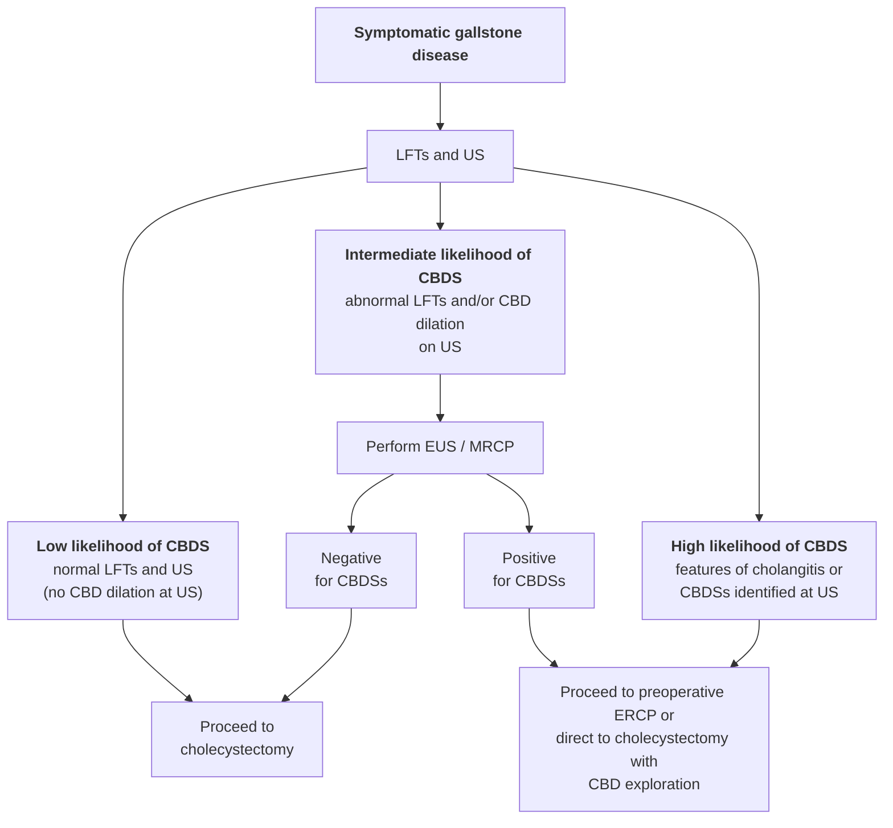
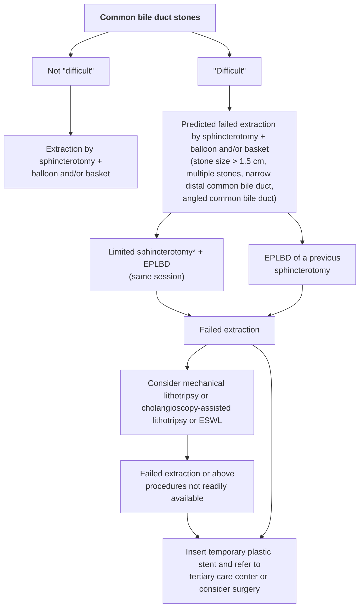

# Endoscopic management of common bile duct stones: European Society of Gastrointestinal Endoscopy (ESGE) guideline

**Authors**

Gianpiero Manes¹, Gregorios Paspatis², Lars Aabakken³, Andrea Anderloni⁴, Marianna Arvanitakis⁵, Philippe Ah-Soune⁶, Marc Barthet⁷, Dirk Domagk⁸, Jean-Marc Dumonceau⁹, Jean-Francois Gigot¹⁰, Istvan Hritz¹¹, George Karamanolis¹², Andrea Laghi¹³, Alberto Mariani¹⁴, Konstantina Paraskeva¹⁵, Jürgen Pohl¹⁶, Thierry Ponchon¹⁷, Fredrik Swahn¹⁸, Rinze W. F. ter Steege¹⁹, Andrea Tringali²⁰, Antonios Vezakis²¹, Earl J. Williams²², Jeanin E. van Hooft²³

**Institutions**

1. Department of Gastroenterology, ASST Rhodense, Rho and Garbagnate M.se Hospitals, Milan, Italy
2. Gastroenterology Department, Benizelion General Hospital, Heraklion, Crete, Greece
3. GI Endoscopy, Rikshospitalet University Hospital, Hospital and Faculty of Medicine, University of Oslo, Oslo, Norway
4. Digestive Endoscopy Unit, Division of Gastroenterology, Humanitas Research Hospital, Rozzano, Milan, Italy
5. Department of Gastroenterology, Hepatology and Digestive Oncology, Erasme University Hospital Université Libre de Bruxelles, Brussels, Belgium
6. Service d'Hépato-Gastroentérologie, Hôpital Saint-Musse, Toulon, France
7. Service d'Hépato-gastroentérologie, Hôpital Nord, Marseille, France
8. Department of Medicine B, University of Münster, Münster, Germany
9. Gedyt Endoscopy Center, Buenos Aires, Argentina
10. Department of Abdominal Surgery and Transplantation, Cliniques Universitaires Saint-Luc, Université Catholique de Louvain, Brussels, Belgium
11. Semmelweis University, 1st Department of Surgery, Endoscopy Unit, Budapest, Hungary
12. Academic Department of Gastroenterology, Laiko General Hospital, Medical School, National and Kapodistrian University of Athens, Athens, Greece
13. Pathological Sciences, Sapienza University, Rome, Italy
14. Pancreato-Biliary Endoscopy and Endosonography Division, Pancreas Translational & Clinical Research Center, Vita-Salute San Raffaele University, IRCCS San Raffaele Scientific Institute, Milan, Italy
15. Gastroenterology Unit, Konstantopoulio General Hospital, Athens, Greece
16. Department of Gastroenterology and Interventional Endoscopy, Klinikum Friedrichshain, Berlin, Germany
17. Department of Digestive Diseases, Hôpital Edouard Herriot, Lyon, France
18. Center for Digestive Diseases, Karolinska University Hospital and Division of Surgery, CLINTEC, Karolinska Institute, Stockholm, Sweden
19. Department of Gastroenterology and Hepatology, University of Groningen, University Medical Center Groningen, Groningen, The Netherlands
20. Digestive Endoscopy Unit, Catholic University, Rome, Italy
21. Gastroenterology Unit, 2 Department of Surgery, School of Medicine, National and Kapodistrian University of Athens, Athens, Greece
22. Department of Gastroenterology, Royal Bournemouth Hospital, Bournemouth, UK
23. Department of Gastroenterology and Hepatology, Amsterdam University Medical Center, University of Amsterdam, Amsterdam, The Netherlands

**Bibliography**

DOI https://doi.org/10.1055/a-0862-0346
Published online: 3.4.2019 | Endoscopy 2019; 51: 472–491
© Georg Thieme Verlag KG Stuttgart · New York
ISSN 0013-726X

**Corresponding author**

Gianpiero Manes, MD, Department of Gastroenterology, ASST Rhodense, Rho and Garbagnate M.se Hospitals, Viale Forlanini 95, 20024 Garbagnate M.se, Milano, Italy
gimanes@tin.it

Appendix 1s, Tables 1s – 14s
Online content viewable at:
https://doi.org/10.1055/a-0862-0346

## MAIN RECOMMENDATIONS

ESGE recommends offering stone extraction to all patients with common bile duct stones, symptomatic or not, who are fit enough to tolerate the intervention.
Strong recommendation, low quality evidence.

ESGE recommends liver function tests and abdominal ultrasonography as the initial diagnostic steps for suspected common bile duct stones. Combining these tests defines the probability of having common bile duct stones.
Strong recommendation, moderate quality evidence.

ESGE recommends endoscopic ultrasonography or magnetic resonance cholangiopancreatography to diagnose common bile duct stones in patients with persistent clinical suspicion but insufficient evidence of stones on abdominal ultrasonography.
Strong recommendation, moderate quality evidence.

ESGE recommends the following timing for biliary drainage, preferably endoscopic, in patients with acute cholangitis, classified according to the 2018 revision of the Tokyo Guidelines:

- severe, as soon as possible and within 12 hours for patients with septic shock
- moderate, within 48–72 hours
- mild, elective.

Strong recommendation, low quality evidence.

ESGE recommends endoscopic placement of a temporary biliary plastic stent in patients with irretrievable biliary stones that warrant biliary drainage.
Strong recommendation, moderate quality of evidence.

ESGE recommends limited sphincterotomy combined with endoscopic papillary large-balloon dilation as the first-line approach to remove difficult common bile duct stones.
Strong recommendation, high quality evidence.

ESGE recommends the use of cholangioscopy-assisted intraluminal lithotripsy (electrohydraulic or laser) as an effective and safe treatment of difficult bile duct stones.
Strong recommendation, moderate quality evidence.

ESGE recommends performing a laparoscopic cholecystectomy within 2 weeks from ERCP for patients treated for choledocholithiasis to reduce the conversion rate and the risk of recurrent biliary events.
Strong recommendation, moderate quality evidence.

## PUBLICATION INFORMATION

This Guideline is an official statement of the European Society of Gastrointestinal Endoscopy (ESGE). It provides practical advice on how to manage common bile duct stones. The Grading of Recommendations Assessment, Development, and Evaluation (GRADE) system was adopted to define the strength of recommendations and the quality of evidence.

## 1 Introduction

Gallstones are a very common problem in developed countries [1–3]. Most patients with gallstones remain asymptomatic throughout their lifetime [4, 5], but 10%–25% of them may develop biliary pain or complications [6–9], with an annual risk of about 2%–3% for symptomatic disease [10] and 1%–2% for major complications [11]. The development of symptomatic disease and complications is mostly related to the migration of stones into the common bile duct (CBD). Common bile duct stones (CBDSs) may be treated by endoscopic retrograde cholangiopancreatography (ERCP) or surgically during cholecystectomy. The aim of this evidence- and consensus-based Guideline, commissioned by the European Society of Gastrointestinal Endoscopy (ESGE), is to provide practical advice on how to manage patients with CBDSs. It considers diagnostic strategies in patients with suspected CBDSs, as well as the different therapeutic options available for CBDSs.

## 2 Methods

The ESGE commissioned this Guideline (chair J.v.H.) and appointed a guideline leader (G.M.), who invited the listed authors to participate in the project development. The key questions were prepared by the coordinating team (G.M. and G.P.) and then approved by the other members. The coordinating team formed task-force subgroups, each with its own leader, and divided the key topics among these task forces (**Appendix 1s**; see online-only Supplementary Material).

Each task force performed a systematic literature search to prepare evidence-based and well-balanced statements on their assigned key questions. The coordinating team independently performed systematic literature searches, with PubMed/Medline, EMBASE, the Cochrane Library, and the internet being finally searched for papers published until April 2018. The search focused on fully published randomized controlled trials (RCTs), meta-analyses, and prospective series. Retrospective analyses, case series, and abstracts were also included if they addressed topics not covered in the prospective studies. The literature search was restricted to papers published in English after 1990.

After further exploration of their content, articles that contained relevant data were then included and summarized in the literature tables for the key topics (**Tables 1s–14s**). All selected articles were graded by the level of evidence and strength of recommendation according to the GRADE system [12]. Each task force developed a draft and proposed statements on their assigned key questions, which were discussed and voted on during plenary meetings held in February 2017 in Düsseldorf, Germany, and in October 2017 in Barcelona, Spain. In April

## ABBREVIATIONS

| Abbreviation | Definition |
|---|---|
| **ABP** | acute biliary pancreatitis |
| **ASGE** | American Society for Gastrointestinal Endoscopy |
| **CBD** | common bile duct |
| **CBDS** | common bile duct stones |
| **CI** | confidence interval |
| **CT** | computed tomography |
| **DPOC** | direct peroral cholangioscopy |
| **EHL** | electrohydraulic lithotripsy |
| **EPLBD** | endoscopic papillary large-balloon dilation |
| **ERCP** | endoscopic retrograde cholangiopancreatography |
| **ESGE** | European Society of Gastrointestinal Endoscopy |
| **ESWL** | extracorporeal shock wave lithotripsy |
| **EUS** | endoscopic ultrasonography |
| **IOC** | intraoperative cholangiography |
| **IRR** | incidence rate ratio |
| **LFT** | liver function test |
| **MBC** | mother–baby cholangioscopy |
| **MRCP** | magnetic resonance cholangiopancreatography |
| **NR-ERCP** | non-radiation ERCP |
| **NSAID** | nonsteroidal anti-inflammatory drug |
| **OR** | odds ratio |
| **OTS** | out of the scope |
| **PTBD** | percutaneous transhepatic biliary drainage |
| **RCT** | randomized controlled trial |
| **RR** | relative risk |
| **SD** | standard deviation |
| **SEMS** | self-expanding metal stent |
| **SOC** | single-operator cholangioscopy |
| **TTS** | through the scope |
| **UDCA** | ursodeoxycholic acid |

2018, a draft prepared by the coordinating team was sent to all group members.

After agreement of all group members, the manuscript was reviewed by two members of the ESGE Governing Board, and by two external reviewers and was then sent for further comments to the ESGE National Societies and Individual Members. The manuscript was then submitted to *Endoscopy* for publication. All authors agreed on the final revised manuscript. This Guideline was issued in 2019 and will be considered for review in 2023, or sooner if new and relevant evidence becomes available. Any updates to the Guideline in the interim will be noted on the ESGE website: http://www.esge.com/esgeguidelines.html.

## 3 General principles

### 3.1 Epidemiology

Gallstones are common with a prevalence as high as 10%–15% in developed countries [1–3] and an overall cumulative incidence of gallstone formation of 0.60% per year [13].

According to a large Swedish registry [14], the prevalence of CBDSs detected during intraoperative cholangiography (IOC) is 11.6 % in patients with symptomatic gallbladder stones; other prospective studies have described a prevalence of CBDSs detected during IOC ranging from 4.6 % to 12 % in Europe [15, 16], and up to 20.9 % in South America [17]. A prevalence of 8 %– 18 % for CBDSs in patients with symptomatic gallbladder stones has been proposed [18].

No studies have focused on the prevalence of CBDSs in patients with asymptomatic gallbladder stones, as most studies are based on IOC during cholecystectomy for symptomatic disease.

### 3.2 The natural history of CBDSs and recommended handling

> **RECOMMENDATION**
> ESGE recommends offering stone extraction to all patients with common bile duct stones, symptomatic or not, who are fit enough to tolerate the intervention.
> Strong recommendation, low quality evidence.

The natural history of CBDSs is not well described, but data from the GallRiks study [14] suggest that, if CBDSs are detected, they should be removed to reduce the risk of complications over time: of the 3969 patients with CBDSs on IOC, 594 had their CBDSs left in place. During follow-up, ranging from 0 to 4 years, 25.3 % of patients with CBDSs in situ developed complications (pancreatitis, cholangitis, or obstruction of the bile duct) vs. 12.7 % of patients who had undergone CBDS removal (odds ratio [OR] 0.44, 95 %CI 0.35–0.55). The likelihood of an unfavorable outcome increased with the size of the CBDS, but the incidence of complications even for CBDSs less than 4 mm was 5.9 % vs. 8.9 % for larger CBDSs (OR 0.52, 95 %CI 0.34–0.79).

These data support a strategy of extracting CBDSs regardless of size, although some previous studies have suggested that small unsuspected stones can pass spontaneously without the need for intervention [16, 19–22] (**Table 1s**). The spontaneous passage of small CBDSs without serious complications has been documented by Collins [15] in 24 of 46 patients with a filling defect observed on IOC in whom a cystic duct catheter was left in place after laparoscopic cholecystectomy. The asymptomatic migration of small (less than 8 mm) stones has also been noted in the interval between diagnosis at endoscopic ultrasonography (EUS) and ERCP [23].

In spite of the absence of controlled studies, some factors favor a policy of stone extraction in asymptomatic CBDSs: the occurrence of unfavorable outcomes is not different in patients

classified as asymptomatic or symptomatic [14]; the lifetime risk of untreated CBDSs is unknown and may be higher than that reported; severe complications such as cholangitis, pancreatitis, or obstructive jaundice can occur without preceding warning symptoms [24]. A conservative approach can only be considered in patients where the risks of surgical or endoscopic CBDS extraction are higher than the risks of leaving stones in situ. When offering stone extraction to asymptomatic patients with CBDSs, patients should be made aware of the limited evidence regarding this recommendation and of the risk of ERCP, which may be elevated in asymptomatic patients [25].

## 4 Defining the risk of having CBDSs

### 4.1 Initial evaluation

> **RECOMMENDATION**
> ESGE recommends liver function tests and abdominal ultrasonography as the initial diagnostic steps for suspected common bile duct stones. Combining these tests defines the probability of having common bile duct stones.
> Strong recommendation, moderate quality evidence.

Patients at risk of having CBDSs, such as patients with gallstones who present with symptoms, undergo non-invasive tests such as liver function tests (LFTs) and abdominal ultrasound as triage to determine the need for further evaluations to confirm the presence of CBDSs.

A recent systematic review including five studies assessed the diagnostic accuracy of LFTs (1 study) and ultrasonography (5 studies) for CBDSs [26]. All studies were of poor methodological quality. The sensitivities of bilirubin (cutoff > 22.23 μmol/L or > 1.3 mg/dL) and alkaline phosphatase (cutoff > 125 U/L) for CBDSs were 84 % (95 % confidence interval [CI] 64 %–95 %) and 91 % (95 %CI 74 %–99 %), respectively; the specificities were 91 % (95 %CI 86 %–94 %) and 79 % (95 %CI 74 %–84 %), respectively. Regarding ultrasonography, sensitivity was 73 % (95 %CI 44 %–95 %) and specificity was 91 % (95 %CI 84 %–95 %). Ultrasonography findings were considered positive if there was visualization of CBDSs and/or CBD dilatation.

Multidetector multiphase computed tomography (CT), when used to investigate patients with CBDSs, had a sensitivity of 78 % and a specificity of 96 % in a retrospective study [27]. The size and composition of the stones significantly affects CT accuracy, which is significantly lower when stones are less than 5 mm (56.5 % vs. 81.2 %) or have a similar density to bile [28]. Coronal reconstruction does not increase the diagnostic efficiency of CT scanning [29].

The pretest probability of CBDSs in suspected patients is essential to select which patients will benefit most from a more accurate assessment. Several predictive models have been developed combining clinical, biochemical, and ultrasonography findings in order to identify high risk patients [30–34] (**Table 2s**).

The risk of having CBDSs in spite of normal LFTs and ultrasonography has been adequately evaluated in two studies [35, 36]. In a large study including 765 patients with ERCP-proven CBDSs, 541 had previously documented LFTs and 29 (5.4 %) had normal LFTs. Age more than 55 years and the presence of pain were independently associated with normal LFTs in patients with CBDSs [35]. A more recent retrospective study including 413 patients with gallstones who underwent ultrasonography and magnetic resonance cholangiopancreatography (MRCP) for suspected CBDSs showed that 109/413 (26.3 %) had CBDSs revealed on the MRCP, but in 7/109 (6.4 %) ultrasonography and LFTs (one or more of total bilirubin, ALP, AST, ALT, or GGT) were normal [36] (**Table 2s**).

### 4.2 Role of EUS and MRCP

> **RECOMMENDATION**
> ESGE recommends endoscopic ultrasonography or magnetic resonance cholangiopancreatography to diagnose common bile duct stones in patients with persistent clinical suspicion but insufficient evidence of stones on abdominal ultrasonography.
> Strong recommendation, moderate quality evidence.

The diagnostic accuracy of EUS and MRCP for the detection of CBDSs has been widely investigated. Meeralam and co-workers in a recent meta-analysis of five head-to-head studies [37] demonstrated that diagnostic accuracy was high for both methods (sensitivity 97 % vs. 90 % and specificity 87 % vs. 92 % for EUS and MRCP, respectively), but the overall diagnostic OR of EUS was significantly higher (P = 0.008). They showed that this was mainly because of the significantly higher sensitivity of EUS, as compared with that of MRCP, especially in the detection of small stones, while the specificity was not significantly different. High accuracy for both methods was demonstrated by another meta-analysis including 18 studies (2 comparative, 5 evaluating MRCP alone and 11 EUS alone) [38]. Sensitivity and specificity were respectively 95 % (95 %CI 91 %–97 %) and 97 % (95 %CI 94 %–99 %) for EUS, and 93 % (95 %CI 87 %–96 %) and 96 % (95 %CI 90 %–98 %) for MRCP.

Various considerations may help to select the most adequate procedure if both are available and the patient does not present any factors that would impede MRCP, such as claustrophobia, obesity, cardiac pacemaker, or metal clips. Sonnemberg and colleagues [39], performing a threshold analysis on costs, concluded that, for a pretest probability of CBDSs < 40 %, MRCP would represent the procedure of choice. For a pretest probability in the range 40 %–91 %, EUS should be the preferred imaging modality, because it allows an ERCP to be performed in the same session if the EUS results are positive for CBDSs. However, the applicability of their results is limited because they are strictly influenced by the costs of each procedure and local rules of reimbursement. Furthermore, logistic issues regarding the scheduling of an EUS and an ERCP during the same examination slot should be taken into consideration. The minimally invasive nature of MRCP, its suitability if there is altered gastroduodenal anatomy, and its ability to visualize the whole biliary tree should also be considered when deciding between the two methods.

### 4.3 An algorithm for investigating suspected CBDSs

**▶Fig. 1** depicts an algorithm for investigating suspected CBDSs. ERCP can be performed in patients without cholangitis only when CBDSs are visible on imaging modalities that have a high specificity. Normal LFTs and ultrasonography indicate a low risk of CBDSs and no further evaluations are recommended, unless the patient continues to have symptoms that suggest CBDSs. All other pictures depict an intermediate risk of CBDSs, which should prompt further investigation by EUS or MRCP. In the absence of a morphological diagnosis of CBDSs, ERCP should be performed immediately only in patients with a clinical picture of cholangitis (see section 8.1).

**▶Fig. 1** Diagnostic algorithm for suspected common bile duct stones (CBDSs). LFTs, liver function tests; US, ultrasound; CBD, common bile duct; EUS, endoscopic ultrasonography; MRCP, magnetic resonance cholangiopancreatography; ERCP, endoscopic retrograde cholangiopancreatography.

## 5 Performing ERCP

### 5.1 Antibiotic prophylaxis

> **RECOMMENDATION**
> ESGE suggests against the use of routine antibiotic prophylaxis before ERCP for bile duct stones.
> Weak recommendation, moderate quality evidence.

The ERCP procedure is often associated with the occurrence of bacteremia [40], which is mostly transient. The occurrence of cholangitis is an infrequent event, which occurs mainly in a subgroup of patients at higher risk, such as those with biliary obstruction and incomplete biliary drainage [41].

The role of antibiotic prophylaxis in reducing the rate of cholangitis has been evaluated by several RCTs, which differed significantly in terms of type of antibiotic, duration of administration, and indications for ERCP [42–47] and three meta-analyses (**Table 3s**) [48–50].

The most recent meta-analysis of nine RCTs [50] (1573 patients) indicated that antibiotic prophylaxis could reduce bacteremia and may prevent cholangitis and septicemia in patients undergoing elective ERCP. However, in random-effects meta-analyses, only the effect on bacteremia remained significant; if ERCP resolved the biliary obstruction at the first procedure, there was no significant benefit in using antibiotic prophylaxis to prevent cholangitis (relative risk [RR] 0.98, 95 %CI 0.35–2.69, only three trials) [50].

Cotton et al. [51] reported in a retrospective series of 11 484 ERCPs performed over 11 years that, in spite of a progressive reduction in the use of antibiotic prophylaxis over the years (from 95 % to 25 % of ERCP patients), the incidence of infections decreased from 0.48 % to 0.25 %. In the multivariate model, endoscopic treatment of CBDSs was not associated with an increased risk of developing cholangitis after ERCP. All these data suggest that not all patients benefit from antibiotic prophylaxis and that patients with CBDSs should not routinely receive antibiotic prophylaxis before ERCP (**Table 3s**).

Patients with ongoing acute cholangitis should already be receiving antibiotics at the time of intervention and additional antibiotics are not recommended.

Antibiotic prophylaxis should be considered for patients with refractory CBDSs undergoing extracorporeal shock wave lithotripsy (ESWL) for CBD clearance [52, 53]. No data are available for patients undergoing cholangioscopy-assisted lithotripsy; nevertheless, antibiotic prophylaxis is likely to be advisable as two recent prospective studies have demonstrated that cholangioscopy per se may carry a risk of bacteremia that ranges from 8.8 % to 13.9 % and that up to 9.7 % of patients may develop infective complications despite the use of post-procedure antibiotics [54]. Biopsy sampling, older age, previous stent placement, and laser lithotripsy or electrohydraulic lithotripsy (EHL) were likely to increase the risk of developing either infection or persistent bacteremia.

Antibiotic prophylaxis in some special conditions, such as in liver transplant patients, was considered to be out of the scope of this guideline.

### 5.2 Gaining access to the biliary tree

> **RECOMMENDATION**
> ESGE recommends that an adequate exit for the stones that are to be removed should be provided according to the papilla and common bile duct anatomy and the stone size.
> Strong recommendation, low quality evidence.

The various technical aspects, either of deep biliary cannulation or endoscopic sphincterotomy, have been reviewed in other guidelines [55, 56]. A critical step to obtain successful stone extraction is to provide an adequate exit for the stones that are to be removed by endoscopic sphincterotomy alone, endoscopic papillary balloon dilation alone, or a combination of both [55, 57]. Papillary balloon dilation alone however remains unpopular and is not advocated for routine use as it is associated with a lower technical success for stone clearance, the need for mechanical lithotripsy more frequently than with endoscopic sphincterotomy, and a presumed increased risk of pancreatitis [55, 58, 59]. At present, the use of primary papillary balloon dilation without endoscopic sphincterotomy is considered mainly in patients with coagulopathy or with altered anatomy who have stones smaller than 8 mm [55]. The appropriate length of endoscopic sphincterotomy should be adjusted according to the papillary anatomy and stone size. Data on the effect of endoscopic sphincterotomy length on the rate of stone recurrence are presently contradictory [60, 61].

### 5.3 Stone extraction

> **RECOMMENDATION**
> ESGE recommends that balloon and basket catheters are equally effective and safe for common bile duct stone removal.
> Strong recommendation, moderate quality evidence.

Two multicenter RCTs have compared the efficacy of balloon vs. basket catheters for the extraction of CBDSs sized ≤ 10 mm or < 11 mm after endoscopic sphincterotomy [62, 63]. In one RCT (158 patients), the balloon catheter achieved a higher clearance rate than the basket catheter (92.3 % vs. 80.0 %) [62]. The other RCT (184 patients) reported similar efficacies for basket and balloon catheters for stone extraction, but a stone diameter of < 6 mm was independently associated with failed stone removal within 10 minutes using a basket catheter, because of the inability to grasp the stone with the basket [63]. No differences in safety were reported in the two studies.

Stone extraction baskets and balloons are commercially available in various configurations. As yet, no comparative studies between various models of basket catheters exist [64]. In general, choosing which device to use depends mainly on the anatomy of the bile duct, the stone characteristics, financial considerations, and personal preferences.

### 5.4 Biliary stenting for incomplete removal of CBDSs

> **RECOMMENDATION**
> ESGE recommends endoscopic placement of a temporary biliary plastic stent in patients with irretrievable biliary stones that warrant biliary drainage.
> Strong recommendation, moderate quality of evidence.

Endoscopic sphincterotomy with stone extraction has success rates of 80 %–90 % in the treatment of CBDSs [65]. When CBDSs cannot be completely removed, a plastic stent is often placed to relieve the obstruction, before a second attempt at stone extraction is made or a subsequent surgical intervention is undertaken. An indwelling endoprosthesis may reduce the volume and number of stones, as reported by nine studies (three prospective [66–68] and six retrospective [69–74]) involving a total of 364 patients (Table 4s). The success rate for stone removal after previous ERCP with biliary stenting has been reported to range from 44 % to 96 % (Table 5s) [66–73, 75, 76].

The mechanism by which stones change in number and size is unclear. It is likely that continuous friction between the plastic stent and the stones produces stress forces that facilitate the disintegration of stones and reduce their size [71].

There are no studies comparing the different types of biliary plastic stents or plastic vs. metal stents. Similarly, there are no specific prospective comparative data with regard to whether one or more than one biliary stent is preferable in patients with incomplete stone removal. In the only retrospective published study, 64 elderly patients (≥ 65 years) with large (≥ 20 mm) or multiple (≥ 3) CBDSs underwent placement of single or double plastic stents at the time of initial ERCP. Approximately 3 months later, stone removal was attempted at a second ERCP using standard techniques. Double plastic biliary stenting (7 or 8.5 Fr) was superior to single stenting (8.5 Fr) in maintaining higher 3-month stent patency rates (P = 0.008), but was similar in terms of reducing the size and number of stones [77]. No differences in complications were found.

In recent years, some studies with small patient series have evaluated the management of incomplete stone removal using fully covered self-expanding metal stents (SEMSs) (**Table 6s**) [78–80]. In the largest retrospective case series [80], 44 patients received covered SEMSs (diameter 10 mm, length 60 mm). After a median in-stent duration of 8 weeks, 36/42 stents (82 %) were removed with successful duct clearance. The median post-procedure follow-up was 15 months. Four patients (9 %) developed post-ERCP pancreatitis (mild in 3, moderate in 1), two patients (4 %) developed post-procedure cholangitis, and one (2 %) hematemesis. During follow-up, 10 patients (22.7 %) had incidental stent migration (distally in 6, proximally in 4), but in none of them was it clinically significant, with all being discovered at the time of subsequent ERCP.

At present, covered SEMSs can be considered as an alternative to plastic stents to drain the bile ducts after unsuccessful stone removal, but there are uncertainties over how long the stents should be left in place and the cost–benefit ratio of the treatment.

### 5.5 Timing of stent removal/exchange

> **RECOMMENDATION**
> ESGE recommends that a plastic stent placed because of incomplete common bile duct stone clearance should be removed or exchanged within 3–6 months to avoid infectious complications.
> Strong recommendation, moderate quality of evidence.

> **RECOMMENDATION**
> ESGE recommends against the use of definitive biliary stenting in patients with incomplete common bile duct stone clearance because of the high complication and mortality rates on medium-term follow-up.
> Strong recommendation, moderate quality of evidence.

Intervals of 3–6 months for routine ERCP and stent change are commonly recommended to reduce the rate of complications, mainly cholangitis [70, 76]. One randomized prospective study including 78 patients with primary failure for biliary stone removal who had undergone insertion of a 10-Fr plastic stent compared two different managements: either systematic stent exchange every 3 months or stent exchange on demand if symptoms occurred. Cholangitis was significantly more frequent in the group with on-demand stent exchange (35.9 % vs. 7.7 %; P < 0.03) [81].

Definitive stenting has been suggested for difficult CBDSs in the elderly with co-morbidities and a limited life expectancy, given that ERCP in patients aged > 90 years may carry risks of bleeding, cardiopulmonary events, and mortality that are increased two to three fold (incidence rate ratio [IRR] 2.4, 95 %CI 1.1–5.2; IRR 3.7, 95 %CI 1.0–13.9; and IRR 3.8, 95 %CI 1.0–14.4, respectively), and that patients aged > 80 years had a two-fold risk of procedure-related death (IRR 2.4; 95 %CI 1.3–4.5) [82]. However, definitive stenting for CBDSs should be approached with caution. Six series, including 230 patients [83–88], have reported a complication rate for definitive biliary stenting, mainly cholangitis, of 34 %–63 %, with a 2.3 %–23.5 % mortality rate during 16–39 months of follow-up (**Table 7s**).

### 5.6 Role of dissolution therapy

> **RECOMMENDATION**
> EGSE suggests against the use of ursodeoxycholic acid or other choleretic agents, either for the treatment of CBDSs or to prevent the recurrence of CBDSs after endoscopic clearance.
> Weak recommendation, moderate quality of evidence.

Ursodeoxycholic acid (UDCA) with or without terpene preparation (Rowachol) has been suggested as a complementary treatment to induce stone reduction when used together with biliary endoprostheses, but in two RCTs the addition of UDCA therapy to endoprosthetic treatment showed no effect on stone size reduction or successful duct clearance [66, 68].

UDCA has been administered with the aim of reducing the rate of stone recurrence after successful removal of CBDSs in patients with risk factors such as CBD dilatation, delayed biliary emptying (biliary stricture, papillary stenosis), or the presence of gallstones, a periampullary diverticulum, or systemic diseases that cause stone formation [89–91]. Two RCTs have investigated this issue and both revealed no significant difference regarding stone recurrence [92, 93].

## 6 Difficult stones

"Difficult" biliary stones are defined according to their diameter (> 1.5 cm), number, unusual shape (barrel-shaped), or location (intrahepatic, cystic duct), or because of anatomical factors (narrowing of the bile duct, distal to the stone, sigmoid-shaped CBD, stone impaction, shorter length of the distal CBD, or acute distal CBD angulation < 135°) [94, 95]. Clearance of a difficult stone cannot usually be obtained using standard techniques, so multiple procedures and additional interventional techniques (large-balloon dilation, mechanical lithotripsy, cholangioscopy-assisted electrohydraulic/laser lithotripsy, or ESWL) may be required [96].

## 6.1 Gaining access to the biliary tree and basic treatment for the management of difficult stones

Since the original description in 2003 by Ersoz et al., the use of endoscopic papillary large-balloon dilation (EPLBD) after endoscopic sphincterotomy has become widespread for the management of difficult CDBSs [97]. Overall, seven RCTs [98–104] and five meta-analyses [105–109] have compared the efficacy and safety of EPLBD with endoscopic sphincterotomy vs. endoscopic sphincterotomy alone (**Table 8s**).

In summary, endoscopic sphincterotomy + EPLBD reduces the need for mechanical lithotripsy by about 30 %–50 % in comparison with endoscopic sphincterotomy alone [100, 102, 103], while the overall rate of successful stone removal remains identical [105–108]. The rate of major adverse events, mainly pancreatitis, bleeding, and perforation, between the two groups was similar in 6 of 7 RCTs [99–104], whereas it was significantly lower for EPLBD plus endoscopic sphincterotomy compared with endoscopic sphincterotomy alone in the study by Stefanidis et al. [98]. In a systematic review (30 studies considered), the rate of overall adverse events (pancreatitis, bleeding, perforation) was lower for endoscopic sphincterotomy with EPLBD than for endoscopic sphincterotomy alone (8.3 % vs. 12.7 %, OR 1.60; P < 0.001) [110].

Based on these data, if large bile duct stones are seen on ERCP or cross-sectional imaging, endoscopic sphincterotomy combined with EPLBD can be used as a first-line approach to facilitate difficult biliary stone removal [111]. Another possible indication for performing EPLBD is the treatment of recurrent CBDSs in individuals with a previous endoscopic sphincterotomy because extension of an endoscopic sphincterotomy may be associated with a high risk of bleeding and perforation [112–115] (▶Fig. 2).

EPLBD can be performed after either a large [97, 98, 114, 116–121] or limited endoscopic sphincterotomy [99, 120, 122–127]. A multicenter retrospective analysis from Asia including 946 patients [120] found large endoscopic sphincterotomy before EPLBD to be independently associated with an increase in overall adverse events (OR 3.4, 95 %CI 1.8–6.6; P < 0.001). The risk of bleeding was higher in the large vs. limited endoscopic sphincterotomy group (OR 6.2, 95 %CI 2.4–16.3; P < 0.001). Perforation was found in only nine patients but it was fatal in three of them. Although only distal CBD stricture and not size of endoscopic sphincterotomy was an independent predictor of perforation, two of the three fatal cases were associated with a large endoscopic sphincterotomy. A

**▶Fig. 2** Therapeutic algorithm for management of common bile duct stones when ERCP is selected as the primary treatment. ERCP, endoscopic retrograde cholangiopancreatography; EPLBD, endoscopic papillary large-balloon dilation (12–20 mm); ESWL, extracorporeal shock wave lithotripsy.

\* EPLBD without sphincterotomy suggested in those with coagulopathy.

> **RECOMMENDATION**
> ESGE recommends limited sphincterotomy combined with endoscopic papillary large-balloon dilation as the first-line approach to remove difficult common bile duct stones.
> Strong recommendation, high quality evidence.

recent literature review suggested performing a small or midsized endoscopic sphincterotomy (1/3 to 1/2 of the distance to the papillary roof) rather than a large one before EPLBD [128]. Nevertheless, in real life most endoscopists decide to perform EPLBD when their attempts to remove the stones have failed after having already performed a complete endoscopic sphincterotomy.

EPLBD is performed with a dilation balloon diameter that ranges from 12 to 20 mm. Criteria for deciding the balloon size for EPLBD have not been specifically evaluated in prospective studies. In most published studies, the diameter of the distal part of the CBD has been used as the criterion to select the size of the balloon [98–100, 120, 121]. The risk of perforation increases when the diameter of the balloon is larger than the diameter of the distal part of the CBD and in the presence of a stricture [111].

The vast majority of studies have reported a dilation duration of 10–180 seconds from the disappearance of the waist, with only three studies reporting a duration in excess of 60 seconds [110]. One RCT has demonstrated that the rate of complications is similar whether EPLBD duration is either 30 or 60 seconds [121]. Moreover, a meta-analysis has demonstrated that a short duration (< 1 minute) vs. a long duration (≥ 1 minute) for EPLBD does not significantly affect the rate of CBD clearance [105]. According to these data, the duration of balloon dilation should be between 30 and 60 seconds from the disappearance of the waist [111].

## 6.2 Mechanical lithotripsy

> **RECOMMENDATION**
> ESGE recommends mechanical lithotripsy for difficult stones when sphincterotomy plus endoscopic papillary large-balloon dilation has failed or is inappropriate.
> Strong recommendation, moderate quality evidence.

Mechanical lithotripsy is the simplest available method of fragmenting CBDSs. It consists of entrapping the stone within a reinforced basket and then crushing it by closing the basket against a metal spiral sheath. Two techniques of mechanical lithotripsy are used: out of the scope (OTS) and through the scope (TTS). The OTS technique represents a "salvage" procedure to be performed when a standard basket engages a large stone and becomes impacted in the papilla, while the TTS technique is preferred in elective cases.

Mechanical lithotripsy has been reported to be an effective and safe technique, but multiple sessions may be required. The reported success rates range between 76 % and 91 % and overall complications from 3 % to 34 % with minimal mortality [129–134] (**Table 9s**). Three studies have evaluated the predictors of mechanical lithotripsy failure using multivariate analysis. In a retrospective study [130], stone size was the only variable that affected the success rate. A subsequent prospective study [129] reported that stone size should be considered together with the diameter of the bile duct, suggesting that only the presence of stone impaction significantly predicted the failure of mechanical lithotripsy. In another more recent retrospective study [132], stone impaction, stone size > 30 mm, and stone to CBD diameter ratio > 1 were significant predictors of mechanical lithotripsy failure.

The most common and feared complications of mechanical lithotripsy are entrapment of the basket, a broken basket, a traction wire fracture, or a broken handle. In a multicenter study by Thomas et al. [135], including 643 patients and using the TTS technique, the incidence of mechanical lithotripsy-related technical complications was 3.5 %. These complications are usually treated by other types of lithotripsy (OTS, ESWL, or cholangioscopy-assisted lithotripsy), sphincterotomy extension, or stenting.

## 6.3 Cholangioscopy-assisted lithotripsy

> **RECOMMENDATION**
> ESGE recommends the use of cholangioscopy-assisted intraluminal lithotripsy (electrohydraulic or laser) as an effective and safe treatment of difficult bile duct stones.
> Strong recommendation, moderate quality evidence.

> **RECOMMENDATION**
> ESGE suggests that the type of cholangioscopy and lithotripsy should depend on local availability and experience.
> Weak recommendation, low quality evidence.

Intraductal shock wave lithotripsy represents an alternative method to fragment bile stones and allow their removal. There are two methods of generating shock waves in a fluid, using either a bipolar probe capable of generating a spark in the case of EHL or a pulsed dye laser system in the case of laser lithotripsy. Both EHL and laser lithotripsy are preferably performed under direct visualization with cholangioscopic guidance.

There are three major techniques for cholangioscopy: (i) a dual-operator dedicated mother–baby cholangioscopic (MBC) system; (ii) a single-operator catheter-based cholangioscopic system (SOC); and (iii) direct use of an ultraslim endoscope or slim gastroscope (direct peroral cholangioscopy [DPOC]). The procedures vary with respect to the number of operators, maneuverability, image quality, and method of access, resulting in variable success rates. A detailed ESGE technology review on cholangioscopy techniques was published recently [136]. All three techniques allow laser lithotripsy and EHL.

Korrapati et al. have reviewed the efficacy of peroral cholangioscopy for difficult bile duct stones [137]. They estimated an overall rate of stone clearance of 88 % (95 %CI 85 %–91 %), with SOC showing a high technical success rate. No attempt was made to compare EHL and laser lithotripsy.

Both EHL and laser lithotripsy are effective methods for the removal of difficult bile duct stones, with a 69 %–81 % clearance rate in one session and a 97 %–100 % clearance rate after multiple sessions [138–141]. However, no direct comparisons between the different methods have been published. In one recent RCT, patients with bile duct stones > 1 cm were treated with either laser lithotripsy or conventional therapy (included EPLBD and mechanical lithotripsy) and achieved one-session endoscopic clearance rates of 93 % and 67 %, respectively [142].

When looking at the rough data of Korrapati et al. [137], the complication rate ranged between 0 % and 25 % (mean 7 %, 95 % CI 6 %–9 %). Cholangitis is the most frequently reported complication [139–141]. Pancreatitis is a rare complication, probably owing to the high percentage of pre-existent sphincterotomies [139].

Overall, the available data suggest that intraluminal lithotripsy is an effective and safe method to treat difficult biliary stones (**Table 10s**; **▶Fig. 2**), but there are no data supporting the superiority of one method over another.

## 6.4 Extracorporeal shock wave lithotripsy

> **RECOMMENDATION**
> ESGE suggests considering extracorporeal shock wave lithotripsy when conventional techniques have failed to achieve bile duct clearance and the intraluminal lithotripsy techniques are not available.
> Weak recommendation, low quality evidence.

ESWL uses electrohydraulic or electromagnetic energy to generate shock waves that then travel through the soft tissues of the body to fragment CBDSs [143].

ESWL is a complex and technically demanding procedure. A nasobiliary drain is inserted to allow fluoroscopic identification and targeting of CBDSs and to perform continuous irrigation of the bile duct with saline during ESWL. In addition, multiple ESWL sessions and subsequent ERCP procedures to extract stone fragments are required.

Ductal clearance rates of 70 %–90 % have been reported with ESWL [52, 144–150].

Several controlled trials have compared ESWL with EHL or laser lithotripsy for stone disruption. These studies suggest that the efficacy of final duct clearance with laser lithotripsy is superior to that of ESWL (83 %–97 % vs. 53 %–73 %) [146, 151], while it is similar for EHL and ESWL (74 % vs. 78.5 %) [145].

ESWL-related adverse events range from 9 % to 35.7 %, including mostly cholangitis and pancreatitis [143, 145, 146, 152, 153]. Minor side effects such as pain, local hematoma formation, and microhematuria are common.

## 7 Endoscopic CBDS management and surgery

ERCP with stone clearance represents the primary and definitive treatment in patients with CBDSs and previous cholecystectomy. In patients with CBDSs and in situ gallbladder, both the management of CBDSs and gallbladder removal should be considered.

When ERCP is the selected technique to treat CBDSs, different options are available with regards to the sequencing of endoscopy and surgery. Basically, ERCP can be performed prior to (preoperative ERCP), during ongoing (intraoperative ERCP), or after (post-operative ERCP) cholecystectomy. Preoperative ERCP is most commonly practiced, as it is highly effective and both the endoscopist and the surgeon treat the patient in an environment that is tailored to their own needs and routines.

### 7.1 The sequential strategy

> **RECOMMENDATION**
> ESGE recommends performing a laparoscopic cholecystectomy within 2 weeks from ERCP in patients treated for choledocholithiasis to reduce the conversion rate and the risk of recurrent biliary events.
> Strong recommendation, moderate quality evidence.

Laparoscopic cholecystectomy represents the standard treatment for patients with CBDSs and gallbladder stones following endoscopic CDBS clearance. A Cochrane review in 2007 [154], which considered five RCTs involving 662 patients treated for choledocholithiasis with cholecystolithiasis, revealed an advantage of cholecystectomy. Over a follow-up time varying from 17 months to more than 5 years, mortality was higher in the wait-and-see group compared with the cholecystectomy group (14.1 % vs. 7.9 %; RR 1.78, 95 %CI 1.15–2.75) and the difference persisted when only patients at high surgical risk were considered.

Similarly, endoscopic sphincterotomy followed by "wait and see" also resulted in a higher risk of biliary events, such as cholangitis, pancreatitis, jaundice, and biliary colic, as well as a higher risk for repeated biliary intervention (i. e. ERCP or percutaneous procedure): 35 % of the patients managed with endoscopic sphincterotomy followed by "wait and see" eventually underwent rescue cholecystectomy. The outcome of rescue cholecystectomy in patients with an ASA > 3 was not significantly different compared to elective cholecystectomy; however, patients unfit for surgery (i. e. ASA 4 and 5) were excluded in three of the five selected RCTs [155–157]. In the study by Suc et al. [158], 20 % of the included patients were classified as ASA 3–4, and mortality was not significantly different between the two groups in the intention-to-treat analysis (3.1 vs. 0.9 %). Also, in the RCT by Targarona et al. [159], mortality was not significantly different between the groups but, in the multivariate analysis, age, and not surgical risk, was an independent predictor of mortality.

Laparoscopic cholecystectomy after ERCP with endoscopic sphincterotomy is more difficult and when compared to standard laparoscopic cholecystectomy is mostly associated with a higher conversion rate and a higher rate of recurrent biliary events [157, 160, 161]. In this way, the timing of cholecystectomy performance after ERCP is a critical issue [155, 157, 162–167] (**Table 11s**). The timing of cholecystectomy may be defined as early, delayed, or on demand, but definitions of "early" or "delayed" differ among the studies. In general, with the exception of the study by Donkervoort et al. [168], where the timing of cholecystectomy did not affect the outcomes, conversion rate results are lower in the "early group" in all studies (4 %–23 % vs. 8 %–55 %); recurrent biliary events are lower when the laparoscopic cholecystectomy is performed "early" vs. "delayed or on demand" (2 %–10 % vs. 24 %–47 %) [155, 157, 162–167]. Overall, data are in favor of "early" laparoscopic cholecystectomy, but the exact timing remains controversial; despite this, waiting no longer than 2 weeks to perform laparoscopic cholecystectomy after ERCP seems to be advisable.

In patients with acute biliary pancreatitis (ABP) and in situ gallbladder, cholecystectomy is recommended to avoid a recurrence of pancreatitis. Some of these patients may have previously undergone ERCP and endoscopic sphincterotomy. The timing of cholecystectomy in mild ABP has been examined in two RCTs that randomized patients either to cholecystectomy within 48 hours of admission vs. after resolution of abdominal pain and normalizing trend of laboratory enzymes (n = 50) [169], or to cholecystectomy during the same admission vs. 4 weeks later (n = 266) [170]. Both studies concluded in favor of early cholecystectomy because it prevents recurrent gallstone-related complications (one study), shortens hospitalization (one study), and is equally safe (both studies). Similar conclusions were reached in a meta-analysis (eight cohort studies and one RCT, 998 patients) [171]. For severe ABP, data are limited and, based on observational studies [172, 173], it is recommended that cholecystectomy is performed once peripancreatic collections and local complications have resolved, generally beyond 6 weeks, to minimize the risk of infection in the peripancreatic collection.

In patients who do not undergo cholecystectomy following ABP, endoscopic biliary sphincterotomy reduces biliary events, in particular pancreatitis, during follow-up [171, 174, 175]. The most recent retrospective study (1119 patients) found that recurrent pancreatitis developed in 8.2 % vs. 17.1 % of patients with their gallbladder left in situ after ABP who had ERCP vs. no ERCP, respectively [174]. However, the gallbladder should be left in situ only in patients who are unfit for surgery as a meta-analysis (five RCTs, 662 patients) has shown that endoscopic CBD clearance alone is inferior to prophylactic cholecystectomy associated with CBD clearance in terms of mortality and recurrent biliary events [154].

## 7.2 Intraoperative ERCP

> **RECOMMENDATION**
> ESGE suggests considering intraoperative rendezvous ERCP in patients with common bile duct stones undergoing cholecystectomy.
> Weak recommendation, moderate quality evidence.

Intraoperative ERCP can be performed during laparoscopic cholecystectomy when an IOC demonstrates the presence of CBDSs; alternatively, it can be planned either as a one-stage approach in the treatment of combined cholecysto-choledocholithiasis or after the failure of a preoperative endoscopic attempt at CBDS clearance.

Conventional ERCP can be performed intraoperatively, but it exposes the patient to similar risks to a conventional ERCP performed preoperatively, albeit it is performed during the same anesthesia [176, 177]. Conversely, intraoperative ERCP with rendezvous cannulation offers the advantages of being a single-stage procedure and decreasing the risk of post-ERCP pancreatitis. Although each individual clinical trial is underpowered to validate this, there are six RCTs [176, 178–182] and approximately 15 observational studies pointing in the same direction [177, 183–197] (**Tables 12s** and **13s**). These results have been confirmed by six recent meta-analyses [198–202]. The most recent of these, comparing intraoperative rendezvous ERCP with sequential management, mainly laparoscopic cholecystectomy and preoperative ERCP, reported equal efficacy in terms of stone clearance rate (93 % vs. 95 %), but a significantly lower rate of morbidity (6 % vs. 11 %; OR 0.54, 95 %CI 0.31–0.96; P = 0.03), including post-ERCP pancreatitis (0.6 % vs. 4.4 %; OR 0.19, 95 %CI 0.06–0.67; P = 0.01) and length of hospital stay in the intraoperative ERCP group [202]. In addition, the Swedish GallRiks registry, comprising 12 718 ERCP procedures, demonstrated a substantial 50 % risk reduction in post-ERCP pancreatitis (3.6 % vs. 2.2 %; OR 0.5, 95 %CI 0.2–0.9; P = 0.002) when rendezvous cannulation was practiced [203].

Intraoperative rendezvous ERCP does however carry logistical problems related to the prolonged surgical time and the need to perform ERCP in an environment that is not adapted for endoscopy [180, 182, 189, 191, 204]. Failure to pass the guidewire along a narrow cystic duct or papilla is reported in about 8 % of cases (**Table 12s**); if this happens, the endoscopist must rely on conventional cannulation techniques and their associated risks.

## 7.3 Surgical treatment of CBDSs

> **RECOMMENDATION**
> ESGE suggests that, in patients undergoing laparoscopic cholecystectomy, transcystic or transductal exploration of the common bile duct is a safe and effective technique for common bile duct stone clearance. The recommendation takes into account that management is dependent on local expertise and resources.
> Weak recommendation, moderate quality evidence.

The surgical treatment of CBDSs can be performed during both laparoscopic and open cholecystectomy. It offers the valuable opportunity to definitively treat patients with combined cholecystolithiasis and choledocholithiasis in a one-stage procedure.

Several studies have compared laparoscopic bile duct exploration during laparoscopic cholecystectomy with pre- or postoperative ERCP and have demonstrated no significant differences in clinical outcomes [205–207]. However, one-stage procedures, such as laparoscopic CBD exploration or combined endo-laparoscopic approaches, usually result in a shorter hospital stay [208–217]. Moreover, a recent meta-analysis has demonstrated that the one-stage laparoscopic procedure has a higher success rate than the sequential endo-laparoscopic approach [218].

It is of note that the results of surgical treatment of CBDSs, which are generally excellent in published reports, usually originate from laparoscopic centers of excellence, and there are hardly any data on outcomes by less experienced surgeons. Moreover, there is a trend over the last decades that the use of endoscopic management is increasing and surgical trainees are not gaining adequate experience in CBD exploration [219].

## 8 Special situations

Acute cholangitis and ABP may complicate CBDSs, resulting in a more difficult therapeutic approach. Moreover, CBDSs may occur in special clinical settings, such as in pregnant women. The endoscopic management of ABP was the object of the ESGE Guideline on endoscopic treatment of necrotizing pancreatitis [220].

### 8.1 Acute cholangitis

The majority of patients with gallstone cholangitis have mild-to-moderate disease that usually responds to antibiotic therapy. However, 15 %–30 % of patients have severe disease that needs to be handled with urgent biliary decompression [221].

Identification and stratification of cholangitis severity is fundamental to selecting the appropriate treatment.

> **RECOMMENDATION**
> ESGE recommends using the 2018 revision of the Tokyo Guidelines to classify the severity of acute cholangitis.
> Strong recommendation, low quality evidence.

The 2013 revision of the Tokyo Guidelines [221], recently confirmed by the 2018 revision [222], classifies acute cholangitis as:

- **severe**, dysfunction of at least one of the following systems: cardiovascular, neurological, respiratory, renal, hepatic, or hematological system (specific criteria are stated for each item)
- **moderate**, any of the following: white blood cell count > 12 000 or < 4000 /mm³, fever ≥ 39 °C, age ≥ 75 years, total bilirubin ≥ 5 mg/dL, or hypoalbuminemia
- **mild**, no criteria of moderate/severe cholangitis.

Companion mobile applications of the 2018 Tokyo Guidelines allow easy assessment of the severity of acute cholangitis (http://www.jshbps.jp/modules/en/index.php?content_id=47 Accessed 30 January 2019).

### 8.2 Timing of ERCP in acute cholangitis

> **RECOMMENDATION**
> ESGE recommends the following timing for biliary drainage, preferably endoscopic, in patients with acute cholangitis, classified according to the 2018 Tokyo Guidelines:
> - severe, as soon as possible and within 12 hours for patients with septic shock
> - moderate, within 48–72 hours
> - mild, elective.
>
> Strong recommendation, low quality evidence.

Twelve studies (18 206 patients), all retrospective, have analyzed the relationship between the timing of biliary drainage and different outcomes (**Table 14s**). An international study from 28 intensive care units published in 2016 included 260 patients with septic shock (defined as hypotension requiring vasopressors plus several other criteria); it found that waiting longer than 12 hours from the onset of shock to successful biliary drainage was associated with higher in-hospital mortality (OR 3.4, 95 %CI 1.12–10.31) [223]. Overall, in-hospital mortality was 37 % and median time to biliary drainage was 12 hours, with 10 % of patients having drainage after 48 hours [223].

The other 11 studies were not restricted to patients with disease that was so severe [224–234]; they revealed, among the studies that analyzed the specific matter, that: mortality was associated with delayed ERCP in two of four studies [223, 233]; organ failure (alone or as part of a composite index) was associated with delayed ERCP in three of five studies [226, 227, 230]; length of hospital stay was associated with the timing of ERCP in seven of eight studies [225, 227, 229, 230, 232–234]; hospitalization costs were higher when ERCP was delayed in both studies that analyzed that association [230, 233].

Failure of biliary drainage is a strong determinant of mortality, particularly in patients with severe cholangitis. For example, in the abovementioned study of patients with septic shock [223], 40 of 42 patients with failed biliary drainage (95.3 %) died as compared with 55 of 213 patients with successful biliary drainage (25.8 %). In that study, biliary drainage was achieved by ERCP, percutaneous transhepatic biliary drainage (PTBD), and surgery in 91, 90, and 34 patients, respectively. Similarly, in a study not restricted to patients with severe disease [225], three of six patients with failed biliary drainage (50 %) died as compared with two of 321 patients with successful biliary drainage (0.6 %).

> **RECOMMENDATION**
> ESGE recommends other biliary drainage modalities (percutaneous, surgical) in patients with acute cholangitis due to common bile duct stones when ERCP is not feasible/successful within the recommended timeframes.
> Strong recommendation, low quality evidence.

### 8.3 Management of CBDSs in pregnant woman

> **RECOMMENDATION**
> ESGE recommends that therapeutic ERCP is a safe and effective procedure in pregnant women, provided that it is performed by experienced endoscopists and the radiation exposure to the fetus is kept as low as possible.
> Strong recommendation, moderate quality of evidence.

According to six retrospective studies (144 patients), ERCP in pregnant women seems to be a relatively safe examination throughout the whole gestation [235–240]. ERCP should only be performed for therapeutic purposes as EUS and MRCP are highly accurate for the diagnosis of biliary obstruction. Furthermore, it should be performed by experienced endoscopists as radiation dose, as well as the overall complication rate, decreases with the experience of the endoscopist [241–244].

With respect to the potential harm related to X-rays, ERCP is best carried out during the second trimester of pregnancy; during the first trimester, the phase of organogenesis, the fetus is especially sensitive to radiation and, during the third trimester, there is a close topographic proximity of the growing fetus to the path of the X-rays.

Guidelines have usually recommended using as little radiation as reasonably achievable [243, 245]. A threshold radiation dose is assumed for deterministic effects only (10 mGy), not for stochastic effects (cancer induction) [246]. Therefore, as many steps as possible should be taken to keep radiation exposure as low as possible. These are described in the ESGE Guideline on radiation protection in digestive endoscopy [243]. Non-radiation ERCP (NR-ERCP) has also been proposed; it uses various techniques such as aspiration of bile through the cannulation catheter to confirm biliary cannulation, ultrasound guidance, peroral cholangioscopy, or a two-stage approach consisting of biliary stenting followed by stone extraction after parturition. A systematic review summarized 22 case reports and retrospective studies that used NR-ERCP (180 patients in total) [247]. They concluded that pregnancy outcomes were not significantly affected by NR-ERCP, although whether the avoidance of radiation is beneficial for the baby remains unknown, but noted that NR-ERCP is technically demanding.

## Disclaimer

The legal disclaimer for ESGE Guidelines [12] applies to the current Guideline.

## Acknowledgments

The authors gratefully acknowledge Dr. Payal Saxena, AW Morrow Gastroenterology and Liver Center, Royal Prince Alfred Hospital, Sydney, Australia and Dr. Fauze Maluf-Filho, Endoscopy Unit of the Cancer Institute of São Paulo – ICESP, Department of Gastroenterology of the University of São Paulo, Brazil for their valuable contribution in reviewing this guideline.

## Competing interests

**A. Anderloni** has provided consultancy to Boston Scientific (2016–2018) and Olympus (2018). **M. Barthet's** department received a research grant (2016–2018). **D. Domagk's** department has received workshop, consultancy, and speaker's fees from Hitachi (2016 to present), and speaker's fees and symposia support from Dr. Falk Foundation and Olympus (both 2015 to present). **I. Hritz** has provided consultancy and training for Olympus (2017 to present) and consultancy to Pentax Medical (2018 to present). **G. Paspatis** has received sponsorship for invited speeches from Boston Scientific (2014–2018). **T. Ponchon** has been on the advisory board of Olympus (2018) and his department has received clinical research funding from Fujifilm (2018). **J. E. van Hooft** received lecture fees from Medtronics (2014–2015) and provided consultancy to Boston Scientific (2014–2016), her department has received research grants from Cook Medical (2014–2018) and Abbott (2014–2017). **E. J. Williams** was chair of the British Society of Gastroenterology writing group for guidelines on common bile duct stones (2014–2017). **L. Aabakken, P. Ah-Soune, M. Arvanitakis, J.-M. Dumonceau, J.-F. Gigot, G. Karamanolis, A. Laghi, G. Manes, A. Mariani, K. Paraskeva, J. Pohl, F. Swahn, R. ter Steege, A. Tringali,** and **A. Vezakis** have no competing interests.

## References

[1] Everhart JE, Khare M, Hill M et al. Prevalence and ethnic differences in gallbladder disease in the United States. Gastroenterology 1999; 117: 632–639
[2] Shaffer EA. Gallstone disease: Epidemiology of gallbladder stone disease. Best Pract Res Clin Gastroenterol 2006; 20: 981–996
[3] Tazuma S. Gallstone disease: Epidemiology, pathogenesis, and classification of biliary stones (common bile duct and intrahepatic). Best Pract Res Clin Gastroenterol 2006; 20: 1075–1083
[4] Barbara L, Sama C, Morselli Labate AM et al. A population study on the prevalence of gallstone disease: the Sirmione Study. Hepatology 1987; 7: 913–917
[5] Halldestam I, Enell EL, Kullman E et al. Development of symptoms and complications in individuals with asymptomatic gallstones. Br J Surg 2004; 91: 734–738
[6] Fein M, Bueter M, Sailer M et al. Effect of cholecystectomy on gastric and esophageal bile reflux in patients with upper gastrointestinal symptoms. Dig Dis Sci 2008; 53: 1186–1191
[7] Gracie WA, Ransohoff DF. The natural history of silent gallstones: the innocent gallstone is not a myth. NEJM 1982; 307: 798–800
[8] McSherry CK, Ferstenberg H, Calhoun WF et al. The natural history of diagnosed gallstone disease in symptomatic and asymptomatic patients. Ann Surg 1985; 202: 59–63
[9] Shabanzadeh DM, Sorensen LT, Jorgensen T. A prediction rule for risk stratification of incidentally discovered gallstones: results from a large cohort study. Gastroenterology 2016; 150: 156–167
[10] Ransohoff DF, Gracie WA, Wolfenson LB et al. Prophylactic cholecystectomy or expectant management for silent gallstones. A decision analysis to assess survival. Ann Intern Med 1983; 99: 199–204
[11] Friedman GD. Natural history of asymptomatic and symptomatic gallstones. Am J Surg 1993; 165: 399–404
[12] Dumonceau JM, Hassan C, Riphaus A et al. European Society of Gastrointestinal Endoscopy (ESGE) Guideline Development Policy. Endoscopy 2012; 44: 626–629
[13] Shabanzadeh DM, Sorensen LT, Jorgensen T. Determinants for gallstone formation - a new data cohort study and a systematic review with meta-analysis. Scand J Gastroenterol 2016; 51: 1239–1248
[14] Moller M, Gustafsson U, Rasmussen F et al. Natural course vs interventions to clear common bile duct stones: data from the Swedish Registry for Gallstone Surgery and Endoscopic Retrograde Cholangiopancreatography (GallRiks). JAMA Surg 2014; 149: 1008–1013
[15] Collins C, Maguire D, Ireland A et al. A prospective study of common bile duct calculi in patients undergoing laparoscopic cholecystectomy: natural history of choledocholithiasis revisited. Ann Surg 2004; 239: 28–33
[16] Murison MS, Gartell PC, McGinn FP. Does selective peroperative cholangiography result in missed common bile duct stones? J R Coll Surg Edinb 1993; 38: 220–224
[17] Csendes A, Burdiles P, Diaz JC et al. Prevalence of common bile duct stones according to the increasing number of risk factors present. A prospective study employing routinely intraoperative cholangiography in 477 cases. Hepatogastroenterology 1998; 45: 1415–1421
[18] Ko CW, Lee SP. Epidemiology and natural history of common bile duct stones and prediction of disease. Gastrointest Endosc 2002; 56: S165–S169
[19] Soper NJ, Dunnegan DL. Routine versus selective intra-operative cholangiography during laparoscopic cholecystectomy. World J Surg 1992; 16: 1133–1140
[20] Nies C, Bauknecht F, Groth C et al. Intraoperative cholangiography as a routine method? A prospective, controlled, randomized study. Chirurg 1997; 68: 892–897
[21] Khan OA, Balaji S, Branagan G et al. Randomized clinical trial of routine on-table cholangiography during laparoscopic cholecystectomy. Br J Surg 2011; 98: 362–367
[22] Hauer-Jensen M, Karesen R, Nygaard K et al. Prospective randomized study of routine intraoperative cholangiography during open cholecystectomy: long-term follow-up and multivariate analysis of predictors of choledocholithiasis. Surgery 1993; 113: 318–323
[23] Frossard JL, Hadengue A, Amouyal G et al. Choledocholithiasis: a prospective study of spontaneous common bile duct stone migration. Gastrointest Endosc 2000; 51: 175–179
[24] Cox MR, Budge JP, Eslick GD. Timing and nature of presentation of unsuspected retained common bile duct stones after laparoscopic cholecystectomy: a retrospective study. Surg Endosc 2015; 29: 2033–2038
[25] Kim SB, Kim KH, Kim TN. Comparison of outcomes and complications of endoscopic common bile duct stone removal between asymptomatic and symptomatic patients. Dig Dis Sci 2016; 61: 1172–1177
[26] Gurusamy KS, Giljaca V, Takwoingi Y et al. Ultrasound versus liver function tests for diagnosis of common bile duct stones. Cochrane Database Syst Rev 2015: CD011548
[27] Anderson SW, Rho E, Soto JA. Detection of biliary duct narrowing and choledocholithiasis: accuracy of portal venous phase multidetector CT. Radiology 2008; 247: 418–427
[28] Kim CW, Chang JH, Lim YS et al. Common bile duct stones on multidetector computed tomography: attenuation patterns and detectability. World J Gastroenterol 2013; 19: 1788–1796
[29] Tseng CW, Chen CC, Chen TS et al. Can computed tomography with coronal reconstruction improve the diagnosis of choledocholithiasis? J Gastroenterol Hepatol 2008; 23: 1586–1589
[30] Tse F, Barkun JS, Barkun AN. The elective evaluation of patients with suspected choledocholithiasis undergoing laparoscopic cholecystectomy. Gastrointest Endosc 2004; 60: 437–448
[31] Barkun AN, Barkun JS, Fried GM et al. Useful predictors of bile duct stones in patients undergoing laparoscopic cholecystectomy. McGill Gallstone Treatment Group. Ann Surg 1994; 220: 32–39
[32] Onken JE, Brazer SR, Eisen GM et al. Predicting the presence of choledocholithiasis in patients with symptomatic cholelithiasis. Am J Gastroenterol 1996; 91: 762–767
[33] Prat F, Meduri B, Ducot B et al. Prediction of common bile duct stones by noninvasive tests. Ann Surg 1999; 229: 362–368
[34] Abboud PA, Malet PF, Berlin JA et al. Predictors of common bile duct stones prior to cholecystectomy: a meta-analysis. Gastrointest Endosc 1996; 44: 450–455
[35] Wilcox CM, Kim H, Trevino J et al. Prevalence of normal liver tests in patients with choledocholithiasis undergoing endoscopic retrograde cholangiopancreatography. Digestion 2014; 89: 232–238
[36] Qiu Y, Yang Z, Li Z et al. Is preoperative MRCP necessary for patients with gallstones? An analysis of the factors related to missed diagnosis of choledocholithiasis by preoperative ultrasound. BMC Gastroenterol 2015; 15: 158
[37] Meeralam Y, Al-Shammari K, Yaghoobi M. Diagnostic accuracy of EUS compared with MRCP in detecting choledocholithiasis: a meta-analysis of diagnostic test accuracy in head-to-head studies. Gastrointest Endosc 2017; 86: 986–993
[38] Giljaca V, Gurusamy KS, Takwoingi Y et al. Endoscopic ultrasound versus magnetic resonance cholangiopancreatography for common bile duct stones. Cochrane Database Syst Rev 2015: CD011549
[39] Sonnenberg A, Enestvedt BK, Bakis G. Management of suspected choledocholithiasis: a decision analysis for choosing the optimal imaging modality. Dig Dis Sci 2016; 61: 603–609
[40] Kullman E, Borch K, Lindstrom E et al. Bacteremia following diagnostic and therapeutic ERCP. Gastrointest Endosc 1992; 38: 444–449
[41] Deviere J, Motte S, Dumonceau JM et al. Septicemia after endoscopic retrograde cholangiopancreatography. Endoscopy 1990; 22: 72–75
[42] Sauter G, Grabein B, Huber G et al. Antibiotic prophylaxis of infectious complications with endoscopic retrograde cholangiopancreatography. A randomized controlled study. Endoscopy 1990; 22: 164–167
[43] Lorenz R, Lehn N, Born P et al. Antibiotic prophylaxis using cefuroxime in bile duct endoscopy. Dtsch Med Wochenschr 1996; 121: 223–230
[44] van den Hazel SJ, Speelman P, Dankert J et al. Piperacillin to prevent cholangitis after endoscopic retrograde cholangiopancreatography. A randomized, controlled trial. Ann Intern Med 1996; 125: 442–447
[45] Niederau C, Pohlmann U, Lubke H et al. Prophylactic antibiotic treatment in therapeutic or complicated diagnostic ERCP: results of a randomized controlled clinical study. Gastrointest Endosc 1994; 40: 533–537
[46] Byl B, Deviere J, Struelens MJ et al. Antibiotic prophylaxis for infectious complications after therapeutic endoscopic retrograde cholangiopancreatography: a randomized, double-blind, placebo-controlled study. Clin Infect Dis 1995; 20: 1236–1240
[47] Raty S, Sand J, Pulkkinen M et al. Post-ERCP pancreatitis: reduction by routine antibiotics. J Gastrointest Surg 2001; 5: 339–345; discussion 345
[48] Harris A, Chan AC, Torres-Viera C et al. Meta-analysis of antibiotic prophylaxis in endoscopic retrograde cholangiopancreatography (ERCP). Endoscopy 1999; 31: 718–724
[49] Bai Y, Gao F, Gao J et al. Prophylactic antibiotics cannot prevent endoscopic retrograde cholangiopancreatography-induced cholangitis: a meta-analysis. Pancreas 2009; 38: 126–130
[50] Brand M, Bizos D, O'Farrell P Jr. Antibiotic prophylaxis for patients undergoing elective endoscopic retrograde cholangiopancreatography. Cochrane Database Syst Rev 2010: CD007345
[51] Cotton PB, Connor P, Rawls E et al. Infection after ERCP, and antibiotic prophylaxis: a sequential quality-improvement approach over 11 years. Gastrointest Endosc 2008; 67: 471–475
[52] Ellis RD, Jenkins AP, Thompson RP et al. Clearance of refractory bile duct stones with extracorporeal shockwave lithotripsy. Gut 2000; 47: 728–731
[53] Sackmann M, Holl J, Sauter GH et al. Extracorporeal shock wave lithotripsy for clearance of bile duct stones resistant to endoscopic extraction. Gastrointest Endosc 2001; 53: 27–32
[54] Othman MO, Guerrero R, Elhanafi S et al. A prospective study of the risk of bacteremia in directed cholangioscopic examination of the common bile duct. Gastrointest Endosc 2016; 83: 151–157
[55] Testoni PA, Mariani A, Aabakken L et al. Papillary cannulation and sphincterotomy techniques at ERCP: European Society of Gastrointestinal Endoscopy (ESGE) Clinical Guideline. Endoscopy 2016; 48: 657–683
[56] Dumonceau JM, Andriulli A, Elmunzer BJ et al. Prophylaxis of post-ERCP pancreatitis: European Society of Gastrointestinal Endoscopy (ESGE) Guideline - updated June 2014. Endoscopy 2014; 46: 799–815
[57] Carr-Locke DL. Difficult bile-duct stones: cut, dilate, or both? Gastrointest Endosc 2008; 67: 1053–1055
[58] Park CH, Jung JH, Nam E et al. Comparative efficacy of various endoscopic techniques for the treatment of common bile duct stones: a network meta-analysis. Gastrointest Endosc 2018; 87: 43–57 e10
[59] Weinberg BM, Shindy W, Lo S. Endoscopic balloon sphincter dilation (sphincteroplasty) versus sphincterotomy for common bile duct stones. Cochrane Database Syst Rev 2006: CD004890
[60] Ando T, Tsuyuguchi T, Okugawa T et al. Risk factors for recurrent bile duct stones after endoscopic papillotomy. Gut 2003; 52: 116–121
[61] Zhao WC, Chen BD, Yang A et al. Small endoscopic biliary sphincterotomy facilitates long-term recurrence of common bile duct stones. Int J Clin Exp Med 2017; 10: 3644–3652
[62] Ishiwatari H, Kawakami H, Hisai H et al. Balloon catheter versus basket catheter for endoscopic bile duct stone extraction: a multicenter randomized trial. Endoscopy 2016; 48: 350–357
[63] Ozawa N, Yasuda I, Doi S et al. Prospective randomized study of endoscopic biliary stone extraction using either a basket or a balloon catheter: the BasketBall study. J Gastroenterol 2017; 52: 623–630
[64] ASGE Technology Committee, Adler DG, Conway JD et al. Biliary and pancreatic stone extraction devices. Gastrointest Endosc 2009; 70: 603–609
[65] Sivak MV Jr. Endoscopic management of bile duct stones. Am J Surg 1989; 158: 228–240
[66] Katsinelos P, Kountouras J, Paroutoglou G et al. Combination of endoprostheses and oral ursodeoxycholic acid or placebo in the treatment of difficult to extract common bile duct stones. Dig Liver Dis 2008; 40: 453–459
[67] Han J, Moon JH, Koo HC et al. Effect of biliary stenting combined with ursodeoxycholic acid and terpene treatment on retained common bile duct stones in elderly patients: a multicenter study. Am J Gastroenterol 2009; 104: 2418–2421
[68] Lee TH, Han JH, Kim HJ et al. Is the addition of choleretic agents in multiple double-pigtail biliary stents effective for difficult common bile duct stones in elderly patients? A prospective, multicenter study. Gastrointest Endosc 2011; 74: 96–102
[69] Chan AC, Ng EK, Chung SC et al. Common bile duct stones become smaller after endoscopic biliary stenting. Endoscopy 1998; 30: 356–359
[70] Katsinelos P, Galanis I, Pilpilidis I et al. The effect of indwelling endoprosthesis on stone size or fragmentation after long-term treatment with biliary stenting for large stones. Surg Endosc 2003; 17: 1552–1555
[71] Horiuchi A, Nakayama Y, Kajiyama M et al. Biliary stenting in the management of large or multiple common bile duct stones. Gastrointest Endosc 2010; 71: 1200–1203 e1202
[72] Hong WD, Zhu QH, Huang QK. Endoscopic sphincterotomy plus endoprostheses in the treatment of large or multiple common bile duct stones. Dig Endosc 2011; 23: 240–243
[73] Fan Z, Hawes R, Lawrence C et al. Analysis of plastic stents in the treatment of large common bile duct stones in 45 patients. Dig Endosc 2011; 23: 86–90
[74] Yang J, Peng JY, Chen W. Endoscopic biliary stenting for irretrievable common bile duct stones: Indications, advantages, disadvantages, and follow-up results. Surgeon 2012; 10: 211–217
[75] Maxton DG, Tweedle DE, Martin DF. Retained common bile duct stones after endoscopic sphincterotomy: temporary and longterm treatment with biliary stenting. Gut 1995; 36: 446–449
[76] Jain SK, Stein R, Bhuva M et al. Pigtail stents: an alternative in the treatment of difficult bile duct stones. Gastrointest Endosc 2000; 52: 490–493
[77] Ye X, Huai J, Sun X. Effectiveness and safety of biliary stenting in the management of difficult common bile duct stones in elderly patients. Turk J Gastroenterol 2016; 27: 30–36
[78] Minami A, Fujita R. A new technique for removal of bile duct stones with an expandable metallic stent. Gastrointest Endosc 2003; 57: 945–948
[79] Cerefice M, Sauer B, Javaid M et al. Complex biliary stones: treatment with removable self-expandable metal stents: a new approach (with videos). Gastrointest Endosc 2011; 74: 520–526
[80] Hartery K, Lee CS, Doherty GA et al. Covered self-expanding metal stents for the management of common bile duct stones. Gastrointest Endosc 2017; 85: 181–186
[81] Di Giorgio P, Manes G, Grimaldi E et al. Endoscopic plastic stenting for bile duct stones: stent changing on demand or every 3 months. A prospective comparison study. Endoscopy 2013; 45: 1014–1017
[82] Day LW, Lin L, Somsouk M. Adverse events in older patients undergoing ERCP: a systematic review and meta-analysis. Endosc Int Open 2014; 2: E28–E36
[83] Bergman JJ, Rauws EA, Tijssen JG et al. Biliary endoprostheses in elderly patients with endoscopically irretrievable common bile duct stones: report on 117 patients. Gastrointest Endosc 1995; 42: 195–201
[84] Chopra KB, Peters RA, O'Toole PA et al. Randomised study of endoscopic biliary endoprosthesis versus duct clearance for bileduct stones in high-risk patients. Lancet 1996; 348: 791–793
[85] De Palma GD, Catanzano C. Stenting or surgery for treatment of irretrievable common bile duct calculi in elderly patients? Am J Surg 1999; 178: 390–393
[86] De Palma GD, Galloro G, Siciliano S et al. Endoscopic stenting for definitive treatment of irretrievable common bile duct calculi. A long-term follow-up study of 49 patients. Hepatogastroenterology 2001; 48: 56–58
[87] Hui CK, Lai KC, Ng M et al. Retained common bile duct stones: a comparison between biliary stenting and complete clearance of stones by electrohydraulic lithotripsy. Aliment Pharmacol Ther 2003; 17: 289–296
[88] Pisello F, Geraci G, Li Volsi F et al. Permanent stenting in "unextractable" common bile duct stones in high risk patients. A prospective randomized study comparing two different stents. Langenbecks Arch Surg 2008; 393: 857–863
[89] Kim DI, Kim MH, Lee SK et al. Risk factors for recurrence of primary bile duct stones after endoscopic biliary sphincterotomy. Gastrointest Endosc 2001; 54: 42–48
[90] Keizman D, Ish Shalom M, Konikoff FM. Recurrent symptomatic common bile duct stones after endoscopic stone extraction in elderly patients. Gastrointest Endosc 2006; 64: 60–65
[91] Cheon YK, Lehman GA. Identification of risk factors for stone recurrence after endoscopic treatment of bile duct stones. Eur J Gastroenterol Hepatol 2006; 18: 461–464
[92] Swobodnik W, Janowitz P, Kratzer W et al. Preventing the recurrence of common bile duct calculi following endoscopic papillotomy with ursodeoxycholic acid. Z Gastroenterol 1990; 28: 621–625
[93] Yamamoto R, Tazuma S, Kanno K et al. Ursodeoxycholic acid after bile duct stone removal and risk factors for recurrence: a randomized trial. J Hepatobiliary Pancreat Sci 2016; 23: 132–136
[94] Trikudanathan G, Navaneethan U, Parsi MA. Endoscopic management of difficult common bile duct stones. World J Gastroenterol 2013; 19: 165–173
[95] Kim HJ, Choi HS, Park JH et al. Factors influencing the technical difficulty of endoscopic clearance of bile duct stones. Gastrointest Endosc 2007; 66: 1154–1160
[96] McHenry L, Lehman G. Difficult bile duct stones. Curr Treat Options Gastroenterol 2006; 9: 123–132
[97] Ersoz G, Tekesin O, Ozutemiz AO et al. Biliary sphincterotomy plus dilation with a large balloon for bile duct stones that are difficult to extract. Gastrointest Endosc 2003; 57: 156–159
[98] Stefanidis G, Viazis N, Pleskow D et al. Large balloon dilation vs. mechanical lithotripsy for the management of large bile duct stones: a prospective randomized study. Am J Gastroenterol 2011; 106: 278–285
[99] Heo JH, Kang DH, Jung HJ et al. Endoscopic sphincterotomy plus large-balloon dilation versus endoscopic sphincterotomy for removal of bile-duct stones. Gastrointest Endosc 2007; 66: 720–726; quiz 768, 771
[100] Teoh AY, Cheung FK, Hu B et al. Randomized trial of endoscopic sphincterotomy with balloon dilation versus endoscopic sphincterotomy alone for removal of bile duct stones. Gastroenterology 2013; 144: 341–345 e341
[101] Kim HG, Cheon YK, Cho YD et al. Small sphincterotomy combined with endoscopic papillary large balloon dilation versus sphincterotomy. World J Gastroenterol 2009; 15: 4298–4304
[102] Li G, Pang Q, Zhang X et al. Dilation-assisted stone extraction: an alternative method for removal of common bile duct stones. Dig Dis Sci 2014; 59: 857–864
[103] Jun Bo Q, Li Hua X, Tian Min C et al. Small endoscopic sphincterotomy plus large-balloon dilation for removal of large common bile duct stones during ERCP. Pak J Med Sci 2013; 29: 907–912
[104] Karsenti D, Coron E, Vanbiervliet G et al. Complete endoscopic sphincterotomy with vs. without large-balloon dilation for the removal of large bile duct stones: randomized multicenter study. Endoscopy 2017; 49: 968–976
[105] Feng Y, Zhu H, Chen X et al. Comparison of endoscopic papillary large balloon dilation and endoscopic sphincterotomy for retrieval of choledocholithiasis: a meta-analysis of randomized controlled trials. J Gastroenterol 2012; 47: 655–663
[106] Madhoun MF, Wani S, Hong S et al. Endoscopic papillary large balloon dilation reduces the need for mechanical lithotripsy in patients with large bile duct stones: a systematic review and meta-analysis. Diagn Ther Endosc 2014; 2014: 309618
[107] Yang XM, Hu B. Endoscopic sphincterotomy plus large-balloon dilation vs endoscopic sphincterotomy for choledocholithiasis: a meta-analysis. World J Gastroenterol 2013; 19: 9453–9460
[108] Jin PP, Cheng JF, Liu D et al. Endoscopic papillary large balloon dilation vs endoscopic sphincterotomy for retrieval of common bile duct stones: a meta-analysis. World J Gastroenterol 2014; 20: 5548–5556
[109] Liu Y, Su P, Lin Y et al. Endoscopic sphincterotomy plus balloon dilation versus endoscopic sphincterotomy for choledocholithiasis: A meta-analysis. J Gastroenterol Hepatol 2013; 28: 937–945
[110] Kim JH, Yang MJ, Hwang JC et al. Endoscopic papillary large balloon dilation for the removal of bile duct stones. World J Gastroenterol 2013; 19: 8580–8594
[111] Kim TH, Kim JH, Seo DW et al. International consensus guidelines for endoscopic papillary large-balloon dilation. Gastrointest Endosc 2016; 83: 37–47
[112] Kim KO, Kim TN, Lee SH. Endoscopic papillary large balloon dilation for the treatment of recurrent bile duct stones in patients with prior sphincterotomy. J Gastroenterol 2010; 45: 1283–1288
[113] Kurita A, Maguchi H, Takahashi K et al. Large balloon dilation for the treatment of recurrent bile duct stones in patients with previous endoscopic sphincterotomy: preliminary results. Scand J Gastroenterol 2010; 45: 1242–1247
[114] Yoon HG, Moon JH, Choi HJ et al. Endoscopic papillary large balloon dilation for the management of recurrent difficult bile duct stones after previous endoscopic sphincterotomy. Dig Endosc 2014; 26: 259–263
[115] Paspatis GA, Paraskeva K, Vardas E et al. Long-term recurrence of bile duct stones after endoscopic papillary large balloon dilation with sphincterotomy: 4-year extended follow-up of a randomized trial. Surg Endosc 2017; 31: 650–655
[116] Maydeo A, Bhandari S. Balloon sphincteroplasty for removing difficult bile duct stones. Endoscopy 2007; 39: 958–961
[117] Misra SP, Dwivedi M. Large-diameter balloon dilation after endoscopic sphincterotomy for removal of difficult bile duct stones. Endoscopy 2008; 40: 209–213
[118] Attasaranya S, Cheon YK, Vittal H et al. Large-diameter biliary orifice balloon dilation to aid in endoscopic bile duct stone removal: a multicenter series. Gastrointest Endosc 2008; 67: 1046–1052
[119] Draganov PV, Evans W, Fazel A et al. Large size balloon dilation of the ampulla after biliary sphincterotomy can facilitate endoscopic extraction of difficult bile duct stones. J Clin Gastroenterol 2009; 43: 782–786
[120] Park SJ, Kim JH, Hwang JC et al. Factors predictive of adverse events following endoscopic papillary large balloon dilation: results from a multicenter series. Dig Dis Sci 2013; 58: 1100–1109
[121] Paspatis GA, Konstantinidis K, Tribonias G et al. Sixty- versus thirty-seconds papillary balloon dilation after sphincterotomy for the treatment of large bile duct stones: a randomized controlled trial. Dig Liver Dis 2013; 45: 301–304
[122] Minami A, Hirose S, Nomoto T et al. Small sphincterotomy combined with papillary dilation with large balloon permits retrieval of large stones without mechanical lithotripsy. World J Gastroenterol 2007; 13: 2179–2182
[123] Kim TH, Oh HJ, Lee JY et al. Can a small endoscopic sphincterotomy plus a large-balloon dilation reduce the use of mechanical lithotripsy in patients with large bile duct stones? Surg Endosc 2011; 25: 3330–3337
[124] Youn YH, Lim HC, Jahng JH et al. The increase in balloon size to over 15 mm does not affect the development of pancreatitis after endoscopic papillary large balloon dilatation for bile duct stone removal. Dig Dis Sci 2011; 56: 1572–1577
[125] Rebelo A, Ribeiro PM, Correia AP et al. Endoscopic papillary large balloon dilation after limited sphincterotomy for difficult biliary stones. World J Gastrointest Endosc 2012; 4: 180–184
[126] Rosa B, Moutinho Ribeiro P, Rebelo A et al. Endoscopic papillary balloon dilation after sphincterotomy for difficult choledocholithiasis: A case-controlled study. World J Gastrointest Endosc 2013; 5: 211–218
[127] Yang XM, Hu B, Pan YM et al. Endoscopic papillary large-balloon dilation following limited sphincterotomy for the removal of refractory bile duct stones: experience of 169 cases in a single Chinese center. J Dig Dis 2013; 14: 125–131
[128] Rouquette O, Bommelaer G, Abergel A et al. Large balloon dilation post endoscopic sphincterotomy in removal of difficult common bile duct stones: a literature review. World J Gastroenterol 2014; 20: 7760–7766
[129] Garg PK, Tandon RK, Ahuja V et al. Predictors of unsuccessful mechanical lithotripsy and endoscopic clearance of large bile duct stones. Gastrointest Endosc 2004; 59: 601–605
[130] Cipolletta L, Costamagna G, Bianco MA et al. Endoscopic mechanical lithotripsy of difficult common bile duct stones. Br J Surg 1997; 84: 1407–1409
[131] Chung SC, Leung JW, Leong HT et al. Mechanical lithotripsy of large common bile duct stones using a basket. Br J Surg 1991; 78: 1448–1450
[132] Lee SH, Park JK, Yoon WJ et al. How to predict the outcome of endoscopic mechanical lithotripsy in patients with difficult bile duct stones? Scand J Gastroenterol 2007; 42: 1006–1010
[133] Chang WH, Chu CH, Wang TE et al. Outcome of simple use of mechanical lithotripsy of difficult common bile duct stones. World J Gastroenterol 2005; 11: 593–596
[134] Hintze RE, Adler A, Veltzke W. Outcome of mechanical lithotripsy of bile duct stones in an unselected series of 704 patients. Hepatogastroenterology 1996; 43: 473–476
[135] Thomas M, Howell DA, Carr-Locke D et al. Mechanical lithotripsy of pancreatic and biliary stones: complications and available treatment options collected from expert centers. Am J Gastroenterol 2007; 102: 1896–1902
[136] Tringali A, Lemmers A, Meves V et al. Intraductal biliopancreatic imaging: European Society of Gastrointestinal Endoscopy (ESGE) technology review. Endoscopy 2015; 47: 739–753
[137] Korrapati P, Ciolino J, Wani S et al. The efficacy of peroral cholangioscopy for difficult bile duct stones and indeterminate strictures: a systematic review and meta-analysis. Endosc Int Open 2016; 4: E263–E275
[138] Farrell JJ, Bounds BC, Al-Shalabi S et al. Single-operator duodenoscope-assisted cholangioscopy is an effective alternative in the management of choledocholithiasis not removed by conventional methods, including mechanical lithotripsy. Endoscopy 2005; 37: 542–547
[139] Chen YK, Parsi MA, Binmoeller KF et al. Single-operator cholangioscopy in patients requiring evaluation of bile duct disease or therapy of biliary stones (with videos). Gastrointest Endosc 2011; 74: 805–814
[140] Maydeo A, Kwek BE, Bhandari S et al. Single-operator cholangioscopy-guided laser lithotripsy in patients with difficult biliary and pancreatic ductal stones (with videos). Gastrointest Endosc 2011; 74: 1308–1314
[141] Patel SN, Rosenkranz L, Hooks B et al. Holmium-yttrium aluminum garnet laser lithotripsy in the treatment of biliary calculi using single-operator cholangioscopy: a multicenter experience (with video). Gastrointest Endosc 2014; 79: 344–348
[142] Buxbaum J, Sahakian A, Ko C et al. Randomized trial of cholangioscopy-guided laser lithotripsy versus conventional therapy for large bile duct stones (with videos). Gastrointest Endosc 2018; 87: 1050–1060
[143] Williams EJ, Green J, Beckingham I et al. Guidelines on the management of common bile duct stones (CBDS). Gut 2008; 57: 1004–1021
[144] Sauerbruch T, Stern M. Fragmentation of bile duct stones by extracorporeal shock waves. A new approach to biliary calculi after failure of routine endoscopic measures. Gastroenterology 1989; 96: 146–152
[145] Adamek HE, Maier M, Jakobs R et al. Management of retained bile duct stones: a prospective open trial comparing extracorporeal and intracorporeal lithotripsy. Gastrointest Endosc 1996; 44: 40–47
[146] Neuhaus H, Zillinger C, Born P et al. Randomized study of intracorporeal laser lithotripsy versus extracorporeal shock-wave lithotripsy for difficult bile duct stones. Gastrointest Endosc 1998; 47: 327–334
[147] Meyenberger C, Meierhofer U, Michel-Harder C et al. Long-term follow-up after treatment of common bile duct stones by extracorporeal shock-wave lithotripsy. Endoscopy 1996; 28: 411–417
[148] Bland KI, Jones RS, Maher JW et al. Extracorporeal shock-wave lithotripsy of bile duct calculi. An interim report of the Dornier U.S. Bile Duct Lithotripsy Prospective Study. Ann Surg 1989; 209: 743–753; discussion 753–745
[149] Nicholson DA, Martin DF, Tweedle DE et al. Management of common bile duct stones using a second-generation extracorporeal shockwave lithotriptor. Br J Surg 1992; 79: 811–814
[150] Cecinato P, Fuccio L, Azzaroli F et al. Extracorporeal shock wave lithotripsy for difficult common bile duct stones: a comparison between 2 different lithotripters in a large cohort of patients. Gastrointest Endosc 2015; 81: 402–409
[151] Jakobs R, Adamek HE, Maier M et al. Fluoroscopically guided laser lithotripsy versus extracorporeal shock wave lithotripsy for retained bile duct stones: a prospective randomised study. Gut 1997; 40: 678–682
[152] Karakayali F, Sevmis S, Ayvaz I et al. Acute necrotizing pancreatitis as a rare complication of extracorporeal shock wave lithotripsy. Int J Urol 2006; 13: 613–615
[153] Leifsson BG, Borgstrom A, Ahlgren G. Splenic rupture following ESWL for a pancreatic duct calculus. Dig Surg 2001; 18: 229–230
[154] McAlister VC, Davenport E, Renouf E. Cholecystectomy deferral in patients with endoscopic sphincterotomy. Cochrane Database Syst Rev 2007: CD006233
[155] Boerma D, Rauws EA, Keulemans YC et al. Wait-and-see policy or laparoscopic cholecystectomy after endoscopic sphincterotomy for bile-duct stones: a randomised trial. Lancet 2002; 360: 761–765
[156] Hammarstrom LE, Holmin T, Stridbeck H et al. Long-term follow-up of a prospective randomized study of endoscopic versus surgical treatment of bile duct calculi in patients with gallbladder in situ. Br J Surg 1995; 82: 1516–1521
[157] Lau JY, Leow CK, Fung TM et al. Cholecystectomy or gallbladder in situ after endoscopic sphincterotomy and bile duct stone removal in Chinese patients. Gastroenterology 2006; 130: 96–103
[158] Suc B, Escat J, Cherqui D et al. Surgery vs endoscopy as primary treatment in symptomatic patients with suspected common bile duct stones: a multicenter randomized trial. French Associations for Surgical Research. Arch Surg 1998; 133: 702–708
[159] Targarona EM, Ayuso RM, Bordas JM et al. Randomised trial of endoscopic sphincterotomy with gallbladder left in situ versus open surgery for common bileduct calculi in high-risk patients. Lancet 1996; 347: 926–929
[160] Reinders JS, Gouma DJ, Heisterkamp J et al. Laparoscopic cholecystectomy is more difficult after a previous endoscopic retrograde cholangiography. HPB (Oxford) 2013; 15: 230–234
[161] Sarli L, Iusco DR, Roncoroni L. Preoperative endoscopic sphincterotomy and laparoscopic cholecystectomy for the management of cholecystocholedocholithiasis: 10-year experience. World J Surg 2003; 27: 180–186
[162] Reinders JS, Goud A, Timmer R et al. Early laparoscopic cholecystectomy improves outcomes after endoscopic sphincterotomy for choledochocystolithiasis. Gastroenterology 2010; 138: 2315–2320
[163] de Vries A, Donkervoort SC, van Geloven AA et al. Conversion rate of laparoscopic cholecystectomy after endoscopic retrograde cholangiography in the treatment of choledocholithiasis: does the time interval matter? Surg Endosc 2005; 19: 996–1001
[164] Schiphorst AH, Besselink MG, Boerma D et al. Timing of cholecystectomy after endoscopic sphincterotomy for common bile duct stones. Surg Endosc 2008; 22: 2046–2050
[165] Hamy A, Hennekinne S, Pessaux P et al. Endoscopic sphincterotomy prior to laparoscopic cholecystectomy for the treatment of cholelithiasis. Surg Endosc 2003; 17: 872–875
[166] Heo J, Jung MK, Cho CM. Should prophylactic cholecystectomy be performed in patients with concomitant gallstones after endoscopic sphincterotomy for bile duct stones? Surg Endosc 2015; 29: 1574–1579
[167] Zargar SA, Mushtaq M, Beg MA et al. Wait-and-see policy versus cholecystectomy after endoscopic sphincterotomy for bile-duct stones in high-risk patients with co-existing gallbladder stones: a prospective randomised trial. Arab J Gastroenterol 2014; 15: 24–26
[168] Donkervoort SC, van Ruler O, Dijksman LM et al. Identification of risk factors for an unfavorable laparoscopic cholecystectomy course after endoscopic retrograde cholangiography in the treatment of choledocholithiasis. Surg Endosc 2010; 24: 798–804
[169] Aboulian A, Chan T, Yaghoubian A et al. Early cholecystectomy safely decreases hospital stay in patients with mild gallstone pancreatitis: a randomized prospective study. Ann Surg 2010; 251: 615–619
[170] da Costa DW, Bouwense SA, Schepers NJ et al. Same-admission versus interval cholecystectomy for mild gallstone pancreatitis (PONCHO): a multicentre randomised controlled trial. Lancet 2015; 386: 1261–1268
[171] van Baal MC, Besselink MG, Bakker OJ et al. Timing of cholecystectomy after mild biliary pancreatitis: a systematic review. Ann Surg 2012; 255: 860–866
[172] Nealon WH, Bawduniak J, Walser EM. Appropriate timing of cholecystectomy in patients who present with moderate to severe gallstone-associated acute pancreatitis with peripancreatic fluid collections. Ann Surg 2004; 239: 741–749; discussion 749–751
[173] Uhl W, Muller CA, Krahenbuhl L et al. Acute gallstone pancreatitis: timing of laparoscopic cholecystectomy in mild and severe disease. Surg Endosc 1999; 13: 1070–1076
[174] Hwang SS, Li BH, Haigh PI. Gallstone pancreatitis without cholecystectomy. JAMA Surg 2013; 148: 867–872
[175] Uomo G, Manes G, Laccetti M et al. Endoscopic sphincterotomy and recurrence of acute pancreatitis in gallstone patients considered unfit for surgery. Pancreas 1997; 14: 28–31
[176] ElGeidie AA, ElEbidy GK, Naeem YM. Preoperative versus intraoperative endoscopic sphincterotomy for management of common bile duct stones. Surg Endosc 2011; 25: 1230–1237
[177] Noel R, Enochsson L, Swahn F et al. A 10-year study of rendezvous intraoperative endoscopic retrograde cholangiography during cholecystectomy and the risk of post-ERCP pancreatitis. Surg Endosc 2013; 27: 2498–2503
[178] Tzovaras G, Baloyiannis I, Zachari E et al. Laparoendoscopic rendezvous versus preoperative ERCP and laparoscopic cholecystectomy for the management of cholecysto-choledocholithiasis: interim analysis of a controlled randomized trial. Ann Surg 2012; 255: 435–439
[179] Sahoo MR, Kumar AT, Patnaik A. Randomised study on single stage laparo-endoscopic rendezvous (intra-operative ERCP) procedure versus two stage approach (Pre-operative ERCP followed by laparoscopic cholecystectomy) for the management of cholelithiasis with choledocholithiasis. J Minim Access Surg 2014; 10: 139–143
[180] Morino M, Baracchi F, Miglietta C et al. Preoperative endoscopic sphincterotomy versus laparoendoscopic rendezvous in patients with gallbladder and bile duct stones. Ann Surg 2006; 244: 889–893; discussion 893–886
[181] Rabago LR, Vicente C, Soler F et al. Two-stage treatment with preoperative endoscopic retrograde cholangiopancreatography (ERCP) compared with single-stage treatment with intraoperative ERCP for patients with symptomatic cholelithiasis with possible choledocholithiasis. Endoscopy 2006; 38: 779–786
[182] Lella F, Bagnolo F, Rebuffat C et al. Use of the laparoscopic-endoscopic approach, the so-called "rendezvous" technique, in cholecystocholedocholithiasis: a valid method in cases with patient-related risk factors for post-ERCP pancreatitis. Surg Endosc 2006; 20: 419–423
[183] Borzellino G, Rodella L, Saladino E et al. Treatment for retained [corrected] common bile duct stones during laparoscopic cholecystectomy: the rendezvous technique. Arch Surg 2010; 145: 1145–1149
[184] Miscusi G, Gasparrini M, Petruzziello L et al. [Endolaparoscopic "Rendez-vous" in the treatment of cholecysto-choledochal calculosis]. G Chir 1997; 18: 655–657
[185] Cavina E, Franceschi M, Sidoti F et al. Laparo-endoscopic "rendezvous": a new technique in the choledocholithiasis treatment. Hepatogastroenterology 1998; 45: 1430–1435
[186] Filauro M, Comes P, De Conca V et al. Combined laparoendoscopic approach for biliary lithiasis treatment. Hepatogastroenterology 2000; 47: 922–926
[187] Tatulli F, Cuttitta A. Laparoendoscopic approach to treatment of common bile duct stones. J Laparoendosc Adv Surg Tech A 2000; 10: 315–317
[188] Iodice G, Giardiello C, Francica G et al. Single-step treatment of gallbladder and bile duct stones: a combined endoscopic-laparoscopic technique. Gastrointest Endosc 2001; 53: 336–338
[189] Tricarico A, Cione G, Sozio M et al. Endolaparoscopic rendezvous treatment: a satisfying therapeutic choice for cholecystocholedocolithiasis. Surg Endosc 2002; 16: 585–588
[190] Enochsson L, Lindberg B, Swahn F et al. Intraoperative endoscopic retrograde cholangiopancreatography (ERCP) to remove common bile duct stones during routine laparoscopic cholecystectomy does not prolong hospitalization: a 2-year experience. Surg Endosc 2004; 18: 367–371
[191] Saccomani G, Durante V, Magnolia MR et al. Combined endoscopic treatment for cholelithiasis associated with choledocholithiasis. Surg Endosc 2005; 19: 910–914
[192] La Greca G, Barbagallo F, Di Blasi M et al. Rendezvous technique versus endoscopic retrograde cholangiopancreatography to treat bile duct stones reduces endoscopic time and pancreatic damage. J Laparoendosc Adv Surg Tech A 2007; 17: 167–171
[193] Ghazal AH, Sorour MA, El-Riwini M et al. Single-step treatment of gall bladder and bile duct stones: a combined endoscopic-laparoscopic technique. Int J Surg 2009; 7: 338–346
[194] Tzovaras G, Baloyiannis I, Kapsoritakis A et al. Laparoendoscopic rendezvous: an effective alternative to a failed preoperative ERCP in patients with cholecystocholedocholithiasis. Surg Endosc 2010; 24: 2603–2606
[195] Swahn F, Regner S, Enochsson L et al. Endoscopic retrograde cholangiopancreatography with rendezvous cannulation reduces pancreatic injury. World J Gastroenterol 2013; 19: 6026–6034
[196] Tommasi C, Bencini L, Bernini M et al. Routine use of simultaneous laparoendoscopic approach in patients with confirmed gallbladder and bile duct stones: fit for laparoscopy fit for "rendezvous". World J Surg 2013; 37: 999–1005
[197] Di Mauro D, Faraci R, Mariani L et al. Rendezvous technique for cholecystocholedochal lithiasis in octogenarians: is it as effective as in younger patients, or should endoscopic sphincterotomy followed by laparoscopic cholecystectomy be preferred? J Laparoendosc Adv Surg Tech A 2014; 24: 13–21
[198] Arezzo A, Vettoretto N, Famiglietti F et al. Laparoendoscopic rendezvous reduces perioperative morbidity and risk of pancreatitis. Surg Endosc 2013; 27: 1055–1060
[199] Wang B, Guo Z, Liu Z et al. Preoperative versus intraoperative endoscopic sphincterotomy in patients with gallbladder and suspected common bile duct stones: system review and meta-analysis. Surg Endosc 2013; 27: 2454–2465
[200] Gurusamy K, Sahay SJ, Burroughs AK et al. Systematic review and meta-analysis of intraoperative versus preoperative endoscopic sphincterotomy in patients with gallbladder and suspected common bile duct stones. Br J Surg 2011; 98: 908–916
[201] Huang L, Yu QS, Zhang Q et al. The rendezvous technique for common bile duct stones: a meta-analysis. Surg Laparosc Endosc Percutan Tech 2015; 25: 462–470
[202] Tan C, Ocampo O, Ong R et al. Comparison of one stage laparoscopic cholecystectomy combined with intra-operative endoscopic sphincterotomy versus two-stage pre-operative endoscopic sphincterotomy followed by laparoscopic cholecystectomy for the management of pre-operatively diagnosed patients with common bile duct stones: a meta-analysis. Surg Endosc 2018; 32: 770–778
[203] Swahn F, Nilsson M, Arnelo U et al. Rendezvous cannulation technique reduces post-ERCP pancreatitis: a prospective nationwide study of 12,718 ERCP procedures. Am J Gastroenterol 2013; 108: 552–559
[204] Hong DF, Xin Y, Chen DW. Comparison of laparoscopic cholecystectomy combined with intraoperative endoscopic sphincterotomy and laparoscopic exploration of the common bile duct for cholecystocholedocholithiasis. Surg Endosc 2006; 20: 424–427
[205] Dasari BV, Tan CJ, Gurusamy KS et al. Surgical versus endoscopic treatment of bile duct stones. Cochrane Database Syst Rev 2013: CD003327
[206] Kenny R, Richardson J, McGlone ER et al. Laparoscopic common bile duct exploration versus pre or post-operative ERCP for common bile duct stones in patients undergoing cholecystectomy: is there any difference? Int J Surg 2014; 12: 989–993
[207] Alexakis N, Connor S. Meta-analysis of one- vs. two-stage laparoscopic/endoscopic management of common bile duct stones. HPB (Oxford) 2012; 14: 254–259
[208] Rhodes M, Sussman L, Cohen L et al. Randomised trial of laparoscopic exploration of common bile duct versus postoperative endoscopic retrograde cholangiography for common bile duct stones. Lancet 1998; 351: 159–161
[209] Cuschieri A, Lezoche E, Morino M et al. E.A.E.S. multicenter prospective randomized trial comparing two-stage vs single-stage management of patients with gallstone disease and ductal calculi. Surg Endosc 1999; 13: 952–957
[210] Sgourakis G, Karaliotas K. Laparoscopic common bile duct exploration and cholecystectomy versus endoscopic stone extraction and laparoscopic cholecystectomy for choledocholithiasis. A prospective randomized study. Minerva Chir 2002; 57: 467–474
[211] Nathanson LK, OʼRourke NA, Martin IJ et al. Postoperative ERCP versus laparoscopic choledochotomy for clearance of selected bile duct calculi: a randomized trial. Ann Surg 2005; 242: 188–192
[212] Noble H, Tranter S, Chesworth T et al. A randomized, clinical trial to compare endoscopic sphincterotomy and subsequent laparoscopic cholecystectomy with primary laparoscopic bile duct exploration during cholecystectomy in higher risk patients with choledocholithiasis. J Laparoendosc Adv Surg Tech A 2009; 19: 713–720
[213] Rogers SJ, Cello JP, Horn JK et al. Prospective randomized trial of LC+LCBDE vs ERCP/S+LC for common bile duct stone disease. Arch Surg 2010; 145: 28–33
[214] Bansal VK, Misra MC, Rajan K et al. Single-stage laparoscopic common bile duct exploration and cholecystectomy versus two-stage endoscopic stone extraction followed by laparoscopic cholecystectomy for patients with concomitant gallbladder stones and common bile duct stones: a randomized controlled trial. Surg Endosc 2014; 28: 875–885
[215] Bansal VK, Misra MC, Garg P et al. A prospective randomized trial comparing two-stage versus single-stage management of patients with gallstone disease and common bile duct stones. Surg Endosc 2010; 24: 1986–1989
[216] Koc B, Karahan S, Adas G et al. Comparison of laparoscopic common bile duct exploration and endoscopic retrograde cholangiopancreatography plus laparoscopic cholecystectomy for choledocholithiasis: a prospective randomized study. Am J Surg 2013; 206: 457–463
[217] Ding G, Cai W, Qin M. Single-stage vs. two-stage management for concomitant gallstones and common bile duct stones: a prospective randomized trial with long-term follow-up. J Gastrointest Surg 2014; 18: 947–951
[218] Singh AN, Kilambi R. Single-stage laparoscopic common bile duct exploration and cholecystectomy versus two-stage endoscopic stone extraction followed by laparoscopic cholecystectomy for patients with gallbladder stones with common bile duct stones: systematic review and meta-analysis of randomized trials with trial sequential analysis. Surg Endosc 2018; 32: 3763–3776
[219] Poulose BK, Arbogast PG, Holzman MD. National analysis of in-hospital resource utilization in choledocholithiasis management using propensity scores. Surg Endosc 2006; 20: 186–190
[220] Arvanitakis M, Dumonceau JM, Albert J et al. Endoscopic management of acute necrotizing pancreatitis: European Society of Gastrointestinal Endoscopy (ESGE) evidence-based multidisciplinary guidelines. Endoscopy 2018; 50: 524–546
[221] Kiriyama S, Takada T, Strasberg SM et al. TG13 guidelines for diagnosis and severity grading of acute cholangitis (with videos). J Hepatobiliary Pancreat Sci 2013; 20: 24–34
[222] Kiriyama S, Kozaka K, Takada T et al. Tokyo Guidelines 2018: diagnostic criteria and severity grading of acute cholangitis (with videos). J Hepatobiliary Pancreat Sci 2018; 25: 17–30
[223] Karvellas CJ, Abraldes JG, Zepeda-Gomez S et al. The impact of delayed biliary decompression and anti-microbial therapy in 260 patients with cholangitis-associated septic shock. Aliment Pharmacol Ther 2016; 44: 755–766
[224] Schwed AC, Boggs MM, Pham XD et al. Association of admission laboratory values and the timing of endoscopic retrograde cholangiopancreatography with clinical outcomes in acute cholangitis. JAMA Surg 2016; 151: 1039–1045
[225] Park CS, Jeong HS, Kim KB et al. Urgent ERCP for acute cholangitis reduces mortality and hospital stay in elderly and very elderly patients. Hepatobiliary Pancreat Dis Int 2016; 15: 619–625
[226] Lee F, Ohanian E, Rheem J et al. Delayed endoscopic retrograde cholangiopancreatography is associated with persistent organ failure in hospitalised patients with acute cholangitis. Aliment Pharmacol Ther 2015; 42: 212–220
[227] Navaneethan U, Gutierrez NG, Jegadeesan R et al. Factors predicting adverse short-term outcomes in patients with acute cholangitis undergoing ERCP: A single center experience. World J Gastrointest Endosc 2014; 6: 74–81
[228] Navaneethan U, Gutierrez NG, Jegadeesan R et al. Delay in performing ERCP and adverse events increase the 30-day readmission risk in patients with acute cholangitis. Gastrointest Endosc 2013; 78: 81–90
[229] Jang SE, Park SW, Lee BS et al. Management for CBD stone-related mild to moderate acute cholangitis: urgent versus elective ERCP. Dig Dis Sci 2013; 58: 2082–2087
[230] Khashab MA, Tariq A, Tariq U et al. Delayed and unsuccessful endoscopic retrograde cholangiopancreatography are associated with worse outcomes in patients with acute cholangitis. Clin Gastroenterol Hepatol 2012; 10: 1157–1161
[231] Mok SR, Mannino CL, Malin J et al. Does the urgency of endoscopic retrograde cholangiopancreatography (ERCP)/percutaneous biliary drainage (PBD) impact mortality and disease related complications in ascending cholangitis? (DEIM-I study) J Interv Gastroenterol 2012; 2: 161–167
[232] Chak A, Cooper GS, Lloyd LE et al. Effectiveness of ERCP in cholangitis: a community-based study. Gastrointest Endosc 2000; 52: 484–489
[233] Navaneethan U, Njei B, Hasan MK et al. Timing of ERCP and outcomes of patients with acute cholangitis and choledocholithiasis: a nationwide population based study. Gastrointest Endosc 2015; 81: AB354
[234] Patel H, Gaduputi V, Chelimilla H et al. Acute cholangitis: does the timing of ERCP alter outcomes? JOP 2016; 17: 504–509
[235] Jamidar PA, Beck GJ, Hoffman BJ et al. Endoscopic retrograde cholangiopancreatography in pregnancy. Am J Gastroenterol 1995; 90: 1263–1267
[236] Kahaleh M, Hartwell GD, Arseneau KO et al. Safety and efficacy of ERCP in pregnancy. Gastrointest Endosc 2004; 60: 287–292
[237] Lee JJ, Lee SK, Kim SH et al. Efficacy and safety of pancreatobiliary endoscopic procedures during pregnancy. Gut Liver 2015; 9: 672–678
[238] Shelton J, Linder JD, Rivera-Alsina ME et al. Commitment, confirmation, and clearance: new techniques for nonradiation ERCP during pregnancy (with videos). Gastrointest Endosc 2008; 67: 364–368
[239] Tang SJ, Mayo MJ, Rodriguez-Frias E et al. Safety and utility of ERCP during pregnancy. Gastrointest Endosc 2009; 69: 453–461
[240] Tham TC, Vandervoort J, Wong RC et al. Safety of ERCP during pregnancy. Am J Gastroenterol 2003; 98: 308–311
[241] Jorgensen JE, Rubenstein JH, Goodsitt MM et al. Radiation doses to ERCP patients are significantly lower with experienced endoscopists. Gastrointest Endosc 2010; 72: 58–65
[242] Uradomo LT, Lustberg ME, Darwin PE. Effect of physician training on fluoroscopy time during ERCP. Dig Dis Sci 2006; 51: 909–914
[243] Dumonceau JM, Garcia-Fernandez FJ, Verdun FR et al. Radiation protection in digestive endoscopy: European Society of Digestive Endoscopy (ESGE) guideline. Endoscopy 2012; 44: 408–421
[244] Freeman ML, Nelson DB, Sherman S et al. Complications of endoscopic biliary sphincterotomy. NEJM 1996; 335: 909–918
[245] ASGE Standard of Practice Committee, Shergill AK, Ben-Menachem T et al. Guidelines for endoscopy in pregnant and lactating women. Gastrointest Endosc 2012; 76: 18–24
[246] Valentin J. Effects of in utero irradiation. Ann ICRP 2000; 30: 9–12
[247] Wu W, Faigel DO, Sun G et al. Non-radiation endoscopic retrograde cholangiopancreatography in the management of choledocholithiasis during pregnancy. Dig Endosc 2014; 26: 691–700

| Topics and key questions | Task forces (leads in bold) |
|---|---|
| **1.Generality on CBDSs** | |
| - Which is the prevalence and the natural history of gallstones? | **L. Aabakken** |
| - Which is the prevalence of CBDSs in symptomatic/asymptomatic gallstones patients? | G. Karamanolis |
| - Which is the rate of spontaneous clearance (passage into duodenum) of symptomatic/asymptomatic CBDSs? | A. Tringali |
| - Which are the complications of untreated CBDSs? | E. J. Williams |
| - Do we always treat CBDSs? | |
| **2. Diagnosis of common bile duct stones** | |
| - **2.1. First diagnostic approach to CBD stones** | **M. Arvanitakis** |
| - Which is the accuracy of clinical features, laboratory tests, abdominal US, and CT in diagnosing CBDSs? | A. Anderloni |
| - Can diagnosis of CBDSs can reliably be done by these tests? | A. Laghi |
| - How could clinical, laboratory and US features be combined to diagnose CBDSs? | D. Domagk |
| - How can we stratify the risk of having CBDSs according to the results of these tests? | |
| - Which is the chance of having CBDSs in patients with normal US, CT, and laboratory findings? | |
| - **2.2. Use of EUS and MR in diagnosing CBDSs** | |
| - Which is the accuracy of EUS and MR in the diagnosis of CBDSs? | |
| - When should we use EUS or MR in the diagnosis of CBDSs? | |
| - How to decide between EUS or MR in the diagnosis of CBDSs? | |
| **3.Performing ERCP and stone removal** | |
| - How to define the indication for ERCP? Do we need to discuss the cases in a multidisciplinary setting? | **G. Paspatis** |
| - When do we need antibiotic prophylaxis for ERCP in CBDSs? | I. Hritz |
| - How to create an adequate exit for the stones during ERCP: sphincterotomy; balloon dilation of the papilla with or without sphincterotomy? | G. Karamanolis |
| - Removal of CBDSs: do we have data to decide between basket and balloon catheters? | A. Tringali |
| - Do we have data about effectiveness and safety of different (shape and material) catheters? | K. Paraskeva |
| **4. Difficult stones** | |
| - **4.1. Generality on difficult stones approach** | **T. Ponchon** |
| - How to define difficult stones: Anatomy of the bile duct, number and size of stones; post-surgical anatomy? | G. Karamanolis |
| - Defining the complexity of managing difficult stones: need for multiple procedures and for different devices | A. Tringali |
| - How to open the papilla in difficult CBDSs? | |

- Is a large sphincterotomy always a prerequisite to remove difficult stones?
- How large should sphincterotomy be?

- **4.2. Endoscopic papillary large balloon dilation**
- Can we consider EPLBD a first line approach for patients with difficult stones?
- How safe and effective is EPLBD?
- Which are the criteria to decide the balloon size for EPLBD: the size of the bile duct, the size of the stones, the size of the papilla?

| Topics and key questions | Task forces (leads in bold) |
|---|---|
| **5. Stenting for difficult stones** | |
| - When should we perform stenting for CBDSs? | **A. Mariani** |
| - Is stenting a reliable procedure as a bridge to further treatments? | P. Ah-Soune |
| - Is definitive stenting safe for old/comorbid patients? | I. Hritz |
| - Which is the timing of stent exchange? | M. Barthet |
| - Do we have data to decide on the number and type of stent (plastic, SEMS) to use? | |
| - Does stenting reduce the stones size? | |
| - Is there any role for ursodeoxycholic acid for patients with difficult CBDS? | |
| - Does ursodeoxycholic acid prevent stone recurrence after CBDS clearance? | |
| **6. Surgical therapy of CBDS** | |
| - **6.1. Patients with CBD stones and gallbladder in situ** | **F. Swahn** |
| - Which is the timing of cholecystectomy following ERCP clearance of CBDSs? | J.F. Gigot |
| - Which is the strategy to be adopted if CBDSs are diagnosed during surgery: rendezvous-ERCP vs laparoscopic/laparotomic bile duct exploration and stone removal vs sequential post-surgery ERCP? | R.W.F. ter Steege |
| | A. Vezakis |
| - **6.2. Intraoperative ERCP** | |
| - In patients with diagnosed CBDSs candidate to cholecystectomy, is rendezvous-ERCP a valuable option? | |
| - Is rendezvous-ERCP to be considered only if ERCP/stone removal fails? | |
| - Do we have clinical and economic data to decide between sequential ERCP-surgery vs rendezvous vs sequential surgery-ERCP? | |
| - **6.3. Patients with CBDS unfit for surgery** | |
| - May sphincterotomy be a definitive treatment for patients with gallbladder stones unfit for surgery? | |
| - Which is the risk of CBD recurrence and which is the clinical outcome? | |
| - **6.4. Patients without gallbladder and CBD stones** | |

- What do we have to do in case of ERCP failure in patients without gallbladder: percutaneous approach/ EUS guided approach/surgery?

| Topics and key questions | Task forces (leads in bold) |
|---|---|
| **7. Lithotripsy** | |
| - **7.1. Mechanical lithotripsy** | **R.W.F. ter Steege** |
| - Definition of mechanical lithotripsy and its safety and effectiveness. | A. Anderloni |
| - When should we use mechanical lithotripsy? | J. Pohl |
| - Use of salvage mechanical lithotripsy. | A. Vezakis, |
| | |
| - **7.2. Cholangioscopy-guided intraluminal lithotripsy** | |
| - Which are the different methods of intraluminal lithotripsy (laser, electrohydraulic)? | |
| - Which are the different methods of cholangioscopy? | |
| - Do we have data to choose between the different techniques of lithotripsy? | |
| - Do we have data to choose between the different techniques of cholangioscopy? | |
| - How effective and safe are they? | |
| - Which should be the diffusion of these techniques? | |
| **8. Special situations** | |
| - **8.1. Acute cholangitis** | **J.M. Dumonceau** |
| - How to define severity of acute cholangitis: is the Tokyo classification reliable? | D. Domangk |
| - Which is the timing of ERCP in acute cholangitis? | A. Tringali |
| - Is there any role for percutaneous drainage/surgery if ERCP fails. | |
| | |
| - **8.2. Management of CBDSs in pregnancy** | |
| - Which is the best timing for ERCP during pregnancy? | |
| - How to minimize the RX exposure? | |
| | |
| - **8.3. Management of CBDSs in biliary pancreatitis.** | |
| - Which are the indications of ERCP in acute pancreatitis? | |
| - Which is the timing of ERCP in acute pancreatitis? | |
| - Which is the timing of cholecystectomy in patients with biliary pancreatitis after ERCP? | |

**Appendix 1s:** The endoscopic management of common bile duct stones: European Society of Gastrointestinal Endoscopy (ESGE) clinical guideline: key questions and task force subgroups.

| First author, year | Study design | Intervention | Participants | Outcomes | Results | Level of evidence |
|---|---|---|---|---|---|---|
| Murison, 1993 [1] | RCT | IOC vs no IOC | 285 patients at low risk of CBDS undergoing CS | Morbidity and mortality related to missed CBDS | 16/132 patients (12%) had unsuspected CBDS at IOC. Clinical outcome similar in the two groups after at least 3 years follow up | High |
| Soper, 1992 [2] | RCT | IOC vs no IOC | 115 patients at low risk of CBDS undergoing CS | Morbidity and mortality related to missed CBDS | 2/56 patients (3.6%) had unsuspected cystic stone at IOC. No case of retained CBDS in the two groups at 2-12 months follow up | High |
| Nies, 1997 [3] | RCT | IOC vs no IOC | 275 patients at low risk of CBDS undergoing CS | Morbidity and mortality related to missed CBDS | 3/111 patients (2.7%) had unsuspected CBDS at IOC. 5 patients with retained CBDS in the no IOC group (3 symptomatic passage, 1 ERCP and 1 pancreatitis) at 12-month follow up | High |
| Khan, 2011 [4] | RCT | IOC vs no IOC | 190 patients at low risk of CBDS undergoing CS | Morbidity and mortality related to missed CBDS | 3/91 patients (3.3%) had unsuspected CBDS at IOC. 4 cases of retained CBDS in the no IOC group at 1-year follow up (conservative treatment) | High |
| Hauer-Jensen, 1993 [5] | RCT | IOC vs no IOC | 280 patients at low risk of CBDS undergoing CS | Morbidity and mortality related to missed CBDS | Additional follow up of a previous study (19) up to 8 years. No case of residual CBDS was present in both group | High |

**Table 1s**: Randomized controlled trials (RCTs) evaluating the outcome of retained common bile duct stones after cholecystectomy.

IOC: intraoperative cholangiography; CS: cholecystectomy; CBDSs: common bile duct stones

| First author, year | Study design | Intervention | Participants | Outcomes | Results | Level of evidence |
|---|---|---|---|---|---|---|
| Barkun, 1994 [6] | Retrospective with prospective validation | Predictive model | 106 patients undergoing ERCP before CS and 33 after CS | Diagnostic accuracy for CBDS | Independent predictive factors: age>55, bili>30 μmol/L and positive US findings | Low |
| Onken, 1996 [7] | Retrospective | Predictive model | 1264 patients undergoing CS | Diagnostic accuracy for CBDS | Independent predictive factors: bili, CBD diameter, AST, ALP, age (limited effect) | Moderate |
| Prat, 1999 [8] | Prospective | Predictive model | 880 patients undergoing EUS for CBDS | Diagnostic accuracy for CBDS | For patients < 70 y: GGT >7 x normal; pathologic gallbladder; dilated bile duct. For patients <70y: GGT >7 x normal; fever > 38°; dilated CBD | Moderate |
| Abboud, 1996 [9] | Systematic review | Performance indicators | | Diagnostic accuracy for CBDS | Positive likelihood ratio ≥ 10: cholangitis, jaundice, US evidence of CBDS | Moderate |

| First author, year | Study design | Intervention | Participants | Outcomes | Results | Level of evidence |
|---|---|---|---|---|---|---|
| Tse, 2004 [10] | Systematic review | All diagnostic procedures/ Predictive models | | Diagnostic accuracy for CBDS | Predictive models are useful in stratifying the risk of patients bearing CBDS | High |

**Table 2s**: Studies assessing the probability of common bile duct stones by combining different predictive factors

CBD: common bile duct; CBDSs: common bile duct stones; US: ultrasonography; EUS: endoscopic ultrasonography; CS: cholecystectomy

| First author, Year | Study design | Intervention (Antibiotics) | Participants | Outcomes | Results | Level of evidence |
|---|---|---|---|---|---|---|
| Sauter, 1990 [11] | RCT | 2 g cefotaxime iv. | 96 ERCP patients: 48 AP group vs. 48 controls | Occurrence of bacteremia and cholangitis | Bacteremia was 2% in AP group and 16% in control group (p<0.02); cholangitis was 2% in AP group and 4% in control group | Moderate |
| Lorenz, 1996 [12] | RCT | 1.5 g cefuroxime iv. | 99 ERCP or PTBD patients: 49 AP group vs. 50 controls | Occurrence of bacteremia and cholangitis | Bacteremia was 6.1% (3/49) in cefuroxime group and 16% (8/50) in control group (NS) | Moderate |
| van den Hazel, 1996 [13] | RCT | 4 g piperacillin iv. vs. placebo | 551 pts with CBD stone or distal stricture: 270 AP group vs. 281 controls | Occurrence of bacteremia and cholangitis | Rate of cholangitis was 4.4% (12/270) in piperacillin group and 6.0% (17/281) in control group | Moderate |
| Harris, 1999 [14] | Meta-analysis, 5 RCTs | 2 g cefotaxime iv; 2 g cefotaxime iv; 1 g cefonicid iv; 4 g piperacillin iv; 1.5 g cefuroxime iv. | 1013 ERCP patients: AP group vs. controls | Occurrence of bacteremia and cholangitis | Summary relative risk of the association between antibiotic prophylaxis and bacteremia was 0.39 (95% CI, 0.12-1.29); for sepsis/cholangitis the summary relative risk was 0.91 (95 % CI, 0.39-2.15) | Moderate |

| First author, year | Study design | Intervention (Antibiotics) | Participants | Outcomes | Results | Level of evidence |
|---|---|---|---|---|---|---|
| Bai, 2009 [15] | Meta-analysis, 7 RCTs | 2 g cefotaxime iv; 2 g cefotaxime iv; 1 g cefonicid iv; 4 g piperacillin iv; 1.5 g cefuroxime iv; 2 g ceftazidime iv; 600 mg clindamicin + 80 mg gentamicin im | 1389 ERCP patients: AP group vs. controls | Occurrence of bacteremia and cholangitis | Cholangitis occurred in 3.4% (23/684) of AP treated pts vs. 5.8% (41/705) of controls, without statistical significance (RR 0.58; 95% CI, 0.22-1.55) | Moderate |
| Niederau, 1994 [16] | RCT | 2 g cefotaxime iv. | 100 ERCP patients: 50 AP group vs. 50 controls | Occurrence of bacteremia and cholangitis | Bacteremia or clinical sepsis developed in 8/50 pts (16%) in control group (all had biliary obstruction), vs. in 0 pts in AP group (p<0.01) | Moderate |
| Byl, 1995 [17] | RCT | 4 g piperacillin iv. vs. placebo | 68 patients with biliary tree obstruction: 34 AP group vs. 34 controls | Occurrence of bacteremia and cholangitis | No signs of fever, cholangitis or sepsis was documented in 32/34 pts (94%) in piperacillin group and 24/34 pts (71%) in placebo group (p=0.01); complete biliary drainage influenced clinical outcome favorably | Moderate |
| Räty, 2001 [18] | RCT | 2 g ceftazidime iv. | 321 ERCP patients: 161 AP group vs. 160 controls | Occurrence of bacteremia and cholangitis | Cholangitis developed in 0/155 (0%) pts in AP group and in 7/160 (4.4%) pts in control group (p= 0.009) | Moderate |

| First author, year | Study design | Intervention (Antibiotics) | Participants | Outcomes | Results | Level of evidence |
|---|---|---|---|---|---|---|
| Brand, 2010 [19] | Meta-analysis, 9 RCTs | 200 mg minocycline per os; 4 g piperacillin iv; 600 mg clindamicin + 80 mg gentamicin im; 1.5 g cefuroxime iv; 2 g cefotaxime iv; 2 g ceftazidime iv; 2 g cefotaxime iv; 2.4 g amoxicillin-clavulanic acid; 4 g piperacillin iv; | 1573 ERCP patients: AP group vs. controls | Occurrence of bacteremia and cholangitis | fixed-effect meta-analyses significantly favored the use of AP in preventing cholangitis (relative risk (RR) 0.54, 95% CI 0.33 to 0.91), septicemia (RR 0.35, 95% CI 0.11 to 1.11) and bacteremia (RR 0.50, 95% CI 0.33 to 0.78); in random-effects meta-analyses, only the effect on bacteremia remained significant; if ERCP resolved the biliary obstruction at the first procedure, there was no significant benefit in using AP to prevent cholangitis (RR 0.98, 95% CI 0.35 to 2.69, only three trials) | High |

**Table 3s**: Studies assessing the effect of antibiotic prophylaxis on the rate of bacteremia, cholangitis and other infections after ERCP

RCT: randomized controlled trial; ERCP: endoscopic retrograde cholangiopancreatography; AP: antibiotic prophylaxis; PTBD: percutaneous transhepatic biliary drainage

| First author, year | Study Design | Stent diameter | Scheduled stent exchange (months) | Oral dissolution agent | No. patients | Complete stone removal (%) | Stone size before stenting (mean ± SD, mm) | Stone size after stenting (mean ± SD, mm) | P |
|---|---|---|---|---|---|---|---|---|---|
| Chan, 1998 [20] | Retrospective monocenter | 10 Fr | Variable | No | 28 | 25 (89.3) | 24.9 (range 11-46) | 20.1 (range 5-46) | <0.0001 |
| Katsinelos, 2003 [21] | Retrospective monocenter | 7 or 10 Fr (one or two) | 6 | No | 25 | 11 (44) | 23 (range 16-33) | 11.3 (range 11-21) | not reported |
| Katsinelos, 2008 [22] | RCT | 10 Fr | 6 | 750 mg UDCA or placebo | 41 | 31 (75.6) | 1.61 ± 0.35 | 1.24 ± 0.22 | <0.05* |
| Han, 2009 [23] | Prospective multicenter | 10 Fr | 6 | 600 mg UDCA + 300 mg terpene prep | 28 | 26 (92.8) | 21.6 x 29.5 (t x l)° | 12.2 x 20.1 (t x l)° | <0.01 |
| Horiuchi, 2010 [24] | Retrospective monocenter | 7 Fr | 2 | no | 40 | 37 (92.5) | 4.6^ (3.0^^) | 2.0^ (1.5^^) | <0.01 |

| First author, year | Study Design | Stent diameter | Scheduled stent exchange (months) | Oral dissolution agent | No. patients | Complete stone removal (%) | Stone size before stenting (mean ± SD, mm) | Stone size after stenting (mean ± SD, mm) | P |
|---|---|---|---|---|---|---|---|---|---|
| Lee, 2011 [25] | RCT | multiple 7 Fr | 6 | 600 mg UDCA + 300 mg terpene prep | 41 | 33 (80.5) | 19.1 ± 4.5 (t)° x 20.5± 3.9 (l)° | 12.0 ± 3.3 (t)° x 13.3 ± 5.1 (l)° | <0.01 * |
| Hong, 2011 [26] | Retrospective monocenter | 8.5 Fr | 3 | no | 52 | 49 (94.2) | 16.6 ± 6.4 (t x l)° | 10.0 ± 6.3 8 (t x l)° | <0.01 |
| Fan, 2011 [27] | Retrospective monocenter | 7 or 8.5 Fr | 3 | no | 45 | 43 (95.5) | 23.1 (range 16-33) | 15.4 (range 11-21) | <0.05 |
| Ye, 2016 [28] | Retrospective monocenter | 7 or 8.5 Fr | 3 | no | 64 ◊ | 62 (96.8) | 19.1±5.8 § | 10.8±4.4 § | <0.001 |

**Table 4s**: Effects of plastic biliary stents on the size of difficult common bile duct stones.

UDCA: ursodeoxycholic acid; RCT: randomized controlled trial.

\*significant difference also after stent plus oral ursodeoxycholic acid; § longitudinal size; ° t=transverse size, l=longitudinal size; ^ stone index= sum of diameter x number of stones; ^^ interquartile; ◊ elderly patients only.

| First author, year | Study design | Intervention | Participants | Outcomes | Results | Level of evidence |
|---|---|---|---|---|---|---|
| Maxton, 1995 [29] | Retrospective | Stenting for failed CBDS removal | 85 patients | Relief of biliary obstruction | Successful stone removal in 50/79 (63%) after biliary stenting with 7 Fr double pigtail. Time between procedures 4.3 (1-12) months. 13 cholangitis were registered | Low |
| Chan, 1998 [20] | Retrospective | Stenting for failed CBDS removal | 28 patients | Relief of biliary obstruction | Successful stone removal in 25/28 (89%) after biliary stenting. Time between procedures 2.1 (0.6-33.4) months. CBDS diameter decreased from 24.9 mm (11-46) to 20.1 mm (5-46 mm) | Low |
| Jain, 2000 [30] | Prospective | Stenting for failed CBDS removal | 20 patients | Relief of biliary obstruction | Successful stone removal in 11/20 (55%) after biliary stenting with 7 Fr double-pigtail stents. Time between procedures 6 months. 1 stent migration was registered | Moderate |
| Katsinelos, 2003 [21] | Retrospective | Stenting for failed CBDS removal | 25 patients | Relief of biliary obstruction | Successful stone removal in 11/25 (44%) after biliary stenting with 7 Fr double-pigtail stents or 10 Fr straight plastic stent. Time between procedures 6-17 months. Late complications in 30,4%: 9 cholangitis and 6 jaundice were registered | Low |

| First author, year | Study design | Intervention | Participants | Outcomes | Results | Level of evidence |
|---|---|---|---|---|---|---|
| Katsinelos, 2008 [22] | Prospective | Stenting for failed CBDS removal | 41 patients | Relief of biliary obstruction | Successful stone removal in 33/41 (75%) after biliary stenting with 10 Fr straight plastic stent. Time between procedures 6 months. No complications registered | Moderate |
| Han, 2009 [23] | Prospective | Stenting for failed CBDS removal | 28 patients | Relief of biliary obstruction | Successful stone removal in 26/28 (93%) after biliary stenting with 10 Fr straight plastic stent. Time between procedures 6 months. No complications registered | Low |
| Horiuchi, 2010 [24] | Retrospective | Stenting for failed CBDS removal | 40 patients | Relief of biliary obstruction | Successful stone removal in 37/40 (93%) after biliary stenting with 7 Fr double-pigtail stents. Time between procedures 2.2 (1.7–2.7) months. No complications registered | Low |
| Fan, 2011 [27] | Retrospective | Stenting for failed CBDS removal | 45 patients | Relief of biliary obstruction | Successful stone removal in 43/45 (96%) after biliary stenting with 7–8.5 Fr plastic biliary stents. Time between procedures 3-6 months. No complications registered. CBDS disappeared or changed to sludge in 10 (10/45) patients, and stone decreased in 33 patients from 23.1 mm to 15.4 mm (P<0.05). | Low |
| Hong, 2011 [26] | Retrospective | Stenting for failed CBDS removal | 52 patients | Relief of biliary obstruction | Successful stone removal in 49/52 (94%) after biliary stenting with 8.5-F straight plastic stent. Time between procedures 4,1 (3,5-5,7) months. 2 cholangitis and 1 stent migration were registered | Low |

| First author, year | Study design | Intervention | Participants | Outcomes | Results | Level of evidence |
|---|---|---|---|---|---|---|
| Lee, 2011 [25] | Prospective | Stenting for failed CBDS removal | 41 patients | Relief of biliary obstruction | Successful stone removal in 33/41 (80%) after biliary stenting with 7 Fr double-pigtail stents. Time between procedures 6 months. 1 cholangitis and 2 stent migration were registered | Moderate |

**Table 5s:** Effects of biliary plastic stents on non-retrievable common bile duct stones

CBDS: common bile duct stone

| First author, year | Study design | Intervention | Participants | Outcomes | Results | Level of evidence |
|---|---|---|---|---|---|---|
| Minami, 2003 [31] | Retrospective | Stenting for failed CBDS removal | 38 patients | Relief of biliary obstruction | Successful stone removal in 36/38 (95%) after biliary stenting with partly covered and uncovered SEMS. 1 pancreatitis, 1 cholangitis and 2 stent migration were registered | Low |
| Cerefice, 2011 [32] | Retrospective | Stenting for failed CBDS removal | 36 patients | Relief of biliary obstruction | Successful stone removal in 29/36 (81%) after biliary stenting with partly covered and fully covered SEMS. 4 of the remaining patients were treated after multiple stent exchange. Time between procedures 6.4 weeks. Migration of 4/42(9.5%) stent was registered | Low |
| Hartery, 2017 [33] | Retrospective | Stenting for failed CBDS removal | 44 patients | Relief of biliary obstruction | Successful stone removal in 36/44 (82%) after biliary stenting with fully covered SEMS. Time between procedures 56 days (2-538). 4 pancreatitis and 1 stent migration were registered | Low |

**Table 6s**: Effects of biliary metal stents on non-retrievable common bile duct stones

CBDS: common bile duct stone; SEMS: self-expandable metal stent

| First author, year | Study design | Intervention | Participants | Outcomes | Results | Level of evidence |
|---|---|---|---|---|---|---|
| Bergman, 1995 [34] | Retrospective | Definitive stenting for failed CBDS removal | 58 patients Mean age 80 years | Complications and biliary-associated mortality | In a mean follow up of 36 (1-117) months 34 complications occurred in 23 patients (40%), mainly cholangitis. Biliary-associated mortality occurred in 9 (15.5%) patients | Low |
| Chopra, 1996 [35] | RCT | Short EST+stenting with 7 Fr double-pigtail stents vs EST+stone clearance | 86 patients, 43 for each group Mean age 79 years | Relief of biliary obstruction, complications and biliary-associated mortality | Biliary drainage achieved in the first session in 42/43 patients. In EST group, 24 patients had duct clearance at the first attempt and 35 (81%) after a median of 2 sessions (range 2-4); eight of this group had an endoprosthesis inserted to maintain long-term drainage. In a mean follow up of 16 months 36% of patients developed complications. Biliary-associated mortality occurred in 2.3% of patients | High |

| First author, year | Study design | Intervention | Participants | Outcomes | Results | Level of evidence |
|---|---|---|---|---|---|---|
| De Palma, 1999 [36] | Retrospective | Definitive stenting for failed CBDS removal vs surgical therapy | 62 patients, 31 patients for each group, mean age 77.5 years | Relief of biliary obstruction, complications and biliary-associated mortality | Biliary drainage achieved in the first session in 100% in both groups. In a mean follow up of 39 months 35.5% of patients developed complications. Biliary-associated mortality in 3 patients (9.6%) | Low |
| De Palma, 2001 [37] | Retrospective | Definitive stenting for failed CBDS removal | 49 patients, mean age 75.5 years | Relief of biliary obstruction, complications and biliary-associated mortality | Biliary drainage achieved in the first session in all patients. In a mean follow up of 39 months 40.8% of patients developed complications. Biliary-associated mortality occurred in 3 patients (6.1%) | Low |
| Hui, 2003 [38] | Prospective | Definitive stenting for failed CBDS removal | 19 patients, mean age 74 years | Relief of biliary obstruction, complications and biliary-associated mortality | Biliary drainage achieved in the first session in 94.7% of patients. In a mean follow up of 21.9 months 63% of patients developed complications. Biliary-associated mortality occurred in 23.5% of cases | Low |
| Pisello, 2008 [39] | Prospective | Definitive stenting for failed CBDS removal | 30 patients, mean age 82 years | Relief of biliary obstruction, complications and biliary-associated mortality | Biliary drainage achieved in the first session in all patients. In a mean follow up of 38 months 34% of patients developed complications. Biliary-associated mortality occurred in 6.6% of cases | Low |

**Table 7s**: Effects of definitive biliary plastic stents on non-retrievable common bile duct stones.

CBDS: common bile duct stone; EST: endoscopic sphincterotomy

| First author, year | Study design | Intervention | Participants | Outcomes | Results | Level of evidence |
|---|---|---|---|---|---|---|
| Heo, 2007 [40] | RCT | EPLBD + EST vs EST | 200 | One-session success | 83 vs 87% ns | High |
| | | | | Overall success | 97 vs 98% ns | |
| | | | | Need for ML | 8 vs 9% ns | |
| | | | | Complications | 5 vs 7% ns | |
| Kim, 2009 [41] | RCT | EPLBD + EST vs EST | 55 | One-session success | 85 vs 86% ns | High |
| | | | | Overall success | 100 vs 100% ns | |
| | | | | Need for ML | 33 vs 32% ns | |
| | | | | Complications | 0 vs 0% ns | |
| Stefanidis, 2011 [42] | RCT | EPLBD + EST vs EST+ML | 90 | Overall success | 97.7 vs 91.1% ns | High |
| | | | | Complications | 4.4 vs 20% p=0.049 | |
| Teoh, 2013 [43] | RCT | EPLBD + EST vs EST | 156 | One-session success | 88.5 vs 89% ns | High |
| | | | | Overall success | 100 vs 97.3% ns | |
| | | | | Need for ML | 28.8 vs 46.2% p=0.028 | |
| | | | | Complications | 6.8 vs 10.3% ns | |
| Li, 2014 [44] | RCT | EPLBD + EST vs EST | 462 | One-session success | 87.7 vs 71.4% p<0.05 | High |
| | | | | Overall success | 97.4 s 94.7% ns | |
| | | | | Need for ML | 12.3 vs 35.2% p<0.05 | |
| | | | | Complications | 7 vs 11.9% ns | |

| First author, year | Study design | Intervention | Participants | Outcomes | Results | Level of evidence |
|---|---|---|---|---|---|---|
| Jun Bo, 2013 [45] | RCT | EPLBD + EST vs EST | 132 | One-session success | 80.9 vs 60.8% p=0.046 | High |
| | | | | Overall success | 95.2 vs 91.3 ns | |
| | | | | Need for ML | 7.9 vs 24.6% p=0.041 | |
| | | | | Complications | 7.9 vs 11.6% ns | |
| Karsenti, 2017 [46] | RCT | EPLBD + EST vs EST | 150 | One-session success | 96.1 vs 74% p<0.001 | High |
| | | | | Need for ML | 3.9 vs 35.6 % p<0.001 | |
| | | | | Complications | 8.1 vs 9.3% ns | |
| Yang, 2013 [47] | Meta-analysis | EPLBD + EST vs EST | 835 6 RCTs | One-session success | OR=1.02, 95%CI: 0.65-1.61 | High |
| | | | | Overall success | OR=1.41, 95%CI: 0.63-3.17 | |
| | | | | Need for ML | OR=0.26, 95%CI: 0.08-0.82 | |
| | | | | Complications | OR = 0.53, 95%CI: 0.33-0.85 | |
| Feng, 2012 [48] | Meta-analysis | EPLBD + EST vs EST | 790 7 RCTs | One-session success | OR 1.31, 95% CI 0.81-2.11 | High |
| | | | | Overall success | OR 1.28, 95% CI 0.58-2.82 | |
| | | | | Need for ML | OR 0.51, 95% CI 0.30-0.86 | |
| | | | | Complications | OR 0.41, 95% CI 0.24-0.68 | |
| Jin, 2014 [49] | Meta-analysis | EPLBD + EST vs EST | 621 5 RCTs | One-session success | 82.2% vs 77.7% ns | High |
| | | | | Overall success | 93.7% vs 92.5% ns | |
| | | | | Need for ML | 15.5% vs 25.2%, p=0.003 | |
| | | | | Complications | 7.9% vs 10.7% ns | |

| First author, year | Study design | Intervention | Participants | Outcomes | Results | Level of evidence |
|---|---|---|---|---|---|---|
| Madhoun, 2014 [50] | Meta-analysis | EPLBD + EST vs EST | 902 3 RCTs, 4 retrospective studies | One-session success | RR 1.11, 95% CI 0.98-1.25 | High |
| | | | | Overall success | RR 1.01, 95% CI 0.97-1.05 | |
| | | | | Need for ML | RR 0.49 95% CI 0.32-0.74 | |
| | | | | Complications | RR 0.58 95% CI 0.41-0.81 | |
| Liu, 2013 [51] | Meta-analysis | EPLBD + EST vs EST | 1295 3 RCTs, 6 retrospective studies | One-session success | Similar rates of clearance, ML need and complications in 3 RCTs; higher clearance, less ML need and less complications in 6 retrospective studies | High |
| | | | | Overall success | | |
| | | | | Need for ML | | |
| | | | | Complications | | |

**Table 8s**: Efficacy and safety of endoscopic papillary large balloon dilation + sphincterotomy vs sphincterotomy alone in the management of difficult common bile duct stones.

RCT: randomized controlled trial; EPLBD: endoscopic papillary large balloon dilation; EST: endoscopic sphincterotomy; ML: mechanical lithotripsy; ns: not significant; OR: odds ratio; CI: confidence interval; RR: relative risk

| First author, year | Study design | Intervention | Participants | Outcomes | Results | Level of evidence |
|---|---|---|---|---|---|---|
| Chang, 2005 [52] | retrospective | TTS | 304 | Stone clearance | Success 272 (90%) | Low |
| | | | | | Complications 49 (16%) | |
| | | | | | Mortality 0 | |
| Garg, 2004 [53] | retrospective | TTS | 87 | Stone clearance | Success 69 (79%) | Low |
| | | | | | Complications 45(6%) | |
| | | | | | Mortality 0 | |
| Cipolletta, 1997 [54] | prospective | TTS OTS | 162 | Stone clearance | Success 136 (84%) | Moderate |
| | | | | | Complications 5(3%) | |
| | | | | | Mortality 0 | |
| Lee, 2007 [55] | retrospective | TTS | 134 | Stone clearance | Success 102 (76%) | Low |
| | | | | | Complications 46 (34%) | |
| | | | | | Mortality 0 | |
| Chung, 1991 [56] | retrospective | TTS | 68 | Stone clearance | Success 55 (81%) | Low |
| | | | | | Complications 2 (3%) | |
| | | | | | Mortality 1 (1.4%) | |
| Hintze, 1996 [57] | retrospective | TTS | 84 | Stone clearance | Success 77 (91%) | Low |
| | | | | | Complications - | |
| | | | | | Mortality - | |

**Table 9s**: Efficacy and safety of mechanical lithotripsy in common bile duct stones

TTS: through the scope; OTS: out of the scope

| First author, year | Study design | Intervention | Participants | Outcomes | Results (number of studies) | Level of evidence |
|---|---|---|---|---|---|---|
| Korrapati, 2016 [58] | Meta-analysis 33 studies | Different methods of cholangioscopy and lithotripsy (EHL, LL, basket) | 894 | Stone clearance, recurrence and complications for lithotripsy | Success 88%, 95% CI 85-91% | Moderate |
| | | | | | Recurrence 13%, 95% CI 7-20% | |
| | | | | | Complications NR | |
| Farrell, 2005 [59] | Single center, prospective | EHL | 26 | Stone clearance, clearance in 1 session and procedural complication* | Success 100% (69% in 1 session) | Low |
| | | | | | Complications NR | |
| Chen, 2011 [60] | Multicenter prospective | EHL and LL | 66 (50 EHL, 15 LL) | Stone clearance, clearance in 1 session and procedural complication* | Success 100% (71% in 1 session) | Low |
| | | | | | Complications 6.1% | |
| Maydeo, 2011 [61] | Single center, prospective | LL | 60 | Stone clearance, clearance in 1 session and procedural complication* | Success 100% (83% in 1 session) | Low |
| | | | | | Complications 13% | |

| First author, year | Study design | Intervention | Participants | Outcomes | Results (number of studies) | Level of evidence |
|---|---|---|---|---|---|---|
| Patel, 2014 [62] | Multicenter, prospective | LL | 69 | Stone clearance, clearance in 1 session and procedural complication* | Success 97% (74% in 1 session) | Low |
| | | | | | Complications 4.1% | |
| Buxbaum, 2018 [63] | RCT | LL vs conventional treatment | 60 (42 LL, 18 conventional) | Stone clearance in 1 session and procedural complication* | Higher success in 1 session for LL (93% vs 67%); longer procedure time for LL | High |

**Table 10s:** Success rate and safety of intraluminal lithotripsy

EHL: electrohydraulic lithotripsy; LL: laser lithotripsy; CI: confidence interval; NR: not reported; \* e.g. pancreatitis, bleeding, cholangitis, bile duct perforation.

| First author, year | Study design | Intervention (CS timing) | Participants | Outcomes | Results | Level of evidence |
|---|---|---|---|---|---|---|
| Reinders, 2010 [64] | RCT | <72hrs vs 6-8wks | 96 | Conversion Biliary events | Conversion 4.3 vs 8.7% | High |
| | | | | | Biliary events 2.1 vs 36.2% | |
| De Vries, 2005 [64] | Retrospective | <2wks vs 2-6wks | 83 | Conversion | Conversion 4 vs 31% | Low |
| Schiphorst, 2008 [66] | Retrospective | 7wks (median) | 167 | Conversion Biliary events | Conversion 20% | Low |
| | | | | | Biliary events 20% (76% of events after 1 w) | |
| Hamy, 2003 [67] | Prospective | 3d (median) | 298 | Conversion | Conversion 7% | Low |
| Boerma, 2002 [68] | RCT | <6wks vs od | 120 | Conversion Biliary events | Conversion 23 vs 55% | High |
| | | | | | Biliary events 2 vs 47% | |
| Lau, 2006 [69] | RCT | 26d (median) vs od | 178 | Conversion Biliary events | Conversion 20 vs 50% | High |
| | | | | | Biliary events 7 vs 24% | |
| Heo, 2015 [70] | RCT | 2.2wks (median) vs od | 90 | Conversion Biliary events | Conversion 12.6 vs 28.6% | High |
| | | | | | Biliary events 10.3 vs 26.6% | |

| First author, year | Study design | Intervention (CS timing) | Participants | Outcomes | Results | Level of evidence |
|---|---|---|---|---|---|---|
| Zargar, 2014 [71] | RCT | Scheduled vs od (timing not mentioned) | 162 | Biliary events | Biliary events 5 vs 26% | High |
| Donkervoort, 2010 [72] | Retrospective | 53d (median) | 140 | Conversion Biliary events | Overall complications 20% | Low |
| | | | | | Overall conversion 14% | |
| | | | | | Not affected by CS timing | |

**Table 11s:** Studies assessing timing of cholecystectomy after ERCP and EST.

CS: Cholecystectomy; od: on demand; RCT: randomized controlled trial

| First author, year | Study design | Intervention | Participants | Outcomes | Cannulation success n (%) | Stone clearance n (%) | Post-ERCP pancreatitis n (%) | Mortality n (%) | Hospital stay (mean days) | Level of evidence |
|---|---|---|---|---|---|---|---|---|---|---|
| Miscusi, 1997 [73] | case series | Rendezvous ERCP | 8 | Success and complications | 8/8 (100) | 8/8 (100) | 0 (0) | 0 (0) | NA | Low |
| Cavina, 1998 [74] | case series | Rendezvous ERCP | 16 | Success and complications | 16/16 (100) | 16/16 (100) | NA | 1 (6.2) | 2.5 | Low |
| Filauro, 2000 [75] | case control | Rendezvous vs sequential | 21 | Success and complications | 21/21 (100) | 18/21 (86) | 0 (0) | 0 (0) | 4.9 | Low |
| Tatulli, 2000 [76] | case series | Rendezvous ERCP | 45 | Success and complications | 43/45 (96) | 43/45 (96) | 0 (0) | 0 (0) | 3 | Low |
| Iodice, 2001 [77] | case series | Rendezvous ERCP | 52 | Success and complications | 52/52 (100) | 49/52 (94) | 0 (0) | 0 (0) | 3.1 | Low |
| Tricarico, 2002 [78] | case series | Rendezvous ERCP | 43 | Success and complications | 37/43 (86) | 37/43 (86) | 0 (0) | 0 (0) | 3±1 | Low |
| Enochsson, 2004 [79] | case series | Rendezvous ERCP | 34 | Success and complications | 31/34 (91) | 29/31 (94) | 0 (0) | 0 (0) | 2.6 | Low |
| Saccomani, 2005 [80] | case series | Rendezvous ERCP | 28 | Success and complications | 27/28 (96) | 27/28 (96) | 0 (0) | 0 (0) | 4.8 ± 3 | Low |

| First author, year | Study design | Intervention | Participants | Outcomes | Cannulation success n (%) | Stone clearance n (%) | Post-ERCP pancreatitis n (%) | Mortality n (%) | Hospital stay (mean days) | Level of evidence |
|---|---|---|---|---|---|---|---|---|---|---|
| Morino, 2006 [81] | RCT | Rendezvous vs sequential | 46 | Success and complications | 46/46 (100) | 44/46 (96) | 1 (2.2) | 0 (0) | 4.3 | High |
| Rabago, 2006 [82] | RCT | Rendezvous vs sequential | 59 | Success and complications | 52/59 (89) | 48/59 (81) | 1 (1.7) | 0 (0) | 5 ± 3 | High |
| Lella, 2006 [83] | RCT | Rendezvous vs sequential | 60 | Success and complications | 59/60 (98) | 58/60 (97) | 0 (0) | 0 (0) | 3 ± 1 | High |
| La Greca, 2007 [84] | case series | Rendezvous ERCP | 19 | Success and complications | 19/19 (100) | 19/19 (100) | 0 (0) | 0 (0) | 2.7 | Low |
| Ghazal, 2009 [85] | case series | Rendezvous ERCP | 36 | Success and complications | 33/36 (92) | 33/36 (92) | 0 (0) | 0 (0) | 2.6 | Low |
| Tzovaras, 2010 [86] | case series | Rendezvous ERCP | 22 | Success and complications | 20/22 (91) | 21/22 (95) | 0 (0) | 0 (0) | 2 | Low |
| Borzellino, 2010 [87] | case series | Rendezvous ERCP | 110 | Success and complications | 105/110 (96) | 105/110 (96) | 0 (0) | 0 (0) | 10.3 | Low |
| Tzovaras, 2012 [88] | RCT | Rendezvous vs sequential | 50 | Success and complications | 44/50 (88) | 47/50 (94) | 0 (0) | 1 (2) | 4 | High |
| Swahn, 2013 [89] | case control | Rendezvous vs conventional ERCP | 40 | Success and complications | 40/40 (100) | 38/40 (95) | 0 (0) | 0 (0) | NA | Low |
| Tommasi, 2013 [90] | case series | Rendezvous ERCP | 96 | Success and complications | 78/96 (81) | 90/96 (94) | 0 (0) | 0 (0) | 5 ± 3 | Low |

| First author, year | Study design | Intervention | Participants | Outcomes | Cannulation success n (%) | Stone clearance n (%) | Post-ERCP pancreatitis n (%) | Mortality n (%) | Hospital stay (mean days) | Level of evidence |
|---|---|---|---|---|---|---|---|---|---|---|
| Noel, 2013 [91] | case series | Rendezvous ERCP | 307 | Success and complications | 264/307 (86) | 271/307 (88) | 1 (0.4) | 0 (0) | 2.5 | Medium |
| Sahoo, 2014 [92] | RCT | Rendezvous vs sequential | 42 | Success and complications | 39/42 (93) | 38/42 (90) | 0 (0) | 0 (0) | 6.8 | High |
| Di Mauro, 2014 [93] | case series | Rendezvous ERCP | 103 | Success and complications | 103/103 (100) | 102/103 (99) | 0 (0) | 0 (0) | 4 | Medium |
| Cumulative | | | 1237 | | 1140/1237 (92) | 1141/1237 (92) | 3/1237 (0.2) | 2/1237 (0.2) | 4 | |

**Table 12s:** Stone clearance, post-ERCP pancreatitis, mortality and hospital stay in studies investigating rendezvous ERCP

RCT: randomized controlled trial; ERCP: endoscopic retrograde cholangiopancreatography; NA: not available

| First author, year | Study design | Intervention | Participants | Outcomes | Cannulation success n (%) | Stone clearance n (%) | Post-ERCP pancreatitis n (%) | Other ERCP morbidity (%) | Mortality n (%) | Hospital stay (mean range) | Costs (€) | Level of evidence |
|---|---|---|---|---|---|---|---|---|---|---|---|---|
| Morino, 2006 [81] | RCT | Sequential | 45 | Success and complications | 38/45 (84) | 36/45 (80) | 1 (2.2) | 3/45 (7) | 0 (0) | 8 (2-34) | 3834 | High |
| | | Rendezvous | 46 | | 45/46 (98) | 44/46 (96) | 0 (0) | 3/46 (7) | 0 (0) | 4 (2-20) | 2829 | |
| Rabago, 2006 [82] | RCT | Sequential | 64 | Success and complications | 62/64 (97) | 62/64 (90) | 8 (12.7) | 12/64(19) | 0 (0) | 8 (3-12) | 2708 | High |
| | | single step | 59 | | 52/59 (89)) | 48/59 (81) | 1 (1.7) | 3/59 (5) | 0 (0) | 5 (2-8) | 2414 | |
| Lella, 2006 [83] | RCT | Sequential | 60 | Success and complications | 60/60 (100) | 58/60 (98) | 6 (10) | 2/60 (3) | 0 (0) | 3 (2-4) | NA | High |
| | | single step | 60 | | 59/60 (98) | 58/60 (97) | 0 (0) | 2/60 (3) | 0 (0) | 6 (5-11) | NA | |
| Tzovaras, 2012 [88] | RCT | Sequential | 49 | Success and complications | 45/49 (90) | 45/49 (90) | 0 (0) | 6/49 (12) | 1/49 (2) | 4 (2-19) | NA | High |
| | | single step | 50 | | 44/50 (88) | 47/50 (94) | 0 (0) | 7/50 (14) | 0 (0) | 5.5 (3-22) | NA | |
| Sahoo, 2014 [92] | RCT | Sequential | 41 | Success and complications | 33/41 (80) | 29/41 (71) | 0 (0) | NA | 0 (0) | 7 (NA) | NA | High |
| | | single step | 42 | | 39/42 (93) | 38/42 (90) | 0 (0) | NA | 0 (0) | 11 (NA) | NA | |
| ElGeidie | RCT | Sequential | 100 | Success and | 99/100 (99) | 90/93 (97) | 0 (0) | 3/100 (3) | 0 (0) | 3 (2-11) | NA | High |

| First author, year | Study design | Intervention | Participants | Outcomes | Cannulation success n (%) | Stone clearance n (%) | Post-ERCP pancreatitis n (%) | Other ERCP morbidity (%) | Mortality n (%) | Hospital stay (mean range) | Costs (€) | Level of evidence |
|---|---|---|---|---|---|---|---|---|---|---|---|---|
| 2011 [94] | | single step | 91 | complications | 91/91 (100) | 89/91 (98) | 0 (0) | 4/89 (4.5) | 0 (0) | 1.3 (1-4) | NA | |

**Table 13s:** RCTs between sequential management (preoperative ERCP + laparoscopic cholecystectomy) versus single step management (laparoscopic cholecystectomy + intraoperative ERCP with rendezvous cannulation).

ERCP: endoscopic retrograde cholangiopancreatography; RCT: randomized controlled trial; NA: not available

| First author, year | Participants | Intervention | Outcome | Result | Remark | Level of evidence |
|---|---|---|---|---|---|---|
| Karvellas, 2016 [95] | 260 (septic shock) | ERCP (91), PTBD (90), Surgery (34), other (53) | In-hospital mortality | Biliary drainage >12 h associated with higher mortality (OR, 3.40; 95%CI, 1.12– 10.31) | Severe patients (in-hospital mortality, 37%) Multivariate analysis | Low |
| Patel, 2016 [96] | 69 | ERCP | In-hospital mortality, LOS | No significant association with mortality; shorter delay of ERCP associated with shorter LOS | LOS for ERCP within 24h, 24-48h and >48h; 7, 6 and 14 days, respectively ("statistically significant" with no P value stated) | Low |
| Schwed, 2016 [97] | 196 | ERCP | Composite outcome (death or organ failure) | No significant association between timing of ERCP and outcome, including when stratified by severity of cholangitis | | Low |

| First author, year | Participants | Intervention | Outcome | Result | Remark | Level of evidence |
|---|---|---|---|---|---|---|
| Park, 2016 [98] | 331 (>75-yo) | ERCP (284), PTBD in surgically altered anatomy or failed ERCP. (23), other (24) | 30-day mortality, LOS | No significant association with mortality; urgent (<24h) vs. early (24-48h) biliary drainage: 7.0±3.7 vs. 8.8±5.8 days (P=0.02)* | Low (1.5%) mortality LOS association tested using univariate analysis | Low |
| Lee, 2015 [99] | 203 | ERCP | Organ failure at >48h after hospitalization | ERCP ≥48h associated with organ failure (OR, 3.1; 95% CI, 1.4–7.0) | Every 1-day delay in ERCP was associated with a 17% (95% CI = 5–29%) relative risk increase in organ failure. Multivariate analysis | Low |
| Navaneethan, 2015 [100] | 16,184 | ERCP | Mortality, LOS, hospitalization charges | ERCP within vs. after 72h: mortality 1.7% vs.3.1% (P=0.14); LOS, 4 vs. 9 days (P<0.001); cost, 31,695 vs. $61,904USD (P<0.001) | Abstract only. In subgroup of patients with cholangitis and choledocholithiasis, ERCP>72h was associated with higher mortality (OR, 1.49; 95% CI 1.23-1.74). Multivariate analysis | Low |

| First author, year | Participants | Intervention | Outcome | Result | Remark | Level of evidence |
|---|---|---|---|---|---|---|
| Navaneethan, 2014 [101] | 172 | ERCP | Persistent organ failure and/or 30-day mortality; LOS | ERCP later than 72h associated with persistent organ failure and/or 30-d mortality (OR = 3.36; 95%CI: 1.12-10.20) as well as 70% increase in LOS (P< 0.001) | Multivariate analysis | Low |
| Navaneethan, 2013 [102] | 168 | ERCP | 30-day readmission | ERCP later than 48h associated with 30-d hospital readmission (P=0.04) | Multivariate analysis | Low |
| Jang, 2013 [103] | 212 (mild to moderate cholangitis with CBD stones) | ERCP | Technical and clinical success rate, LOS, intervention-related complications | ERCP <24h vs. >24h: no difference except for LOS (6.8 vs. 9.2 days, P <0.001) | Intervention to discharge time 6.1 vs.7.2 days (P=0.035) | Low |
| Khashab, 2012 [104] | 90 | ERCP | Composite outcome (death, persistent organ failure, and/or intensive care unit stay), LOS, hospitalization charges | ERCP >72h associated with composite clinical outcome (OR, 7.8; 95% CI, 1.1–58; P=0.04), longer LOS (OR, 19.8; 95% CI, 2.18 –178; P=0.008), higher hospitalization cost (OR, 11.3; 95% CI, 1.30–98; P=0.03) | Multivariate analysis | Low |

| First author, year | Participants | Intervention | Outcome | Result | Remark | Level of evidence |
|---|---|---|---|---|---|---|
| Mok, 2012 [105] | 250 (moderate to severe ascending cholangitis, Tokyo Guidelines) | ERCP (n=227), PTBD (n=22), laparotomy (n=1, failed non-surgical approach) | In-hospital mortality, multiple organ failure, surgery, readmission, LOS | Shorter delay of ERCP associated with lower mortality (<11h vs. >42h; RR, 0.34; 95%CI, 0.12-0.99; P=0.049) and fewer readmissions (Q1 v. 3: RR 0.27, 95%CI 0.12 to 0.62, p=0.002, Q1 v. Q4: 0.38, 95%CI 0.16 to 0.91, p=0.030). No difference in other endpoints | Comparison of quartiles of delays of ERCP (Q1, <11h; Q2, 12-21h; Q3, 22-42h; Q4, >42 h). Univariate analysis, no correction for multiple comparisons | Very low |
| Chak, 2000 [106] | 71 | ERCP | Intensive care unit admission, LOS | No difference in intensive care unit admission, shorter delay of ERCP associated with shorter LOS (median, 4 [2-7] vs. 7 [4.5-10] days, P<0.005) | Difference was mostly related to pre-procedure LOS (median 1 day for early ERCP group vs. 3 days for delayed ERCP group) | Very low |

**Table 14s:** Retrospective studies investigating the timing of biliary drainage on the outcome of acute cholangitis

ERCP: endoscopic retrograde cholangiopancreatography; LOS, length of hospital stay; PTBD: percutaneous trans-hepatic biliary drainage; OR: odds ratio; CI: confidence interval; RR: relative risk.

\*Association was also statistically significant, in separate analyses, for mild, moderate and severe cholangitis (Tokyo classification).

## References

1. Murison MS, Gartell PC, McGinn FP. Does selective peroperative cholangiography result in missed common bile duct stones? J R Coll Surg Edinb 1993; 38: 220–224
2. Soper NJ, Dunnegan DL. Routine versus selective intra-operative cholangiography during laparoscopic cholecystectomy. World J Surg 1992; 16: 1133–1140
3. Nies C, Bauknecht F, Groth C et al. [Intraoperative cholangiography as a routine method? A prospective, controlled, randomized study]. Chirurg 1997; 68: 892–897
4. Khan OA, Balaji S, Branagan G et al. Randomized clinical trial of routine on-table cholangiography during laparoscopic cholecystectomy. Br J Surg 2011; 98: 362–367
5. Hauer-Jensen M, Karesen R, Nygaard K et al. Prospective randomized study of routine intraoperative cholangiography during open cholecystectomy: long-term follow-up and multivariate analysis of predictors of choledocholithiasis. Surgery 1993; 113: 318–323
6. Barkun AN, Barkun JS, Fried GM et al. Useful predictors of bile duct stones in patients undergoing laparoscopic cholecystectomy. McGill Gallstone Treatment Group. Ann Surg 1994; 220: 32–39
7. Onken JE, Brazer SR, Eisen GM et al. Predicting the presence of choledocholithiasis in patients with symptomatic cholelithiasis. Am J Gastroenterol 1996; 91: 762–767
8. Prat F, Meduri B, Ducot B et al. Prediction of common bile duct stones by noninvasive tests. Ann Surg 1999; 229: 362–368
9. Abboud PA, Malet PF, Berlin JA et al. Predictors of common bile duct stones prior to cholecystectomy: a meta-analysis. Gastrointest Endosc 1996; 44: 450–455
10. Tse F, Barkun JS, Barkun AN. The elective evaluation of patients with suspected choledocholithiasis undergoing laparoscopic cholecystectomy. Gastrointest Endosc 2004; 60: 437–448

11. Sauter G, Grabein B, Huber G et al. Antibiotic prophylaxis of infectious complications with endoscopic retrograde cholangiopancreatography. A randomized controlled study. Endoscopy 1990; 22: 164–167
12. Lorenz R, Lehn N, Born P et al. [Antibiotic prophylaxis using cefuroxime in bile duct endoscopy]. Dtsch Med Wochenschr 1996; 121: 223–230
13. van den Hazel SJ, Speelman P, Dankert J et al. Piperacillin to prevent cholangitis after endoscopic retrograde cholangiopancreatography. A randomized, controlled trial. Ann Intern Med 1996; 125: 442–447
14. Harris A, Chan AC, Torres-Viera C et al. Meta-analysis of antibiotic prophylaxis in endoscopic retrograde cholangiopancreatography (ERCP). Endoscopy 1999; 31: 718–724
15. Bai Y, Gao F, Gao J et al. Prophylactic antibiotics cannot prevent endoscopic retrograde cholangiopancreatography-induced cholangitis: a meta-analysis. Pancreas 2009; 38: 126–130
16. Niederau C, Pohlmann U, Lubke H et al. Prophylactic antibiotic treatment in therapeutic or complicated diagnostic ERCP: results of a randomized controlled clinical study. Gastrointest Endosc 1994; 40: 533–537
17. Byl B, Deviere J, Struelens MJ et al. Antibiotic prophylaxis for infectious complications after therapeutic endoscopic retrograde cholangiopancreatography: a randomized, double-blind, placebo-controlled study. Clin Infect Dis 1995; 20: 1236–1240
18. Räty S, Sand J, Pulkkinen M et al. Post-ERCP pancreatitis: reduction by routine antibiotics. J Gastrointest Surg 2001; 5: 339–345; discussion 345
19. Brand M, Bizos D, O'Farrell P, Jr. Antibiotic prophylaxis for patients undergoing elective endoscopic retrograde cholangiopancreatography. Cochrane Database Syst Rev 2010: CD007345
20. Chan AC, Ng EK, Chung SC et al. Common bile duct stones become smaller after endoscopic biliary stenting. Endoscopy 1998; 30: 356–359
21. Katsinelos P, Galanis I, Pilpilidis I et al. The effect of indwelling endoprosthesis on stone size or fragmentation after long-term treatment with biliary stenting for large stones. Surg Endosc 2003; 17: 1552–1555

22. Katsinelos P, Kountouras J, Paroutoglou G et al. Combination of endoprostheses and oral ursodeoxycholic acid or placebo in the treatment of difficult to extract common bile duct stones. Dig Liver Dis 2008; 40: 453–459
23. Han J, Moon JH, Koo HC et al. Effect of biliary stenting combined with ursodeoxycholic acid and terpene treatment on retained common bile duct stones in elderly patients: a multicenter study. Am J Gastroenterol 2009; 104: 2418–2421
24. Horiuchi A, Nakayama Y, Kajiyama M et al. Biliary stenting in the management of large or multiple common bile duct stones. Gastrointest Endosc 2010; 71: 1200–1203 e1202
25. Lee TH, Han JH, Kim HJ et al. Is the addition of choleretic agents in multiple double-pigtail biliary stents effective for difficult common bile duct stones in elderly patients? A prospective, multicenter study. Gastrointest Endosc 2011; 74: 96–102
26. Hong WD, Zhu QH, Huang QK. Endoscopic sphincterotomy plus endoprostheses in the treatment of large or multiple common bile duct stones. Dig Endosc 2011; 23: 240–243
27. Fan Z, Hawes R, Lawrence C et al. Analysis of plastic stents in the treatment of large common bile duct stones in 45 patients. Dig Endosc 2011; 23: 86–90
28. Ye X, Huai J, Sun X. Effectiveness and safety of biliary stenting in the management of difficult common bile duct stones in elderly patients. Turk J Gastroenterol 2016; 27: 30–36
29. Maxton DG, Tweedle DE, Martin DF. Retained common bile duct stones after endoscopic sphincterotomy: temporary and longterm treatment with biliary stenting. Gut 1995; 36: 446–449
30. Jain SK, Stein R, Bhuva M et al. Pigtail stents: an alternative in the treatment of difficult bile duct stones. Gastrointest Endosc 2000; 52: 490–493
31. Minami A, Fujita R. A new technique for removal of bile duct stones with an expandable metallic stent. Gastrointest Endosc 2003; 57: 945–948
32. Cerefice M, Sauer B, Javaid M et al. Complex biliary stones: treatment with removable self-expandable metal stents: a new approach (with videos). Gastrointest Endosc 2011; 74: 520–526
33. Hartery K, Lee CS, Doherty GA et al. Covered self-expanding metal stents for the management of common bile duct stones. Gastrointest Endosc 2017; 85: 181–186
34. Bergman JJ, Rauws EA, Tijssen JG et al. Biliary endoprostheses in elderly patients with endoscopically irretrievable common bile duct stones: report on 117 patients. Gastrointest Endosc 1995; 42: 195–201
35. Chopra KB, Peters RA, O'Toole PA et al. Randomised study of endoscopic biliary endoprosthesis versus duct clearance for bileduct stones in high-risk patients. Lancet 1996; 348: 791–793
36. De Palma GD, Catanzano C. Stenting or surgery for treatment of irretrievable common bile duct calculi in elderly patients? Am J Surg 1999; 178: 390–393
37. De Palma GD, Galloro G, Siciliano S et al. Endoscopic stenting for definitive treatment of irretrievable common bile duct calculi. A long-term follow-up study of 49 patients. Hepatogastroenterology 2001; 48: 56–58
38. Hui CK, Lai KC, Ng M et al. Retained common bile duct stones: a comparison between biliary stenting and complete clearance of stones by electrohydraulic lithotripsy. Aliment Pharmacol Ther 2003; 17: 289–296
39. Pisello F, Geraci G, Li Volsi F et al. Permanent stenting in "unextractable" common bile duct stones in high risk patients. A prospective randomized study comparing two different stents. Langenbecks Arch Surg 2008; 393: 857–863
40. Heo JH, Kang DH, Jung HJ et al. Endoscopic sphincterotomy plus large-balloon dilation versus endoscopic sphincterotomy for removal of bile-duct stones. Gastrointest Endosc 2007; 66: 720–726; quiz 768, 771
41. Kim HG, Cheon YK, Cho YD et al. Small sphincterotomy combined with endoscopic papillary large balloon dilation versus sphincterotomy. World J Gastroenterol 2009; 15: 4298–4304
42. Stefanidis G, Viazis N, Pleskow D et al. Large balloon dilation vs. mechanical lithotripsy for the management of large bile duct stones: a prospective randomized study. Am J Gastroenterol 2011; 106: 278–285
43. Teoh AY, Cheung FK, Hu B et al. Randomized trial of endoscopic sphincterotomy with balloon dilation versus endoscopic sphincterotomy alone for removal of bile duct stones. Gastroenterology 2013; 144: 341–345 e341

44. Li G, Pang Q, Zhang X et al. Dilation-assisted stone extraction: an alternative method for removal of common bile duct stones. Dig Dis Sci 2014; 59: 857–864
45. Jun Bo Q, Li Hua X, Tian Min C et al. Small endoscopic sphincterotomy plus large-balloon dilation for removal of large common bile duct stones during ERCP. Pak J Med Sci 2013; 29: 907–912
46. Karsenti D, Coron E, Vanbiervliet G et al. Complete endoscopic sphincterotomy with vs. without large-balloon dilation for the removal of large bile duct stones: randomized multicenter study. Endoscopy 2017; 49: 968–976
47. Yang XM, Hu B. Endoscopic sphincterotomy plus large-balloon dilation vs endoscopic sphincterotomy for choledocholithiasis: a meta-analysis. World J Gastroenterol 2013; 19: 9453–9460
48. Feng Y, Zhu H, Chen X et al. Comparison of endoscopic papillary large balloon dilation and endoscopic sphincterotomy for retrieval of choledocholithiasis: a meta-analysis of randomized controlled trials. J Gastroenterol 2012; 47: 655–663
49. Jin PP, Cheng JF, Liu D et al. Endoscopic papillary large balloon dilation vs endoscopic sphincterotomy for retrieval of common bile duct stones: a meta-analysis. World J Gastroenterol 2014; 20: 5548–5556
50. Madhoun MF, Wani S, Hong S et al. Endoscopic papillary large balloon dilation reduces the need for mechanical lithotripsy in patients with large bile duct stones: a systematic review and meta-analysis. Diagn Ther Endosc 2014; 2014: 309618
51. Liu Y, Su P, Lin Y et al. Endoscopic sphincterotomy plus balloon dilation versus endoscopic sphincterotomy for choledocholithiasis: A meta-analysis. J Gastroenterol Hepatol 2013; 28: 937–945
52. Chang WH, Chu CH, Wang TE et al. Outcome of simple use of mechanical lithotripsy of difficult common bile duct stones. World J Gastroenterol 2005; 11: 593–596
53. Garg PK, Tandon RK, Ahuja V et al. Predictors of unsuccessful mechanical lithotripsy and endoscopic clearance of large bile duct stones. Gastrointest Endosc 2004; 59: 601–605
54. Cipolletta L, Costamagna G, Bianco MA et al. Endoscopic mechanical lithotripsy of difficult common bile duct stones. Br J Surg 1997; 84: 1407–1409
55. Lee SH, Park JK, Yoon WJ et al. How to predict the outcome of endoscopic mechanical lithotripsy in patients with difficult bile duct stones? Scand J Gastroenterol 2007; 42: 1006–1010
56. Chung SC, Leung JW, Leong HT et al. Mechanical lithotripsy of large common bile duct stones using a basket. Br J Surg 1991; 78: 1448–1450
57. Hintze RE, Adler A, Veltzke W. Outcome of mechanical lithotripsy of bile duct stones in an unselected series of 704 patients. Hepatogastroenterology 1996; 43: 473–476
58. Korrapati P, Ciolino J, Wani S et al. The efficacy of peroral cholangioscopy for difficult bile duct stones and indeterminate strictures: a systematic review and meta-analysis. Endosc Int Open 2016; 4: E263–E275
59. Farrell JJ, Bounds BC, Al-Shalabi S et al. Single-operator duodenoscope-assisted cholangioscopy is an effective alternative in the management of choledocholithiasis not removed by conventional methods, including mechanical lithotripsy. Endoscopy 2005; 37: 542–547
60. Chen YK, Parsi MA, Binmoeller KF et al. Single-operator cholangioscopy in patients requiring evaluation of bile duct disease or therapy of biliary stones (with videos). Gastrointest Endosc 2011; 74: 805–814
61. Maydeo A, Kwek BE, Bhandari S et al. Single-operator cholangioscopy-guided laser lithotripsy in patients with difficult biliary and pancreatic ductal stones (with videos). Gastrointest Endosc 2011; 74: 1308–1314
62. Patel SN, Rosenkranz L, Hooks B et al. Holmium-yttrium aluminum garnet laser lithotripsy in the treatment of biliary calculi using single-operator cholangioscopy: a multicenter experience (with video). Gastrointest Endosc 2014; 79: 344–348
63. Buxbaum J, Sahakian A, Ko C et al. Randomized trial of cholangioscopy-guided laser lithotripsy versus conventional therapy for large bile duct stones (with videos). Gastrointest Endosc 2018; 87: 1050–1060
64. Reinders JS, Goud A, Timmer R et al. Early laparoscopic cholecystectomy improves outcomes after endoscopic sphincterotomy for choledochocystolithiasis. Gastroenterology 2010; 138: 2315–2320
65. de Vries A, Donkervoort SC, van Geloven AA et al. Conversion rate of laparoscopic cholecystectomy after endoscopic retrograde cholangiography in the treatment of choledocholithiasis: does the time interval matter? Surg Endosc 2005; 19: 996–1001
66. Schiphorst AH, Besselink MG, Boerma D et al. Timing of cholecystectomy after endoscopic sphincterotomy for common bile duct stones. Surg Endosc 2008; 22: 2046–2050
67. Hamy A, Hennekinne S, Pessaux P et al. Endoscopic sphincterotomy prior to laparoscopic cholecystectomy for the treatment of cholelithiasis. Surg Endosc 2003; 17: 872–875
68. Boerma D, Rauws EA, Keulemans YC et al. Wait-and-see policy or laparoscopic cholecystectomy after endoscopic sphincterotomy for bile-duct stones: a randomised trial. Lancet 2002; 360: 761–765
69. Lau JY, Leow CK, Fung TM et al. Cholecystectomy or gallbladder in situ after endoscopic sphincterotomy and bile duct stone removal in Chinese patients. Gastroenterology 2006; 130: 96–103
70. Heo J, Jung MK, Cho CM. Should prophylactic cholecystectomy be performed in patients with concomitant gallstones after endoscopic sphincterotomy for bile duct stones? Surg Endosc 2015; 29: 1574–1579
71. Zargar SA, Mushtaq M, Beg MA et al. Wait-and-see policy versus cholecystectomy after endoscopic sphincterotomy for bile-duct stones in high-risk patients with co-existing gallbladder stones: a prospective randomised trial. Arab J Gastroenterol 2014; 15: 24–26
72. Donkervoort SC, van Ruler O, Dijksman LM et al. Identification of risk factors for an unfavorable laparoscopic cholecystectomy course after endoscopic retrograde cholangiography in the treatment of choledocholithiasis. Surg Endosc 2010; 24: 798–804
73. Miscusi G, Gasparrini M, Petruzziello L et al. [Endolaparoscopic "Rendez-vous" in the treatment of cholecysto-choledochal calculosis]. G Chir 1997; 18: 655–657
74. Cavina E, Franceschi M, Sidoti F et al. Laparo-endoscopic "rendezvous": a new technique in the choledocholithiasis treatment. Hepatogastroenterology 1998; 45: 1430–1435
75. Filauro M, Comes P, De Conca V et al. Combined laparoendoscopic approach for biliary lithiasis treatment. Hepatogastroenterology 2000; 47: 922–926

76. Tatulli F, Cuttitta A. Laparoendoscopic approach to treatment of common bile duct stones. J Laparoendosc Adv Surg Tech A 2000; 10: 315–317
77. Iodice G, Giardiello C, Francica G et al. Single-step treatment of gallbladder and bile duct stones: a combined endoscopic-laparoscopic technique. Gastrointest Endosc 2001; 53: 336–338
78. Tricarico A, Cione G, Sozio M et al. Endolaparoscopic rendezvous treatment: a satisfying therapeutic choice for cholecystocholedocolithiasis. Surg Endosc 2002; 16: 585–588
79. Enochsson L, Lindberg B, Swahn F et al. Intraoperative endoscopic retrograde cholangiopancreatography (ERCP) to remove common bile duct stones during routine laparoscopic cholecystectomy does not prolong hospitalization: a 2-year experience. Surg Endosc 2004; 18: 367–371
80. Saccomani G, Durante V, Magnolia MR et al. Combined endoscopic treatment for cholelithiasis associated with choledocholithiasis. Surg Endosc 2005; 19: 910–914
81. Morino M, Baracchi F, Miglietta C et al. Preoperative endoscopic sphincterotomy versus laparoendoscopic rendezvous in patients with gallbladder and bile duct stones. Ann Surg 2006; 244: 889–893; discussion 893–886
82. Rabago LR, Vicente C, Soler F et al. Two-stage treatment with preoperative endoscopic retrograde cholangiopancreatography (ERCP) compared with single-stage treatment with intraoperative ERCP for patients with symptomatic cholelithiasis with possible choledocholithiasis. Endoscopy 2006; 38: 779–786
83. Lella F, Bagnolo F, Rebuffat C et al. Use of the laparoscopic-endoscopic approach, the so-called "rendezvous" technique, in cholecystocholedocholithiasis: a valid method in cases with patient-related risk factors for post-ERCP pancreatitis. Surg Endosc 2006; 20: 419–423
84. La Greca G, Barbagallo F, Di Blasi M et al. Rendezvous technique versus endoscopic retrograde cholangiopancreatography to treat bile duct stones reduces endoscopic time and pancreatic damage. J Laparoendosc Adv Surg Tech A 2007; 17: 167–171
85. Ghazal AH, Sorour MA, El-Riwini M et al. Single-step treatment of gall bladder and bile duct stones: a combined endoscopic-laparoscopic technique. Int J Surg 2009; 7: 338–346
86. Tzovaras G, Baloyiannis I, Kapsoritakis A et al. Laparoendoscopic rendezvous: an effective alternative to a failed preoperative ERCP in patients with cholecystocholedocholithiasis. Surg Endosc 2010; 24: 2603–2606
87. Borzellino G, Rodella L, Saladino E et al. Treatment for retained [corrected] common bile duct stones during laparoscopic cholecystectomy: the rendezvous technique. Arch Surg 2010; 145: 1145–1149
88. Tzovaras G, Baloyiannis I, Zachari E et al. Laparoendoscopic rendezvous versus preoperative ERCP and laparoscopic cholecystectomy for the management of cholecysto-choledocholithiasis: interim analysis of a controlled randomized trial. Ann Surg 2012; 255: 435–439
89. Swahn F, Regner S, Enochsson L et al. Endoscopic retrograde cholangiopancreatography with rendezvous cannulation reduces pancreatic injury. World J Gastroenterol 2013; 19: 6026–6034
90. Tommasi C, Bencini L, Bernini M et al. Routine use of simultaneous laparoendoscopic approach in patients with confirmed gallbladder and bile duct stones: fit for laparoscopy fit for "rendezvous". World J Surg 2013; 37: 999–1005
91. Noel R, Enochsson L, Swahn F et al. A 10-year study of rendezvous intraoperative endoscopic retrograde cholangiography during cholecystectomy and the risk of post-ERCP pancreatitis. Surg Endosc 2013; 27: 2498–2503
92. Sahoo MR, Kumar AT, Patnaik A. Randomised study on single stage laparo-endoscopic rendezvous (intra-operative ERCP) procedure versus two stage approach (Pre-operative ERCP followed by laparoscopic cholecystectomy) for the management of cholelithiasis with choledocholithiasis. J Minim Access Surg 2014; 10: 139–143
93. Di Mauro D, Faraci R, Mariani L et al. Rendezvous technique for cholecystocholedochal lithiasis in octogenarians: is it as effective as in younger patients, or should endoscopic sphincterotomy followed by laparoscopic cholecystectomy be preferred? J Laparoendosc Adv Surg Tech A 2014; 24: 13–21
94. ElGeidie AA, ElEbidy GK, Naeem YM. Preoperative versus intraoperative endoscopic sphincterotomy for management of common bile duct stones. Surg Endosc 2011; 25: 1230–1237
95. Karvellas CJ, Abraldes JG, Zepeda-Gomez S et al. The impact of delayed biliary decompression and anti-microbial therapy in 260 patients with cholangitis-associated septic shock. Aliment Pharmacol Ther 2016; 44: 755–766
96. Patel H, Gaduputi V, Chelimilla H et al. Acute cholangitis: does the timing of ERCP alter outcomes? JOP 2016; 17: 504–509
97. Schwed AC, Boggs MM, Pham XD et al. Association of admission laboratory values and the timing of endoscopic retrograde cholangiopancreatography with clinical outcomes in acute cholangitis. JAMA Surg 2016; 151: 1039–1045
98. Park CS, Jeong HS, Kim KB et al. Urgent ERCP for acute cholangitis reduces mortality and hospital stay in elderly and very elderly patients. Hepatobiliary Pancreat Dis Int 2016; 15: 619–625
99. Lee F, Ohanian E, Rheem J et al. Delayed endoscopic retrograde cholangiopancreatography is associated with persistent organ failure in hospitalised patients with acute cholangitis. Aliment Pharmacol Ther 2015; 42: 212–220
100. Navaneethan U, Njei B, Hasan MK et al. Timing of ERCP and outcomes of patients with acute cholangitis and choledocholithiasis: a nationwide population based study. Gastrointest Endosc 2015; 81 Suppl: AB354
101. Navaneethan U, Gutierrez NG, Jegadeesan R et al. Factors predicting adverse short-term outcomes in patients with acute cholangitis undergoing ERCP: A single center experience. World J Gastrointest Endosc 2014; 6: 74–81
102. Navaneethan U, Gutierrez NG, Jegadeesan R et al. Delay in performing ERCP and adverse events increase the 30-day readmission risk in patients with acute cholangitis. Gastrointest Endosc 2013; 78: 81–90
103. Jang SE, Park SW, Lee BS et al. Management for CBD stone-related mild to moderate acute cholangitis: urgent versus elective ERCP. Dig Dis Sci 2013; 58: 2082–2087
104. Khashab MA, Tariq A, Tariq U et al. Delayed and unsuccessful endoscopic retrograde cholangiopancreatography are associated with worse outcomes in patients with acute cholangitis. Clin Gastroenterol Hepatol 2012; 10: 1157–1161
105. Mok SR, Mannino CL, Malin J et al. Does the urgency of endoscopic retrograde cholangiopancreatography (ERCP)/percutaneous biliary drainage (PBD) impact mortality and disease related complications in ascending cholangitis? (DEIM-I study). J Interv Gastroenterol 2012; 2: 161–167
106. Chak A, Cooper GS, Lloyd LE et al. Effectiveness of ERCP in cholangitis: a community-based study. Gastrointest Endosc 2000; 52: 484–489