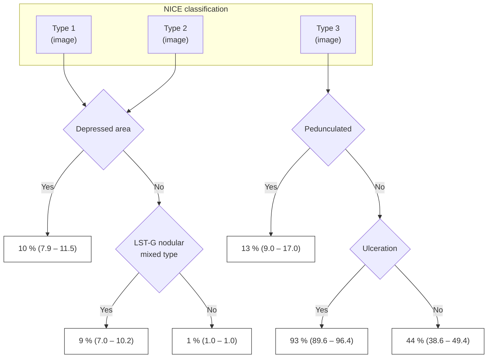
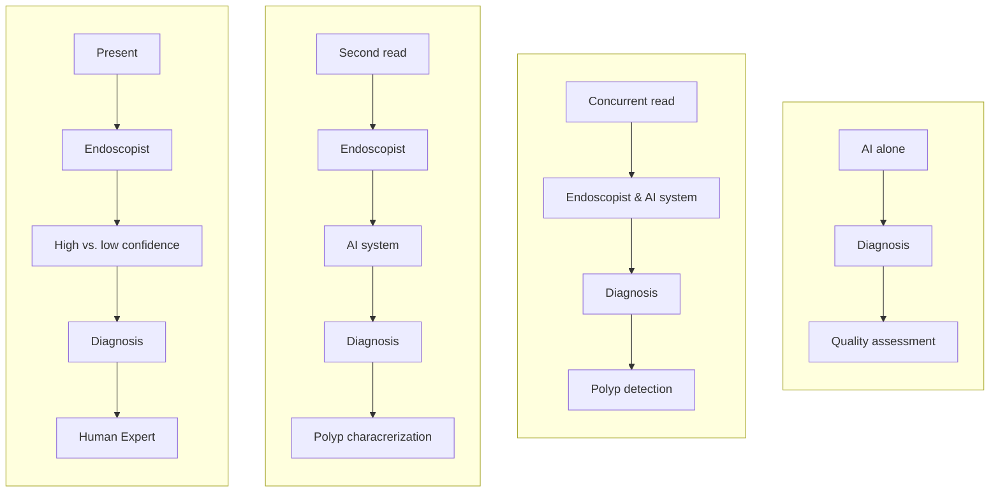

# Advanced imaging for detection and differentiation of colorectal neoplasia: European Society of Gastrointestinal Endoscopy (ESGE) Guideline – Update 2019

## Authors

Raf Bisschops1, James E. East2, 3, Cesare Hassan4, Yark Hazewinkel5, Michał F. Kamiński6, 7, 8, Helmut Neumann9, Maria Pellisé10, 11, Giulio Antonelli12, Marco Bustamante Balen13, 14, Emmanuel Coron15, Georges Cortas16, Marietta Iacucci17, Mori Yuichi18, Gaius Longcroft-Wheaton19, Nastazja Pilonis20, 21, Ignasi Puig22, 23, Jeanin E. van Hooft5, Evelien Dekker5

## Institutions

1. University Hospitals Leuven, Department of Gastroenterology and Hepatology, TARGID, KU Leuven, Belgium
2. Translational Gastroenterology Unit, Nuffield Department of Medicine, Experimental Medicine Division, John Radcliffe Hospital, University of Oxford, Oxford, UK
3. Oxford National Institute for Health Research Biomedical Research Centre, Oxford, UK
4. Digestive Endoscopy Unit, Nuovo Regina Margherita Hospital, Rome, Italy
5. Department of Gastroenterology and Hepatology, Academic Medical Center, University of Amsterdam, The Netherlands
6. Department of Gastroenterological Oncology, the Maria Sklodowska-Curie Memorial Cancer Center and Institute of Oncology, Warsaw, Poland
7. Department of Gastroenterology, Hepatology and Oncology, Medical Center for Postgraduate Education, Warsaw, Poland
8. Institute of Health and Society, University of Oslo, Oslo, Norway
9. Department of Medicine I, University Medical Center Mainz, Mainz, Germany
10. Department of Gastroenterology. Institut Clinic de Malalties Digestives I Metabòliques, Hospital Clinic of Barcelona, Barcelona, Spain
11. Centro de Investigación Biomédica en Red de Enfermedades Hepáticas y Digestivas (CIBERehd), Institut d'Investigacions Biomediques August Pi i Sunyer (IDIBAPS), Universitat de Barcelona, Barcelona, Spain
12. Endoscopy Unit, Sant'Andrea University Hospital, "Sapienza" University of Rome, Rome, Italy
13. Gastrointestinal Endoscopy Unit, Digestive Diseases Department, La Fe Polytechnic University Hospital, Valencia, Spain
14. Gastrointestinal Endoscopy Research Group, La Fe Health Research Institute, Valencia, Spain
15. CHU Nantes, Université Nantes, Institut des Maladies de l'Appareil Digestif (IMAD), Nantes, France
16. Division of Gastroenterology, University of Balamand Faculty of Medicine, St. George Hospital University Medical Center, Beirut, Lebanon
17. Institute of Translational of Medicine, Institute of Immunology and Immunotherapy and NIHR Biomedical Research Centre, University of Birmingham and University Hospitals, Birmingham NHS Foundation Trust, UK
18. Digestive Disease Center, Showa University Northern Yokohama Hospital, Yokohama, Japan
19. Portsmouth Hospitals NHS Trust, Cosham, Portsmouth, UK
20. Department of Gastroenterological Oncology, Maria Sklodowska-Curie Memorial Cancer Center and Institute of Oncology, Warsaw, Poland
21. Department of Gastroenterology, Hepatology and Oncology, Medical Center for Postgraduate Education, Warsaw, Poland
22. Digestive Diseases Department, Althaia Xarxa Assistencial Universitària de Manresa, Manresa, Spain
23. Department of Medicine, Facultat de Ciències de la Salut, Universitat de Vic-Universitat Central de Catalunya (UVic-UCC), Manresa, Spain

## Bibliography

DOI https://doi.org/10.1055/a-1031-7657
Published online: 11.11.2019 | Endoscopy 2019; 51: 1155–1179

© Georg Thieme Verlag KG Stuttgart · New York
ISSN 0013-726X

## Corresponding author

Raf Bisschops, MD PhD, University Hospitals Leuven, Targid, Gastroenterology and Hepatolgy, 49 Herestraat, Leuven 3000, Belgium
Fax: +32344419
raf.bisschops@uzleuven.be

## MAIN RECOMMENDATIONS

**1** ESGE suggests that high definition endoscopy, and dye or virtual chromoendoscopy, as well as add-on devices, can be used in average risk patients to increase the endoscopist's adenoma detection rate. However, their routine use must be balanced against costs and practical considerations.
Weak recommendation, high quality evidence.

**2** ESGE recommends the routine use of high definition systems in individuals with Lynch syndrome.
Strong recommendation, high quality evidence.

**3** ESGE recommends the routine use, with targeted biopsies, of dye-based pancolonic chromoendoscopy or virtual chromoendoscopy for neoplasia surveillance in patients with long-standing colitis.
Strong recommendation, moderate quality evidence.

**4** ESGE suggests that virtual chromoendoscopy and dye-based chromoendoscopy can be used, under strictly controlled conditions, for real-time optical diagnosis of diminutive (≤ 5 mm) colorectal polyps and can replace histopathological diagnosis. The optical diagnosis has to be reported using validated scales, must be adequately photodocumented, and can be performed only by experienced endoscopists who are adequately trained, as defined in the ESGE curriculum, and audited.
Weak recommendation, high quality evidence.

**5** ESGE recommends the use of high definition white-light endoscopy in combination with (virtual) chromoendoscopy to predict the presence and depth of any submucosal invasion in nonpedunculated colorectal polyps prior to any treatment.
Strong recommendation, moderate quality evidence.

**6** ESGE recommends the use of virtual or dye-based chromoendoscopy in addition to white-light endoscopy for the detection of residual neoplasia at a piecemeal polypectomy scar site.
Strong recommendation, moderate quality evidence.

**7** ESGE suggests the possible incorporation of computer-aided diagnosis (detection and characterization of lesions) to colonoscopy, if acceptable and reproducible accuracy for colorectal neoplasia is demonstrated in high quality multicenter in vivo clinical studies. Possible significant risks with implementation, specifically endoscopist deskilling and over-reliance on artificial intelligence, unrepresentative training datasets, and hacking, need to be considered.
Weak recommendation, low quality evidence.

## ABBREVIATIONS

| Abbreviation | Definition |
|---|---|
| **ADR** | adenoma detection rate |
| **AFI** | autofluorescence imaging endoscopy |
| **AI** | artificial intelligence |
| **ASGE** | American Society for Gastrointestinal Endoscopy |
| **BLI** | blue light imaging |
| **CE** | chromoendoscopy |
| **CI** | confidence interval |
| **CRC** | colorectal cancer |
| **EMR** | endoscopic mucosal resection |
| **ESD** | endoscopic submucosal dissection |
| **ETMI** | endoscopic trimodal imaging |
| **FACILE** | Frankfurt Advanced Chromoendoscopic IBD LEsions |
| **FAP** | familial adenomatous polyposis |
| **FICE** | flexible spectral imaging color enhancement |
| **FTRD** | full thickness resection device |
| **GRADE** | Grading of Recommendations Assessment, Development and Evaluation |
| **HD-WLE** | high definition white-light endoscopy |
| **HGD** | high grade dysplasia |
| **I-SCAN** | i-SCAN digital contrast |
| **JNET** | Japan NBI Expert Team |
| **LCI** | linked color imaging |
| **LGD** | low grade dysplasia |
| **LST** | laterally spreading tumor |
| **MB-MMX** | methylene blue formulation |
| **NBI** | narrow band imaging |
| **NICE** | NBI International Colorectal Endoscopic |
| **NG** | nongranular |
| **PDR** | polyp detection rate |
| **PICO** | patient, intervention, comparator, outcome |
| **RCT** | randomized controlled trial |
| **SD-WLE** | standard definition white-light endoscopy |
| **SPS** | serrated polyposis syndrome |
| **SSL** | sessile serrated lesion |
| **UC** | ulcerative colitis |
| **WASP** | Workgroup serrAted polypS and Polyposis |
| **WLE** | white-light endoscopy |

## Supplementary material

Online content viewable at:
https://doi.org/10.1055/a-1031-7657

> **SOURCE AND SCOPE**
>
> This Guideline is an official statement of the European Society of Gastrointestinal Endoscopy (ESGE). It is a revision of the previously published 2014 Guideline addressing the role of advanced endoscopic imaging for detection and differentiation of colorectal neoplasia.

## Introduction

Colonoscopy is the key examination technique in colorectal cancer (CRC) screening programs for detection and treatment of early precursor lesions and timely diagnosis of colorectal cancer [1, 2]. The quality of colonoscopy, which depends on both bowel preparation and examination technique, is the main determining factor that drives the protective effect of this invasive examination in decreasing the societal disease burden [3–5].

Over the last 15 years, several new techniques to improve polyp detection and characterization have been developed and studied [6]. For all these techniques, the possible financial burden, learning curve, and additional cost need to be balanced against the potential benefit. In general, there is a potential bias in the available literature given that it is impossible to blind the endoscopist to the technique that is being studied. Therefore, even the setting of a fully randomized trial, there is always a potential bias in favor of any technique that may affect the performance of the endoscopists, even subconsciously.

This update of the previously published Guideline [7] aims to put into perspective the new evidence that has become available over the last 5 years, and to provide statements on the possible role of advanced techniques in polyp detection or characterization in the average risk and high risk populations. The potential role of artificial intelligence (AI) in the detection and characterization of colorectal lesions, including possible hazards of its implementation, has been addressed for the first time.

With regard to training, in optical diagnosis of diminutive polyps, detection of colitis-associated neoplasia, and prediction of invasion with larger polyps, we refer to the standardized ESGE training curriculum. Although this is a work in progress, we anticipate that the curriculum will be available in 2020 and want to include this defined standard in the Guideline as a prerequisite for obtaining cognitive chromoendoscopy (CE) skills for lesion characterization and detection.

## Methods

The ESGE commissioned this Guideline (Guideline Committee chair, J.v.H.) and appointed a guideline leader (R.B.), who invited the listed authors to participate in the project development. The key questions were prepared by the coordinating team (R.B., E.D., J.E.E., M.P., M.K., C.H., H.N.) and were then approved by the other members. The coordinating team established task force subgroups, based on the statements of the previous 2014 Guideline [7], each with its own leader, and divided the key topics among those task forces (Appendix 1 s; see online-only Supplementary Material) with a specific focus on the update of literature and revision of the statements.

The Guideline was developed during September 2018 and June 2019. The work included telephone conferences, a face-to-face meeting, and online discussions, and additional Delphi voting if necessary. In addition to the five task forces of the previous Guideline, we included a sixth task force to address the role of artificial intelligence (AI) in the detection and characterization of colorectal polyps. The task forces conducted a literature search related to the following techniques: high definition endoscopy, chromoendoscopy or dye-based endoscopy, virtual chromoendoscopy (narrow band imaging [NBI], i-SCAN digital contrast [I-SCAN], flexible spectral imaging color enhancement [FICE], and blue light imaging [BLI]), autofluorescence imaging (AFI) endoscopy, and add-on devices. Techniques that have been under development or without clear clinical implementation since the publication of the previous Guideline were not included (i.e., confocal endomicroscopy, endocytoscopy, optical coherence tomography). Key questions were formulated using patient, intervention, comparator, outcome (PICO) methodology [8].

The literature search was conducted through Medline (via Pubmed) and the Cochrane Central Register of Controlled Trials up to June 2019. New evidence on each key question was summarized in tables, using the Grading of Recommendations Assessment, Development and Evaluation (GRADE) system [9]. Grading depends on the balance between the benefits and risk or burden of any health intervention (Appendix 2 s). Further details on guideline development have been previously reported [10].

The results of the search were presented to all group members during a meeting in Prague on April 1st 2019. Subsequently, drafts were made by each task force chair and distributed between the task force members for revision and online discussion. Statements were created by consensus, or by Delphi voting of two rounds for task force 2.

In July 2019, a draft prepared by R.B. and all the task force chairs was sent to all group members. After agreement of all members had been obtained, the manuscript was reviewed by two external reviewers, Prof. Brian Saunders and Dr. David Tate. It was then sent for further comments to the ESGE national societies and individual members. It was then submitted to the journal Endoscopy for publication. The final revised manuscript was agreed upon by all the authors.

This Guideline was issued in 2019 and will be considered for update in 2024. Any interim updates will be noted on the ESGE website: http://www.esge.com/esge-guidelines.html.

## Evidence and statements

Evidence statements are compared to those of the previous 2014 Guideline [7]. The 2014 statements are shown in italic. The statements are grouped according to the different task force topics.

# Detection of colorectal neoplasia in the average risk population

> **RECOMMENDATION**
>
> *2014 statements:*
>
> *ESGE suggests the routine use of high definition white-light endoscopy systems for detecting colorectal neoplasia in average risk populations (weak recommendation, moderate quality evidence).*
>
> *ESGE does not recommend routine use of virtual pancolonic chromoendoscopy, AFI, or add-on devices for detecting colorectal neoplasia in average risk populations (strong recommendation, high quality evidence).*
>
> **2019 statement:**
>
> ESGE suggests that high definition endoscopy, and dye or virtual chromoendoscopy, as well as add-on devices, can be used in average risk patients to increase the endoscopist's adenoma detection rate. However, their routine use must be balanced against costs and practical considerations.
> Weak recommendation, high quality evidence.

The term "average risk population" refers to patients undergoing screening colonoscopy outside the setting of colitis or hereditary syndromes. Colorectal cancer screening is performed on a large scale in Europe, and therefore a small increase in adenoma detection may have a significant effect on the health care outcome of colorectal cancer [11]. Nonetheless, because of the widespread use of colonoscopy for colorectal cancer screening, the cost and practicality of advanced imaging techniques or add-on devices must be taken into consideration to avoid excessive financial or organizational burdens.

## High definition endoscopy

A 2011 meta-analysis of five studies including 4422 average risk patients showed a 3.5 % (95 % confidence interval [CI] 0.9 %–6.1 %) incremental yield from high definition white-light endoscopy (HD-WLE) over standard definition white-light endoscopy (SD-WLE) for the detection of patients with at least one adenoma [12]. There were no differences between HD-WLE and SD-WLE for high risk adenomas. We postulate that the difference in the fields of view of the endoscopes that were used is unlikely to account for the increased yield observed with HD-WLE, because three randomized controlled trials (RCTs) from two centers found no significant difference in polyp detection rates between SD-WLE endoscopies with 140° and 170° fields of view [13–15].

Also in a two-center RCT [16] published after the meta-analysis, the proportion of participants in whom adenomas were detected with HD-WLE was higher as compared with SD-WLE (45.7 % vs. 38.6 %, P = 0.166). The difference was significant for patients with flat adenomas (9.5 % vs. 2.4 %, P = 0.003) and right-sided adenomas (34.0 % vs. 19.0 %, P = 0.001).

A recent RCT [17] comparing HD-WLE with SD-WLE in 1855 patients has shown a significant increase in detection of sessile serrated lesions, also precursors for CRC (8.2 % vs. 3.8 %), as well as adenocarcinomas (2.6 % vs. 0.5 %). However, in this study no difference in adenoma detection rate (ADR) or polyp detection rate (PDR) was seen.

Two recent multicenter RCTs [18, 19] have postulated that two generations of improvements in colonoscopes are necessary to significantly increase ADR. The two RCTs compared the latest generation HD-WLE colonoscopes from one company (Olympus 190C) against standard definition next-to-last generation colonoscopes (Olympus 160C) in both a hospital [18] and in a private practice [19] setting. Results from the two trials were not fully concordant. In the hospital setting, a significant decrease in adenoma miss rates was found with high definition colonoscopes (16.6 %, 95 %CI 13.0 %–20.1 % vs. 30.2 %, 95 %CI 25.9 %–34.6 %; P < 0.001) as well as a significant increase in ADR (43.8 % vs. 36.5 %, P = 0.03) [18]. In the private practice setting [19] however, the ADR difference in favor of the latest-generation colonoscope did not reach statistical significance (32 % vs. 28 %, P = 0.10). The detection of diminutive polyps (< 5 mm) was significantly increased (22.5 % vs. 15.6 %, P < 0.001) for HD-WLE, as well as the adenoma per patient rate (all adenomas/all patients: 0.57 vs. 0.47, P < 0.001). Details of these RCTs are available in **Table 1 s** (see **Appendix 3 s**; online-only Supplementary Material).

The cost–effectiveness of using HD-WLE in routine practice was not studied. High definition colonoscopes are available from all major manufacturers.

Based on the above results with moderate-to-high quality evidence, we can conclude that high definition systems may be of benefit to improve polyp and adenoma detection, although trial results are not entirely consistent.

## Virtual chromoendoscopy

### Narrow band imaging (NBI)

Four meta-analyses and one Cochrane systematic review of RCTs compared detection of colorectal lesions in average risk populations using WLE and NBI [20–24]. When considering HD-WLE versus HD-NBI, none of these showed a significant difference in adenoma detection rate between the two technologies. HD-NBI showed a small increase in detection rate when compared to SD-WLE only.

A very recent meta-analysis [25] comprised data of 4491 individual patients from 11 RCTs. In this study, high definition NBI (HD-NBI) showed a significant increase in unadjusted odds ratio for adenoma detection compared to HD-WLE (OR 1.14, 95 %CI 1.01–1.29, P = 0.04; ADRs, HD-WLE 42.3 % vs. HD-NBI 45.2 %). When subanalyses were performed, NBI showed an increased detection only when preparation was best (compared to average). Moreover, it was only second-generation NBI, with a brighter light, that significantly increased ADR, and not the first-generation (second-generation NBI OR 1.28, 95 %CI 1.05–1.56, P = 0.02).

We can therefore conclude that the additional value of NBI in polyp detection is rather marginal, taking into consideration

---

Bisschops Raf et al. Advanced imaging for detection and differentiation of colorectal neoplasia: ESGE Guideline – Update 2019 … Endoscopy 2019; 51

the marginal significance in the meta-analysis. The introduction of better imaging quality with HD systems has probably a more important role.

### i-SCAN digital contrast (I-SCAN), flexible spectral imaging color enhancement (FICE), blue light imaging (BLI), and linked color imaging (LCI)

One meta-analysis, published in 2014 and including 5 studies with 3032 patients [23], compared HD-FICE and HD-i-SCAN versus HD-WLE in the detection of adenomas and found no additional detection with these advanced techniques (RR 1.09, 95 %CI 0.97–1.23).

An RCT [26] published after the meta-analysis showed a favorable result for I-SCAN technology, with a significantly higher ADR in the I-SCAN group compared to the HD-WLE colonoscopy group (47.2 % vs. 37.7 %, P = 0.01). This result, however, was mainly due to an increased detection rate of diminutive, flat, and right-sided adenomas.

Data on BLI and LCI for the detection of colorectal lesions are preliminary. Recent RCTs on LCI showed an increased per-patient ADR compared to HD-WLE (37 % vs. 28 %) [27], as well as a reduction in the miss rate in the right colon [28]. The single recent RCT on BLI [29] showed an increased mean adenoma per patient rate (mean ± standard deviation [SD] 1.27 ± 1.73 vs. 1.01 ± 1.36, P = 0.008), but no increase in ADR or PDR compared to HD-WLE.

Details of the most important studies are available in **Table 2 s**.

In conclusion, data on advanced imaging with these techniques is scarce and the beneficial effect in terms of incremental polyp detection seems to be clinically marginal.

## Autofluorescence imaging (AFI) endoscopy

One meta-analysis published in 2015 [30], including six RCTs and 1199 patients, evaluated AFI for the detection of colorectal neoplasia in average risk patients, and showed no significant difference between AFI and WLE in ADR or PDR (ADR, OR 1.01, 95 %CI 0.74–1.37, P = 0.96; PDR, OR 0.86, 95 %CI 0.57–1.30, P = 0.71), with no significant heterogeneity among the studies (P = 0.67, I² = 0).

One recently published RCT [31] focused on the role of updated AFI in the detection of flat lesions and showed a significant increase in the detection of right-sided flat lesions (adenomas and carcinoma, not sessile serrated polyps) (0.87, 95 %CI 0.78–0.97 vs 0.53, 95 %CI 0.46–0.61), but no increase in overall ADR or PDR.

Details of these two studies are available in **Table 3 s**.

Based on the findings of the meta-analysis there seems to be no major additional value of AFI for polyp detection in the average risk population. In addition, the system is not commercially available.

## Add-on devices

In 2018, two network meta-analyses investigating the efficacy of add-on devices to improve ADR (cap, Endocuff, Endorings) were published [32, 33] (**Table 4 s**).

One network meta-analysis, including 25 RCTs and 16 103 patients [32], showed an overall slight increase in ADR for add-on devices compared to standard colonoscopy (39.3 % vs. 35.1 %; relative risk [RR] 1.13, 95 %CI 1.03–1.23; P = 0.007). When individual devices were considered, both Endocuff versus HD-WLE and Endorings versus standard colonoscopy showed a small but significant improvement in ADR; these however would be of benefit mostly for already high-performing endoscopists. The use of a short transparent cap at the tip of the endoscope resulted in a statistically insignificant increase in ADR compared to HD-WLE (37 % vs. 34.3 %; RR 1.07, 95 %CI 0.96–1.19; P = 0.19). However, the considerable heterogeneity (I² = 89 %) should lead to cautious interpretation of these results. Subgroup analysis revealed a substantial increase of ADR and PDR of lesions ≤ 5 mm (RR 1.53, 95 %CI 1.13–1.71, RR 1.38, 95 %CI 1.10–1.43, respectively).

The second network meta-analysis [33] included 10 studies reporting on 6047 patients and showed, in contrast to the first, an overall increase in ADR for Endocuff in comparison to HD-WLE (OR 1.36, 95 %CI 1.12–1.60; P = 0.001), but when a subgroup analysis was performed this was only significant in low-performing endoscopists (for ADR < 25 %: OR 1.85, 95 %CI 1.35–2.53, P = 0.0001).

Most RCTs do not report cost–effectiveness data and this aspect has not yet been evaluated systematically.

Based on the available data, the evidence for general use of add-on devices is rather weak and cost–effectiveness has never been well assessed. It might however have a role in helping low-performers to reach the important ADR threshold of 25 % [4].

## Dye-based chromoendoscopy (CE)

A recently updated Cochrane systematic review of 2016 [34] analyzed 7 RCTs (total 2727 patients) that assessed the role of dye-based CE in detecting colorectal lesions outside the setting of polyposis or colitis. Pancolonic CE significantly increased the number of patients with at least one polyp detected (OR 1.87, 95 %CI 1.51–2.30) and of those with at least one neoplastic polyp (adenoma or carcinoma) detected (OR 1.53, 95 %CI 1.31–1.79). Limitations of the systematic review were the lack of blinding in the RCTs, and the significant heterogeneity observed between the studies. Indeed, quality of evidence was graded as low in this review.

Since the publication of that Cochrane systematic review, two large multicenter RCTs have been published. The first [35], including 1065 patients, showed an increase in the mean adenoma per patient rate (0.79 vs. 0.64, P = 0.005), but not in ADR (40.4 % vs. 37.5 %; OR 1.13, 95 %CI 0.87–1.48; P = 0.35) or sessile serrated lesion detection rate, using routine pancolonic CE compared to HD-WLE.

A recent phase 3 multicenter RCT [36] has evaluated the role of a novel pH- and time-dependent peroral methylene blue formulation (MB-MMX) that is delivered in pills taken during the bowel preparation phase. This RCT enrolled 1205 patients undergoing screening or surveillance colonoscopy and found an increased overall ADR in the MB-MMX group compared to the placebo group (56.29 vs 47.81 %; OR 1.46, 95 %CI 1.09–1.96). The MB-MMX group showed a higher number of patients with

---

Bisschops Raf et al. Advanced imaging for detection and differentiation of colorectal neoplasia: ESGE Guideline – Update 2019 … Endoscopy 2019; 51

adenomas ≤ 5 mm (37.11 % vs. 30.90 %; OR 1.36, 95 %CI 1.01–1.83).

Details of the abovementioned studies are available in **Table 5 s**.

We can conclude that chromoendoscopy increases ADR and PDR; however its systematic implementation may be hampered in daily practice because of practical considerations and additional costs. The use of MB-MMX may help to overcome these.

# Detection of colorectal neoplasia in high risk populations with hereditary syndromes

> **RECOMMENDATIONS**
>
> *2014 statements:*
>
> *ESGE recommends the routine use of high definition pancolonic chromoendoscopy in patients with known or suspected Lynch syndrome (conventional chromoendoscopy, NBI, i-SCAN) or serrated polyposis syndrome (conventional chromoendoscopy, NBI) (strong recommendation, low quality evidence).*
>
> *ESGE does not make any recommendation for the use of advanced endoscopic imaging in patients with suspected or known familial adenomatous polyposis (FAP) including attenuated and MUTYH-associated polyposis (insufficient evidence to make a recommendation).*
>
> **2019 statements:**
>
> ESGE recommends the routine use of high definition systems in individuals with Lynch syndrome.
> Strong recommendation, high quality evidence.
>
> ESGE suggests that the use of virtual chromoendoscopy may be of benefit in individuals with Lynch syndrome undergoing colonoscopy; however its routine use must be balanced against costs, training, and other practical considerations.
> Weak recommendation, moderate quality evidence.
>
> ESGE suggests the use of high definition systems and dye-based chromoendoscopy in the diagnosis and surveillance of individuals with serrated polyposis syndrome; however routine use must be balanced against costs, training, and practical considerations.
> Weak recommendation, moderate quality evidence.
>
> ESGE does not recommend the systematic use of dye-based nor virtual chromoendoscopy for familial adenomatous polyposis (FAP), MUTYH-associated polyposis, or hamartomatous polyposis.
> Strong recommendation, moderate quality evidence.

## Lynch syndrome

Lynch syndrome is the most common cause of hereditary colorectal cancer (CRC). It is an autosomal dominant disorder caused by germline mutations in the DNA mismatch repair (MMR) genes (i. e., *MLH1*, *MSH2*, *MSH6*, *PMS2*, and *EpCAM*). An accelerated progression from adenoma to CRC has been described, and often the adenomas display advanced histological features (i. e., high grade dysplasia or a villous component), are frequently flat in morphology, and located in the proximal colon, compared with sporadic adenomas. An intensive surveillance strategy with annual or biennial colonoscopy starting at early ages has reduced both the incidence and mortality associated with CRC. A high detection rate for these aggressive adenomas is especially important to minimize the risk of interval CRC.

In total, seven studies comparing indigo carmine CE with WLE in patients with Lynch syndrome have been published [37–43] (**Table 6 s**). Three single-center studies with a small number of patients in a back-to-back design showed that CE was superior to SD-WLE, with an adenoma miss rate ranging from 61 % to 74 % [37, 38, 41]. A recent back-to-back multicenter study, where the second pass was performed by a different endoscopist in order to minimize the second inspection bias, again showed superiority of SD-CE over SD-WLE (ADRs of 41 % and 23 %, respectively; adenoma miss rate 52 %). Nevertheless, the study had no comparator arm, was slightly underpowered (β-risk of 26 %) and the withdrawal time during CE was twice that of WLE [39]. All these results are methodologically flawed by the back-to-back design that may lead to an overestimation of the effect of CE over WLE.

There are three trials with a control arm. A study by Stoffel et al. included 54 patients in four centers [40]. After the first pass with SD-WLE, 28 patients were randomly allocated to a second pass with CE and 27 to a second pass with an intensive 20-minute inspection; no significant difference in adenoma miss rate was shown.

Very recently, two well-powered randomized, multicenter, controlled studies with a comparator arm were published. Haanstra et al. showed no differences in neoplasia detection rate between CE and WLE in 246 Lynch patients, either at baseline (27 % vs. 30 %, respectively; P = 0.56) or in the 2-year follow-up colonoscopy (26 % vs. 28 %, respectively; P = 0.81) [42]. This study is limited by the fact that CE was applied only proximal to the splenic flexure and that the study extended over a very long recruitment period (10 years) which may entail important variability in procedure performances and ability for detecting colorectal lesions. Rivero-Sánchez et al. performed a study with only HD endoscopes and high-detector endoscopists in 256 Lynch patients in 14 different hospitals, and showed that ADR was statistically not different between HD-CE and HD-WLE (34.4 % [95 %CI 26.4 %–43.3 %] vs. 28.1 % [95 %CI 21.1 %–36.4 %], P = 0.28) [43]. In both trials, CE was more time-consuming and detected more clinically irrelevant lesions.

In Lynch patients, three single-center back-to-back studies were performed with high definition virtual CE, which appeared to be superior to HD-WLE for polyp detection [44, 45]. East et al. showed in a nonrandomized back-to-back study in 62 Lynch patients that during a second inspection, with NBI, additional adenomas were detected in 17/62 patients (27 %). In this study, ADR increased to 26/62 (42 %) after both WLE and NBI: 9/62 patients had at least one adenoma detected that was missed during the first inspection with WLE [44]. Bisschops et al. showed

in a randomized crossover study in 61 Lynch patients that the adenoma miss rate was significantly lower when I-SCAN was used, in comparison to HD-WLE (12 % vs. 62 %) [45]. Both studies were conducted by a single expert endoscopist and in the second study, the ADR was relatively low for HD-WLE inspection (19 %).

On the other hand, virtual CE appears to be inferior to dye-based CE in two back-to-back studies. In a German cohort study the incremental yield of CE versus SD-WLE (n = 47) and NBI (n = 62) was assessed, showing a higher detection with CE during second inspection [41]. Very recently, a study comparing NBI to CE in a back-to-back design has been published as an abstract. This multicenter French study, in 138 Lynch patients, showed an adenoma miss rate of 48 % for the third generation of HD-NBI devices (Exera III, 190 series) when followed by a second pass with dye-based CE by the same endoscopist. The authors concluded that although NBI colonoscopy is less time-consuming, it cannot be recommended to replace dye-based CE in Lynch syndrome patients [46].

Finally, one study in 75 patients compared AFI, with the Xillix system (Xillix Technologies Corporation, Richmond, British Columbia, Canada), to WLE in a crossover trial, showing a better detection of adenomas for AFI (92 % vs. 68 % for WLE) [47].

Details for the most important studies are available in **Table 7 s**.

In conclusion, evidence suggests a benefit of dye-based CE in Lynch syndrome patients at the expense of longer procedure times. However, most of the studies were performed with standard definition endoscopes, had a small and heterogeneous sample, and a nonrandomized back-to-back design that may have led to a bias in favor of dye-based CE. Recent evidence from two well-powered multicenter trials with a parallel design have shown no differences in ADR between WLE and dye-based CE [42, 43]. This possibly implies that a thorough inspection by high detector endoscopists and using high definition endoscopes might decrease the advantageous effect of dye-based CE in Lynch patients. These two RCTs are the reason for a slight discrepancy between the recommendations in this Guideline and the recently published Guideline on the management of polyposis syndromes [48], that also included dye-based CE as a suggestion. However the new evidence was not available at the time of development of that Guideline. On the other hand, two studies have reported superiority of virtual CE (NBI and I-SCAN) over WLE. Conversely, two other studies have shown that dye-based CE was superior to virtual CE. Most of these studies have methodological limitations such as back-to-back design, the second pass being performed by the same expert endoscopist, or there being a low ADR in the first pass.

Taking this into consideration, ESGE recommends at least the use of HD endoscopes in Lynch patients and suggests in addition that, in view of the evidence, advanced imaging techniques such as virtual chromoendoscopy can be useful.

## Serrated polyposis syndrome (SPS)

Serrated polyposis syndrome (SPS) has emerged as the most frequent colorectal polyposis syndrome. This entity is associated with an increased risk of CRC and is often grouped with the hereditary polyposis syndromes although no underlying gene defect has been identified yet.

Although recent studies show an increase in SPS prevalence [49–51], attributed to major clinical and pathological awareness and better endoscopic diagnostic accuracy [52, 53], SPS remains an underdiagnosed entity [54]. SPS diagnosis depends directly on the capacity for detecting serrated lesions (SLs), which are often easily overlooked due to their imperceptibility [51]. In a fecal immunochemical test (FIT)-based CRC screening program, a reassessment colonoscopy within 1 year after a screening colonoscopy tripled the number of patients diagnosed with SPS. Use of CE, either dye-based or virtual, at reassessment colonoscopy was associated with a higher detection rate of serrated lesions, but not of adenomas [55].

Recently, a multicenter randomized back-to-back study evaluated the usefulness of dye-based CE with indigo carmine for the detection of colonic polyps in SPS patients under surveillance [56]. Patients were randomly assigned to a group: one received two HD-WLE examinations (n = 43) and the other received HD-WLE followed by 0.4 % indigo carmine CE (n = 43). This study demonstrated a significantly higher additional polyp detection rate in the HD-CE group (0.39, 95 %CI 0.35–0.44) than in the HD-WLE group (0.22, 95 %CI 0.18–0.27, P < 0.001). HD-CE detected more serrated lesions than HD-WLE (40 % vs. 24 %, P = 0.001), more serrated lesions proximal to the sigmoid (40 % vs. 21 %, P = 0.001), and more > 5-mm serrated lesions proximal to the sigmoid (37 % vs. 18 %; P = 0.013). Over 70 % of additional serrated lesions detected by CE were hyperplastic polyps and at least two-thirds of them were located proximal to the sigmoid colon. Detection of adenomas and serrated lesions > 10 mm in size did not differ significantly between groups. The additional detection rate for SSP was higher in the HD-CE group (0.29 in HD-CE vs. 0.13 in HD-WL, P = 0.059) but not statistically significant. In a multivariate logistic regression analysis, only use of HD-CE was independently associated with an increase in polyp detection throughout the colon.

The role of virtual CE (i. e., NBI) in SPS has been evaluated in two randomized crossover studies. A first single-center study including 22 patients showed that NBI had a lower polyp miss rate than high resolution WLE (10 % vs. 36 %); however this was not confirmed in a second multicenter study including 52 SPS patients (20 % vs. 29 %; P = 0.065) [57, 58]. The authors explained this contradictory result by the fact that the pilot study was performed by a single endoscopist, at a single institution and with older equipment.

A recent multicenter prospective randomized controlled trial evaluated the usefulness of Endocuff-assisted colonoscopy in SPS surveillance, showing no increase in detection of sessile serrated lesions, adenomas, or polyps overall [59].

Details of the abovementioned studies are available in **Table 8 s**.

Thus, based on the abovementioned single RCT [56], the use of dye-based CE improves polyp detection and could be considered in the surveillance of SPS patients. However, its routine use must be balanced against practical considerations.

---

Bisschops Raf et al. Advanced imaging for detection and differentiation of colorectal neoplasia: ESGE Guideline – Update 2019 … Endoscopy 2019; 51

# Detection and differentiation of colorectal neoplasia in inflammatory bowel disease (IBD)

Patients with long-standing or extensive ulcerative colitis (UC) or Crohn's disease are at an increased risk of developing CRC compared to the average risk population. Accordingly, regular and extensive surveillance colonoscopies are recommended [60, 61]. In this context, advanced endoscopic imaging may be of benefit by (i) increasing the neoplasia detection rate; (ii) improving the differentiation of lesions (colitis-associated neoplasia, sporadic neoplasia, and non-neoplastic lesions); and (iii) reducing the number of unnecessary biopsies.

In general, surveillance of long-standing colitis can only be accurately performed in the absence of disease activity and with an adequate bowel preparation. Indeed, all the imaging studies mentioned below only apply to patients with long-standing colitis undergoing surveillance in the setting of quiescent disease activity and adequate bowel preparation. The use of dye-based or virtual CE is technically cumbersome in the presence of active colitis, multiple inflammatory or post-inflammatory polyps, or poor bowel preparation.

> **RECOMMENDATIONS**
>
> *2014 statements:*
>
> *ESGE recommends the routine use of 0.1 % methylene blue or 0.1 %–0.5 % indigo carmine pancolonic chromoendoscopy with targeted biopsies for neoplasia surveillance in patients with long-standing colitis. In appropriately trained hands, in the situation of quiescent disease activity and adequate bowel preparation, nontargeted four-quadrant biopsies can be abandoned (strong recommendation, high-quality evidence).*
>
> *ESGE found insufficient evidence to recommend for or against the use of virtual chromoendoscopy or autofluorescence imaging (AFI) for the detection of colorectal neoplasia in inflammatory bowel disease (insufficient evidence to make a recommendation).*
>
> **2019 statements:**
>
> ESGE recommends the routine use of dye-based pancolonic chromoendoscopy or virtual chromoendoscopy with targeted biopsies for neoplasia surveillance in patients with long-standing colitis, in the situation of quiescent disease activity and adequate bowel preparation.
> Strong recommendation, moderate quality evidence.
>
> ESGE recommends that after proper training in colonoscopy has been obtained, as defined in the ESGE curriculum, in the situation of quiescent disease activity and adequate bowel preparation, nontargeted four-quadrant biopsies can be abandoned.
> Strong recommendation, high quality evidence.
>
> ESGE suggests that in the case of high risk patients with a personal history of colonic neoplasia, tubular-appearing colon, strictures, or primary sclerosing cholangitis, chromoendoscopy-targeted biopsies can be combined with four-quadrant nontargeted biopsies every 10 cm in the colon.
> Weak recommendation, low quality evidence.

## SD-WLE or HD-WLE versus dye-based CE

Overall, in eight prospective studies comparing dye-based CE with SD-WLE, the former consistently increased the proportion of patients found with dysplasia by a factor of 2.08–3.26 [62–66]. A meta-analysis showed a pooled incremental yield of CE with random biopsies over SD-WLE with random biopsies for the detection of patients with neoplasia of 7 % (95 %CI 3.2 %–11.3 %). Moreover, the difference in proportion of lesions detected by targeted biopsies only was 44 % (95 %CI 28.6 %–59.1 %) in favor of dye-based CE [64]. This finding has been confirmed by a new retrospective cohort study including 78 patients with ulcerative colitis [67] in which CE visualized dysplastic lesions in 50 patients, including 34 new lesions not visualized on the index SD-WLE examination. A prospective longitudinal study included 55 patients with ulcerative colitis and identified 44 dysplastic lesions in 24 patients: 6 were detected by random biopsy, 11 by WLE, and 27 by CE [68]. CE and targeted WLE were more likely than random biopsies to detect dysplasia, and CE was superior to SD-WLE (OR 2.4, 95 %CI 1.4–4.0). One retrospective cohort study including 2242 colonoscopies demonstrated equal dysplasia detection rates for CE and WLE with random biopsies (11 % vs. 10 %, P = 0.80) [69].

Most recently CE has been evaluated for neoplasia detection and characterization in long-standing colitis in a more real-life setting than that of a randomized controlled trial with only expert endoscopists [70]. In this multicenter prospective cohort study including 350 patients, 41.5 % of colonoscopies were performed with standard definition endoscopes. The overall dysplasia miss rate for combined HD-WLE and SD-WLE was 40/94 (57.4 % incremental yield for CE). The CE incremental detection yield for dysplasia was comparable between standard definition and high definition (51.5 % vs. 52.3 %, P = 0.30) and statistically not different between expert and nonexpert endoscopists (18.5 % vs. 13.1 %, P = 0.2).

Although this last study did not show a difference between SD-CE and HD-CE detection of neoplasia, the additional value of high definition endoscopy in detecting ulcerative colitis-related neoplasia has become clearer more recently, and seems to indicate that CE increases detection only when standard definition endoscopy is used as opposed to high definition. A recent meta-analysis of 10 studies (494 patients) compared dye-based CE with SD-WLE and HD-WLE [71]. Of these 6 were RCTs (3 on SD-WLE and 3 on HD-WLE). The proportion of patients diagnosed with dysplasia using CE was 17 % as compared with 11 % for WLE. When analyzed separately, CE was more effective at identifying dysplasia than SD-WLE (RR 2.12, 95 %CI 1.15–3.91); however CE was not more effective as compared with HD-WLE (RR 1.36, 95 %CI, 0.84–2.18). Based on this meta-analysis, non-RCTs demonstrated a benefit of CE over SD-WLE and HD-WLE, whereas RCTs showed a small benefit of CE over SD-WLE, but not over HD-WLE. In addition, two other meta-

---

Bisschops Raf et al. Advanced imaging for detection and differentiation of colorectal neoplasia: ESGE Guideline – Update 2019 … Endoscopy 2019; 51

analyses comparing different advanced techniques point in the same direction. One recent systematic review comparing CE to other techniques (SD-WLE, HD-WLE, HD-NBI, or HD-I-SCAN), included 10 randomized trials with 1500 participants [72]. CE was associated with higher detection of patients with dysplasia as compared with other techniques. However, subgroup analyses confirmed this effect only in comparison with SD-WLE (RR 2.12, 95 %CI 1.15–3.91). These findings have been confirmed by another network meta-analysis including only 8 parallel-group RCTs with 924 patients [73] and comparing HD-WLE, SD-WLE, SD-CE, HD-CE, and HD-NBI for detection of neoplasia in long-standing colitis. The network analysis did not find any single technique to be statistically superior. CE was probably more effective than SD-WLE for detecting any dysplasia (OR 2.37, 95 %CI 0.81–6.94). Finally, a recent prospective RCT compared HD-WLE alone (n = 90) with high definition dye-based CE (n = 90), and virtual CE with I-SCAN (n = 90) for detection of neoplastic lesions during IBD surveillance colonoscopy [74]. The HD-WLE neoplasia detection rate (25.5 %) was noninferior either to dye-based (24.4 %) or to virtual CE (15.5 %) for detection of all neoplastic lesions (P = 0.91).

Details of the abovementioned studies with SD endoscopy and HD endoscopy are available in **Tables 9 s** and **10 s**.

Limitations of dye-based CE in the context of long-standing colitis surveillance need to be mentioned. There is no proof that better detection of neoplasia by CE results in the reduction of CRC mortality or decreased risk of interval CRC. Data on cost–effectiveness are also limited; however a reduction in the number of colonoscopies and histological samples could be achieved by risk stratification [75]. One study assessed the cost–effectiveness of CE in comparison with WLE or no endoscopy for CRC surveillance in patients with ulcerative colitis, using a decision-analytic state-transition (Markov) model with a Monte Carlo simulation [76]. CE was found to be more effective and less expensive than WLE at all surveillance intervals. However, compared with no surveillance, CE was cost-effective only at 7-year surveillance intervals, with an incremental cost–effectiveness ratio of $77 176. At sensitivity levels of > 0.23 for dysplasia detection and cost < $2200, CE was the most cost-effective strategy, regardless of the level of sensitivity of WLE. The estimated population lifetime risk of developing CRC ranged from 2.5 % (annual CE) to 5.9 % (CE every 10 years).

## Virtual CE

Three RCTs compared NBI in all cases with HD-WLE for the detection of neoplasia in long-standing IBD. Regardless of the generation of the NBI device and the level of definition of colonoscopes used, virtual CE did not significantly increase the detection rate of neoplastic lesions as compared with WLE [77–79]. However, virtual CE with targeted biopsies alone yielded neoplasia detection rates comparable to WLE with targeted and random four-quadrant biopsies (mean number of biopsies per patient: 0.5–3.5 in NBI with targeted biopsies only, and 24.6–38.3 in WLE with targeted and random biopsies).

Two RCTs compared a HD-NBI system with high definition dye-based CE, both without nontargeted biopsies, for the detection of neoplasia in long-standing UC. The first, single-center, crossover RCT comparing neoplasia miss rates with HD-NBI and high definition dye-based CE [80], showed a considerably higher miss rate of neoplastic lesions with HD-NBI as compared with high definition dye-based CE (31.8 % and 13.6 %, respectively). However, this study was not adequately powered to show a statistical significance. The second was a recent multicenter RCT that compared HD-CE with HD-NBI in 131 patients with UC in a 1:1 randomization [81]. Mean numbers of neoplastic lesions per colonoscopy were 0.47 for CE and 0.32 for NBI (P = 0.992). The neoplasia detection rate did not differ significantly between CE and NBI (21.2 % vs. 21.5 %, respectively). The per-lesion neoplasia detection was 17.4 % for CE and 16.3 % for NBI (P = 0.793) and the total procedural time was on average 7 minutes shorter in the NBI group.

One study compared I-SCAN as virtual CE with HD-WLE and dye-based HD-CE. There was no significant difference between three groups of patients with neoplasia detection (15.5 %, 25.5 %, and 24.4 % respectively). Although 10 % noninferiority was just passed statistically, caution should be exercised as the difference might still be clinically relevant [74]. A recent meta-analysis has highlighted the potential role of virtual CE for dysplasia detection in IBD. For the comparison of NBI versus WLE, 4 studies with 305 patients were included. The analysis showed no differences in per-patient neoplasia detection (OR 0.97, 95 %CI 0.62–1.53) and per-neoplastic lesion detection (OR 0.94, 95 %CI 0.63–1.4) [82].

Two studies (one of them an RCT) compared HD-WLE with AFI for the detection of colorectal neoplasia in IBD [79, 83]. A pilot study [83] showed that protruding lesions with a low AFI signal were significantly more likely to be neoplastic than lesions with a high AFI signal (45.0 % vs. 13.3 %, respectively; P = 0.043). In the RCT, the miss rate for neoplastic lesions was statistically significantly lower with AFI compared with HD-WLE (0 % vs. 50 %, P = 0.036) [79]. It should be noted that inadequate bowel preparation and active inflammation interrupt tissue AFI, resulting in discoloration on AFI and resembling neoplasia. Another recent RCT confirmed that AFI did not meet criteria for proceeding to a large noninferiority trial and that the existing AFI imaging technology should not be further investigated as an alternative dysplasia surveillance method [84].

Details of the abovementioned studies are available in **Table 11 s**.

## Role of biopsies

A limited diagnostic yield of four-quadrant biopsies in comparison to targeted biopsies has already been shown in the previous Guideline. A pooled sensitivity for the detection of neoplasia with CE-targeted biopsies only was 86 % (range 71 %–100 %) [37, 62, 63, 65, 66, 85–87]. The median numbers of targeted and targeted plus random biopsies were 1.3 (range 0.28–14.2) and 34.3 (range 7.0–42.2), respectively. Therefore, the number of biopsies needed during dye-based CE surveillance of long-standing colitis can be significantly reduced if targeted biopsies are taken. The yield and clinical impact of random biopsies were also assessed in a retrospective analysis of 1010 colonoscopies [88]. Overall, 11 722 random biopsies (median 29) were taken in 466 surveillance colonoscopies. Neopla-

---

Bisschops Raf et al. Advanced imaging for detection and differentiation of colorectal neoplasia: ESGE Guideline – Update 2019 … Endoscopy 2019; 51

sia was detected in 88 colonoscopies: in 75 (85 %) by targeted biopsies, in 8 (9.1 %) by both targeted and random biopsies, and in 5 (5.7 %) by random biopsies in 4 patients (7.5 % of 53 with detected neoplasia). In 94 % of colonoscopies, neoplasia was macroscopically visible. An RCT comparing the rates of neoplasia detection by targeted versus random biopsies in 246 patients with UC found the mean number of biopsies containing neoplastic tissue per colonoscopy to be 0.211 (24 of 114) in the target group and 0.168 (18 of 107) in the random group [89]. Neoplasia was detected in 11.4 % of patients in the target group and 9.3 % of patients in the random group (P = 0.617). Another, nonrandomized study evaluating different surveillance strategies in 454 IBD patients showed a neoplasia detection rate of 8.2 % in the random biopsy group compared to 19.1 % in the targeted biopsy group [90]. Recently, a study with 1000 colonoscopies showed neoplasia in 82 patients diagnosed by targeted biopsies or removed lesions [91]. Dysplasia was detected by random biopsies in 7 patients and in 12 additional patients by random biopsies only. The yield of neoplasia by random biopsies only was 0.2 % per-biopsy, 1.2 % per-colonoscopy and 12.8 % per-patient with neoplasia. Dysplasia detected by random biopsies was associated with a personal history of neoplasia, a tubular appearing colon, or the presence of primary sclerosing cholangitis. It may therefore be careful and advisable to combine random biopsies with dye-based or virtual CE-targeted biopsies in these high risk patients. In addition, since it may be difficult to locate again small lesions with dysplasia, it may be advisable in the case of lesions < 10 mm to resect the lesion entirely to facilitate patient management.

Details of the abovementioned studies are available in **Table 12 s**.

## Conclusions: detection of neoplasia in IBD

In conclusion, the literature on advanced imaging in the detection of colitis-associated neoplasia is large but also heterogeneous as illustrated by the several meta-analyses. Although several meta-analyses have been performed on the same literature and sometimes seem to contradict each other, it seems reasonable to accept the additional value of dye-based CE. Recent evidence with HD endoscopes point to the fact that virtual chromoendoscopy also may be equally effective. Although the Spanish real-life study [70] did not show a clear difference in dysplasia detection between expert and nonexpert (18.5 % vs. 13.1 %, P = 0.20) and did not show a significant learning curve for CE, it is conceivable that lesion recognition by virtual CE is facilitated by previous dye-based CE. In fact, all investigators involved in the virtual CE trials had previous experience with dye-based CE. In standard risk patients, the evidence clearly points to abandoning nontargeted random biopsies. The additional value of using virtual CE lies in the fact that it is time-saving (7 minutes less on average than dye-based CE [81]) and may facilitate surveillance in cases of poorer bowel preparation.

## Neoplastic versus non-neoplastic lesions in IBD

> **RECOMMENDATION**
>
> *2014 statement:*
>
> *ESGE recommends taking biopsies from flat mucosa surrounding neoplastic lesions and taking biopsies from or resecting all suspicious lesions identified at neoplasia surveillance in long-standing colitis, because there is no evidence that nonmagnified conventional or virtual chromoendoscopy can reliably differentiate between colitis-associated and sporadic neoplasia or between neoplastic and non-neoplastic lesions (strong recommendation, low to moderate quality evidence).*
>
> **2019 statement:**
>
> ESGE recommends using advanced imaging to assess the borders of lesions in previously colitic mucosa, to assess resectability. If optical diagnosis is used for lesion characterization of visible lesions, ESGE recommends that the suspicion of neoplasia should be confirmed by classical histology in the case of colitis surveillance.
> Strong recommendation, low quality evidence.

Lesions can be well delineated with high definition endoscopes and advanced imaging techniques. In an RCT comparing dye-based HD-CE with HD-NBI, no dysplasia was found in biopsies taken next to a visible lesion, even when the lesion was flat [81]. This means that if lesions can be well delineated, then resectability can be defined. However the proportion of neoplasia per suspicious lesion detected during colitis surveillance is in general rather low, at around 15 % [70, 81]. This means that the majority of lesions found are regenerative changes and non-neoplastic. Especially when such lesions are larger, resection may harbor unnecessary risks. The question therefore arises whether optical diagnosis could be used to differentiate neoplastic from non-neoplastic lesions.

Modified pit pattern classifications have been used in three dye-based CE studies to differentiate between neoplastic and non-neoplastic lesions in long-standing IBD [37, 62, 65], showing high sensitivity and specificity (93 %–100 % and 88 %–97 %, respectively). Kawasaki et al. evaluated the efficacy of the Japanese magnifying colonoscopy classification (Japan NBI Expert Team [JNET]) for UC-associated neoplasia [92]. Lesions of JNET types IIA, IIB, and III correlated with the histopathological findings of low grade dysplasia (LGD), high grade dysplasia (HGD)/superficially submucosally invasive cancer, and massively submucosally invasive (mSM) carcinoma, respectively. Lesions of Kudo types III/IV, VI low irregularity, and VI high irregularity/VN, by pit pattern classification, correlated with the histopathological findings of LGD/HGD, HGD, and mSM carcinoma, respectively. One more recent study evaluated the endoscopic features of HGD in 62 patients with UC [93]. HGD imaged with CE and magnifying endoscopy was frequently associated with a flat/superficial elevated area and red color. However, the use of magnifying endoscopes is still not widespread, and total

---

Bisschops Raf et al. Advanced imaging for detection and differentiation of colorectal neoplasia: ESGE Guideline – Update 2019 … Endoscopy 2019; 51

procedure times were on average 9–11 minutes longer. Recently, a Spanish multicenter trial showed that predictive factors for neoplasia for dye-based CE are Kudo pit pattern III-V, sessile morphology, loss of innominate lines, and location in the right colon [70].

Previous studies evaluating the role of nonmagnified NBI in differentiating neoplastic and non-neoplastic lesions in patients with long-standing colitis suggested that a tortuous pit pattern and a high vascular pattern intensity may help to distinguish neoplastic and non-neoplastic lesions in longstanding IBD [94, 95]. However, in two RCTS, the sensitivity and specificity of NBI in predicting histology were insufficient [79, 96]. A more recent multicenter interobserver study [97] showed median sensitivity, specificity, negative predictive value, and positive predictive value for diagnosing neoplasia, based on the presence of pit pattern other than I or II, of 77 %, 68 %, 88 %, and 46 %, respectively. Diagnostic accuracy was significantly higher when a diagnosis was made with a high level of confidence (77 % vs. 21 %, P < 0.001). The agreement for differentiation between non-neoplastic patterns (I, II) and neoplastic patterns (IIIL, IIIS, IV, or V) was moderate and significantly better for NBI in comparison with HD-CE (κ = 0.653 vs. 0.495, P < 0.001). Another multicenter RCT compared AFI with CE for dysplasia detection in 210 patients with long-standing UC [98]. Overall sensitivity for real-time prediction of dysplasia was 76.9 % for endoscopic trimodal imaging (ETMI; namely, AFI, NBE, and WLE) and 81.6 % for CE. Overall negative predictive values were 96.9 % for ETMI and 94.7 % for CE. A total of 205 lesions in UC were analyzed with virtual CE (flexible spectral imaging color enhancement [FICE]) in another study, by Cassinotti et al. [99]. Sensitivity, specificity, positive and negative likelihood ratios with the Kudo classification were 91 %, 76 %, 3.8, and 0.12, respectively. Recently Aladrén et al. aimed to analyze results of a CE screening program in Spain and to assess the possibility of identifying low risk dysplastic lesions by their endoscopic appearance, in order to avoid histological analysis [100]. Correlation between dysplasia and Kudo pit pattern predictors of dysplasia (Kudo ≥ III) was low while Kudo I and II lesions were correctly identified with a high negative predictive value of 92 %, even by nonexperts. Recently a group of international experts has developed and validated a new classification, the Frankfurt Advanced Chromoendoscopic IBD LEsions system (FACILE), using images from all endoscopic platforms, that might improve performance in both trainees and experienced operators. The four characteristics that predicted neoplastic lesions were morphology of nonpolypoid/polypoid lesion, irregular surface pattern, vessel architecture, and signs of inflammation within the lesion, without using Kudo pit pattern [101].

Details of most of the abovementioned studies are available in **Table 13 s**.

Based on these studies we can say that to a certain extent optical diagnosis may help to identify typically non-neoplastic lesions with type I or II pit pattern, but that the overall diagnostic accuracy, even in expert hands, is insufficient. Resection of small lesions < 10 mm with a neoplastic pit pattern is probably safe and may be more practical for determining patient management in the case that neoplasia is found. However in larger lesions, with sessile morphology or in the right colon [70], a biopsy should always be taken to confirm or rule out dysplasia.

# Differentiation between neoplastic and non-neoplastic small colorectal polyps

The vast majority of polyps detected during colonoscopy are diminutive (1–5 mm) or small (6–9 mm) in size. Diminutive polyps represent approximately 60 % of all polyps detected and the risk of advanced pathology or cancer incurred by these lesions is very low [102–104]. However, based on current management protocols, all removed polyps, including diminutive polyps, are submitted for histological analysis. This is expensive and generates a large burden of work for pathologists and histopathology departments. Instead of sending diminutive polyps for histological evaluation, a real-time optical diagnosis by the endoscopist would allow diminutive polyps to be discarded after resection, and non-neoplastic polyps located in the rectum and sigmoid to be left in situ. Furthermore, optical diagnosis could be used to determine the interval for the next surveillance colonoscopy. The primary goal of this strategy is to reduce the number of polyps submitted for histopathological evaluation, which may lead to cost savings.

The optical diagnosis strategy also raises several concerns. First, when diminutive polyps are discarded, advanced histological features (high grade dysplasia, tubulovillous or villous morphology) or invasive growth, i. e., a cancer, are not diagnosed as such. This could lead to a setting of suboptimal

> **RECOMMENDATION**
>
> *2014 statement:*
>
> *ESGE suggests that virtual chromoendoscopy (NBI, FICE, i-SCAN) and conventional [dye-based] chromoendoscopy can be used, under strictly controlled conditions, for real-time optical diagnosis of diminutive (≤ 5 mm) colorectal polyps to replace histopathological diagnosis. The optical diagnosis has to be reported using validated scales, must be adequately photodocumented, and can be performed only by experienced endoscopists who are adequately trained and audited (weak recommendation, high quality evidence).*
>
> **2019 statement:**
>
> ESGE suggests that virtual chromoendoscopy and dye-based chromoendoscopy can be used, under strictly controlled conditions, for real-time optical diagnosis of diminutive (≤ 5 mm) colorectal polyps to replace histopathological diagnosis. The optical diagnosis should be reported using a validated scale, must be adequately photodocumented, and can be performed only by experienced endoscopists who are adequately trained, as defined in the ESGE curriculum, and audited.
> Weak recommendation, high quality evidence.

---

Bisschops Raf et al. Advanced imaging for detection and differentiation of colorectal neoplasia: ESGE Guideline – Update 2019 … Endoscopy 2019; 51

treatment and/or inappropriate surveillance intervals. However, risk estimates for advanced pathology within diminutive polyps are low, ranging from 0.1 % to 12 %, with most estimates at the lower end of this range [105–134] (**Table 14 s**). The rate of cancer in diminutive polyps is even lower, although not completely negligible, ranging from 0 % to 0.6 %, with most estimates again at the lower end of the range. To further reduce the risk of missing cancer, it is recommended that an optical diagnosis should be avoided in suspicious lesions (e.g. depressed lesions, Paris classification 0-IIc) [135]. The question of whether undiagnosed advanced histological features within diminutive polyps would lead to inappropriate surveillance recommendations was recently addressed in a large study [103]. In this study, data of 12 cohorts (5 FIT cohorts and 7 colonoscopy screening cohorts) were combined, resulting in a total cohort of 64 344 individuals with 51 510 diminutive polyps. Advanced histological features were observed in 5.6 % and cancer in 0.07 % of all diminutive polyps. The risk of finding metachronous advanced neoplasia did not significantly differ between patients with 1 or 2 nonadvanced diminutive or small adenomas (low risk patients) compared with patients with diminutive polyps with advanced histological features detected at baseline colonoscopy. This indicates that diminutive polyps with advanced histological features do not increase the risk for metachronous advanced neoplasia and therefore seem not to interfere with a correct surveillance recommendation.

A second concern is that an incorrect optical diagnosis could result in a patient being incorrectly considered at low risk for metachronous advanced neoplasia and/or that neoplastic lesions in the rectosigmoid are left in situ. For this reason, the American Society for Gastrointestinal Endoscopy (ASGE) published the Preservation and Incorporation of Valuable Endoscopic Innovation (PIVI) document in which they attempted to set standards against which a technology should be assessed in order to be deemed suitable for use. A policy of resect and discard should have ≥ 90 % agreement in assignment of post-polypectomy surveillance intervals when compared with decisions based on pathology assessment, and a policy of leaving suspected non-neoplastic polyps in place should have a ≥ 90 % negative predictive value when used with high confidence [136]. A meta-analysis published in 2015 [137], including 20 NBI studies [138–157], 7 I-SCAN studies [155, 158–163] and 8 FICE studies [164–171], all in vivo and published between 2008 and 2014, showed that the pooled NPV of NBI for adenomatous polyp histology was 91 % (95 %CI 88 %–94 %). The agreement in assignment of post-polypectomy surveillance intervals with NBI was 89 % (95 %CI 85 %–93 %). Importantly, subgroup analysis indicated that the pooled NPV and the surveillance agreement was only greater than 90 % for academic medical centers, for experts, and when the optical assessment was made with high confidence. Comparable results were observed for I-SCAN. For FICE the pooled NPV in this meta-analysis was 80 % (95 %CI 76 %–85 %). Dye-based CE shows similar accuracy in differentiating between neoplastic and non-neoplastic polyps, but because of inconvenience and costs associated with the use of dyes it is unlikely that this technique will be adopted in routine clinical practice [164, 166]. From 2015 onwards, real-time differentiation studies, performed in academic centers as well as in community hospitals, have shown conflicting results in achieving the above mentioned PIVI thresholds [125, 172–179]. This variability in performance may be explained by a lack of rigorous training and/or performance measurement. However, in those studies in which the endoscopists were adequately trained prior to the study, PIVI thresholds were also not always met [125, 174, 179]. In conclusion, performance levels of endoscopists in correctly predicting histology of diminutive polyps remain highly variable, underlining the necessity of a training, auditing, and performance monitoring system when an optical diagnosis strategy is implemented. The possible effect on optical diagnosis of the use of artificial intelligence (AI) in the future is also unclear at this stage (see section on **Role of artificial intelligence**). Details of the abovementioned studies are available in **Table 15 s**.

During real-time optical diagnosis, validated optical diagnostic scales, such as the widely used NBI International Colorectal Endoscopic (NICE) classification or the Workgroup serrAted polypS and Polyposis (WASP) classification (which also includes sessile serrated lesions [SSLs]) should be used to improve diagnostic accuracy [145, 174, 180]. No universal training system for differentiation between neoplastic and non-neoplastic colorectal polyps has been established yet. Several teaching modules, mostly computer-based, have been studied and some of them are showing promising results with respect to improving interobserver agreement; however in a substantial number of studies the interobserver agreement was still moderate after training [180–188] (**Table 16 s**).

There are currently no data to suggest what kind of documentation is needed for implementation of an optical diagnosis strategy. As in this situation an endoscopic picture, rather than a histology slide, becomes the record of a diminutive polyp, it seems logical that those images are stored. At least one or two images must be stored as evidence of adenoma detection and also for review of the optical diagnosis [136]. However, this strategy poses significant challenges at present, especially with regard to logistics and the available disk space on servers in endoscopy units.

Implementation of an optical diagnosis strategy would be cost-effective, with good evidence from large modeling studies to support this [157, 170, 189–193]. However, concerns associated with the data used for model analysis include: (i) the different CRC screening programs used in these models may not be simply extrapolated to the various screening programs in use in Europe; (ii) the assumptions are derived from studies that have mainly been performed by experts; and (iii) the costs for implementation of the resect-and-discard policy (training for and photodocumentation of real-time diagnosis) are not included. It is therefore unclear whether the results of these modeling studies can be reproduced in real-life daily practice, and this should be further investigated in a real-life (multicenter) setting.

---

Bisschops Raf et al. Advanced imaging for detection and differentiation of colorectal neoplasia: ESGE Guideline – Update 2019 … Endoscopy 2019; 51

# Role of advanced imaging in treatment of colorectal neoplasia

## Prediction of deep submucosal invasion

> **RECOMMENDATION**
>
> *2014 statement:*
>
> *ESGE suggests the use of conventional or virtual (NBI) magnified chromoendoscopy to predict the risk of invasive cancer and deep submucosal invasion in lesions such as those with a depressed component (0-IIc according to the Paris classification) or nongranular or mixed-type laterally spreading tumors (weak recommendation, moderate quality evidence).*
>
> **2019 statement:**
>
> ESGE recommends the use of high definition white light endoscopy in combination with (virtual) chromoendoscopy to predict the presence and depth of any submucosal invasion in nonpedunculated colorectal polyps prior to any treatment.
> Strong recommendation, moderate quality evidence.

When endoscopic resection is considered for colonic lesions, it is important to assess the lesion accurately and attempt to predict the presence and depth of submucosal invasion, as this will aid in determining the correct treatment strategy (piecemeal endoscopic resection, e.g. endoscopic mucosal resection [EMR]; en bloc endoscopic resection, e.g. endoscopic submucosal dissection [ESD] or use of full thickness resection device [FTRD], or surgery). White light characterization and virtual and dye-based CE with and without magnification help to predict the presence and depth of submucosal invasion.

Morphology, size, location, and recognition of gross morphological features are the first steps in the characterization of colonic lesions with WLE, and may help to raise suspicion of malignancy. Submucosal invasion has been shown elsewhere to be more frequent in certain morphologies (laterally spreading tumor of nongranular type [LST-NG] pseudodepressed lesions, and also sessile polyps), increased size, and rectal location [194, 195]. A large prospective study of colonic lesions showed that the risk of 'covert' submucosal invasion was predicted by rectosigmoid location (odds ratio 1.87, P = 0.01), combined Paris classification, surface morphology (odds ratios, 3.96–22.5), and increasing size (odds ratio 1.16/10 mm, P = 0.012) [196]. In particular, rectosigmoid Paris 0-Is and 0-IIa + Is nongranular lesions had a high risk of submucosal invasion whereas proximally located Paris 0-Is or 0-IIa granular lesions had a very low risk. In addition, the nonlifting sign, chicken skin sign, edge retraction, depressed areas, folds convergence, induration, ulceration, polyp over polyp, redness, tumor fullness, and spontaneous bleeding have been reported to be associated with submucosal invasion, and also in lesions < 10 mm, but none of them was definitive [194, 197]. A systematic review and meta-analysis showed that sensitivities of these features for predicting deep submucosal invasion ranged from 18 % to 68 % and specificities from 80 % to 98 %. [198] The recognition of demarcated areas (clearly visualized region between two morphological areas of a lesion, e.g., a depression, large nodule, or reddened area) is also a key point in identifying zones that deserve close observation, because they are associated with an increased risk of submucosal invasion [199].

On closer inspection of the target colonic lesion, detection and characterization of a demarcated area where a regular neoplastic pit/vascular pattern (e.g. Kudo IV, NICE II, Sano II) becomes disordered (e.g. Kudo V, NICE III, Sano III), often associated with a visible depression (Paris classification 0-IIa + c) due to a fibrotic reaction in the submucosa, is a specific marker of submucosal invasion within colonic lesions.

There are only three prospective studies evaluating in vivo CE without magnification. The OPTICAL study [200] prospectively assessed 343 large nonpedunculated colorectal polyps with NBI without magnification, using the Hiroshima classification. A total of 47 cancers were identified (36 T1 and 11 ≥ T2), of which only 11 contained superficial sm1 invasion (23.4 % of all malignant polyps). Sensitivity and specificity for optical diagnosis of T1 CRC were 78.7 % (95 %CI 64.3 %–89.3 %) and 94.2 % (95 %CI 90.9 %–96.6 %), respectively; corresponding values for optical diagnosis of endoscopically unresectable lesions (i.e., ≥ T1 CRC with deep invasion) were 63.3 % (95 %CI 43.9 %–80.1 %) and 99.0 % (95 %CI 97.1 %–100.0 %), respectively. Obvious advanced cancers were excluded, but 11 out of 47 were still advanced cancers (7 T2 and 4 T3), which might have increased the sensitivity.

In a Spanish multicenter prospective study including 2123 lesions > 10 mm using NBI and without magnification, the NICE classification system identified lesions with deep invasion with sensitivity 58.4 % (95 %CI 47.5 %–68.8 %) and specificity 96.4 % (95 %CI 95.5 %–97.2 %) [194]. In addition, a conditional inference tree that included all variables found that the NICE classification was the most accurate for identification of lesions with deep invasion (P < 0.001). However, pedunculated morphology (P < 0.007), ulceration (P = 0.026), depressed areas (P < 0.001), or nodular-mixed type (P < 0.001) also affected accuracy of identification (▶Fig. 1). Therefore, virtual CE without magnification is useful for predicting deep submucosal invasion when a nonpedunculated NICE type 3 polyp is ulcerated and is useful to rule it out when a NICE type 1 or 2 lesion has no depressed area nor nodules. Results were comparable for identifying lesions that were endoscopically not resectable for oncological reasons (with any risk factor for lymph node metastasis). This is consistent with previous Japanese studies showing a higher prevalence of deep submucosal invasion in demarcated areas [199]. Therefore, magnification is especially needed in nonulcerated NICE type 3 lesions or when a demarcated area (nodule, redness, or depression) is present in a NICE type 1 or 2 lesion.

There is only one study assessing the Kudo pit pattern for predicting submucosal invasion without magnification [196]. Sensitivity and specificity of the Kudo pit pattern type V were 40.4 % (95 %CI 33.3 %–47.8 %) and 97.5 % (95 %CI 96.7 %–98.1 %) in 2106 laterally spreading lesions > 20 mm.

In Japan, magnified NBI CE has been shown to have a sensitivity of 77 % (95 %CI 68 %–84 %) and a specificity of 98 % (95 %CI

---

Bisschops Raf et al. Advanced imaging for detection and differentiation of colorectal neoplasia: ESGE Guideline – Update 2019 … Endoscopy 2019; 51

95 %– 99 %) in 13 studies using different classification systems [198]. Recently, type 3 JNET classification has shown a sensitivity of 55.4% (95 %CI 48.7 %– 62.1 %) and a specificity of 99.8% (95 %CI 99.6 %– 100.0 %) in retrospective assessment of 2933 images [201]. Studies with similar results showed that JNET type 2B included a wide variety of colorectal tumors ranging from low grade dysplasia to deep submucosal lesions and therefore the sensitivity of JNET type 3 is low [202–207]. The authors suggest that direct observation of the Kudo pit pattern with crystal violet should be performed in JNET 2B lesions.

The abovementioned systematic review and meta-analysis showed a sensitivity of 81 % (95 %CI 75 %– 87 %) and a specificity of 95 % (95 %CI 89 %– 97 %) for magnified CE in 17 studies [198]. All the studies were performed in Asian countries, mainly Japan, and with crystal violet. A retrospective study conducted in Brazil by a single experienced endoscopist included 123 lesions with suspicion of submucosal invasion raised by another endoscopist. Magnifying CE with pit pattern classification had 73.3 % sensitivity and 100 % specificity [208].

Details of the most important of the abovementioned studies are available in **Table 17 s**.

In summary: WLE may raise suspicion for submucosal invasion; virtual CE without magnification is useful to rule out the presence of deep submucosal invasion when no demarcated area is present; and magnifying CE may allow the differentiation between deep and superficial submucosal invasion in highly suspicious lesions, such as those containing demarcated areas. Based on the recent evidence, a 4-step strategy incorporating the different roles of WLE, nonmagnifying virtual CE, magnifying virtual CE, and magnifying dye-based CE in predicting submucosal invasion has been proposed, but it should first be validated [209]. In the near future, it seems likely that AI, directed to a demarcated area by a human observer, will significantly improve both sensitivity and specificity (see section on **Role of artificial intelligence**).

## Defining the borders of colorectal lesions

> **RECOMMENDATION**
>
> **2014 and 2019 statement:**
>
> ESGE recommends the use of virtual or conventional [dye-based] chromoendoscopy to define the margins of large nonpolypoid or otherwise indistinct lesions before or during endoscopic resection.
> Strong recommendation, very low quality evidence.

No new evidence has become available regarding this statement. Because of the better contrast, the entire extent of the lesion can be better appreciated with additional imaging techniques to safeguard a complete resection of a lesion. Especially in IBD-related neoplasia, demarcation of a lesion can be challenging and is facilitated by CE.

**▶ Fig. 1** Risk of submucosal invasion based on the Narrow-band imaging International Colorectal Endoscopic (NICE) classification and polyp morphology to determine treatment options [194].

**Prevalence of deep submucosal invasion in 2123 lesions > 10 mm, % (95 %CI)**

| Type of treatment in lesions > 10 mm (% distribution) | |
|---|---|
| Surgery | Uncertain (personalize, consider magnification) |
| Endoscopic treatment | |

# Follow-up after endoscopic resection of lesions

> **RECOMMENDATIONS**
>
> *2014 statement:*
>
> *ESGE recommends the use of virtual or conventional chromoendoscopy in addition to white light endoscopy for the detection of residual neoplasia at a piecemeal polypectomy scar site (strong recommendation, low quality evidence).*
>
> **2019 statements:**
>
> ESGE recommends the use of virtual or dye-based chromoendoscopy in addition to white-light endoscopy for the detection of residual neoplasia at a piecemeal polypectomy scar site.
> Strong recommendation, moderate quality evidence.
>
> ESGE suggests that routine biopsy of post-polypectomy scars can be abandoned providing that a standardized imaging protocol with virtual chromoendoscopy is used by a sufficiently trained endoscopist.
> Weak recommendation, moderate quality evidence.

Endoscopic piecemeal polypectomy has emerged as a safe and effective method of removing large sessile or nonpolypoid colorectal lesions. However, because of a relatively high rate of adenoma recurrence, estimated at 15 %–30%, [210, 211], it is recommended to perform a surveillance colonoscopy at 4–6 months after endoscopic resection [212, 213].

It has been shown that using HD-WLE alone allows the identification of 69 % to 83 % of recurrences revealed by performing targeted and random biopsies [141, 214]. Recent studies have provided new evidence for the efficacy of advanced endoscopic imaging in the detection of post-polypectomy/post-EMR scars and residual/recurrent colorectal neoplasia. A prospective single-center study, which analyzed 183 scars after a median of 3.9 months from the endoscopic polypectomy, showed a significantly higher sensitivity for endoscopic residual neoplasia detection for a combination of HD-WLE and NBI compared with HD-WLE alone (93.3 % vs. 66.7 %). The NPV for the combination of HD-WLE and NBI was 98.6 % (95 %CI 95.1 %–99.8%) [215]. Another prospective multicenter study, which evaluated 255 colorectal scars after a median of 7 months following a colorectal piecemeal EMR, showed a NPV of 100 % (95 %CI 98 %–100 %) and sensitivity of 100 % (95 %CI 93 %–100 %) for NBI with near-focus imaging [216]. However, slightly lower values were observed in a study of 112 scars, which showed that the accuracy of NBI for the detection of residual neoplasia at the resection site was 86.8 %, compared to 81.6 % for WLE and (P = 0.15) [217]. This study has however several limitations, including the single operator, high recurrence rates, and non-blinded pathologist. Another study, comparing the combination of HD-WLE and virtual or dye-based CE against histological verification in recurrence assessment, revealed biopsy evidence of residual/recurrent lesions in 16 of 228 macroscopically inconspicuous polypectomy scars (7 %) [218]. This study had, however, very high rates of recurrence (31.7 %) and used argon plasma coagulation to complete or ascertain completeness of resection in 50 % of patients. The high sensitivity and NPV (93 %–100 %) of HD-WLE combined with virtual CE in identifying residual and/or recurrent colorectal neoplasia justifies abandoning biopsy of macroscopically normal EMR or piecemeal polypectomy scars.

# Role of artificial intelligence in detection and characterization of colorectal polyps

> **RECOMMENDATION**
>
> **2019 statement:**
>
> ESGE suggests the possible incorporation of computer-aided diagnosis (detection and characterization of lesions) into colonoscopy, if acceptable and reproducible accuracy for colorectal neoplasia is demonstrated in high quality multicenter in vivo clinical studies. Possible significant risks with implementation, specifically endoscopist deskilling and over-reliance on artificial intelligence (AI), unrepresentative training datasets, and hacking, need be considered.\*
> Weak recommendation, low quality evidence.
>
> \* Note: The field of AI is changing very rapidly and it is likely this statement may need to be modified as new data emerge. ESGE plans an addendum to this section of the Guideline in the near future.

Computer-aided diagnosis in medical imaging has been revolutionized by the advent of artificial intelligence (AI) "deep learning" based on neural networks that simulate to some degree the workings of the human brain. It seems likely that such systems will have a major place in clinical practice in the future, with more than 20 systems, in particular in radiology and pathology, having received regulatory approval [219]. Video endoscopy provides a further opportunity for the application of AI systems to support and enhance clinical practice and endoscopist performance. However despite the potential benefits, there are also risks associated with the clinical adoption of AI.

## Endoscopist – AI interaction

AI can support clinicians in endoscopy in a number of ways. We consider below two major scenarios for colonoscopy, looking at lesion detection and lesion characterization; however the endoscopist can interact with computer-aided diagnosis systems in different ways. This interaction can be active, where we find a polyp and ask the AI system to confirm our diagnosis as a "second reader," or passive, where AI is running continuously in the background, for example for polyp detection, providing a "concurrent read" alongside the endoscopist. There may be situations where AI acts completely autonomously to make a decision without any endoscopist input, and it is unknown how the AI output is determined [220] (▶Fig. 2). An expert group set up by the European Commission has recently proposed that algorithms' "black boxes" should be deconvoluted before they can be used for patient care [221]. The levels of

---

Bisschops Raf et al. Advanced imaging for detection and differentiation of colorectal neoplasia: ESGE Guideline – Update 2019 … Endoscopy 2019; 51

**▶ Fig. 2** Different possibilities for endoscopist–artificial intelligence (AI) interaction [220].

endoscopist–AI interaction have similarities to self-driving cars. For example, humans can monitor the environment but can be aided by automated speed control and braking; self-driving may also allow the AI system to monitor the environment, with limited human input, or even to be fully autonomous. However it seems unlikely that fully autonomous "black box" AI will feature widely in medicine [219].

## Diagnostic performance of AI in colonic polyp detection

Substantial variation exists among endoscopists in terms of polyp detection and effectiveness in preventing CRC with colonoscopy [4, 11]. This variability has been attributed to many factors, but a significant cause seems to be that potentially detectable polyps are missed [179, 222–225]. The limitations of human visual perception and other human factors, such as fatigue, distraction, and level of alertness during examination, increase such recognition errors, and their mitigation may be the key to improving polyp detection and further reduction in CRC mortality. Computer-aided detection (CAD) could address these limitations [226] Recent advances in AI, deep learning, and computer vision have shown potential for assisting polyp detection during colonoscopy.

Preliminary studies of deep learning-based CAD systems have reported sensitivities from 70 % to 90 % and specificities from 60 % to 90 % for detecting polyps [227–232]. There are insufficient data to establish whether there is effective detection of sessile serrated or relatively flat and depressed lesions (Paris 0-II).

Although CAD could be useful for polyp detection in clinical practice [228], some limitations remain. A major drawback of current CAD systems is the relatively large number of false-positive detections, which could adversely affect the application of CAD in clinical practice. A large rate of false positives is likely to confound the endoscopist's task of image interpretation and reduce the efficiency of colonoscopy. In addition, endoscopists may lose confidence in CAD as a useful tool. The speed of CAD for image analysis and output presentation may also be an issue. Fast processing times are required for image analysis and on-screen labeling, so that the endoscopist is alerted in real time to the presence of a polyp.

Details of the more important of the abovementioned studies are available in **Table 18 s**.

## Diagnostic performance of AI in polyp characterization

AI for characterization of colorectal lesions might have potential advantages in: (i) improving the endoscopist's learning phase; (ii) predicting neoplastic and non-neoplastic tissue (e.g. to support a resect-and-discard strategy); and (iii) guiding endoscopic therapy (e.g. by prediction of submucosal infiltration). So far, no randomized controlled trials have assessed this rapidly emerging technology.

Specifically, no data are yet available on the effect of AI on the learning curve of endoscopists. Regarding prediction of adenomatous and hyperplastic polyp histology, recent data have highlighted that AI based on deep learning models can accurately predict polyp histology with sensitivities and NPVs exceeding 90 % [233, 234]. Similar results have also been shown for AI based on traditional machine learning [235, 236]. AI based on machine learning has also been evaluated for predicting the need for additional surgery after endoscopic resection of T1 colorectal cancer; it was found that it could significantly reduce unnecessary additional surgery [237]. Finally AI based on a deep learning model has been used to assist in diagnosis of submucosal CRC showing an accuracy of 81 % [238, 239].

Beyond colonic polyps there may be a role for AI in scoring inflammation in IBD, with preliminary data supporting distinction between Mayo 0–1 levels of inflammation and higher Mayo 2–3 levels (area under receiver operating characteristic [AUROC] 0.98) [240]. In addition, AI may potentially help in au-

tomatically registering quality indicators for colonoscopy (withdrawal time, cecal intubation, bowel preparation).

Details of the most important of the abovementioned studies are available in **Table 19 s**.

The role of add-on standalone systems versus AI that is integrated into commercially available endoscopy systems remains unclear. However either approach seems to have significant potential to enhance practice and facilitate optical diagnosis or resect-and-discard strategies [220].

## Risks of AI in clinical practice

Whilst many previous publications have exclusively mentioned the strengths and advantages of the use of AI in medicine, there are potential drawbacks to using AI in colonoscopy. In seven prospective studies on AI in colonoscopy [231, 235, 241–245], none addressed the downsides of AI as one of the main outcome measures, except for assessment of the time required for using AI; results varied from an increase of 35–47 seconds per polyp assessed with AI [235] to no additional withdrawal time [231].

Outside the field of colonoscopy, recent review articles have warned of unintended consequences that possibly arise from the use of AI in health care [219, 246], namely over-reliance on AI, deskilling, biased datasets for machine learning, and the risk of hacking, all of which seem to be applicable to AI in colonoscopy. In the short term, endoscopists' diagnoses can be affected by incorrect AI predictions. Some previous studies on decision support systems for mammography [247] and electrocardiography [248] demonstrated this negative effect in practice. According to these studies, experienced radiologists and residents, respectively, tended to adopt wrong decisions when they were given an incorrect AI prediction.

The problem of biased data for machine learning should be addressed when AI is widely implemented into colonoscopy practice. Currently, no colonoscopy AI systems have used learning data from different countries, although the status of colonic mucosa, morphologic pattern of polyps, and quality of bowel preparation may differ significantly among countries. Similarly, differences in endoscopic technology among regions of the world (e.g. between the Olympus Lucera Elite and the Exera III) or between endoscopy manufacturers may significantly affect AI performance if the training sets had not included a full range of data. In this regard, international validation should be required before global use of the developed AI. Small, unrepresentative data sets can lead to unintended outcomes, as happened with the IBM Watson for Oncology software [249]. Wide adoption of such data sets in healthcare systems can have far-reaching negative consequences.

The risk of hacking is also an inevitable concern. Deliberate hacking of a computer with AI installed could lead to large-scale harm to patients. For example, use of AI which provides wrong histological predictions because of malware could lead to serious consequences, such as neoplastic polyps being left in situ.

A more specific concern is that endoscopists using CAD are obliged to pay attention to the CAD output at the same time as making their own assessment. Thus the CAD output, especially if it was inaccurate, might distract the endoscopist, leading to missing or mischaracterization of polyps [250]. On the other hand, no serious adverse event such as perforation has been reported that was due to such distraction, according to two prospective studies [235, 244]. Detection algorithms may produce many false positives which require careful mucosal inspection; this can increase the time and mental load when performing colonoscopy, leading to a lessening of concentration.

There is also an assumption that effects of CAD (e.g. improved adenoma detection) will automatically lead to a reduction in missed CRC, because of the association between ADR and post-colonoscopy CRC [11]. However, changes in ADR produced by AI are in effect improvements in detection of polyps within the visual field, and AI cannot detect polyps in non-inspected mucosa. Therefore if improved ADR is in fact a surrogate measure of enhanced mucosal visualization, with better re-inspection of flexures, suctioning and pressing down mucosal folds, factors not changed by application of AI, the link between enhancement of ADR and fewer missed cancers may not hold true.

Although the evidence on the risks of AI for colonoscopy is limited, nevertheless various risks of AI such as prolonged procedure time, over-reliance on AI, and distraction caused by AI, should be considered, and quality assurance measures instituted [251, 252]. Future prospective studies should assess the impact of these downsides of AI in addition to its efficacy.

## Disclaimers

The legal disclaimer for ESGE guidelines [10] applies to this Guideline.

The views expressed by J.E. East and M. Iacucci are those of these authors and not necessarily those of the National Health Service (England and Wales), the National Institute for Health Research or the UK Department of Health.

## Funding

J.E. East was funded by the National Institute for Health Research (NIHR) Oxford Biomedical Research Centre, and M. Iacucci receives funding support from the National Institute for Health Research (NIHR) Birmingham Biomedical Research Centre. R. Bisschops was funded by a grant of the Research Foundation Flanders (FWO). Y. Mori was funded by the Japan Society for the Promotion of Science. E. Coron, H. Neumann, and Y. Hazewinkel received no funding.

## Acknowledgments

The authors gratefully thank Prof. Brian P. Saunders, of the Wolfson Unit for Endoscopy, St. Mark's Hospital, Harrow, UK, and Dr. David Tate, of the University Hospital Ghent, Belgium, for their excellent review of the Guideline.

---

Bisschops Raf et al. Advanced imaging for detection and differentiation of colorectal neoplasia: ESGE Guideline – Update 2019 … Endoscopy 2019; 51

## Competing interests

R. Bisschops has provided consultancy to and received research grants and speaker's fees from Pentax (2008 to present) and Fujifilm (2015 to present); his department has received research grants and equipment from Pentax and Fujifilm (2015 to present). E. Coron received speaker's fees or congress invitations from Fujifilm (2016–2019), and speaker's fees from Olympus (2016, 2017). J. East received a speaker's fee from Falk (January 2018); he has served on a Clinical Advisory Board of Boston Scientific (March 2018 to March 2019). C. Hassan has received research support from Fujifilm (2017 to present); his department has received support from Sonoscape. J. E. van Hooft has received lecture fees from Medtronics (2014–2015) and Cook Medical (2019), and consultancy fees from Boston Scientific (2014–2017); her department has received research grants from Cook Medical (2014–2018) and Abbott (2014–2017). M. Iacucci has received a research grant and consultancy fee from Pentax (2013–2019), and a research grant from Fujifilm (2018–2019); her department has received a research grant from Olympus (2017–2019). M.F. Kaminski has received speaker's, teaching, and consultancy fees from Olympus (2017 to present) and speaker's and teaching fees, and a loan of equipment from Fujifilm (2019). H. Neumann has provided consultancy to Fujifilm, Pentax, Motus GI, Boston Scientific, and Cook (2012 to present). M. Pellisé has received speaker's fees from Casen Recordati (2016–2019), Olympus (2018), and Jansen (2018), consultancy and speaker's fees from Norgine Iberia (2015–2019), a consultancy fee from GI Apply (2019), and research funding from Fujifilm Spain (2019); her department has received material on loan from Fujifilm Spain (2017 to present) and research grants from Olympus Europe (2005 to present); she is a board member of ESGE and SEED (2016 to present). I. Puig's department has received loans of equipment to conduct a study from Olympus Europe (2019–2021) and Fujifilm Europe (January 2019–December 2019). Y. Mori has provided consultancy to and received a Speaker's honorarium from Olympus (2017–2019). G. Antonelli, M. Bustamente Balén, G. Cortas, E. Dekker, Y. Hazewinkel, G. Longcroft-Wheaton, and N. Pilonis have no competing interests.

## References

[1] Kamiński M, Hassan C, Bisschops R et al. Advanced imaging for detection and differentiation of colorectal neoplasia: European Society of Gastrointestinal Endoscopy (ESGE) Guideline. Endoscopy 2014; 46: 435–457

[2] Stock C, Brenner H. Utilization of lower gastrointestinal endoscopy and fecal occult blood test in 11 European countries: evidence from the Survey of Health, Aging and Retirement in Europe (SHARE). Endoscopy 2010; 42: 546–556

[3] Chen C, Stock C, Jansen L et al. Trends in colonoscopy and fecal occult blood test use after the introduction of dual screening offers in Germany: Results from a large population-based study, 2003-2016. Prev Med (Baltim) 2019; 123: 333–340

[4] Kaminski MF, Regula J, Kraszewska E et al. Quality indicators for colonoscopy and the risk of interval cancer. N Engl J Med 2010; 362: 1795–1803

[5] Kaminski M, Thomas-Gibson S, Bugajski M et al. Performance measures for lower gastrointestinal endoscopy: a European Society of Gastrointestinal Endoscopy (ESGE) Quality Improvement Initiative. Endoscopy 2017; 49: 378–397

[6] Clark BT, Rustagi T, Laine L. What level of bowel prep quality requires early repeat colonoscopy: systematic review and meta-analysis of the impact of preparation quality on adenoma detection rate. Am J Gastroenterol 2014; 109: 1714–1723; quiz 1724

[7] East J, Vleugels J, Roelandt P et al. Advanced endoscopic imaging: European Society of Gastrointestinal Endoscopy (ESGE) Technology Review. Endoscopy 2016; 48: 1029–1045

[8] Richardson WS, Wilson MC, Nishikawa J et al. The well-built clinical question: a key to evidence-based decisions. ACP J Club 1995; 123: A12–13; http://www.ncbi.nlm.nih.gov/pubmed/7582737. Accessed 17 Jun 2019

[9] Atkins D, Best D, Briss PA et al. Grading quality of evidence and strength of recommendations. BMJ 2004; 328: 1490

[10] Dumonceau J-M, Hassan C, Riphaus A et al. European Society of Gastrointestinal Endoscopy (ESGE) Guideline Development Policy. Endoscopy 2012; 44: 626–629

[11] Corley DA, Levin TR, Doubeni CA. Adenoma detection rate and risk of colorectal cancer and death. N Engl J Med 2014; 370: 2539–2541

[12] Subramanian V, Mannath J, Hawkey CJ et al. High definition colonoscopy vs. standard video endoscopy for the detection of colonic polyps: A meta-analysis. Endoscopy 2011; 43: 499–505

[13] Deenadayalu VP, Chadalawada V, Rex DK. 170° Wide-angle colonoscope: Effect on efficiency and miss rates. Am J Gastroenterol 2004; 99: 2138–2142

[14] Fatima H, Rex DK, Rothstein R et al. Cecal insertion and withdrawal times with wide-angle versus standard colonoscopes: a randomized controlled trial. Clin Gastroenterol Hepatol 2008; 6: 109–114

[15] Rex DK, Chadalawada V, Helper DJ. Wide angle colonoscopy with a prototype instrument: Impact on miss rates and efficiency as determined by back-to-back colonoscopies. Am J Gastroenterol 2003; 98: 2000–2005

[16] Rastogi A, Early DS, Gupta N et al. Randomized, controlled trial of standard-definition white-light, high-definition white-light, and narrow-band imaging colonoscopy for the detection of colon polyps and prediction of polyp histology. Gastrointest Endosc 2011; 74: 593–602

[17] Roelandt P, Demedts I, Willekens H et al. Impact of endoscopy system, high definition, and virtual chromoendoscopy in daily routine colonoscopy: a randomized trial. Endoscopy 2019; 51: 237–243

[18] Pioche M, Denis A, Allescher HD et al. Impact of 2 generational improvements in colonoscopes on adenoma miss rates: results of a prospective randomized multicenter tandem study. Gastrointest Endosc 2018; 88: 107–116

[19] Zimmermann-Fraedrich K, Groth S, Sehner S et al. Effects of two instrument-generation changes on adenoma detection rate during screening colonoscopy: results from a prospective randomized comparative study. Endoscopy 2018; 50: 878–885

[20] Dinesen L, Chua TJ, Kaffes AJ. Meta-analysis of narrow-band imaging versus conventional colonoscopy for adenoma detection. Gastrointest Endosc 2012; 75: 604–611

[21] Jin XF, Chai TH, Shi JW et al. Meta-analysis for evaluating the accuracy of endoscopy with narrow band imaging in detecting colorectal adenomas. J Gastroenterol Hepatol 2012; 27: 882–887

[22] Nagorni A, Bjelakovic G, Petrovic B. Narrow band imaging versus conventional white light colonoscopy for the detection of colorectal polyps. Cochrane Database Syst Rev 2012; 1: CD008361

[23] Omata F, Ohde S, Deshpande GA et al. Image-enhanced, chromo, and cap-assisted colonoscopy for improving adenoma/neoplasia detection rate: A systematic review and meta-analysis. Scand J Gastroenterol 2014; 49: 222–237

[24] Pasha SF, Leighton JA, Das A et al. Comparison of the yield and miss rate of narrow band imaging and white light endoscopy in patients undergoing screening or surveillance colonoscopy: A meta-analysis. Am J Gastroenterol 2012; 107: 363–370

[25] Atkinson NSS, Ket S, Bassett P et al. Narrow-band imaging for detection of neoplasia at colonoscopy: a meta-analysis of data from individual patients in randomized controlled trials. Gastroenterology 2019; 157: 462–471 Epub 2019 Apr 15

---

Bisschops Raf et al. Advanced imaging for detection and differentiation of colorectal neoplasia: ESGE Guideline – Update 2019 … Endoscopy 2019; 51

[26] Kidambi TD, Terdiman JP, El-Nachef N et al. Effect of i-scan electronic chromoendoscopy on detection of adenomas during colonoscopy. Clin Gastroenterol Hepatol 2019; 17: 701–708.e1

[27] Min M, Deng P, Zhang W et al. Comparison of linked color imaging and white-light colonoscopy for detection of colorectal polyps: a multicenter, randomized, crossover trial. Gastrointest Endosc 2017; 86: 724–730

[28] Paggi S, Mogavero G, Amato A et al. Linked color imaging reduces the miss rate of neoplastic lesions in the right colon: a randomized tandem colonoscopy study. Endoscopy 2018; 50: 396–402

[29] Ikematsu H, Sakamoto T, Togashi K et al. Detectability of colorectal neoplastic lesions using a novel endoscopic system with blue laser imaging: a multicenter randomized controlled trial. Gastrointest Endosc 2017; 86: 386–394

[30] Zhao Z-Y, Guan Y-G, Li B-R et al. Detection and miss rates of autofluorescence imaging of adenomatous and polypoid lesions during colonoscopy: a systematic review and meta-analysis. Endosc Int Open 2015; 3: E226–E235

[31] Takeuchi Y, Sawaya M, Oka S et al. Efficacy of autofluorescence imaging for flat neoplasm detection: a multicenter randomized controlled trial (A-FLAT trial). Gastrointest Endosc 2019; 89: 460–469

[32] Facciorusso A, Del Prete V, Buccino RV et al. Comparative efficacy of colonoscope distal attachment devices in increasing rates of adenoma detection: a network meta-analysis. Clin Gastroenterol Hepatol 2018; 16: 1209–1219.e9

[33] Clelia M, Frazzoni L, Fuccio L et al. Mucosal flattening assisted colonoscopy (FAC) for improving adenoma detection rate: a systematic review with pairwise and network meta-analysis. United Eur Gastroenterol J 2018; 6: A195

[34] Brown SR, Baraza W, Din S et al. Chromoscopy versus conventional endoscopy for the detection of polyps in the colon and rectum. Cochrane Database Syst Rev 2016; 4: CD006439

[35] Lesne A, Rouquette O, Touzet S et al. Adenoma detection with blue-water infusion colonoscopy: a randomized trial. Endoscopy 2017; 49: 765–775

[36] Repici A, Wallace MB, East JE et al. Efficacy of per-oral methylene blue formulation for screening colonoscopy. Gastroenterology 2019; 156: 2198–2207.e1

[37] Hurlstone DP, Karajeh M, Cross SS et al. The role of high-magnification-chromoscopic colonoscopy in hereditary nonpolyposis colorectal cancer screening: a prospective "back-to-back" endoscopic study. Am J Gastroenterol 2005; 100: 2167–2173

[38] Lecomte T, Cellier C, Meatchi T et al. Chromoendoscopic colonoscopy for detecting preneoplastic lesions in hereditary nonpolyposis colorectal cancer syndrome. Clin Gastroenterol Hepatol 2005; 3: 897–902

[39] Rahmi G, Lecomte T, Malka D et al. Impact of chromoscopy on adenoma detection in patients with Lynch syndrome: a prospective, multicenter, blinded, tandem colonoscopy study. Am J Gastroenterol 2015; 110: 288–298

[40] Stoffel EM, Turgeon DK, Stockwell DH et al. Missed adenomas during colonoscopic surveillance in individuals with Lynch syndrome (hereditary nonpolyposis colorectal cancer). Cancer Prev Res (Phila) 2008; 1: 470–475

[41] Hüneburg R, Lammert F, Rabe C et al. Chromocolonoscopy detects more adenomas than white light colonoscopy or narrow band imaging colonoscopy in hereditary nonpolyposis colorectal cancer screening. Endoscopy 2009; 41: 316–322

[42] Haanstra JF, Dekker E, Cats A et al. Effect of chromoendoscopy in the proximal colon on colorectal neoplasia detection in Lynch syndrome: a multicenter randomized controlled trial. Gastrointest Endosc 2019; 90: 624–632 Epub 2019 Apr 24

[43] Rivero Sanchez L, Arnau Colell C, Balaguer F et al. High-definition white-light colonoscopy versus chromoendoscopy for surveillance of Lynch syndrome. a multicenter, randomized and controlled study (Endolynch study). United Eur Gastroenterol J 2018; 6: A117 OP295

[44] East JE, Suzuki N, Stavrinidis M et al. Narrow band imaging for colonoscopic surveillance in hereditary non-polyposis colorectal cancer. Gut 2008; 57: 65–70

[45] Bisschops R, Tejpar S, Willekens H et al. Virtual chromoendoscopy (I-SCAN) detects more polyps in patients with Lynch syndrome: a randomized controlled crossover trial. Endoscopy 2017; 49: 342–350

[46] Cellier C, Perrod G, Colas C et al. Back-to-back comparison of colonoscopy with virtual chromoendoscopy using a third-generation narrow-band imaging system to chromoendoscopy with indigo carmine in patients with Lynch syndrome. Am J Gastroenterol 2019; 114: 1665–1670

[47] Ramsoekh D, Haringsma J, Poley JW et al. A back-to-back comparison of white light video endoscopy with autofluorescence endoscopy for adenoma detection in high-risk subjects. Gut 2010; 59: 785–793

[48] van Leerdam ME, Roos VH, van Hooft JE et al. Endoscopic management of polyposis syndromes: European Society of Gastrointestinal Endoscopy (ESGE) Guideline. Endoscopy 2019; 51: 877–895

[49] Moreira L, Pellisé M, Carballal S et al. High prevalence of serrated polyposis syndrome in FIT-based colorectal cancer screening programmes. Gut 2013; 62: 476–477

[50] Biswas S, Ellis AJ, Guy R et al. High prevalence of hyperplastic polyposis syndrome (serrated polyposis) in the NHS bowel cancer screening programme. Gut 2013; 62: 475 Epub 2012 Jul 31

[51] Hazewinkel Y, López-Cerón M, East JE et al. Endoscopic features of sessile serrated adenomas: validation by international experts using high-resolution white-light endoscopy and narrow-band imaging. Gastrointest Endosc 2013; 77: 916–924 Epub 2013 Feb 21

[52] Kahi CJ, Li X, Eckert GJ et al. High colonoscopic prevalence of proximal colon serrated polyps in average-risk men and women. Gastrointest Endosc 2012; 75: 515–520

[53] Abdeljawad K, Vemulapalli KC, Kahi CJ et al. Sessile serrated polyp prevalence determined by a colonoscopist with a high lesion detection rate and an experienced pathologist. Gastrointest Endosc 2015; 81: 517–524

[54] Vemulapalli KC, Rex DK. Failure to recognize serrated polyposis syndrome in a cohort with large sessile colorectal polyps. Gastrointest Endosc 2012; 75: 1206–1210

[55] Rivero-Sanchez L, Lopez-Ceron M, Carballal S et al. Reassessment colonoscopy to diagnose serrated polyposis syndrome in a colorectal cancer screening population. Endoscopy 2016; 49: 44–53

[56] López-Vicente J, Rodríguez-Alcalde D, Hernández L et al. Panchromoendoscopy increases detection of polyps in patients with serrated polyposis syndrome. Clin Gastroenterol Hepatol 2019; 17: 2016–2023.e6 Epub 2018 Oct 24

[57] Boparai KS, van den Broek FJ, van Eeden S et al. Increased polyp detection using narrow band imaging compared with high resolution endoscopy in patients with hyperplastic polyposis syndrome. Endoscopy 2011; 43: 676–682 Epub 2011 Aug 2

[58] Hazewinkel Y, Tytgat KMAJ, van Leerdam ME et al. Narrow-band imaging for the detection of polyps in patients with serrated polyposis syndrome: a multicenter, randomized, back-to-back trial. Gastrointest Endosc 2015; 81: 531–538

[59] Rivero-Sánchez L, López Vicente J, Hernandez Villalba L et al. Endocuff-assisted colonoscopy for surveillance of serrated polyposis syndrome: a multicenter randomized controlled trial. Endoscopy 2019; 51: 637–645

[60] Cairns SR, Scholefield JH, Steele RJ et al. Guidelines for colorectal cancer screening and surveillance in moderate and high risk groups (update from 2002). Gut 2010; 59: 666–689

---

Bisschops Raf et al. Advanced imaging for detection and differentiation of colorectal neoplasia: ESGE Guideline – Update 2019 … Endoscopy 2019; 51

## Guideline

[61] Van Assche G, Dignass A, Bokemeyer B et al. Second European evidence-based consensus on the diagnosis and management of ulcerative colitis Part 3: Special situations. J Crohn's Colitis 2013; 7: 1–33

[62] Kiesslich R, Fritsch J, Holtmann M et al. Methylene blue-aided chromoendoscopy for the detection of intraepithelial neoplasia and colon cancer in ulcerative colitis. Gastroenterology 2003; 124: 880–888

[63] Kiesslich R, Goetz M, Lammersdorf K et al. Chromoscopy-guided endomicroscopy increases the diagnostic yield of intraepithelial neoplasia in ulcerative colitis. Gastroenterology 2007; 132: 874–882

[64] Subramanian V, Mannath J, Ragunath K et al. Meta-analysis: the diagnostic yield of chromoendoscopy for detecting dysplasia in patients with colonic inflammatory bowel disease. Aliment Pharmacol Ther 2011; 33: 304–312

[65] Hlavaty T, Huorka M, Koller T et al. Colorectal cancer screening in patients with ulcerative and crohn's colitis with use of colonoscopy, chromoendoscopy and confocal endomicroscopy. Eur J Gastroenterol Hepatol 2011; 23: 680–689

[66] Günther U, Kusch D, Heller F et al. Surveillance colonoscopy in patients with inflammatory bowel disease: comparison of random biopsy vs. targeted biopsy protocols. Int J Colorectal Dis 2011; 26: 667–672

[67] Deepak P, Hanson GJ, Fletcher JG et al. Incremental diagnostic yield of chromoendoscopy and outcomes in inflammatory bowel disease patients with a history of colorectal dysplasia on white-light endoscopy. Gastrointest Endosc 2016; 83: 1005–1012

[68] Marion JF, Waye JD, Israel Y et al. Chromoendoscopy is more effective than standard colonoscopy in detecting dysplasia during long-term surveillance of patients with colitis. Clin Gastroenterol Hepatol 2016; 14: 713–719

[69] Mooiweer E, van der Meulen-de Jong AE, Ponsioen CY et al. Chromoendoscopy for surveillance in inflammatory bowel disease does not increase neoplasia detection compared with conventional colonoscopy with random biopsies: results from a large retrospective study. Am J Gastroenterol 2015; 110: 1014–1021

[70] Carballal S, Maisterra S, López-Serrano A et al. Real-life chromoendoscopy for neoplasia detection and characterisation in long-standing IBD. Gut 2018; 67: 70–78

[71] Feuerstein JD, Rakowsky S, Sattler L et al. Meta-analysis of dye-based chromoendoscopy compared with standard- and high-definition white-light endoscopy in patients with inflammatory bowel disease at increased risk of colon cancer. Gastrointest Endosc 2019; 90: 186–195.e1 Epub 2019 Apr 19

[72] Iannone A, Ruospo M, Wong G et al. Chromoendoscopy for surveillance in ulcerative colitis and crohn's disease: a systematic review of randomized trials. Clin Gastroenterol Hepatol 2017; 15: 1684–1697.e11

[73] Bessissow T, Dulai PS, Restellini S et al. Comparison of endoscopic dysplasia detection techniques in patients with ulcerative colitis: a systematic review and network meta-analysis. Inflamm Bowel Dis 2018; 24: 2518–2526

[74] Iacucci M, Kaplan GG, Panaccione R et al. A randomized trial comparing high definition colonoscopy alone with high definition dye spraying and electronic virtual chromoendoscopy for detection of colonic neoplastic lesions during IBD surveillance colonoscopy. Am J Gastroenterol 2018; 113: 225–234

[75] Elsadani NN, East JE, Walters JRF. New 2010 British Society of Gastroenterology colitis surveillance guidelines: costs and surveillance intervals. Gut 2011; 60: 282–283

[76] Konijeti GG, Shrime MG, Ananthakrishnan AN et al. Cost-effectiveness analysis of chromoendoscopy for colorectal cancer surveillance in patients with ulcerative colitis. Gastrointest Endosc 2014; 79: 455–465

[77] Ignjatovic A, East JE, Subramanian V et al. Narrow band imaging for detection of dysplasia in colitis: a randomized controlled trial. Am J Gastroenterol 2012; 107: 885–890

[78] Dekker E, van den Broek FJ, Reitsma JB et al. Narrow-band imaging compared with conventional colonoscopy for the detection of dysplasia in patients with longstanding ulcerative colitis. Endoscopy 2007; 39: 216–221

[79] van den Broek FJC, Fockens P, van Eeden S et al. Endoscopic tri-modal imaging for surveillance in ulcerative colitis: randomised comparison of high-resolution endoscopy and autofluorescence imaging for neoplasia detection; and evaluation of narrow-band imaging for classification of lesions. Gut 2008; 57: 1083–1089

[80] Pellisé M, López-Cerón M, Rodríguez de Miguel C et al. Narrow-band imaging as an alternative to chromoendoscopy for the detection of dysplasia in long-standing inflammatory bowel disease: a prospective, randomized, crossover study. Gastrointest Endosc 2011; 74: 840–848

[81] Bisschops R, Bessissow T, Joseph JA et al. Chromoendoscopy versus narrow band imaging in UC: a prospective randomised controlled trial. Gut 2018; 67: 1087–1094

[82] Har-Noy O, Katz L, Avni T et al. Chromoendoscopy, narrow-band imaging or white light endoscopy for neoplasia detection in inflammatory bowel diseases. Dig Dis Sci 2017; 62: 2982–2990

[83] Matsumoto T, Nakamura S, Moriyama T et al. Autofluorescence imaging colonoscopy for the detection of dysplastic lesions in ulcerative colitis: a pilot study. Colorectal Dis 2010; 12: e291–297

[84] Vleugels JLA, Rutter MD, Ragunath K et al. Chromoendoscopy versus autofluorescence imaging for neoplasia detection in patients with longstanding ulcerative colitis (FIND-UC): an international, multicentre, randomised controlled trial. Lancet Gastroenterol Hepatol 2018; 3: 305–316

[85] Matsumoto T, Nakamura S, Jo Y et al. Chromoscopy might improve diagnostic accuracy in cancer surveillance for ulcerative colitis. Am J Gastroenterol 2003; 98: 1827–1833

[86] Rutter MD, Saunders BP, Schofield G et al. Pancolonic indigo carmine dye spraying for the detection of dysplasia in ulcerative colitis. Gut 2004; 53: 256–260

[87] Marion JF, Waye JD, Present DH et al. Chromoendoscopy-targeted biopsies are superior to standard colonoscopic surveillance for detecting dysplasia in inflammatory bowel disease patients: a prospective endoscopic trial. Am J Gastroenterol 2008; 103: 2342–2349

[88] van den Broek FJC, Stokkers PCF, Reitsma JB et al. Random biopsies taken during colonoscopic surveillance of patients with longstanding ulcerative colitis: low yield and absence of clinical consequences. Am J Gastroenterol 2014; 109: 715–722

[89] Watanabe T, Ajioka Y, Mitsuyama K et al. Comparison of targeted vs random biopsies for surveillance of ulcerative colitis-associated colorectal cancer. Gastroenterology 2016; 151: 1122–1130

[90] Gasia MF, Ghosh S, Panaccione R et al. Targeted biopsies identify larger proportions of patients with colonic neoplasia undergoing high-definition colonoscopy, dye chromoendoscopy, or electronic virtual chromoendoscopy. Clin Gastroenterol Hepatol 2016; 14: 704–712.e4

[91] Moussata D, Allez M, Cazals-Hatem D et al. Are random biopsies still useful for the detection of neoplasia in patients with IBD undergoing surveillance colonoscopy with chromoendoscopy? Gut 2018; 67: 616–624

[92] Kawasaki K, Nakamura S, Esaki M et al. Clinical usefulness of magnifying colonoscopy for the diagnosis of ulcerative colitis-associated neoplasia. Dig Endosc 2019; 31: (Suppl. 01): 36–42

[93] Sugimoto S, Naganuma M, Iwao Y et al. Endoscopic morphologic features of ulcerative colitis-associated dysplasia classified according to the SCENIC consensus statement. Gastrointest Endosc 2017; 85: 639–646.e2

---

Bisschops Raf et al. Advanced imaging for detection and differentiation of colorectal neoplasia: ESGE Guideline – Update 2019 … Endoscopy 2019; 51

[94] East JE, Suzuki N, von Herbay A et al. Narrow band imaging with magnification for dysplasia detection and pit pattern assessment in ulcerative colitis surveillance: a case with multiple dysplasia associated lesions or masses. Gut 2006; 55: 1432–1435

[95] Matsumoto T, Kudo T, Jo Y et al. Magnifying colonoscopy with narrow band imaging system for the diagnosis of dysplasia in ulcerative colitis: a pilot study. Gastrointest Endosc 2007; 66: 957–965

[96] van den Broek FJC, Fockens P, van Eeden S et al. Narrow-band imaging versus high-definition endoscopy for the diagnosis of neoplasia in ulcerative colitis. Endoscopy 2011; 43: 108–115

[97] Bisschops R, Bessissow T, Dekker E et al. Pit pattern analysis with high-definition chromoendoscopy and narrow-band imaging for optical diagnosis of dysplasia in patients with ulcerative colitis. Gastrointest Endosc 2017; 86: 1100–1106.e1

[98] Vleugels JLA, Rutter MD, Ragunath K et al. Diagnostic accuracy of endoscopic trimodal imaging and chromoendoscopy for lesion characterization in ulcerative colitis. J Crohn's Colitis 2018; 12: 1438–1447

[99] Cassinotti A, Buffoli F, Fociani P et al. Virtual chromoendoscopy with FICE for the classification of polypoid and nonpolypoid raised lesions in ulcerative colitis. J Clin Gastroenterol 2019; 53: 269–276

[100] Aladrén BS, González-Lama Y, García-Alvarado M et al. Even non-experts identify non-dysplastic lesions in inflammatory bowel disease via chromoendoscopy: results of a screening program in real-life. Endosc Int Open 2019; 7: E743–E750

[101] Iacucci M, McQuaid K, Gui XS et al. A multimodal (FACILE) classification for optical diagnosis of inflammatory bowel disease associated neoplasia. Endoscopy 2019; 51: 133–141

[102] Regula J, Rupinski M, Kraszewska E et al. Colonoscopy in colorectal-cancer screening for detection of advanced neoplasia. N Engl J Med 2006; 355: 1863–1872

[103] Vleugels JLA, Hassan C, Senore C et al. Diminutive polyps with advanced histologic features do not increase risk for metachronous advanced colon neoplasia. Gastroenterology 2019; 156: 623–634.e3 Epub 2018 Nov 2

[104] Pickhardt PJ, Kim DH. Colorectal cancer screening with CT colonography: Key concepts regarding polyp prevalence, size, histology, morphology, and natural history. Am J Roentgenol 2009; 193: 40–46

[105] Tsai FC, Strum WB. Prevalence of advanced adenomas in small and diminutive colon polyps using direct measurement of size. Dig Dis Sci 2011; 56: 2384–2388 Epub 2011 Feb 12

[106] Kolligs FT, Crispin A, Graser A et al. Risk factors for advanced neoplasia within subcentimetric polyps: Implications for diagnostic imaging. Gut 2013; 62: 863–870 Epub 2012 Apr 23

[107] Lieberman D, Moravec M, Holub J et al. Polyp size and advanced histology in patients undergoing colonoscopy screening: implications for CT colonography. Gastroenterology 2008; 135: 1100–1105 Epub 2008 Jul 3

[108] Butterly LF, Chase MP, Pohl H et al. Prevalence of clinically important histology in small adenomas. Clin Gastroenterol Hepatol 2006; 4: 343–348

[109] Church JM. Clinical significance of small colorectal polyps. Dis Colon Rectum 2004; 47: 481–485

[110] Weston AP, Campbell DR. Diminutive colonic polyps: histopathology, spatial distribution, concomitant significant lesions, and treatment complications. Am J Gastroenterol 1995; 90: 24–28

[111] Pickhardt PJ, Choi JR, Hwang I et al. Computed tomographic virtual colonoscopy to screen for colorectal neoplasia in asymptomatic adults. N Engl J Med 2003; 349: 2191–2200

[112] Nusko G, Mansmann U, Altendorf-Hofmann A et al. Risk of invasive carcinoma in colorectal adenomas assessed by size and site. Int J Colorectal Dis 1997; 12: 267–271

[113] Aldridge AJ, Simson JNL. Histological assessment of colorectal adenomas by size. Are polyps less than 10 mm in size clinically important? Eur J Surg 2001; 167: 777–781

[114] Ignjatovic A, East JE, Suzuki N et al. Optical diagnosis of small colorectal polyps at routine colonoscopy (Detect InSpect ChAracterise Resect and Discard; DISCARD trial): a prospective cohort study. Lancet Oncol 2009; 10: 1171–1178 Epub 2009 Nov 10

[115] Gschwantler M, Kriwanek S, Langner E et al. High-grade dysplasia and invasive carcinoma in colorectal adenomas: A multivariate analysis of the impact of adenoma and patient characteristics. Eur J Gastroenterol Hepatol 2002; 14: 183–188

[116] Kudo SE, Takemura O, Ohtsuka K. Flat and depressed types of early colorectal cancers: from East to West. Gastrointest Endosc Clin N Am 2008: 581–593

[117] Gupta N, Bansal A, Rao D et al. Prevalence of advanced histological features in diminutive and small colon polyps. Gastrointest Endosc 2012: 1022–1030

[118] Sakamoto T, Matsuda T, Nakajima T et al. Clinicopathological features of colorectal polyps: Evaluation of the "predict, resect and discard" strategies. Colorectal Dis 2013; 15: e295–e300

[119] Chiu HM, Chang LC, Shun CT et al. Current management of diminutive colorectal polyps in Taiwan. Dig Endosc 2014; 26: (Suppl. 02): 64–67

[120] Oka S, Tanaka S, Nakadoi K et al. Endoscopic features and management of diminutive colorectal submucosal invasive carcinoma. Dig Endosc 2014; 26: (Suppl. 02): 78–83

[121] Suna N, Koksal AS, Yildiz H et al. Prevalence of advanced histologic features in diminutive colon polyps. Acta Gastroenterol Belg 2015; 78: 287–291

[122] Ponugoti PL, Cummings OW, Rex DK. Risk of cancer in small and diminutive colorectal polyps. Dig Liver Dis 2017; 49: 34–37 Epub 2016 Jun 28

[123] Iwai T, Imai K, Hotta K et al. Endoscopic prediction of advanced histology in diminutive and small colorectal polyps. J Gastroenterol Hepatol 2019; 34: 397–403 Epub 2018 Aug 16

[124] Turner KO, Genta RM, Sonnenberg A. Lesions of all types exist in colon polyps of all sizes. Am J Gastroenterol 2018; 113: 303–306 Epub 2017 Dec 12

[125] Vleugels JLA, Dijkgraaf MGW, Hazewinkel Y et al. Effects of training and feedback on accuracy of predicting rectosigmoid neoplastic lesions and selection of surveillance intervals by endoscopists performing optical diagnosis of diminutive polyps. Gastroenterology 2018; 154: 1682–1693.e1 Epub 2018 Feb 6

[126] von Renteln D, Kaltenbach T, Rastogi A et al. Simplifying resect and discard strategies for real-time assessment of diminutive colorectal polyps. Clin Gastroenterol Hepatol 2018; 16: 706–714 Epub 2017 Nov 23

[127] Jeong YH, Kim KO, Park CS et al. Risk factors of advanced adenoma in small and diminutive colorectal polyp. J Korean Med Sci 2016; 31: 1426–1430

[128] Shapiro R, Ben-Horin S, Bar-Meir S et al. The risk of advanced histology in small-sized colonic polyps: Are non-invasive colonic imaging modalities good enough? Int J Colorectal Dis 2012; 27: 1071–1075 Epub 2012 Feb 2

[129] Chaput U, Alberto SF, Terris B et al. Risk factors for advanced adenomas amongst small and diminutive colorectal polyps: A prospective monocenter study. Dig Liver Dis 2011; 43: 609–612

[130] Denis B, Bottlaender J, Weiss AM et al. Some diminutive colorectal polyps can be removed and discarded without pathological examination. Endoscopy 2011; 43: 81–86 Epub 2010 Nov 24

[131] Graser A, Stieber P, Nagel D et al. Comparison of CT colonography, colonoscopy, sigmoidoscopy and faecal occult blood tests for the

---

Bisschops Raf et al. Advanced imaging for detection and differentiation of colorectal neoplasia: ESGE Guideline – Update 2019 … Endoscopy 2019; 51

detection of advanced adenoma in an average risk population. Gut 2009; 58: 241–248 Epub 2008 Oct 13

[132] Bretagne JF, Manfredi S, Piette C et al. Yield of high-grade dysplasia based on polyp size detected at colonoscopy: A series of 2295 examinations following a positive fecal occult blood test in a population-based study. Dis Colon Rectum 2010; 53: 339–345

[133] Yoo TW, Park DI, Kim YH et al. Clinical significance of small colorectal adenoma less than 10mm: the KASID study. Hepatogastroenterology 2007; 54: 418–421

[134] Rex DK, Overhiser AJ, Chen SC et al. Estimation of impact of American College of Radiology recommendations on CT colonography reporting for resection of high-risk adenoma findings. Am J Gastroenterol 2009; 104: 149–153

[135] Endoscopic Classification Review Group. Update on the Paris classification of superficial neoplastic lesions in the digestive tract. Endoscopy 2005; 37: 570–578

[136] Rex DK, Kahi C, O'Brien M et al. The American Society for Gastrointestinal Endoscopy PIVI (Preservation and Incorporation of Valuable Endoscopic Innovations) on real-time endoscopic assessment of the histology of diminutive colorectal polyps. Gastrointest Endosc 2011; 73: 419–422

[137] ASGE Technology Committee. Abu Dayyeh BK, Thosani N et al. ASGE Technology Committee systematic review and meta-analysis assessing the ASGE PIVI thresholds for adopting real-time endoscopic assessment of the histology of diminutive colorectal polyps. Gastrointest Endosc 2015; 81: 502.e1–502.e16 Epub 2015 Jan 16

[138] East JE, Suzuki N, Stavrinidis M et al. Narrow band imaging with magnification for the characterization of small and diminutive colonic polyps: Pit pattern and vascular pattern intensity. Endoscopy 2008; 40: 811–817 Epub 2008 Sep 30

[139] Rogart JN, Jain D, Siddiqui UD et al. Narrow-band imaging without high magnification to differentiate polyps during real-time colonoscopy: improvement with experience. Gastrointest Endosc 2008; 68: 1136–1145 Epub 2008 Aug 8

[140] Coe SG, Thomas C, Crook J et al. Colorectal surveillance interval assignment based on in vivo prediction of polyp histology: Impact of endoscopic quality improvement program. Gastrointest Endosc 2012; 76: 118–125.e1

[141] Shahid MW, Buchner AM, Heckman MG et al. Diagnostic accuracy of probe-based confocal laser endomicroscopy and narrow band imaging for small colorectal polyps: A feasibility study. Am J Gastroenterol 2012; 107: 231–239 Epub 2011 Nov 8

[142] Hewett DG, Huffman ME, Rex DK. Leaving distal colorectal hyperplastic polyps in place can be achieved with high accuracy by using narrow-band imaging: An observational study. Gastrointest Endosc 2012; 76: 374–380 Epub 2012 Jun 12

[143] Paggi S, Rondonotti E, Amato A et al. Resect and discard strategy in clinical practice: A prospective cohort study. Endoscopy 2012; 44: 899–904 Epub 2012 Aug 2

[144] Sakamoto T, Matsuda T, Aoki T et al. Time saving with narrow-band imaging for distinguishing between neoplastic and non-neoplastic small colorectal lesions. J Gastroenterol Hepatol 2012; 27: 351–355

[145] Hewett DG, Kaltenbach T, Sano Y. Validation of a simple classification system for endoscopic diagnosis of small colorectal polyps using narrow-band imaging. Gastroenterol Endosc 2012; 54: 3642

[146] Repici A, Hassan C, Radaelli F et al. Accuracy of narrow-band imaging in predicting colonoscopy surveillance intervals and histology of distal diminutive polyps: Results from a multicenter, prospective trial. Gastrointest Endosc 2013; 78: 106–114 Epub 2013 Apr 11

[147] Singh R, Jayanna M, Navadgi S et al. Narrow-band imaging with dual focus magnification in differentiating colorectal neoplasia. Dig Endosc 2013; 25: (Suppl. 02): 16–20

[148] Ladabaum U, Fioritto A, Mitani A et al. Real-time optical biopsy of colon polyps with narrow band imaging in community practice does not yet meet key thresholds for clinical decisions. Gastroenterology 2013; 144: 81–91 Epub 2012 Oct 3

[149] Wallace MB, Crook JE, Coe S et al. Accuracy of in vivo colorectal polyp discrimination by using dual-focus high-definition narrow-band imaging colonoscopy. Gastrointest Endosc 2014; 80: 1072–1087 Epub 2014 Jun 25

[150] van den Broek FJC, Fockens P, Van Eeden S et al. Clinical evaluation of endoscopic trimodal imaging for the detection and differentiation of colonic polyps. Clin Gastroenterol Hepatol 2009; 7: 288–295 Epub 2008 Oct 30

[151] Sano Y, Ikematsu H, Fu KI et al. Meshed capillary vessels by use of narrow-band imaging for differential diagnosis of small colorectal polyps. Gastrointest Endosc 2009; 69: 278–283 Epub 2008 Oct 25

[152] Rex DK. Narrow-band imaging without optical magnification for histologic analysis of colorectal polyps. Gastroenterology 2009; 136: 1174–1181 Epub 2008 Dec 10

[153] Ignjatovic A, East JE, Guenther T et al. What is the most reliable imaging modality for small colonic polyp characterization? Study of white-light, autofluorescence, and narrow-band imaging. Endoscopy 2011; 43: 94–99 Epub 2011 Jan 26

[154] Henry ZH, Yeaton P, Shami VM et al. Meshed capillary vessels found on narrow-band imaging without optical magnification effectively identifies colorectal neoplasia: a North American validation of the Japanese experience. Gastrointest Endosc 2010; 72: 118–1126 Epub 2010 Apr 9

[155] Lee CK, Lee SH, Hwangbo Y. Narrow-band imaging versus I-Scan for the real-time histological prediction of diminutive colonic polyps: A prospective comparative study by using the simple unified endoscopic classification. Gastrointest Endosc 2011; 74: 603–609 Epub 2011 Jul 18

[156] Kuiper T, Marsman WA, Jansen JM et al. Accuracy for optical diagnosis of small colorectal polyps in nonacademic settings. Clin Gastroenterol Hepatol 2012; 10: 1016–1020 ; quiz e79. Epub 2012 May 18

[157] Gupta N, Bansal A, Rao D et al. Accuracy of in vivo optical diagnosis of colon polyp histology by narrow-band imaging in predicting colonoscopy surveillance intervals. Gastrointest Endosc 2012; 75: 494–502 Epub 2011 Oct 26

[158] Chan JL, Lin L, Feiler M et al. Comparative effectiveness of i-SCANTM and high-definition white light characterizing small colonic polyps. World J Gastroenterol 2012; 18: 5905–5911

[159] Schachschal G, Mayr M, Treszl A et al. Endoscopic versus histological characterisation of polyps during screening colonoscopy. Gut 2014; 63: 458–465 Epub 2013 Jun 28

[160] Hoffman A, Sar F, Goetz M et al. High definition colonoscopy combined with i-Scan is superior in the detection of colorectal neoplasias compared with standard video colonoscopy: A prospective randomized controlled trial. Endoscopy 2010; 42: 827–833 Epub 2010 Aug 27

[161] Pigò F, Bertani H, Manno M et al. i-Scan high-definition white light endoscopy and colorectal polyps: Prediction of histology, interobserver and intraobserver agreement. Int J Colorectal Dis 2013; 28: 399–406 Epub 2012 Sep 27

[162] Hong SN, Choe WH, Lee JH et al. Prospective, randomized, back-to-back trial evaluating the usefulness of i-SCAN in screening colonoscopy. Gastrointest Endosc 2012; 75: 1011–1021.e2 Epub 2012 Feb 28

[163] Hoffman A, Kagel C, Goetz M et al. Recognition and characterization of small colonic neoplasia with high-definition colonoscopy using i-Scan is as precise as chromoendoscopy. Dig Liver Dis 2010; 42: 45–50 Epub 2009 May 26

---

Bisschops Raf et al. Advanced imaging for detection and differentiation of colorectal neoplasia: ESGE Guideline – Update 2019 … Endoscopy 2019; 51

[164] Togashi K, Osawa H, Koinuma K et al. A comparison of conventional endoscopy, chromoendoscopy, and the optimal-band imaging system for the differentiation of neoplastic and non-neoplastic colonic polyps. Gastrointest Endosc 2009; 69: 734–741

[165] Buchner AM, Shahid MW, Heckman MG et al. Comparison of probe-based confocal laser endomicroscopy with virtual chromoendoscopy for classification of colon polyps. Gastroenterology 2010; 138: 834–842 Epub 2009 Nov 10

[166] Pohl J, Lotterer E, Balzer C et al. Computed virtual chromoendoscopy versus standard colonoscopy with targeted indigocarmine chromoscopy: A randomised multicentre trial. Gut 2009; 58: 73–78 Epub 2008 Oct 6

[167] Dos Santos CEO, Lima JCP, Lopes CV et al. Computerized virtual chromoendoscopy versus indigo carmine chromoendoscopy combined with magnification for diagnosis of small colorectal lesions: A randomized and prospective study. Eur J Gastroenterol Hepatol 2010; 11: 1364–1371

[168] Kim YS, Kim D, Chung SJ et al. Differentiating small polyp histologies using real-time screening colonoscopy with Fuji Intelligent Color Enhancement. Clin Gastroenterol Hepatol 2011; 9: 744–749.e1 Epub 2011 Jun 6

[169] dos Santos CEO, Malaman D, Lopes CV et al. Digital chromoendoscopy for diagnosis of diminutive colorectal lesions. Diagn Ther Endosc 2012; 2012: 279521 Epub 2012 Oct 3

[170] Longcroft-Wheaton GR, Higgins B, Bhandari P. Flexible spectral imaging color enhancement and indigo carmine in neoplasia diagnosis during colonoscopy: A large prospective UK series. Eur J Gastroenterol Hepatol 2011; 23: 903–911

[171] Longcroft-Wheaton G, Brown J, Cowlishaw D et al. High-definition vs standard-definition colonoscopy in the characterization of small colonic polyps: Results from a randomized trial. Endoscopy 2012; 44: 905–910 Epub 2012 Aug 14

[172] Paggi S, Rondonotti E, Amato A et al. Narrow-band imaging in the prediction of surveillance intervals after polypectomy in community practice. Endoscopy 2015; 47: 808–814 Epub 2015 Jun 12

[173] Patel SG, Schoenfeld P, Kim HM et al. Real-time characterization of diminutive colorectal polyp histology using narrow-band imaging: implications for the resect and discard strategy. Gastroenterology 2016; 150: 406–418 Epub 2015 Oct 30.

[174] Bae JH, Lee C, Kang HY et al. Improved real-time optical diagnosis of colorectal polyps following a comprehensive training program. Clin Gastroenterol Hepatol 2019: pii: S1542-3565(19)30182-X. doi:10.1016/j.cgh.2019.02.019 [Epub ahead of print]

[175] Klare P, Haller B, Wormbt S et al. Narrow-band imaging vs. high definition white light for optical diagnosis of small colorectal polyps: A randomized multicenter trial. Endoscopy 2016; 48: 909–915 Epub 2016 Jul 22

[176] Vu HT, Sayuk GS, Hollander TG et al. Resect and discard approach to colon polyps: real-world applicability among academic and community gastroenterologists. Dig Dis Sci 2015; 60: 502–508 Epub 2014 Oct 7

[177] Chandran S, Parker F, Lontos S et al. Can we ease the financial burden of colonoscopy? Using real-time endoscopic assessment of polyp histology to predict surveillance intervals Intern Med J 2015; 45: 1293–1299

[178] Kaltenbach T, Rastogi A, Rouse RV et al. Real-time optical diagnosis for diminutive colorectal polyps using narrow-band imaging: The VALID randomised clinical trial. Gut 2015; 64: 1569–1577 Epub 2014 Nov 11

[179] Rees CJ, Rajasekhar PT, Wilson A et al. Narrow band imaging optical diagnosis of small colorectal polyps in routine clinical practice: the Detect Inspect Characterise Resect and Discard 2 (DISCARD 2) study. Gut 2017; 66: 887–895

[180] IJspeert JEG, Bastiaansen BAJ, Van Leerdam ME et al. Development and validation of the WASP classification system for optical diagnosis of adenomas, hyperplastic polyps and sessile serrated adenomas/polyps. Gut 2016; 65: 963–670 Epub 2015 Mar 9

[181] dos Santos C, Perez H, Mönkemüller K et al. Observer agreement for diagnosis of colorectal lesions with analysis of the vascular pattern by image-enhanced endoscopy. Endosc Int Open 2015; 3: E240–245 Epub 2015 Apr 14

[182] Bisschops R, Hassan C, Bhandari P et al. BASIC (BLI Adenoma Serrated International Classification) classification for colorectal polyp characterization with blue light imaging. Endoscopy 2018; 50: 211–220 Epub 2017 Oct 24

[183] Repici A, Ciscato C, Correale L et al. Narrow-band Imaging International Colorectal Endoscopic Classification to predict polyp histology: REDEFINE study (with videos). Gastrointest Endosc 2016; 84: 479–486.e3 Epub 2016 Feb 27

[184] Rastogi A, Rao DS, Gupta N et al. Impact of a computer-based teaching module on characterization of diminutive colon polyps by using narrow-band imaging by non-experts in academic and community practice: A video-based study. Gastrointest Endosc 2014; 79: 390–398 Epub 2013 Sep 8

[185] Sinh P, Gupta N, Rao DS et al. Community gastroenterologists can learn diminutive colon polyp histology characterization with narrow band imaging by a computer-based teaching module. Dig Endosc 2015; 27: 374–380 Epub 2014 Dec 8

[186] Dos Santos CEO, Malaman D, Yoshida N et al. Blue laser imaging: a new image-enhanced endoscopy for the diagnosis of colorectal lesions. Eur J Gastroenterol Hepatol 2018; 30: 1514–1520

[187] Smith SCL, Saltzman J, Shivaji UN et al. Birmingham Colonic Polyp Characterisation Group. A randomized controlled study of the prediction of diminutive/small colorectal polyp histology using didactic vs. computer based self-learning module in gastroenterology trainees. Dig Endosc 2019; 31: 535–543 Epub 2019 Apr 8.

[188] Iacucci M, Trovato C, Daperno M et al. SIMPLE Classification Investigator Team. Development and validation of the SIMPLE endoscopic classification of diminutive and small colorectal polyps. Endoscopy 2018; 50: 779–789 Epub 2018 Mar 23

[189] Kessler WR, Imperiale TF, Klein RW et al. A quantitative assessment of the risks and cost savings of forgoing histologic examination of diminutive polyps. Endoscopy 2011; 43: 683–691 Epub 2011 May 27

[190] Vleugels J, Greuter M, Hazewinkel Y et al. Implementation of an optical diagnosis strategy saves costs and does not impair clinical outcomes of a fecal immunochemical test-based colorectal cancer screening program. Endosc Int Open 2017; 5: E1197–E1207 Epub 2017 Nov 22

[191] Picot J, Rose M, Cooper K et al. Virtual chromoendoscopy for the real-time assessment of colorectal polyps in vivo: A systematic review and economic evaluation. Health Technol Assess 2017; 21: 1–308

[192] Solon C, Klausnitzer R, Blissett D et al. Economic value of narrow band imaging versus white light endoscopy for the characterization of diminutive polyps in the colon: systematic literature review and cost-consequence model. J Med Econ 2016; 19: 1040–1048

[193] Hassan C, Pickhardt PJ, Rex DK. A resect and discard strategy would improve cost-effectiveness of colorectal cancer screening. Clin Gastroenterol Hepatol 2010; 8: 865–869. 869.e1-3 Epub 2010 Jun

[194] Puig I, López-Cerón M, Arnau A et al. Accuracy of the Narrow-band imaging International Colorectal Endoscopic Classification system in identification of deep invasion in colorectal polyps. Gastroenterology 2019; 156: 75–87

[195] Bogie R, Veldman M, Snijders L et al. Endoscopic subtypes of colorectal laterally spreading tumors (LSTs) and the risk of submucosal invasion: a meta-analysis. Endoscopy 2018; 50: 263–282

---

Bisschops Raf et al. Advanced imaging for detection and differentiation of colorectal neoplasia: ESGE Guideline – Update 2019 … Endoscopy 2019; 51

[196] Burgess NG, Hourigan LF, Zanati SA et al. Risk stratification for covert invasive cancer among patients referred for colonic endoscopic mucosal resection: a large multicenter cohort. Gastroenterology 2017; 153: 732–742.e1

[197] Bugajski M, Kaminski MF, Orlowska J et al. Suspicious macroscopic features of small malignant colorectal polyps. Scand J Gastroenterol 2015; 50: 1261–1267

[198] Backes Y, Moss A, Reitsma JB et al. Narrow band imaging, magnifying chromoendoscopy, and gross morphological features for the optical diagnosis of t1 colorectal cancer and deep submucosal invasion: a systematic review and meta-analysis. Am J Gastroenterol 2017; 112: 54–64

[199] Matsuda T, Fujii T, Saito Y et al. Efficacy of the invasive/non-invasive pattern by magnifying chromoendoscopy to estimate the depth of invasion of early colorectal neoplasms. Am J Gastroenterol 2008; 103: 2700–2706

[200] Backes Y, Schwartz MP, Ter Borg F et al. Multicentre prospective evaluation of real-time optical diagnosis of T1 colorectal cancer in large non-pedunculated colorectal polyps using narrow band imaging (the OPTICAL study). Gut 2019; 68: 271–279

[201] Sumimoto K, Tanaka S, Shigita K et al. Clinical impact and characteristics of the narrow-band imaging magnifying endoscopic classification of colorectal tumors proposed by the Japan NBI Expert Team. Gastrointest Endosc 2017; 85: 816–821

[202] Komeda Y, Kashida H, Sakurai T et al. Magnifying narrow band imaging (NBI) for the diagnosis of localized colorectal lesions using the Japan NBI Expert Team (JNET) Classification. Oncology 2017; 93: (Suppl. 01): 49–54

[203] Minoda Y, Ogino H, Chinen T et al. Objective validity of the Japan Narrow-band imaging Expert Team classification system for the differential diagnosis of colorectal polyps. Dig Endosc 2019; 31: 544–551 Epub 2019 May 7

[204] Iwatate M, Sano Y, Tanaka S et al. Validation study for development of the Japan NBI Expert Team classification of colorectal lesions. Dig Endosc 2018; 30: 642–551

[205] Sumimoto K, Tanaka S, Shigita K et al. Diagnostic performance of Japan NBI Expert Team classification for differentiation among noninvasive, superficially invasive, and deeply invasive colorectal neoplasia. Gastrointest Endosc 2017; 86: 700–709

[206] Sakamoto T, Nakajima T, Matsuda T et al. Comparison of the diagnostic performance between magnifying chromoendoscopy and magnifying narrow-band imaging for superficial colorectal neoplasms: an online survey. Gastrointest Endosc 2018; 87: 1318–1323

[207] Kobayashi S, Yamada M, Takamaru H et al. Diagnostic yield of the Japan NBI Expert Team (JNET) classification for endoscopic diagnosis of superficial colorectal neoplasms in a large-scale clinical practice database. United Eur Gastroenterol J 2019; 7: 914–923 Epub 2019 Apr 26

[208] Kawaguti FS, Franco MC, Martins BC et al. Role of magnification chromoendoscopy in the management of colorectal neoplastic lesions suspicious for submucosal invasion. Dis Colon Rectum 2019; 62: 422–428

[209] Puig I, Mármol C, Bustamante M. Endoscopic imaging techniques for detecting early colorectal cancer. Curr Opin Gastroenterol 2019; 35: 432–439

[210] Moss A, Williams SJ, Hourigan LF et al. Long-term adenoma recurrence following wide-field endoscopic mucosal resection (WF-EMR) for advanced colonic mucosal neoplasia is infrequent: results and risk factors in 1000 cases from the Australian Colonic EMR (ACE) study. Gut 2015; 64: 57–65

[211] Belderbos TDG, Leenders M, Moons LMG et al. Local recurrence after endoscopic mucosal resection of nonpedunculated colorectal lesions: systematic review and meta-analysis. Endoscopy 2014; 46: 388–402

[212] Atkin WS, Valori R, Kuipers EJ et al. European guidelines for quality assurance in colorectal cancer screening and diagnosis. First Edition – Colonoscopic surveillance following adenoma removal. Endoscopy 2012; 44: (Suppl. 03): SE151–163

[213] Lieberman DA, Rex DK, Winawer SJ et al. Guidelines for colonoscopy surveillance after screening and polypectomy: a consensus update by the US Multi-Society Task Force on Colorectal Cancer. Gastroenterology 2012; 143: 844–857

[214] Khashab M, Eid E, Rusche M et al. Incidence and predictors of "late" recurrences after endoscopic piecemeal resection of large sessile adenomas. Gastrointest Endosc 2009; 70: 344–349

[215] Desomer L, Tutticci N, Tate DJ et al. A standardized imaging protocol is accurate in detecting recurrence after EMR. Gastrointest Endosc 2017; 85: 518–526

[216] Kandel P, Brand EC, Pelt J et al. Endoscopic scar assessment after colorectal endoscopic mucosal resection scars: when is biopsy necessary (EMR Scar Assessment Project for Endoscope (ESCAPE) trial). Gut 2019; 68: 1633–1641 Epub 2019 Jan 11

[217] Riu Pons F, Andreu M, Gimeno Beltran J et al. Narrow band imaging and white light endoscopy in the characterization of a polypectomy scar: A single-blind observational study. World J Gastroenterol 2018; 24: 5179–5188

[218] Knabe M, Pohl J, Gerges C et al. Standardized long-term follow-up after endoscopic resection of large, nonpedunculated colorectal lesions: a prospective two-center study. Am J Gastroenterol 2014; 109: 183–189

[219] Topol EJ. High-performance medicine: the convergence of human and artificial intelligence. Nat Med 2019; 25: 44–56

[220] East JE, Rees CJ. Making optical biopsy a clinical reality in colonoscopy. Lancet Gastroenterol Hepatol 2018; 3: 10–12

[221] High-Level Expert Group on Artificial Intelligence. Ethics guidelines for trustworthy AI. Available at: https://ec.europa.eu/digital-single-market/en/news/ethics-guidelines-trustworthy-ai Accessed: Jul 1 2019

[222] Mahmud N, Cohen J, Tsourides K et al. Computer vision and augmented reality in gastrointestinal endoscopy. Gastroenterol Rep 2015; 3: 179–184

[223] Lee CK, Park DIl, Lee S-H et al. Participation by experienced endoscopy nurses increases the detection rate of colon polyps during a screening colonoscopy: a multicenter, prospective, randomized study. Gastrointest Endosc 2011; 74: 1094–1102

[224] Buchner AM, Shahid MW, Heckman MG et al. Trainee participation is associated with increased small adenoma detection. Gastrointest Endosc 2011; 73: 1223–1231

[225] Aslanian HR, Shieh FK, Chan FW et al. Nurse observation during colonoscopy increases polyp detection: a randomized prospective study. Am J Gastroenterol 2013; 108: 166–172

[226] Mori Y, Kudo S, Berzin T et al. Computer-aided diagnosis for colonoscopy. Endoscopy 2017; 49: 813–819

[227] Urban G, Tripathi P, Alkayali T et al. Deep learning localizes and identifies polyps in real time with 96% accuracy in screening colonoscopy. Gastroenterology 2018; 155: 1069–1078.e8 Epub 2018 Jun 18

[228] Wang Y, Tavanapong W, Wong J et al. Polyp-Alert: Near real-time feedback during colonoscopy. Comput Methods Programs Biomed 2015; 120: 164–179

[229] Mori Y, Kudo S-E, Mohmed HEN et al. Artificial intelligence and upper gastrointestinal endoscopy: Current status and future perspective. Dig Endosc 2018; 31: 378–388 Epub 2019 Feb 14

[230] Kudo S, Mori Y, Misawa M et al. Artificial intelligence and colonoscopy: Current status and future perspectives. Dig Endosc 2019; 31: 363–371 Epub 2019 Feb 27

---

Bisschops Raf et al. Advanced imaging for detection and differentiation of colorectal neoplasia: ESGE Guideline – Update 2019 … Endoscopy 2019; 51

[231] Wang P, Berzin TM, Glissen Brown JR et al. Real-time automatic detection system increases colonoscopic polyp and adenoma detection rates: a prospective randomised controlled study. Gut 2019; 68: 1813–1819 Epub 2019 Feb 27

[232] Figueiredo P, Figueiredo I, Pinto L et al. Polyp detection with computer-aided diagnosis in white light colonoscopy: comparison of three different methods. Endosc Int Open 2019; 07: E209–215

[233] Byrne MF, Chapados N, Soudan F et al. Real-time differentiation of adenomatous and hyperplastic diminutive colorectal polyps during analysis of unaltered videos of standard colonoscopy using a deep learning model. Gut 2019; 68: 94–100

[234] Chen PJ, Lin MC, Lai MJ et al. Accurate classification of diminutive colorectal polyps using computer-aided analysis. Gastroenterology 2018; 154: 568–575 Epub 2017 Oct 16

[235] Mori Y, Kudo S, Misawa M et al. Real-time use of artificial intelligence in identification of diminutive polyps during colonoscopy. Ann Intern Med 2018; 169: 357–366

[236] Misawa M, Kudo S-E, Mori Y et al. Accuracy of computer-aided diagnosis based on narrow-band imaging endocytoscopy for diagnosing colorectal lesions: comparison with experts. Int J Comput Assist Radiol Surg 2017; 12: 757–766

[237] Ichimasa K, Kudo S, Mori Y et al. Artificial intelligence may help in predicting the need for additional surgery after endoscopic resection of T1 colorectal cancer. Endoscopy 2018; 50: 230–240

[238] Ito N, Kawahira H, Nakashima H et al. Endoscopic diagnostic support system for ct1b colorectal cancer using deep learning. Oncology 2019; 96: 44–50

[239] Lui TKL, Wong KKY, Mak LLY et al. Endoscopic prediction of deeply submucosal invasive carcinoma with use of artificial intelligence. Endosc Int Open 2019; 7: E514–E520

[240] Ozawa T, Ishihara S, Fujishiro M et al. Novel computer-assisted diagnosis system for endoscopic disease activity in patients with ulcerative colitis. Gastrointest Endosc 2019; 89: 416–421.e1

[241] Kominami Y, Yoshida S, Tanaka S et al. Computer-aided diagnosis of colorectal polyp histology by using a real-time image recognition system and narrow-band imaging magnifying colonoscopy. Gastrointest Endosc 2016; 83: 643–649

[242] Rath T, Tontini G, Vieth M et al. In vivo real-time assessment of colorectal polyp histology using an optical biopsy forceps system based on laser-induced fluorescence spectroscopy. Endoscopy 2016; 48: 557–562

[243] Kuiper T, Alderlieste Y, Tytgat K et al. Automatic optical diagnosis of small colorectal lesions by laser-induced autofluorescence. Endoscopy 2014; 47: 56–62

[244] Klare P, Sander C, Prinzen M et al. Automated polyp detection in the colorectum: a prospective study (with videos). Gastrointest Endosc 2019; 89: 576–582.e1

[245] Aihara H, Saito S, Inomata H et al. Computer-aided diagnosis of neoplastic colorectal lesions using 'real-time' numerical color analysis during autofluorescence endoscopy. Eur J Gastroenterol Hepatol 2013; 25: 488–494

[246] Cabitza F, Rasoini R, Gensini GF. Unintended consequences of machine learning in medicine. JAMA 2017; 318: 517–518

[247] Povyakalo AA, Alberdi E, Strigini L et al. How to discriminate between computer-aided and computer-hindered decisions: a case study in mammography. Med Decis Making 2013; 33: 98–107

[248] Tsai TL, Fridsma DB, Gatti G. Computer decision support as a source of interpretation error: the case of electrocardiograms. J Am Med Inform Assoc 2003; 10: 478–83

[249] Ross C, Swetlitz I. IBM's Watson supercomputer recommended 'unsafe and incorrect' cancer treatments, internal documents show. Stat News 2018: https://www.statnews.com/wp-content/uploads/2018/09/IBMs-Watson-recommended-unsafe-and-incorrect-cancer-treatments-STAT.pdf

[250] Mori Y, Kudo S. Detecting colorectal polyps via machine learning. Nat Biomed Eng 2018; 2: 713–714

[251] Vinsard DG, Mori Y, Misawa M et al. Quality assurance of computer-aided detection and diagnosis in colonoscopy. Gastrointest Endosc 2019; 90: 55–63 Epub 2019 Mar 26

[252] Rajkomar A, Dean J, Kohane I. Machine learning in medicine. N Engl J Med 2019; 380: 1347–1358

---

Bisschops Raf et al. Advanced imaging for detection and differentiation of colorectal neoplasia: ESGE Guideline – Update 2019 … Endoscopy 2019; 51

# Supplementary material: Advanced imaging for detection and differentiation of colorectal neoplasia: ESGE Guideline – Update 2019

## Appendix 1s: Task forces

| Topic | Task force (Chair in bold) |
|---|---|
| 1: Detection of colorectal neoplasia in average risk population | **C. Hassan** M. Bustamante Balén, G. Cortas, M. Kaminski, G. Antonelli |
| 2: Detection of colorectal neoplasia in high risk population: FAP, aFAP, Lynch, Peutz–Jeghers, SPS | **M. Pellisé** R. Bisschops, G. Cortas, J. East, Y. Hasewinkel, M. Iacucci |
| 3: Detection and differentiation of colorectal neoplasia in IBD | **H. Neumann** R. Bisschops, M. Iacucci, M. Pellisé |
| 4: Differentiation between neoplastic and non-neoplastic small colorectal polyps. | **E. Dekker & Y. Hazewinkel** M Bustamante Balén, E. Coron, C. Hassan, M. Iacucci, I. Puig del Castillo, G Longcroft-Wheaton |
| 5: Role of advanced imaging in treatment of colorectal neoplasia | **M. Kaminski** E. Corron, M. Iacucci, H. Neumann, P. Pelissé, I. Puig del Castillo |
| 6: Role of artificial intelligence in detection and characterisation of colorectal polyps. | **J. East** R. Bisschops, C. Hassan, H. Neumann, Y. Mori |

# Appendix 2s Levels of evidence according to the Grading of Recommendations Assessment, Development and Evaluation (GRADE) system [9]

| Evidence level | |
|---|---|
| High quality | One or more well-designed and well-executed randomized controlled trials (RCTs) that yield consistent and directly applicable results. This also means that further research is very unlikely to change our confidence in the estimate of effect. |
| Moderate quality | RCTs with important limitations (i.e. biased assessment of the treatment effect, large loss to follow-up, lack of blinding, unexplained heterogeneity), indirect evidence originating from similar (but not identical) populations of interest, and RCTs with a very small number of participants or observed events. In addition, evidence from well-designed controlled trials without randomization, well-designed cohort or case–control analytic studies, and multiple time series with or without intervention are in this category. It also means that further research will probably have an important effect on our confidence in the estimate of effect and may change the estimate. |
| Low quality | Observational studies would typically be rated as low quality because of the risk for bias.¹ It also means that further research is very likely to have an important effect on our confidence in the estimate of effect and will probably change the estimate. |
| Very low quality² | Evidence is conflicting, of poor quality, or lacking, and hence the balance of benefits and harms cannot be determined. Any estimate of effect that is very uncertain as evidence is either unavailable or does not permit a conclusion. |

¹Quality of evidence based on observational studies may be rated as moderate or even high, depending on circumstances under which evidence is obtained from observational studies. Factors that may contribute to upgrading the quality of evidence include a large magnitude of the observed effect, a dose–response association, or the presence of an observed effect when all plausible confounders would decrease the observed effect.

²Insufficient evidence to determine for or against routinely providing a service.

# Appendix 3s. Evidence tables

## Table 1s High definition

| Author, Publication, Year [Reference no. in Guideline] | Study Design and Objectives | Intervention | Participants | Outcomes | Results | Level of evidence Conclusions |
|---|---|---|---|---|---|---|
| Subramanian et al. Endsocopy 2011 [12] | Metanalysis of RCTs Compare the diagnostic yield of colonic polyps between high definition colonoscopy and standard video endoscopy (SVE) | 2 groups: - Standard colonoscopy - HD colonoscopy | 5 studies 4422 patients | Polyp detection rate Adenoma detection rate High risk adenoma detection rate Diminutive polyp detection rate | PDR: Incremental yield of HD 3.8 % (95 %CI 1 %–6.7) ADR: Incremental yield 3.5%(95%CI 0.9 %–6.1%) HR-ADR: –0.1 % (95%CI: –1.7 - 1.6%) Diminutive PDR: Mean difference: 0.093 (95%CI –0.008-0.194) | Moderate quality Marginal differences between HD and SVE for detection of polyps/adenomas. HD did not improve detection of high risk adenomas. |
| Rastogi et al. Gastrointest Endosc 2011 [16] | Prospective Single colonoscopy Random order Multicenter (2 academic centers) Compare the adenoma detection of SD vs HD vs NBI | 3 groups - SD - HD - NBI | Surveillance and screening patients Sample size calculation N=664 | % of patients with adenomas Adenoma per-patient | % pts with adenomas: SD 38.6% vs HD 45.7% vs NBI 46.2% (p=ns) APP: SD 0.69 vs HD 1.12 vs NBI 1.13 (p= 0.016; 0.014) | High quality No difference in proportion of patients with adenomas between SD, HD and NBI. Increased APP using HD or NBI vs WL. |
| Pioche et al. Gastrointest Endosc 2018 [18] | Prospective Tandem colonoscopy Random order Multicenter Compare adenoma detection and miss rates between latest generation HD endoscopes (Olympus 190) vs SD next to last (Olympus 160) | 2 groups: - 190→160 - 160→190 2 subsequent colonoscopies | Higher-than-average risk Sample size calculation N=941 | Adenoma miss rate Adenoma detection rate | AMR: 190 16.6% vs 160 30.2% (p=<0.0001) ADR: 190 43.8%vs 160 36.5% (p=0,03) | High quality Latest generation HD endoscopes increase ADR vs SD next to last. Multiple improvements are needed to increase ADR. |
| Zimmerman-Fraedrich et al. Endoscopy 2018 [19] | Prospective Single colonoscopy Random order Private practice setting Compare ADR between | 2 groups: - 190 - 160 | Screening population Sample size calculation N=1221 | Adenoma detection rate Diminutive polyps rate Adenoma rate (all | ADR: 190 32% (95%(CI) 26%-39%) vs.160 28% (95%CI 22% -34 %) (p=0.10) | Moderate quality Latest generation endoscopes show a trend in increasing ADR, and increase diminutive polyp |

| Author, Publication, Year [Reference no. in Guideline] | Study Design and Objectives | Intervention | Participants | Outcomes | Results | Level of evidence Conclusions |
|---|---|---|---|---|---|---|
| | latest generation endoscopes (Olympus 190) vs next to last (Olympus 160) | | | adenomas/all patients) | DPR: 190 22.5%vs 160 15.6%; (p=0,0002) AR: 190 0.57 (95%CI 0.53-0.61) vs. 160 0.47 (95%CI 0.43-0.5) (p= < 0.001) | detection rate. |
| **Roelandt et al. Endoscopy 2018 [17]** | Prospective Single colonoscopy Random order Single center Compare the impact of different imaging modalities and systems on ADR. | 3 systems (Olympus, Pentax, Fujinon) combined with 4 imaging modalities (WL, HDWL, virtual chromoendoscopy, HD virtual chromoendoscopy) | Average risk Sample size calculated but not reached N= 1855 | Adenoma detection rate | Mean adenoma detection rate (ADR) was 34.9 %. No difference in any modality was found. | Moderate/high quality. No significant differences in ADR or APCR between different endoscopy systems or imaging modalities. HD endoscopy showed a significantly higher detection rate of serrated adenomas and adenocarcinomas. |

## Table 2s Virtual chromoendoscopy

| Author, Publication, Year [Reference no. in Guideline] | Study Design and Objectives | Intervention | Participants | Outcomes | Results | Level of evidence Conclusions |
|---|---|---|---|---|---|---|
| **Nagorni et al. Cochrane database of SR 2014 [22]** | Metanalysis of RCTs. Compare standard definition or high definition white light colonoscopy with NBI colonoscopy for detection of colorectal polyps. | NBI vs SD- or HD- WL Single or tandem colonoscopy | 8 studies 3763 patients | Polyp per patient Adenoma per patient Advanced adenoma per patient Flat adenoma per patient | PPP RR 0.97 [ 0.91, 1.04 ] I²=75% APP RR 0.94 [ 0.87, 1.02 ] I²=0% AAPP RR 0.85 [ 0.68, 1.06 ] I²=0% FAPP RR 0.87 [ 0.72, 1.04 ] I²=65% | High quality Narrow band imaging did not significantly improve PDR compared to WLC nor colorectal adenoma or hyperplastic polyps detection. |
| **Atkinson et al. Gastroenterology 2019 [25]** | Metanalysis of single patient data from RCTs. Compare efficacy of HD-NBI versus HD WLE in the detection of colonic adenomas. | HD-NBI vs HD-WLE Single or tandem colonoscopy | 11 studies 4491 patients 6636 polyps | Adenoma detection rate | ADR (45,2% NBI vs 42.3% WLE [unadjusted OR 1.14; 95% CI 1.01 to 1.29, P = 0.04] ADR in "adequate" bowel prep group [OR 1.07 (95% CI 0.92 to 1.24) P = 0.38] ADR in "best" bowel prep group [OR 1.30 (95% CI 1.04 to 1.62), P = 0.02] | High quality HD NBI significantly improved ADR compared to HD WLE. This effect was greater when bowel prep was optimal and when 2nd generation, bright NBI was used. |
| **Min et al. Gastroint Endos 2017 [27]** | Prospective Crossover colonoscopy Randomised Controlled Multicenter Compare sensitivity of LCI versus WL in polyp and adenoma detection | 2 groups: - LCI→WL - WL→LCI 2 subsequent endoscopies | Average risk Sample size calculation N=152 | Sensitivity of LCI vs WL in polyp/adenoma detection Per-patient adenoma detection rate | Sensitivity in polyp detection: LCI (91%; 95%CI, 87.3% - 93.8%) WL (73%; 95%CI, 68%-78%) (P<0.0001) Sensitivity in adenoma detection: LCI 92% vs WL 85% (p=0.09) Per-patient ADR: LCI 37% vs WL 28%; 95% CI, 2.39% - 19.41% (p=0.0013) | Moderate quality LCI improves detection of polyps and adenomas compared to WL |

| Author, Publication, Year [Reference no. in Guideline] | Study Design and Objectives | Intervention | Participants | Outcomes | Results | Level of evidence Conclusions |
|---|---|---|---|---|---|---|
| **Paggi et al. Endoscopy 2018 [28]** | Prospective Tandem colonoscopy Randomised Controlled Single Center No Profit, No sponsor Evaluate if LCI can reduce right colon Adenoma Miss Rate compared with HD standard WL colonoscopy. | 2 groups: - LCI→WL - WL→LCI 2 subsequent endoscopies | Average risk Sample size calculation N=600 | Adenoma miss rate in the Right Colon Advanced AMR SSA/P miss rate | AMR LCI–WLI vs WLI–LCI 11.8% vs 30.6% (P < 0.001). Incremental ADR LCI–WLI vs WLI–LCI 2 of 300 patients (0.7 %) vs 13 of 300 patients (4.3%) | High Quality LCI could reduce Adenoma Miss Rate in the Right colon |
| **Ikematsu et al. Gastroint Endos 2017 [29]** | Prospective Single colonoscopy Randomised Multicenter Detection of colonic lesions using BLI versus WL | 2 groups: - WL - BLI Insertion in WL, withdrawal with 1 of the 2 techniques | Average risk Sample size calculation N=1003 | Mean adenoma per patient Mean polyp per patient Adenoma detection rate Polyp detection rate | MAP: WL 1.01±1.36, BLI 1.27±1.73; (p=0.008) MPP: WLI 1.43±1.64, BLI 1.84±2.09; (p=0.001) ADR: WL 52.7% vs. BLI 54.8% (p=ns) PDR: WL 62.4% vs. BLI 68.3% (p=ns) | High quality BLI improves MAP rate but not ADR in comparison to WL. |

## Table 3s Autofluoroscopy

| Author, Publication, Year [Reference no. in Guideline] | Study Design and Objectives | Intervention | Participants | Outcomes | Results | Level of evidence Conclusions |
|---|---|---|---|---|---|---|
| **Zhao et al. Endoscopy International Open 2015 [30]** | Meta Analysis of RCTs Role of AFI in improving ADR, PDR Role of AFI in reducing AMR, PMR Quality of evidence | 2 groups: - AFI - White Light Same day tandem or back to back colonoscopy. | 6 studies 1199 patients | Adenoma detection rate Adenoma miss rate Polyp detection rate Polyp miss rate | ADR ([OR] 1.01; [95 %CI] 0.74–1.37) PDR (OR 0.86; 95 %CI 0.57–1.30) advanced ADR (OR 1.22; 95 %CI 0.69–2.17) AMR (OR 0.62; 95 %CI 0.44–0.86) PMR (OR 0.64; 95 %CI 0.48–0.85) Heterogeneity: p = 0.67; I²= 0% | Moderate quality. AFI decreases AMR and PMR significantly compared with WLE but does not improve ADR or PDR. |
| **Takeuchi et al. Gastrointestinal Endoscopy 2018 [31]** | Prospective Single colonoscopy Open Label Random order Multicenter (tertiary referral centers) Impact of updated 2nd generation AFI in detecting flat adenomas vs white light | 2 groups: - Updated AFI - WLI Single colonoscopy | Average risk (screening and surveillance) Sample size calculation N=802 | Flat adenomas per patient | Flat adenomas per patient: AFI (.87 [95% CI: .78-.97]) vs WLI (.53 [95% CI, .46-.61]), | Moderate quality Updated AFI improves the detection of flat colorectal neoplasms compared with WLI, but not of adenomas or polyps. |

## Table 4s Add-on devices

| Author, Publication, Year [Reference no. in Guideline] | Study Design and Objectives | Intervention | Participants | Outcomes | Results | Level of evidence Conclusions |
|---|---|---|---|---|---|---|
| **Facciorusso et al. Clinical Gastroenterol Hepatol 2017 [32]** | Network Meta-Analysis of RCTs Compare the relative efficacy of several add-on devices (Cap, Endocuffs, Endorings) for the improvement of colon ADR. | Distal attachments devices: Cap, Endocuff and Endorings. Same day tandem or back to back colonoscopy. | Overall: 25 studies 16103 patients 14 studies→Cap vs Standard Colonoscopy (SC) 9 studies→Endocuff vs SC 1 study→Endoring vs SC 1 study→Endocuff vs Cap | Adenoma detection rate | ADR Overall devices vs SC (39.3% vs 35.1%, RR, 1.13; 95% CI, 1.03-1.23; p=0.007; I2= 75%) Cap vs SC (37% vs 34.3%, RR, 1.07; 95% CI, 0.96-1.19; p=0.19) Endocuff vs SC (40.4% vs 34.6%, RR 1.21, 1-03-1.41; p=0.02) Endorings vs SC (RR 1.70, 1.05-2.76; p=0.03) | High quality. Distal attachment devices determine only modest improvements in ADR, especially in low performing endoscopists. |
| **Clelia et al. UEG Journal 2018 (conference abstract) [33]** | Network Meta-Analysis of RCTs Compare the efficacy of mucosal flattening assisted colonoscopy vs SC to improve the ADR in pts undergoing colonoscopy | Mucosal flattening devices: Endocuff, Endovision, Endorings Same day single or tandem colonoscopy. | 10 studies 6407 | Adenoma detection rate | ADR Endocuff vs SC (1.36; 95%CI 1.12 to 1.60; p=0.001; I²=60.0%; p=0.01) | Moderate Quality Endocuff moderately improved ADR overall but this improvement was not significant when the ADR was greater than 40% using SC. Endocuff was clinically and statistically relevant when ADR with SC when ADR <25%. |

## Table 5s Chromoendoscopy

| Author, Publication, Year [Reference no. in Guideline] | Study Design and Objectives | Intervention | Participants | Outcomes | Results | Level of evidence Conclusions |
|---|---|---|---|---|---|---|
| **Brown et al. Cochrane Database Rev 2016 [34]** | Systematic review and meta-analysis of prospective RCTs Determine if chromoscopy improves polyps and neoplasia detection | 2 groups: - Standard WL colonoscopy - Chromoendoscopy with blue dye Single or tandem colonoscopy (subgroups analysis) | 7 RCTs 2727 patients | Polyp detection rate Neoplasia detection rate Polyps per patient Neoplasia per patient Diminutive neoplastic polyps rate Patients with 3 or more adenomas | PDR: Mean difference: 0.89 [95%CI 0.74-1.04] p = <0,0001 Neoplasia detection rate: Mean difference: 0.33 [95% CI 0.25-0.41] p=<0,0001 Polyps per patient: OR for chromoendoscopy: 1.87 [95%CI: 1.51-2.30] p=<0,0001 Neoplasia per patient: OR for chromoendoscopy: 1.53 [95%CI 1.31-1.79] Diminutive neoplastic polyps: Mean difference: 0.21 [ 95%CI: 0.10-0.32] Pts with 3 or more adenomas: OR for chromoendoscopy 1.34 [95%CI: 0.96-1.87] | Low quality evidence Strong evidence that chromoendoscopy enhances the detection of neoplasia in the colon and rectum Small polpys detection rate was improved by chromoendoscopy by about 90%. Detection of small polyps that could potentially develop into cancer was increased by about 30%. |
| **Lesne et al. Endoscopy 2017 [35]** | Prospective Random order Multicenter Single colonoscopy Open Label Compare ADR and mean adenoma per patient (MAP) for blue-water infusion colonoscopy (BWIC) versus standard colonoscopy | 2 groups: - HD WLE - BWIC Single colonoscopy | Validated indication for colonoscopy Sample size calculation N=1050 | Adenoma detection rate Mean adenoma per patient Sessile serrated adenoma detection rate | ADR: BWIC 40.4vs WLE 37.5 % [OR] 1.13; 95%CI: 0.87-1.48; p=0.35) MAP: BWIC: 0.79 vs WLE 0.64; p = 0.005 SSAP rate: BWIC: 0.07 ± 0.35 vs WLE 0.05 ± 0.27 (p = 0.45) | Moderate quality BWIC does not increase ADR nor SSAP detection. Whether increased detection (MAP) results in a reduced rate of interval carcinoma is unknown. |
| **Repici et al. Gastroenterology 2019 [36]** | Prospective Random order Multicenter Single Colonoscopy Placebo Controlled Assess the efficacy and safety of MB-MMX for CRC screening and | 3 groups: - 200mg MB-MMX - 100mg MB-MMX - Placebo Single colonoscopy | Screening and surveillance population Sample size calculation N= 1205 | Adenoma detection rate False positive rate | ADR: (200mg MB MMX 56.29% vs placebo 47.81%, OR 1.41 95%CI: 1.09, 1.81) FPR: (MB-MMX 23.3% vs placebo 29.3%) | High quality MB-MMX leads to an absolute 8.5% increase in ADR compared to placebo, without increasing the removal of non-neoplastic lesions. |

| Author, Publication, Year [Reference no. in Guideline] | Study Design and Objectives | Intervention | Participants | Outcomes | Results | Level of evidence Conclusions |
|---|---|---|---|---|---|---|
| | surveillance | | | | | |

## Table 6s Studies comparing the use of dye-based chromoendoscopy over white light and NBI in Lynch syndrome patients

| Author, Publication, Year [Reference no. in Guideline] | Study Design and Objectives | Intervention | Participants | Outcomes | Results | Level of evidence |
|---|---|---|---|---|---|---|
| **Hurlstone, AJG, 2005 [37]** | Unicenter Back-to-back sequential | Indigo carmine pancolonic chromoendoscopy SD | MMR (84%) ± Amsterdam II. N=25 | Number of adenomas detected | Number of adenomas: WLE: 11 CE: 32 ADR WLE: 28% ADR CE: 68% P = 0.001 | Low quality; unicenter; SD scopes; underpowered; same explorer; back to back |
| **Lecomte Clin Gastro Hep 2005 [38]** | Unicenter Back-to-back sequential | Indigo carmine chromoendoscopy proximal to splenic flexure SD | MMR (50%) ± Amsterdam N=33 | Number of adenomas detected | Number of adenomas in the proximal colon WLE: 3 CE: 11 ADR WLE: 9% ADR CE: 30% P=0.045 | Low quality; unicenter; SD scopes; underpowered; inadequate bowel preparation (57%) included; same explorer; back to back |
| **Stoffel CancerPrevRes 2008 [40]** | Multicenter, Randomized Two arms Back to back parallel | First pass WLE Second pass two arms: -Indigo carmine pancolonic chromoendoscopy vs - at least 20 minutes WLE inspection SD | MMR 85% ± Amsterdam N=54 | Number of adenomas detected | Number of adenomas First pass: WLE: 10 (4 in arm CE; 6 in ≥20'inspection) Second pass: CE: 3 WLE ≥ 20'inspection: 7 P= 0.77 | Moderate quality; multicenter; randomized and parallel design; but underpowered; same explorer; and SD |

|  |  |  |  |  | ADR first pass WLE: 15% ADR second pass CE: 11% ADR second pass WLE ≥20': 19% P = 0.27 |  |
|---|---|---|---|---|---|---|
| **Hüneburg Endoscopy 2009 [41]** | Unicenter Back-to-back Two arms: WLE followed by CE NBI followed by CE **Polyps were not removed in the first pass | Indigo carmine pancolonic chromoendoscopy SD/HD WLE followed by CE and NBI followed by CE | MMR 89% ± Amsterdam N=109 | Number of adenomas | Number of adenomas: WLE: 7 CE after WLE: 13 (P= <0.032) NBI: 11 CE after NBI: 39 (P=0.001) ADR WLE: 15% ADR CE: 19% (P= n.s.) ADR NBI: 14% ADR CE: 35% (P= 0.04) | Moderate quality; back to back; same explorer; unicenter; underpowered; very low ADR at first pass. |
| **Rahmi, AJG, 2015 [39]** | Multicenter Back-to-back Different endoscopist second pass | Indigo carmine pancolonic chromoendoscopy SD | MMR 100% N=78 | Number of adenomas detected | Number of adenomas WLE: 26 CE:29 ADR WLE: 23% ADR CE: 41% (P < 0.001) | Moderate quality; back to back; 74% power; different explorers; 100% MMR |
| **Haanstra, GIE, 2019 [42]** | Multicenter; randomized; Parallel | Indigo carmine chromoendoscopy proximal to splenic flexure SD/HD | MMR 100% N=246 | Neoplasia detection rate | ADR Whole colon WLE: 27% CE: 30% (P= 0.56) ADR Proximal colon: | Good quality; parallel; randomized; multicenter; 100%MMR; but CE only in the proximal |

| Author, Publication, Year [Reference no. in Guideline] | Study Design and Objectives | Intervention | Participants | Outcomes | Results | Level of evidence |
|---|---|---|---|---|---|---|
| | | | | | WLE 16% CE:24% (P=0.013) | colon and 10 years for inclusion |
| **Rivero-Sánchez, UEGW 2018; ESGEdays 2019 [43]** | Multicenter; randomized; Parallel Non-inferiority | WLE vs Indigo carmine pancolonic chromoendoscopy HD * High adenoma detectors | MMR 100% N= 256 | Adenoma detection rate | WLE ADR: 28.1% (95% CI 21.1 – 36.4%) CE ADR: 34.4% (95% CI 26.4 – 43.3%) P= 0.2 (WLE non- inferior to CE) | Good quality; parallel; multicenter; 100% MMR; 100% HD Non inferiority design; high detectors |

NBI, Narrow-band imaging; SD, standard definition; HD, high definition; MMR, mismatch repair; WLE, white-light endoscopy; CE, Chromoendoscopy; n.s, not significant; CI, confidence interval

## Table 7s Studies comparing the use of virtual chromoendoscopy over white light and CE in Lynch syndrome patients

| Author, Publication, Year [Reference no. in Guideline] | Study Design and Objectives | Intervention | Participants | Outcomes | Results | Level of evidence |
|---|---|---|---|---|---|---|
| **East, Gut, 2008 [44]** | Unicenter Back-to-back sequential | WLE followed by NBI Exera II proximal to sigmoid colon HD | MMR (13%) ± Amsterdam II. N=62 | Number of adenomas detected | Number of adenomas: WLE: 25 NBI: 46 ADR WLE: 27% ADR NBI: 42% P=0.004 | Low quality; unicenter; only 13% MMR; underpowered; same explorer; back to back |
| **Hüneburg Endoscopy 2009 [41]** | Unicenter Back-to-back Two arms: first pass with CE; NBI SD **Polyps were not removed in the first pass | Indigo carmine panchromoendoscopy | MMR 89% ± Amsterdam N=109 | Number of adenomas detected | Number of adenomas: WLE: 7 CE after WLE: 13 NBI: 11 CE after NBI: 39 ADR WLE: 15% ADR CE: 19% ADR NBI: 14% ADR CE: 35% | Moderate; back to back; same explorer; unicenter; very low ADR at first pas. |
| **Bisschops, Endoscopy, 2017 [45]** | Unicenter, Back-to-back Cross-over | Two arms WLE followed by i-scan i-scan followed by WLE | MMR 64% N=61 | Adenoma miss rate Number of adenomas detected | Number of adenomas -First pass WLE: 5 second pass i-scan:8 | Moderate; unicenter; back to back; 64% MMR; very low ADR for arm with first pass |

|  |  |  |  |  | Miss rate 62% | WLE (19%) |
|---|---|---|---|---|---|---|
| | | HD | | | -First pass i-scan 15 Second pass WLE 2 | |
| | | | | | Miss rate 12% | |
| | | | | | (P=0.007) ADR WLE: 19%->IScan: 16% ADR iscan:30%->WLE 7% (P=0.098) | |
| **Cellier, UEGW2018 [46]** | Multicenter Back-to-back sequential Non-inferiority | Indigo carmine chromoendoscopy First pass: NBI Second pass: CE HD | MMR (100%) N= 138 | Number of adenomas detected | Number of adenomas: NBI:39 CE 75 ADR NBI: 20.3% ADR CE: 30.4% (NBI inferior to CE) | Moderate quality; multicenter; large cohort; 75% power; back to back design |

NBI, Narrow-band imaging; HD, high definition; SPS, serrated polyposis syndrome; WLE, white-light endoscopy; CE, Chromoendoscopy; CI, confidence interval

## Table 8s Ancillary techniques for serrated polyposis syndrome (SPS) surveillance

| Author, Publication, Year [Reference no. in Guideline] | Study Design and Objectives | Intervention | Participants | Outcomes | Results | Level of evidence |
|---|---|---|---|---|---|---|
| **López-Vicente, CGH 2019 [56]** | Multicenter Back-to-back Randomized, Parallel | -WLE followed by WLE - WLE followed by Indigo-carmine pancolonic chromoendoscopy HD | SPS patients under surveillance N=86 | Additional polyp detection rate | Additional polyp detection rate: WLE group 0.22; (95% CI, 0.18-0.27) HD-CE group 0.39; (95% CI, 0.35-0.44) (P < 0.001) | Good quality; multicenter; back to back; same explorer; control arm; Concern about clinical significance: 70% of additional SLs detected by CE were hyperplastic polyps, at least two-thirds of them were located proximal to the sigmoid colon |
| **Boparai, Endoscopy 2011 [57]** | Unicenter Back-to-back | WLE followed by NBI NBI followed by WLE HD | SPS patients N=22 | Polyp missrate | Polyp missrate 10% vs. 36%; OR 0.21 (95 %CI 0.09 – 0.45) (P<0.001) | Low quality; back to back; same explorer; unicenter |
| **Hazewinkel, GIE 2015 [58]** | Multicenter, Back-to-back, crossover | WLE followed by NBI NBI followed by WLE HD | SPS patients N=52 | Polyp missrate | Polyp missrate WLE –NBI: 29% NBI – WLE: 20% (P=0.065) | Moderate quality; multicenter; back to back; |
| **Rivero-Sánchez, Endoscopy 2019 [59]** | Multicenter RCT, parallel | WLE vs Endocuff HD | N= 122 | Number of serrated lesions per patient | Endocuff: 5.8 (95 % CI 4.4 - 7.2) WLE: 5.0 (95 % CI 3.9 - 6.1) (P = 0.36) | High quality; multicenter; large cohort; Parallel; high detectors |

*This page appears to be blank or contains no visible text content.*

# Table 9s Standard white light endoscopy (SWLE) and chromoendoscopy (1)

| Author, Publication, Year [Reference no. in Guideline] | Study Design and Objectives | Intervention | Participants | Outcomes | Results | Level of evidence Conclusions |
|---|---|---|---|---|---|---|
| **Kiesslich R et al. Gastroenterology 2003 [62]** | randomized, controlled trial test whether chromoendoscopy (CE) might facilitate early detection of IN and CRC in UC. | Methylene blue-aided chromoendoscopy | 236 patients with long standing UC | early detection of IN and CRC in UC. | In the CE group, there was a significantly better correlation between the endoscopic assessment of degree (P = 0.0002) and extent (89% vs. 52%; P < 0.0001) of colonic inflammation and the histopathologic findings compared with the conventional colonoscopy group. More targeted biopsies were possible, and significantly more IN were detected in the CE group (32 vs. 10; P = 0.003). Using the modified pit pattern classification, both the sensitivity and specificity for differentiation between non-neoplastic and neoplastic lesions were 93%. | CE permits more accurate diagnosis of the extent and severity of the inflammatory activity in UC compared with conventional colonoscopy. In addition, CE with methylene blue is a novel tool for the early detection of IN and CRC in patients with UC. |
| **Kiesslich R et al. Gastroenterology 2007 [63]** | randomized controlled trial | Methylene blue-aided chromoendoscopy and endomicroscopy | 161 patients with long term UC | value of combined chromoscopy and endomicroscopy for the diagnosis of intraepithelial neoplasias | By using chromoscopy with endomicroscopy, 4.75-fold more neoplasias could be detected (P = .005) than with conventional colonoscopy, although 50% fewer biopsy specimens (P = .008) were required. | chromoscopy-guided endomicroscopy may lead to significant improvements in the clinical management of UC. |
| **Subramanian V et al. APT 2011 [64]** | Meta-analysis | Chromoendoscopy | Six studies involving 1277 patients | yield of chromoendoscopy for detecting dysplasia | The difference in yield of dysplasia between chromoendoscopy and white light endoscopy was 7% (95% CI 3.2-11.3) on a per patient analysis with an NNT of 14.3. The difference in proportion of lesions detected by targeted biopsies was 44% (95% CI 28.6-59.1) and flat lesions was 27% (95% CI 11.2-41.9) in favour of chromoendoscopy | Chromoendoscopy is significantly better than white light endoscopy in detecting dysplasia in patients with colonic IBD |

# Table 9s Standard white light endoscopy (SWLE) and chromoendoscopy (2)

| Author, Publication, Year [Reference no. in Guideline] | Study Design and Objectives | Intervention | Participants | Outcomes | Results | Level of evidence Conclusions |
|---|---|---|---|---|---|---|
| **Hlavaty T EJGH 2011 [65]** | Cohort study | WLE and CE and CLE | 30 patients | compare WLE and CE for the detection of intraepithelial neoplasia | no IENs found on random biopsies versus six low-grade or high-grade IENs in four patients. The sensitivity of CE/CLE for low-grade or high-grade IEN was 100/100%, the specificity 96.8/98.4%, positive predictive value was 62.5/66.7% and negative predictive value was 100/100%. | Targeted biopsies are superior to random biopsies in the screening of IEN in patients with inflammatory bowel disease. CE increases the diagnostic yield of WLE. In our study CLE did not provide additional clinical benefits |
| **Günther U Int J Colorectal Dis. 2011 [66]** | Cohort study | random biopsy and targeted biopsy | 150 surveillance colonoscopies | comparison of random biopsy vs. targeted biopsy protocols | In group I (1531 biopsies), no IEN was detected by histology. In group II (1,811 biopsies), chromoendoscopy-guided biopsies revealed high-grade IEN in two patients (4% detection rate). In four patients of group III (1477 biopsies), areas with high-grade IEN were clearly visible by CEM and confirmed by histology (8% detection rate, p < 0.05). Of six patients with high-grade IEN, five patients underwent proctocolectomy. Colorectal cancer was detected in one out of five patients | Targeted biopsy protocols guided by either chromoendoscopy or CEM lead to higher detection rates of IEN and are thus mandatory for surveillance colonoscopies in patients with long-standing UC |
| **Deepak P et al. GIE 2016 [67]** | Retrospective cohort study | CE | 78 UC patients | diagnostic yield of chromoendoscopy | first CE visualized dysplastic lesions in 50 patients, including 34 new lesions (not visualized on the index examination). Endoscopic resection was performed successfully of 43 lesions, most in the cecum/ascending colon (n = 20) with sessile morphology (n = 33). After the first CE, 14 patients underwent surgery that revealed 2 cases of colorectal cancer and 3 cases of high-grade dysplasia. Multiple CEs were performed in 44 patients. Of these, 20 patients had 34 visualized lesions, 26 of which were new findings | Initial and subsequent CE performed in IBD patients with history of colorectal dysplasia on WLE frequently identified new lesions, most of which were amenable to endoscopic treatment |
| **Marion JF et al., CGH 2016 [68]** | prospective, longitudinal study | CE | 68 patients | compare standard colonoscopy vs CE in detecting dysplasia | In the 208 examinations conducted, 44 dysplastic lesions were identified in 24 patients; 6 were detected by random biopsy, 11 by WLE, and 27 by CE. Ten patients were referred for colectomy, and no carcinomas were found. At any time during the study period, CE (OR, 5.4; 95% confidence interval [CI], 2.9-9.9) and | CE was superior to random biopsy or WLE analyses in detecting dysplasia in patients with colitis during an almost 2-month period |

# Table 9s Standard white light endoscopy (SWLE) and chromoendoscopy (3)

| Author, Publication, Year [Reference no. in Guideline] | Study Design and Objectives | Intervention | Participants | Outcomes | Results | Level of evidence Conclusions |
|---|---|---|---|---|---|---|
| | | | | | targeted WLE (OR, 2.3; 95% CI, 1.0-5.3) were more likely than random biopsy analysis to detect dysplasia. CE was superior to WLE (OR, 2.4; 95% CI, 1.4-4.0). Patients identified as positive for dysplasia were more likely to need colectomy (hazard ratio, 12.1; 95% CI, 3.2-46.2) | |
| **Carballal Sl. GUT 2018 [70]** | Prospective multicenter study | Real life CE | 350 patients | assess the effectiveness of CE for neoplasia detection and characterisation | Ninety-four (15.7%) dysplastic (1 cancer, 5 high-grade dysplasia, 88 low-grade dysplasia) and 503 (84.3%) non-dysplastic lesions were detected in 350 patients (47% female; mean disease duration: 17 years). Colonoscopies were performed with standard definition (41.5%) or high definition (58.5%). Dysplasia miss rate with white light was 40/94 (57.4% incremental yield for CE). CE-incremental detection yield for dysplasia was comparable between standard definition and high definition (51.5% vs 52.3%, p=0.30). | CE presents a high diagnostic yield for neoplasia detection, irrespectively of the technology and experience available in a centre |
| **Mooiweer E, et al. AJG 2015 [69]** | Retrospective study | CE Random biopises | 401 patients were performed using chromoendoscopy and 1,802 colonoscopies in 772 patients using WLE | Can chromoendoscopy increase the detection of dysplasia | Dysplasia was detected during 48 surveillance procedures (11%) in the chromoendoscopy group as compared with 189 procedures (10%) in the WLE group (P=0.80). Targeted biopsies yielded 59 dysplastic lesions in the chromoendoscopy group, comparable to the 211 dysplastic lesions detected in the WLE group (P=0.30). | chromoendoscopy for IBD surveillance did not increase dysplasia detection compared with WLE with targeted and random biopsies |

# Table 10s Standard white light endoscopy (SWLE) and chromoendoscopy (2)

| Author, Publication, Year [Reference no. in Guideline] | Study Design and Objectives | Intervention | Participants | Outcomes | Results | Level of evidence Conclusions |
|---|---|---|---|---|---|---|
| **Iacucci M et al., AJG 2018 [74]** | randomized non-inferiority trial | high definition (HD), (DCE), or virtual chromoendoscopy (VCE) using iSCAN | 270 patients with IBD | determine the detection rates of neoplastic lesions in IBD patients with longstanding colitis | Neoplastic lesion detection rates in the VCE arm was non-inferior to the DCE arm. HD was non-inferior to either DCE or VCE for detection of all neoplastic lesions. In the lesions detected, location at right colon and the Kudo pit pattern were predictive of neoplastic lesions (OR 6.52 (1.98-22.5 and OR 21.50 (8.65-60.10), respectively). | VCE or HD-WLE is not inferior to dye spraying colonoscopy for detection of colonic neoplastic lesions during surveillance colonoscopy. In fact, in this study HD-WLE alone was sufficient for detection of dysplasia, adenocarcinoma or all neoplastic lesions |
| **Iannone A et al., Clin Gastro Hep 2017 [72]** | systematic review of randomized trials | CE vs. other endoscopic techniques | 10 randomized trials (n = 1500 participants) | comparing chromoendoscopy vs other endoscopic techniques for dysplasia surveillance | There was a higher likelihood of detecting patients with dysplasia with chromoendoscopy compared with other techniques (RR, 1.37; 95% CI, 1.04-1.79). Subgroup analyses confirmed this effect only if chromoendoscopy was compared with standard-definition white-light endoscopy (RR, 2.12; 95% CI, 1.15-3.91). There was no difference in the likelihood of detecting dysplastic subtypes and dysplasia by targeted biopsies between groups. Test sensitivity and specificity were similar between groups | chromoendoscopy identifies more patients with dysplasia only when compared with standard-definition white-light endoscopy |
| **Feuerstein JD et al., GIE 2019 [71]** | Meta analysis | SWLE, HDWLE, CE | 10 studies were included 6 of which were RCTs (3 SDWLE and 3 HDWLE). | standard white-light endoscopy (SDWLE) or high-definition white-light endoscopy (HDWLE) versus dye-based chromoendoscopy | Seventeen percent (84/494) of patients were noted to have dysplasia using chromoendoscopy compared with 11% (55/496) with white-light endoscopy (relative risk [RR] 1.50; 95% confidence interval [CI], 1.08-2.10). When analyzed separately, | n-RCTs demonstrate a benefit of chromoendoscopy over SDWLE and HDWLE, whereas RCTs only show a small benefit of chromoendoscopy over SDWLE, but not over HDWLE |

# Table 10s Standard white light endoscopy (SWLE) and chromoendoscopy (2)

| Author, Publication, Year [Reference no. in Guideline] | Study Design and Objectives | Intervention | Participants | Outcomes | Results | Level of evidence Conclusions |
|---|---|---|---|---|---|---|
| | | | | | chromoendoscopy (n = 249) was more effective at identifying dysplasia than SDWLE (n = 248) (RR, 2.12; 95% CI, 1.15-3.91), but chromoendoscopy (n = 245) was not more effective compared with HDWLE (n = 248) (RR, 1.36; 95% CI, 0.84-2.18). The quality of evidence was moderate. In non-RCTs, dysplasia was identified in 16% (114/698) of patients with chromoendoscopy compared with 6% (62/1069) with white-light endoscopy (RR, 3.41; 95% CI, 2.13-5.47). Chromoendoscopy (n = 58) was more effective than SDWLE (n = 141) for identification of dysplasia (RR, 3.52; 95% CI, 1.38-8.99), and chromoendoscopy (n = 113) was also more effective than HDWLE (n = 257) (RR, 3.15; 95% CI, 1.62-6.13). The quality of the evidence was very low | |
| **Bessissow T et al., IBD 2018 [73]** | network meta-analysis | SDWLE, HDWLE, NBI, CE | 8 parallel-group RCTs (924 patients | Compared efficacy of different dysplasia detection techniques | low-quality evidence supports chromoendoscopy over SD-WLE (odds ratio [OR], 2.37; 95% credible interval [CrI], 0.81-6.94) for any dysplasia detection, whereas very low-quality evidence supports using HDWLE or NBI over SD-WLE (HDWLE [vs SD-WLE]: OR, 1.21; 95% CrI, 0.30-4.85; NBI: OR, 1.68; 95% CrI, 0.54-5.22). Very low-quality evidence from indirect comparative analysis supports the use of chromoendoscopy over HD-WLE (OR, 1.96; 95% CrI, 0.72-5.34) or NBI (OR, 1.41; 95% CrI, 0.70-2.84) for any dysplasia detection. The number of patients with advanced neoplasia was very small, precluding meaningful analysis | Did not find any single technique to be superior, chromoendoscopy is probably more effective than SD-WLE for detecting any dysplasia, and there is low confidence in estimates supporting its use over HD-WLE or NBI |

# Table 11s Virtual chromoendoscopy

| Author, Publication, Year [Reference no. in Guideline] | Study Design and Objectives | Intervention | Participants | Outcomes | Results | Level of evidence Conclusions |
|---|---|---|---|---|---|---|
| **Ignjatovic A et al. AJG 2012 [77]** | randomized, parallel-group trial | WLE, NBI | 220 patients | investigate whether narrow band imaging (NBI) can improve dysplasia detection compared with WLE | There was no difference in the primary outcome between the two groups, with 5 patients having at least one dysplastic lesion in each group (odds ratio (OR) 1.00, 95 % confidence interval (95 % CI) 0.27 – 3.67, P = 1.00). This remained unchanged when adjusted for other variables (OR 0.69, 95 % CI 0.16 – 2.96, P = 0.62). Overall, dysplasia detection was 9 % in each arm. Yield of dysplasia from random nontargeted biopsies was 1 / 2,707 (0.04 %) | Overall, in this multicenter parallel-group trial, there was no difference in dysplasia detection when using NBI compared with high-definition WLE colonoscopy. Random background biopsies were ineffective in detecting dysplasia |
| **Dekker E et al., Endoscopy 2007 [78]** | prospective, randomized, crossover study | WLE, NBI | 42 patients | compare the accuracy of NBI with standard colonoscopy for the detection of neoplasia | With NBI, 52 suspicious lesions were detected in 17 patients, compared with 28 suspicious lesions in 13 patients detected during conventional colonoscopy | The sensitivity of the studied first-generation NBI system for the detection of patients with neoplasia seems to be comparable to conventional colonoscopy |
| **Van den Broek FJ et al., Gut 2008 [79]** | Randomised comparative trial of tandem colonoscopies | WLE, AFI, NBI | 50 patients | assess the value of ETMI for the detection and classification of neoplasia | Among patients assigned to inspection with AFI first (n = 25), 10 neoplastic lesions were primarily detected. Subsequent WLE detected no additional neoplasia. Among patients examined with WLE first (n = 25), three neoplastic lesions were detected; subsequent inspection with AFI added three neoplastic lesions. Neoplasia miss-rates for AFI and WLE were 0% and 50% (p = 0.036). | Autofluorescence imaging improves the detection of neoplasia in patients with ulcerative colitis and decreases the yield of random biopsies |

# Table 11s Virtual chromoendoscopy

| Author, Publication, Year [Reference no. in Guideline] | Study Design and Objectives | Intervention | Participants | Outcomes | Results | Level of evidence Conclusions |
|---|---|---|---|---|---|---|
| **Pellisé M et al., GIE 2011 [80]** | Prospective, randomized, crossover study | NBI, WLE | 60 patients | compare NBI with CE for the detection of IN | In the per-lesion analysis, NBI resulted in a significantly inferior false-positive biopsy rate (P = .001) and a similar true-positive rate. The percentage of missed IN lesions and patients was superior with NBI, albeit without reaching statistical significance | NBI appears to be a less time-consuming and equally effective alternative to CE for the detection of IN. However, given the NBI lesion and patient miss rates, it cannot be recommended as the standard technique. |
| **Matsumoto T et al., Colorect Dis 2010 [83]** | Pilot study | AFI | 48 patients | examine whether AFI colonoscopy can identify dysplasia in ulcerative colitis | About 126 sites (35 protruding lesions and 91 flat areas) were examined by AFI colonoscopy. AF was determined to be high in 42 areas and to be low in 84 areas. The positive rate of dysplasia was higher in protrusions (31%) than in flat mucosa (3.3%, P < 0.0001). The rate of positive dysplasia was not statistically different between lesions determined to be low AF (14%) and those to be high AF (5%, P = 0.09). The positive rate of dysplasia in protruding lesions was significantly higher in low AF than in high AF (45.0%vs 13.3%, P = 0.043), while the value in flat lesions was not different between low AF and high AF (8.2%vs 0%, P = 0.3). | Autofluorescence imaging colonoscopy seems to have a role for the detection of dysplaia in ulcerative colitis |
| **Vleugels JLA et al. Lancet Gastro Hep 2018 [84]** | ternational, multicentre, randomised controlled trial | CE, AFI | 210 patients | determine whether autofluorescence imaging should be further studied as an alternative method for dysplasia surveillance | Dysplasia was detected in 13 (12%) patients by autofluorescence imaging and in 20 patients (19%) by chromoendoscopy. The relative dysplasia detection rate of autofluorescence imaging versus chromoendoscopy for the proportion of patients with ulcerative colitis with at least one dysplastic lesion was 0·65 (80% CI 0·43-0·99). The mean number of detected dysplastic lesions per patient was 0·13 (SD 0·37) for autofluorescence imaging and 0·37 (1·02) for chromoendoscopy (relative dysplasia detection rate 0·36, 80% CI 0·21-0·61). | Autofluorescence imaging did not meet criteria for proceeding to a large non-inferiority trial. |

| Author, Publication, Year [Reference no. in Guideline] | Study Design and Objectives | Intervention | Participants | Outcomes | Results | Level of evidence Conclusions |
|---|---|---|---|---|---|---|
| **Har-Noy O et al. Dig Dis Sc. 2017 [82]** | Meta-analysis | CE, NBI, WLE | 5 studies | What is best for neoplasia detection | Chromoendoscopy (n = 361) was superior to WLE (n = 358) with per-patient analysis OR 2.05 (95% CI 1.26, 3.35) and per-lesion analysis OR 2.79 (95% CI 2.08, 3.73). High-definition (HD) chromoendoscopy was superior to HD-WLE with per-lesion analysis OR 2.48 (95% CI 1.55, 3.97). In four studies comparing NBI to WLE (n = 305), no difference was found in per-patient analysis OR 0.97 (95% CI 0.62, 1.53) and per-lesion analysis OR 0.94 (95% CI 0.63, 1.4). In two studies comparing CE to NBI (n = 104), no difference was found in per-patient analysis OR 1.0 (95% CI 0.51, 1.95) and per-lesion analysis OR 1.29 (95% CI 0.69, 2.41). | Chromoendoscopy is superior to WLE for detection of dysplasia in IBD, even with HD endoscopy. No difference in DY could be demonstrated for NBI in comparison with other modalities. |
| **Iacucci M et al., AJG 2018 [74]** | randomized non-inferiority trial | high definition (HD), (DCE), or virtual chromoendoscopy (VCE) using iSCAN | 270 patients with IBD | determine the detection rates of neoplastic lesions in IBD patients with longstanding colitis | Neoplastic lesion detection rates in the VCE arm was non-inferior to the DCE arm. HD was non-inferior to either DCE or VCE for detection of all neoplastic lesions. In the lesions detected, location at right colon and the Kudo pit pattern were predictive of neoplastic lesions (OR 6.52 (1.98-22.5 and OR 21.50 (8.65-60.10), respectively). | VCE or HD-WLE is not inferior to dye spraying colonoscopy for detection of colonic neoplastic lesions during surveillance colonoscopy. In fact, in this study HD-WLE alone was sufficient for detection of dysplasia, adenocarcinoma or all neoplastic lesions |
| **Bisschops R et al., Gut 2018 [81]** | prospective randomised controlled trial | | 131 patients | compare the performance of CE to VC for the detection of neoplastic lesions | no significant difference between NBI and CE for neoplasia detection. Mean number of neoplastic lesions per colonoscopy was 0.47 for CE and 0.32 for NBI (p=0.992). The neoplasia detection rate was not different between CE (21.2%) and NBI (21.5%) (OR 1.02 (95% CI 0.44 to 2.35, p=0.964). Biopsies from the surrounding mucosa yielded no diagnosis or dysplasia. The per lesion neoplasia detection was 17.4% for CE and 16.3% for NBI (OR 1.09 (95% CI 0.59 to 1.99, p=0.793). The total procedural | CE and NBI do not differ significantly for detection of colitis-associated neoplasia |

| Author, Publication, Year [Reference no. in Guideline] | Study Design and Objectives | Intervention | Participants | Outcomes | Results | Level of evidence Conclusions |
|---|---|---|---|---|---|---|
| | | | | | time was on average 7 min shorter in the NBI group | |

# Table 12s Role of biopsies

| Author, Publication, Year [Reference no. in Guideline] | Study Design and Objectives | Intervention | Participants | Outcomes | Results | Level of evidence Conclusions |
|---|---|---|---|---|---|---|
| **Kiesslich R et al. Gastroenterology 2003 [62]** | Randomized controlled | CE | 165 patients | Does chromoendoscopy (CE) facilitate early detection of IN and CRC in UC | In the CE group, there was a significantly better correlation between the endoscopic assessment of degree (P = 0.0002) and extent (89% vs. 52%; P < 0.0001) of colonic inflammation and the histopathologic findings compared with the conventional colonoscopy group. More targeted biopsies were possible, and significantly more IN were detected in the CE group (32 vs. 10; P = 0.003). | CE permits more accurate diagnosis of the extent and severity of the inflammatory activity in UC compared with conventional colonoscopy |
| **Kiesslich R et al. Gastroenterology 2007 [63]** | Randomized controlled | CE, CLE | 161 patients | assessed the value of combined chromoscopy and endomicroscopy for the diagnosis of intraepithelial neoplasias | By using chromoscopy with endomicroscopy, 4.75-fold more neoplasias could be detected (P = .005) than with conventional colonoscopy, although 50% fewer biopsy specimens (P = .008) were required. If only circumscribed lesions would have been biopsied in the first group, the total number of biopsy specimens could have been reduced by more than 90% | Endomicroscopy based on vivo histology can determine if UC lesions identified by chromoscopy should undergo biopsy examination, thereby increasing the diagnostic yield and reducing the need for biopsy examinations. |
| **Subramanian V et al. APT 2011 [64]** | Meta analysis | CE | Six studies involving 1277 patients | diagnostic yield of chromoendoscopy for detecting dysplasia | The difference in yield of dysplasia between chromoendoscopy and white light endoscopy was 7% (95% CI 3.2-11.3) on a per patient analysis with an NNT of 14.3. The difference in proportion of lesions detected by targeted biopsies was 44% (95% CI 28.6-59.1) and flat lesions was 27% (95% CI 11.2-41.9) in favour of chromoendoscopy | Chromoendoscopy is significantly better than white light endoscopy in detecting dysplasia in patients with colonic IBD. |

| Author, Publication, Year [Reference no. in Guideline] | Study Design and Objectives | Intervention | Participants | Outcomes | Results | Level of evidence Conclusions |
|---|---|---|---|---|---|---|
| **Günther U et al., Int J Colorectal Dis [66]** | Pilot study | Random biopises (I) CE (II) CLE (III) | 141 UC, 9 CD | compare three different endoscopic surveillance strategies in the detection of IEN | In group I (1531 biopsies), no IEN was detected by histology. In group II (1,811 biopsies), chromoendoscopy-guided biopsies revealed high-grade IEN in two patients (4% detection rate). In four patients of group III (1477 biopsies), areas with high-grade IEN were clearly visible by CEM and confirmed by histology (8% detection rate, p < 0.05). Of six patients with high-grade IEN, five patients underwent proctocolectomy. Colorectal cancer was detected in one out of five patients | Targeted biopsy protocols guided by either chromoendoscopy or CEM led to higher detection rate of IEN and are thus mandatory for surveillance colonoscopies in patients with long-standing UC |
| **Hurlstone DP et al. Endoscopy 2005 [37]** | Cohort study | Magnification CE | 350 patients | gh-magnification chromoscopic colonoscopy for the detection and characterisation of intraepithelial neoplasia | Significantly more intraepithelial neoplastic lesions were detected in the magnification chromoscopy group compared with controls (69 vs. 24, P<0.0001). Intraepithelial neoplasia was observed in 67 lesions, of which 53 (79%) were detected using magnification chromoscopy alone. Chromoscopy increased the number of flat lesions with intraepithelial neoplasia detected compared with controls (P<0.001). Twenty intraepithelial neoplastic lesions were detected from 12,850 non-targeted biopsies in the HMCC group (0.16%), while 49 intraepithelial neoplastic lesions were detected from the 644 targeted biopsies in the HMCC group (8%). From 12,482 non-targeted biopsies taken in the control group patients, 18 (0.14%) showed intraepithelial neoplasia. | Magnification chromoscopy improves the detection of intraepithelial neoplasia in the endoscopic screening of patients with chronic ulcerative colitis. Neoplastic and non-neoplastic mucosal change can be predicted with a high overall accuracy using magnification techniques. |
| **Hlavaty T et al. Eur J Gastroenterol 2011 [65]** | Pilot study | CE, CLE, WLE | 30 patients | compare WLE and CE for the detection of intraepithelial neoplasia | There were no IENs found on random biopsies versus six low-grade or high-grade IENs in four patients (two detected by WLE, four additional by CE) from targeted biopsies, P=0.02. A total of 100 suspicious lesions were detected and analysed by CE and histology. CLE could not examine 32 of 100 lesions (two of 30 flat vs. 30 of 70 pedunculated lesions, P=0.0002, odds ratio 10.5). The sensitivity of CE/CLE for low-grade or high-grade IEN was 100/100%, the specificity 96.8/98.4%, positive predictive value | Targeted biopsies are superior to random biopsies in the screening of IEN in patients with inflammatory bowel disease. CE increases the diagnostic yield of WLE |

| Author, Publication, Year [Reference no. in Guideline] | Study Design and Objectives | Intervention | Participants | Outcomes | Results | Level of evidence Conclusions |
|---|---|---|---|---|---|---|
| | | | | | was 62.5/66.7% and negative predictive value was 100/100%. | |
| **Matsumoto T et al., AJG 2003 [85]** | Retrospective study | CE | 57 patients, 117 colonoscopies | investigate the accuracy of chromoscopic findings in surveillance for patients with UC | Among 818 specimens, 28 (3.4%) were positive for dysplasia. There were 20 low grade dysplasias and eight high grade dysplasias. Dysplasia was more frequently positive in visible flat lesions (37.1%, p < 0001) and in polypoid lesions (16.9%, p < 0.0001) than in flat mucosa (0.4%, p < 0.0001). Furthermore, it was more frequently positive in visible flat lesions than in polypoid lesions (p < 0.05). High-grade dysplasia was found in 4.4% of polypoid lesions and in 14.8% of visible flat lesions, but it was not detected in flat mucosa. Overall, dysplasia was detected in 12 patients. Positive dysplasia was confined to visible flat lesions in four patients and to flat mucosa in one patient | biopsy from flat visible lesions under chromoscopy might improve the accuracy of cancer surveillance in UC |
| **Rutter MD et al. Gut 2004 [86]** | Prospective back-to-back | CE, targeted, non-targeted biopsies | 100 patients | Does pancolonic indigo carmine dye spraying improve the macroscopic detection of dysplasia and reduce the dependence on non-targeted biopsies | non-targeted biopsy protocol detected no dysplasia in 2904 biopsies. Forty three mucosal abnormalities (20 patients) were detected during the pre-dye spray colonoscopy of which two (two patients) were dysplastic: both were considered to be dysplasia associated lesions/masses. There was a strong trend towards statistically increased dysplasia detection following dye spraying (p = 0.06, paired exact test). The targeted biopsy protocol detected dysplasia in significantly more patients than the non-targeted protocol (p = 0.02, paired exact test). | targeted biopsies of suspicious lesions may be more effective surveillance methodology than taking multiple non-targeted biopsies |

| Author, Publication, Year [Reference no. in Guideline] | Study Design and Objectives | Intervention | Participants | Outcomes | Results | Level of evidence Conclusions |
|---|---|---|---|---|---|---|
| **Marion JF et al. AJG 2008 [87]** | prospective endoscopic trial | CE targeted biopsies, WLE | 115 patients | compared dye-spray technique using methylene blue to standard colonoscopic surveillance | Targeted biopsies with dye spray revealed significantly more dysplasia (16 patients with low grade and 1 patient with high grade) than random biopsies (3 patients with low-grade dysplasia) (P= 0.001) and more than targeted nondye spray (8 patients with low-grade and 1 patient with high-grade dysplasia) (P= 0.057). | Colonoscopic surveillance chronic colitis patients using methylene blue dye-spray targeted biopsies results in improved dysplasia yield compared to conventional random and targeted biopsy methods |
| **Van den Broek FJ et al., AJG 2014 [88]** | Retrospective analysis | Random biopises | 167 patients and 466 colonoscopies | evaluate the yield and clinical impact of random biopsies taken during colonoscopic surveillance | Overall, neoplasia was detected in 88 colonoscopies (53 patients): in 75 colonoscopies (85%) by targeted biopsies only and in 8 (9.1%) by both targeted and random biopsies. Neoplasia was detected in random biopsies only in five (5.7%) colonoscopies in four (7.5%) patients. Two of these four patients with neoplasia detected only by random biopsies had visible neoplasia in previous colonoscopies. One patient had unifocal low-grade intraepithelial neoplasia (LGIN) that could not be confirmed in three subsequent colonoscopies. | The yield of random biopsies is low whereas UC-associated neoplasia is macroscopically visible in 94% of colonoscopies. During 10-year surveillance, neoplasia was detected in only random biopsies in four patients of whom only one had clinical consequences. |
| **Watanabe T et al., Gastroenterology 2016 [89]** | randomized controlled trial | targeted biopsies random biopsies | 246 patients with UC | targeted vs random biopsies | The mean number of biopsies found to contain neoplastic tissue per colonoscopy was 0.211 (24 of 114) in the target group and 0.168 (18 of 107) in the random group (ratio of 1.251; 95% confidence interval, 0.679-2.306). The lower limit was above the non-inferiority margin of 0.65. Neoplasias were detected in 11.4% of patients in the target group and 9.3% of patients in the random group (P = .617). Larger numbers of biopsy samples per colonoscopy were collected in the random group (34.8 vs 3.1 in the target group; P < .001), and the total examination time was longer (41.7 vs 26.6 minutes in the target group; P < .001). In the random group, all neoplastic tissues found in random biopsies were collected from areas of the mucosa with a history or presence of inflammation | targeted and random biopsies detect similar proportions of neoplasias. However, a targeted biopsy appears to be a more cost-effective method. |

| Author, Publication, Year [Reference no. in Guideline] | Study Design and Objectives | Intervention | Participants | Outcomes | Results | Level of evidence Conclusions |
|---|---|---|---|---|---|---|
| **Gasia MF et al. Clin Gastro Hepat 2016 [90]** | Cohort study | CE, HDWLE, virtual chromo | 454 patients | determine the optimal endoscopic technique for detecting dysplastic lesions | Neoplastic lesions were detected in 8.2% of the procedures performed in the random biopsy group (95% confidence interval, 5.6-11.7) and 19.1% of procedures in the targeted biopsy group (95% confidence interval, 13.4-26.5) (P < .001). Neoplasias were detected in similar proportions of patients by HD colonoscopy, VCE, or DCE, with targeted biopsy collection. | Targeted biopsies identified greater proportions of subjects with neoplasia than random biopsies. Targeted collection of biopsy specimens appears to be sufficient for detecting colonic neoplasia in patients undergoing HD colonoscopy, DCE, or VCE, but not WLE |
| **Moussata D et al., Gut 2018 [91]** | Prospective multicenter study | CE, random biopsies | 495 UC, 505 Crohn's colitis | Are random biopsies still useful for the detection of neoplasia | In 82 patients, neoplasia was detected from targeted biopsies or removed lesions, and among them dysplasia was detected also by random biopsies in 7 patients. Importantly, in 12 additional patients dysplasia was only detected by random biopsies. Overall, 140 neoplastic sites were found in 94 patients, 112 (80%) from targeted biopsies or removed lesions and 28 (20%) by random biopsies. The yield of neoplasia by random biopsies only was 0.2% per-biopsy (68/31 865), 1.2% per-colonoscopy (12/1000) but 12.8% per-patient with neoplasia (12/94). Dysplasia detected by random biopsies was associated with a personal history of neoplasia, a tubular appearing colon and the presence of primary sclerosing cholangitis (PSC). | Despite their low yield, random biopsies should be performed in association with CE in patients with IBD with a personal history of neoplasia, concomitant PSC or a tubular colon during colonoscopy |

# Table 13s Neoplasia versus non-neoplasia

| Author, Publication, Year [Reference no. in Guideline] | Study Design and Objectives | Intervention | Participants | Outcomes | Results | Level of evidence Conclusions |
|---|---|---|---|---|---|---|
| **Kiesslich R et al. Gastroenterology 2003 [62]** | randomized, controlled trial test whether chromoendoscopy (CE) might facilitate early detection of IN and CRC in UC. | Methylene blue-aided chromoendoscopy | 236 patients with long standing UC | early detection of IN and CRC in UC. | In the CE group, there was a significantly better correlation between the endoscopic assessment of degree (P = 0.0002) and extent (89% vs. 52%; P < 0.0001) of colonic inflammation and the histopathologic findings compared with the conventional colonoscopy group. More targeted biopsies were possible, and significantly more IN were detected in the CE group (32 vs. 10; P = 0.003). Using the modified pit pattern classification, both the sensitivity and specificity for differentiation between non-neoplastic and neoplastic lesions were 93%. | CE permits more accurate diagnosis of the extent and severity of the inflammatory activity in UC compared with conventional colonoscopy. In addition, CE with methylene blue is a novel tool for the early detection of IN and CRC in patients with UC. |
| **Hlavaty T EJGH 2011 [65]** | Cohort study | WLE and CE and CLE | 30 patients | compare WLE and CE for the detection of intraepithelial neoplasia | no IENs found on random biopsies versus six low-grade or high-grade IENs in four patients. The sensitivity of CE/CLE for low-grade or high-grade IEN was 100/100%, the specificity 96.8/98.4%, positive predictive value was 62.5/66.7% and negative predictive value was 100/100%. | Targeted biopsies are superior to random biopsies in the screening of IEN in patients with inflammatory bowel disease. CE increases the diagnostic yield of WLE. In our study CLE did not provide additional clinical benefits |
| **Hurlstone DP et al. Endoscopy 2005 [37]** | Cohort study | Magnification CE | 350 patients | gh-magnification chromoscopic colonoscopy for the detection and characterisation of intraepithelial neoplasia | Significantly more intraepithelial neoplastic lesions were detected in the magnification chromoscopy group compared with controls (69 vs. 24, P<0.0001). Intraepithelial neoplasia was observed in 67 lesions, of which 53 (79%) were detected using magnification | Magnification chromoscopy improves the detection of intraepithelial neoplasia in the endoscopic screening of patients with chronic ulcerative colitis. Neoplastic and non-neoplastic mucosal |

| Author, Publication, Year [Reference no. in Guideline] | Study Design and Objectives | Intervention | Participants | Outcomes | Results | Level of evidence Conclusions |
|---|---|---|---|---|---|---|
| | | | | | chromoscopy alone. Chromoscopy increased the number of flat lesions with intraepithelial neoplasia detected compared with controls (P<0.001). Twenty intraepithelial neoplastic lesions were detected from 12,850 non-targeted biopsies in the HMCC group (0.16%), while 49 intraepithelial neoplastic lesions were detected from the 644 targeted biopsies in the HMCC group (8%). From 12,482 non-targeted biopsies taken in the control group patients, 18 (0.14%) showed intraepithelial neoplasia. | change can be predicted with a high overall accuracy using magnification techniques. |
| **Kawasaki K et al. Dig Endosc 2019 [92]** | Retrospective study | NBI | 17 patients | valuate the efficacy of Japanese magnifying colonoscopic classifications for ulcerative colitis-associated neoplasia | Tumors of types 2A, 2B and 3 by JNET classification correlated with the histopathological findings of low-grade dysplasia (LGD)/high-grade dysplasia (HGD), HGD, and massively submucosal invasive (mSM) carcinoma, respectively. Tumors of types III/IV, VI low irregularity, and VI high irregularity/VN by pit pattern classification were correlated with the histopathological findings of LGD/HGD, HGD, and mSM carcinoma, respectively | Japan NBI expert team classification and pit pattern classification may be predictive of the histological diagnosis and invasion depth of UCAN |
| **Sugimoto S et al., GIE 2017 [93]** | Retrospective study | WLE, CE, magnification | 62 patients | use of unified terminology according to SCENIC for the morphology of dysplasia | 0 (0%), 6 (15.4%), 19 (48.7%), 12 (30.8%), and 2 (5.1%) lesions with HGD were classified as pedunculated, sessile, superficial elevated, flat, and depressed, respectively. Nearly 80% of the lesions were located in the rectum or sigmoid colon. All flat and depressed lesions were red in color. Typically, sessile/superficial elevated lesions accompanied a flat area (Is+IIb/IIa+IIb). Ulceration was observed in 2 depressed lesions (5.1%). Although the borders were indistinct in 21 lesions (53.8%) without the use of magnifying colonoscopy, all | endoscopists should recognize that HGD is frequently associated with a flat/superficial elevated area and red discoloration and should inspect particularly carefully in the rectum and sigmoid colon. The findings of chromoendoscopy and magnifying colonoscopy may also be useful in distinguishing lesions from the surrounding mucosa. |

| Author, Publication, Year [Reference no. in Guideline] | Study Design and Objectives | Intervention | Participants | Outcomes | Results | Level of evidence Conclusions |
|---|---|---|---|---|---|---|
| | | | | | lesions could be distinguished from the surrounding mucosa using magnifying endoscopy | |
| **Van den Broek FJ et al., Gut 2008 [79]** | Randomised comparative trial of tandem colonoscopies | WLE, AFI, NBI | 50 patients | assess the value of ETMI for the detection and classification of neoplasia | Among patients assigned to inspection with AFI first (n = 25), 10 neoplastic lesions were primarily detected. Subsequent WLE detected no additional neoplasia. Among patients examined with WLE first (n = 25), three neoplastic lesions were detected; subsequent inspection with AFI added three neoplastic lesions. Neoplasia miss-rates for AFI and WLE were 0% and 50% (p = 0.036). | Autofluorescence imaging improves the detection of neoplasia in patients with ulcerative colitis and decreases the yield of random biopsies |
| **Van den Broek FJ et al., Endoscopy 2011 [96]** | Randomized crossover trial | NBI, HDWLE | 25 patients | compared new-generation narrow-band imaging (NBI) to high-definition endoscopy (HDE) for the detection of neoplasia and evaluated NBI for the differentiation of neoplastic from non-neoplastic mucosa | Twenty-five patients were randomized to undergo HDE first and 23 to undergo NBI first. Of 16 neoplastic lesions, 11 (69 %) were detected by HDE and 13 (81 %) by NBI ( P = 0.727). Of 11 patients with neoplasia, 9 (82 %) were diagnosed by HDE and 8 (73 %) by NBI ( P = 1.0). The sensitivity, specificity, and accuracy of the Kudo classification were 76 %, 66 % and 67 %. Corresponding figures for VPI were 80 %, 72 %, and 73 % | NBI does not improve the detection of neoplasia in patients with ulcerative colitis compared to HDE. In addition, NBI proves unsatisfactory for differentiating neoplastic from non-neoplastic mucosa |
| **Matsumoto T et al., GIE 2007 [95]** | Cross-sectional study | Magnification, NBI | 46 patients, 296 sites | elucidate whether NBI colonoscopy can identify dysplasia in patients with ulcerative colitis | The positive rate of dysplasia was higher in protrusions (2/20 sites, 10%) than in flat mucosa (3/276 sites, 1.1%, P = .038; however, correction for the multiple testing of data removes this significance). When the surface pattern was taken into account, the rate of positive dysplasia was higher in the tortuous pattern (4/50 sites, 8%) than in the honeycomb-like or villous patterns (1/246 sites, | The tortuous pattern determined by NBI colonoscopy may be a clue for the identification of dysplasia during surveillance for UC |

| Author, Publication, Year [Reference no. in Guideline] | Study Design and Objectives | Intervention | Participants | Outcomes | Results | Level of evidence Conclusions |
|---|---|---|---|---|---|---|
| | | | | | 0.4%, P = .003) | |
| **Bisschops R et al., GIE 2017 [97]** | Pilot study | NBI | 27 patients | the diagnostic accuracy and the interobserver agreement of the Kudo pit pattern classification in UC patients | Median sensitivity, specificity, negative predictive value, and positive predictive value for diagnosing neoplasia based on the presence of pit pattern other than I or II was 77%, 68%, 88%, and 46%, respectively. Diagnostic accuracy was significantly higher when a diagnosis was made with a high level of confidence (77% vs 21%, P < .001). The overall interobserver agreement for any pit pattern was only fair (κ = .282), with CE being significantly better than NBI (.322 vs .224, P < .001). From a clinical viewpoint the difference between neoplastic and non-neoplastic lesions is important. The agreement for differentiation between non-neoplastic patterns (I, II) and neoplastic patterns (IIIL, IIIS, IV, or V) was moderate (κ = .587) and even significantly better for NBI in comparison with CE (κ = .653 vs .495, P < .001). | Differentiation between non-neoplastic and neoplastic pit patterns in UC lesions shows a moderate to substantial agreement among expert endoscopists. The agreement for differentiating neoplastic from non-neoplastic lesions is significantly better for NBI in comparison with HD CE. The assessment of pit pattern I or II with nonmagnified HD CE or NBI has a high negative predictive value to rule out neoplasia |
| **Vleugels JLA et al, J Crohns Colitis 2018 [98]** | analysis of multi-centre, randomized controlled trial | NBI, AFI, CE | 210 patients, 52 dysplastic, 255 nondysplastic lesions | address the diagnostic accuracy of endoscopic characterization of endoscopic trimodal imaging [ETMI] and CE | sensitivity for real-time prediction of dysplasia was 76.9% (95% confidence interval [CI] 46.2-95.0) for ETMI, and 81.6% [95% CI 65.7-92.3] for CE. Overall negative predictive value [NPV] for ETMI was 96.9% [95% CI 92.0-98.8] and 94.7% [90.2-97.2] for CE | Sensitivity for endoscopic differentiation of dysplastic lesions detected during surveillance of patients with long-standing UC seems limited using ETMI and CE. |

# Table 14s

Prevalence of advanced histological features and adenocarcinoma in diminutive and small lesions in large studies

| First author Year [Reference no. in Guideline] | Number of patients Baseline riskts Design | Number of lesions | Advanced adenoma, % ≤ 5 mm | Advanced adenoma, % 6 – 9 mm | Adenocarcinoma, % ≤ 5 mm | Adenocarcinoma, % 6 – 9 mm |
|---|---|---|---|---|---|---|
| **Weston** 1995 (1) [110] | 901 patients Risk unknown Prospective | 1938 lesions ≤ 5 mm | 0.26 | - | 0 | - |
| **Nusko** 1997 (2) [112] | 5621 patients Risk unknown Prospective | 5137 adenomas ≤ 5 mm | - | - | 0 | - |
| **Aldridge** 2001 (3) [113] | 445 patients Risk unknown Prospective | 357 adenomas ≤ 10 mm (194 adenomas ≤ 5 mm) | - | - | 0 | 1.5 |
| **Gschwantler** 2002 (4) [115] | 4216 patients Risk unknown Retrospective | 5805 adenomas ≤ 10 mm (3016 adenomas ≤ 5 mm) | 3.4 | 12.5 | 0 | 0.9 |
| **Pickhardt** 2003 (5) [111] | 1233 patients Risk medium Prospective | 1228 lesions ≤ 10 mm (966 lesions ≤ 5 mm) | 0.1 | - | - | - |
| **Church** 2004 (6) [109] | 5123 patients Risk increased Retrospective | 5047 lesions ≤ 10 mm (4381 lesions ≤ 5 mm) | - | - | 0.05 | 0.15 |
| **Butterly** 2006 (7) [108] | 3291 patients Risk medium and increased Retrospective | 1933 adenomas ≤ 10 mm (1012 adenomas ≤ 5 mm) | 1.7 | 10.1 | 0 | 0.87 |
| **Yoo** 2007 (8) [133] | 17834 patients Mixed risk Retrospective | 4735 lesions ≤ 10 mm (3303 ≤ 5 mm) | 0.2 | 2.2 | 0.03 | 0.49 |
| **Kudo** | Uncertain | 22082 lesions ≤ 10 mm (14892 | - | - | 0.16* | 2.1* |

| First author Year [Reference no. in Guideline] | Number of patients Baseline riskts Design | Number of lesions | Advanced adenoma, % ≤ 5 mm | Advanced adenoma, % 6 – 9 mm | Adenocarcinoma, % ≤ 5 mm | Adenocarcinoma, % 6 – 9 mm |
|---|---|---|---|---|---|---|
| **Kudo** 2008 (9) [116] | | ≤ 5 mm) | | | | |
| **Lieberman** 2008 (10) [107] | 13 609 patients Mixed risk Retrospective | 5264 lesions ≤ 10 mm (3989 lesions ≤ 5 mm) | 1.2 | 5.1 | 0.03 | 0.17 |
| **Graser** 2009 (11) [131] | 307 patients Average risk Prospective | 511 lesions ≤ 10 mm (468 lesions ≤ 5 mm) | 1.7 | 10.7 | 0 | 0 |
| **Ignjatovic** 2009 (12) [114] | 130 patients Mixd risk Prospective | 363 lesions ≤ 10 mm (296 lesions ≤ 5 mm) | 2.4 | 10.4 | 0 | 0 |
| **Rex** 2009 (13) [134] | 10 034 patients Mixed risk Retrospective | 10 080 lesions ≤ 10 mm (8798 lesions ≤ 5 mm) | 0.9 | 5.3 | 0.05 | 0 |
| **Bretagne** 2010 (14) [132] | 784 patients FOBT-positive Retrospective | 754 adenomas ≤ 10 mm (520 adenomas ≤ 5 mm) | 2.8 | 15.5 | - | - |
| **Chaput** 2011 (15) [129] | 1468 patients Mixed risk Retrospective | 414 lesions ≤ 10 mm (342 lesions ≤ 5 mm) | 4.7 | 35.2 | 0.6 | 2.8 |
| **Denis** 2011 (16) [130] | 175 patients FOBT-positive Retrospective | 296 lesions ≤ 10 mm (261 lesions ≤ 5 mm) | 12.2 | 44.8 | 0 | 0 |
| **Tsai** 2011 (17) [105] | 4967 patients Mixed risk Retrospective | 1272 lesions ≤ 10 mm (1025 ≤ 5 mm) | 10 | 27 | 0 | 0 |
| **Gupta** 2012 (18) [117] | 140622 patients Mixed risk Prospective | 22756 lesions ≤ 10 mm (180479 lesions ≤ 5 mm) | 1.2 | 5.9 | 0.05 | 0.15 |
| **Shapiro** 2012 (19) [128] | 741 patients Mixed risk Retrospective | 990 lesions ≤ 10 mm (760 lesions ≤ 5 mm) | 4.1 | 13.5 | 0.3 | 0.9 |
| **Kolligs** 2013 (20) [106] | 1 077 956 patients Mixed risk Prospective | 305224 lesions ≤ 10 mm (198 954 lesions ≤ 5 mm) | 0.61 | 1.2 | 0.08 | 0.1 |
| **Sakamoto** 2013 (21) [118] | Uncertain N patients Mixed risk Retrospective | 3602 lesions ≤ 10 mm (2151 ≤ 5 mm) | 0.46 | 3.3 | 0 | 0.3 |
| **Chiu** | 10737 patients | 13870 lesions ≤ 10 mm (10816 | 1.0 | 5.3 | 0 | 0.03 |

| First author Year [Reference no. in Guideline] | Number of patients Baseline riskts Design | Number of lesions | Advanced adenoma, % ≤ 5 mm | Advanced adenoma, % 6 – 9 mm | Adenocarcinoma, % ≤ 5 mm | Adenocarcinoma, % 6 – 9 mm |
|---|---|---|---|---|---|---|
| **Chiu** 2014 (22) [119] | 10737 patients Average risk Retrospective | 13870 lesions ≤ 10 mm (10816 ≤ 5 mm) | 1.0 | 5.3 | 0 | 0.03 |
| **Oka** 2014 oka (23) [120] | Uncertain N patients Mixed risk Retrospective | 12521 lesions ≤ 10 mm (7801 ≤ 5 mm) | - | - | 0.19\*\* | 2.0\*\* |
| **Suna** 2015 (24) [121] | 18579 patients Mixed risk Retrospective | 6262 lesions ≤ 10 mm (4902 ≤ 5 mm) | 1.3 | 5.2 | 0 | 0.07 |
| **Jeong** 2016 (25) [127] | 4711 patients First colonoscopy Retrospective | 2761 lesions ≤ 10 mm (1858 ≤ 5 mm) | 0.3 | 2.4 | 0.16 | 0.33 |
| **Ponugoti** 2017 (26) [122] | 15558 patients with a polypectomy Prospective | 37840 polyps ≤ 10 mm (20773 ≤ 5 mm) | 2.1 | 5.6 | 0 | 0 |
| **Iwai** 2018 (27) [123] | 2611 patients Mixed risk Prospective | 6170 lesions ≤ 10 mm (4746 ≤ 5 mm) | 2.1 | 15.7 | 0.02 | 0.28 |
| **Turner** 2018 (28) [124] | 483998 patients with a polypectomy Retrospective | 447294 lesions ≤ 10 mm (305626 ≤ 5 mm) | 0.5 | 1.9 | 0.02 | 0.09 |
| **Vleugels** 2018 (29) [125] | 3144 patients After positive FIT Prospective | 4504 lesions ≤ 5 mm | - | - | 0 | - |
| **Von Renteln** 2018 (30) [126] | 1658 patients Mixed risk Retrospective | 2285 lesions ≤ 5 mm | 0.4 | - | 0 | - |

NOTE: advanced adenoma and adenocarcinoma rates are calculated based on the previous column (lesions or adenomas)

\* Sm invasion rate in depressed type was 8.4% in < 5 mm and 43.6% in 6-9 mm.

\*\* Deep sm invasion

1. Weston AP, Campbell DR. Diminutive Colonic Polyps: Histopathology, Spatial Distribution, Concomitant Significant Lesions, and Treatment Complications. Am J Gastroenterol. 1995;

2. Nusko G, Mansmann U, Altendorf-Hofmann A, Groitl H, Wittekind C, Hahn EG. Risk of invasive carcinoma in colorectal adenomas assessed by size and site. Int J Colorectal Dis. 1997;
3. Aldridge AJ, Simson JNL. Histological assessment of colorectal adenomas by size. Are polyps less than 10 mm in size clinically important? Eur J Surg. 2001;
4. Gschwantler M, Kriwanek S, Langner E, Göritzer B, Schrutka-Kölbl C, Brownstone E, et al. High-grade dysplasia and invasive carcinoma in colorectal adenomas: A multivariate analysis of the impact of adenoma and patient characteristics. Eur J Gastroenterol Hepatol. 2002;
5. Pickhardt PJ, Choi JR, Hwang I, Butler JA, Puckett ML, Hildebrandt HA, et al. Computed Tomographic Virtual Colonoscopy to Screen for Colorectal Neoplasia in Asymptomatic Adults. N Engl J Med. 2003;
6. Church JM. Clinical Significance of Small Colorectal Polyps. Dis Colon Rectum. 2004;
7. Butterly LF, Chase MP, Pohl H, Fiarman GS. Prevalence of clinically important histology in small adenomas. Clin Gastroenterol Hepatol. 2006;
8. Yoo TW, Park DI, Kim YH, Kim HS, Kim WH, Kim TI, et al. Clinical significance of small colorectal adenoma less than 10mm: The KASID study. Hepatogastroenterology. 2007;
9. Kudo S ei, Takemura O, Ohtsuka K. Flat and Depressed Types of Early Colorectal Cancers: From East to West. Gastrointestinal Endoscopy Clinics of North America. 2008.
10. Lieberman D, Moravec M, Holub J, Michaels L, Eisen G. Polyp Size and Advanced Histology in Patients Undergoing Colonoscopy Screening: Implications for CT Colonography. Gastroenterology. 2008;
11. Graser A, Stieber P, Nagel D, Schäfer C, Horst D, Becker CR, et al. Comparison of CT colonography, colonoscopy, sigmoidoscopy and faecal occult blood tests for the detection of advanced adenoma in an average risk population. Gut. 2009;
12. Ignjatovic A, East JE, Suzuki N, Vance M, Guenther T, Saunders BP. Optical diagnosis of small colorectal polyps at routine colonoscopy (Detect InSpect ChAracterise Resect and Discard; DISCARD trial): a prospective cohort study. Lancet Oncol 2009; 10:1171–1178. doi: 10.1016/S1470-2045(09)70329-8. Epub 2009 Nov 10
13. Rex DK, Overhiser AJ, Chen SC, Cummings OW, Ulbright TM. Estimation of impact of american college of radiology recommendations on CT colonography reporting for resection of high-risk adenoma findings. Am J Gastroenterol. 2009;
14. Bretagne JF, Manfredi S, Piette C, Hamonic S, Durand G, Riou F. Yield of high-grade dysplasia based on polyp size detected at colonoscopy: A series of 2295 examinations following a positive fecal occult blood test in a population-based study. Dis Colon Rectum. 2010;
15. Chaput U, Alberto SF, Terris B, Beuvon F, Audureau E, Coriat R, et al. Risk factors for advanced adenomas amongst small and diminutive colorectal polyps: A prospective monocenter study. Dig Liver Dis. 2011;
16. Denis B, Bottlaender J, Weiss AM, Peter A, Breysacher G, Chiappa P, et al. Some diminutive colorectal polyps can be removed and discarded without pathological examination. Endoscopy. 2011;

17. Tsai FC, Strum WB. Prevalence of advanced adenomas in small and diminutive colon polyps using direct measurement of size. Dig Dis Sci. 2011;
18. Gupta N, Bansal A, Rao D, Early DS, Jonnalagadda S, Edmundowicz SA, et al. Accuracy of in vivo optical diagnosis of colon polyp histology by narrow-band imaging in predicting colonoscopy surveillance intervals. Gastrointest Endosc. 2012;
19. Shapiro R, Ben-Horin S, Bar-Meir S, Avidan B. The risk of advanced histology in small-sized colonic polyps: Are non-invasive colonic imaging modalities good enough? Int J Colorectal Dis. 2012;
20. Kolligs FT, Crispin A, Graser A, Munte A, Mansmann U, Göke B. Risk factors for advanced neoplasia within subcentimetric polyps: Implications for diagnostic imaging. Gut. 2013;
21. Sakamoto T, Matsuda T, Aoki T, Nakajima T, Saito Y. Time saving with narrow-band imaging for distinguishing between neoplastic and non-neoplastic small colorectal lesions. J Gastroenterol Hepatol. 2012;
22. Chiu HM, Chang LC, Shun CT, Wu MS, Wang HP. Current management of diminutive colorectal polyps in Taiwan. Dig Endosc. 2014;
23. Oka S, Tanaka S, Nakadoi K, Asayama N, Chayama K. Endoscopic features and management of diminutive colorectal submucosal invasive carcinoma. Dig Endosc. 2014;
24. Suna N, Koksal AS, Yildiz H, Parlak E, Kuzu UB, Yuksel M, Aydinli O, Turhan N, Sakaogullari SZ YZ. Prevalence of advanced histologic features in diminutive colon polyps. Acta Gastroenterol Belg 2015, 78287-291.
25. Jeong YH, Kim KO, Park CS, Kim SB, Lee SH, Jang BI. Risk factors of advanced adenoma in small and diminutive colorectal polyp. J Korean Med Sci. 2016;
26. Ponugoti PL, Cummings OW, Rex DK. Risk of cancer in small and diminutive colorectal polyps. Dig Liver Dis. 2017;
27. Iwai T, Imai K, Hotta K, Ito S, Yamaguchi Y, Kawata N, Tanaka M, Kakushima N, Takizawa K IH. Endoscopic prediction of advanced histology in diminutive and small colorectal polyps Title. J Gastroenterol Hepatol 2018.
28. Turner KO, Genta RM, Sonnenberg A. Lesions of all types exist in colon polyps of all sizes. Am J Gastroenterol. 2018;
29. Vleugels JLA, Dijkgraaf MGW, Hazewinkel Y, Wanders LK, Fockens P, Dekker E, et al. Effects of Training and Feedback on Accuracy of Predicting Rectosigmoid Neoplastic Lesions and Selection of Surveillance Intervals by Endoscopists Performing Optical Diagnosis of Diminutive Polyps. Gastroenterology. 2018;
30. von Renteln D, Kaltenbach T, Rastogi A, Anderson JC, Rösch T, Soetikno R, et al. Simplifying Resect and Discard Strategies for Real-Time Assessment of Diminutive Colorectal Polyps. Clin Gastroenterol Hepatol. 2018;

# Table 15s Table of evidence 2

| Author and year [Reference no. in Guideline] | Study design, study objective | Intervention | Participants | Outcomes | Results | Level of evidence, conclusions |
|---|---|---|---|---|---|---|
| **In vivo studies from 2015 onwards** | | | | | | |
| **Vu et al 2015** Dig Dis Sci (1) [176] | To compare concordance of surveillance interval recommendations and diagnostic performance between resect and discard and standard of care with both academic and community gastroenterologists. Prospective, Observational study conducted at a single outpatient endoscopy center. Patients with diminutive polyps on screening or surveillance colonoscopy were included. | | 315 patients | Concordance of recommended surveillance intervals and diagnostic. Performance of histology predictions were compared to histopathological review. | Concordance for surveillance intervals was 82.1 % compared to histopathological review. Similar between community and academic gastroenterologists (80.2 vs. 76.3 %, p = 0.38). Sensitivity, specificity, and accuracy of histological predictions made with high confidence were 0.81, 0.36, and 77.1 %. NBI had lower accuracy (73.9 % with NBI vs. 82.5 % with high-definition white light (HWDL) only, p = 0.017) | surveillance interval concordance was below the 90 % threshold deemed acceptable by the ASGE PIVI statement. Diagnostic performance using optical imaging was equal between community and academic endoscopists. Level of evidence: moderate |
| **Paggi et al 2015** Endoscopy (2) [172] | Performance of real-time optical diagnosis for diminutive polyps **after** the inclusion of this approach in an internal quality assurance program, in order to assess its applicability in clinical **practice** | Four endoscopists attended periodic training sessions on NBI assessment of polyp histology before and during the study. Performance was audited and periodic feedback was provided. | 284 outpatients 4 endoscopist | PIVI thresholds | High-confidence characterization of diminutive polyps predicted the correct **surveillance** interval in 95.8 % and 93.3 % of cases according to European and American guidelines, respectively. NPV for adenoma in the rectosigmoid was 91.3 % | With standardized training, community endoscopists were able to meet the negative predictive value and surveillance interval thresholds set forth by the American Society for Gastrointestinal (PIVI thresholds). Level of evidence: moderate |
| **Chandran et al 2015** Intern Med J(3) [177] | To determine whether prediction of **colonoscopy surveillance** intervals based on **real-time endoscopic assessment** of **polyp histology** is accurate and cost effective. A prospective cohort study | Polyps werd classified according to the Sano-Emura classification system. | 94 patients 159 polyps. | Accuracy of optical diagnosis of diminutive colonic **polyps**. | The sensitivity, specificity and positive and negative predictive values were (with 95%CI) 97.2% (92.1-99.4%), 78.4% (64.7-88.7%), 90.5% (83.7-95.2%) and 93% (80.9-98.5%) respectively. 92 (98%) patients were correctly triaged to their repeat **surveillance colonoscopy**. | Endoscopists within a tertiary care setting can accurately **predict** diminutive **polyp histology** and confer an appropriate **surveillance** interval. Level of evidence: moderate |

| Author and year [Reference no. in Guideline] | Study design, study objective | Intervention | Participants | Outcomes | Results | Level of evidence, conclusions |
|---|---|---|---|---|---|---|
| **Kaltenbach et al 2015 (4)** Gut [178] | A randomised single-masked study to determine whether **optical diagnosis** of **diminutive colorectal polyps** meets clinical practice standards and reduces the need for histopathology | Patients were randomly assigned undergoing routine high-definition colonoscopy to **optical diagnosis** using near focus versus standard view, An **optical diagnosis** and a confidence level (high vs low) for all **polyps**, using NBI was performed | 558 subjects 1309 diminutive polyps | Primary endpoint was the number of accurate high-confidence **optical** diagnoses compared with central blinded pathology in the two groups | **Optical** versus histopathological **diagnosis** showed agreement between the surveillance intervals, 93.5% in near focus and 92.2% in standard view | **Real-time optical diagnosis** using NBI colonoscopy may replace the pathology **diagnosis** for the majority of **diminutive colorectal polyps**. Level of evidence: high |
| **Klare et al. 2016** Endoscopy (5) [175] | **To compare** NBI with HDWL endoscopy for accuracy of real-time **optical diagnosis** of **small colorectal polyps**. **Randomized**, prospective, multicenter trial | In the NBI arm, endoscopists used NBI for the prediction of polyp pathology on the basis of the NICE classification. In the HDWL arm, NBI was not used for **optical** classification of polyp histology | 380 patients | Accuracy of **optical** diagnoses (neoplastic vs. non-neoplastic) in **small polyps** measuring < 10 mm. | Accuracy, sensitivity, and NPV were 73.7 %, 82.4 %, and 75.5 %, respectively, in the NBI arm and 79.2 %, 79.8 %, and 73.4 %, respectively, in the HDWL arm (P = 0.225, P = 0.667, P = 0.765 | The levels of accuracy for real-time prediction of polyp histology (< 10 mm) did not differ between NBI and HDWL for **optical diagnosis**. Variation in the performance of **optical diagnosis** was apparent between study centers. Level of evidence: high |
| **Patel et al 2016** Gastroenterology (6) [173] | To investigate whether endoscopists without prior training in NBI can achieve PIVI thresholds Multicenter multi endoscopist cohort study | Standardized training NBI for in-vivo diagnosis against ASGE standards | 1451 colonoscopies 3012 diminutive polyp | Accuracy of surveillance intervals set using NBI when compared to conventional histology | The overall negative predictive value for high-confidence characterizations in the rectosigmoid was 94.7% (95% confidence interval: 92.6%-96.8%) and the surveillance interval agreement was 91.2% (95% confidence interval: 89.7%-92.7%). | With standardized training, gastroenterologists without prior expertise in NBI were able to meet the negative predictive value and surveillance interval thresholds set forth by the American Society for Gastrointestinal Endoscopy (PIVI standards) Level of evidence: high |
| **Rees et al 2016** Gut (7) [179] | To investigate optical diagnosis of small colorectal polyps Prospective, blinded study Community gastroenterologists | NBI-assisted optical diagnosis compared with reference standard histopathological findings Adults undergoing routine colonoscopy in six general hospitals in the UK. | 1688 patients | test sensitivity was determined at the patient level using two thresholds: 1. presence of adenoma and need for surveillance. 2. Accuracy of identifying adenomatous polyps <10 mm | Test sensitivity (need for surveillance) 73.0% (95% CI 66.5% to 79.9%). Polyp level, test sensitivity (presence of adenoma) 76.1% (95% CI 72.8% to 79.1%). | NBI optical diagnosis cannot currently be recommended for application in routine clinical practice. Level of evidence: high |
| **Vleugels et al 2018** | a prospective study with 39 | The endoscopists were randomly assigned to | 39 endoscopists | PIVI thresholds | Pooled NPV of 90.8% (95% confidence interval 88.6- | A selected group of endoscopists |

| Author and year [Reference no. in Guideline] | Study design, study objective | Intervention | Participants | Outcomes | Results | Level of evidence, conclusions |
|---|---|---|---|---|---|---|
| Gastroenterology (8) [125] | endoscopists Endoscopists were trained in optical diagnosis using a validated module (WASP) Endoscopists started a 1-year program in which they performed NBI analyses during colonoscopies of participants in the screening program and predicted histological findings with confidence levels. | groups that received feedback or no feedback on the accuracy of their predictions. | 3144 colonoscopies 4504 diminutive polyps | | 92.6); Surveillance interval agreement 95.4% of (95% confidence interval 94.0-96.6). Findings did not differ between the group that did vs did not receive feedback | fulfilled the PIVIR criteria. Providing regular interim feedback on the accuracy of neoplastic lesion prediction and surveillance interval selection did not lead to differences Level of evidence: high |
| **Bae et al 2019** Clinical gastroenterology and hepatology (9) [174] | to evaluate a **training program** for **real-time optical diagnosis** of **colorectal polyps**, including SSLs (WASP) A single-institution prospective study | Endoscopists trained with WASP. After the first phase of in-vivo **optical diagnosis**, their performances were evaluated. After re-**education** for insufficient competency, they began the second phase. | 15 endoscopists 7294 polyps | The learning curves and PIVI thresholds were assessed | The overall accuracy **improved** from 73.5% in the first phase to 77.1% in the second. Eight endoscopists achieved PIVI benchmarks after the second phase compared with none after the first. | A **training program** for **real-time optical diagnosis** significantly **improved** performance and reduced individual variability in less-experienced endoscopists. 8 of the 15 endoscopists achieved the PIVI thresholds Level of evidence: high |

1. Vu HT, Sayuk GS, Hollander TG, Clebanoff J, Edmundowicz SA, Gyawali CP, et al. Resect and Discard Approach to Colon Polyps: Real-World Applicability Among Academic and Community Gastroenterologists. Dig Dis Sci. 2015;
2. Paggi S, Rondonotti E, Amato A, Fuccio L, Andrealli A, Spinzi G, et al. Narrow-band imaging in the prediction of surveillance intervals after polypectomy in community practice. Endoscopy. 2015;
3. Chandran S, Parker F, Lontos S, Vaughan R, Efthymiou M. Can we ease the financial burden of colonoscopy? Using real-time endoscopic assessment of polyp histology to predict surveillance intervals. Intern Med J. 2015;
4. Kaltenbach T, Rastogi A, Rouse R V., McQuaid KR, Sato T, Bansal A, et al. Real-time optical diagnosis for diminutive colorectal polyps using narrow-band imaging: The VALID randomised clinical trial. Gut. 2015;
5. Klare P, Haller B, Wormbt S, Nötzel E, Hartmann D, Albert J, et al. Narrow-band imaging vs high definition white light for optical diagnosis of small colorectal polyps: A randomized multicenter trial. Endoscopy. 2016;
6. Patel SG, Schoenfeld P, Kim HM, Ward EK, Bansal A, Kim Y, et al. Real-Time Characterization of Diminutive Colorectal Polyp Histology Using Narrow-Band Imaging: Implications for the Resect and Discard Strategy. Gastroenterology. 2016;
7. Rees CJ, Rajasekhar PT, Wilson A, Close H, Rutter MD, Saunders BP, et al. Narrow band imaging optical diagnosis of small colorectal polyps in routine clinical practice: The Detect Inspect Characterise Resect and Discard 2 (DISCARD 2) study. Gut. 2016;
8. Vleugels JLA, Dijkgraaf MGW, Hazewinkel Y, Wanders LK, Fockens P, Dekker E, et al. Effects of Training and Feedback on Accuracy of Predicting Rectosigmoid Neoplastic Lesions and Selection of Surveillance Intervals by Endoscopists Performing Optical Diagnosis of Diminutive Polyps. Gastroenterology. 2018;
9. Bae JH, Lee C, Kang HY, Kwak M-S, Doo EY, Seo JY, et al. Improved Real-Time Optical Diagnosis of Colorectal Polyps Following a Comprehensive Training Program. Clin Gastroenterol Hepatol. 2019;

*(This page is blank.)*

# Table 16s Table of evidence 3

| Author and year [Reference no. in Guideline] | Study design, study objective | Intervention | Participants | Outcomes | Results | Level of evidence, conclusions |
|---|---|---|---|---|---|---|
| **NBI** | | | | | | |
| **Sinh P Dig Endosc 2014 (1)** [185] | Observational study. Evaluate the impact of a computer-based teaching module on the performance of community gastroenterologists in characterization of the histology of diminutive polyps using NBI video clips. | A 20 min audiovisual training module 80 NBI library video clips | 15 community gastroenterologists | Characterization and differentiation of diminutive polyps inter-observer variability | K improved from fair (kappa = 0.27; 95% CI 0.19–0.38) in pretest videos to moderate (kappa = 0.53; 95% CI 0.41–0.64) in post-test videos. | The training session improved the inter-observer agreement from fair (kappa = 0.23) in pretest to moderate (kappa = 0.56) in the post-test. Level of evidence: moderate |
| **Rastogi A GIE 2014 (2)** [184] | Observational study. To assess the impact of a computer-based teaching module on the accuracy of predicting polyp histology with NBI by non-experts (in academics and community practice) by using video clips. | 20-minute, computer-based teaching module outlining the different NBI features for hyperplastic and adenoma 80 NBI library video clips | 5 Novices, 5 trainees, experienced colonoscopists | Accuracy in predicting polyps inter-observer variabilty | In the pre-test, experts had (kappa = 0.73, substantial agreement) better agreement than both non-experts in academic centres (kappa = 0.3, fair agreement) and non-experts in community practice (0.20, slight agreement). In the post test experts (kappa = 0.81, almost perfect agreement), non-experts in academics (kappa = 0.34, fair agreement) non-experts in community practice (kappa = 0.37, fair agreement) | In spite of the accuracies improving in the post-test for the non-experts, the kappa values remained low. This could be attributed to the fact that in each of the two non-expert groups, there was one participant whose accuracy did not improve in the post-test. Level of evidence: moderate |
| **IJspeert JE Gut 2016 (3)** [180] | Observational Study. Develop and validate a new classification system for endoscopic differentiation of adenomas, hyperplastic polyps and SSA/Ps <10 mm. | Training module and endoscopic NBI library images First validation 45 images Second validation 50 images | 10 consultant gastroenterologists | characterization - Accuracy and differentiating ADs,HPs,and SSA/Ps of diminutive polyps inter-observer variability | First validation phase K improved significantly from 0.32 (95% CI 0.28 - 0.35) at baseline - 0.58 (95% CI 0.55 - 0.62) after training about the use of the WASP classification (p<0.001). Second validation phase K remained moderate with a Fleiss' κ of 0.54 (95% CI 0.51 - 0.57). | After short training module the inter-observer agreement was considered moderate after training and remained moderate in the second validation phase. Level of evidence: moderate |
| **BLI** | | | | | | |

| Author and year [Reference no. in Guideline] | Study design, study objective | Intervention | Participants | Outcomes | Results | Level of evidence, conclusions |
|---|---|---|---|---|---|---|
| **Repici A GIE 2016 (4)** [183] | Prospective observational study. To assess accuracy and reliability of histologic predictions for polyps <1 cm by applying the NICE classification and FICE System. | Video Library of 55 polyps <1 cm histologically verified with FICE was prospectively assessed | Six experienced endoscopists | Characterization and differentiation of diminutive polyps inter-observer variability | K agreement with the NICE was only moderate (interrater: Fleiss kappa, 0.51; 95% CI, 0.44-0.56; | The moderate inter-observer agreement (k = 0.51) observed in this study did not confirm the corresponding high value (k = 0.87) of the original NICE publication,¹⁵ indicating that the same NICE criteria cannot be reproduced when applied to the FICE system. Level of evidence: moderate |
| **Dos Santos CE Endosc Int Open 2015 (5)** [181] | A prospective double blind trial the accuracy of (FICE) in differentiating neoplastic from non-neoplastic lesions and inter-observer agreement in the analysis of capillary pattern of colorectal lesions. | 76 patients 100 colorectal lesions | 2 endoscopists | Differentiating neoplastic /non neoplastic lesions and inter-observer agreement of capillary pattern | In the analysis of the five capillary pattern types in all 100 lesions, the inter-observer kappa coefficient was 0.80 (95 %CI 0.75 – 0.85). For the 88 small lesions (≤ 10 mm), the kappa coefficient was 0.88 (95 %CI 0.73 – 1.00). | IEE with magnification is effective for real-time prediction of histological diagnosis of colorectal Lesions, with inter- and intra-observer agreement ranging from good to excellent. Level of evidence: moderate |
| **Dos Santos CE Eur J Gastroenterol Hepatol. 2018 (6)** [186] | Prospective study. To evaluate the efficacy of using BLI for capillary pattern analysis in the differential diagnosis of neoplastic and non-neoplastic lesions. | 920 polyps diagnosed in 457 patients. | Endoscopists | Differentiate neoplastic and non neoplastic lesions K coefficient agreement | The [kappa] coefficient was 0.90. - Lesions between 6 and 9 mm [kappa] value was 0.92. BLI-based capillary pattern analysis of lesions at least 10 mm [kappa] value was 0.72. | BLI associated with magnification yielded excellent results for the real-time predictive histological diagnosis of colorectal lesions. A substantial K agreement for capillary pattern analysis Level of evidence: moderate |
| **Bisschops R Endoscopy 2018 (7)** [182] | Observational prospective study. To create a new classification for differentiating between neoplastic and neoplastic polyps and endoscopic features using the new BLI. To assess inter-observer agreement among the participating endoscopists for the final descriptors | A video library of 48 videos/images prospectively collected ( with and without optical magnification) | 7 experienced endoscopists | Inter-observer variability for the final descriptors using -chance correlated coefficient (AC1) with and without magnification | Inter-observer agreement was almost perfect for mucus (AC1 0.92 with and 0.88 without optical magnification) substantial for the regular /irregular surface (AC1 0.67 with and 0.66 without magni) For pit pattern ACI was good 0.9 with and 0.8 without magni and round/non round (AC1 0.77 with and 0.69 without optical magni) but less consistent for the homogeneity of distribution. Agreement was almost perfect for the vessel domain (AC1 0.81 and 0,85) | A high concordance among the observers was shown for most of the descriptors. Optical magnification had a beneficial effect in terms of interobserver agreement for most of the descriptors Level of evidence: moderate |
| **i-SCAN** | | | | | | |
| **Iacucci M Endoscopy** | Prospective observational study oo develop a simplified polyp classification. To evaluate its performance in | First phase: 21 prospective video library clips Second phase 80 | Eight experienced endoscopists Six trainees | Inter-observer variability between experts and trainees to predict polyp | The k agreement of polyp histology diagnosis using the SIMPLE classification improved from 0.46 ( 95% CI 0.30 -0.64) before training | Inter-observer agreement improved in the post test training with a moderate |

| Author and year [Reference no. in Guideline] | Study design, study objective | Intervention | Participants | Outcomes | Results | Level of evidence, conclusions |
|---|---|---|---|---|---|---|
| **2018 (8)** [188] | predicting polyps histology To evaluate the reproducibility by trainees using multiplatform systems | videos Training module | | histology before and after training | to 0.66 (95% CI 0.48-082) after training | agreement when using SIMPLE classification Level of evidence: moderate |
| **Smith S Dig Endosc 2019 (9)** [187] | RCT inferiority trial to evaluate the performance of self-training vs. didactic training, to increase the diagnostic accuracy of diminutive/small colonic polyp histological prediction by trainees. | 78 videos clips from an existing library (48 iSCAN OE and 30 NBI) | Sixteen Trainees | inter-observer agreement between trainees before and after self-learning or face to face training module | The inter-observer agreement improves when using SIMPLE from 0.35 (95%CI 0.29-0.42) to a moderate agreement of 0.52 (95% CI 0.45-0.61) p<0.0001 | The inter-observer variability after a well-designed training module significantly improves with a moderate agreement between the trainees in post training when using NICE and SIMPLE classification. SIMPLE having a higher Kappa agreement after NICE Level of evidence: high |

# Table 17s

Summary of the evidence from diagnostic accuracy studies for predicting CRC and deep submucosal invasion with virtual and dye-based chromoendoscopy *in vivo* (studies with still images are not included)

| Author, publication, year [Reference no. in Guideline] | Country, Study design, study objective | Intervention | Participants | Outcomes | Results | Notes, conclusions |
|---|---|---|---|---|---|---|
| **Puig et al., 2019** [194] | Spain, prospective multicenter diagnostic accuracy study, 58 endoscopists; NICE classification for predicting deep submucosal invasion | NBI without magnification (NICE classification) | 2136 superficial lesions > 10 mm from 1650 patients | Sensitivity, Specificity, PPV, NPV, AUC | Sensitivity was 58.4% (95% CI, 47.5–68.8), specificity 96.4% (95% CI, 95.5–97.2), positive-predictive value 41.6% (95% CI, 32.9–50.8), negative-predictive value of 98.1% (95% CI, 97.5–98.7), and AUC 0.77 (95% CI, 0.72–0.83). A conditional inference tree that included all variables found the NICE classification to most accurately identify lesions with deep invasion (P < 0.001). However, pedunculated morphology (P < 0.007), ulceration (P 0.026), depressed areas (P < .001), or nodular mixed type (P < 0.001) affected accuracy of identification. | The study shows a decision tree combining the NICE classification and some morphologies for predicting deep submucosal invasion and endoscopic management. |
| **Kawaguti FS, et** | Brazil, single center and single | Magnifying chromoendoscopy | 123 lesions with high risk of | Sensitivity, Specificity, | Pit pattern classification had 73.3% sensitivity, 100% | Single endoscopist previously trained |

| Author, publication, year [Reference no. in Guideline] | Country, Study design, study objective | Intervention | Participants | Outcomes | Results | Notes, conclusions |
|---|---|---|---|---|---|---|
| **al., 2019** [208] | endoscopist; retrospective diagnostic accuracy study for predicting deep submucosal invasion | (Kudo pit pattern classification) | submucosal invasion (non-pedunculated polyps < 20 mm, lateral spreading tumors and depressed lesions) | Accuracy, PPV, NPV | specificity, 100% positive predictive value, 96.4% negative predictive value, and 96.7% accuracy to predict depth of invasion | in Japan |
| **Kobayashi et al., 2019** [207] | Japan, single center retrospective study of prospective records of colonoscopy; diagnostic accuracy of JNET type 1, 2A, 2B and 3. | Magnifying NBI (JNET classification) | 1558 superficial lesions | Sensitivity, Specificity, Accuracy, PPV, NPV | JNET type 3 had a 35% sensitivity, 100% specificity, 98% accuracy, 93% positive predictive value and 98% negative predictive value for predicting deep submucosal invasion. | Authors conclude that type 2B requires further investigation using pit pattern diagnosis. |
| **Backes et al., 2018** [200] | The Netherlands, multicenter prospective study; diagnostic accuracy study for predicting T1 CRC and unresectable lesions (i.e. T1 with deep submucosal invasion); a risk score chart was developed and validated | NBI without magnification (Hiroshima classification) | 343 large non-pedunculated polyps | Sensitivity, Specificity, Accuracy, NPV, PPV | Sensitivity and specificity for optical diagnosis of T1 CRC were 78.7% (95% CI, 64.3 - 89.3) and 94.2% (95% CI, 90.9 - 96.6). Sensitivity and specificity for optical diagnosis of endoscopically unresectable lesions (ie, T1 CRC with deep invasion) were 63.3% (95% CI, 43.9 - 80.1) and 99.0% (95% CI 97.1 to 100.0). A LASSO-derived model using white light and NBI features discriminated T1 CRCs from non-invasive polyps with a cross-validation area under the curve (AUC) of 0.85 (95%, | 47 cancers were found (36 T1 and 11 ≥T2) |

| Author, publication, year [Reference no. in Guideline] | Country, Study design, study objective | Intervention | Participants | Outcomes | Results | Notes, conclusions |
|---|---|---|---|---|---|---|
| | | | | | CI 0.80 to 0.90). | |
| **Backes et al. 2017** [198] | Systematic review and meta-analysis including 6 studies with magnifying NBI and 10 studies with magnifying chromoendoscopy for predicting deep submucosal invasion (14 studies were performed in Japan, 1 in Korea and 1 in China) | Magnifying NBI (Sano's classification, Hiroshima classification, microvessel pattern irregular and non-dense, microvessel pattern irregular/sparse, microvessel and surface pattern irregular/absent, microsurface pattern absent) Magnifying chromoendoscopy (Kudo pit pattern Vn, Vi in a demarcated area) | 13856 lesions | Sensitivity and Specificity | Pooled sensitivity and specificity of magnifying NBI for predicting deep submucosal invasion were 0.76 (95% CI, 0.62–0.86) and 0.98 (95% CI, 0.94–1.00) Pooled sensitivity and specificity of magnifying chromoendoscopy for predicting deep submucosal invasion were 0.79 (95% CI 0.69–0.86 and 0.95 (95% CI, 0.88–0.98 | This table shows only the subanalyses with studies in real time. The study also shows the sensitivity and and specificity for predicting CRC including studies with still images: 0.85 (95% CI, 0.75–0.91) and 0.94 (0.82–0.98) for magnifying NBI, and 0.90 (95% CI, 0.83–0.94) and 0.96 (95% CI, 0.89–0.99) for magnifying chromoendoscopy. No subanalysis with real time studies is provided. |

# Table 18s

Table of evidence: Artificial intelligence in polyp detection studies

| Author, Publication, Year [Reference no. in Guideline] | Study Design and Objectives | Intervention | Participants | Outcomes | Results | Level of evidence Conclusions |
|---|---|---|---|---|---|---|
| **Wang et al. Gut 2019** [231] | Prospective Random Order Open Label Single colonoscopy Single center Role of a high-performance real-time automatic polyp detection system in increasing PDR and ADR | 2 groups: - Computer aided detection (CAD) colonoscopy - Standard HD colonoscopy | Average risk Sample size calculation 1058 patients | Adenoma detection rate Polyp detection rate Mean polpy per colonoscopy Mean adenoma per colonoscopy | ADR Standard 0.20 vs CAD 0.29; OR 1.61 95% CI 1.21-2.13; p=<0.001 PDR Standard 0.29 vs CAD 0.45; OR 1.99 95%CI 1.53-2.54; p= <0.001 MPPC Standard 0.50 vs CAD 0.95; (Fold change: 1.89 95%CI 1.63- 2.19) p= <0.001 MAPC Standard 0.30 vs CAD 0.53 (Fold change: 1.72 95% CI 1.41- 2.08) p= <0.001 | Moderate/high quality In a low ADR endoscopists population, an CAD colonoscopy increased ADR, especially diminutive adenomas. The cost–benefit ratio of such effects has to be determined further. |
| **Urban et al. Gastroenterology 2018** [227] | Training and testing of deep convolutional neural networks (CNN). Model testing on colonoscopy videos previously visioned by expert endoscopists that identified and labelled all visible polpys. | Findings of CNN compared to findings from CNN assisted expert reviews. | 8641 colonoscopy images from >2000 patients 20 videos 20 hours 500'000 frames | Accuracy Area under curve | Accuracy 96,4% ± 0.3% AUC 0.991 ± 0.001 | Moderate/high quality CNN identified polyps with a high cross-validation accuracy of and an area under the receiver operating characteristic curve of 0.991. |
| **Figueireido et al. Endoscopy International Open** [232] | 3 different methods of CAD: 2 binary classifiers and threshold methods and 1 machine learning method. Assess the efficacy of CAD in detection of colonic polyps in video colonoscopy. | 2 groups: - Frames containing polyps - Frames containing normal mucosa | 42 patients 40 frames 1680 polyp instances 1360 normal mucosa frames | Sensitivity, specificity and accuracy of Methods 1, 2 and 3 | **Method 1** Sensitivity 83.7% [95%CI (80.9%-86.3%)] Specificity 66.6% [95%CI (63.1%-70.3%)] Accuracy 74.3% [95%CI (72.0%-76.5%)] **Method 2** Sensitivity 61.6% [95%CI (57.8%-65.4%)] Specificity 61.3% [95%CI (57.8%-64.9%)] Accuracy 63.2% [95%CI (60.8%-65.7%)] **Method 3 (local binary pattern + polyp detection function)** | Moderate quality CAD methods used can detect polyps with a reasonable accuracy. Further work is necessary, by applying the algorithms in real time. |

| Author, Publication, Year [Reference no. in Guideline] | Study Design and Objectives | Intervention | Participants | Outcomes | Results | Level of evidence Conclusions |
|---|---|---|---|---|---|---|
| | | | | | Sensitivity 99.7% [95%CI (99.3%-100%)] Specificity 79.6% [95%CI (76.5%-82.5%)] Accuracy 90.1% [95%CI (88.60 %-91.6%)] | |

# Table 19s

Evidence table for AI in characterisation of colonic polyps and early cancers

| Author, Publication, Year [Reference no. in Guideline] | Study design and Objective | Intervention | Participants | Outcomes | Results | Level of Evidence, Conclusions |
|---|---|---|---|---|---|---|
| **Byrne MF et al. Gut 2019** [233] | Develop and test polyp characterization algorithm | Deep learning algorithm for polyp characterization | Videos of 125 diminutive polyps with known pathology | Classification as adenoma or hyperplastic polyp | Accuracy 94% (95% CI 86% to 97%) Sensitivity adenomas 98% (95% CI 92% to 100%) Specificity 83% (95% CI 67% to 93%) NPV 97%, PPV predictive value 90%. | Low Quality Good accuracy, Ex vivo demonstration of accuracy, no sessile serrated polyps, single operator, single centre |
| **Chen PJ et al. Gastroenterology 2018** [234] | Develop and test polyp characterization algorithm | Deep learning algorithm for polyp characterization | 1476 images of neoplastic polyps and 681 images of hyperplastic polyps | Classification as neoplastic or hyperplastic polyp | 96.3% sensitivity, 78.1% specificity, PPV of 89.6%, NPV of 91.5% | Low Quality Good diagnostic performance, Ex vivo demonstration of accuracy, single centre |
| **Mori Y et al., Ann Intern Med 2018** [235] | Test polyp characterization algorithm in vivo | Computer aided diagnosis of endocytoscopic images with NBI or methylene blue staining | Patients attending for colonoscopy in 18 centres in Japan, 466 polyps | Classification versus pathology | pathologic prediction rate 98.1% NPVs diminutive rectosigmoid adenomas 93.7-96.5% | High quality Good performance. Clinical testing in multi-centre, multi-operator real time study |
| **Misawa M et al. Int J Comput Assist Radiol Surg 2017** [236] | Test polyp characterization algorithm | Computer aided diagnosis of endocytoscopic images with NBI | 173 polyp images | Classification neoplastic vs non-neoplastic | Overall diagnostic accuracy similar to experts (87.8 vs 84.2%) | Low quality Expert performance, Single centre, ex vivo |
| **Ichimasa K et al., Endoscopy 2018** [237] | Develop and test algorithm to predict lymph node metastasis in T1 colorectal cancers | Deep learning algorithm for lymph node metastasis | 690 cases of T1 CRC | Prediction of LMN versus American, European and Japanese guidelines | Sensitivity 100%, specificity 66-0%; accuracy vs guidelines 69-9%. Unnecessary surgery 77% vs 85-91% for guidelines | Low quality Moderate performance. Single centre, retrospective |
| **Ito N et al. Oncology 2019** [238] | Develop and test algorithm to predict deep invasion in T1 colorectal cancers | Deep learning algorithm for T1b invasion | 190 images from 41 T1 CRC | Classification T1is / T1a versus T1b | cT1b sensitivity 67.5% specificity 89.0%, accuracy 81.2%, AUC 0.871. | Very low quality Moderate performance, small dataset, single centre, ex vivo |