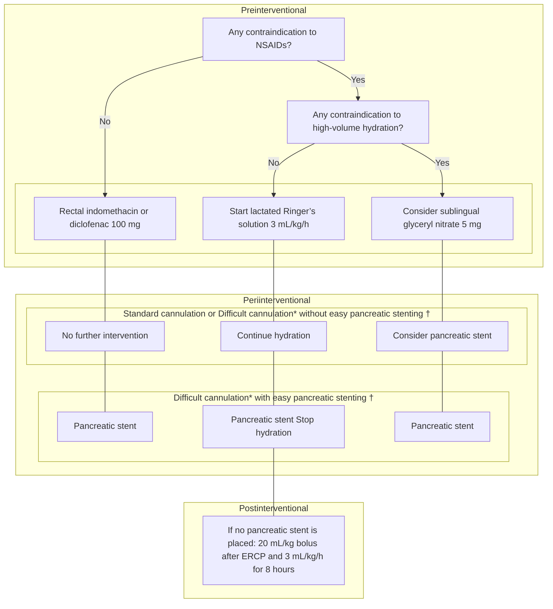

# ERCP-related adverse events: European Society of Gastrointestinal Endoscopy (ESGE) Guideline

## Authors

Jean-Marc Dumonceau1, Christine Kapral2, Lars Aabakken3, Ioannis S. Papanikolaou4, Andrea Tringali5, 6, Geoffroy Vanbiervliet7, Torsten Beyna8, Mario Dinis-Ribeiro9, 10, Istvan Hritz11, Alberto Mariani12, Gregorios Paspatis13, Franco Radaelli14, Sundeep Lakhtakia15, Andrew M. Veitch16, Jeanin E. van Hooft17

## Institutions

1. Gastroenterology Service, Hôpital Civil Marie Curie, Charleroi, Belgium
2. Department of Gastroenterology and Hepatology, Ordensklinikum Barmherzige Schwestern, Linz, Austria
3. GI Endoscopy Unit, OUS, Rikshospitalet University Hospital, Oslo, Norway
4. Hepatogastroenterology Unit, Second Department of Internal Medicine – Propaedeutic, Research Institute and Diabetes Center, Medical School, National and Kapodistrian University, Attikon University General Hospital, Athens, Greece
5. Digestive Endoscopy Unit, Fondazione Policlinico Universitario A. Gemelli IRCCS, Rome, Italy
6. Centre for Endoscopic Research, Therapeutics and Training (CERTT), Università Cattolica del Sacro Cuore, Rome, Italy
7. Centre Hospitalier Universitaire de Nice, Pole D.A.R.E, Endoscopie Digestive, Nice, France
8. Department of Internal Medicine and Gastroenterology, Evangelisches Krankenhaus Düsseldorf, Dusseldorf, Germany
9. Gastroenterology Department, Portuguese Oncology Institute of Porto, Portugal
10. Center for Research in Health Technologies and Information Systems (CINTESIS), Faculty of Medicine, Porto, Portugal
11. Semmelweis University, 1st Department of Surgery, Center for Therapeutic Endoscopy, Budapest, Hungary
12. Division of Pancreato-Biliary Endoscopy and Endosonography, Pancreas Translational & Clinical Research Center, San Raffaele Scientific Institute IRCCS, Vita Salute San Raffaele University, Milan, Italy
13. Gastroenterology Department, Benizelion General Hospital, Heraklion, Crete, Greece
14. Gastroenterology Department, Valduce Hospital, Como, Italy,
15. Asian Institute of Gastroenterology, Hyderabad, India
16. Department of Gastroenterology, New Cross Hospital, Wolverhampton, UK
17. Department of Gastroenterology and Hepatology, Amsterdam University Medical Centers, University of Amsterdam, The Netherlands

## Bibliography

DOI https://doi.org/10.1055/a-1075-4080

Published online: 20.12.2019 | Endoscopy 2020; 52: 127–149

© Georg Thieme Verlag KG Stuttgart · New York

ISSN 0013-726X

## Corresponding author

Jean-Marc Dumonceau, MD PhD, Service de Gastroentérologie, Hôpital Civil Marie Curie, Chaussée de Bruxelles 140, B 6042 Charleroi, Belgium

Fax: +32-71-922367

jmdumonceau@hotmail.com

**Supplementary material**
Online content viewable at:
https://doi.org/10.1055/a-1075-4080

---

## MAIN RECOMMENDATIONS

### Prophylaxis

**1** ESGE recommends routine rectal administration of 100 mg of diclofenac or indomethacin immediately before endoscopic retrograde cholangiopancreatography (ERCP) in all patients without contraindications to nonsteroidal anti-inflammatory drug administration.

Strong recommendation, moderate quality evidence.

**2** ESGE recommends prophylactic pancreatic stenting in selected patients at high risk for post-ERCP pancreatitis (inadvertent guidewire insertion/opacification of the pancreatic duct, double-guidewire cannulation).

Strong recommendation, moderate quality evidence.

**3** ESGE suggests against routine endoscopic biliary sphincterotomy before the insertion of a single plastic stent or an uncovered/partially covered self-expandable metal stent for relief of biliary obstruction.

Weak recommendation, moderate quality evidence.

**4** ESGE recommends against the routine use of antibiotic prophylaxis before ERCP.
Strong recommendation, moderate quality evidence.

**5** ESGE suggests antibiotic prophylaxis before ERCP in the case of anticipated incomplete biliary drainage, for severely immunocompromised patients, and when performing cholangioscopy.
Weak recommendation, moderate quality evidence.

**6** ESGE suggests tests of coagulation are not routinely required prior to ERCP for patients who are not on anticoagulants and not jaundiced.
Weak recommendation, low quality evidence.

### Treatment

**7** ESGE suggests against salvage pancreatic stenting in patients with post-ERCP pancreatitis.
Weak recommendation, low quality evidence.

**8** ESGE suggests temporary placement of a biliary fully covered self-expandable metal stent for post-sphincterotomy bleeding refractory to standard hemostatic modalities.
Weak recommendation, low quality evidence.

**9** ESGE suggests to evaluate patients with post-ERCP cholangitis by abdominal ultrasonography or computed tomography (CT) scan and, in the absence of improvement with conservative therapy, to consider repeat ERCP. A bile sample should be collected for microbiological examination during repeat ERCP.
Weak recommendation, low quality evidence.

---

> **SOURCE AND SCOPE**
>
> This Guideline is an official statement of the European Society of Gastrointestinal Endoscopy (ESGE), reviewing the definitions, epidemiology, risk factors, prophylaxis measures, and management of adverse events related to ERCP.

## 1 Introduction

The range and incidence of adverse events (AEs) related to endoscopic retrograde cholangiopancreatography (ERCP) differ substantially from those related to other endoscopic procedures. Familiarity with these AEs is critical for providing patient information during the consent phase as well as for prophylaxis and management. Adverse events related to sedation, biliary stent obstruction, radiation, infection, and to the endoscopic resection of ampullary neoplasms will not be discussed as they are included in other Guidelines from the European Society of Gastrointestinal Endoscopy (ESGE) [1–4].

## 2 Methods

ESGE commissioned this Guideline (Guideline Committee Chair, J.v.H) and appointed a Guideline leader (J.M.D.) who invited the listed authors to participate in the project development. The key questions were prepared by the Guideline leader and then approved by the other members. The coordinating team formed task force subgroups, each with its own leader, who was assigned key questions (see **Appendix 1s**, online-only Supplementary Material).

Each task force performed a systematic literature search to prepare evidence-based and well-balanced statements on their assigned key questions. The literature search was performed in MEDLINE and Embase published in English, focusing on meta-analyses and fully published prospective studies, particularly randomized controlled trials (RCTs), performed in humans. Retrospective analyses and pilot studies were also included if they addressed topics not covered in the prospective studies. The Grading of Recommendations Assessment, Development, and Evaluation (GRADE) system was adopted to define the strength of recommendation and the quality of evidence [5]. Each task force proposed statements on their assigned key questions which were discussed during a meeting in Munich, June 2019. Literature searches were re-run in September 2019. This time-point should be the starting point in the search for

> **ABBREVIATIONS**
>
> | Abbreviation | Definition |
> |---|---|
> | AE | adverse event |
> | ASGE | American Society of Gastrointestinal Endoscopy |
> | BSG | British Society of Gastroenterology |
> | CBD | common bile duct |
> | CI | confidence interval |
> | CT | computed tomography |
> | DGW | double-guidewire |
> | ERCP | endoscopic retrograde cholangiopancreatography |
> | ESGE | European Society of Gastrointestinal Endoscopy |
> | INR | International Normalized Ratio |
> | LRS | lactated Ringer's solution |
> | NNT | number needed to treat |
> | NS | not significant |
> | NSAID | nonsteroidal anti-inflammatory drug |
> | OR | odds ratio |
> | PEC | post-ERCP cholangitis |
> | PEP | post-ERCP pancreatitis |
> | PSB | post-sphincterotomy bleeding |
> | RCT | randomized controlled trial |
> | RR | relative risk |
> | SEMS | self-expandable metal stent |

new evidence for future updates to this Guideline. In September 2019, a draft prepared by J.M.D. and C.K. was sent to all group members for review. The draft was reviewed by external reviewers and then sent for further comments to the ESGE National Societies and Individual Members. After agreement on a final version, the manuscript was submitted to the journal *Endoscopy* for publication. All authors agreed on the final revised version.

This Guideline was issued in 2020 and will be considered for review in 2024, or sooner if new and relevant evidence becomes available. Any updates to the Guideline in the interim period will be noted on the ESGE website: https://www.esge.com/publications/guidelines/.

## 3 Definitions and epidemiology

> **RECOMMENDATION**
>
> ESGE suggests to define (i) post-ERCP pancreatitis as new or worsened abdominal pain combined with > 3 times the normal value of amylase or lipase at more than 24 hours after ERCP and requirement of admission or prolongation of a planned admission; (ii) cholecystitis according to the revised "Tokyo Guidelines 2018"; and (iii) other ERCP-related adverse events according to the 2010 lexicon of definitions proposed in 2010 for the American Society of Gastrointestinal Endoscopy (ASGE).
>
> Weak recommendation, low quality evidence.

The proposed definition of post-ERCP pancreatitis (PEP) derives from Cotton et al. [6]; it has been used in most large clinical trials, though with small variations in the minimum duration of hospital stay [7], the time at which pancreatic enzymes are measured [8] and their minimum elevation for diagnosis [9]. The definition takes into account patients with pre-existing pain due to pancreatitis, as proposed by Freeman et al. [9]. The Atlanta definition has not been embraced so far, probably because it requires pancreas imaging [10].

Other ERCP-related AEs have been defined as follows:

- Cholangitis: new onset temperature > 38 °C for more than 24 hours combined with cholestasis [8];
- Bleeding: hematemesis and/or melena or hemoglobin drop > 2 g/dL [8];
- Perforation: evidence of gas or luminal contents outside of the gastrointestinal tract as determined by imaging [8];
- Hypoxemia: hemoglobin oxygen saturation < 85 % [8];
- Hypotension or hypertension: either a blood pressure value < 90/50 or > 190/130 mmHg, or a change in value down or up 20 % [8];
- Cholecystitis: right upper quadrant signs of inflammation, systemic signs of inflammation, and imaging findings characteristic of acute cholecystitis, without any suggestive clinical or imaging findings prior to ERCP [11].

The incidences of the most frequent AEs are summarized in **▶ Table 1**; these values were extracted from prospective studies, except where otherwise stated.

The incidence of PEP reported in meta-analyses varies from 3.5 % (21 studies, 16 855 patients) [12] to 9.7 % (108 RCTs, 13 296 patients) [13]; the majority of PEP is mild and only 0.1 %–0.7 % of patients subjected to ERCP die from PEP. These figures vary depending on patient, procedural, and endoscopist-associated risk factors. For example, a meta-analysis reported a PEP incidence of 14.7 % in high-risk patients [13].

Infections, including cholecystitis and cholangitis occurred in 1.4 % of ERCPs in the abovementioned meta-analysis of 2007 [12]; 20 % of these were considered severe events and the mortality rate was 0.11 % overall. Other studies have reported cholecystitis separately, in 0.5 % and 5.2 % of patients following biliary sphincterotomy and biliary self-expandable metal stent (SEMS) insertion, respectively [9, 14], with a mortality rate of 0.04 % [9].

Bleeding may be immediate, mostly self-limited, or delayed, and become evident from hours to 7–10 days following ERCP [15]. The abovementioned 2007 meta-analysis showed an overall bleeding rate of 1.3 %, with 71 % of these being graded as moderate and 29 % as severe; the mortality rate was 0.05 % overall.

Perforation most frequently happens following sphincterotomy but balloon dilation, guidewire maneuvers, and the tip of the endoscope may also cause this AE. In the abovementioned 2007 meta-analysis [12], it was reported in 0.6 % of cases but some perforations, particularly Stapfer type IV perforations, frequently pass unnoticed. The overall mortality rate was 0.06 % (9.9 % perforation-related fatality). A more recent meta-analysis (12 retrospective studies, 42 374 patients) reported an identical 0.6 % overall perforation rate [16].

Recurrence of bile duct stones after endoscopic extraction is a frequent problem; it occurred in 11.3 % of 46 181 patients at 4.2 years in a nationwide Korean study [17]. Furthermore, after a first recurrence of bile duct stones, second and third recurrences are even more likely [17, 18], with incidences of 23.4 % and 33.4 %, respectively, in the abovementioned nationwide study [17].

Sedation-related events are mostly intraprocedural, mild, and transient events that do not affect the overall management plan. A study (528 ERCPs) reported that sedation-related AEs were frequent (24.6 %, mostly hypoxemia and hypotension) but rarely had consequences at 48 hours (aspiration pneumonia was reported in 0.4 % of patients) [19]. A multicenter registry (20 967 ERCPs) reported a sedation-related mortality of 0.02 % [20].

Finally, outbreaks of infections with multidrug-resistant bacteria, although rare, have been associated with insufficient duodenoscope disinfection [21]. The awareness of this problem has become widespread, prompting revision of reprocessing Guidelines [3] as well as instrument design modifications.

**▶ Table 1** Incidence, mortality and severity grading of the most common ERCP-related adverse events.

| Type [reference for severity grading] | Incidence | Mortality | Severity grading – Mild | Severity grading – Moderate | Severity grading – Severe |
|---|---|---|---|---|---|
| Pancreatitis [10] | 3.5 %– 9.7 % | 0.1 %– 0.7 % | ▪ No organ failure ▪ No local or systemic complications | ▪ Transient (< 48 hours) organ failure and/or ▪ Local or systemic complications without persistent organ failure | ▪ Persistent (48 hours) organ failure |
| Cholangitis [25] | 0.5 %– 3.0 % | 0.1 % | ▪ No criteria of moderate/severe cholangitis. | Any of the following: ▪ White blood cell count > 12 000 or < 4000/mm³, ▪ Fever ≥ 39 °C, ▪ Age ≥ 75 years, ▪ Total bilirubin ≥ 5 mg/dL, ▪ Hypoalbuminemia | Dysfunction of any one of the following (see reference for specific criteria): ▪ Cardiovascular ▪ Neurological ▪ Respiratory ▪ Renal ▪ Hepatic, or ▪ Hematological system |
| Cholecystitis [11] | 0.5 %– 5.2 % | 0.04 % | ▪ No criteria of moderate/severe cholecystitis | Any one of the following: ▪ White blood cell count > 18 000/mm³, ▪ Palpable tender mass in the right upper abdominal quadrant, ▪ Duration of complaints > 72 h, ▪ Marked local inflammation (gangrenous cholecystitis, pericholecystic abscess, hepatic abscess, biliary peritonitis, emphysematous cholecystitis) | Dysfunction of any one of the following (see reference for specific criteria): ▪ Cardiovascular ▪ Neurological ▪ Respiratory ▪ Renal ▪ Hepatic ▪ Hematological system |
| Bleeding [8] | 0.3 %– 9.6 % | 0.04 % | Either of the following: ▪ Abortion of procedure ▪ Unplanned admission < 4 nights | Any one of the following: ▪ Unplanned admission 4–10 nights ▪ ICU admission 1 night ▪ Need for transfusion ▪ Repeat endoscopy or interventional radiology ▪ Intervention for integument injuries | Any one of the following: ▪ Unplanned admission > 10 nights ▪ ICU admission > 1 night ▪ Need for surgery ▪ Permanent disability |
| Perforation [8] | 0.08 %– 0.6 % | 0.06 % | Identical to bleeding | Identical to bleeding | Identical to bleeding |
| Sedation-related AEs [8] | 24.6 % | 0.02 % | Identical to bleeding | Identical to bleeding | Identical to bleeding |

ERCP, endoscopic retrograde cholangiopancreatography; AE, adverse event; ICU, intensive care unit.

> **RECOMMENDATION**
>
> ESGE suggests to grade the severity of ERCP-related adverse events according to the Atlanta classification for pancreatitis, the revised Tokyo Guidelines 2018 for cholangitis and cholecystitis, and the 2010 ASGE lexicon for other ERCP-related adverse events.
>
> Weak recommendation, low quality evidence.

The 2010 ASGE lexicon proposed a severity grading usable for all AEs [8]. At the core of this system was the consequence of AEs in terms of admission to hospital and/or intensive care unit, the type of treatment applied, and death or permanent disability outcomes. This system is useful for research and comparison purposes but for some AEs, more specific classification systems are available:

- Pancreatitis: the revised Atlanta classification of severity [10] is a better predictor for PEP-related mortality than a system based on hospital duration as shown in a multicenter comparison with the 1991 consensus criteria (retrospective study of 387 patients with PEP) [22]. The determinant-based classification is accurate but has not been compared with alternatives in the setting of PEP [23, 24]
- Cholangitis and cholecystitis: the revised Tokyo severity grading systems may offer more accurate predictive power than the generic alternatives; they are presented in a

simplified form in **▶ Table 1** (a smartphone app is available for easy use) [11, 25]

- Perforation: in addition to severity grading, the type of perforation according to the Stapfer classification (**▶ Table 2**) should be stated [26].

## 4 Risk factors for AEs

**▶ Table 3** summarizes risk factors for ERCP-related AEs while **Table 1s** (**Appendix 2s**, available online-only in Supplementary Material), more completely details the odds ratios (ORs) reported by various studies for each risk factor.

### 4.1 Risk factors for post-ERCP pancreatitis

> **RECOMMENDATION**
>
> ESGE suggests that patients should be considered to be at high risk for post-ERCP pancreatitis when at least one definite or two likely patient-related or procedure-related risk factors are present (**▶ Table 3**).
>
> Weak recommendation, low quality evidence.

Some definite patient-related risk factors for PEP, i. e., suspected sphincter of Oddi dysfunction, female sex, and previous pancreatitis [27], have been confirmed by two recent systematic reviews (32 381 and 54 889 patients, 12 and 28 studies) [28, 29]. Both studies also found that previous PEP is an independent risk factor (OR 2.90 and 3.23, 95 % confidence interval [CI] 1.87 – 4.48). Of note, younger age could not be confirmed as a risk factor in one of the recent systematic reviews [29] and was not studied in the other one [28]. However, in a more recent prospective study (996 patients), age less than 35 years was an independent risk factor for PEP (OR 0.035) [30].

With respect to definite procedure-related risk factors for PEP, difficult cannulation and pancreatic injection have been confirmed in the abovementioned meta-analysis that studied these factors [29]. Sphincterotomy, including biliary and pancreatic endoscopic sphincterotomy, was identified as a risk factor in both meta-analyses [28, 29]. Pancreatic endoscopic

---

**▶ Table 2** Types of ERCP-related perforation according to Stapfer et al [26].

| Type | Description | Frequency [16] |
|---|---|---|
| I | Duodenal wall perforation (by the endoscope) | 18 % |
| II | Periampullary perforation (by sphincterotomy/precut) | 58 % |
| III | Biliary or pancreatic duct perforation (by intraductal instrumentation) | 13 % |
| IV | Retroperitoneal gas alone | 11 % |

ERCP, endoscopic retrograde cholangiopancreatography.

---

**▶ Table 3** Risk factors for post-ERCP pancreatitis (PEP), bleeding and cholangitis.

| Risk factors for adverse events | Odds ratios |
|---|---|
| **Risk factors for post-ERCP pancreatitis** | |
| *Patient-related definite risk factors* | |
| ▪ Suspected SOD | 2.04 – 4.37 |
| ▪ Female sex | 1.40 – 2.23 |
| ▪ Previous pancreatitis | 2.00 – 2.90 |
| ▪ Previous PEP | 3.23 – 8.7 |
| *Procedure-related definite risk factors* | |
| ▪ Difficult cannulation | 1.76 – 14.9 |
| ▪ Pancreatic guidewire passages > 1 | 2.1 – 2.77 |
| ▪ Pancreatic injection | 1.58 – 2.72 |
| *Patient-related likely risk factors* | |
| ▪ Younger age | 1.59 – 2.87 |
| ▪ Nondilated extrahepatic bile duct | 3.8 |
| ▪ Absence of chronic pancreatitis | 1.87 |
| ▪ Normal serum bilirubin | 1.89 |
| ▪ End-stage renal disease | 1.7 |
| *Procedure-related likely risk factors* | |
| ▪ Precut sphincterotomy | 2.11 – 3.1 |
| ▪ Pancreatic sphincterotomy | 1.23 – 3.07 |
| ▪ Biliary balloon sphincter dilation | 4.51 |
| ▪ Failure to clear bile duct stones | 4.51 |
| ▪ Intraductal ultrasound | 2.41 |
| **Risk factors for bleeding** | |
| ▪ Anticoagulants | 4.39 |
| ▪ Platelets < 50 000/mm³ | 35.30 |
| ▪ Cirrhosis | 2.05 – 2.85 |
| ▪ End-stage renal disease | 1.86 – 13.30 |
| ▪ Intraprocedural bleeding | 4.28 |
| ▪ Low endoscopist experience | 1.44 |
| ▪ Unsuccessful cannulation with precut sphincterotomy | 3.09 |
| **Risk factors for cholangitis** | |
| ▪ Incomplete biliary drainage | |
| ▪ Hilar obstruction | 2.59 |
| ▪ History of previous of ERCP | 2.48 |
| ▪ Age > 60 years | 1.98 |
| ▪ Cholangioscopy | 4.98 |

ERCP, endoscopic retrograde cholangiopancreatography; SOD, sphincter of Oddi dysfunction.

sphincterotomy was also an independent risk factor in a population-based study of 381 288 patients [31]. New data confirmed that the impact of precut sphincterotomy depends on timing: both meta-analyses reported that precut sphincterotomy is associated with a twofold increase in the risk of PEP [28, 29] while two additional meta-analyses (999 and 523 patients, 7 and 5 RCTs) found that, in patients with difficult biliary access, early precut is associated with a lower risk of PEP compared with persistent cannulation attempts, especially when the procedure is performed by qualified endoscopists (relative risk [RR], 0.43 and 0.29) [32, 33].

With respect to volume, a meta-analysis (13 studies, 59 437 patients) found that AEs were less frequent when ERCPs were performed by high-volume endoscopists (OR 0.7, 95 %CI 0.5–0.8) but not in high-volume centers; only three studies reported PEP specifically (8289 procedures); there was no association between endoscopist's volume (< 25 to < 156/year) and PEP [34]. A more recent multicenter study (1191 patients) identified less experienced endoscopists (< 200 ERCP procedures) as an independent risk factor for PEP (OR 1.63, 95 %CI 1.05–2.53) [35].

End-stage renal disease may be associated with PEP as the incidence was increased in two retrospective studies, but the difference was statistically significant only in the largest study (OR 1.7, 95 %CI 1.4–2.1) (452 771 hospitalizations) [36, 37].

No new data have become available regarding the role of intraductal ultrasound or the synergistic effect of risk factors for PEP. As risk factors for PEP have been shown to be independent by multivariate analysis, they are considered to have a cumulative effect.

### 4.2 Risk factors for post-sphincterotomy bleeding

> **RECOMMENDATION**
>
> ESGE suggests that patients should be considered to be at increased risk for post-sphincterotomy bleeding if at least one of the following factors is present: anticoagulant intake, platelet count < 50 000/mm³, cirrhosis, dialysis for end-stage renal disease, intraprocedural bleeding, low endoscopist experience.
>
> Weak recommendation, low quality evidence.

Post-ERCP bleeding is most frequently seen after biliary endoscopic sphincterotomy. The latter can be avoided in most cases when biliary stenting is performed [4] and, for the extraction of biliary stones, by performing endoscopic papillary balloon dilation. However, according to a meta-analysis of 25 RCTs (3726 patients), when balloon dilation alone is performed, mechanical lithotripsy is more frequently required and the overall success of stone removal is lower (no significant difference in PEP) [38].

With respect to post-sphincterotomy bleeding (PSB), risk factors mentioned in the above recommendation are independent and were evidenced in at least two of 10 studies summarized in **Table 2s**. Cirrhosis was confirmed as a risk factor in a meta-analysis (6 studies, 5526 patients) [39] and in a more recent matched cohort retrospective study (331 patients) [40]. Dialysis for end-stage renal disease was associated with PSB in all four case–control studies (7508 cases vs. 450 246 controls) on the topic (OR 1.4, 95 %CI 1.2–1.6 in the largest study) [36, 37, 41, 42], and particularly year-long hemodialysis [43]. Furthermore, bleeding episodes are more severe than in patients without renal disease [41] and occur with a similar incidence following endoscopic papillary balloon dilation (8.7 %) or sphincterotomy (8.3 %) [42]. The role of precut is controversial: in two meta-analyses (6 and 7 RCTs, 966 and 999 patients), early precut sphincterotomy in difficult biliary access did not increase the rate of post-ERCP bleeding compared with persistent cannulation attempts [32, 33, 44].

With respect to antiplatelet agents other than aspirin, six controlled studies have become available since the publication of the British Society of Gastroenterology (BSG)/ESGE Guidelines [41, 45–50]; five of them reported a significant association between antithrombotic agents and post-ERCP bleeding in univariate analysis [41, 45–47, 49] but the association became nonsignificant in multivariate analysis in all but one study [49]. All studies were retrospective with no power calculation and antiplatelet agents were generally withheld before ERCP.

For difficult biliary stones, endoscopic sphincterotomy associated with balloon dilation is recommended [51]. Bleeding was less frequent with this technique vs. endoscopic sphincterotomy alone in several [52, 53], but not all [54, 55] meta-analyses; it may depend on the extent of the endoscopic sphincterotomy [56].

With respect to the technique of endoscopic sphincterotomy, an in vitro dissection study concluded that the papilla should be incised in the 10–11 o'clock region because this contains only 10 % of all papillary arteries [57]. Blended current, as opposed to pure cutting current, is recommended as it reduces the incidence of bleeding without increasing the risk of PEP [58, 59]; a meta-analysis (3 RCTs, 594 patients) suggested that bleeding was less frequent when Endocut was used compared to other blended current modes but this is of doubtful clinical significance as all bleeding was minor [60].

### 4.3 Risk factors for post-ERCP cholangitis

> **RECOMMENDATION**
>
> ESGE suggests that patients should be considered to be at high risk for post-ERCP cholangitis when there is incomplete biliary drainage, including hilar obstruction and primary sclerosing cholangitis, and when cholangioscopy is performed.
>
> Weak recommendation, very low quality evidence.

Only two studies have analyzed independent risk factors for post-ERCP cholangitis (PEC) in unselected patients [61, 62]. Hilar obstruction, age ≥ 60 years, and a history of previous ERCP were independent risk factors in the most recent, retrospective, study (4324 patients) while the complete extraction of

biliary stones was protective [62]. Incomplete biliary drainage is a well-accepted risk factor for PEC [63] even if controlled studies have mostly focused on septicemia, a surrogate marker of cholangitis [64]. Primary sclerosing cholangitis and hilar obstruction both predispose to incomplete biliary drainage and are believed to be associated with PEC although no controlled study is available [65]. Cholangioscopy increased the risk of PEC in a retrospective study (4214 ERCPs) [66]; more recently, bacteremia was suggested to be specifically related to cholangioscopy in 13.9 % of 72 patients, based on serial blood samplings [67], and to be associated with biopsy sampling and strictures [68].

Some factors do not seem to influence the risk of developing PEC: cirrhosis (meta-analysis of 6 studies, 5526 patients) [38]; operator experience < 200 ERCPs (prospective study, 1191 patients) [34]; or the presence of a periampullary diverticulum (meta-analysis of 4 studies, 778 cases and 3886 controls) [69].

### 4.4 Risk factors for perforation

> **RECOMMENDATION**
>
> ESGE suggests that patients should be considered to be at increased risk for perforation in the setting of surgically altered anatomy, the presence of a papillary lesion, sphincterotomy, biliary stricture dilation, a dilated common bile duct, sphincter of Oddi dysfunction, and precut sphincterotomy.
>
> Weak recommendation, low quality evidence.

Only a few monocentric studies have reported on the risk factors for post-ERCP perforation. The abovementioned independent risk factors have been identified in two case–control studies (70 perforations, 681 controls) [70, 71], except for altered surgical anatomy, which was shown to be a risk factor in another study [72]. A more recent retrospective study showed that looping of the endoscope during ERCP in patients with Billroth II anatomy was associated with perforation [73].

### 4.5 Risk factors for stone recurrence

> **RECOMMENDATION**
>
> ESGE suggests advising patients to return if symptoms recur after the extraction of common bile duct (CBD) stones, in particular if these were themselves recurrent CBD stones.
>
> Weak recommendation, low quality evidence.

The risk of stone recurrence after endoscopic extraction sharply increases to 23.4 % after a first recurrence and 33.4 % after a second recurrence [17, 18]. This can partly be prevented by cholecystectomy in patients with a gallbladder in situ and cholelithiasis, as shown in a meta-analysis of 7 RCTs (RR of recurrent jaundice or cholangitis, 2.16, 95 %CI 1.14 – 4.07) [74]. This is particularly the case for younger patients: the RR for patients with vs. without a gallbladder in situ is 3.20 at age < 50 as opposed to 1.26 at age ≥ 70 years [17]. This is against a background of more frequent stone recurrence with increasing age [17]. Other risk factors for stone recurrence are mostly nonremediable [18].

### 4.6 Consent

> **RECOMMENDATION**
>
> ESGE recommends that both oral and written informed consent should be obtained prior to ERCP. The consent process should take into account individual and procedure-related risks, correct indication, and urgency of ERCP, as well as national practice.
>
> Strong recommendation, low quality evidence.

Legal consequences such as malpractice claims or lawsuits related to AEs are not uncommon [75, 76]. A well-documented, oral and written, patient-informed consent is preferred before the procedure, because of patients' rights and because of ethical considerations. Patients should be made aware of the procedural indication, specific benefits to them, individual and procedure-related risks on the basis of available scientific data, and alternatives [77]. The length of time that consent is obtained prior to ERCP varies according to national and institutional practice and legislation. Informed consent should be a dynamic process rather than a single event and should at some point involve the performing endoscopist [77]. The patient must be given the possibility and the time to change his/her mind and to withdraw consent.

## 5 Prevention of post-ERCP pancreatitis

### 5.1 Nonsteroidal anti-inflammatory drugs (NSAIDs)

> **RECOMMENDATION**
>
> ESGE recommends routine rectal administration of 100 mg of diclofenac or indomethacin immediately before ERCP in all patients without contraindications to nonsteroidal anti-inflammatory drug administration.
>
> Strong recommendation, moderate quality evidence.

Rectal nonsteroidal anti-inflammatory drugs (NSAIDs) are the mainstay of PEP prophylaxis as presented in the ESGE algorithm for PEP prophylaxis (**▶ Fig. 1**). **Table 3s** summarizes 28 meta-analyses (3 to 21 RCTs, 912 to 6854 patients) that assessed the efficacy of NSAIDs for the prevention of PEP. All but one of the meta-analyses reported an overall reduction in the incidence of PEP with NSAIDs, with an OR ranging from 0.24 to 0.63. The single meta-analysis that reported no risk reduction included only placebo-controlled RCTs of rectal indomethacin which enrolled consecutive patients in order to address the ef-

**▶ Fig. 1** Algorithm for prophylaxis against post-ERCP pancreatitis. \*Difficult cannulation: > 5 contacts with the papilla or > 5 minutes of cannulation attempts or > 1 unintended pancreatic duct cannulation. †Easy pancreatic stenting: pancreatic guidewire assisted biliary cannulation, transpancreatic sphincterotomy, repeated inadvertent main pancreatic duct (MPD) cannulation. NSAIDs, nonsteroidal anti-inflammatory drugs.

---

ficacy of NSAIDs in average-risk patients [78]. Indeed, among 14 meta-analyses which analyzed the effect of NSAIDs in average-risk patients, 11 found a significantly lower and three a nonsignificant trend for a lower incidence of PEP with NSAIDs. Risk stratification for PEP varied across studies: procedures were classified as average-risk if they did not meet high-risk criteria [78–85] and high-risk was usually defined by the presence of one major criterion or two minor criteria. Unselected patients were defined as all patients undergoing ERCP [86] or those in studies where risk factors were not a criterion for inclusion [87]. The RCT by Levenick et al. that did not demonstrate a beneficial effect of NSAIDs in consecutive patients undergoing ERCP [88] has received many comments and criticisms. Four of the most recent meta-analyses confirmed that this study is an outlier among the RCTs that assessed the effect of NSAIDs in patients at average risk for PEP [79, 80, 89, 90]. Therefore, also considering logistical reasons as well as the benefit of pre-ERCP as compared with post-ERCP administration of NSAIDs (see below), and the fact that patients may become at high risk for PEP during ERCP, we recommend routine administration of NSAIDs.

With respect to the severity of PEP, the incidence of mild and of moderate-to-severe PEP was decreased with NSAIDs in 7 of 8 and in 15 of 16 meta-analyses, respectively, that reported on this item. NSAID use also reduced death in the single meta-analysis that specifically analyzed that outcome [91]. The number needed to treat (NNT) to prevent one episode of PEP ranged from 8 to 21; to prevent one episode of moderate to severe PEP it ranged from 33 to 39 [87, 92].

The effects of diclofenac and of indomethacin were assessed separately in 14 meta-analyses; 13 of them found that both drugs were effective. The most frequent dosage was 100 mg for both drugs in the RCTs included in the largest meta-analyses [89, 93]. Five meta-analyses assessed separately various routes of NSAID administration; all of them reported that only the rectal route was effective.

Pre-ERCP and post-ERCP administrations of NSAIDs were compared in a single head-to-head study [94]; 2600 patients were randomly allocated to receive rectal indomethacin either before ERCP routinely or after ERCP selectively, i. e., if they were at high risk for PEP. In the subgroup of 586 patients who were at high risk (all patients therefore received rectal indomethacin), PEP developed in 6 % vs. 12 % in the pre- vs. post-ERCP group, respectively (RR 0.47, 95 %CI 0.27 – 0.82). This suggests that pre-ERCP administration is the most effective timing. On the other hand, meta-analyses that suggested a higher efficacy of pre- or of post-ERCP NSAIDs based their conclusions on the comparison of RRs in subgroup analyses of different studies, but these findings are affected by factors other than drug efficacy, such as the numbers of studies [83, 90].

The overall AE rate was assessed in a meta-analysis; it reported a nonsignificant trend for a lower risk of overall AEs in the NSAIDs vs. control groups (RR 0.80, 95 %CI 0.47 – 1.36) [83]. Other meta-analyses that looked into specific AEs (e. g., bleeding, renal failure) found no difference [83, 86, 92, 95 – 100].

NSAIDs may cause allergic and pseudoallergic reactions such as NSAID-exacerbated respiratory disease or skin disease. Among these, Stevens – Johnson and Lyell's syndromes present the highest mortality (5 %– 50 %); both syndromes are extremely rare but ibuprofen and diclofenac have been implicated [101]. If NSAIDs are suspected to have caused one of these syndromes, they should be avoided in survivors and first-degree relatives [102]. In other patients with allergic and pseudoallergic reactions, decisions should be individualized [103].

With respect to pregnancy, indomethacin and diclofenac are considered safe until 30 weeks of gestation [104]; NSAIDs are then contraindicated because of the fetal risks of complications including premature closure of the ductus arteriosus [105].

Caution is advised in patients with impaired renal function, particularly those taking antihypertensive drugs [106]. Finally, a single dose of ibuprofen is thought to have no effect on low-dose aspirin taken as an antithrombotic agent [107] and on the healing of gastroduodenal ulcers [108]. A single dose of 100 mg indomethacin does not increase the risk of post-sphincterotomy bleeding in patients taking aspirin or clopidogrel [109].

> **RECOMMENDATION**
>
> ESGE recommends against administration of NSAIDs for PEP prophylaxis in pregnant women at ≥ 30-week gestation and in patients as well as first-degree relatives with a history of Stevens – Johnson or Lyell's syndromes attributed to NSAIDs.
>
> Strong recommendation, low quality evidence.

### 5.2 Aggressive hydration with lactated Ringer's solution

> **RECOMMENDATION**
>
> ESGE recommends aggressive hydration with lactated Ringer's solution (3 mL/kg/hour during ERCP, 20 mL/kg bolus after ERCP, 3 mL/kg/hour for 8 hours after ERCP) in patients with contraindication to NSAIDs, provided that they are not at risk of fluid overload and that a prophylactic pancreatic duct stent is not placed.
>
> Strong recommendation, moderate quality evidence.

Two meta-analyses assessed the efficacy of aggressive vs. standard intravenous hydration with lactated Ringer's solution (LRS) for the prevention of PEP [110, 111]; they included 3 – 7 RCTs that are detailed in **Table 4s**. The total amount of fluid used for aggressive hydration was 35 – 45 mL/kg administered over 8 – 10 hours depending on the protocol. It was associated with a lower incidence of PEP (OR [95 %CI], 0.29 [0.16 – 0.53] and 0.47 [0.30 – 0.72]) [110, 111] and moderate to severe PEP (OR 0.16, 95 %CI 0.03 – 0.96) [110] with no difference in AE rates [111]. A more recent RCT (395 patients) reported that overall PEP was less frequent with aggressive hydration vs. standard hydration, both using LRS (3.0 % vs. 11.6 %, P = 0.03), while PEP rates were similar for standard hydration using LRS and aggressive hydration using normal serum saline [112].

Although the overall incidence of AEs was similar in the aggressive hydration and control groups [111], fluid overload has been reported in an RCT despite the exclusion of patients at increased risk for this complication [112]. Caution is also advised in older patients, because of the higher risk of undiagnosed comorbidities of heart and kidney disease. PEP prophylaxis with aggressive hydration is not applicable when ERCP is performed as an outpatient procedure, and it is unknown whether admitting patients at low risk for PEP who present a contraindication to NSAIDs in order to administer aggressive hydration is clinically appropriate, cost-effective, or practical.

### 5.3 Roles of sublingual nitrates

> **RECOMMENDATION**
>
> ESGE suggests administration of 5 mg sublingual glyceryl trinitrate before ERCP in patients with a contraindication to NSAIDs or to aggressive hydration for the prevention of PEP.
>
> Weak recommendation, moderate quality evidence.

An updated meta-analysis (11 RCTs, 2095 patients) showed that glyceryl trinitrate reduces the overall incidence of PEP (RR 0.67, 95 %CI 0.52 – 0.87) but not that of moderate to severe PEP. Subgroup analyses revealed that sublingual administration (2 – 5 mg before ERCP) was superior to transdermal and topical

administration [113]. These results were consistent with those reported in four previously published meta-analyses (**Table 5s**) [114–117]. The only RCT that evaluated intravenous nitroglycerin was terminated prematurely because of a concerning incidence of AEs (hypotension and headache) [118].

More recently, a single-center RCT showed that, in mostly high-risk patients, the combination of 5 mg sublingual isosorbide dinitrate and 100 mg rectal indomethacin given before ERCP was more effective than indomethacin alone in reducing the incidence of PEP (6.7 % vs. 15.3 %, P = 0.016) [119]. The superiority of this association was confirmed in a multicenter RCT (n = 886): the combination of 5 mg sublingual isosorbide dinitrate 5 minutes before ERCP with 50 mg rectal diclofenac immediately after ERCP was more effective than diclofenac alone to reduce the overall incidence of PEP (5.6 % vs. 9.5 %, P = 0.03; NNT 26). The incidence of moderate to severe PEP was similar between groups. Transient hypotension occurred in 8 % of patients in the combination group [120].

### 5.4 Somatostatin and octreotide

ESGE has no recommendation about the use of somatostatin. It was associated with an overall reduction in the incidence of PEP in all but one of six meta-analyses (7–15 RCTs, 2190–4943 patients) [121–126] (**Table 6s**), but this reduction was of limited benefit with the upper value of the 95 %CI being close to 1 despite the high numbers of patients. Subgroup analyses suggested that either long-term infusion of high doses (typically 3 mg over 12 hours) or a single bolus of 250 μg were both effective in preventing PEP. The benefit of bolus administration was consistent across all meta-analyses.

A recent large-scale, multicenter RCT (900 patients) confirmed that the periprocedural use of somatostatin (250 μg intravenous bolus before ERCP followed by 250 μg/hour for 11 hours) reduced the incidence of PEP in both the overall population (7.5 % vs. 4.4 %, P = 0.03) and in the high-risk subgroup (7.3 % vs. 4.2 %, P = 0.06), with no drug-related serious AEs [127]. With respect to bolus administration, although meta-analyses are encouraging, studies evaluating this regimen are few, biased by small sample size, and with conflicting results [128–132].

Octreotide, a somatostatin analogue with a longer half-life, has yielded conflicting results for prevention of PEP. The most up-to-date meta-analysis (17 RCTs, 2784 patients) found no significant difference in PEP incidence between octreotide and placebo. However, doses of octreotide ≥ 0.5 mg reduced the incidence of PEP in a subgroup analysis of six studies (RR 0.45, 95 %CI 0.28–0.73; NNT 25) [133].

### 5.5 Protease inhibitors and epinephrine

> **RECOMMENDATION**
>
> ESGE does not recommend protease inhibitors and topically administered epinephrine onto the papilla for PEP prophylaxis.
>
> Strong recommendation, moderate quality evidence.

Protease inhibitors could inhibit the activation of proteolytic enzymes that play an important role in the pathogenesis of PEP. Meta-analyses of RCTs on gabexate mesilate [121, 126, 134–138] and ulinastatin [134, 139] administration for PEP prevention were inconclusive. Furthermore, two subgroup analyses revealed that in six high quality studies gabexate mesilate and ulinastatin had no effect on PEP [135].

Nafamostat, a more potent protease inhibitor with a longer half-life, reduced the overall risk of PEP by approximately 50 % in four out of five RCTs and in two meta-analyses [134, 140–144] (**Table 7s**). Low-dose (20 mg) nafamostat is not inferior to high-dose (50 mg) [142], and 2–6 hours' administration is as effective as longer administration [145]. No AEs related to nafamostat were reported in any study. Major concerns related to its use are the apparent absence of benefit in high-risk cases, even at high dose [142], and high costs. At present, nafamostat is extensively used in Eastern countries for preventing PEP, but it is not available in Europe.

Epinephrine spraying onto the papilla has been proposed as a simple measure to reduce papillary edema and PEP (**Table 8s**). Conflicting results were reported in two RCTs that compared epinephrine vs. saline [146, 147] but the pooled results showed that topical epinephrine reduced PEP (RR 0.25, 95 %CI 0.006–0.65; NNT 15) [148]. Of note, the study reporting positive results was limited by an atypical definition of PEP.

### 5.6 Prophylactic pancreatic stenting

> **RECOMMENDATION**
>
> ESGE recommends prophylactic pancreatic stenting in selected patients at high risk for PEP (inadvertent guidewire insertion/opacification of the pancreatic duct, double-guidewire cannulation).
>
> Strong recommendation, moderate quality evidence.

All of the eight meta-analyses published between 2011 and 2019 (8–14 RCTs, 656–1541 patients) reported that prophylactic pancreatic stenting was associated with a decrease in the incidence of PEP (OR 0.22 to 0.39) [85, 149–155] (**Table 9s**). Among the RCTs included, all but two of them only enrolled patients at high risk for PEP. Three meta-analyses reported results separately according to the patients' risk stratification for PEP: prophylactic pancreatic stenting was beneficial in unselected (RR 0.23, 95 %CI 0.08–0.66) [152] as well as average-risk (OR 0.21 and 0.25) [85, 149, 152] and high-risk patients (OR ranging from 0.27 to 0.41) [85, 149, 152]. In a more recent RCT (167 patients), prophylactic pancreatic stenting was beneficial in unselected patients when there was inadvertent cannulation of the pancreatic duct [156]. With respect to the severe form of PEP, prophylactic pancreatic stenting markedly decreased its incidence (OR ranging from 0.22 to 0.26) in all of the seven meta-analyses that assessed this outcome, although the difference did not reach statistical significance in the smallest study [149–155]. In a meta-analysis where 62 % of patients

were at high risk, the NNT was 8 [154]. Another meta-analysis reported a NNT of 7 (95%CI 6–9) [149].

The benefit of prophylactic pancreatic stenting in patients with intraductal papillary mucinous neoplasm may be questionable. A multicenter retrospective study (414 high-risk patients who had received prophylactic pancreatic stenting) showed that the only risk factor for PEP was intraductal papillary mucinous neoplasm (OR 3.1, 95%CI 1.2–7.8), particularly in the absence of main pancreatic duct dilation in the head of the pancreas [157]. This could be related to stent occlusion by mucin.

A cost–effectiveness analysis has shown that limiting the use of prophylactic pancreatic stenting to high-risk patients was the most cost-effective strategy [158]. This was partly because of the higher risk of PEP after a failed attempt at stent placement. On the other hand, repeated inadvertent guidewire insertion into the duct of Wirsung during attempts at biliary cannulation increases the risk of PEP and makes pancreatic stent insertion particularly easy.

Another argument against routine prophylactic pancreatic stenting is that the removal of retained prophylactic pancreatic stents may cause mild or moderate acute pancreatitis, thus delaying rather than eliminating the occurrence of PEP [159]. However this is very uncommon, especially if the removal is done correctly with a side-viewing scope and a gentle atraumatic withdrawal along the axis of the pancreatic duct.

> **RECOMMENDATION**
>
> For prophylactic pancreatic stenting, ESGE suggests the use of a short 5-Fr pancreatic stent with no internal flange but having a flange or a pigtail on the duodenal side; passage of the stent from the pancreatic duct should be evaluated within 5 to 10 days of placement and retained stents should be removed endoscopically.
>
> Weak recommendation, low quality evidence.

Stents of 5-Fr diameter were found to be more likely to be efficacious than 3-Fr stents (96.9% vs. 3.1%) in a network meta-analysis of six RCTs [160]. These results are consistent with two head-to-head RCTs which concluded that, compared with 3-Fr stents, 5-Fr stents were more effective in the prevention of PEP, required fewer guidewires, and decreased the need for endoscopic stent removal (one study each) [161, 162]. ESGE recommends the stent be devoid of an internal flange to facilitate spontaneous elimination [163] but should have a duodenal pigtail or flange to prevent intraductal migration, as the removal of internally migrated stents is very challenging [164]. With respect to stent length, an RCT (240 patients) found a lower PEP rate with 5-Fr stents of 3 cm vs. 5 cm in length (2.0% vs. 8.8%, P = 0.035) [165]; however the difference was not significant in intention-to-treat analysis and other authors have reported different conclusions [166].

It is believed that stents need to remain in place for a minimum of 12–24 hours to provide benefit, since removal at the end of ERCP negates the protection from PEP [167]. On the other hand, stents still retained at 2 weeks were associated with delayed PEP in an RCT [161] but not in a large retrospective study [168]. The authors of the latter study suggested that an x-ray can be avoided in patients who require a follow-up endoscopic procedure shortly after stent insertion.

### 5.7 Combination of NSAIDS with other measures

> **RECOMMENDATION**
>
> ESGE does not suggest the routine combination of rectal NSAIDs with other measures to prevent PEP.
>
> Weak recommendation, low quality evidence.

With respect to the combination of rectal NSAIDs with other measures:

- **Prophylactic pancreatic stenting:** a post hoc analysis of a pivotal RCT found no difference in PEP rates between patients who had received rectal indomethacin alone or associated with prophylactic pancreatic stenting (7.8% vs. 9.4% after adjustment for PEP risk factors) [169]. Furthermore, the cost–benefit analysis found that indomethacin monotherapy saved US$793 (95%CI 112–1619) and US$1472 (95%CI 491–2804) per patient over the combination of indomethacin plus prophylactic pancreatic stenting and prophylactic pancreatic stenting alone, respectively. In a sensitivity analysis, no adjustment resulted in indomethacin monoprevention becoming costlier than either pancreatic stent-based strategy. A retrospective study (777 patients) found a similar PEP incidence in patients who had received rectal indomethacin alone vs. combined with prophylactic pancreatic stenting (5.1% vs. 6.1%) [170]. Similarly, a network meta-analysis found that rectal NSAIDs alone prevented PEP more effectively than prophylactic pancreatic stenting alone (OR 0.48, 95%CI 0.26–0.87), and that the combination of NSAIDs with stenting was not more effective than either approach alone [85]. Finally, there was no difference between pharmacoprophylaxis alone or combined with pancreatic stenting in a recent RCT (414 high-risk patients) [171].
- **Peri-ERCP hydration:** the combination of aggressive hydration with rectal NSAIDs has been found to be superior to rectal NSAIDs alone in one of two RCTS, with the positive RCT using normal serum saline instead of LRS [172]; a third RCT found similar PEP rates if rectal indomethacin was associated with a bolus of 1 L LRS vs. with 1 L normal serum saline before ERCP [173] (**Table 10s**).
- **Topical epinephrine:** two large, high quality, RCTs compared the efficacy of rectal indomethacin combined with topical epinephrine vs. indomethacin alone. One RCT found no difference between groups in terms of overall as well as severe PEP [174] while the other RCT was prematurely terminated for safety concerns and futility as the combination strategy was associated with a higher risk of PEP compared with indomethacin alone (8.5% vs. 5.3%; RR 1.60, 95%CI 1.03–2.47) [175].

---

Dumonceau Jean-Marc et al. ERCP-related adverse events: ESGE Clinical Guideline … Endoscopy 2020; 52: 127–149 **137**

- **Sublingual nitrate:** an RCT showed that the combination of 5 mg sublingual isosorbide dinitrate with rectal diclofenac was superior to rectal diclofenac alone in reducing the overall incidence of PEP, but the diclofenac was given at low dose (50 mg), and after the procedure in one group and before in the other group. Furthermore, side effects (in particular hypotension) were more common in the combination group, and the incidence of moderate to severe PEP was similar between the two arms [120].

## 6 Other measures for the prevention of adverse events

### 6.1 Primary biliary cannulation

For primary biliary cannulation, the guidewire-assisted technique is recommended [176]. No new evidence justifying a change in this recommendation has emerged. Four recent RCTs comparing different types of guidewire or techniques of cannulation found no differences in AE rates, particularly for PEP [177–180]. In one of these RCTs, higher rates of successful cannulation were obtained with guidewires with highly flexible tips [178].

### 6.2 Difficult biliary cannulation

Difficult biliary cannulation has been defined as (i) > 5 contacts with the papilla or > 5 minutes of cannulation attempts, or (ii) > 1 unintended pancreatic duct cannulation/opacification [176]. In these cases, ESGE recommends, respectively, (i) early needle-knife precut sphincterotomy, or (ii) double-guidewire (DGW) technique with prophylactic pancreatic stenting.

Early needle-knife precutting was again associated with a lower rate of PEP compared to persistent cannulation attempts in two additional meta-analyses (6 and 7 RCTs; RR 0.49 and 0.57) published after the ESGE Guideline [32, 181]; one meta-analysis also assessed the overall AE rates and these were similar with both techniques [181].

The DGW technique [182] was associated with a higher rate of PEP, similar rates for other AEs, and similar success of cannulation compared to persistent cannulation attempts, precut, or pancreatic stent placement in a meta-analysis (7 RCTs, 577 patients) [183]. The higher PEP rate might reflect the design of most studies: pancreatic guidewire insertion was required for enrolment in only two studies (in the five other studies, attempts at pancreatic cannulation may indeed have increased PEP) and pancreatic stenting was not performed in most studies. Indeed an RCT published in 2010 has shown that prophylactic pancreatic stenting following the DGW technique reduces the PEP rate [184] and the efficacy of this measure was confirmed in a recent RCT that suggested superiority of the DGW technique in terms of successful biliary cannulation [185].

Transpancreatic sphincterotomy should be considered after failure of the DGW technique [176]. A meta-analysis (14 studies including 5 RCTs) found no differences in AEs and a higher success rate of transpancreatic sphincterotomy compared with the DGW technique (OR 2.72, 95 %CI 1.30–5.69). However, the difference became nonsignificant when the analysis was restricted to RCTs, and the long-term safety of the technique has not been established [186].

### 6.3 Biliary stenting

> **RECOMMENDATION**
>
> ESGE suggests against routine endoscopic biliary sphincterotomy before the insertion of a single plastic stent or an uncovered/partially covered SEMS for relief of biliary obstruction.
>
> Weak recommendation, moderate quality evidence.

For biliary stenting, ESGE suggests against routine biliary endoscopic sphincterotomy when placed for biliary obstruction [4]. This recommendation is further supported by two recent meta-analyses which showed a lower bleeding rate if no biliary endoscopic sphincterotomy was performed before insertion of either: (i) a SEMS for a malignant biliary obstruction (OR 0.36, 95 %CI 0.13–1.00) (7 studies, 870 patients) [187]; or (ii) a nasobiliary drain/stent in patients with severe cholangitis (RR 0.12, 95 %CI 0.03–0.49) (4 studies, 392 patients) [188]. This translated into a lower overall AE rate in the study that reported that outcome [187]; no differences in other outcomes were reported. It is uncertain whether PEP risk is increased in the case of fully covered SEMS. A recent retrospective study reported a PEP incidence of 50 % after biliary fully covered SEMS insertion without endoscopic sphincterotomy in patients with post-liver transplantation biliary strictures [189].

### 6.4 Contrast-free ERCP techniques

Contrast-free deep cannulation into the ductal systems to be drained has been proposed to prevent PEC, a frequent AE after injection of obstructed ducts that are not subsequently drained, in patients with hilar biliary obstruction. This technique is inaccurate for the detection of CBD stones according to a pilot study [190] and, with regard to biliary stenting, no new evidence has become available since the technique was reviewed in another ESGE Guideline [4]. In patients with primary sclerosing cholangitis, some authors have proposed bile aspiration prior to contrast injection, and balloon dilation of dominant strictures [191]. The level of evidence is insufficient to make a recommendation.

### 6.5 CBD stone extraction

> **RECOMMENDATION**
>
> ESGE suggests intraoperative rendezvous ERCP for CBD stone extraction in patients scheduled for cholecystectomy.
>
> Weak recommendation, high quality evidence.

---

138 Dumonceau Jean-Marc et al. ERCP-related adverse events: ESGE Clinical Guideline … Endoscopy 2020; 52: 127–149

In patients scheduled for cholecystectomy and who require CBD stone extraction, ESGE has made no recommendation with respect to the two main approaches, that is, surgery alone or combined with ERCP, because of the lack of clear-cut evidence and concerns about the availability of local surgical expertise [51]. A meta-analysis (20 RCTs, 2489 patients) found that for these patients laparoscopic cholecystectomy with intraoperative ERCP had the highest success rate, lowest morbidity, and shortest length of hospital stay (the rendezvous technique was used in many RCTs of intraoperative ERCP) [192]. Other strategies analyzed were laparoscopic CBD exploration, preoperative ERCP, and postoperative ERCP. ESGE recognizes that organizing intraoperative ERCP may be challenging. For further details on biliary stone extraction see the abovementioned ESGE Guideline [51].

### 6.6 Antibiotic prophylaxis

> **RECOMMENDATION**
>
> ESGE recommends against the routine use of antibiotic prophylaxis before ERCP.
>
> Strong recommendation, moderate quality evidence.

> **RECOMMENDATION**
>
> ESGE suggests antibiotic prophylaxis before ERCP in the case of anticipated incomplete biliary drainage, for severely immunocompromised patients, and when performing cholangioscopy. The antibiotic agent used should be active against Gram-negative bacteria and adapted as much as possible to local epidemiology.
>
> Weak recommendation, moderate quality evidence.

The role of antibiotic prophylaxis in reducing the PEC rate has been evaluated in three meta-analyses [193–195]; the most recent one (9 RCTs, 1573 patients) found a lower cholangitis rate following elective ERCP if prophylactic antibiotics were administered. However, in the subgroup of patients with the bile ducts drained at the first ERCP, there was no significant benefit in using antibiotic prophylaxis to prevent cholangitis (**Table 11s**) [195]. Subsequent studies have reported no decrease in the incidence of PEC when antibiotic prophylaxis was used, except a large Swedish cohort study that reported a difference in a subgroup of patients with obstructive jaundice [196].

Some factors that predispose to PEC or that may increase its severity are accepted indications for antibiotic prophylaxis, such as primary sclerosing cholangitis, hilar obstruction, and peroral cholangioscopy.

The addition of antimicrobial agents to ERCP contrast media has been poorly evaluated and results are conflicting. A case–control study (84 patients, 75 % of them with sclerosing cholangitis) reported fewer episodes of post-ERCP infection if gentamicin, vancomycin, plus fluconazole were added to the contrast medium [197]. On the other hand no difference was observed in an RCT whether gentamicin or distilled water was added to the contrast medium, in 114 patients mostly treated for bile duct tumors [198].

Antibiotic resistance is an increasing concern: a Chinese study found that a majority of bacteria isolated from blood after ERCP were resistant to ciprofloxacin and ceftriaxone [199]. Similarly, a U.S. study reported that 53 % of bacteria isolated from blood in 78 patients who had cholangitis following ≥ 2 ERCPs were resistant to conventional antibiotics used for prophylaxis [200]. Antibiotic prophylaxis for ERCP may increase the proportion of bacteria isolated from bile that are resistant to antibiotics (29.3 % vs. 5.7 % in a retrospective study of 93 patients who respectively had or had not received antibiotic prophylaxis) [201].

### 6.7 Coagulation tests

> **RECOMMENDATION**
>
> ESGE suggests tests of coagulation are not routinely required prior to ERCP for patients who are not on anticoagulants and not jaundiced.
>
> Weak recommendation, low quality evidence.

For patients on warfarin, BSG/ESGE Guidelines recommend that warfarin should be discontinued for 5 days to allow the International Normalized Ratio (INR) to reduce to < 1.5 in order to perform endoscopic sphincterotomy [48]. For patients on direct oral anticoagulants, the standard tests of coagulation such as INR or activated partial thromboplastin time (aPTT) are unreliable indicators of the level of anticoagulation. Although INR was designed to test this level in patients on anticoagulants, it is an unreliable indicator in some situations [202], including ERCP [203]. In patients with abnormal coagulation associated with liver disease, INR is an unreliable predictor of bleeding risk [204–206] and this has been confirmed in the context of ERCP [207]. Nevertheless, it is common to routinely check INR in patients prior to ERCP; it is however rarely significantly abnormal in patients who are not on anticoagulants, or in those without a raised bilirubin [208]. Presumably, those patients with deep jaundice have had a prolonged period of vitamin K malabsorption, and thus prolonged INR. Patients who have unsuspected disorders of coagulation may be detected by a directed patient history including family history and bleeding tendency.

### 6.8 Management of anticoagulants and antiplatelet agents for ERCP

Detailed advice on the management of anticoagulants and antiplatelet agents in the context of ERCP is available in the BSG/ESGE Guidelines and summarized in **▶ Table 4** [48]. For the purposes of the present Guideline update, no new studies have been published that alter the advice published in 2016. The underlying principles of management depend on a balance between the risk of hemorrhage due to the procedure if

---

Dumonceau Jean-Marc et al. ERCP-related adverse events: ESGE Clinical Guideline … Endoscopy 2020; 52: 127–149 **139**

▶ **Table 4** Management of antithrombotics in patients undergoing ERCP. Adapted from British Society of Gastroenterology (BSG) and European Society of Gastrointestinal Endoscopy (ESGE) 2016 Guidelines [48].

|  |  | **Low-risk procedure** Biliary stenting without sphincterotomy Cholangioscopy | **High-risk procedure** ERCP with sphincterotomy ERCP with sphincteroplasty Ampullectomy |
|---|---|---|---|
| **Aspirin** | Primary or secondary prophylaxis | Continue aspirin | Consider stopping aspirin 5 days prior to ampullectomy depending on thrombotic risk, and restarting 48–72 hours post procedure. Continue aspirin for other procedures. |
| **P2Y12 inhibitors** Clopidogrel Prasugrel Ticagrelor | *Low-risk indication* (usually monotherapy) Ischemic heart disease without coronary stent Peripheral vascular disease Cerebrovascular disease | Continue therapy | Stop drug 5 days before procedure. Continue aspirin if already prescribed. Restart P2Y12 inhibitor 24–48 hours post procedure.² |
|  | *High-risk indication* (usually dual antiplatelet therapy [DAPT]) Coronary stents: Drug-eluting stent < 12 months Bare metal stent < 1 month | Continue therapy | Liaise with cardiologist. Consider stopping therapy if: Drug-eluting stent > 12 months Bare metal stent > 1 month. Continue aspirin. Restart DAPT 24–48 hours post procedure. |
| **Warfarin** | *Low-risk indication* Prosthetic metal aortic heart valve Xenograft heart valve Atrial fibrillation without valvular disease > 3 months after venous thromboembolism Thrombophilia syndromes¹ | Continue warfarin Ensure INR in therapeutic range prior to procedure | Stop warfarin 5 days before procedure. Ensure INR < 1.5. Restart warfarin on evening of procedure at usual daily dose.² |
|  | *High-risk indication* Prosthetic metal mitral heart valve Prosthetic heart valve and atrial fibrillation Atrial fibrillation and mitral stenosis < 3 months after venous thromboembolism | Continue warfarin Ensure INR in therapeutic range prior to procedure | Stop warfarin 5 days before procedure. Commence low molecular weight heparin (LMWH) 3 days before procedure, and omit on day of procedure. Restart warfarin on evening of procedure at usual daily dose.² Continue LMWH until INR in therapeutic range. |
| **Direct oral anticoagulant (DOAC)** Dabigatran Rivaroxaban Apixaban Edoxaban | *Indications* Atrial fibrillation + additional risk factors Prevention or treatment of venous thromboembolism | Omit DOAC on morning of procedure | Take last dose of DOAC > 48 hours before procedure (except dabigatran with creatinine clearance 30–50 mL/min: take last dose 72 hours before procedure). Seek hematology advice for any DOAC in a patient with evolving renal failure. Restart DOAC 24–48 hours post procedure.² |

INR, International Normalized Ratio.

¹ Most thrombophilia syndromes will not require heparin bridging if warfarin is temporarily discontinued, but a hematology opinion should be sought in each instance.

² Consider delaying restart of therapy for up to 7 days if there is a high risk of post-procedure bleeding.

---

antithrombotics are continued vs. the risk of thrombosis if antithrombotic therapy is modified or interrupted.

The optimal timing for restarting antithrombotic therapy after ERCP will depend on the perceived risk of post-procedural bleeding and of thrombosis. Patients who experience significant intraprocedural bleeding are at increased risk of delayed bleeding [209], and the interval for reinstatement may be prolonged accordingly. It is important that a management plan for reinstatement of antithrombotic therapy is documented in all cases, and also that patients are made aware of the risk of delayed hemorrhage once that therapy is reinstated.

### 6.9 Role of proton pump inhibitors

No large observational study evaluating risk factors for post-endoscopic sphincterotomy bleeding has ever demonstrated a protective role of proton pump inhibitors [12, 72, 210–213]. In a recent open-label RCT (125 patients), high-dose esomeprazole starting 4 hours before ERCP and prolonged for 10 days did not reduce the risk of either intraprocedural or delayed bleeding [214].

# 7 Management of adverse events

## 7.1 Post-ERCP pancreatitis

> **RECOMMENDATION**
>
> ESGE suggests testing serum amylase and/or lipase 2–6 hours after ERCP in patients with post-procedural abdominal pain who are to be discharged on the day of ERCP. Patients with serum amylase and lipase values less than 1.5 and 4 times the upper normal limit, respectively, can be discharged without concerns about development of post-ERCP pancreatitis.
>
> Weak recommendation, low quality evidence.

The recommendation is similar to that stated in the previous ESGE Guideline [27] and is backed by seven studies [215–221]. Four more recent studies (1820 ERCP procedures) confirmed that a low value of amylase and/or lipase had a negative predictive value of > 99 % for PEP [222–225]. Another simple predictive parameter that was recently proposed is serum phosphate level [226].

> **RECOMMENDATION**
>
> ESGE suggests against salvage pancreatic stenting in patients with post-ERCP pancreatitis.
>
> Weak recommendation, low quality evidence.

PEP should be managed according to existing Guidelines. Salvage pancreatic stenting has been proposed for highly selected patients with PEP (severe pain, more than 10-fold elevation of serum amylase, rise of white blood cells and C-reactive protein values); results in two uncontrolled studies (20 patients) were promising in spite of challenging pancreatic stenting because of duodenal edema [227, 228]. These data should be considered very carefully until large RCTs are available. An RCT was prematurely interrupted because of a higher rate of infected necrosis in the salvage pancreatic stent group compared with the conservative treatment group, in patients with acute necrotizing pancreatitis not related to ERCP [229].

## 7.2 Post-sphincterotomy bleeding

> **RECOMMENDATION**
>
> ESGE suggests treatment of persistent or delayed post-sphincterotomy bleeding by local injection of epinephrine (1:10 000), possibly combined with thermal or mechanical therapy when injection alone fails.
>
> Weak recommendation, low quality evidence.

In the case of PSB, general management should be similar to that of any other cause of upper gastrointestinal bleeding [230]. Injection of dilute epinephrine (1:10 000) has been used in most studies as first-line treatment, after tamponade if available. A prospective study reported 100 % success without complication in 79 cases but most of these were of minor bleeding (PSB rate 14 %) [231]. Spray irrigation with diluted epinephrine, alone or mixed with dextrose, may also be effective for minor bleeding [232]. A comparative study with a more typical PSB rate (1.37 %) reported a 95 % hemostasis rate and no re-bleeding in 19 patients treated with epinephrine, as compared with 82 % hemostasis rate and 23 % re-bleeding in 22 patients treated with the heater probe [233]. In the case of delayed PSB, a retrospective study (59 patients) comparing epinephrine injection alone or combined with thermotherapy described similar rates of initial hemostasis (96 % vs. 100 %) and of re-bleeding (16 % vs. 12 %) [234].

After failed epinephrine therapy, hemostatic clips may be used, delivered through a cap-fitted forward-viewing endoscope or a duodenoscope (the elevator often makes clip delivery challenging). In two studies (67 patients with persistent PSB), clips provided hemostasis in 90 %–100 % of the cases [235, 236]. New clips designed for delivery using the duodenoscope may also be used [237]. A small prospective series reported PSB control by monopolar coagulation with the tip of a snare in 11 cases where epinephrine injection failed [238]. Mechanical or thermal therapies should not be applied in the close vicinity of the pancreatic orifice, as this could result in pancreatitis. Adherent clots should be removed in order to treat the underlying area.

Finally, as cholangitis is more frequent in patients who present PSB [49], some experts suggest insertion of a nasobiliary drain following hemostasis of PSB, to prevent bile duct obstruction from intrabiliary clots.

> **RECOMMENDATION**
>
> ESGE suggests temporary placement of a biliary fully covered self-expandable metal stent for post-sphincterotomy bleeding refractory to standard hemostatic modalities.
>
> Weak recommendation, low quality evidence.

PSB refractory to conventional endoscopic hemostasis can require arterial embolization or even surgery [239]. Placement of a fully covered SEMS is an effective second-line modality before resorting to embolization or surgery. A retrospective study (67 patients) found that, after failure of primary endoscopic interventions, placement of a fully covered SEMS significantly reduced the bleeding rate at 72 hours and resulted in less of a decrease in hemoglobin level than conventional methods [240]. Nevertheless, this study was limited by unclear criteria for treatment, heterogeneous groups, and the high (10 %) PSB rate. The removal of fully covered SEMS within 4–8 weeks is recommended, using a recall system to avoid AEs related to long-term indwelling stents.

---

Dumonceau Jean-Marc et al. ERCP-related adverse events: ESGE Clinical Guideline … Endoscopy 2020; 52: 127–149 **141**

Hemostatic powder and fibrin glue are other possible rescue therapies, but reported experience is extremely limited [241, 242] and they cannot be routinely recommended.

Re-bleeding occurs in 5 %–22 % of patients following successful endoscopic hemostasis for PSB [243, 244]. Initial moderate/severe bleeding and serum bilirubin levels > 10 mg/dL were identified as independent risk factors in a retrospective study of 161 patients with delayed PSB; moderate/severe initial bleeding was defined as the need for transfusion or angiographic/surgical intervention [243]. No studies analyzed the role of second-look endoscopy for PSB.

## 7.3 Perforation

The management of perforations is detailed in a Guideline [245] that is being updated at the time of writing (November 2019).

## 7.4 Post-ERCP cholangitis

> **RECOMMENDATION**
>
> ESGE suggests to evaluate patients with post-ERCP cholangitis by abdominal ultrasonography or CT scan and, in the absence of improvement with conservative therapy, to consider repeat ERCP. A bile sample should be collected for microbiological examination during repeat ERCP.
>
> Weak recommendation, low quality evidence.

In patients with PEC and no obvious cause (e. g., incomplete drainage of hilar obstruction), imaging should be obtained to assess bile duct patency [64]. Abdominal ultrasonography may be useful to rapidly assess the biliary tree and stent patency as well as to assess the gallbladder and the liver for possible abscesses [246]; however it presents some limitations in the immediate post-ERCP setting [247]. Contrast-enhanced CT scan, and magnetic resonance imaging with cholangiopancreatography when available, are the imaging modalities of choice [247, 248]. They may show signs of cholangitis, the level of biliary obstruction, and the presence of stents, stones, or pneumobilia. Of note, the assessment of pneumobilia by CT scan has only a 62 % sensitivity to detect stent dysfunction [249]. Therefore, ERCP may be indicated in dubious cases.

Cultures of bile obtained during ERCP in patients with cholangitis are much more often positive for microorganisms than blood cultures (97 % vs. 32 % in a retrospective study of 93 patients) [250]. In a study where bile culture was performed routinely, it allowed initiation of the appropriate antibiotic or refinement of a specific antibiotic treatment for 67 % of 27 ERCPs which were complicated by cholangitis [251].

---

## Disclaimer

ESGE Guidelines represent a consensus of best practice based on the available evidence at the time of preparation. They may not apply to all situations and should be interpreted in the setting of specific clinical situations and resource availability. They are intended to be an educational tool to provide information that may support endoscopists in providing care to patients. They are not rules and should not be utilized to establish a legal standard of care.

## Acknowledgments

The authors are grateful to Professors Todd Baron, University of North Carolina, Chapel Hill, North Carolina, United States, and Michael Bourke, Westmead Hospital, Sydney, Australia, for their critical review of the Guideline.

## Competing interests

T. Beyna receives consultancy fees from Olympus, Boston Scientific, and Cook (ongoing), and lecture fees from Olympus, Boston Scientific, and Medtronic (ongoing). M. Dinis-Ribeiro receives a fee as Co-Editor-in-Chief of Endoscopy journal. I. Hritz has provided consultancy and training for Olympus (2017 to present), and consultancy for Pentax Medical (2018). I. Papanikolaou has provided consultancy for Boston Scientific (25 April and 21 March, 2018). A. Tringali provided consultancy for Boston Scientific (3 April 2019); he has received publication fees from *UpToDate*. J.E. van Hooft has received lecture fees from Medtronics (2014–2015) and consultancy fees from Boston Scientific (2014–2017); her department has received research grants from Cook Medical (2014–2018) and Abbott (2014–2017). G. Vanbiervliet has provided consultancy to Boston Scientific (2016 to present) and Cook Medical (2019 to present). L. Aabakken, C. Kapral, J.M. Dumonceau, S. Lakhtakia, A. Mariani, G. Paspatis, F. Radaelli, and A. Veitch have no competing interests.

## References

[1] Dumonceau J-M, Riphaus A, Schreiber F et al. Non-anesthesiologist administration of propofol for gastrointestinal endoscopy: European Society of Gastrointestinal Endoscopy, European Society of Gastroenterology and Endoscopy Nurses and Associates Guideline – Updated June 2015. Endoscopy 2015; 47: 1175–1189

[2] Dumonceau JM, Garcia-Fernandez FJ, Verdun FR et al. Radiation protection in digestive endoscopy: European Society of Digestive Endoscopy (ESGE) Guideline. Endoscopy 2012; 44: 408–421

[3] Beilenhoff U, Biering H, Blum R et al. Reprocessing of flexible endoscopes and endoscopic accessories used in gastrointestinal endoscopy: Position Statement of the European Society of Gastrointestinal Endoscopy (ESGE) and European Society of Gastroenterology Nurses and Associates (ESGENA) – Update 2018. Endoscopy 2018; 50: 1205–1234

[4] Dumonceau J-M, Tringali A, Papanikolaou I et al. Endoscopic biliary stenting: indications, choice of stents, and results: European Society of Gastrointestinal Endoscopy (ESGE) Clinical Guideline – Updated October 2017. Endoscopy 2018; 50: 910–930

[5] Dumonceau JM, Hassan C, Riphaus A et al. European Society of Gastrointestinal Endoscopy (ESGE) Guideline Development Policy. Endoscopy 2012; 44: 626–629

[6] Cotton PB, Lehman G, Vennes J et al. Endoscopic sphincterotomy complications and their management: an attempt at consensus. Gastrointest Endosc 1991; 37: 383–393

[7] Elmunzer BJ, Scheiman JM, Lehman GA et al. A randomized trial of rectal indomethacin to prevent post-ERCP pancreatitis. N Engl J Med 2012; 366: 1414–1422

---

Dumonceau Jean-Marc et al. ERCP-related adverse events: ESGE Clinical Guideline … Endoscopy 2020; 52: 127–149 **142**

[8] Cotton PB, Eisen GM, Aabakken L et al. A lexicon for endoscopic adverse events: report of an ASGE workshop. Gastrointest Endosc 2010; 71: 446–454

[9] Freeman ML, Nelson DB, Sherman S et al. Complications of endoscopic biliary sphincterotomy. N Engl J Med 1996; 335: 909–918

[10] Banks PA, Bollen TL, Dervenis C et al. Classification of acute pancreatitis – 2012: revision of the Atlanta classification and definitions by international consensus. Gut 2013; 62: 102–111

[11] Yokoe M, Hata J, Takada T et al. Tokyo Guidelines 2018: diagnostic criteria and severity grading of acute cholecystitis (with videos). J Hepatobiliary Pancreat Sci 2018; 25: 41–54

[12] Andriulli A, Loperfido S, Napolitano G et al. Incidence rates of post-ERCP complications: a systematic survey of prospective studies. Am J Gastroenterol 2007; 102: 1781–1788

[13] Kochar B, Akshintala VS, Afghani E et al. Incidence, severity, and mortality of post-ERCP pancreatitis: a systematic review by using randomized, controlled trials. Gastrointest Endosc 2015; 81: 143–149.e9

[14] Li J, Li T, Sun P et al. Covered versus uncovered self-expandable metal stents for managing malignant distal biliary obstruction: a meta-analysis. PLoS One 2016; 11: e0149066

[15] Ferreira LEVVC, Baron TH. Post-sphincterotomy bleeding: who, what, when, and how. Am J Gastroenterol 2007; 102: 2850–2858

[16] Cirocchi R, Kelly MD, Griffiths EA et al. A systematic review of the management and outcome of ERCP related duodenal perforations using a standardized classification system. Surgeon 2017; 15: 379–387

[17] Park BK, Seo JH, Jeon HH et al. A nationwide population-based study of common bile duct stone recurrence after endoscopic stone removal in Korea. J Gastroenterol 2018; 53: 670–678

[18] Konstantakis C, Triantos C, Theopistos V et al. Recurrence of choledocholithiasis following endoscopic bile duct clearance: Long term results and factors associated with recurrent bile duct stones. World J Gastrointest Endosc 2017; 9: 26

[19] Berzin TM, Sanaka S, Barnett SR et al. A prospective assessment of sedation-related adverse events and patient and endoscopist satisfaction in ERCP with anesthesiologist-administered sedation. Gastrointest Endosc 2011; 73: 710–717

[20] Behrens A, Kreuzmayr A, Manner H et al. Acute sedation-associated complications in GI endoscopy (ProSed 2 Study): results from the prospective multicentre electronic registry of sedation-associated complications. Gut 2018: doi:gutjnl-2015-311037

[21] Rahman MR, Perisetti A, Coman R et al. Duodenoscope-associated infections: update on an emerging problem. Dig Dis Sci 2019; 64: 1409–1418

[22] Smeets X, Bouhouch N, Buxbaum J et al. The revised Atlanta criteria more accurately reflect severity of post-ERCP pancreatitis compared to the consensus criteria. United Eur Gastroenterol J 2019; 7: 557–564

[23] Dellinger EP, Forsmark CE, Layer P et al. Determinant-based classification of acute pancreatitis severity: an international multidisciplinary consultation. Ann Surg 2012; 256: 875–880

[24] Bansal SS, Hodson J, Sutcliffe RS et al. Performance of the revised Atlanta and determinant-based classifications for severity in acute pancreatitis. Br J Surg 2016; 103: 427–433

[25] Kiriyama S, Kozaka K, Takada T et al. Tokyo Guidelines 2018: diagnostic criteria and severity grading of acute cholangitis (with videos). J Hepatobiliary Pancreat Sci 2018; 25: 17–30

[26] Stapfer M, Selby RR, Stain SC et al. Management of duodenal perforation after endoscopic retrograde cholangiopancreatography and sphincterotomy. Ann Surg 2000; 232: 191–198

[27] Dumonceau J-M, Andriulli A, Elmunzer BJ et al. Prophylaxis of post-ERCP pancreatitis: European Society of Gastrointestinal Endoscopy (ESGE) Guideline – Updated June 2014. Endoscopy 2014; 46: 799–815

[28] Chen J-J, Wang X-M, Liu X-Q et al. Risk factors for post-ERCP pancreatitis: a systematic review of clinical trials with a large sample size in the past 10 years. Eur J Med Res 2014; 19: 26

[29] Ding X, Zhang F, Wang Y. Risk factors for post-ERCP pancreatitis: A systematic review and meta-analysis. Surgeon 2015; 13: 218–229

[30] El Nakeeb A, El Hanafy E, Salah T et al. Post-endoscopic retrograde cholangiopancreatography pancreatitis: Risk factors and predictors of severity. World J Gastrointest Endosc 2016; 8: 709

[31] Njei B, Sharma P, McCarty TR et al. Cannabis use is associated with increased risk of post–endoscopic retrograde cholangiopancreatography pancreatitis: analysis of the US nationwide inpatient sample database, 2004–2014. Pancreas 2018; 47: 1142–1149

[32] Tang Z, Yang Y, Yang Z et al. Early precut sphincterotomy does not increase the risk of adverse events for patients with difficult biliary access: A systematic review of randomized clinical trials with meta-analysis and trial sequential analysis. Medicine (Baltimore) 2018; 97: e12213

[33] Sundaralingam P, Masson P, Bourke MJ. Early precut sphincterotomy does not increase risk during endoscopic retrograde cholangiopancreatography in patients with difficult biliary access: a meta-analysis of randomized controlled trials. Clin Gastroenterol Hepatol 2015; 13: 1722–1729

[34] Keswani RN, Qumseya BJ, O'Dwyer LC et al. Association between endoscopist and center endoscopic retrograde cholangiopancreatography volume with procedure success and adverse outcomes: a systematic review and meta-analysis. Clin Gastroenterol Hepatol 2017; 15: 1866–1875

[35] Lee H, Cho C-M, Heo J et al. Impact of hospital volume and the experience of the endoscopist on adverse events related to endoscopic retrograde cholangiopancreatography: a prospective observational study. Gut Liver 2019: doi:10.5009/gnl18537

[36] Sawas T, Bazerbachi F, Haffar S et al. End-stage renal disease is associated with increased post endoscopic retrograde cholangiopancreatography adverse events in hospitalized patients. World J Gastroenterol 2018; 24: 4691–4697

[37] Kim SB, Kim KH, Kim TN. Safety and efficacy of endoscopic retrograde cholangiopancreatography for choledocholithiasis in long-term dialysis: a propensity score analysis. Dig Dis Sci 2018; 63: 3141–3146

[38] Park CH, Jung JH, Nam E et al. Comparative efficacy of various endoscopic techniques for the treatment of common bile duct stones: a network meta-analysis. Gastrointest Endosc 2018; 87: 43–57.e10

[39] Mashiana HS, Dhaliwal AS, Sayles H et al. Endoscopic retrograde cholangiopancreatography in cirrhosis – a systematic review and meta-analysis focused on adverse events. World J Gastrointest Endosc 2018; 10: 354–366

[40] Leal C, Prado V, Colan J et al. Adverse events and acute chronic liver failure in patients with cirrhosis undergoing endoscopic retrograde cholangiopancreatography: a multicenter matched-cohort study. Am J Gastroenterol 2019; 114: 89–97

[41] Nakaji S, Hirata N, Matsui H et al. Hemodialysis is a strong risk factor for post-endoscopic sphincterotomy bleeding in patients with choledocholithiasis. Endosc Int Open 2018; 6: E568–E574

[42] Tsai M-C, Wang C-C, Wang Y-T et al. Major bleeding risk of endoscopic sphincterotomy versus endoscopic papillary balloon dilatation in hemodialysis patients. Saudi J Gastroenterol 2019; 25: 106–112

---

Dumonceau Jean-Marc et al. ERCP-related adverse events: ESGE Clinical Guideline … Endoscopy 2020; 52: 127–149 **143**

[43] Hori Y, Naitoh I, Nakazawa T et al. Feasibility of endoscopic retrograde cholangiopancreatography-related procedures in hemodialysis patients. J Gastroenterol Hepatol 2014; 29: 648–652

[44] Cennamo V, Fuccio L, Zagari RM et al. Can early precut implementation reduce endoscopic retrograde cholangiopancreatography-related complication risk? Meta-analysis of randomized controlled trials Endoscopy 2010; 42: 381–388

[45] Katsinelos P, Lazaraki G, Chatzimavroudis G et al. Risk factors for therapeutic ERCP-related complications: an analysis of 2,715 cases performed by a single endoscopist. Ann Gastroenterol 2014; 27: 65–72

[46] Oh H-C, Hajj IIE, Easler JJ et al. Post-ERCP bleeding in the era of multiple antiplatelet agents. Gut Liver 2018; 12: 214–218

[47] Ikarashi S, Katanuma A, Kin T et al. Factors associated with delayed hemorrhage after endoscopic sphincterotomy: Japanese large single-center experience. J Gastroenterol 2017; 52: 1258–1265

[48] Veitch AM, Vanbiervliet G, Gershlick AH et al. Endoscopy in patients on antiplatelet or anticoagulant therapy, including direct oral anticoagulants: British Society of Gastroenterology (BSG) and European Society of Gastrointestinal Endoscopy (ESGE) guidelines. Endoscopy 2016; 48: 385–402

[49] Lin W-C, Lin H-H, Hung C-Y et al. Clinical endoscopic management and outcome of post-endoscopic sphincterotomy bleeding. PLoS One 2017; 12: e0177449

[50] Bae SS, Lee DW, Han J et al. Risk factor of bleeding after endoscopic sphincterotomy in average risk patients. Surg Endosc 2019; 33: 3334–3340

[51] Manes G, Paspatis G, Aabakken L et al. Endoscopic management of common bile duct stones: European Society of Gastrointestinal Endoscopy (ESGE) guideline. Endoscopy 2019; 51: 472–491

[52] Liu Y, Su P, Lin Y et al. Endoscopic sphincterotomy plus balloon dilation versus endoscopic sphincterotomy for choledocholithiasis: A meta-analysis. J Gastroenterol Hepatol 2013; 28: 937–945

[53] de Clemente CCJ, Bernardo WM, Franzini TP et al. Comparison between endoscopic sphincterotomy vs endoscopic sphincterotomy associated with balloon dilation for removal of bile duct stones: A systematic review and meta-analysis based on randomized controlled trials. World J Gastrointest Endosc 2018; 10: 130–144

[54] Xu L, Kyaw MH, Tse YK et al. Endoscopic sphincterotomy with large balloon dilation versus endoscopic sphincterotomy for bile duct stones: a systematic review and meta-analysis. BioMed Res Int 2015; 2015: 1–11

[55] Jin PP, Cheng JF, Liu D et al. Endoscopic papillary large balloon dilation vs endoscopic sphincterotomy for retrieval of common bile duct stones: A meta-analysis. World J Gastroenterol 2014; 20: 5548–5556

[56] Hwang JC, Kim JH, Lim SG et al. Endoscopic large-balloon dilation alone versus endoscopic sphincterotomy plus large-balloon dilation for the treatment of large bile duct stones. BMC Gastroenterol 2013; 13: 15

[57] Mirjalili S, Stringer M. The arterial supply of the major duodenal papilla and its relevance to endoscopic sphincterotomy. Endoscopy 2011; 43: 307–311

[58] Rey J-F, Beilenhoff U, Neumann CS et al. European Society of Gastrointestinal Endoscopy (ESGE) guideline: the use of electrosurgical units. Endoscopy 2010; 42: 764–771

[59] Verma D, Kapadia A, Adler DG. Pure versus mixed electrosurgical current for endoscopic biliary sphincterotomy: a meta-analysis of adverse outcomes. Gastrointest Endosc 2007; 66: 283–290

[60] Li D, Yang M, Chang X et al. Endocut versus conventional blended electrosurgical current for endoscopic biliary sphincterotomy: a meta-analysis of complications. Dig Dis Sci 2019: 2088–2094

[61] Loperfido S, Angelini G, Benedetti G et al. Major early complications from diagnostic and therapeutic ERCP: a prospective multicenter study. Gastrointest Endosc 1998; 48: 1–10

[62] Chen M, Wang L, Wang Y et al. Risk factor analysis of post-ERCP cholangitis: A single-center experience. Hepatobiliary Pancreat Dis Int HBPD INT 2018; 17: 55–58

[63] Lee JG, Lee CE. Infection after ERCP, and antibiotic prophylaxis: a sequential quality-improvement approach over 11 years. Gastrointest Endosc 2008; 67: 476–477

[64] Motte S, Deviere J, Dumonceau JM et al. Risk factors for septicemia following endoscopic biliary stenting. Gastroenterology 1991; 101: 1374–1381

[65] Navaneethan U, Jegadeesan R, Nayak S et al. ERCP-related adverse events in patients with primary sclerosing cholangitis. Gastrointest Endosc 2015; 81: 410–419

[66] Sethi A, Chen YK, Austin GL et al. ERCP with cholangiopancreatoscopy may be associated with higher rates of complications than ERCP alone: a single-center experience. Gastrointest Endosc 2011; 73: 251–256

[67] Thosani N, Zubarik RS, Kochar R et al. Prospective evaluation of bacteremia rates and infectious complications among patients undergoing single-operator choledochoscopy during ERCP. Endoscopy 2016; 48: 424–431

[68] Othman MO, Guerrero R, Elhanafi S et al. A prospective study of the risk of bacteremia in directed cholangioscopic examination of the common bile duct. Gastrointest Endosc 2016; 83: 151–157

[69] Jayaraj M, Mohan BP, Dhindsa BS et al. Periampullary diverticula and ERCP outcomes: a systematic review and meta-analysis. Dig Dis Sci 2019; 64: 1364–1376

[70] Enns R, Eloubeidi MA, Mergener K et al. ERCP-related perforations: risk factors and management. Endoscopy 2002; 34: 293–298

[71] Weiser R, Pencovich N, Mlynarsky L et al. Management of endoscopic retrograde cholangiopancreatography–related perforations: Experience of a tertiary center. Surgery 2017; 161: 920–929

[72] Cotton PB, Garrow DA, Gallagher J et al. Risk factors for complications after ERCP: a multivariate analysis of 11,497 procedures over 12 years. Gastrointest Endosc 2009; 70: 80–88

[73] Takano S, Fukasawa M, Shindo H et al. Risk factors for perforation during endoscopic retrograde cholangiopancreatography in post-reconstruction intestinal tract. World J Clin Cases 2019; 7: 10–18

[74] Khan MA, Khan Z, Tombazzi CR et al. Role of cholecystectomy after endoscopic sphincterotomy in the management of choledocholithiasis in high-risk patients: a systematic review and meta-analysis. J Clin Gastroenterol 2018; 52: 579–589

[75] Trap R, Adamsen S, Hart-Hansen O et al. Severe and fatal complications after diagnostic and therapeutic ERCP: a prospective series of claims to insurance covering public hospitals. Endoscopy 1999; 31: 125–130

[76] Cotton PB. Analysis of 59 ERCP lawsuits; mainly about indications. Gastrointest Endosc 2006; 63: 378–382 ; quiz 464

[77] Stanciu C, Novis B, Ladas S et al. Recommendations of the ESGE workshop on Informed consent for Digestive Endoscopy. First European Symposium on Ethics in Gastroenterology and Digestive Endoscopy, Kos, Greece, June 2003. Endoscopy 2003; 35: 772–774

[78] Feng Y, Navaneethan U, Zhu X et al. Prophylactic rectal indomethacin may be ineffective for preventing post-endoscopic retrograde cholangiopancreatography pancreatitis in general patients: A meta-analysis. Dig Endosc 2017; 29: 272–280

[79] He X, Zheng W, Ding Y et al. Rectal indomethacin is protective against pancreatitis after endoscopic retrograde cholangiopancreatography: systematic review and meta-analysis. Gastroenterol Res Pract 2018; 2018: 1–7

---

Dumonceau Jean-Marc et al. ERCP-related adverse events: ESGE Clinical Guideline … Endoscopy 2020; 52: 127–149 **144**

[80] Yu L-M, Zhao K-J, Lu B. Use of NSAIDS via the rectal route for the prevention of pancreatitis after ERCP in all-risk patients: an updated meta-analysis. Gastroenterol Res Pract 2018; 2018: 1–10

[81] Yang C, Zhao Y, Li W et al. Rectal nonsteroidal anti-inflammatory drugs administration is effective for the prevention of post-ERCP pancreatitis: An updated meta-analysis of randomized controlled trials. Pancreatology 2017; 17: 681–688

[82] Inamdar S, Han D, Passi M et al. Rectal indomethacin is protective against post-ERCP pancreatitis in high-risk patients but not average-risk patients: a systematic review and meta-analysis. Gastrointest Endosc 2017; 85: 67–75

[83] Hou Y-C, Hu Q, Huang J et al. Efficacy and safety of rectal nonsteroidal anti-inflammatory drugs for prophylaxis against post-ERCP pancreatitis: a systematic review and meta-analysis. Sci Rep 2017; 7: 46650

[84] Yaghoobi M, Pauls Q, Durkalski V et al. Incidence and predictors of post-ERCP pancreatitis in patients with suspected sphincter of Oddi dysfunction undergoing biliary or dual sphincterotomy: results from the EPISOD prospective multicenter randomized sham-controlled study. Endoscopy 2015; 47: 884–890

[85] Akbar A, Abu Dayyeh BK, Baron TH et al. Rectal nonsteroidal anti-inflammatory drugs are superior to pancreatic duct stents in preventing pancreatitis after endoscopic retrograde cholangiopancreatography: a network meta-analysis. Clin Gastroenterol Hepatol 2013; 11: 778–783

[86] Sethi S, Sethi N, Wadhwa V et al. A meta-analysis on the role of rectal diclofenac and indomethacin in the prevention of post-endoscopic retrograde cholangiopancreatography pancreatitis. Pancreas 2014; 43: 190–197

[87] Puig I, Calvet X, Baylina M et al. How and when should NSAIDs be used for preventing post-ERCP pancreatitis? A systematic review and meta-analysis PLoS One 2014; 9: e92922

[88] Levenick JM, Gordon SR, Fadden LL et al. Rectal indomethacin does not prevent post-ERCP pancreatitis in consecutive patients. Gastroenterology 2016; 150: 911–917; quiz e19

[89] Lyu Y, Cheng Y, Wang B et al. What is impact of nonsteroidal anti-inflammatory drugs in the prevention of post-endoscopic retrograde cholangiopancreatography pancreatitis: a meta-analysis of randomized controlled trials. BMC Gastroenterol 2018; 18: 106

[90] Liu L, Li C, Huang Y et al. Nonsteroidal anti-inflammatory drugs for endoscopic retrograde cholangiopancreatography postoperative pancreatitis prevention: a systematic review and meta-analysis. J Gastrointest Surg 2019; 23: 1991–2001

[91] Yaghoobi M, Alzahrani MA, McNabb-Baltar J et al. Rectal indomethacin prevents moderate to severe post-ERCP pancreatitis and death and should be used before the procedure: a meta-analysis of aggregate subgroup data. J Can Assoc Gastroenterol 2018; 1: 67–75

[92] Ahmad D, Lopez KT, Esmadi MA et al. The effect of indomethacin in the prevention of post-endoscopic retrograde cholangiopancreatography pancreatitis. Pancreas 2014; 43: 338–342

[93] Serrano J, de Moura D, Bernardo W et al. Nonsteroidal anti-inflammatory drugs versus placebo for post-endoscopic retrograde cholangiopancreatography pancreatitis: a systematic review and meta-analysis. Endosc Int Open 2019; 07: E477–E486

[94] Luo H, Zhao L, Leung J et al. Routine pre-procedural rectal indometacin versus selective post-procedural rectal indometacin to prevent pancreatitis in patients undergoing endoscopic retrograde cholangiopancreatography: a multicentre, single-blinded, randomised controlled trial. Lancet 2016; 387: 2293–2301

[95] Wan J, Ren Y, Zhu Z et al. How to select patients and timing for rectal indomethacin to prevent post-ERCP pancreatitis: a systematic review and meta-analysis. BMC Gastroenterol 2017; 17: 43

[96] Shi N, Deng L, Altaf K et al. Rectal indomethacin for the prevention of post-ERCP pancreatitis: A meta-analysis of randomized controlled trials. Turk J Gastroenterol 2015; 26: 236–240

[97] Ding X, Chen M, Huang S et al. Nonsteroidal anti-inflammatory drugs for prevention of post-ERCP pancreatitis: a meta-analysis. Gastrointest Endosc 2012; 76: 1152–1159

[98] Dai H-F, Wang X-W, Zhao K. Role of nonsteroidal anti-inflammatory drugs in the prevention of post-ERCP pancreatitis: a meta-analysis. Hepatobiliary Pancreat Dis Int 2009; 8: 11–16

[99] Elmunzer BJ, Waljee AK, Elta GH et al. A meta-analysis of rectal NSAIDs in the prevention of post-ERCP pancreatitis. Gut 2008; 57: 1262–1267

[100] Sun H-L, Han B, Zhai H-P et al. Rectal NSAIDs for the prevention of post-ERCP pancreatitis: A meta-analysis of randomized controlled trials. The Surgeon 2014; 12: 141–147

[101] Fakoya AOJ, Omenyi P, Anthony P et al. Stevens–Johnson syndrome and toxic epidermal necrolysis; extensive review of reports of drug-induced etiologies, and possible therapeutic modalities. Open Access Maced J Med Sci 2018; 6: 730–738

[102] Gupta L, Martin A, Agarwal N et al. Guidelines for the management of Stevens–Johnson syndrome/toxic epidermal necrolysis: An Indian perspective. Indian J Dermatol Venereol Leprol 2016; 82: 603

[103] Kowalski ML, Agache I, Bavbek S et al. Diagnosis and management of NSAID‐exacerbated respiratory disease (N‐ERD) – a EAACI position paper. Allergy 2019; 74: 28–39

[104] Padberg S, Tissen-Diabaté T, Dathe K et al. Safety of diclofenac use during early pregnancy: A prospective observational cohort study. Reprod Toxicol 2018; 77: 122–129

[105] Pritham UA, McKay L. Safe management of chronic pain in pregnancy in an era of opioid misuse and abuse. J Obstet Gynecol Neonatal Nurs 2014; 43: 554–567

[106] Vostinaru O. Adverse effects and drug interactions of the non‐steroidal anti‐inflammatory drugs. In Al-kaf AGA, ed. Nonsteroidal anti-inflammatory drugs. InTech 2017: doi:10.5772/intechopen.68198

[107] European Medicines Agency. Ibuprofen- and dexibuprofen-containing medicines. European Medicines Agency; Available from: https://www.ema.europa.eu/en/medicines/human/referrals/ibuprofen-dexibuprofen-containing-medicines Accessed: February 27, 2019

[108] Walan A, Bader J-P, Classen M et al. Effect of omeprazole and ranitidine on ulcer healing and relapse rates in patients with benign gastric ulcer. N Engl J Med 1989; 320: 69–75

[109] Patai Á, Solymosi N, Patai AV. Does rectal indomethacin given for prevention of post-ERCP pancreatitis increase bleeding after biliary endoscopic sphincterotomy or cardiovascular mortality? Post hoc analysis using prospective clinical trial data Medicine (Baltimore) 2014; 93: e159

[110] Wu D, Wan J, Xia L et al. The efficiency of aggressive hydration with lactated Ringer solution for the prevention of post-ERCP pancreatitis: a systematic review and meta-analysis. J Clin Gastroenterol 2017; 51: e68–e76

[111] Zhang Z-F, Duan Z-J, Wang L-X et al. Aggressive hydration with lactated Ringer solution in prevention of postendoscopic retrograde cholangiopancreatography pancreatitis: a meta-analysis of randomized controlled trials. J Clin Gastroenterol 2017; 51: e17–e26

[112] Park C-H, Paik W, Park E et al. Aggressive intravenous hydration with lactated Ringer's solution for prevention of post-ERCP pancreatitis: a prospective randomized multicenter clinical trial. Endoscopy 2018; 50: 378–385

[113] Ding J, Jin X, Pan Y et al. Glyceryl trinitrate for prevention of post-ERCP pancreatitis and improve the rate of cannulation: a meta-analysis of prospective, randomized, controlled trials. PLoS ONE 2013; 8: e75645

---

Dumonceau Jean-Marc et al. ERCP-related adverse events: ESGE Clinical Guideline … Endoscopy 2020; 52: 127–149 **145**

[114] Shao L, Chen Q, Chen M et al. Nitroglycerin in the prevention of post-ERCP pancreatitis: a meta-analysis. Dig Sci 2010; 55: 1–7

[115] Chen B, Fan T, Wang C-H. A meta-analysis for the effect of prophylactic GTN on the incidence of post-ERCP pancreatitis and on the successful rate of cannulation of bile ducts. BMC Gastroenterol 2010; 10: 85

[116] Bai Y, Xu C, Yang X et al. Glyceryl trinitrate for prevention of pancreatitis after endoscopic retrograde cholangiopancreatography: a meta-analysis of randomized, double-blind, placebo-controlled trials. Endoscopy 2009; 41: 690–695

[117] Bang UC, Nøjgaard C, Andersen PK et al. Meta-analysis: Nitroglycerin for prevention of post-ERCP pancreatitis. Aliment Pharmacol Ther 2009; 29: 1078–1085

[118] Beauchant M, Ingrand P, Favriel J et al. Intravenous nitroglycerin for prevention of pancreatitis after therapeutic endoscopic retrograde cholangiography: a randomized, double-blind, placebo-controlled multicenter trial. Endoscopy 2008; 40: 631–636

[119] Sotoudehmanesh R, Eloubeidi MA, Asgari AA et al. A randomized trial of rectal indomethacin and sublingual nitrates to prevent post-ERCP pancreatitis. Am J Gastroenterol 2014; 109: 903–909

[120] Tomoda T, Kato H, Ueki T et al. Combination of diclofenac and sublingual nitrates is superior to diclofenac alone in preventing pancreatitis after endoscopic retrograde cholangiopancreatography. Gastroenterology 2019; 156: 1753–1760.e1

[121] Andriulli A, Leandro G, Federici T et al. Prophylactic administration of somatostatin or gabexate does not prevent pancreatitis after ERCP: an updated meta-analysis. Gastrointest Endosc 2007; 65: 624–632

[122] Wang G, Xiao G, Xu L et al. Effect of somatostatin on prevention of post-endoscopic retrograde cholangiopancreatography pancreatitis and hyperamylasemia: A systematic review and meta-analysis. Pancreatology 2018; 18: 370–378

[123] Hu J, Li P-L, Zhang T et al. Role of somatostatin in preventing post-endoscopic retrograde cholangiopancreatography (ERCP) pancreatitis: an update meta-analysis. Front Pharmacol 2016; 15: 489

[124] Qin X, Lei W, Xing Z et al. Prophylactic effect of somatostatin in preventing Post-ERCP pancreatitis: an updated meta-analysis. Saudi J Gastroenterol 2015; 21: 372

[125] Omata F, Deshpande G, Tokuda Y et al. Meta-analysis: somatostatin or its long-acting analogue, octreotide, for prophylaxis against post-ERCP pancreatitis. J Gastroenterol 2010; 45: 885–895

[126] Rudin D, Kiss A, Wetz RV et al. Somatostatin and gabexate for post-endoscopic retrograde cholangiopancreatography pancreatitis prevention: meta-analysis of randomized placebo-controlled trials. J Gastroenterol Hepatol 2007; 22: 977–983

[127] Bai Y, Ren X, Zhang X-F et al. Prophylactic somatostatin can reduce incidence of post-ERCP pancreatitis: multicenter randomized controlled trial. Endoscopy 2015; 47: 415–420

[128] Bordas JM, Toledo V, Mondelo F et al. Prevention of pancreatic reactions by bolus somatostatin administration in patients undergoing endoscopic retrograde cholangio-pancreatography and endoscopic sphincterotomy. Horm Res 1988; 29: 106–108

[129] Bordas JM, Toledo-Pimentel V, Llach J et al. Effects of bolus somatostatin in preventing pancreatitis after endoscopic pancreatography: results of a randomized study. Gastrointest Endosc 1998; 47: 230–234

[130] Poon RT-P. Intravenous bolus somatostatin after diagnostic cholangiopancreatography reduces the incidence of pancreatitis associated with therapeutic endoscopic retrograde cholangiopancreatography procedures: a randomised controlled trial. Gut 2003; 52: 1768–1773

[131] Arvanitidis D, Anagnostopoulos GK, Giannopoulos D et al. Can somatostatin prevent post-ERCP pancreatitis? Results of a randomized controlled trial J Gastroenterol Hepatol 2004; 19: 278–282

[132] Chan H-H, Lai K-H, Lin C-K et al. Effect of somatostatin in the prevention of pancreatic complications after endoscopic retrograde cholangiopancreatography. J Chin Med Assoc 2008; 71: 605–609

[133] Zhang Y, Chen Q-B, Gao Z-Y et al. Meta-analysis: octreotide prevents post-ERCP pancreatitis, but only at sufficient doses. Aliment Pharmacol Ther 2009; 29: 1155–1164

[134] Yuhara H, Ogawa M, Kawaguchi Y et al. Pharmacologic prophylaxis of post-endoscopic retrograde cholangiopancreatography pancreatitis: protease inhibitors and NSAIDs in a meta-analysis. J Gastroenterol 2014; 49: 388–399

[135] Zhang Z-F, Yang N, Zhao G et al. Preventive effect of ulinastatin and gabexate mesylate on post-endoscopic retrograde cholangiopancreatography pancreatitis. Chin Med J Eng 2010; 123: 2600–2606

[136] Zheng M-H, Bai J-L, Meng M-B et al. Gabexate mesylate in the prevention of post-endoscopic retrograde cholangiopancreatography pancreatitis: A systematic review and meta-analysis update. Curr Ther Res 2008; 69: 288–304

[137] Zheng M, Chen Y, Yang X et al. Gabexate in the prophylaxis of post-ERCP pancreatitis: a meta-analysis of randomized controlled trials. BMC Gastroenterol 2007; 7: 6

[138] Andriulli A, Leandro G, Niro G et al. Pharmacologic treatment can prevent pancreatic injury after ERCP: a meta-analysis. Gastrointest Endosc 2000; 51: 1–7

[139] Zhu K, Wang J-P, Su J-G. Prophylactic ulinastatin administration for preventing post-endoscopic retrograde cholangiopancreatography pancreatitis: A meta-analysis. Exp Ther Med 2017; 14: 3036–3056

[140] Yoo K-S, Huh KR, Kim YJ et al. Nafamostat mesilate for prevention of post-endoscopic retrograde cholangiopancreatography pancreatitis: a prospective, randomized, double-blind, controlled trial. Pancreas 2011; 40: 181–186

[141] Choi CW, Kang DH, Kim GH et al. Nafamostat mesylate in the prevention of post-ERCP pancreatitis and risk factors for post-ERCP pancreatitis. Gastrointest Endosc 2009; 69: e11–8

[142] Park KT, Kang DH, Choi CW et al. Is high-dose nafamostat mesilate effective for the prevention of post-ERCP pancreatitis, especially in high-risk patients? Pancreas 2011; 40: 1215–1219

[143] Ohuchida J, Chijiiwa K, Imamura N et al. Randomized controlled trial for efficacy of nafamostat mesilate in preventing post–endoscopic retrograde cholangiopancreatography pancreatitis. Pancreas 2014; 44: 415–421

[144] Yu G, Li S, Wan R et al. Nafamostat mesilate for prevention of post-ERCP pancreatitis. A meta-analysis of prospective, randomized, controlled trials. Pancreas 2015; 44: 561–569

[145] Kim SJ, Kang DH, Kim HW et al. A randomized comparative study of 24- and 6-hour infusion of nafamostat mesilate for the prevention of post–endoscopic retrograde cholangiopancreatography pancreatitis: a prospective randomized comparison trial. Pancreas 2016; 45: 1179–1183

[146] Xu LH, Qian JB, Gu LG et al. Prevention of post-endoscopic retrograde cholangiopancreatography pancreatitis by epinephrine sprayed on the papilla: Prevention of PEP by epinephrine spray. J Gastroenterol Hepatol 2011; 26: 1139–1144

[147] Matsushita M, Takakuwa H, Shimeno N et al. Epinephrine sprayed on the papilla for prevention of post-ERCP pancreatitis. J Gastroenterol 2009; 44: 71–75

[148] Akshintala VS, Hutfless SM, Colantuoni E et al. Systematic review with network meta-analysis: pharmacological prophylaxis against post-ERCP pancreatitis. Aliment Pharmacol Ther 2013; 38: 1325–1337

[149] Vadalà di Prampero SF, Faleschini G, Panic N et al. Endoscopic and pharmacological treatment for prophylaxis against postendoscopic retrograde cholangiopancreatography pancreatitis: a meta-analysis and systematic review. Eur J Gastroenterol Hepatol 2016; 28: 1415–1424

---

Dumonceau Jean-Marc et al. ERCP-related adverse events: ESGE Clinical Guideline … Endoscopy 2020; 52: 127–149 **146**

[150] da Cruz Portela J, Marques Bernardo W, de Moura D et al. Pancreatic stent placement for prevention of post-ERCP pancreatitis in high-risk patients: a systematic review and meta-analysis. JOP 2019; 20: 16–23

[151] Fan J-H. Updated meta-analysis of pancreatic stent placement in preventing post-endoscopic retrograde cholangiopancreatography pancreatitis. World J Gastroenterol 2015; 21: 7577–7583

[152] Mazaki T, Mado K, Masuda H et al. Prophylactic pancreatic stent placement and post-ERCP pancreatitis: an updated meta-analysis. J Gastroenterol 2014; 49: 343–355

[153] Shi Q-Q, Ning X-Y, Zhan L-L et al. Placement of prophylactic pancreatic stents to prevent post-endoscopic retrograde cholangiopancreatography pancreatitis in high-risk patients: a meta-analysis. World J Gastroenterol 2014; 20: 7040–7048

[154] Choudhary A, Bechtold ML, Arif M et al. Pancreatic stents for prophylaxis against post-ERCP pancreatitis: a meta-analysis and systematic review. Gastrointest Endosc 2011; 73: 275–282

[155] Sugimoto M, Takagi T, Suzuki R et al. Pancreatic stents to prevent post-endoscopic retrograde cholangiopancreatography pancreatitis: A meta-analysis. World J Meta-Anal 2019; 7: 249–258

[156] Phillip V, Pukitis A, Epstein A et al. Pancreatic stenting to prevent post-ERCP pancreatitis: a randomized multicenter trial. Endosc Int Open 2019; 07: E860–E868

[157] Ito K, Fujita N, Kanno A et al. Risk factors for post-ERCP pancreatitis in high risk patients who have undergone prophylactic pancreatic duct stenting: a multicenter retrospective study. Intern Med 2011; 50: 2927–2932

[158] Das A, Singh P, Sivak MV et al. Pancreatic-stent placement for prevention of post-ERCP pancreatitis: a cost-effectiveness analysis. Gastrointest Endosc 2007; 65: 960–968

[159] Moffatt DC, Coté GA, Fogel EL et al. Acute pancreatitis after removal of retained prophylactic pancreatic stents. Gastrointest Endosc 2011; 73: 980–986

[160] Afghani E, Akshintala VS, Khashab MA et al. 5-Fr vs. 3-Fr pancreatic stents for the prevention of post-ERCP pancreatitis in high-risk patients: a systematic review and network meta-analysis. Endoscopy 2014; 46: 573–580

[161] Chahal P, Tarnasky P, Petersen B et al. Short 5Fr vs long 3Fr pancreatic stents in patients at high risk for post- endoscopic cholangiopancreatography pancreatitis. Clin Gastroenterol Hepatol 2009; 7: 834–839

[162] Zolotarevsky E, Fehmi S, Anderson M et al. Prophylactic 5-Fr pancreatic duct stents are superior to 3-Fr stents: a randomized controlled trial. Endoscopy 2011; 43: 325–330

[163] He Q, Wang L, Peng C et al. Modified prophylactic 5-fr pancreatic duct stent enhances the rate of spontaneous dislodgement: A multicenter randomized controlled trial. United Eur Gastroenterol J 2018; 6: 1519–1526

[164] Matsumoto K, Katanuma A, Maguchi H. Endoscopic removal technique of migrated pancreatic plastic stents. J Hepato-Biliary-Pancreat Sci 2014; 21: E34–E40

[165] Fujisawa T, Kagawa K, Ochiai K et al. Prophylactic efficacy of 3- or 5-cm pancreatic stents for preventing post-ERCP pancreatitis: A prospective, randomized trial. J Clin Gastroenterol 2016; 50: e30–e34

[166] Sugimoto M, Takagi T, Suzuki R et al. Pancreatic stents for the prevention of post-endoscopic retrograde cholangiopancreatography pancreatitis should be inserted up to the pancreatic body or tail. World J Gastroenterol 2018; 24: 2392–2399

[167] Conigliaro R, Manta R, Bertani H et al. Pancreatic duct stenting for the duration of ERCP only does not prevent pancreatitis after accidental pancreatic duct cannulation: a prospective randomized trial. Surg Endosc 2013; 27: 569–574

[168] Dultz G, Gerber L, Zeuzem S et al. Prolonged retention of prophylactic pancreatic stents is not associated with increased complications. Pancreatology 2019; 19: 39–43

[169] Elmunzer BJ, Higgins PDR, Saini SD et al. Does rectal indomethacin eliminate the need for prophylactic pancreatic stent placement in patients undergoing high-risk ERCP? Post hoc efficacy and cost-benefit analyses using prospective clinical trial data Am J Gastroenterol 2013; 108: 410–415

[170] Abdelfatah MM, Gochanour E, Koutlas NJ et al. Post–endoscopic retrograde cholangiopancreatography pancreatitis: single versus dual prophylactic modalities. Pancreas 2019; 48: e24

[171] Sotoudehmanesh R, Ali-Asgari A, Khatibian M et al. Pharmacological prophylaxis versus pancreatic duct stenting plus pharmacological prophylaxis for prevention of post-ERCP pancreatitis in high risk patients: a randomized trial. Endoscopy 2019; 51: 915–921

[172] Hosseini M, Shalchiantabrizi P, Yektaroudy K et al. Prophylactic effect of rectal indomethacin administration, with and without intravenous hydration, on development of endoscopic retrograde cholangiopancreatography pancreatitis episodes: a randomized clinical trial. Arch Iran Med 2016; 19: 538–543

[173] Mok SRS, Ho HC, Shah P et al. Lactated Ringer's solution in combination with rectal indomethacin for prevention of post-ERCP pancreatitis and readmission: a prospective randomized, double-blinded, placebo-controlled trial. Gastrointest Endosc 2017; 85: 1005–1013

[174] Kamal A, Akshintala VS, Talukdar R et al. A randomized trial of topical epinephrine and rectal indomethacin for preventing post-endoscopic retrograde cholangiopancreatography pancreatitis in high-risk patients. Am J Gastroenterol 2019; 114: 339–347

[175] Luo H, Wang X, Zhang R et al. Rectal indomethacin and spraying of duodenal papilla with epinephrine increases risk of pancreatitis following endoscopic retrograde cholangiopancreatography. Clin Gastroenterol Hepatol 2019; 17: 1597–1606

[176] Testoni PA, Mariani A, Aabakken L et al. Papillary cannulation and sphincterotomy techniques at ERCP: European Society of Gastrointestinal Endoscopy (ESGE) Clinical Guideline. Endoscopy 2016; 48: 657–683

[177] Bassan MS, Sundaralingam P, Fanning SB et al. The impact of wire caliber on ERCP outcomes: a multicenter randomized controlled trial of 0.025-inch and 0.035-inch guidewires. Gastrointest Endosc 2018; 87: 1454–1460

[178] Park J, Jeong S, Lee DH. Effectiveness of a novel highly flexible‐tip guidewire on selective biliary cannulation compared to conventional guidewire: Randomized controlled study. Dig Endosc 2018; 30: 245–251

[179] Kurita A, Kudo Y, Yoshimura K et al. Comparison between a rotatable sphincterotome and a conventional sphincterotome for selective bile duct cannulation. Endoscopy 2019; 51: 852–857

[180] Bassi M, Luigiano C, Ghersi S et al. A multicenter randomized trial comparing the use of touch versus no-touch guidewire technique for deep biliary cannulation: the TNT study. Gastrointest Endosc 2018; 87: 196–201

[181] Chen J, Wan JH, Wu DY et al. Assessing quality of precut sphincterotomy in patients with difficult biliary access: an updated meta-analysis of randomized controlled trials. J Clin Gastroenterol 2018; 52: 573–578

[182] Dumonceau JM, Devière J, Cremer M. A new method of achieving deep cannulation of the common bile duct during endoscopic retrograde cholangiopancreatography. Endoscopy 1998; 30: S80

[183] Tse F, Yuan Y, Moayyedi P et al. Double-guidewire technique in difficult biliary cannulation for the prevention of post-ERCP pancreatitis: a systematic review and meta-analysis. Endoscopy 2017; 49: 15–26

---

Dumonceau Jean-Marc et al. ERCP-related adverse events: ESGE Clinical Guideline … Endoscopy 2020; 52: 127–149 **147**

[184] Ito K, Fujita N, Noda Y et al. Can pancreatic duct stenting prevent post-ERCP pancreatitis in patients who undergo pancreatic duct guidewire placement for achieving selective biliary cannulation? A prospective randomized controlled trial. J Gastroenterol 2010; 45: 1183–1191

[185] Eminler AT, Parlak E, Koksal AS et al. Wire-guided cannulation over a pancreatic stent method increases the need for needle-knife precutting in patients with difficult biliary cannulations. Gastrointest Endosc 2019; 89: 301–308

[186] Pécsi D, Farkas N, Hegyi P et al. Transpancreatic sphincterotomy is effective and safe in expert hands on the short term. Dig Dis Sci 2019; 64: 2429–2444

[187] Mangiavillano B, Montale A, Frazzoni L et al. Endoscopic biliary self-expandable metallic stent in malignant biliary obstruction with or without sphincterotomy: systematic review and meta-analysis. Endosc Int Open 2019; 07: E26–E35

[188] Sawas T, Arwani N, Al Halabi S. Sphincterotomy with endoscopic biliary drainage for severe acute cholangitis: a meta-analysis. Endosc Int Open 2017; 5: E103–E109

[189] Martins FP, Kahaleh M, Ferrari AP. Management of liver transplantation biliary stricture: Results from a tertiary hospital. World J Gastrointest Endosc 2015; 7: 747–757

[190] Sezgin O, Altintas E, Ates F et al. Air cholangiogram is not sufficent to detect common bile duct stones during ERCP. Turk J Gastroenterol 2014; 25: 319–320

[191] Navaneethan U, Lourdusamy D, Gutierrez N et al. New approach to decrease post-ERCP adverse events in patients with primary sclerosing cholangitis. Endosc Int Open 2017; 05: E710–E717

[192] Ricci C, Pagano N, Taffurelli G et al. Comparison of efficacy and safety of 4 combinations of laparoscopic and intraoperative techniques for management of gallstone disease with biliary duct calculi: a systematic review and network meta-analysis. JAMA Surg 2018; 153: e181167

[193] Harris A, Chan AC, Torres-Viera C et al. Meta-analysis of antibiotic prophylaxis in endoscopic retrograde cholangiopancreatography (ERCP). Endoscopy 1999; 31: 718–724

[194] Bai Y, Gao F, Gao J et al. Prophylactic antibiotics cannot prevent endoscopic retrograde cholangiopancreatography-induced cholangitis: a meta-analysis. Pancreas 2009; 38: 126–130

[195] Brand M, Bizos D, O'Farrell PJ. Antibiotic prophylaxis for patients undergoing elective endoscopic retrograde cholangiopancreatography. Cochrane Database Syst Rev 2010: CD007345

[196] Olsson G, Arnelo U, Lundell L et al. The role of antibiotic prophylaxis in routine endoscopic retrograde cholangiopancreatography investigations as assessed prospectively in a nationwide study cohort. Scand J Gastroenterol 2015; 50: 924–931

[197] Wobser H, Gunesch A, Klebl F. Prophylaxis of post-ERC infectious complications in patients with biliary obstruction by adding antimicrobial agents into ERC contrast media – a single center retrospective study. BMC Gastroenterol 2017; 17: 10

[198] Norouzi A, Khatibian M, Afroogh R et al. The effect of adding gentamicin to contrast media for prevention of cholangitis after biliary stenting for non-calculous biliary obstruction, a randomized controlled trial. Indian J Gastroenterol 2013; 32: 18–21

[199] Du M, Suo J, Liu B et al. Post-ERCP infection and its epidemiological and clinical characteristics in a large Chinese tertiary hospital: a 4-year surveillance study. Antimicrob Resist Infect Control 2017; 6: 131

[200] Masadeh M, Chandra S, Livorsi D et al. Evaluation of biliary bacterial resistance in patients with frequent biliary instrumentation, one size does not fit all. Dig Dis Sci 2018; 63: 3474–3479

[201] Minami T, Sasaki T, Serikawa M et al. Antibiotic prophylaxis for endoscopic retrograde chlangiopancreatography increases the detection rate of drug-resistant bacteria in bile. J Hepatobiliary Pancreat Sci 2014; 21: 712–718

[202] Segal JB, Dzik WH. Transfusion Medicine/Hemostasis Clinical Trials Network. Paucity of studies to support that abnormal coagulation test results predict bleeding in the setting of invasive procedures: an evidence-based review. Transfusion (Paris) 2005; 45: 1413–1425

[203] Oren A, Breumelhof R, Timmer R et al. Abnormal clotting parameters before therapeutic ERCP: do they predict major bleeding? Eur J Gastroenterol Hepatol 1999; 11: 1093–1097

[204] Tripodi A, Caldwell SH, Hoffman M et al. Review article: the prothrombin time test as a measure of bleeding risk and prognosis in liver disease. Aliment Pharmacol Ther 2007; 26: 141–148

[205] Deitcher SR. Interpretation of the international normalised ratio in patients with liver disease. Lancet Lond Engl 2002; 359: 47–48

[206] Kovacs MJ, Wong A, MacKinnon K et al. Assessment of the validity of the INR system for patients with liver impairment. Thromb Haemost 1994; 71: 727–730

[207] Adike A, Al-Qaisi M, Baffy NJ et al. International normalized ratio does not predict gastrointestinal bleeding after endoscopic retrograde cholangiopancreatography in patients with cirrhosis. Gastroenterol Res 2017; 10: 177–181

[208] Egan RJ, Nicholls J, Walker S et al. Routine coagulation screening is an unnecessary step prior to ERCP in patients without biochemical evidence of jaundice: a cross-centre study. Int J Surg Lond Engl 2014; 12: 1216–1220

[209] Nakaji S, Hirata N, Matsui H et al. Hemodialysis is a strong risk factor for post-endoscopic sphincterotomy bleeding in patients with choledocholithiasis. Endosc Int Open 2018; 06: E568–E574

[210] Bae SS, Lee DW, Han J et al. Risk factor of bleeding after endoscopic sphincterotomy in average risk patients. Surg Endosc 2019; 33: 3334–3340

[211] Wang P, Li Z-S, Liu F et al. Risk factors for ERCP-related complications: a prospective multicenter study. Am J Gastroenterol 2009; 104: 31–40

[212] Williams EJ, Taylor S, Fairclough P et al. Risk factors for complication following ERCP; results of a large-scale, prospective multicenter study. Endoscopy 2007; 39: 793–801

[213] Masci E, Toti G, Mariani A et al. Complications of diagnostic and therapeutic ERCP: a prospective multicenter study. Am J Gastroenterol 2001; 96: 417–423

[214] Leung WK, But DY, Wong S-Y et al. Prevention of post-sphincterotomy bleeding by proton pump inhibitor: A randomized controlled trial. J Dig Dis 2018; 19: 369–376

[215] Gottlieb K, Sherman S, Pezzi J et al. Early recognition of post-ERCP pancreatitis by clinical assessment and serum pancreatic enzymes. Am J Gastroenterol 1996; 91: 1553–1557

[216] Testoni PA, Bagnolo F, Caporuscio S et al. Serum amylase measured four hours after endoscopic sphincterotomy is a reliable predictor of postprocedure pancreatitis. Am J Gastroenterol 1999; 94: 1235–1241

[217] Thomas PR, Sengupta S. Prediction of pancreatitis following endoscopic retrograde cholangiopancreatography by the 4-h post procedure amylase level. J Gastroenterol Hepatol 2001; 16: 923–926

[218] Kapetanos D, Kokozidis G, Kinigopoulou P et al. The value of serum amylase and elastase measurements in the prediction of post-ERCP acute pancreatitis. Hepatogastroenterology 2007; 54: 556–560

[219] Ito K, Fujita N, Noda Y et al. Relationship between post-ERCP pancreatitis and the change of serum amylase level after the procedure. World J Gastroenterol 2007; 13: 3855–3860

---

Dumonceau Jean-Marc et al. ERCP-related adverse events: ESGE Clinical Guideline … Endoscopy 2020; 52: 127–149 **148**

[220] Artifon ELA, Chu A, Freeman M et al. A comparison of the consensus and clinical definitions of pancreatitis with a proposal to redefine post-endoscopic retrograde cholangiopancreatography pancreatitis. Pancreas 2010; 39: 530–535

[221] Sutton VR, Hong MKY, Thomas PR. Using the 4-hour post-ERCP amylase level to predict post-ERCP pancreatitis. JOP 2011; 12: 372–376

[222] Lee YK, Yang MJ, Kim SS et al. Prediction of post-endoscopic retrograde cholangiopancreatography pancreatitis using 4-hour post-endoscopic retrograde cholangiopancreatography serum amylase and lipase levels. J Korean Med Sci 2017; 32: 1814–1819

[223] Minakari M, Sebghatollahi V, Sattari M et al. Serum amylase and lipase levels for prediction of postendoscopic retrograde cholangiopancreatography pancreatitis. J Res Med Sci 2018; 23: 54

[224] Papachristos A, Howard T, Thomson BN et al. Predicting post-endoscopic retrograde cholangiopancreatography pancreatitis using the 4-h serum lipase level: Predicting post-ERCP pancreatitis. ANZ J Surg 2018; 88: 82–86

[225] Zhang Y, Ye X, Wan X et al. Serum lipase as a biomarker for early prediction and diagnosis of post-endoscopic retrograde cholangiopancreatography pancreatitis. Ir J Med Sci 2019: doi:10.1007/s11845-019-02089-2

[226] Choi YH, Jang DK, Lee SH et al. Utility of serum phosphate as a marker for predicting the severity of post-endoscopic retrograde cholangiopancreatography pancreatitis. United Eur Gastroenterol J 2018; 6: 895–901

[227] Madácsy L, Kurucsai G, Joó I et al. Rescue ERCP and insertion of a small-caliber pancreatic stent to prevent the evolution of severe post-ERCP pancreatitis: a case-controlled series. Surg Endosc 2009; 23: 1887–1893

[228] Kerdsirichairat T, Attam R, Arain M et al. Urgent ERCP with pancreatic stent placement or replacement for salvage of post-ERCP pancreatitis. Endoscopy 2014; 46: 1085–1094

[229] Karjula H, Nordblad Schmidt P et al. Prophylactic pancreatic duct stenting in severe acute necrotizing pancreatitis: a prospective randomized study. Endoscopy 2019; 51: 1027–1034

[230] Lanas A, Dumonceau J-M, Hunt RH et al. Non-variceal upper gastrointestinal bleeding. Nat Rev Dis Primers 2018; 4: 18020

[231] Wilcox CM, Canakis J, Mönkemüller KE et al. Patterns of bleeding after endoscopic sphincterotomy, the subsequent risk of bleeding, and the role of epinephrine injection. Am J Gastroenterol 2004; 99: 244–248

[232] Katsinelos P, Kountouras J, Chatzimavroudis G et al. A novel technique of injection treatment for endoscopic sphincterotomy-induced hemorrhage. Endoscopy 2007; 39: 631–636

[233] Parlak E, Dişibeyaz S, Köksal AŞ et al. Factors affecting the success of endoscopic treatment of sphincterotomy bleeding. Clin Res Hepatol Gastroenterol 2013; 37: 391–399

[234] Tsou Y-K, Lin C-H, Liu N-J et al. Treating delayed endoscopic sphincterotomy-induced bleeding: epinephrine injection with or without thermotherapy. World J Gastroenterol 2009; 15: 4823–4828

[235] Chon HK, Kim TH. Endoclip therapy of post-sphincterotomy bleeding using a transparent cap-fitted forward-viewing gastroscope. Surg Endosc 2017; 31: 2783–2788

[236] Liu F, Wang G-Y, Li Z-S. Cap-assisted hemoclip application with forward-viewing endoscope for hemorrhage induced by endoscopic sphincterotomy: a prospective case series study. BMC Gastroenterol 2015; 15: 135

[237] Aranez JL, Miller J, Hughes M et al. A novel, duodenoscope-friendly endoscopic clip for treating massive upper-GI bleeding secondary to a Dieulafoy lesion. VideoGIE 2018; 3: 205–206

[238] Katsinelos P, Kountouras J, Chatzimavroudis G et al. Endoscopic hemostasis using monopolar coagulation for postendoscopic sphincterotomy bleeding refractory to injection treatment. Surg Laparosc Endosc Percutan Tech 2010; 20: 84–88

[239] Maleux G, Bielen J, Laenen A et al. Embolization of post-biliary sphincterotomy bleeding refractory to medical and endoscopic therapy: technical results, clinical efficacy and predictors of outcome. Eur Radiol 2014; 24: 2779–2786

[240] Cochrane J, Schlepp G. Comparing endoscopic intervention against fully covered self-expanding metal stent placement for post-endoscopic sphincterotomy bleed (CEASE Study). Endosc Int Open 2016; 04: E1261–E1264

[241] Appleby VJ, Hutchinson JM, Beckett CJ et al. Use of the haemostatic agent TC-325 in the treatment of bleeding secondary to endoscopic retrograde cholangiopancreatography sphincterotomy. QJM 2015; 108: 79–80

[242] Mutignani M, Seerden T, Tringali A et al. Endoscopic hemostasis with fibrin glue for refractory postsphincterotomy and postpapillectomy bleeding. Gastrointest Endosc 2010; 71: 856–860

[243] Lee M-H, Tsou Y-K, Lin C-H et al. Predictors of re-bleeding after endoscopic hemostasis for delayed post-endoscopic sphincterotomy bleeding. World J Gastroenterol 2016; 22: 3196

[244] Kim HJ, Kim MH, Kim DI et al. Endoscopic hemostasis in sphincterotomy-induced hemorrhage: its efficacy and safety. Endoscopy 1999; 31: 431–436

[245] Paspatis GA, Dumonceau J-M, Barthet M et al. Diagnosis and management of iatrogenic endoscopic perforations: European Society of Gastrointestinal Endoscopy (ESGE) Position Statement. Endoscopy 2014; 46: 693–711

[246] Titare PU, Sonawane BD, Tembhekar NG et al. A study of diagnostic accuracy and utility of ultrasound in the assessment of biliary stent. J Evol Med Dent Sci 2015; 4: 13624–13630

[247] Manoharan D, Srivastava DN, Gupta AK et al. Complications of endoscopic retrograde cholangiopancreatography: an imaging review. Abdom Radiol 2019; 44: 2205–2216

[248] Tonolini M, Pagani A, Bianco R. Cross-sectional imaging of common and unusual complications after endoscopic retrograde cholangiopancreatography. Insights Imaging 2015; 6: 323–338

[249] Thomas S, Patel RP, Oto A. Resolution of pneumobilia as a predictor of biliary stent occlusion. Clin Imaging 2015; 39: 650–653

[250] Chandra S, Klair JS, Soota K et al. Endoscopic retrograde cholangiopancreatography-obtained bile culture can guide antibiotic therapy in acute cholangitis. Dig Dis 2019; 37: 155–160

[251] Negm AA, Schott A, Vonberg R-P et al. Routine bile collection for microbiological analysis during cholangiography and its impact on the management of cholangitis. Gastrointest Endosc 2010; 72: 284–291

---

Dumonceau Jean-Marc et al. ERCP-related adverse events: ESGE Clinical Guideline … Endoscopy 2020; 52: 127–149 **149**

# Supplementary material: ERCP-related adverse events: ESGE Clinical Guideline

## Appendix 1s: Key questions for *ERCP-related adverse events: European Society of Gastrointestinal Endoscopy (ESGE) Guideline*

|  | **Task force (Leader in bold)** |
|---|---|
| **TF1. Introduction:** | **L. Aabakken** |
| 1. Define post-ERCP pancreatitis, bleeding, cholangitis, perforation, and delayed post-sphincterotomy biliary stones; cite less common complications | M. Dinis-Ribeiro, T. Beyna |
| 2. How are the severity of post-ERCP pancreatitis, bleeding, cholangitis, and perforation defined? | |
| 3. What is the incidence, distribution of severity, and outcome (mortality) of post-ERCP pancreatitis, bleeding, cholangitis, perforation, delayed post-sphincterotomy biliary stones, and less common complications? Answer for the general population and for specific patient groups (e.g., liver transplant recipients, cirrhosis, hemodialysis patients, anticoagulated or antiaggregated patients, primary sclerosing cholangitis) where applicable. | |

|  | **Task force (Leader in bold)** |
|---|---|
| **TF2. Risk factors for complications** | **I. Papanikolaou** |
| 1. Which are independent risk factors related to the patient and to the technique for (complement text with a table stating OR or RR) | J. van Hooft, S. Lakhtakia |
|    a. Post-ERCP pancreatitis | |
|    b. Bleeding, including post large balloon dilation and delayed post sphincterotomy bleeding | |
|    c. Perforation | |
|    d. Cholangitis | |
|    e. Delayed post-sphincterotomy biliary stone? | |
| 2. How should the patient informed consent be adapted to the individual patient risks? In written or oral? | |

## TF3. Prevention of post-ERCP pancreatitis

| | **Task force (Leader in bold)** |
|---|---|
| **TF3. Prevention of post-ERCP pancreatitis** | **J.M. Dumonceau** |
| 1. How do NSAIDs and placebo compare for PEP prophylaxis (average-risk and high-risk population separately) in terms of safety and efficacy? | C. Kapral, A. Mariani, F. Radaelli |
| 2. How do pre-ERCP and post-ERCP NSAIDs administration compare in terms of efficacy for PEP prophylaxis? | |
| 3. How do intrarectal and other administration routes of NSAIDs compare in terms of efficacy for PEP prophylaxis? | |
| 4. How do indomethacin and diclofenac compare in terms of efficacy for PEP prophylaxis? What is the recommended dosage? | |
| 5. What are the contraindications to a single dose of NSAIDs for PEP prophylaxis? | |
| 6. How do aggressive and standard IV hydration compare (average-risk and high-risk population separately) in terms of safety and efficacy? | |
| 7. How do various protocols of aggressive IV hydration compare (solution, timing)? Which protocol do we recommend? | |
| 8. How do prophylactic pancreatic stenting and no prophylactic pancreatic stenting compare (average risk and high-risk population separately) in terms of safety and efficacy? In which circumstances is it cost-effective? | |
| 9. Which protocol of prophylactic pancreatic stenting do we recommend? | |
| 10. How do unique vs. combined prophylactic interventions compare in terms of safety and efficacy? | |
| 11. Which other drugs (e.g., bolus IV somatostatin, nitroglycerin, nafamostat, gabexate, epinephrine, ulinastatin) may be effective to prevent post-ERCP pancreatitis? Do we recommend one? In which circumstances? | |

| | **Task force (Leader in bold)** |
|---|---|
| **TF 4. Non-specific prevention of adverse events and various** | **G. Vanbiervliet** |
| 1. Techniques of cannulation and sphincterotomy: Update answers to relevant key questions by Testoni et al Endoscopy 2016 with a focus on adverse events and conclude whether some recommendations should be modified. | F. Radaelli, I. Hritz, A. Veitch |
| 2. Techniques of biliary stenting: Update answers to relevant key questions by Dumonceau et al Endoscopy 2018 with a focus on adverse events (e.g., sphincterotomy routinely or in particular cases; air or CO2 vs. contrast medium cholangiography) and conclude whether some recommendations should be | |

modified.

3. Techniques of CBD stone extraction: Update answers to relevant key questions by Manes et al Endoscopy 2019 with a focus on adverse events (e.g., sphincterotomy vs. sphincteroplasty for small stones) and conclude if some recommendations should be modified.
4. Prophylactic antibiotherapy: in which circumstances does benefit outweigh harm?
5. **Post-sphincterotomy bleeding** :
   a. Patients taking anticoagulants/antiaggregants: refer to Veitch et al 2016.
   b. Patients under hemodialysis: how should they be managed?
   c. Should coagulation tests be performed routinely or in selected patients?
   d. Abnormal coagulation tests in a patient not taking anticoagulants, how should they be managed?
   e. How do prophylactic PPI compare with placebo in terms of post-sphincterotomy bleeding?
   f. Patients with risk factors for bleeding: in which circumstances is sphincteroplasty preferred over sphincterotomy? Should the technique of sphincterotomy be adapted (orientation [Mirjalili Epy 2011], length of the cut, endocut mode)?
6. **Delayed post-sphincterotomy biliary stricture**: how do repeat sphincterotomy, balloon dilation and biliary stenting, alone or in combination, compare in terms of safety and efficacy?

| | **Task force (Leader in bold)** |
|---|---|
| **TF 5. Management of complications** | **A. Tringali** |
| 1. **Post-ERCP pancreatitis:** | I. Papanikolaou, G. Paspatis, |
|    a. What is the role of early identification (e.g., pancreatic enzymes at 2-6 hours post ERCP) and severity stratification (e.g., procalcitonin) of post-ERCP pancreatitis? | C. Kapral |
|    b. Analyze the safety and efficacy of therapies tested for post-ERCP pancreatitis (e.g., protease inhibitors, urgent pancreatic stenting). For non-specific treatment, refer to existing guidelines. | |
| 2. **Post-sphincterotomy bleeding** | |
|    a. First-line treatment: how do epinephrine spray, epinephrine injection, electrocoagulation, (cap-assisted) endoclip, argon plasma coagulation, biliary stenting, hemostatic powder and other techniques compare in terms of efficacy and of complications? Make a recommendation | |

(algorithm?).

   b. Should a nasobiliary catheter be inserted routinely or in specific circumstances of post-sphincterotomy bleeding?
   c. What are the predictors of re-bleeding after endoscopic hemostasis for post-sphincterotomy bleeding? Should endoscopy be repeated after treatment in selected patients?
   d. Second-line treatment of post-sphincterotomy bleeding: when should these be considered and what modalities?
3. **Perforations**: refer to the ESGE guideline currently in update.
4. **Cholangitis** (patients without and with PSC separately, for the latter update relevant key questions in specific guideline):
   a. Should biliary patency be assessed? How?
   b. Should bile be sampled?

# Appendix 2s. Evidence tables

## Table 1s Risk factors for post-ERCP pancreatitis, bleeding, cholangitis and perforation

| Risk factor | Odds ratio | p value |
|---|---|---|
| [Reference in Guideline text] | (95% confidence interval) | |
| (Reference at Table 1s foot) | | |

### *Risk factors for post-ERCP pancreatitis*

**Patient-related definite risk factors**

| Risk factor | Odds ratio (95% CI) | p value |
|---|---|---|
| **Suspected SOD** | | |
| Chen, 2014 [28] | 4.37 (3.75-5.09) | <0.0001 |
| Ding 2015 [29] | 2.04 (1.73-2.33) | |
| Freeman 2001 (1) | 2.60 (1.59-4.26) | 0.0001 |
| **Female gender** | | |
| Chen, 2014 [28] | 1.40 (1.24-1.58) | <0.0001 |
| Masci, 2003 (2) | 2.23 (1.75-2.84) | <0.001 |
| Williams, 2007 [212] | 2.22 (1.43-3.45) | <0.001 |
| Wang, 2009 [211] | 1.84 (1,25-2.70) | 0.002 |
| Ding, 2015 [29] | 1.46 (1.30-1.64) | |
| Freeman, 2001 (1) | 2,51 (1.49-4.24) | 0.0001 |
| **Previous pancreatitis** | | |
| Chen, 2014 [28] | 2.00 (1.72-2.33) | <0.0001 |
| Masci, 2003 (2) | 2.46 (1.93-3.12) | <0.001 |
| Ding, 2015 [29] | 2.90 (1.87-4.48) | |
| **Previous PEP** | | |
| Chen, 2014 [28] | 3.23 (2.48-4.22) | <0.0001 |
| Testoni, 2010 (3) | 8.7 (3.220-23.857) | <0.0001 |
| Freeman, 2001 (1) | 5.35 (2.97-9.66) | 0.0001 |

**Procedure-related definite risk factors**

| Risk factor | Odds ratio (95% CI) | p value |
|---|---|---|
| **Difficult cannulation** | | |
| Freeman 1996 [9] | 2.40 (1.07-5.36) | <0.001 |
| Testoni, 2010 (3) | 14.9 (10.50-21.26) | <0.001 |
| Halttunen, 2014 (4) | | <0.0001 |
| Wang, 2009 [211] | 1.76 (1.13-2.74) | 0.012 |
| Ding, 2015 [29] | 3.49 (1.364-8.925) | |
| **Pancreatic guidewire passages >1** | | |
| Testoni, 2010 (3) | 2.1 (1.226-3.505) | 0.006 |
| Wang, 2009 [211] | 2.77 (1.79-4.30) | <0.001 |
| El Nakeeb, 2016 [30] | | 0.0001 |
| **Pancreatic injection** | | |
| Masci, 2003 (2) | 2.2 (1.6-3.01) | <0.001 |
| Ding, 2015 [29] | 1.58 (1.21-2.08) | |
| Freeman, 2001 (1) | 2.72 (1.43-5.17) | 0.0051 |

**Patient-related likely risk factors**

| Risk factor | Odds ratio (95% CI) | p value |
|---|---|---|
| **Younger age** | | |
| Freeman, 1996 [9] | 2.14 (1.41-3.25) | <0.001 |
| Loperfido, 1998 [61] | 2.870 (1.232-6.684) | |
| Wang, 2009 [211] | 1.59 (1.06-2.39) | 0.025 |
| El Nakeeb, 2016 (<35y) [30] | 0.035 | 0.001 |
| **Nondilated extrahepatic bile duct** | | |
| Loperfido, 1998 [61] | 3.792 (1.884-7.633) | |

| Risk factor | Odds ratio (95% CI) | p value |
|---|---|---|
| El Nakeeb, 2016 [30] | | 0.0001 |
| **Absence of chronic pancreatitis** | | |
| Freeman, 2001 (1) | 1.87 (1.00-3.48) | 0.0471 |
| **Normal serum bilirubin** | | |
| Freeman, 2001 (1) | 1.89 (1.22-2.93) | 0.0023 |
| **End-stage renal disease** | | |
| Sawas, 2018 [36] | 1.7 (1.4-2.1) | <0.001 |

**Procedure-related likely risk factors**

| Risk factor | Odds ratio (95% CI) | p value |
|---|---|---|
| **Precut sphincterotomy** | | |
| Chen, 2014 [28] | 2.11 (1.72-2.59) | <0.0001 |
| Masci, 2003 (2) | 2.71 (2.02-3.63) | <0.001 |
| Testoni, 2010 (3) | 3.1 (2.06-4.76) | <0.001 |
| Ding, 2015 [29] | 2.25 (1.70-2.96) | |
| **Pancreatic sphincterotomy** | | |
| Freeman, 2001 (1) | 3.07 (1.64-5.75) | 0.0001 |
| Njei, 2018 [31] | 0.81 (0.79-0.83) for no pancreatic sphincterotomy | <0.001 |
| **Biliary balloon sphincter dilation** | | |
| Freeman, 2001 (1) | 4.51 (1.51-13.46) | 0.0027 |
| **Failure to clear bile duct stones** | | |
| Masci, 2001 [213] | 3.35 (1.33-9.10) | |
| **Intraductal ultrasound (IDUS)** | | |
| Meister, 2011 (5) | 2.41 (1.33-4.39) | 0.004 |

### *Risk factors for bleeding*

| Risk factor | Odds ratio (95% CI) | p value |
|---|---|---|
| Anticoagulants [209] | 4.39 (1.53-12.60) | 0.006 |
| Platelets <50.000/mm3 [209] | 35.30 (3.81-328.00) | 0.002 |
| Cirrhosis [39-40] | 2.05 (1.62-2.58) | <0.0001 |
| | 2.85 (1.07-7.64) | 0.03 |
| End-stage renal disease [36,209,42] | 1.86 (1.4-2.4) | <0.001 |
| | 13.30 (5.78-30.80) | <0.0001 |
| | | <0.001 |
| Intraprocedural bleeding [209] | 4.28 (2.30-7.97) | <0.001 |
| Low endoscopist experience [35] | 1.439 (1.003-2.062) | 0.048 |
| Unsuccessful cannulation with precut sphincterotomy [258] | 3.09 (1.57-6.06) | <0.001 |

### *Risk factors for cholangitis*

| Risk factor | Odds ratio (95% CI) | p value |
|---|---|---|
| Incomplete biliary drainage [64] | | <0.0001 |
| Hiliar obstrucion [62] | 2.59 (2.07-2.74) | <0.0001 |
| History of previous of ERCP [62] | 2.48 (2.125-2.71) | <0.0001 |
| Age > 60 years [62] | 1.98 (1.370-2.40) | 0.006 |
| Cholangioscopy [66] | 4.98 (1.06-19.67) | |

### *Risk factors for perforation*

| Risk factor | Odds ratio (95% CI) | p value |
|---|---|---|
| Altered surgical anatomy [72] | | <0.0001 |
| Papillary lesion [71] | 18.0 | <0.01 |
| Sphincterotomy [70] | 9.0 (3.2-28.1) | |
| Biliary stricture dilation [70] | 7.2 (1.84-28.11) | |
| Dilated common bile duct [70] | 4.07 (1.63-10.18) | |
| Sphincter of Oddi dysfunction [70] | 3.8 (1.4-11.0) | |
| Precut sphincterotomy [13] | 3.0 | 0.04 |

SOD, sphincter of Oddi dysfunction

## References (Table 1s)

1. Freeman ML, DiSario JA, Nelson DB, et al. Risk factors for post-ERCP pancreatitis: a prospective, multicenter study. Gastrointest Endosc 2001; 54: 425–434

2. Masci E, Mariani A, Curioni S, Testoni PA. Risk factors for pancreatitis following endoscopic retrograde cholangiopancreatography: a meta-analysis. Endoscopy 2003; 35: 830–834

3. Testoni P-A, Mariani A, Giussani A, et al. Risk factors for post-ERCP pancreatitis in high- and low-volume centers and among expert and non-expert operators: a prospective multicenter study. Am J Gastroenterol 2010; 105: 1753–1761

4. Halttunen J, Meisner S, Aabakken L, et al. Difficult cannulation as defined by a prospective study of the Scandinavian Association for Digestive Endoscopy (SADE) in 907 ERCPs. Scand J Gastroenterol 2014; 49: 752–758

5. Meister T, Heinzow H, Heinecke A, et al. Post-ERCP pancreatitis in 2364 ERCP procedures: is intraductal ultrasonography another risk factor? Endoscopy 2011; 43: 331–336

6. Navaneethan U, Konjeti R, Lourdusamy V, et al. Precut sphincterotomy: efficacy for ductal access and the risk of adverse events. Gastrointest Endosc 2015; 81: 924–931

## Table 2s Studies of independent risk factors for post-ERCP bleeding

| First author, year [Reference in Guideline text] (Reference at Table 2s foot) | Study design, participants (n) | Bleeding rate | Risk factors analyzed | Independent risk factors | Remarks |
|---|---|---|---|---|---|
| Bae, 2019 [50] | R, 1121 biliary ES | 9.6% | Gender, age, cirrhosis, HD, antiplatelet agents, thrombocytopenia, prolonged PT/aPTT, bilirubin (mg/dL), PAD, biliary stone, malignant stricture, benign stricture, ES length (minimal, medium, full) | ES length (medium: OR 10.97; 95% CI, 5.90–24.87. Full: OR, 68.27; 95% CI, 8.74–422.14) | Patients excluded if absence of biliary ES, endoscopic papillary balloon dilatation, needle-knife infundibulotomy, pancreatic ES, selective cannulation failure, altered anatomy, biliary or pancreatic manometry, and minor papilla cannulation. |
| Lee, 2019 [35] | P, 1191 ERCPs | 11.8% | Gender, history of acute pancreatitis, altered surgical anatomy, cardiovascular comorbidity, cerebrovascular comorbidity, pulmonary comorbidity, CLD, anticoagulants, periampullary diverticulum, difficult cannulation, precut incision, infundibulotomy, biliary balloon dilation, pancreatic sphincterotomy, operator experience, hospital case volume | Chronic liver disease (OR, 3.0704; 95% CI, 1.485–6.362), endoscopist experience <200 ERCPs (OR, 1.439; 95% CI, 1.003–2.062), center volume >200 ERCPs/year (OR, 2.016; 95% CI, 1.232–3.298), pancreatic sphincterotomy (OR, 1.766; 95% CI 1.091–2.861) | Patients excluded if prior sphincterotomy, chronic pancreatitis, main pancreatic duct > 5 mm, unstable condition, INR>1.5 or platelet count <50,000/mm3 |
| Oh, 2018 [46] | R, 2435 therapeutic ERCPs | 1.4% | Gender, country (Korea or USA), age, antithrombotic (ASA alone, single APA other than ASA, multiple APA), sphincter intervention (pull-type | Korea (OR, 0.124; 95% CI, 0.042–0.361), pull type sphincterotomy (OR, 7.829; 95% CI, 1.411 – | |

| First author, year [Reference in Guideline text] (Reference at Table 2s foot) | Study design, participants (n) | Bleeding rate | Risk factors analyzed | Independent risk factors | Remarks |
|---|---|---|---|---|---|
| | | | sphincterotomy, needle-knife sphincterotomy, balloon dilation) | 43.453) | |
| Nakaji, 2018 [209] | R, 1518 ERCPs with ES for choledocholithiasis | 3.3% | Gender, age, cirrhosis, hemodialysis, APA, anticoagulants, thrombocytopenia, prolonged PT/aPTT, endoscopist's experience, precut, endoscopic papillary large balloon dilation, intraprocedural bleeding | Hemodialysis (OR, 13.30; 95% CI 5.78 – 30.8), anticoagulants (OR, 4.39; 95% CI, 1.53–12.6), platelets<50,000/mm3 (OR, 35.3; 95% CI, 3.81–328), intraprocedural bleeding (OR 4.28; 95% CI 2.3–7.97) | |
| Lin, 2017 [49] | R, 513 biliary ES | 12.6% | Gender, cirrhosis, anticoagulant use, antiplatelet drug use, end-stage renal disease, bilirubin (mg/dL), INR, platelet count, creatinine (mg/dL), CBD dilation, SOD, malignancy, CBD stone (yes/no), CBD stone size, duodenal ulcer, juxtapapillary diverticulum | Cirrhosis (OR, 3.1; 95% CI, 1.11–8.6), end-stage renal disease (3.55 ; 95% CI, 1.07–11.76), previous APA use (OR, 4.95; 95% CI, 2.25–10.90), and duodenal ulcer (OR, 2.06 ; 95% CI, 1.11–3.87) | Patients excluded if anticoagulants or antiplatelet agents taken from 3 days before or until 3 days after ERCP |
| Navaneethan, 2015 (1) | R, 706 precut sphincterotomy | 6.9% | Gender, age, history of pancreatitis, sphincter of Oddi dysfunction, pancreatic stent, biliary stent, biliary sphincterotomy, pancreatic sphincterotomy, unsuccessful cannulation after precut | Unsuccessful cannulation after precut (OR, 3.09; 95% CI, 1.57-6.06) | Patients excluded if not followed-up at Cleveland Clinic, previous sphincterotomy or surgically altered anatomy |
| Katsinelos, 2014, [11] | R, 2715 first-only therapeutic ERCPs | 4.5% | Aspirin/clopidogrel, NSAIDs, anticoagulants, periampullary diverticula, precut | None | Patients excluded if plastic stent removal; and placement of a new metal or plastic stent in an obstructed metal stent. APAs stopped 7 days before ERCP |
| Kim, 1999 [244] | P, 1304 biliary ES | 10.4% | Coagulopathy, cholangitis, chronic liver disease, periampullary diverticulum, previous ES, impacted | needle knife sphincterotomy (P=0.025), zipper cut (P=0.049) | Patients excluded if pancreatic ES, coagulopathy corrected before ERCP |

| First author, year [Reference in Guideline text] (Reference at Table 2s foot) | Study design, participants (n) | Bleeding rate | Risk factors analyzed | Independent risk factors | Remarks |
|---|---|---|---|---|---|
| | | | stone, ampullary cancer, sphincterotomy type (pull-type, needle knife), zipper cut | | |
| Loperfido, 1998 [61] | P, 1827 therapeutic ERCPs | 1.1% | Gender, age, precut, intramural injection; repeat ERCP; type of current (pure cut/blended), small bile duct, emergency ERCP, Billroth II gastrectomy, peripapillary diverticulum, jaundice | Small center (RR, 2.945 ; 95% CI, 1.246-6.958) | Patients excluded if INR > 1.5or platelet < 50,000/mL |
| Freeman, 1996 [9] | P, 2347 ES | 2.0% | Coagulopathy before procedure, anticoagulation within 3 days after procedure, cholangitis before procedure, mean case volume of endoscopist <1/week, bleeding during procedure, cirrhosis, stone as indication for procedure, periampullary diverticulum, distal bile-duct diameter, extension of previous sphincterotomy, ampullary tumor, length of incision, aspirin or NSAID use within 3 days | Anticoagulation within 3 days after procedure (5.11 ; 95% CI, 1.57–16.68), coagulopathy before procedure defined as a partial-thromboplastin or prothrombin time more than two seconds above the normal value, a platelet count of <80,000/mm3 or ongoing hemodialysis (3.32 ; 95% CI, 1.54–7.18), cholangitis before procedure (2.59 ; 95% CI, 1.38–4.86), mean case volume of endoscopist <1/week (2.17; 95% CI, 1.12–4.17), bleeding during procedure (1.74 ; 95% CI, 1.15–2.65) | Patients excluded if lost to follow-up |

APA, antiplatelet agent; CLD, chronic liver disease; ES, endoscopic sphincterotomy; NSAID, nonsteroidal anti-inflammatory drugs

| First author, year [Reference in Guideline text] (Reference at Table 2s foot) | Study design, participants (n) | Bleeding rate | Risk factors analyzed | Independent risk factors | Remarks |
|---|---|---|---|---|---|
| | | | stone, ampullary cancer, sphincterotomy type (pull-type, needle knife), zipper cut | | |
| Loperfido, 1998 [61] | P, 1827 therapeutic ERCPs | 1.1% | Gender, age, precut, intramural injection; repeat ERCP; type of current (pure cut/blended), small bile duct, emergency ERCP, Billroth II gastrectomy, peripapillary diverticulum, jaundice | Small center (RR, 2.945; 95% CI, 1.246–6.958) | Patients excluded if INR > 1.5 or platelet < 50,000/mL |
| Freeman, 1996 [9] | P, 2347 ES | 2.0% | Coagulopathy before procedure, anticoagulation within 3 days after procedure, cholangitis before procedure, mean case volume of endoscopist <1/week, bleeding during procedure, cirrhosis, stone as indication for procedure, periampullary diverticulum, distal bile-duct diameter, extension of previous sphincterotomy, ampullary tumor, length of incision, aspirin or NSAID use within 3 days | Anticoagulation within 3 days after procedure (5.11; 95% CI, 1.57–16.68), coagulopathy before procedure defined as a partial-thromboplastin or prothrombin time more than two seconds above the normal value, a platelet count of <80,000/mm³ or ongoing hemodialysis (3.32; 95% CI, 1.54–7.18), cholangitis before procedure (2.59; 95% CI, 1.38–4.86), mean case volume of endoscopist <1/week (2.17; 95% CI, 1.12–4.17), bleeding during procedure (1.74; 95% CI, 1.15–2.65) | Patients excluded if lost to follow-up |

APA, antiplatelet agent; CLD, chronic liver disease; ES, endoscopic sphincterotomy; NSAID, nonsteroidal anti-inflammatory drugs

## Reference

1 Navaneethan U, Konjeti R, Lourdusamy V, et al. Precut sphincterotomy: efficacy for ductal access and the risk of adverse events. Gastrointest Endosc 2015; 81: 924–931

## Table 3s Meta-analyses of randomized controlled trials of NSAIDs for PEP prophylaxis

| First author, year [Reference in Guideline text] (Reference at Table 3s foot) | Study design, participants (n) | Intervention | Outcome (intervention vs. study arm) | Remarks | Evidence level |
|---|---|---|---|---|---|
| Serrano, 2019 [93] | 21 RCTs (6854 patients) | NSAIDs vs. placebo | • PEP reduction overall (RD, −0.05; 95% CI, −0.07 to −0.03) • Reduction of mild PEP (RD, −0.03; 95% CI, −0.05 to −0.01) • Route: Rectal: RD, −0.07 (95% CI, −0.10 to −0.04); other routes (PO, IV, and IM): RD, 0.00 (95% CI, −0.02 to 0.02) • Drug: diclofenac: RD, −0.05 (95% CI, −0.09 to −0.02); indomethacin: RD, −0.06 (95% CI, −0.10 to −0.02); other NSAIDs (valdecoxib, naproxen, and ketoprofen): RD, −0.03 (95% CI, −0.09 to 0.03) | NNT: 20 (overall) and 33 (mild PEP) | Moderate |
| Yaghoobi, 2018 [91] | 8 RCTs (3324 patients) | Rectal indomethacin vs. placebo | • PEP reduction overall with pre-ERCP indomethacin (5 RCTs; OR, 0.56; 95% CI, 0.40–0.79) and in high-risk patients (2 RCTs; OR, 0.37; 95% CI, 0.16–0.84) but not significant with post-ERCP indomethacin (3 RCTs; OR, 0.56; 95% CI, 0.21–1.49) or in unselected patients (6 RCTs, OR, 0.65; 95% CI, 0.42–1.00) • Reduction of moderate to severe PEP (OR, 0.53; 95% CI, 0.31–0.89) • Reduction of death (OR, 0.10; 95% CI, 0.02–0.65) | PEP reduction in patients with SOD (OR, 0.49; 95% CI, 0.30–0.78) and those undergoing biliary sphincterotomy (OR, 0.63; 95% CI, 0.42–0.95), but not in those undergoing precut or pancreatic sphincterotomy or prophylactic | Moderate |

| First author, year [Reference in Guideline text] (Reference at Table 3s foot) | Study design, participants (n) | Intervention | Outcome (intervention vs. study arm) | Remarks | Evidence level |
|---|---|---|---|---|---|
| | | | | pancreatic stenting | |
| Lyu, 2018\*¶† [89] | 21 RCTs (6134 patients) | NSAIDs vs. placebo | • PEP reduction overall (RR, 0.61; 95% CI, 0.52–0.72), in average-risk (RR, 0.61; 95% CI, 0.51–0.72) and high-risk (RR, 0.54; 95% CI, 0.41-0.72) patients • Route. Rectal route: RR, 0.54 (95% CI, 0.45–0.65); intramuscular: RR, 0.74 (95% CI, 0.47-1.17); intravenous: RR, 0.97 (95% CI, 0.51-1.83); oral: RR, 0.88 (95% CI, 0.55-1.43) • Drug. Diclofenac: RR, 0.53 (95% CI, 0.30-0.92); indomethacin: RR, 0.61 (95% CI, 0.45-0.81); naproxen: RR, 0.43 (95% CI, 0.23–0.81) | | Low |
| He, 2018\* [79] | 10 RCTs (6094 patients) | Rectal indomethacin vs. placebo or no treatment (one RCT) | • PEP reduction overall (RR, 0.63; 95% CI, 0.50-0.77), in average-risk (RR, 0.69; 95% CI, 0.55-0.86) and high-risk (RR, 0.49; 95% CI, 0.35-0.71) patients • Reduction of mild PEP (RR, 0.69; 95% CI, 0.50, 0.95) and moderate to severe PEP (RR: 0.52; 95% CI, 0.35-0.76) | | Moderate |
| Yu, 2018\*¶ [80] | 11 RCTs (3545 patients) | Rectal NSAIDs vs. placebo | • PEP reduction overall (OR, 0.44; 95% CI, 0.30-0.64), in unselected (OR, 0.51; 95% CI, 0.31-0.84) and high-risk (OR, 0.34; 95% CI, 0.19-0.58) patients • Reduction of mild PEP (OR: 0.55; 95% CI: 0.36–0.83) and moderate to severe PEP (OR: 0.47, 95% CI: 0.28–0.79) • Drug. Indomethacin: OR, 0.54 (95% CI, 0.36-0.82); diclofenac: OR, 0.27 (95% CI: 0.15-0.46) | | Moderate |
| Liu, 2018\*¶† [90] | 19 RCTs (5031 patients) | NSAIDs vs. placebo or no treatment (one RCT) | • PEP reduction overall (RR, 0.54; 95% CI, 0.45-0.64), in general (RR, 0.54; 95% CI, 0.44-0.68) and high-risk (RR, 0.52, 95% CI, 0.40-0.69) patients • Reduction of moderate to severe PEP (RR, 0.45; 95% CI, 0.30-0.67) (mild PEP: NR) • Route. Rectal route: RR, 0.53 (95% CI, 0.44-0.64); other routes: RR, 0.58 (95% CI, 0.36-0.93) • Drug. Diclofenac: RR, 0.47 (95% CI, 0.34-0.65), indomethacin: RR, 0.60 (95% CI, 0.48-0.74), other drugs: RR, 0.39 (95% CI, 0.22-0.70) | | Low |
| Garg, 2018 (1) | 6 RCTs (2220 patients) | Rectal | • PEP reduction (RR, 0.60; 95% CI, 0.45-0.80) | | Moderate |

| First author, year [Reference in Guideline text] (Reference at Table 3s foot) | Study design, participants (n) | Intervention | Outcome (intervention vs. study arm) | Remarks | Evidence level |
|---|---|---|---|---|---|
| | | indomethacin pre-ERCP vs. placebo | | | |
| Yang, 2017\*¶ [81] | 12 RCTs (3989 patients) | Rectal NSAIDs vs. placebo | • PEP reduction overall (RR, 0.52; 95% CI, 0.43-0.64), in unselected (RR, 0.59; 95% CI, 0.43-0.82) and high-risk (RR 0.39, 95% CI, 0.24-0.63) patients • Reduction of moderate to severe PEP (RR, 0.44; 95% CI, 0.28-0.69) (mild PEP: NR) • Drug. Diclofenac: RR, 0.29 (95% CI, 0.15-0-56), indomethacin: RR, 0.60 (95% CI, 0.44-0-81) | | Moderate |
| Feng, 2017 [78] | 6 RCTs (2473 average-risk patients) | Rectal indomethacin vs. placebo | • PEP: no significant difference in average-risk patients (OR, 0.67; 95% CI, 0.46-1.00) • No reduction of mild (OR, 0.71; 95% CI, 0.45-1.10) or moderate to severe (OR, 0.66; 95% CI, 0.28-1.56) PEP | | Moderate |
| Inamdar, 2017\* [82] | 8 RCTs (3778 patients) | Rectal indomethacin vs. placebo | • PEP reduction overall (RR, 0.59; 95% CI, 0.43-0.83) and in high-risk patients (RR, 0.43; 95% CI, 0.28-0.65); no significant difference in average-risk patients (RR, 0.74; 95% CI, 0.52-1.07) | | Moderate |
| Wan, 2017\* [95] | 7 RCTs (3013 patients) | Rectal indomethacin vs. placebo | • PEP reduction overall (RR, 0.58, 95% CI, 0.40-0.83) and in high-risk patients (RR, 0.46; 95% CI, 0.32-0.65); no significant difference in average-risk patients (RR, 0.75; 95% CI, 0.46-1.22) • Reduction of mild PEP (RR, 0.61; 95% CI, 0.40–0.93) and moderate to severe PEP (RR, 0.53; 95% CI, 0.31–0.88) | NNT: 21 (overall) and 10 (high-risk patients) | Moderate |
| Shen, 2017¶ (2) | 9 RCTs (2719 unselected patients) | Rectal NSAIDs vs. placebo | • PEP reduction (RR, 0.61; 95% CI, 0.46-0.79) • Reduction of moderate to severe PEP (RR: 0.37, 95% CI: 0.17–0.79) (mild PEP: NR) • Drug. Diclofenac: RR, 0.29 (95% CI, 0.12-0.69), indomethacin: RR, 0.67 (95% CI, 0.50-0.88) | | Moderate |
| Hou, 2017\*¶ [83] | 16 RCTs (6458 patients) | Rectal NSAIDs vs. placebo or no treatment | • PEP reduction overall (RR, 0.55; 95% CI, 0.42-0.71), in average-risk (RR, 0.60; 95% CI, 0.41-0.88) and high-risk (RR, 0.41; 95% CI, 0.19-0.91) patients • Reduction of mild PEP (RR, 0.60; 95% CI, 0.47–0.77) and moderate to severe PEP (RR, 0.52; 95% CI, 0.34–0.78) • Drug. Diclofenac: RR, 0.41 (95% CI, 0.19-0.90); indomethacin: RR 0.58 (95% CI, 0.45-0.75) | NNT: 20 (95% CI, 14–33) overall | Low |

| First author, year [Reference in Guideline text] (Reference at Table 3s foot) | Study design, participants (n) | Intervention | Outcome (intervention vs. study arm) | Remarks | Evidence level |
|---|---|---|---|---|---|
| Vadalà di Prampero, 2016 [149]¶ | 9 RCTs (2898 patients) | Rectal NSAID vs. placebo | • Drug. Diclofenac: OR, 0.24 (95% CI, 0.12-0.48), indomethacin: OR, 0.59 (95% CI, 0.44-0.79) • Reduction of mild and moderate PEP with diclofenac (OR, 0.38; 95% CI, 0.17–0.85) and indomethacin (OR, 0.65; 95% CI, 0.46–0.92); no reduction in severe PEP with either diclofenac or indomethacin | NNT for rectal diclofenac: 8 (95% CI, 6–11) overall | Moderate |
| Sajid, 2015¶† (3) | 13 RCTs (3378 patients) | NSAIDs vs. placebo | • PEP reduction (OR, 0.52; 95% CI, 0.38-0.72) • Rectal route (OR, 0.43; 95% CI, 0.28-0.67) • Drug. Diclofenac: OR, 0.45 (95% CI, 0.24-0-83), indomethacin: OR, 0.59 (95% CI, 0.39-0.88) | NNT 16 (overall) | Moderate |
| Shi, 2015 [96] | 3 RCTs (1242 patients) | Rectal indomethacin vs. placebo | • PEP reduction (RR, 0.51; 95% CI, 0.37-0.70) • Reduction of moderate to severe PEP (OR: 0.43, 95% CI: 0.23–0.80) (mild PEP: NR) | | Moderate |
| Rustagi, 2015¶† (4) | 11 RCTs (2497 patients) | NSAIDs vs. placebo | • PEP reduction (RR, 0.59; 95% CI, 0.41-0.85) • Route: Rectal, RR, 0.47 (95% CI, 0.35-0.64); other routes: RR, 1.04 (95% CI, 0.57-1.87) • Drug: indomethacin: RR, 0.66 (95% CI, 0.38-1.15); other NSAIDs (5x diclofenac, 1x valdecoxib): RR, 0.51 (95% CI, 0.29-0.91) | | Moderate |
| Puig, 2014\*¶† [87] | 9 RCTs (2133 patients) | NSAIDs vs. placebo | • PEP reduction overall (RR 0.51; 95%CI 0.39-0.66), in unselected (RR 0.57; 95%CI 0.37-0.88) and high-risk (RR 0.53; 95%CI 0.30-0.93) patients • Reduction of moderate to severe PEP (RR 0.46; 95% CI 0.28–0.76) (mild PEP: NR) • Route. Rectal: RR, 0.45 (95% CI, 0.34-0.61); other routes (oral, IM): RR, 0.81 (95% CI, 0.47-1.41) • Drug. Indomethacin: RR, 0.54 (95% CI, 0.38-0.75); diclofenac: RR, 0.42 (95% CI, 0.21-0.84) | NNT 14 (overall) and 33 (moderate to severe PEP) | Moderate |
| Ahmad, 2014 [92] | 4 RCTs (1422 patients) | Rectal indomethacin vs. placebo | • PEP reduction (OR, 0.49; 95% CI, 0.34-0.71) • Reduction of mild PEP (OR, 0.52; 95% CI, 0.32-0.86) and moderate to severe PEP (OR, 0.45; 95% CI, 0.24-0.83) | NNT 17 (overall) and 39 (moderate to severe | Moderate |

| First author, year [Reference in Guideline text] (Reference at Table 3s foot) | Study design, participants (n) | Intervention | Outcome (intervention vs. study arm) | Remarks | Evidence level |
|---|---|---|---|---|---|
| | | | | PEP) | |
| Sethi, 2014\*¶ [86] | 7 RCTs (2133 patients) | Rectal diclofenac or indomethacin vs. placebo | • PEP reduction overall (RR, 0.44; 95% CI, 0.34-0.57), in unselected (RR, 0.42; 95% CI, 0.26-0.66) and high-risk (RR, 0.45; 95% CI, 0.31-0.65) patients • Reduction of moderate to severe PEP (RR, 0.37; 95% CI, 0.27-0.63) (mild: NR) • Drug. Diclofenac: RR, 0.35 (95% CI, 0.22-0.55); indomethacin: RR, 0.51 (95% CI, 0.37-0.70) | NNT 11 (overall) and 34 (moderate to severe PEP) | Moderate |
| Sun, 2014\*¶ [100] | 7 RCTs (1846 patients) | Rectal NSAIDs vs. placebo | • PEP reduction overall (RR 0.45, 95% CI 0.34-0.61), in unselected (RR, 0.39; 95% CI, 0.24-0.64) and high-risk (RR, 0.49; 95% CI, 0.34-0.71) patients • Reduction of mild PEP (RR 0.54; 95% CI 0.35-0.83) and moderate to severe PEP (RR 0.39; 95% CI 0.22-0.70) • Drug. Diclofenac: RR, 0.28 (95% CI 0.15-0.53); indomethacin: RR, 0.53 (95% CI, 0.38-0.74) | | Moderate |
| Yuhara, 2014¶ [134] | 9 RCTs (1981 patients) | NSAIDs vs. placebo or no treatment | • PEP reduction (RR, 0.55; 95 %CI, 0.43-0.72) • Drug. Diclofenac: RR, 0.53 (95 %CI, 0.35–0.81); indomethacin: RR, 0.50 (95 %CI, 0.34–0.72) | | Moderate |
| Yaghoobi, 2013\* (5) | 4 RCTs (1470 patients). | Rectal indomethacin vs. placebo | • PEP reduction overall (OR, 0.49; 95% CI, 0.34-0.71), in average-risk (OR, 0.49; 95% CI,0.28-0.85) and high-risk (OR, 0.49; 95% CI, 0.30-0-81) patients • Reduction of moderate to severe PEP (OR, 0.45; 95% CI, 0.24–0.83) (mild PEP: NR) | | Moderate |
| Akbar, 2013\* [85] | 7 RCTs (2133 patients) | Rectal NSAIDs vs. placebo or no treatment (one RCT) | • PEP reduction overall (OR, 0.34; 95% CI, 0.23-0.50), in average-risk (OR, 0.34; 95% CI, 0.21-0.54) and high-risk (OR, 0.32; 95% CI, 0.15-0.69) patients | | Moderate |
| Akshintala, 2013 [148] | 8 RCTs (1017 patients in the treatment group) | Rectal NSAIDs vs. placebo | • PEP reduction (OR, 0.37; 95% CI, 0.21-0.59) | NNT 19 (overall) | Moderate |

| First author, year [Reference in Guideline text] (Reference at Table 3s foot) | Study design, participants (n) | Intervention | Outcome (intervention vs. study arm) | Remarks | Evidence level |
|---|---|---|---|---|---|
| Ding, 2012† [97] | 10 RCTs (2269 patients) | NSAIDs (oral, rectal, IV, IM intraduodenal) vs. placebo or no treatment | • PEP reduction overall (RR, 0.57; 95% CI, 0.38-0.86) • Reduction of moderate to severe PEP (RR 0.46; 95% CI, 0.28-0.75) • Rectal route: RR, 0.42 (95% CI, 0.31-0.58) | NNT 17 (overall) and 34 (moderate to severe PEP) | Moderate |
| Dai, 2009 [98] | 6 RCTs (1300 patients) | Oral or rectal NAIDs vs. placebo | • PEP reduction (OR, 0.46; 95% CI, 0.32- 0.65) | | Moderate |
| Elmunzer, 2008 [99] | 4 RCTs (912 patients) | Rectal NSAIDs vs. placebo | • PEP reduction (RR, 0.36; 95% CI, 0.22-0.60) • Reduction of moderate to severe PEP (RR, 0.10; 95% CI, 0.01-0.76) | NNT 15 (overall) and 38.8 (moderate to severe PEP) | Moderate |

CI, confidence interval; ERCP, endoscopic retrograde cholangio-pancreatography; IM, intramuscular; IV, intravenous; NNT, number needed to treat; NR, not reported; NSAIDs, nonsteroidal anti-inflammatory drugs; OR, odds ratio; PEP, post-ERCP pancreatitis; RCT, randomized controlled trial; RR, relative risk

Subgroup analysis according to \*risk category, ¶NSAID used, and †administration route.

## References

1 Garg R, Mohan BP, Krishnamoorthi R, Rustagi T. Pre-endoscopic retrograde cholangiopancreatography (ERCP) administration of rectal indomethacin in unselected patients to reduce post-ERCP pancreatitis: A systematic review and meta-analysis. Indian J Gastroenterol 2018; 37: 120–126

2 Shen C, Shi Y, Liang T, Su P. Rectal NSAIDs in the prevention of post-endoscopic retrograde cholangiopancreatography pancreatitis in unselected patients: Systematic review and meta-analysis. Dig Endosc 2017; 29: 281–290

3 Sajid MS, Khawaja AH, Sayegh M, et al. Systematic review and meta-analysis on the prophylactic role of non-steroidal anti-inflammatory drugs to prevent post-endoscopic retrograde cholangiopancreatography pancreatitis. World J Gastrointest Endosc 2015; 7: 1341–1349

4 Rustagi T, Njei B. Factors affecting the efficacy of nonsteroidal anti-inflammatory drugs in preventing post–endoscopic retrograde cholangiopancreatography pancreatitis: a systematic review and meta-analysis. Pancreas 2015; 44: 859–867

5 Yaghoobi M, Rolland S, Waschke KA, et al. Meta-analysis: rectal indomethacin for the prevention of post-ERCP pancreatitis. Aliment Pharmacol Ther 2013; 38: 995–1001

# Table 4s Randomized controlled trials of aggressive hydration for PEP prophylaxis

| First author, year Country [Reference in Guideline text] (Reference at Table 4s foot) | Study design, participants (n) | Intervention | Outcome (intervention vs. control arm) | Remarks | Evidence level |
|---|---|---|---|---|---|
| Park, 2018 Korea [112] | RCT (1:1:1), 395 | 1. Aggressive hydration (LRS, 3ml/kg/hr during ERCP, 20ml/kg bolus after ERCP, 3ml/kg/hr for 8 hours after) vs. 2. Aggressive hydration (NSS, 3ml/kg/hr during ERCP, 20ml/kg bolus after ERCP, 3ml/kg/hr for 8 hours after) vs. 3. Standard hydration (LRS, 1.5ml/Kg/hr during and for 8 hours after ERCP) | • Overall PEP (aggressive LRS vs. standard LRS): 3.0% vs. 11.6% (RR, 0.26; 95% CI, 0.08-0.76; p=0.008) • Overall PEP (aggressive NSS vs. standard LRS): 6.7% vs. 11.6% (RR, 0.57; 95% CI, 0.26-01.27; p=0.17) • Moderate-severe PEP: 1.5% vs. 0.7% vs. 0.8% (p=0.78) • AEs related to fluid overload: 0.8% vs. 2.2% vs. 0% (p=0.18) | Average to high-risk patients | High |
| Choi, 2017 Korea (1) | RCT (1:1), 510 | 1. Aggressive hydration (LRS, 10ml/kg bolus before ERCP, 3ml/kg/hr during and for 8 hours after ERCP) vs. 2. Standard hydration (LRS, 1.5ml/Kg/hr during and for 8 hours after ERCP) | • PEP reduction overall: 4.3% vs. 9.8% (RR, 0.41; 95% CI, 0.20-0.86; p=0.016) • PEP in high-risk patients: 8.7% vs. 25.0% (RR, 0.28; 95% CI, 0.12-0.69; p=0.004) • Moderate-severe PEP: 0.4% vs. 2.0% (p=0.04) • AEs related to fluid overload: 0.4% vs. 0% | Average to high-risk patients | High |
| Rosa, 2016 Portugal (2) | RCT (1:1), 68 | 1. Aggressive hydration (LRS, 3ml/kg/hr during and for 8 hours after ERCP) vs. 2. Standard hydration (LRS, 1.5ml/Kg/hr during and for 8 hours after ERCP | • Overall PEP (aggressive LRS vs. standard LRS): 5.7% vs. 15.2% (p=0,190) • Moderate-severe PEP: 0 vs. 6.1% • AEs related to fluid overload in the aggressive hydration group: 0 | | Low |

| First author, year Country [Reference in Guideline text] (Reference at Table 4s foot) | Study design, participants (n) | Intervention | Outcome (intervention vs. control arm) | Remarks | Evidence level |
|---|---|---|---|---|---|
| Chang, 2016 (abstract) Thailand (3) | RCT (1:1), 171 | Aggressive hydration (LRS, 150 mL/h starting 2 h before ERCP, and continued during and after ERCP to complete 24 h) vs. Standard hydration (LRS, calculated by the Holliday-Segar method given peri-ERCP) | • Overall PEP (aggressive LRS vs. standard LRS): 22.4% vs. 17.7% (OR, 1.34, 95% CI, 0.55-3.29) | Average to high-risk patients | Low |
| NCT02050048, 2016 (abstract) USA (4) | RCT (1:1), 26 | 1. Aggressive hydration (LRS, 7.5 ml/kg over 1 hr, 5mL/hr during ERCP, 20 mL/kg over 90 min after ERCP) 2. Standard hydration (LRS, 1.5ml/Kg/hr during ERCP, may be continued for 90 min after ERCP | • Overall PEP (aggressive LRS vs. standard LRS): 0 vs. 8.3% | RCT terminated early due to low enrollment) | Very low |
| Chuankrerkkul, 2015 (abstract) Thailand (5) | RCT (1:1), 60 | 1. Aggressive hydration (LRS, 3 ml/kg/hr during ERCP, 10 ml/kg bolus and 3 ml/Kg/hr for 8 hrs. after ERCP) 2. Standard hydration (LRS, 1.5ml/ Kg/hr during ERCP and 8 hrs after ERCP | • Overall PEP (aggressive LRS vs. standard LRS): 10.0% vs.6.7% • Moderate-severe PEP: 10.0% vs. 0 • AEs related to fluid overload: 0 vs.0 | | Low |
| Shaygan-Nejad, 2015 Iran (6) | RCT (1:1), 150 | 1. Aggressive hydration (LRS, 3ml/ Kg/hr during ERCP, 20ml/kg bolus after ERCP, 3ml/ Kg/hr for 8 hrs after) vs. 2. Standard hydration (LRS, 1.5ml/kg/hr during and for 8 hrs. after ERCP) | • PEP: 22.7% vs. 5.3% (p = 0.002) • AEs related to fluid overload: NR | Average risk patients | Moderate |
| Buxbaum, 2014 USA (7) | RCT (2:1), 62 | 1. Aggressive hydration (LRS, 3ml/ Kg/hr during ERCP, 20ml/kg bolus after ERCP, 3ml/ Kg/hr for 8 hrs. after) vs. 2. Standard hydration (LRS, 1.5ml/ Kg/hr during and for 8 hrs. after ERCP) | • PEP: 0% vs. 17% (p=0.016) • AEs related to fluid overload: 0% vs. 0% | Average-risk patients | Moderate |

AE, adverse event; ERCP, endoscopic retrograde cholangio-pancreatography; LRS, lactate Ringer's solution; NR, not reported; NSS, normal saline solution; PEP, post-ERCP pancreatitis; RCT, randomized controlled trial

## References

1 Choi J-H, Kim HJ, Lee BU, et al. Vigorous periprocedural hydration with lactated ringer's solution reduces the risk of pancreatitis after retrograde cholangiopancreatography in hospitalized patients. Clin Gastroenterol Hepatol 2017; 15: 86–92.e1

2 Rosa B, Carvalho PB, Dias de Castro F, et al. Sa1194 impact of intensive hydration on the incidence of post-ERCP pancreatitis: double-blinded randomized controlled trial. Gastrointest Endosc 2016; 83: AB250

3 Chang AS, Pausawasdi N, Charatcharoenwitthaya P, et al. 1061 A randomized, controlled trial of aggressive fluid hydration for the prevention of post-ERCP pancreatitis. Gastroenterology 2016; 150: S209

4 NCT02050048. High volume lactated Ringer's solution and pancreatitis – study results. 2016: 12. Available from: https://clinicaltrials.gov/ct2/show/results/nct02050048. Accessed June 6, 2019

5 Chuankrerkkul P. Mo1411 aggressive lactated Ringer's solution for prevention of post ERCP pancreatitis (preliminary data of a prospective randomized trial). Gastrointest Endosc 2015; 81: AB410–AB411

6 Shaygan-Nejad A, Masjedizadeh AR, Ghavidel A, et al. Aggressive hydration with lactated Ringer's solution as the prophylactic intervention for postendoscopic retrograde cholangiopancreatography pancreatitis: A randomized controlled double-blind clinical trial. J Res Med Sci 2015; 20: 838–843

7 Buxbaum J, Yan A, Yeh K, et al. Aggressive hydration with lactated Ringer's solution reduces pancreatitis after endoscopic retrograde cholangiopancreatography. Clin Gastroenterol Hepatol. 2014;12: 303–307

# Table 5s Meta-analyses of randomized controlled trials of glyceryl trinitrate for PEP prophylaxis

| First author, year [Reference in Guideline text] | Study design, participants (n) | Intervention | Outcome (intervention vs. study arm) | Remarks | Evidence level |
|---|---|---|---|---|---|
| Ding, 2013 [113] | 11 RCTs, 2695 | GTN vs. placebo | • Overall PEP reduction: RR, 0.67 (95% CI, 0.52-0.87) • Moderate-severe PPE reduction: RR, 0.70 (95% CI, 0.42-1.15) | | Moderate |
| | | | Route: • Sublingual (3 studies): RR, 0.47 (95% CI, 0.28-0.78) • Transdermal (5 studies): RR, 0.78 (95% CI, 0.55-1.10) • Topical (2 studies): RR, 1.0 (95% CI, 0.28-3.53) | | |
| Shao, 2010 [114] | 4 RCTs, 856 | GTN vs. placebo | • Overall PEP reduction: RR, 0.60 (95% CI, 0.39-0.92) • Moderate-severe PPE reduction: RR, 0.67 (95% CI, 0.51-1.45) | | Moderate |
| Chen, 2010 [115] | 7 RCTS, 1841 | GTN vs. placebo | • Overall PEP reduction: OR, 0.56 (95% CI, 0.40-0.79) | | Moderate |
| | | | Route: • Sublingual (2 studies): OR, 0.34 (95% C, 0.16-0.75) • Transdermal (5 studies): OR, 0.64 (95% CI, 0.40-1.01) | | |
| Bai, 2009 [116] | 8 RCTs, 1920 | GTN vs. placebo | • Overall PEP reduction: RR, 0.61 (95% CI, 0.44-0.84) | | Moderate |
| | | | Route: • Sublingual (2 studies): RR, 0.37 (95% CI, 0.18-0.74) • Transdermal (3 studies): RR, 0.64 (95% CI, 0.41-1.01) • Topical (2 studies): RR, 1.0 (95% CI, 0.24-4.20) | | |
| Bang, 2009 [117] | 5 RCTs, 1660 | GTN vs. placebo | • Overall PEP reduction: RR, 0.61 (95% CI, 0.44-0.86) | NNT = 26 | Moderate |
| | | | Route: • Transdermal (3 studies): RR, 0.66 (95% CI, 0.43-1.01) | | |

---

CI, confidence interval; GTN, Glyceryl trinitrate; NNT, number needed to treat; PEP, post-ERCP pancreatitis; RCT, randomized controlled trial; RR, relative risk; OR, odds ratio

# Table 6s Meta-analyses of randomized controlled trials of somatostatin for PEP prophylaxis

| First author, year [Reference in Guideline text] | Study design, participants (n) | Intervention | Outcome (intervention vs. study arm) | Remarks | Evidence level |
|---|---|---|---|---|---|
| Wang, 2018 [122] | 15 RCTs, 4943 | Somatostatin vs. placebo or no intervention | PEP reduction overall (OR, 0.60; 95% CI, 0.41-0.89) PEP reduction in high-risk group (OR, 0.52; 95% CI, 0.33-0.83) No significant difference in low-risk group (OR, 0.55; 95% CI 0.29-1.05) | | Moderate |
| | | | Schedule: • Long-term infusion: OR, 0.68 (95% CI, 0.47-0.96) • Bolus/short-term infusion: OR, 0.44 (95% CI, 0.16-1.18) | | |
| Hu, 2016 [123] | 11 RCTS, 4192 | Somatostatin vs. placebo | PEP reduction overall (RR, 0.63; 95% CI, 0.40-0.98) | | Low |
| | | | Schedule: • Bolus: RR, 0.28 (95% CI, 0.15-0.54) • Short-term infusion: RR, 1.49 (95% CI, 0.96-2.32) • Long-term infusion: RR, 0.39 (95% CI, 0.24-0.65) • Bolus+long term: RR 0.77 (95% CI 0.52-1.14) | | |
| | | | Dosage: • >3 mg: RR, 0.48 (95% CI, 0.33-0.69) • <3 mg: RR, 0.71 (0.38-1.33) | | |
| Qin, 2015 [124] | 11 RCTs, 2869 | Somatostatin vs. placebo | PEP reduction overall (RR, 0.58; 95% CI, 0.35-0.98) | | Moderate |
| | | | Schedule: • Bolus: RR, 0.25 (95% CI, 0.13-0.47) • Long-term infusion: RR, 0.44 (95% CI, 0.27-0.71) • Short-term infusion: RR, 1.40 (95% CI, 0.93-2.12) | | |
| Omata, 2010 [125] | 10 RCTs, 2348 | Somatostatin vs. placebo | PEP reduction overall (RR, 0.52; 95% CI, 0.30-0.90) | | Low |
| Rudin, 2007 [126] | 7 RCTs, 2190 | Somatostatin vs. placebo | PEP reduction overall (ARD, 2.9%; 95% CI 0.9-4.9; p=0.005) | NNT (long term infusion)=13 | Moderate |
| | | | Schedule: | | |

|  |  |  | • Bolus: ARD, 8.2% (95% CI, 4.4-12.0; p< 0.0001) | NNT | |
|---|---|---|---|---|---|
|  |  |  | • Long-term infusion: ARD, 7.7% (95% CI, 3.4-12.0; p< 0.0001) | (bolus)=12 | |
|  |  |  | • Short-term infusion: ARD, -2.3% (95% CI, -5.2-0.5; p = 0.11) | | |
| Andriulli, 2007 [121] | 9 RCTs, 2657 | Somatostatin vs. placebo | PEP reduction overall (OR, 0.73; 95% CI, 0.54-1.006) | NNT (bolus)=12 | Moderate |
|  |  |  | Schedule: | | |
|  |  |  | • Bolus: OR, 0.27 (95% CI, 0.13-0.53) | | |
|  |  |  | • Long-term infusion: OR, 0.44 (95% CI, 0.13-1.15) | | |
|  |  |  | • Short-term infusion: OR, 1.36 (95% CI, 0.88-2.09) | | |

ARD, absolute risk difference; CI, confidence interval; NNT, number needed to treat; PEP, post-ERCP pancreatitis; RCT, randomized controlled trial; RR, relative risk; OR, odds ratio

# Table 7s Randomized controlled trials of nafamostat for PEP prophylaxis

| First author, year Country [Reference in Guideline text] | Study design, participants (n) | Intervention | Outcome (intervention vs. study arm) | Remarks | Evidence level |
|---|---|---|---|---|---|
| Kim, 2016 Korea [145] | RCT, 382 | Nafamostat 20mg infusion over 1 hour before ERCP and 24 hours after vs. Nafamostat 20mg infusion over 1 hour before ERCP and 6 hours after | • Overall PEP incidence: 2.8% vs. 2.1% (OR, 0.74; 95% CI, 0.196–2.804; p=0.658), | | Moderate |
| Ohuchida, 2015 Japan [143] | RCT, 876 | Nafamostat 20mg vs. placebo | • Overall PEP incidence: 3.5% vs. 6.7% (OR, 2.00; 95% CI, 1.049–3.978, p= 0.035) • Overall PEP incidence in low-risk patients:1.4% vs. 4.2% (OR, 2.96; 95% CI; 1.016–10.68; p= 0.046) • Overall PEP incidence in high-risk patients: 7.8% vs. 13% (OR, 1.770; 95% CI, 0.769–4.230; p=0.179) | | Moderate |
| Park, 2011 Korea [142] | RCT, 608 | Nafamostat 20 (N20) *or* 50mg (N50) infusion (over 1 hour before ERCP and 24 hours after) vs. placebo | • Overall PEP incidence (Nafamostat vs. placebo): 4.6% vs. 13% (p<0.001) • Overall PEP incidence for N20 vs. N50: 2.7% vs. 4.0% (p=0.56) • PEP incidence in low-risk patients: 2.7% vs.4.0% vs. 11.9% (N20 vs. placebo, p=0.07; N50 vs. placebo, p=0.022) • PEP incidence in high-risk patients: 5.9% vs. 6.9% vs. 14.6% (N20 vs. placebo, p= 0.06, N50 vs. placebo, p=0.13) | | Moderate |
| Yoo, 2011 Korea [140] | RCT, 286 | Nafamostat 50mg infusion (over 1 hour before ERCP and 6 hours after) vs. placebo | • Overall PEP incidence: 2.8% vs. 9.1% (p=0.03) • Moderate-severe PEP incidence: 0.7% vs. 2.1% (NS) | NNT=15.9 | Moderate |

| First author, year Country [Reference in Guideline text] | Study design, participants (n) | Intervention | Outcome (intervention vs. study arm) | Remarks | Evidence level |
|---|---|---|---|---|---|
| Choi, 2009 Korea [141] | RCT, 704 | Nafamostat 20 mg (N20) (over 1 hour before ERCP and 24 hours after) vs. placebo | • Overall PEP incidence: 3.3% vs. 7.4% (p=0.018) • PEP incidence in low-risk patients: 3.3% vs. 8.0% vs. 11.9% (p= 0.03) • PEP incidence in high-risk patients: 3.6% vs. 6.5% (p=0.26) | | Moderate |

CI, confidence interval; NS, not significant; PEP, post-ERCP pancreatitis; RCT, randomized controlled trial; OR, odds ratio

# Table 8s Randomized controlled trials of topical epinephrine for PEP prophylaxis

| First author, year Country [Reference in Guideline text] | Study design, participants (n) | Intervention | Outcome (intervention vs. study arm) | Remarks | Evidence level |
|---|---|---|---|---|---|
| Kamal, 2019 India [174] | RCT, 960 | 20ml spray of 0.02% epinephrine + rectal indomethacin vs. 20ml saline + rectal indomethacin | • Overall PEP incidence: 6.4% vs. 6.6% (p=0.87) • Moderate to severe PEP incidence: 0.8 % vs. 1.4% (p=0.5) | | High |
| Luo, 2019 China [175] | RCT, 1158 | 20ml spray of 0.02% epinephrine + 100mg rectal indomethacin vs. 20ml saline + 100mg rectal indomethacin | • Overall PEP incidence: 8.5% vs. 5.3% (p=0.03); RR, 1.40 (95% CI, 1.03-2.47) | NNH = 31 | High |
| Xu, 2011 China [146] | RCT, 941 | 20ml spray of 0.02% epinephrine vs. 10ml saline solution | • Overall PEP incidence: 1.9% vs. 6.4% (p=0.008) | Atypical definition of PEP, different presentation of placebo | Moderate |
| Matsushita, 2009 China [147] | RCT, 376 | 10ml spray of 0.02% epinephrine vs. 10ml saline solution | • Overall PEP incidence: 0% vs. 1.1% (p=0.12) • Moderate to severe PEP incidence: 0% vs. 0.5% (p=0.50) | | Low |

CI, confidence interval; NNT, number needed to treat; PEP, post-ERCP pancreatitis; RCT, randomized controlled trial; RR, relative risk

# Table 9s Recent meta-analyses of randomized controlled trials of prophylactic pancreatic stenting vs. no stenting for PEP prophylaxis

| First author, year [Reference in Guideline text] | Study design, participants (n) | Intervention | Outcome (intervention vs. study arm) | Remarks | Evidence level |
|---|---|---|---|---|---|
| Sugimoto, 2019 [155] | 11 RCTs, 1475 | Stent vs no stent | • PEP reduction overall (OR, 0.32; 95% CI, 0.23-0.45) • Reduction of severe PEP (OR, 0.24; 95%CI, 0.06-0.94) | Exclusion of pseudorandomized studies and of a RCT of ampullectomy included in previous meta-analyses | High |
| Da Cruz Portela, 2019 [150] | 12 RCTs, 1535 | Stent vs no stent | • Reduction of mild PEP (RD, -0.06; 95% CI, -0.09 to -0.03), moderate (RD, -0.03; 95% CI, -0.06 to -0.01) and severe PEP (RD: -0.02; 95% CI, -0.04-to -0.00; P=0.01) | NNT 2.5 (mild), 5 (moderate), 9.1 (severe PEP). Multiple discrepancies in the study | Low |
| Vadalà di Prampero, 2016 [149] | 12 RCTs, 1369 | Stent vs no stent | • PEP reduction overall (OR, 0.28; 95% CI, 0.18–0.42), in average-risk (OR, 0.21; 95% CI, 0.07–0.65) and high-risk (OR, 0.27; 95% CI, 0.16-0.44) patients • Reduction of mild PEP (OR, 0.37; 95% CI, 0.24-0.56), moderate (OR, 0.32; 95% CI, 0.15- 0.68) and severe PEP (OR: 0.22; 95% CI, 0.06-0.78) | NNT 7 (95% CI, 6–9) (overall) | Moderate |
| Fan, 2015 [151] | 11 RCTs, 1361) | Stent vs no stent | • PEP reduction overall (OR, 0.36; 95% CI, 0.25–0.51) • Reduction of mild PEP (OR, 0.38; 95% CI, 0.26-0.54), and severe PEP (OR: 0.23; 95% CI, 0.06-0.81) | | Moderate |

| First author, year [Reference in Guideline text] | Study design, participants (n) | Intervention | Outcome (intervention vs. study arm) | Remarks | Evidence level |
|---|---|---|---|---|---|
| Mazaki, 2014 [152] | 14 RCTs, 1541 | Stent vs no stent | • PEP reduction overall (RR, 0.39; 95% CI, 0.29–0.53), in unselected (RR, 0.23; 95% CI, 0.08–0.66) and high-risk (RR, 0.41; 95% CI, 0.30-0.56) patients. • Reduction of mild to moderate PEP (RR, 0.45; 95% CI, 0.32- 0.62) and severe PEP (RR: 0.26; 95% CI, 0.09-0.76). | | Moderate |
| Shi, 2014 [153] | 10 RCTs, 1176 | Stent vs no stent | • PEP reduction overall (OR, 0.25; 95% CI, 0.17–0.38) • Reduction of mild PEP (OR, 0.33; 95% CI, 0.21-0.54), moderate (OR: 0.30; 95% CI, 0.13-0.67) and severe PEP (OR: 0.24; 95% CI, 0.05-1.16 ). | Higher rates of PEP in patients with stent failure (19.2%) vs successful stent placement (6%) | Moderate |
| Akbar, 2013 [85] | 11 RCTs, 1297 | Stent vs no stent | • PEP reduction overall (OR, 0.34; 95% CI, 0.26–0.44), in average-risk (OR, 0.25; 95% CI, 0.11–0.56) and in high-risk (OR, 0.34; 95% CI, 0.25-0.45) patients | | Moderate |
| Choudhary, 2011 [154] | 8 RCTs, 656 | Stent vs no stent | • PEP reduction overall (OR, 0.22; 95% CI, 0.12–0.38) • Reduction of mild PEP (OR, 0.39; 95% CI, 0.20-0.76) and moderate PEP (OR: 0.19; 95% CI, 0.07-0.51); nonsignificant reduction of severe PEP (OR: 0.22; 95% CI, 0.05-1.01). | No studies performed an ITT analysis NNT 8 (95% CI, 6–11) (overall) | Moderate |

FR, French; ITT, intention-to-treat; NNT, number needed to treat; OR, odds ratio; PEP, post-ERCP pancreatitis; RCT, randomized controlled trial; RD, risk difference; RR, relative risk

# Table 10s Randomized controlled trials of combination of NSAIDs and hydration for PEP prophylaxis

| First author, year Country [Reference in Guideline text] (Reference at Table 10s foot) | Study design, participants (n) | Intervention | Outcome (intervention vs. control arm) | Remarks | Evidence level |
|---|---|---|---|---|---|
| Hajalikhani, 2018 Iran (1) | RCT (1:1), 219 | 1. Aggressive hydration (LRS, 3ml/kg/hr during ERCP, 20ml/kg bolus after ERCP, 3ml/kg/hr for 8 hours after) + 100 mg rectal diclofenac before ERCP vs. 2. Standard hydration (LRS, 1.5ml/kg/hr during and for 8 hours after ERCP) + 100mg rectal diclofenac before ERCP | • PEP 0.9% vs. 2.7% (p=0.622) • AEs due to fluid overload: NR | Average to high-risk patients | Moderate |
| Mok, 2017 USA [173] | RCT (1:1:1:1), 192 | 1. LRS, 1 liter bolus over 30 min. before ERCP + 100mg rectal indomethacin pre-ERCP vs. 2. LRS, 1 liter bolus over 30 min. before ERCP + placebo vs. 3. NSS, 1 liter bolus over 30 min. before ERCP + 100mg rectal indomethacin pre-ERCP vs. 4. NSS, 1 liter bolus over 30 min. before ERCP + placebo | • PEP group 1 vs. 4: 6% vs. 21% (p= 0.04) • PEP group 1 vs. 2: 6% vs. 19% (p= NS) • PEP group 1 vs. 3: 6% vs. 13% (p=NS) | High-risk patients | Low |

| First author, year Country [Reference in Guideline text] (Reference at Table 10s foot) | Study design, participants (n) | Intervention | Outcome (intervention vs. control arm) | Remarks | Evidence level |
|---|---|---|---|---|---|
| Hosseini, 2016 Iran [172] | RCT (1:1:1:1), 406 | 1. Aggressive hydration (NSS, 1 liter within 2 hours before ERCP, 2 liters within 16 hours after completion of ERCP) + 100mg rectal indomethacin before ERCP vs. 2. Aggressive hydration (NSS, 1 liter within 2 hours before ERCP, 2 liters within 16 hours after completion of ERCP) vs. 3. 100mg rectal indomethacin before ERCP vs. 4. rectal glycerin (placebo) | • PEP group 1 vs. 4: 0% vs. 16.2% (p<0.001) • PEP group 1 vs. 2: 0% vs. 10% (p=0.001) • PEP group 1 vs. 3: 0% vs. 11% (p=0.001) • AEs due to fluid overload: NR | Average risk patients undergoing ERCP for choledocholithiasis and no risk factors for PEP | Low |

ERCP, endoscopic retrograde cholangiopancreatography; LRS, lactated Ringer's solution; NSS, normal saline solution; NR, not reported; PEP, post-ERCP pancreatitis; RCT, randomized controlled trial.

## Reference

1 Hajalikhani M, Emami MH, Khodadoostan M, et al. Combination of diclofenac and aggressive hydration for the prevention of post-ERCP pancreatitis. Gastroenterol Hepatol Bed Bench 2018; 11: 319–324

## Table 11s Effect of systemic antibiotic prophylaxis on post-ERCP cholangitis (since 2009)

| First author, year [Reference in Guideline text] (Reference at Table 11s foot) | Study design | Post-ERCP cholangitis (%) | | p value |
|---|---|---|---|---|
| | | **Prophylaxis** | **Control** | |
| Kohli, 2018 (1) | Retrospective case-cohort study (LT recipients) | 0/109 (0) | 1/82 (1.2) | 0.43 |
| Ishigaki, 2015 (2) | Retrospective | 6/304 (2.0) | 5/301 (1.7) | 0.99 |
| Olsson, 2015 [196] | Observational nationwide cohort study | 268/9328 (2.8) | 378/11,919 (3.1) | 0.21 |
| Voiosu, 2014 (3) | Prospective | 3/63 (4.8) | 3/75 (4.0) | 1.00 |
| Kager, 2012 (4) | Retrospective | 5/201 (2.5) | 3/91 (3.3) | 0.71 |
| Brand, 2010 [195] | Meta-analysis | **All patients (8 RCTs)** | | |
| | | 21/706 (3.0) | 40/768 (5.2) | 0.02 (RR, 0.57; 95% CI, 0.34–0.94) |
| | | **Patients with successful biliary drainage (3 RCTs)** | | |
| | | 6/147 (4.0) | 7/162 (4.3) | 0.96 (RR, 0.98; 95% CI, 0.35–2.69) |

CI, confidence interval; LT, liver transplantation; RCT, randomized controlled trial; RR, relative risk

## References

1 Kohli DR, Shah TU, BouHaidar DS, et al. Significant infections in liver transplant recipients undergoing endoscopic retrograde cholangiography are few and unaffected by prophylactic antibiotics. Dig Liver Dis 2018; 50: 1220–1224

2 Ishigaki T, Sasaki T, Serikawa M, et al. Evaluation of antibiotic use to prevent post-endoscopic retrograde cholangiopancreatography pancreatitis and cholangitis. Hepatogastroenterology 2015; 62: 417–424

3 Voiosu TA, Bengus A, Haidar A, et al. Antibiotic prophylaxis prior to elective ERCP does

not alter cholangitis rates or shorten hospital stay: results of an observational prospective study of 138 consecutive ERCPs. Maedica Buchar 2014; 9: 328–332

4 Kager LM, Sjouke B, van den Brand M, et al. The role of antibiotic prophylaxis in endoscopic retrograde cholangiopancreatography; a retrospective single-center evaluation. Scand J Gastroenterol 2012; 47: 245–250