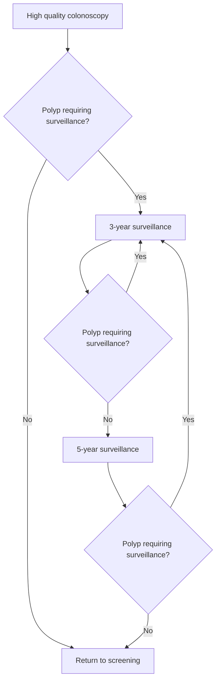

# Post-polypectomy colonoscopy surveillance: European Society of Gastrointestinal Endoscopy (ESGE) Guideline – Update 2020

## Authors

Cesare Hassan1, Giulio Antonelli1, Jean-Marc Dumonceau2, Jaroslaw Regula3, Michael Bretthauer4, Stanislas Chaussade5, Evelien Dekker6, Monika Ferlitsch7, Antonio Gimeno-Garcia8, Rodrigo Jover9, Mette Kalager4, Maria Pellisé10, Christian Pox11, Luigi Ricciardiello12, Matthew Rutter13, Lise Mørkved Helsingen4, Arne Bleijenberg6, Carlo Senore14, Jeanin E. van Hooft6, Mario Dinis-Ribeiro15, Enrique Quintero8

## Institutions

1. Gastroenterology Unit, Nuovo Regina Margherita Hospital, Rome, Italy
2. Gastroenterology Service, Hôpital Civil Marie Curie, Charleroi, Belgium
3. Centre of Postgraduate Medical Education and Maria Sklodowska-Curie Memorial Cancer Centre, Institute of Oncology, Warsaw, Poland
4. Clinical Effectiveness Research Group, Oslo University Hospital and University of Oslo, Norway
5. Gastroenterology and Endoscopy Unit, Faculté de Médecine, Hôpital Cochin, Assistance Publique-Hôpitaux de Paris (AP-HP), Université Paris Descartes, France
6. Department of Gastroenterology and Hepatology, Amsterdam University Medical Centers, University of Amsterdam, The Netherlands
7. Department of Internal Medicine III, Division of Gastroenterology and Hepatology, Medical University Vienna, and Quality Assurance Working Group, Austrian Society for Gastroenterology and Hepatology, Vienna, Austria
8. Gastroenterology Department, Hospital Universitario de Canarias, Instituto Universitario de Tecnologías Biomédicas (ITB) & Centro de Investigación Biomédica de Canarias (CIBICAN), Universidad de La Laguna, Tenerife, Spain
9. Service of Digestive Medicine, Alicante Institute for Health and Biomedical Research (ISABIAL Foundation), Alicante, Spain
10. Gastroenterology Department, Endoscopy Unit, ICMDiM, Hospital Clinic, CIBEREHD, IDIBAPS, University of Barcelona, Catalonia, Spain
11. Department of Medicine, St. Joseph Stift, Bremen, Germany
12. Department of Medical and Surgical Sciences, S. Orsola-Malpighi Hospital, Bologna, Italy
13. Gastroenterology, University Hospital of North Tees, Stockton-on-Tees, UK and Northern Institute for Cancer Research, Newcastle University, Newcastle upon Tyne, UK
14. Epidemiology and screening Unit – CPO, Città della Salute e della Scienza University Hospital, Turin, Italy
15. CIDES/CINTESIS, Faculty of Medicine, University of Porto, Porto, Portugal

## Bibliography

DOI https://doi.org/10.1055/a-1185-3109
Published online: 22.6.2020 | Endoscopy 2020; 52: 1–14
© Georg Thieme Verlag KG Stuttgart · New York
ISSN 0013-726X

## Corresponding author

C. Hassan, MD, Nuovo Regina Margherita Hospital, Via E. Morosini 53, 00159, Rome, Italy
Fax: +39-06-58446608
cesareh@hotmail.com

Appendix 1s – 3s
Online content viewable at:
https://doi.org/10.1055/a-1185-3109

## MAIN RECOMMENDATIONS

The following recommendations for post-polypectomy colonoscopic surveillance apply to all patients who had one or more polyps that were completely removed during a high quality baseline colonoscopy.

**1** ESGE recommends that patients with complete removal of 1–4 <10 mm adenomas with low grade dysplasia, irrespective of villous components, or any serrated polyp <10 mm without dysplasia, do not require endoscopic surveillance and should be returned to screening.
Strong recommendation, moderate quality evidence.

If organized screening is not available, repetition of colonoscopy 10 years after the index procedure is recommended.
Strong recommendation, moderate quality evidence.

## SOURCE AND SCOPE

This Guideline is an official statement of the European Society of Gastrointestinal Endoscopy (ESGE). It is an update of the previously published 2013 Guideline addressing the role of post-polypectomy colonoscopy surveillance.

## MAIN RECOMMENDATIONS

The following recommendations for post-polypectomy colonoscopic surveillance apply to all patients who had one or more polyps that were completely removed during a high quality baseline colonoscopy.

**2** ESGE recommends surveillance colonoscopy after 3 years for patients with complete removal of at least 1 adenoma ≥ 10mm or with high grade dysplasia, or ≥ 5 adenomas, or any serrated polyp ≥ 10mm or with dysplasia.
Strong recommendation, moderate quality evidence.

**3** ESGE recommends a 3 – 6-month early repeat colonoscopy following piecemeal endoscopic resection of polyps ≥ 20mm.
Strong recommendation, moderate quality evidence.

A first surveillance colonoscopy 12 months after the repeat colonoscopy is recommended to detect late recurrence.
Strong recommendation, high quality evidence.

**4** If no polyps requiring surveillance are detected at the first surveillance colonoscopy, ESGE suggests to perform a second surveillance colonoscopy after 5 years.
Weak recommendation, low quality evidence.

After that, if no polyps requiring surveillance are detected, patients can be returned to screening.

**5** ESGE suggests that, if polyps requiring surveillance are detected at first or subsequent surveillance examinations, surveillance colonoscopy may be performed at 3 years.
Weak recommendation, low quality evidence.

A flowchart showing the recommended surveillance intervals is provided (Fig. 1).

**Fig. 1** Colonoscopy surveillance intervals following polypectomy.

## ABBREVIATIONS

| Abbreviation | Definition |
|---|---|
| **ADR** | adenoma detection rate |
| **ARR** | adjusted rate ratio |
| **CI** | confidence interval |
| **CRC** | colorectal cancer |
| **EMR** | endoscopic mucosal resection |
| **ESGE** | European Society of Gastrointestinal Endoscopy |
| **FIT** | fecal immunochemical test |
| **FOBT** | fecal occult blood test |
| **GRADE** | Grading of Recommendations Assessment, Development and Evaluation |
| **Hb** | hemoglobin |
| **HGD** | high grade dysplasia |
| **HR** | hazard ratio |
| **LST** | laterally spreading tumor |
| **OR** | odds ratio |
| **PICO** | population, intervention, comparison/control, outcome |
| **RCT** | randomized controlled trial |
| **RR** | risk ratio |
| **SD** | standard deviation |
| **SERT** | Sydney EMR Recurrence Tool |
| **SIR** | standardized incidence ratio |
| **SSL** | sessile serrated lesion |

## Introduction

This Guideline represents an update of the Guideline on postpolypectomy endoscopic surveillance published by the European Society of Gastrointestinal Endoscopy (ESGE) in 2013 [1].

Previous recommendations were primarily based on estimates of the risk of metachronous advanced neoplasia (advanced adenoma or colorectal cancer [CRC]) according to the endoscopic and histological features at the baseline colonoscopy that represented most of the available evidence.

According to the Grading of Recommendations Assessment, Development and Evaluation (GRADE) methodology adopted for ESGE guidelines [2, 3], a hierarchy across outcomes must be created, and the main recommendations should be based on

the estimates of benefit and risk (burden) of the most clinically relevant outcomes. In this regard, risk of CRC incidence and mortality was ranked as a more relevant outcome than the risk of metachronous advanced neoplasia for estimating the benefit of post-polypectomy surveillance. Of note, this applies both to the stratification of baseline risk at index colonoscopy and to the assessment of the efficacy of endoscopic surveillance.

Recently, a series of cohort studies assessed the post-polypectomy risk of CRC incidence/mortality with and without endoscopic surveillance. The overall long-term CRC risk following polypectomy appeared to be similar or slightly higher than for the general population or for patients without adenomas. In detail, a 2% absolute long-term CRC risk for post-polypectomy patients without surveillance has been shown, ranging between 1.1% and 2.9% according to the baseline risk stratification [4]. These estimates were confirmed in a surveillance setting, with a 10-year CRC incidence risk between 0.44% and 1.24%, and mortality risk between 0.03% and 0.25% [5]. In addition, the efficacy of surveillance for patients at high risk of CRC appeared to be less than 1% [4], while it was ineffective in patients at lower risk (**Table 1s**; see **Appendix 1s**, online-only Supplementary Material). Of note, these estimates are much lower than the 3% long-term CRC risk required in one guideline for recommending CRC screening [6]. Overall, this new evidence supports a very conservative and selective approach to post-polypectomy surveillance.

As compared with the 2013 ESGE Guideline, the roles of some endoscopic or histological risk factors have been questioned. In particular, the risks of multiplicity or of villous histology regarding CRC in the long-term seem to be low or negligible, hence the relevance of these factors in stratification of the baseline risk is now questioned [4, 7, 8]. Furthermore, additional evidence based on long-term risk of CRC incidence and mortality has become available with regard to serrated polyps, strengthening the previous recommendations [9–11].

The efficacy of endoscopic surveillance must be weighed against safety and burden. Diagnostic colonoscopy is considered to entail a very low risk of adverse events with estimates of 0.05%, 0.25%, and 0.003% for perforation, bleeding, and death, respectively [12]. However, these risks may increase in patients with co-morbidities or older age [13] (**Table 2s**). In addition, unfavorable psychological effects of surveillance have also been shown, at least in patients with high risk adenomas [14]. Colonoscopy capacity is limited and is mainly expended in population-based organized CRC screening programs, as either work-up of a positive fecal-based stool test or primary screening intervention. The very high prevalence of adenomas in the era of quality assurance and high definition colonoscopy – up to over 70% of the screening population [15] – mandates a conservative surveillance policy in order to avoid waste of resources [14, 16–18] (**Table 3s**).

The primary aim of this ESGE update is to incorporate new evidence into the clinical recommendations to be adopted in routine and specific scenarios.

## Methods

ESGE commissioned the update of this Guideline and appointed a guideline leader (C.H.), who invited the listed authors to participate in the project development. The key questions were prepared by the coordinating team (E.Q., J.M.D., J.R.) using PICO methodology (population, intervention, comparison/control, outcome) [19] and were then approved by the other members. The coordinating team formed task force subgroups, based on the statements of the 2013 guideline, each with its own leader, and divided the key topics among these task forces (**Appendix 2s**) with a specific focus on the update of literature and revision of the statements.

Recent ESGE Guidelines have addressed endoscopic surveillance after endoscopic or surgical resection of invasive carcinoma/malignant polyp [20] and of patients with hereditary syndromes or with polyposis syndromes [21, 22], and these topics are not addressed in the present Guideline.

The work included telephone conferences, a face to face meeting and online discussions.

The task forces conducted a literature search using Medline (via Pubmed) and the Cochrane Central Register of Controlled Trials up to October 2019. New evidence on each key question was summarized in tables using the GRADE system [3] (**Appendix 3s**). Grading depends on the balance between the benefits and risk or burden of any health intervention [23]. Further details on guideline development have been reported elsewhere [2].

The results of the search were presented to all the members of the task forces during a meeting in Barcelona on October 19th, 2019. After this meeting drafts were made by the leaders of each task force and distributed between the task force members for revision and online discussion. Statements were created by consensus.

In December 2019, a draft prepared by C.H., G.A. and the leaders of all the task forces was sent to all group members. After agreement of all members, the manuscript was reviewed by two external reviewers and was sent for further comments to the ESGE national societies and individual members. After this, the manuscript was submitted to the journal *Endoscopy* for publication. The final revised manuscript was agreed upon by all the authors.

This Guideline was issued in 2020 and will be considered for update in 2025. Any interim updates will be noted on the ESGE website: http://www.esge.com/esge-guidelines.html.

## Evidence and Statements

For this update, we decided to use the term "polyp" instead of "lesion" or "neoplasia" as the latter two terms can have overly negative connotations for both medical and nonmedical audiences. For similar reasons, we abandoned the terms "high risk" and "low risk" when referring to patients or polyps, replacing them with "need" or "no need" of surveillance.

## Quality of the baseline colonoscopy

> **RECOMMENDATION**
>
> **2020 statement**
> The following recommendations for post-polypectomy colonoscopic surveillance apply to all patients who had one or more polyps that were completely removed during a high quality baseline colonoscopy.
> Strong recommendation, moderate quality evidence.
>
> *2013 statement*
> *The following recommendations for post-polypectomy endoscopic surveillance should only be applied after a high quality baseline colonoscopy with complete removal of all detected neoplastic lesions.*

Since 2013, new evidence has strengthened the idea that overutilization of endoscopic surveillance cannot compensate for an initially suboptimal colonoscopy. In a cohort of 11 944 patients with a mean follow-up of nearly 8 years, a suboptimal examination has been shown to confer a higher risk of CRC incidence and mortality after polypectomy (incomplete colonoscopy, hazard ratio [HR] 1.8, 95% confidence interval [95%CI] 1.34–2.41; poor bowel preparation, HR 2.09, 95%CI 1.19–3.67), irrespective of the baseline risk and the performance of surveillance intervention [4].

Specific ESGE and World Endoscopy Organization (WEO) guidelines have already addressed the general principles of quality of colonoscopy, endoscopic resection, and bowel cleansing [24–26].

In the case of doubt about the completeness of endoscopic resection, such as positive or indefinite resection margins at pathology, an early repeat colonoscopy is recommended [24, 27] (see also **Piecemeal resection**). This is especially relevant when it is borne in mind that large polyp size, namely ≥ 20mm, has been strictly associated with increased long-term post-polypectomy CRC incidence/mortality risk (see below) [4, 8].

Regarding the completeness of mucosal evaluation, an increased risk of metachronous advanced neoplasia has been reported in patients with ≥ 5 adenomas with one ≥ 10mm [28]. However, cohort studies based on the risk of CRC, rather than that of metachronous advanced neoplasia, have in general downgraded the role of both multiplicity and polyp size < 20mm [7, 8, 29]. Thus, it seems reasonable to recommend an early repeat colonoscopy only in those few cases where the number or complexity of multiple endoscopic resections have affected, according to endoscopist judgment, the quality of the baseline colonoscopy.

### Inadequate bowel preparation

Strong recommendations for a 1-year repeat colonoscopy in the case of inadequate bowel preparation were issued by ESGE [24] recently and by other associations [30], strengthened by new evidence showing how a suboptimal baseline exam independently increases CRC incidence and mortality [4]. Of note, this recommendation is not followed in 90% of cases according to a colonoscopy registry of 9170 average risk patients with normal findings at screening colonoscopy [31].

The adenoma miss rate, but not the advanced adenoma miss rate, is independently associated with bowel preparation quality [32] and therefore standard guideline recommendations for surveillance intervals apply only to patients with adequate bowel preparation. There is no agreement on the definition of adequate bowel preparation [25]. ESGE defines adequate bowel preparation as: Boston Bowel Preparation Scale ≥ 6, Ottawa Scale ≤ 7, or Aronchick Scale excellent, good, or fair [26], while some authors have proposed that bowel preparation should be considered inadequate if the Boston Bowel Preparation Scale score is 0 or 1 in any colon segment [33]. One of these two definitions should be adopted by endoscopists as a necessary step to improve adherence to guideline recommendations.

## Polyp size evaluation

> **RECOMMENDATION**
>
> **2020 statement**
> When planning post-polypectomy surveillance, ESGE suggests to use a standardized measurement of polyp size evaluated at either endoscopy or pathology.
> Weak recommendation, low quality evidence.
>
> *2013 statement*
> *No statement.*

This is a new statement as compared with the 2013 Guideline. Surveillance interval recommendations depend strongly on polyp size, but measurement bias is present with evaluation both at endoscopy [34] and pathology [35]. It is known that at endoscopy size estimation is usually biased towards specific numbers (i.e., 5 or 10) while neglecting the others [34–36], and interobserver variability in visual polyp sizing can be present [37, 38], resulting in routine underestimation or overestimation of polyp size [39, 40]. However, such bias can be reduced by using a reference standard, such as an open biopsy forceps or snare [41–43].

Endoscopic assessment of size is also useful in the case of piecemeal resection, as well as in cold-snaring, as the specimen sent for histology is much larger than the actual neoplastic component [27]. Size estimation at pathology also represents a feasible standard for en bloc resections, and it may be used for that purpose [35]. Technological improvements that permit real-time precise measurements during endoscopy should be expected in the near future [41, 43].

## Appropriate scheduling of colonoscopy surveillance

> **RECOMMENDATION**
>
> **2020 statement**
>
> ESGE recommends provision of a written recommendation for the timing of post-polypectomy surveillance colonoscopy, considering all endoscopic, histological, and patient-related factors.
> Strong recommendation, low quality evidence.
>
> This may be further reinforced by enhanced instructions.
> Weak recommendation, low quality evidence.
>
> *2013 statement*
>
> *ESGE recommends that the endoscopist is responsible for providing a written recommendation for the post-polypectomy surveillance schedule (strong recommendation, low quality evidence), and that this should be audited (weak recommendation, low quality evidence).*

New evidence since 2013 shows the persistence of a high level of inappropriate post-polypectomy surveillance with a negative impact on colonoscopy efficiency. A systematic review published in 2019 and including 16 studies [44], showed correct adherence to current recommendations in only 48.8% (95%CI 37.3%–60.4%) of cases. The surveillance interval was longer or shorter than currently recommended in 42.6% (95%CI 32.9%–52.7%) and 7.9% (95%CI 0%–26.4%) of cases, respectively. These data are similar to data reported in 2013, when inappropriate surveillance accounted for 40% to 69% of the total.

The correct indication and timing for post-polypectomy surveillance is crucial as surveillance colonoscopies account for up to 40% of all colonoscopies performed [45]; consequently, the capacity of colonoscopy services is severely overburdened by the high demand associated with the implementation of CRC screening programs. It is estimated that one-third of all the surveillance-related endoscopic workload in an organized CRC screening program is wasted because of inappropriate surveillance examinations [46].

The appropriate surveillance interval depends on a combination of polyp characteristics (histology, number, and size), quality of colonoscopy, and clinical factors (patient age and co-morbidities). In one study, specialists in gastroenterology/endoscopy appeared more likely to recommend appropriate surveillance intervals compared to other specialists [47]. Furthermore, a recent study has shown that endoscopists with an adenoma detection rate (ADR) > 20% are more likely to recommend correct surveillance [48].

For these reasons, the endoscopy unit should advise the patient on the appropriate surveillance interval with both written and oral instructions. Since histology reports become available only after the polypectomy, we recommend that the endoscopist update and/or finalize the colonoscopy report after receiving the histology report. The updated colonoscopy report should include a written recommendation on the appropriate surveillance interval, considering all endoscopic, histological, and patient-related factors. Any deviation from standard recommendations should be adequately explained in the report. Adherence to published surveillance guidelines should be monitored as part of a quality assurance program [26, 49, 50].

A 2015 cross-sectional study [51] has shown that higher perceived benefits and cancer worry are the major drivers for patients to seek surveillance colonoscopy after adenoma removal. Underuse of surveillance in groups at increased risk needs to be addressed as it may result in post-colonoscopy CRC. This is especially true for those with a clinically relevant risk of incomplete endoscopic resection. In this update, we suggest the use of enhanced instructions – which should be especially feasible in the setting of organized CRC screening programs – such as telephone calls and frequent email/postal reminders. These have been shown to improve adherence to surveillance colonoscopy, along with educational programs and facilitation of transportation [51–53].

## Patients not requiring surveillance after polypectomy

> **RECOMMENDATION**
>
> **2020 statement**
>
> ESGE recommends that patients with complete removal of 1–4 <10mm adenomas with low grade dysplasia, irrespective of villous components, or any serrated polyp <10mm without dysplasia, do not require endoscopic surveillance and should be returned to screening.
> Strong recommendation, moderate quality evidence.
>
> If organized screening is not available, repetition of colonoscopy 10 years after the index examination is recommended.
> Strong recommendation, moderate quality evidence.
>
> *2013 statement*
>
> *In the low risk group (patients with 1–2 tubular adenomas <10mm with low grade dysplasia), the ESGE recommends participation in existing national screening programmes 10 years after the index colonoscopy. If no screening programme is available, repetition of colonoscopy 10 years after the index colonoscopy is recommended (strong recommendation, moderate quality evidence).*

### Conventional adenomas in patients not requiring surveillance

Many studies from 2013 onwards [5, 7–9, 54–62] have confirmed and strengthened the indication of "no surveillance/return to screening" for patients with nonadvanced adenoma, showing how this group of patients have a long-term risk of CRC incidence and mortality lower than, or similar to, that of patients without any adenoma at baseline or that of the general population. For example, one study including 64 422 patients

with 14 years of mean follow-up [5] showed that patients with nonadvanced adenoma at baseline have a 10-year cumulative CRC incidence and mortality of 0.44% (95% CI 0.31%–0.62%) and 0.03% (95% CI 0.01%–0.11%), respectively, similarly to patients without adenoma at baseline. In patients with nonadvanced adenoma, the benefit of surveillance has been excluded by recent studies [4, 8, 55] that showed how long-term CRC incidence without surveillance was similar to or even lower than that expected in the general population. Further details are available in **Table 4s**.

## Number of adenomas

While confirming no surveillance for patients with 1–2 <10mm adenomas with low grade dysplasia, we decided to expand this to those with 3 or 4 polyps, based on new evidence. For example, three new large studies [4, 7, 8] have addressed the role of multiplicity on post-polypectomy CRC risk. A retrospective series [7] of 15 935 post-polypectomy patients showed that patients with ≥3 nonadvanced adenomas had no increased risk of CRC incidence or mortality compared with those without adenomas (adjusted rate ratio [ARR] for incidence 1.3, 95% CI 0.9–1.9; ARR for mortality 1.2, 95% CI 0.5–2.7) after 13 years of follow-up. A second multicenter, retrospective study [4] of 11 944 patients with 7.9 years of median follow-up also showed that the number of nonadvanced adenomas was not independently associated with a higher risk of CRC incidence or mortality, and that these patients remain at lower risk compared to the general population (standardized incidence ratio [SIR] 0.5, 95% CI 0.3–0.8). Finally, a recent multicenter, screening-based, retrospective series [8] of 236 089 patients with 7.7 years of follow-up, confirmed that the number of adenomas or an adenoma size <20mm does not result in an increased risk of CRC incidence or mortality, showing that patients with any nonadvanced adenomas <20mm are at lower risk compared to the general population (SIR 0.35, 95% CI 0.28–0.44). In addition, when metachronous advanced neoplasia was used as a surrogate end point, 3–4 adenomas did not increase the risk of metachronous advanced neoplasia [27].

## Histological factors

Patients whose polyps show villous histology have been moved into a nonsurveillance group. This is supported by recent evidence showing that villous histology does not independently confer a long-term increased risk of CRC incidence or mortality (HR 1.16, 95% CI 0.71–1.91) [4, 8]. A meta-analysis and a pooled analysis had also previously reported that patients with polyps with villous histology [63, 64] had a risk of advanced neoplasia similar to that of controls.

It is also worth noting that the presence of villous histology in polyps <10mm and without high grade dysplasia is not common [9]. Furthermore, it is known that interpretation of villous histology has high interobserver variability among pathologists [65].

## Serrated polyps in patients not requiring surveillance

Following publication of the 2013 ESGE Guideline, the risk of metachronous advanced neoplasia and CRC following resection of serrated polyps of size <10mm without dysplasia has been addressed by several studies [9, 11, 66–69]. Overall, no difference in advanced neoplasia and CRC incidence or mortality was seen after resection of serrated polyps <10mm without dysplasia or after resection of conventional adenomas which do not require surveillance. In particular, a recent retrospective study [9], including 122 899 patients, demonstrated that patients with serrated polyps <10mm had a similar hazard ratio (HR) of metachronous CRC after 10 years of follow-up when compared to patients without adenomas (HR 1.25, 95%CI 0.76–2.08); the corresponding HR for patients with proximal serrated polyp was 1.11 (95%CI 0.42–2.99) and for nonadvanced adenomas it was 1.21 (95%CI 0.68–2.16). Further details are available in **Table 5s**. On the other hand, no study assessed the possible benefit of surveillance in this group of patients, further excluding its efficacy at this stage.

## Patients requiring surveillance following polypectomy

### Conventional adenomas in patients requiring surveillance

> **RECOMMENDATION**
>
> **2020 statement**
>
> ESGE recommends surveillance colonoscopy after 3 years for patients with complete removal of at least 1 adenoma ≥10mm or with high grade dysplasia, or ≥5 adenomas, or any serrated polyp ≥10mm or with dysplasia.
> Strong recommendation, moderate quality evidence.
>
> *2013 statement*
>
> *In the high risk group (patients with adenomas with villous histology or high grade dysplasia or ≥10mm in size, or ≥3 adenomas), ESGE recommends surveillance colonoscopy 3 years after the index colonoscopy (strong recommendation, moderate quality evidence). Patients with 10 or more adenomas should be referred for genetic counselling (strong recommendation, moderate quality evidence).*

As compared with the 2013 Guideline, we have confirmed the benefit of endoscopic surveillance in patients with an adenoma ≥10mm or with high grade dysplasia (HGD), while for patients with multiplicity we limited it to those with ≥5 adenomas. Many studies published after 2013, have strengthened this recommendation, as summarized in **Table 4s**.

Regarding patient baseline risk, a recent series [7], enrolling 15 935 patients including 2882 advanced adenomas, with 13 years of median follow-up, reported an increased risk of CRC (ARR 3.0, 95% CI 2.1–4.3; P<0.001) and mortality (ARR 2.6, 95% CI 1.2–5.7; P<0.001) for those with advanced adenoma compared to those with no adenomas at baseline. A study including patients with adenomas from the Polish National Screening program [8] showed that only individuals with adenomas ≥20mm and/or HGD carried an increased risk of CRC incidence and mortality. Patients with a baseline adenoma

≥ 20 mm had a higher risk of incident CRC (age-adjusted HR 9.25, 95%CI 6.39–13.39; P < 0.001) and CRC death (age-adjusted HR 7.45, 95%CI 3.62–15.33; P < 0.001) compared to individuals with no adenomas. HGD alone was also associated with a higher risk of incident CRC (age-adjusted HR 3.58, 95%CI 1.96–6.54; P < 0.001) compared to individuals with no adenomas. As mentioned above, since only one retrospective study [8] specifically supported the shifting of the size cutoff from 10mm to 20mm, we preferred not to advocate this shift systematically, underlining the importance of future research addressing baseline patient risk and efficacy of surveillance for polyps between 10 and 20 mm. However, in the context of a health system with limited capacity, we suggest considering surveillance only for adenomas ≥ 20 mm in size or with HGD. Of course, patients with high risk conditions, such as those with serrated polyposis syndrome or hereditary syndromes should receive an individualized surveillance schedule.

Regarding the efficacy of the first surveillance colonoscopy, one study [4] showed how individuals with baseline high risk polyps significantly benefit from a first surveillance colonoscopy (HR of CRC compared to no surveillance 0.59, 95%CI 0.36–0.98), and this finding was confirmed by another recent study (HR of CRC compared to no surveillance 0.49, 95%CI 0.29–0.82) [70].

In line with the previous Guideline, we recommend performance of the first surveillance colonoscopy 3 years after baseline polypectomy. Atkin and colleagues compared the interval between index colonoscopy with polypectomy and the first surveillance colonoscopy, showing how the odds of detecting CRC at 2, 3 or 5 years were not statistically significant when compared to an interval of less than 18 months [4]. There is no current evidence addressing the surveillance interval and long-term CRC incidence and mortality. It should be noted that a large ongoing prospective randomized controlled trial (RCT) (European Polyp Surveillance [EPoS]; ClinicalTrials.gov NCT02319928) is addressing the possibility of extending the surveillance interval for high risk adenomas to 5 years [71].

### Serrated polyps in patients requiring surveillance

Traditional serrated adenoma, serrated polyp ≥ 10mm and serrated polyp with dysplasia yield similar metachronous advanced neoplasia or CRC risks compared to conventional adenomas, and thus require surveillance [9–11, 67, 72, 73]. Therefore, ESGE recommends surveillance colonoscopy at 3 years for these categories of polyps. In detail, one population-based randomized study on 12 955 patients screened with flexible sigmoidoscopy [10] showed that after resection of a serrated polyp ≥ 10 mm the adjusted HR for metachronous CRC was 4.2 (95%CI 1.3–13.3) compared to the general population. Another recent retrospective study [9] evaluating 122 899 patients with 10 years of follow-up showed an increased HR for metachronous CRC (3.35, 95%CI 1.37–8.15) compared to negative colonoscopy. See **Table 5s**.

There is evidence that advanced adenoma with synchronous serrated polyp of any kind results in higher metachronous advanced neoplasia risk compared to advanced adenoma without synchronous serrated polyp [68, 73]. However, such patients would already be classified as in need of surveillance, regardless of the presence of serrated polyps.

Any added value of combining adenomas with serrated polyp count to fulfill multiplicity criteria is therefore not supported by convincing evidence and requires further investigation.

Because of the high interobserver variation in serrated polyp classification [74–77], the risk of inaccurate histologic subclassification of serrated polyp is substantial and undesirable. In addition, a recent study demonstrated that the effect of taking into account serrated polyp subtype in surveillance guidelines is only marginal, and resulted in different surveillance intervals in only 2% of screened patients compared to a surveillance guideline not taking into account the serrated polyp subtype [78]. Therefore, to prevent undertreatment due to misclassification of serrated polyps, we recommend not to consider the serrated polyp subtype when choosing colonoscopy surveillance intervals.

### Patients at risk of hereditary syndromes

> **RECOMMENDATION**
>
> **2020 statement**
> ESGE recommends that patients with 10 or more adenomas should be referred for genetic counselling.
> Strong recommendation, moderate quality evidence.
>
> *2013 statement*
> *Incorporated unchanged into 2020 statement above.*

Patients with adenomatous polyposis syndromes, such as familial adenomatous polyposis (FAP), *MUTYH*-associated polyposis (MAP), or rarer syndromes (including *NHTL1*-associated polyposis, and *PPAP*-associated polyposis), have an exceedingly high risk of developing colorectal cancer. The prevalence of pathogenic *APC* and biallelic *MUTYH* mutations, respectively, has been reported as 80% and 2% among individuals harboring ≥ 1000 adenomas, as 56% and 7% among those with 100 to 999 adenomas, as 10% and 7% among those with 20 to 99 adenomas, and as 5% and 4% among those with 10 to 19 adenomas [79]. Furthermore, data from the Cleveland Clinic demonstrate that 4% of Lynch syndrome patients have a lifetime cumulative number of adenomas of ≥ 10, prompting the consideration of Lynch syndrome in the differential diagnosis [80].

Thus, in line with the clinical practice guidelines of the European Society for Medical Oncology (ESMO), the National Comprehensive Cancer Network (NCCN), and ESGE [22, 81–83], we recommend the referral of patients with 10 or more adenomas to specific genetic counselling and assessment for a cancer-predisposing syndrome. Furthermore, patients with ≥ 20 lifetime cumulative adenomas should be tested for *APC* and *MUTYH* [82].

Tailored surveillance programs for patients with hereditary colorectal cancer syndromes are outside the scope of this present guideline and are addressed in the recent ESGE Guidelines on that topic [21, 22].

## Timing of second surveillance colonoscopy

> **RECOMMENDATION**
>
> **2020 statement**
> If no polyps requiring surveillance are detected at the first surveillance colonoscopy, ESGE suggests to perform a second surveillance colonoscopy after 5 years.
> Weak recommendation, low quality evidence.
>
> After that, if no polyps requiring surveillance are detected, patients can be returned to screening.
>
> ESGE suggests that if polyps requiring surveillance are detected at first or subsequent surveillance examinations, surveillance colonoscopy may be performed at 3 years
> Weak recommendation, low quality evidence.
>
> *2013 statement*
> *In the high risk group, if no high risk adenomas are detected at the first surveillance examination, the ESGE suggests a 5-year interval before a second surveillance colonoscopy (weak recommendation, low quality evidence). If high risk adenomas are detected at first or subsequent surveillance examinations, a 3-year repetition of surveillance colonoscopy is recommended (strong recommendation, low quality evidence). The ESGE found insufficient evidence to give recommendations in the case where no high risk adenomas are detected during 2 consecutive surveillance colonoscopies. However, intervals longer than 5 years appear reasonable (very low quality evidence).*

Since 2013 new evidence [4, 7, 9, 70] has shown that patients with advanced adenoma at baseline remain at long-term higher risk of CRC incidence and mortality, irrespective of surveillance. In one study [70], the overall incidence of CRC in the high risk group after 10 years of follow-up was nearly double that of in the general population (SIR 1.91, 95%CI 1.39–2.56). Based on such increased CRC risk, we decided to suggest a second surveillance colonoscopy 5 years after the first. However, we also admit that evidence on the benefit of such a second surveillance colonoscopy on CRC risk is unclear. Two studies [4, 70] have shown no additional benefit of a second surveillance colonoscopy, although in the high risk group a trend toward a lower hazard ratio for CRC incidence was present (HR after first visit, 0.59 [95%CI 0.36–0.98], vs. HR after second visit 0.40 [0.21–0.77]) [4]. Thus, if resources are limited, second surveillance can be avoided, with patients directly returned to screening. On this evidence we also excluded a need for additional surveillance after the second surveillance colonoscopy, unless clinically relevant polyps are detected.

Previous studies with advanced adenoma as surrogate end points have shown that the findings at second surveillance colonoscopy are related to findings from the first surveillance colonoscopy rather than baseline features [84, 85]. A recent abstract [86] reporting a retrospective cohort study on 17 564 post-polypectomy patients in the UK screening program who underwent two surveillance colonoscopies showed that the second surveillance colonoscopy yielded similar rates of CRC irrespective of the findings at baseline or first colonoscopy.

There was no evidence for a statistically significant association between the risk of advanced adenoma at second surveillance colonoscopy and completeness of the colonoscopy at first surveillance; however, there was a significant association between the risk of CRC at second surveillance colonoscopy and the colonoscopy at first surveillance being reported as incomplete (OR 5.72, 95%CI 1.27–25.87) [4, 14].

Two studies examined the interval between first and second surveillance [4, 14, 87]. The first study showed an increased risk of advanced neoplasia per year increase (OR 1.11, 95%CI 1–1.24). In multivariable models for advanced neoplasia, using an interval of less than 18 months as the referent standard, a 2-year interval was not statistically significant, but intervals of 3 years (OR 2.02, 95%CI 1.19–3.42), 4 years (OR 2.45, [95%CI 1.20–5.00]), and >6.5 years (OR 5.95, [95%CI 2.15–16.46]) were significant (an interval of 5 or 6 years was not significant). The second cohort did not show an association between risk for advanced adenoma and interval between first and second surveillance when the interval was ≥3 years, compared with <3 years [87]. There was no evidence for the most appropriate interval between first and second surveillance as related to long-term CRC incidence or CRC mortality.

Details on mentioned studies are available in **Table 6s**.

## Piecemeal resection

> **RECOMMENDATION**
>
> **2020 statement**
> ESGE recommends a 3–6-month early repeat colonoscopy following piecemeal endoscopic resection of polyps ≥20mm.
> Strong recommendation, moderate quality evidence.
>
> A first surveillance colonoscopy 12 months after the repeat colonoscopy is recommended to detect late recurrence.
> Strong recommendation, high quality evidence.
>
> ESGE recommends evaluation of the post-piecemeal polypectomy site using advanced imaging techniques to detect neoplastic recurrence.
> Strong recommendation, moderate quality evidence.
>
> ESGE suggests that routine biopsy of the post-polypectomy scar can be abandoned provided that a standardized imaging protocol with virtual chromoendoscopy is used by a sufficiently trained endoscopist.
> Weak recommendation, moderate quality evidence.
>
> *2013 statement*
> *In the case of piecemeal resection of adenomas larger than 10mm, endoscopic follow-up within 6 months is recommended before the patient is entered into a surveillance programme (strong recommendation, moderate quality evidence).*

Following our 2013 Guideline, several valuable studies have been published that evaluate adenoma recurrence rate following piecemeal endoscopic mucosal resection (EMR) in different subgroups. Details of these studies are available in **Table 7s**. Overall, a considerable rate (12%–24%) of recurrence/residual adenomatous tissue after a successful endoscopic resection provides the rationale to recommend an early follow-up colonoscopy after piecemeal resection of nonpedunculated polyps, before the patient is entered into a surveillance program. As stated in the first recommendation above, after piecemeal resection and in the case of doubt about the completeness of endoscopic resection, an early repetition of colonoscopy is recommended [24, 27]. A meta-analysis has shown that 75% of recurrences were found at 3 months, increasing to more than 90% at 6 months [88].

In contrast to the 2013 guideline, we have now pushed the threshold for recommending early follow-up colonoscopy to 20mm lesions. Most of the data with follow-up after piecemeal resection include only lesions 20mm or larger. The 2013 recommendation was based on a prospective trial evaluating completeness of polypectomy that showed inadequate resection in up to 17% of lesions ≥10mm [89], especially if piecemeal polypectomy had been performed. However, there is no evidence on the possible consequences in terms of cancer incidence or mortality during follow-up of those patients. There are no data focused on recurrence/residual adenomatous tissue after piecemeal resection of 10–20mm nonpedunculated polyps.

Nevertheless, cohort studies based on CRC risk, rather than metachronous advanced neoplasia risk, have in general downgraded the role of both multiplicity and polyp size < 20mm. Thus, apart from the larger than 20mm adenomas, it seems reasonable to recommend an early repeat colonoscopy only in those few cases where the number or complexity of multiple endoscopic resections have affected, according to endoscopist judgment, the quality of the index colonoscopy.

### Intervals to recurrence, and predictors

Despite the absence of recurrence/residual neoplasia during early follow-up colonoscopy, late recurrence at the resection site has been described in up to 5%–9% of cases. In a meta-analysis of 15 studies that differentiated between early and late recurrences, 12% of neoplastic recurrences occurred late [88]. A large Australian prospective multicenter study [90] based on wide-field EMR for laterally spreading tumors (LSTs) larger than 20mm (mean lesion size 36.4mm, SD 17mm) that included 799 successful EMRs (82% piecemeal, 18% en bloc) with follow-up, has shown a 16% (95%CI 13.6%–18.7%) recurrence/residual adenoma rate at 4–6 months. Of note, 17/426 (4%, 95%CI 2.4%–6.2%) with no adenoma at first follow-up colonoscopy presented with late recurrence after 16 months.

Another analysis from the same cohort of patients, included 1018 adenomas and 190 sessile serrated lesions (SSLs) ≥20mm removed by EMR and with follow-up [91]. It showed cumulative recurrence rates for adenomas after 6, 12, 18, and 24 months of 16.1%, 20.4%, 23.4%, and 28.4%, respectively; the corresponding rates for SSLs were significantly lower, being 6.3% at 6 months and 7.0% from 12 months onwards (P < 0.001). Recurrences were identified at the first surveillance colonoscopy in 90% of cases [91].

A post hoc analysis of the above cohort, including 1178 patients [92] has proven the possibility of predicting recurrence after piecemeal EMR shortly after index examination. In this study the authors proposed and validated the so-called Sydney EMR Recurrence Tool (SERT), consisting of the following factors: size of 40mm or more (2 points), intraprocedural bleeding (1 point), and HGD (1 point). The endoscopically detected recurrence rate was 19.4% overall. However, for SERT 0, early recurrence was only 8.7% at 4–6 months and such recurrent neoplastic lesions were very small and easy to remove; in contrast, for SERT scores 2–4 the neoplastic recurrence rate was 25.9%.

A study from Japan [93] has shown that a higher number of pieces during piecemeal resection was associated with a shorter interval to recurrence (9–10 months when 2–3 pieces were retrieved vs. 3.8–5 months in the case of more than 4 pieces retrieved).

Therefore, we recommend, especially in those cases at high risk of recurrence (larger lesions, HGD, multiple pieces), a first surveillance colonoscopy 12 months after the early follow-up, even in the absence of recurrence/residual adenomatous tissue.

### Reducing recurrence risk after piecemeal polypectomy

Two recent studies [94, 95] have evaluated ways of decreasing the risk of early recurrence following piecemeal polypectomy. First, an RCT tested whether thermal ablation of resection margins of LSTs larger than 20mm might decrease the risk of early recurrence [94]. The authors included 390 EMRs, of which a majority (83%) were piecemeal, and detected that recurrence in the ablation arm was only 5.2% vs. 21% in the control arm. For the piecemeal subgroup the values were similar (5.4% vs. 24.2%), as well as for the size ≥40mm subgroup (6.1% vs. 36.4%). The overall cumulative recurrence rate at surveillance endoscopy at 18 months was also significantly lower (7.4% vs. 27.1%).

The second study [95], although retrospective in design, reported that underwater piecemeal polypectomy without injection resulted in a significantly lower recurrence rate at 6 months (7.3% vs. 28.3%).

While we need further corroboration of these promising results, we recommend the use of any proven technique, e.g. thermal ablation of EMR margins, to prevent recurrence after piecemeal resection.

### Roles of advanced endoscopic imaging and biopsy

It has been shown that inspection with white light alone may miss residual neoplastic tissue on an EMR scar and therefore, performance of targeted and random biopsies used to be recommended [96, 97]. However, recent studies have shown that evaluation using advanced endoscopic imaging at the first surveillance examination of the post-polypectomy scar following piecemeal EMR is highly accurate [98, 99]; this may allow decisions concerning removal of recurrences without the need for biopsies. Accordingly, the updated 2019 ESGE Guideline, on

advanced imaging for detection and differentiation of colorectal neoplasia [100] recommends the use of virtual or dye-based chromoendoscopy in addition to white-light endoscopy for the detection of residual neoplasia at a piecemeal polypectomy scar site, and suggests that routine biopsy of post-polypectomy scars can be abandoned provided that a standardized imaging protocol with virtual chromoendoscopy is used by a sufficiently trained endoscopist.

## Family history

> **RECOMMENDATION**
>
> **2020 statement**
>
> ESGE suggests against shortened surveillance intervals after polypectomy in patients with a family history of CRC
> Weak recommendation, low quality evidence.
>
> *2013 statement*
>
> *The ESGE found insufficient evidence to provide recommendations on post-polypectomy surveillance based on other potential risk factors, such as age, or family history of CRC (very low quality evidence).*

In line with the 2013 Guideline, and based on updated data, we still do not support different surveillance recommendations for individuals with a family history of CRC. Since 2013, several studies have addressed the relationship between recurrent advanced neoplastic polyps and family history; the majority of these studies are of low quality, but all found no increased risk for advanced neoplasia at surveillance colonoscopies in patients with a CRC family history [67, 101–108]. Moreover, a pooled analysis of prospective studies [109], including 8 studies (of which 6 were RCTs) on 7697 patients with adenomas, found no increased risk for advanced colorectal neoplasia in patients with family history (OR 1.15, 95%CI 0.96–1.37). Details of the aforementioned studies are available in **Table 8s**.

More well-designed studies are needed, randomized and stratified by family risk and baseline adenoma characteristics.

## Stopping post-polypectomy surveillance

> **RECOMMENDATION**
>
> **2020 statement**
>
> ESGE suggests stopping post-polypectomy endoscopic surveillance at the age of 80 years, or earlier if life expectancy is thought to be limited by co-morbidities.
> Weak recommendation, low quality evidence.
>
> *2013 statement*
>
> *[I]t seems reasonable to stop endoscopic surveillance at 80 years, or earlier depending on life expectancy (in the case of co-morbidities).*

CRC screening is generally recommended until 74 years of age because of its limited efficacy after this age due to competing causes of death [110]. Taking into consideration the 3-year interval for first surveillance, a patient would still undergo the first surveillance colonoscopy before the limit of 80 years. Bearing in mind the uncertainty regarding the efficacy of additional surveillance procedures, as well as the actual benefit of CRC prevention in general on overall life expectancy, this cutoff for halting surveillance appears appropriate. In addition, such a recommendation would also prevent possible adverse events related to colonoscopy that have been shown to sharply increase in older patients or in patients with co-morbidities [13].

## Fecal immunochemical testing (FIT)

> **RECOMMENDATION**
>
> **2020 statement**
>
> ESGE did not find enough evidence on the use of fecal immunochemical testing (FIT) for post-polypectomy surveillance. In the case of an unplanned positive FIT, ESGE suggests to consider repeat colonoscopy based on clinical judgment.
> Weak recommendation, low quality evidence.

Overall, we reaffirm our previous 2013 recommendation. A recent study [111] detailing 5946 post-polypectomy "intermediate-risk" patients (3–4 adenomas <10mm, or 1–2 adenomas with one ≥10mm) aimed to assess the efficacy of three annual rounds of FIT versus colonoscopy surveillance at 3 years for detection of CRC and advanced adenoma. This study demonstrated that in these intermediate risk patients, annual FIT with low threshold levels for fecal hemoglobin (Hb) (10μg/g) had a high sensitivity for the detection of CRC (three cumulative tests: sensitivity 91.7% [95%CI 73.0–99.0], specificity 69.8% [95%CI 68.5–71.1]). Higher cutoffs for fecal Hb showed high miss rates for CRC and advanced adenomas. Furthermore, the study showed how three annual FITs are cost-effective com-

pared to colonoscopy surveillance at 3 years. Further clinical implementation studies should confirm these results and define the most efficient fecal Hb thresholds before routine recommendations for clinical practice can be issued.

In patients with an unplanned, positive FIT test, we reaffirm our 2013 statement suggesting repeat colonoscopy based on clinical judgment. A recent study [112] that compared patients with positive versus negative FIT after a recent colonoscopy (< 3 years), found higher rates of CRC and advanced adenoma among patients with positive FIT (CRC rate: FIT-positive 2.1 % vs. FIT-negative 0.7 %) (**Table 9s**). However, in this study, the characteristics of the prior recent colonoscopy were unknown, and these results must be confirmed by further research.

## Symptomatic patients

> **RECOMMENDATION**
>
> **2020 statement**
>
> ESGE suggests that individuals with symptoms in the surveillance interval should be managed as clinically indicated.
> Weak recommendation, low quality evidence.
>
> *2013 statement*
>
> *The ESGE suggests that individuals with symptoms in the surveillance interval should be managed as clinically indicated (weak recommendation, low quality evidence).*

We found insufficient evidence to modify the 2013 Guideline statement.

Irrespective of post-polypectomy surveillance, two models have been designed to help identify symptomatic patients for whom prioritization of colonoscopy is warranted [113, 114]. The first model found that age was the dominant risk factor in detecting patients with CRC (ORs, vs. the reference < 50 years, for ages 50–59 and ≥ 70, were 6.84 [95%CI 3.33–14.06] and 23.54 [95%CI 11.43–48.45], respectively) [113]. The four symptoms associated with CRC were bleeding, mucus, anemia, and fatigue. The most recent model included FIT, which has increasingly been recommended for prioritizing symptomatic patients for colonoscopy [115]. This model was able to predict advanced colorectal neoplasia with an area under the curve (AUC) of 0.87 in a prospective study (1495 patients) [114].

## Disclaimer

ESGE Guidelines represent a consensus of best practice based on the available evidence at the time of preparation. They may not apply to all situations and should be interpreted in the setting of specific clinical situations and resource availability. They are intended to be an educational tool to provide information that may support endoscopists in providing care to patients. They are not rules and should not be utilized to establish a legal standard of care.

## Acknowledgment

The authors are grateful to Professor Helmut Messman of the Klinikum Augsburg and Professor Ian Gralnek of the Technion-Israel Institute of Technology for their review of the manuscript.

## Competing interests

M. Bretthauer's department has received support and cooperation from the EndoBRAIN study from Olympus Europa SE (from 2019 ongoing). E. Dekker has received consultancy honoraria from Fujifilm, Olympus, Tillots, GI Supply, and CPP-FAP, and speakers' fees from Olympus, Roche and GI Supply; she has endoscopic equipment on loan and receives a research grant from Fujifilm. L.M. Helsingen's department has received support and cooperation from the EndoBRAIN study from Olympus Europa SE (from 2019 ongoing). J.E. van Hooft has received lecture fees from Medtronics (from 2014 to 2015 and 2019) and Cook Medical (2019), and consultancy fees from Boston Scientific (2014–2017); her department has received research grants from Cook Medical (2014–2019) and Abbott (2014–2017). M. Pellisé has received consultancy and speaker's fees from Norgine Iberia (2015–2019), a consultancy fee from GI Supply (2019), speaker's fees from Casen Recordati (2016–2019), Olympus (2018), and Jansen (2018), and research funding from Fujifilm Spain (2019), Fujifilm Europe (2020), and Casen Recordati (2020); her department has received loan material from Fujifilm Spain (from 2017 ongoing), a research grant from Olympus Europe (2005–2019), and loan material and a research grant from Fujifilm Europe (2020–2021); she is a Board member of ESGE and SEED; and receives a fee from Thieme as an Endoscopy Co-Editor. J. Regula has received sponsorship and lecture fees from Ipsen Pharma and Alfasigma (2017–2020). M. Rutter is a member of the British Society of Gastroenterology. G. Antonelli, A. Bleijenberg, S. Chaussade, M. Dinis-Ribeiro, J.-M. Dumonceau, M. Ferlitsch, A. Gimeno-Garcia, C. Hassan, R. Jover, M. Kalager, C. Pox, E. Quintero, and L. Ricciardello, and C. Senore have no competing interests.

## References

[1] Hassan C, Quintero E, Dumonceau J-M et al. Post-polypectomy colonoscopy surveillance: European Society of Gastrointestinal Endoscopy (ESGE) Guideline. Endoscopy 2013; 45: 842–851

[2] Dumonceau J-M, Hassan C, Riphaus A et al. European Society of Gastrointestinal Endoscopy (ESGE) Guideline Development Policy. Endoscopy 2012; 44: 626–629

[3] Guyatt GH, Oxman AD, Vist GE et al. GRADE: An emerging consensus on rating quality of evidence and strength of recommendations. BMJ 2008; 336: 924–926

[4] Atkin W, Wooldrage K, Brenner A et al. Adenoma surveillance and colorectal cancer incidence: a retrospective, multicentre, cohort study. Lancet Oncol 2017; 18: 823–834

[5] Lee JK, Jensen CD, Levin TR et al. Long-term risk of colorectal cancer and related death after adenoma removal in a large, community-based population. Gastroenterology 2020; 158: 884–894

[6] Helsingen LM, Vandvik PO, Jodal HC et al. Colorectal cancer screening with faecal immunochemical testing, sigmoidoscopy or colonoscopy: a clinical practice guideline. BMJ 2019; 367: l5515

[7] Click B, Pinsky PF, Hickey T et al. Association of colonoscopy adenoma findings with long-term colorectal cancer incidence. JAMA 2018; 319: 2021–2031

[8] Wieszczy P, Kaminski MF, Franczyk R et al. Colorectal cancer incidence and mortality after removal of adenomas during screening colonoscopies. Gastroenterology 2020; 158: 875–883

[9] He X, Hang D, Wu K et al. Long-term risk of colorectal cancer after removal of conventional adenomas and serrated polyps. Gastroenterology 2020; 158: 852–861

[10] Holme Ø, Bretthauer M, Eide TJ et al. Long-term risk of colorectal cancer in individuals with serrated polyps. Gut 2015; 64: 929–936

[11] Erichsen R, Baron JA, Hamilton-Dutoit SJ et al. Increased risk of colorectal cancer development among patients with serrated polyps. Gastroenterology 2016; 150: 895–902.e5

[12] Reumkens A, Rondagh EJA, Bakker CM et al. Post-colonoscopy complications: a systematic review, time trends, and meta-analysis of population-based studies. Am J Gastroenterol 2016; 111: 1092–1101

[13] Tran AH, Man NgorEW, Wu BU. Surveillance colonoscopy in elderly patients: a retrospective cohort study. JAMA Intern Med 2014; 174: 1675–1682

[14] Atkin W, Brenner A, Martin J et al. The clinical effectiveness of different surveillance strategies to prevent colorectal cancer in people with intermediate-grade colorectal adenomas: a retrospective cohort analysis, and psychological and economic evaluations. Health Technol Assess 2017; 21: 1–536

[15] Rex DK, Repici A, Gross SA et al. High-definition colonoscopy versus Endocuff versus EndoRings versus full-spectrum endoscopy for adenoma detection at colonoscopy: a multicenter randomized trial. Gastrointest Endosc 2018; 88: 335–344.e2

[16] Greuter MJE, de Klerk CM, Meijer GA et al. Screening for colorectal cancer with fecal immunochemical testing with and without post-polypectomy surveillance colonoscopy: a cost-effectiveness analysis. Ann Intern Med 2017; 167: 544–554

[17] Joseph GN, Heidarnejad F, Sherer EA. Evaluating the cost-effective use of follow-up colonoscopy based on screening findings and age. Comput Math Methods Med 2019; 2019: 2476565. doi:10.1155/2019/2476565

[18] McFerran E, O'Mahony JF, Fallis R et al. Evaluation of the effectiveness and cost-effectiveness of personalized surveillance after colorectal adenomatous polypectomy. Epidemiol Rev 2017; 39: 148–160

[19] Richardson WS, Wilson MC, Nishikawa J et al. The well-built clinical question: a key to evidence-based decisions. ACP J Club 1995; 123: A12–A13

[20] Hassan C, Wysocki PT, Fuccio L et al. Endoscopic surveillance after surgical or endoscopic resection for colorectal cancer: European Society of Gastrointestinal Endoscopy (ESGE) and European Society of Digestive Oncology (ESDO) Guideline. Endoscopy 2019; 51: 266–277

[21] van Leerdam ME, Roos VH, van Hooft JE et al. Endoscopic management of Lynch syndrome and of familial risk of colorectal cancer: European Society of Gastrointestinal Endoscopy (ESGE) Guideline. Endoscopy 2019; 51: 1082–1093

[22] van Leerdam ME, Roos VH, van Hooft JE et al. Endoscopic management of polyposis syndromes: European Society of Gastrointestinal Endoscopy (ESGE) Guideline. Endoscopy 2019; 51: 877–895

[23] Grade Working Group. Grading quality of evidence and strength of recommendations. BMJ 2004; 328: 1490. doi:https://www.bmj.com/content/328/7454/1490

[24] Hassan C, East J, Radaelli F et al. Bowel preparation for colonoscopy: European Society of Gastrointestinal Endoscopy (ESGE) Guideline – Update 2019. Endoscopy 2019; 51: 775–794

[25] Jover R, Dekker E, Schoen RE. WEO Expert Working Group of Surveillance after colonic neoplasm. et al. Colonoscopy quality requisites for selecting surveillance intervals: A World Endoscopy Organization Delphi Recommendation. Dig Endosc 2018; 30: 750–759

[26] Kaminski M, Thomas-Gibson S, Bugajski M et al. Performance measures for lower gastrointestinal endoscopy: a European Society of Gastrointestinal Endoscopy (ESGE) Quality Improvement Initiative. Endoscopy 2017; 49: 378–397

[27] Ferlitsch M, Moss A, Hassan C et al. Colorectal polypectomy and endoscopic mucosal resection (EMR): European Society of Gastrointestinal Endoscopy (ESGE) Clinical Guideline. Endoscopy 2017; 49: 270–297

[28] Vemulapalli KC, Rex DK. Risk of advanced lesions at first follow-up colonoscopy in high-risk groups as defined by the United Kingdom post-polypectomy surveillance guideline: data from a single U.S. center. Gastrointest Endosc 2014; 80: 299–306

[29] Vleugels JLA, Hassan C, Senore C et al. Diminutive polyps with advanced histologic features do not increase risk for metachronous advanced colon neoplasia. Gastroenterology 2019; 156: 623–634.e3

[30] Lieberman DA, Rex DK, Winawer SJ et al. Guidelines for colonoscopy surveillance after screening and polypectomy: A consensus update by the US Multi-Society Task Force on Colorectal Cancer. Gastroenterology 2012; 143: 844–857

[31] Butterly LF, Nadel MR, Anderson JC et al. Impact of colonoscopy bowel preparation quality on follow-up interval recommendations for average-risk patients with normal screening colonoscopies: data from the New Hampshire Colonoscopy Registry. J Clin Gastroenterol 2020; 54: 356–364

[32] Zhao S, Wang S, Pan P et al. Magnitude, risk factors, and factors associated with adenoma miss rate of tandem colonoscopy: a systematic review and meta-analysis. Gastroenterology 2019; 156: 1661–1674.e11

[33] Clark BT, Protiva P, Nagar A et al. Quantification of adequate bowel preparation for screening or surveillance colonoscopy in men. Gastroenterology 2016; 150: 396–405

[34] Sakata S, Klein K, Stevenson ARL et al. Measurement bias of polyp size at colonoscopy. Dis Colon Rectum 2017; 60: 987–991

[35] Plumb AA, Nickerson C, Wooldrage K et al. Terminal digit preference biases polyp size measurements at endoscopy, computed tomographic colonography, and histopathology. Endoscopy 2016; 48: 899–908

[36] Utsumi T, Horimatsu T, Seno H. Measurement bias of colorectal polyp size: Analysis of the Japan Endoscopy Database. Dig Endosc 2019; 31: 589

[37] Buijs MM, Steele RJC, Buch N et al. Reproducibility and accuracy of visual estimation of polyp size in large colorectal polyps. Acta Oncol 2019; 58: S37–S41

[38] Elwir S, Shaukat A, Shaw M et al. Variability in, and factors associated with, sizing of polyps by endoscopists at a large community practice. Endosc Int Open 2017; 5: E742–E745

[39] Eichenseer PJ, Dhanekula R, Jakate S et al. Endoscopic mis-sizing of polyps changes colorectal cancer surveillance recommendations. Dis Colon Rectum 2013; 56: 315–321

[40] Anderson BW, Smyrk TC, Anderson KS et al. Endoscopic overestimation of colorectal polyp size. Gastrointest Endosc 2016; 83: 201–208

[41] Sakata S, McIvor F, Klein K et al. Measurement of polyp size at colonoscopy: a proof-of-concept simulation study to address technology bias. Gut 2018; 67: 206–208

[42] Hassan C, Repici A, Rex D. Addressing bias in polyp size measurement. Endoscopy 2016; 48: 881–883

[43] Sakata S, Grove PM, Stevenson ARL et al. The impact of three-dimensional imaging on polyp detection during colonoscopy: a proof of concept study. Gut 2016; 65: 730–731

[44] Djinbachian R, Dubé A-J, Durand M et al. Adherence to post-polypectomy surveillance guidelines: a systematic review and meta-analysis. Endoscopy 2019; 51: 673–683

[45] van Heijningen E-MB, Lansdorp-Vogelaar I, Steyerberg EW et al. Adherence to surveillance guidelines after removal of colorectal adenomas: a large, community-based study. Gut 2015; 64: 1584–1592

[46] Zorzi M, Senore C, Turrin A et al. Appropriateness of endoscopic surveillance recommendations in organised colorectal cancer screening programmes based on the faecal immunochemical test. Gut 2016; 65: 1822–1828

[47] Hong S, Suh M, Choi KS et al. Guideline adherence to colonoscopic surveillance intervals after polypectomy in Korea: results from a nationwide survey. Gut Liver 2018; 12: 426–432

[48] Gessl I, Waldmann E, Britto-Arias M et al. Surveillance colonoscopy in Austria: Are we following the guidelines? Endoscopy 2018; 50: 119–127

[49] Lieberman D, Nadel M, Smith RA et al. Standardized colonoscopy reporting and data system: report of the Quality Assurance Task Group of the National Colorectal Cancer Roundtable. Gastrointest Endosc 2007; 65: 757–766

[50] Atkin WS, Valori R, Kuipers EJ et al. International Agency for Research on Cancer. European guidelines for quality assurance in colorectal cancer screening and diagnosis. First edition – Colonoscopic surveillance following adenoma removal. Endoscopy 2012; 44: (Suppl. 03): SE151–SE163

[51] Murphy CC, Lewis CL, Golin CE et al. Underuse of surveillance colonoscopy in patients at increased risk of colorectal cancer. Am J Gastroenterol 2015; 110: 633–641

[52] Hassan C, Kaminski MF, Repici A. How to ensure patient adherence to colorectal cancer screening and surveillance in your practice. Gastroenterology 2018; 155: 252–257

[53] Gauci C, Lendzion R, Phan-Thien K-C et al. Patient compliance with surveillance colonoscopy: patient factors and the use of a graded recall system: Compliance with surveillance colonoscopy. ANZ J Surg 2018; 88: 311–315

[54] Vleugels JLA, Hazewinkel Y, Fockens P et al. Natural history of diminutive and small colorectal polyps: a systematic literature review. Gastrointest Endosc 2017; 85: 1169–1176.e1

[55] Cottet V, Jooste V, Fournel I et al. Long-term risk of colorectal cancer after adenoma removal: a population-based cohort study. Gut 2012; 61: 1180–1186

[56] Ponugoti PL, Cummings OW, Rex DK. Risk of cancer in small and diminutive colorectal polyps. Dig Liver Dis 2017; 49: 34–37

[57] Gupta N, Bansal A, Rao D et al. Prevalence of advanced histological features in diminutive and small colon polyps. Gastrointest Endosc 2012; 75: 1022–1030

[58] Turner KO, Genta RM, Sonnenberg A. Lesions of all types exist in colon polyps of all sizes. Am J Gastroenterol 2018; 113: 303–306

[59] Brenner H, Chang-Claude J, Rickert A et al. Risk of colorectal cancer after detection and removal of adenomas at colonoscopy: population-based case-control study. J Clin Oncol 2012; 30: 2969–2976

[60] Løberg M, Kalager M, Holme Ø et al. Long-term colorectal-cancer mortality after adenoma removal. N Engl J Med 2014; 371: 799–807

[61] Ren J, Kirkness CS, Kim M et al. Long-term risk of colorectal cancer by gender after positive colonoscopy: population-based cohort study. Curr Med Res Opin 2016; 32: 1367–1374

[62] Dubé C, Yakubu M, McCurdy BR et al. Risk of advanced adenoma, colorectal cancer, and colorectal cancer mortality in people with low-risk adenomas at baseline colonoscopy: a systematic review and meta-analysis. Am J Gastroenterol 2017; 112: 1790–1801

[63] Saini SD, Kim HM, Schoenfeld P. Incidence of advanced adenomas at surveillance colonoscopy in patients with a personal history of colon adenomas: a meta-analysis and systematic review. Gastrointest Endosc 2006; 64: 614–626

[64] de Jonge V, Sint Nicolaas J, van Leerdam M et al. Systematic literature review and pooled analyses of risk factors for finding adenomas at surveillance colonoscopy. Endoscopy 2011; 43: 560–574

[65] Mahajan D, Downs-Kelly E, Liu X et al. Reproducibility of the villous component and high-grade dysplasia in colorectal adenomas < 1 cm: implications for endoscopic surveillance. Am J Surg Pathol 2013; 37: 427–433

[66] Macaron C, Vu HT, Lopez R et al. Risk of metachronous polyps in individuals with serrated polyps. Dis Colon Rectum 2015; 58: 762–768

[67] Lee JY, Park HW, Kim M-J et al. Prediction of the risk of a metachronous advanced colorectal neoplasm using a novel scoring system. Dig Dis Sci 2016; 61: 3016–3025

[68] Pereyra L, Zamora R, Gómez EJ et al. Risk of metachronous advanced neoplastic lesions in patients with sporadic sessile serrated adenomas undergoing colonoscopic surveillance. Am J Gastroenterol 2016; 111: 871–878

[69] Symonds E, Anwar S, Young G et al. Sessile serrated polyps with synchronous conventional adenomas increase risk of future advanced neoplasia. Dig Dis Sci 2019; 64: 1680–1685

[70] Cross AJ, Robbins EC, Pack K et al. Long-term colorectal cancer incidence after adenoma removal and the effects of surveillance on incidence: a multicentre, retrospective, cohort study. Gut 2020: http://dx.doi.org/10.1136/gutjnl-2019-320036

[71] Jover R, Bretthauer M, Dekker E et al. Rationale and design of the European Polyp Surveillance (EPoS) trials. Endoscopy 2016; 48: 571–578

[72] Yoon JY, Kim HT, Hong SP et al. High-risk metachronous polyps are more frequent in patients with traditional serrated adenomas than in patients with conventional adenomas: a multicenter prospective study. Gastrointest Endosc 2015; 82: 1087–1093.e3

[73] Anderson JC, Butterly LF, Robinson CM et al. Risk of metachronous high-risk adenomas and large serrated polyps in individuals with serrated polyps on index colonoscopy: data from the New Hampshire Colonoscopy Registry. Gastroenterology 2018; 154: 117–127.e2

[74] Schachschal G, Sehner S, Choschzick M et al. Impact of reassessment of colonic hyperplastic polyps by expert GI pathologists. Int J Colorectal Dis 2016; 31: 675–683

[75] IJspeert JEG, Madani A, Overbeek LIH et al. Implementation of an e-learning module improves consistency in the histopathological diagnosis of sessile serrated lesions within a nationwide population screening programme. Histopathology 2017; 70: 929–937

[76] Khalid O, Radaideh S, Cummings OW et al. Reinterpretation of histology of proximal colon polyps called hyperplastic in 2001. World J Gastroenterol 2009; 15: 3767–3770

[77] Abdeljawad K, Vemulapalli KC, Kahi CJ et al. Sessile serrated polyp prevalence determined by a colonoscopist with a high lesion detection rate and an experienced pathologist. Gastrointest Endosc 2015; 81: 517–524

[78] Bleijenberg A, Klotz D, Løberg M et al. Implications of different guidelines for surveillance after serrated polyp resection in United States of America and Europe. Endoscopy 2019; 51: 750–758

[79] Grover S, Kastrinos F, Steyerberg EW et al. Prevalence and phenotypes of APC and MUTYH mutations in patients with multiple colorectal adenomas. JAMA 2012; 308: 485–492

[80] Kalady MF, Kravochuck SE, Heald B et al. Defining the adenoma burden in lynch syndrome. Dis Colon Rectum 2015; 58: 388–392

[81] Stjepanovic N, Moreira L, Carneiro F et al. ESMO Guidelines Committee. Hereditary gastrointestinal cancers: ESMO Clinical Practice Guidelines for diagnosis, treatment and follow-up. Ann Oncol 2019; 30: 1558–1571

[82] Gupta S, Provenzale D, Regenbogen SE et al. NCCN Guidelines insights: genetic/familial high-risk assessment: colorectal, version 3.2017. J Natl Compr Canc Netw 2017; 15: 1465–1475

[83] Benson AB, Venook AP, Al-Hawary MM et al. NCCN Guidelines insights: colon cancer, version 2. J Natl Compr Canc Netw 2018; 16: 359–369

[84] Pinsky PF, Schoen RE, Weissfeld JL et al. The yield of surveillance colonoscopy by adenoma history and time to examination. Clin Gastroenterol Hepatol 2009; 7: 86–92

[85] Morelli MS, Glowinski EA, Juluri R et al. Yield of the second surveillance colonoscopy based on the results of the index and first surveillance colonoscopies. Endoscopy 2013; 45: 821–826

[86] Bonnington S, Sharp L, Rutter M. Post-polypectomy surveillance in the English Bowel Cancer Screening Programme: multivariate logistic regression of factors influencing advanced adenoma detection at first surveillance. Endoscopy 2019; 51: ePP79. doi:10.1055/s-0039-1681622

[87] Mehta N, Miller J, Feldman M et al. Findings on serial surveillance colonoscopy in patients with low-risk polyps on initial colonoscopy. J Clin Gastroenterol 2010; 44: e46–e50

[88] Belderbos TDG, Leenders M, Moons LMG et al. Local recurrence after endoscopic mucosal resection of nonpedunculated colorectal lesions: systematic review and meta-analysis. Endoscopy 2014; 46: 388–402

[89] Pohl H, Srivastava A, Bensen SP et al. Incomplete polyp resection during colonoscopy-results of the complete adenoma resection (CARE) study. Gastroenterology 2013; 144: 74–80.e1

[90] Moss A, Williams SJ, Hourigan LF et al. Long-term adenoma recurrence following wide-field endoscopic mucosal resection (WF-EMR) for advanced colonic mucosal neoplasia is infrequent: results and risk factors in 1000 cases from the Australian Colonic EMR (ACE) study. Gut 2015; 64: 57–65

[91] Pellise M, Burgess NG, Tutticci N et al. Endoscopic mucosal resection for large serrated lesions in comparison with adenomas: a prospective multicentre study of 2000 lesions. Gut 2017; 66: 644–653

[92] Tate DJ, Desomer L, Klein A et al. Adenoma recurrence after piecemeal colonic EMR is predictable: the Sydney EMR recurrence tool. Gastrointest Endosc 2017; 85: 647–656.e6

[93] Komeda Y, Watanabe T, Sakurai T et al. Risk factors for local recurrence and appropriate surveillance interval after endoscopic resection. World J Gastroenterol 2019; 25: 1502–1512

[94] Klein A, Tate DJ, Jayasekeran V et al. Thermal ablation of mucosal defect margins reduces adenoma recurrence after colonic endoscopic mucosal resection. Gastroenterology 2019; 156: 604–613.e3

[95] Schenck RJ, Jahann DA, Patrie JT et al. Underwater endoscopic mucosal resection is associated with fewer recurrences and earlier curative resections compared to conventional endoscopic mucosal resection for large colorectal polyps. Surg Endosc 2017; 31: 4174–4183

[96] Shahid MW, Buchner AM, Heckman MG et al. Diagnostic accuracy of probe-based confocal laser endomicroscopy and narrow band imaging for small colorectal polyps: a feasibility study. Am J Gastroenterol 2012; 107: 231–239

[97] Khashab M, Eid E, Rusche M et al. Incidence and predictors of "late" recurrences after endoscopic piecemeal resection of large sessile adenomas. Gastrointest Endosc 2009; 70: 344–349

[98] Desomer L, Tutticci N, Tate DJ et al. A standardized imaging protocol is accurate in detecting recurrence after EMR. Gastrointest Endosc 2017; 85: 518–526

[99] Kandel P, Brand EC, Pelt J et al. Endoscopic scar assessment after colorectal endoscopic mucosal resection scars: when is biopsy necessary (EMR Scar Assessment Project for Endoscope (ESCAPE) trial). Gut 2019; 68: 1633–1641

[100] Bisschops R, East JE, Hassan C et al. Advanced imaging for detection and differentiation of colorectal neoplasia: European Society of Gastrointestinal Endoscopy (ESGE) Guideline – Update 2019. Endoscopy 2019; 51: 1155–1179

[101] Gupta S, Jacobs ET, Baron JA et al. Risk stratification of individuals with low-risk colorectal adenomas using clinical characteristics: a pooled analysis. Gut 2017; 66: 446–453

[102] Moon CM, Jung S-A, Eun CS et al. The effect of small or diminutive adenomas at baseline colonoscopy on the risk of developing metachronous advanced colorectal neoplasia: KASID multicenter study. Dig Liver Dis 2018; 50: 847–852

[103] Baik SJ, Park H, Park JJ et al. Advanced colonic neoplasia at follow-up colonoscopy according to risk components and adenoma location at index colonoscopy: a retrospective study of 1,974 asymptomatic Koreans. Gut Liver 2017; 11: 667–673

[104] Kim HG, Cho Y-S, Cha JM et al. Risk of metachronous neoplasia on surveillance colonoscopy in young patients with colorectal neoplasia. Gastrointest Endosc 2018; 87: 666–673

[105] Park CH, Kim NH, Park JH et al. Individualized colorectal cancer screening based on the clinical risk factors: beyond family history of colorectal cancer. Gastrointest Endosc 2018; 88: 128–135

[106] Park S-K, Yang H-J, Jung YS et al. Number of advanced adenomas on index colonoscopy: Important risk factor for metachronous advanced colorectal neoplasia. Dig Liver Dis 2018; 50: 568–572

[107] Kim NH, Jung YS, Lee MY et al. Risk of developing metachronous advanced colorectal neoplasia after polypectomy in patients with multiple diminutive or small adenomas. Am J Gastroenterol 2019; 114: 1657–1664

[108] Kim NH, Jung YS, Park JH et al. Association between family history of colorectal cancer and the risk of metachronous colorectal neoplasia following polypectomy in patients aged < 50 years. J Gastroenterol Hepatol 2019; 34: 383–389

[109] Jacobs ET, Gupta S, Baron JA et al. Family history of colorectal cancer in first-degree relatives and metachronous colorectal adenoma. Am J Gastroenterol 2018; 113: 899–905

[110] Saftoiu A, Hassan C, Areia M et al. Role of gastrointestinal endoscopy in the screening of digestive tract cancers in Europe: European Society of Gastrointestinal Endoscopy (ESGE) Position Statement. Endoscopy 2020; 52: 293–304

[111] Atkin W, Cross AJ, Kralj-Hans I et al. Faecal immunochemical tests versus colonoscopy for post-polypectomy surveillance: an accuracy, acceptability and economic study. Health Technol Assess 2019; 23: 1–84

[112] Kim NH, Jung YS, Lim JW et al. Yield of repeat colonoscopy in asymptomatic individuals with a positive fecal immunochemical test and recent colonoscopy. Gastrointest Endosc 2019; 89: 1037–1043

[113] Adelstein B-A, Macaskill P, Turner RM et al. The value of age and medical history for predicting colorectal cancer and adenomas in people referred for colonoscopy. BMC Gastroenterol 2011; 11: 97doi:10.1186/1471-230X-11-97

[114] Fernández-Bañares F, Clèries R, Boadas J et al. Prediction of advanced colonic neoplasm in symptomatic patients: a scoring system to prioritize colonoscopy (COLONOFIT study). BMC Cancer 2019; 19: 734doi:10.1186/s12885–019–5926–4

[115] National Institute for Health and Care Excellence (NICE). Quantitative faecal immunochemical tests to guide referral for colorectal cancer in primary care. 2017: Accessed: Oct 2 2019: https://www.nice.org.uk/guidance/dg30

# Supplementary material: Postpolypectomy colonoscopy surveillance: ESGE Guideline – Update 2020

## Appendix 1s. Tables of evidence

**Table 1s** Surveillance efficacy

| First author, year [Ref. in Guideline] | Study design, study objective | Intervention/comparator | Participants | Outcomes | Results | Certainty of evidence (GRADE) |
|---|---|---|---|---|---|---|
| Atkin, 2017 [14] | Pooled analysis from three screening cohorts. Effect of surveillance on CRC incidence in intermediate risk patients (IR: 3-4<10mm, or 1-2>=10mm) | Patients with IR adenoma after baseline colonoscopy, comparing those with vs. without follow-up colonoscopies | N=2352 - UKFSST, age 55-64, n=796 - English bowel screening pilot (gFOBT): 60% uptake, age 50-69, n=407 - Kaiser Permanente Colon Cancer Prevention Program (sigmo: age>=50, n=625 | Colorectal cancer incidence for no surveillance compared to 1 or 2+ visits after a median follow up of 11.2 years (hazard ratio, 95% CI) | Overall - 1 visit: 0.27 (0.10 - 0.71) - 2+ visit: 0.33 (0.12 - 0.90)  Low IR: - 0 visits: 1 - 1 visit: 0.15 (0.02 - 1.41)  High IR: - 0 visits: 1 - 1 visit: 0.29 (0.09 - 0.97) | Low (due to serious risk of selection bias) |

| First author, year [Ref. in Guideline] | Study design, study objective | Intervention/comparator | Participants | Outcomes | Results | Certainty of evidence (GRADE) |
|---|---|---|---|---|---|---|
| Atkin, 2017 (Hospital data) [4] | Multicentre cohort study. Effect of surveillance on CRC incidence in intermediate risk patients (IR: 3-4<10mm, or 1-2>=10mm) | Patients with IR adenoma after baseline colonoscopy, comparing those with vs. without follow-up colonoscopies | N=11944  Median age 66.7 years  - 42% did not attend surveillance, and of these 46% died during follow-up - 58% had one or more surveillance visits, and of these 21% died during follow-up | CRC incidence after baseline for no surveillance compared to 1 or 2+ visits after a median follow-up of 7.9 years (hazard ratio, 95% CI) | Overall - 1 visit: 0.57 (0.39-0.77) - 2+ visits: 0.47 (0.31-0.72)  Low IR: - 0 visits: 1 - 1 visit: 0·54 (0·20–1·43)  High IR: - 0 visits: 1 - 1 visit: 0·52 (0·36–0·75) | Low (due to serious risk of selection bias) |

## Table 2s Harms of surveillance colonoscopy

| First author, year [Ref. in Guideline] | Study design, study objective | Intervention | Participants | Outcomes | Results | Certainty of evidence (GRADE) |
|---|---|---|---|---|---|---|
| Reumkens, 2016 [12] | Systematic review of population-based observational studies | Screening or surveillance colonoscopy | 12 studies | Perforations <30 days after procedure, defined by symptoms/X-ray abnormalities requiring hospitalisation or surgery | 5/10 000 (4-7) | Moderate due to serious inconsistency (heterogeneity in study results) |
| | | | 9 studies | Bleeding < 30 days after procedure requiring hospitalization, EMR-visit, repeat colonoscopy, RBC transfusion | 26/10 000 (17-37) | Moderate due to serious inconsistency (heterogeneity in study results) |
| | | | 18 studies (n=949249) | Mortality < 3 months after procedure (deaths as a result of cardiorespiratory events, perforation or bleeding related to procedure) | 0.29/10 000 (0.11-0.55) | High |
| Tran, 2014 [13] | Cohort, chart review of discharge diagnoses. Risk of post-procedure hospitalizations in elderly after surveillance colonoscopy. | Surveillance colonoscopy after adenoma or colorectal cancer | N=27628 Patients 50 years and older undergoing surveillance colonoscopy for a history of colorectal cancer or adenomas at Kaiser Permanente from 2001-2010 | Post-procedure hospitalization within 30 days after surveillance colonoscopy: Rate (%) and OR (95%CI) for age >75 and comorbidity | - Overall 2.6% were hospitalized - Elderly vs. reference cohort: 3.8% vs. 2.3% - Age>75: OR 1.28 (1.07-1.53) - Charlson score of 2: OR 2.54 (2.06-3.14) | Moderate (due to indirectness) |

## Table 3s Cost-effectiveness of surveillance

| First author, year [Ref. in Guideline] | Study design, study objective | Intervention/comparator | Participants | Outcomes | Results |
|---|---|---|---|---|---|
| Atkin, 2017 [14] | Cost-utility analysis, UK setting | - 3-yearly, 5-yearly and 10-yearly surveillance with/without a max age 75 - once-only colonoscopic surveillance with/without max age 75 - no surveillance | Individuals in whom intermediate-grade adenomatous polyps have been detected. Intermediate risk defined as: 3-4 small adenomas; or 1-2 adenomas, at least one of which is large | Incremental cost per QALY gained | 3-yearly ongoing colonoscopic surveillance without an age cut-off is expected to produce the greatest health gain. The ICER for this option (compared with the same strategy with an age cut-off of 75 years) is expected to be < £3000 per QALY gained |

| First author, year [Ref. in Guideline] | Study design, study objective | Intervention/comparator | Participants | Outcomes | Results |
|---|---|---|---|---|---|
| Greuter, 2017 [16] | Microsimulation modelling (Adenoma and Serrated pathway to Colorectal CAncer, ASCCA). Evaluate the cost-effectiveness of colonoscopy surveillance in a screening setting. Dutch setting. | Intervention: FIT-screening with colonoscopy surveillance according to Dutch guideline. Comparison:  - No screening or surveillance - FIT screening without colonoscopy surveillance - Extended surveillance intervals | Target Population: Asymptomatic persons aged 55 to 75 years without a prior CRC diagnosis. | CRC burden Colonoscopy demand Lifeyears Costs  Time Horizon: Lifetime. | FIT screening without surveillance gave a CRC mortality reduction of 50.4% compared with no screening. Adding surveillance reduced mortality by an additional 1.7% to 52.1% but increased lifetime colonoscopy demand by 62% (from 335 to 543 colonoscopies per 1000 persons) at an additional cost of €68 000, for an increase of 0.9 life-year. Extending the surveillance intervals to 5 years reduced CRC mortality by 51.8% and increased colonoscopy demand by 42.7% compared with FIT screening without surveillance. In an incremental analysis, incremental cost-effectiveness ratios (ICERs) for screening plus surveillance exceeded the Dutch willingness-to-pay threshold of €36 602 per life-year gained. |
| Joseph, 2019 [17] | Microsimulation modelling (MISCAN-Colon) and SimCRC). Effects of follow-up colonoscopy on the development of CRC. US setting. | Different surveillance regimes compared to a control group who received a screening but no surveillance | Target population: Screened individuals | Overall costs and increase in quality-adjusted life years (QALYs) for different surveillance colonoscopy scenarios; Scenarios were evaluated for screening colonoscopy at ages 50, 55, 60, 65, 70, or 75 years, and a single follow-up colonoscopy from 2 years until 20 years in increments of 2 years. | At the $100,000/QALY gained threshold, only one follow-up colonoscopy is cost-effective, and only after screening at age 50 years. The optimal interval is 8.5 years after index colonoscopy, which gives 84.0 QALYs gained/10,000 persons. No follow-up colonoscopy was cost-effective at the $50,000 and $75,000/QALY gained thresholds. The intervals were insensitive to the findings at screening colonoscopy. |

| First author, year [Ref. in Guideline] | Study design, study objective | Intervention/comparator | Participants | Outcomes | Results |
|---|---|---|---|---|---|
| McFerran, 2017 [18] | Systematic review. Assess published cost-effectiveness estimates of postpolypectomy surveillance. Consider the potential for personalized recommendations by risk group | Interventions given for the management of colorectal cancer risk associated with the presence of a baseline adenoma: - a follow-up examination - surveillance test - reassessment by an appropriate means including colonoscopy  Comparators - Endoscopy - FOBT - FIT - CTC | Patients diagnosed with (resected) colorectal adenomatous polyp(s). Excluding patients with diagnosed colorectal cancer or sessile serrated adenomas | - Incidence of adenoma - Recurrent/metachronous adenoma - Colorectal cancer - Costs - LYG - quality-adjusted life-years - disability-adjusted life-years | 7 studies included, and the authors conclude: - Low risk patients: Compared to a 10-year colonoscopy offering a 5-year colonoscopy was above the US thresholds at $296,266/quality-adjusted life-year - High-risk patients: Compared to a 3-year colonoscopy offering a 1-year colonoscopy for persons aged 60 years entering surveillance has supportive evidence - Aspirin combined with surveillance colonoscopy generated greater life-years saved than aspirin or colonoscopy alone and, given its role in the prevention of premature mortality due to other causes, this combination merits further evaluation |

## Table 4s CRC incidence/mortality in low risk groups (LRA) - high risk (HRA) groups

**Table 4s(a)** Primary endpoint: CRC incidence or mortality

| First author, year [Ref. in Guideline] | Study design | Participants (n) | Follow-up (y) | Incidence/mortality of CRC | Other Results* | Level of evidence, conclusions |
|---|---|---|---|---|---|---|
| Brenner, 2012 [58] | Case-control single center study | 3148 CRC cases 3274 controls | 3-5-10 y | **Risk of CRC (OR)** 3y: HRA, OR 0.4, 95% CI (0.3-0.7), LRA, OR 0.2 95% CI (0.1-0.2) 3-5 y: HRA, 0.5 95% CI (0.3-0.8), LRA, 0.4 95% CI (0.2-0.6) 10 y: HRA, 1.1 95% CI (0.5-2.6), LRA ,0.8 95% CI (0.4-1.5) | Risk of CRC reduced 37%-60% within 5-7.7 y respectively compared with the general population | Low Quality Overall, compared with participants with no previous colonoscopy, those with Nonadvanced adenomas at the index colonoscopy, had a reduced risk of CRC of 60%-20% within 5-10 y, respectively |
| Cottet, 2012 [54] | Retrospective single center cohort study. Population-based registry Aim: to compare the risk of CRC after adenoma removal in routine clinical practice with the risk in the general population. | 3236 LRA Compared with general population | 7.7 y | **Incidence of CRC** LRA: SIR 0.68, 95% CI (0.44-0.99) LRA: SIR (only basal colonoscopy) 0.82, 95% CI (0.41-1.47) HRA: SIR 2.23, 95% CI (1.67-2.92) HRA: SIR (only basal colonoscopy) 4.26, 95% CI (2.89-6.04) | LRA: Cumulative Incidence within 5 y, 10 y: 0.26% 95% CI (0.13-0.53), 0.90% 95% CI (0.58-1.40) HRA: Cumulative Incidence within 5 y, 10 y: 1.94% 95% CI (1.39-2.70), 3.95% 95% CI (2.91-5.36) | Moderate Quality The risk of follow-up CRC is lower or at least similar to the general population. |
| Loberg, 2014 [59] años | Population based Retrospective cohort | 40826 previous colonoscopy and resection of adenomas compared with general population | 7.7 y | **Mortality ratios (SMR)** LRA: SMR 0.75 95% CI (0.63-0.88) HRA: SMR 1.16 95% CI (1.02-1.31) | LRA: 25% (12-37%) reduction of CRC mortality HRA: 16% (2%-31%) increased CRC mortality | Moderate quality Surveillance may be delayed >7.7 y in LRA |
| Ren, 2016 [60] | Population based retrospective cohort | 28,782 colonoscopies from January 2010 to March 2014 (7 hospitals at Illinois) | Less than half had a follow-up | Men exceeded the benchmark risk in 3–5 years if they had an incomplete polyp removal, ≥3 adenomas during their last colonoscopy. Women had a | Incidence (cases 100,000 persons-year) Negative: male 164 95% CI (63-343), female 79 95% CI | Low quality |

| First author, year [Ref. in Guideline] | Study design | Participants (n) | Follow-up (y) | Incidence/mortality of CRC | Other Results* | Level of evidence, conclusions |
|---|---|---|---|---|---|---|
| | The incidence of C.R.C. over the time period between the two most recent colonoscopies was determined for patients in whom a diagnosis of C.R.C. was available. Aim: to estimate the incidence of C.R.C. in patients who underwent a colonoscopy and had had a prior colonoscopy that was identified through a database, and to compare the difference in C.R.C. incidence between males and females. | > 27,325 reported their histories of previous complete colonoscopy Groups: high risk had at least one of the following: 1) three or more adenomas, 2) a large >10mm adenoma or 3) any advanced adenoma (villous, severe dysplasia, serrated or/and incomplete polyp removal. Patients that did not have a polyp on their prior colonoscopy were considered low risk. Patients categorized as at medium risk of C.R.C. represented those between high and low risk. | colonoscopy | lower risk of C.R.C., and reached a same risk level 3–5 years later than men Time interval to follow-up colonoscopy: >6 y (30%) (26-188) | LRA: male 298 95% CI (132-557), female 143 95% CI (53-306) HRA: male 1023 95% CI (601-1232), female 489 95% CI (177-676) | The findings for men support the current colonoscopy surveillance intervals of every 3–5 years for people at medium to high risk, and every 10 years for people at low risk. Since men had more than double the risk of C.R.C. than women across all stratified risk levels, an additional extension of 3–5 years' surveillance interval may be appropriate for women. |
| Dubé, 2017 [61] | Systematic Review, Metanalysis Aim: to determine the risk of AAs, CRC, and/or CRC-related death among individuals with low-risk adenomas (LRAs) | 64,317 patients, 11 observational studies | 7.7y | Incidence rates SIR = 0.68 (95% CI 0.44–0.99) Mortality rates SMR = 0.75 (95% CI 0.63–0.88) Two studies, showed a reduction in the risk of CRC in individuals with LRAs compared with the general population (SIR 0.68 (95% CI 0.44–0.99) at a median follow-up of 7.7 years and OR 0.4 (95% CI 0.2–0.6) at 3–5 years. One large retrospective | A meta-analysis of 8 cohort studies (n =10,139, 3 to 10 years' follow-up) showed a small but significant increase in the incidence of AAs in individuals with LRAs compared with those with a normal baseline colonoscopy (RR 1.55 (95% CI 1.24–1.94); P | Moderate quality Compared with the general population, people with LRA have significantly lower risks of CRC and of CRC-related mortality, and are therefore "lower than average risk" for CRC. |

| First author, year [Ref. in Guideline] | Study design | Participants (n) | Follow-up (y) | Incidence/mortality of CRC | Other Results* | Level of evidence, conclusions |
|---|---|---|---|---|---|---|
| | | | | cohort study found a 25% reduction in CRC | =0.0001. The pooled 5-year cumulative incidence of AA was 3.28% (95% CI: 1.85–5.10%), 4.9% (95% CI: 3.18–6.97%), and 17.13% (95% CI: 11.97–23.0%) for the no adenoma, LRA, and AA baseline groups, respectively. mortality in individuals with LRAs compared with the general population (SMR 0.75 (95% CI 0.63–0.88) at a median follow-up of 7.7 years). | ✓ Compared with a normal baseline colonoscopy, people with LRA have a small but statistically significant higher risk of developing advanced adenomas, which may not be clinically relevant since the cumulative incidence of advanced adenomas in both groups remains low. |
| **Click, 2018 [7]** | Post-hoc analysis of a prospective cohort study (PLCO) Aim: To compare long-term CRC incidence (primary outcome) & CRC mortality (secondary outcome) by colonoscopy adenoma findings. | 15935 patients with positive FSG that underwent colonoscopy FSG Screening | 13 y | **Incidence rates** (10000 persons/y) Negative: 7.5 95% CI (5.8-9.7) LRA: 9.1 95% CI (6.7-11.5) HRA: 20 95% CI (15.3-24.7) RR: HRA vs no adenoma: 2.6 95% CI (1.9-3.7) RR: LRA vs no adenoma: 1.2 95% CI 0.8-1.7) **CRC Mortality** RR: HRA vs no adenoma: 2.6 95% CI (1.2-5.7) RR: LRA vs no adenoma: 1.2 95% CI 0.5-2.7) | 15 year Cumulative incidence Negative: 1.2% 95% CI (1-1.6) LRA: 1.4% 95% CI (1-1.8) HRA: 2.9% 95% CI (2.3-3.7) Incidence within 3 and 5 y was also high in HRA. | Moderate quality Surveillance colonoscopy may be delayed in LRA > 10 y but should be at 3 y in HRA |
| **Lieberman, (In press)1** | Prospective cohort study Aim: To assess the risk of CRC and advanced | 1915 screening participants | 10 y | Cumulative incidence of CRC (5 y, 10 y) Negative: 0.2% 95% CI (0-0.5) and 0.8% 95% CI (0.2-1.4) LRA: 0.7% 95% CI (0-1.4) and 1% | In contrast to CRC incidence, HRA and ≥ 3 small adenomas had increased risk of metachronous advanced | Low quality No significant differences in incidence of CRC attributed to an |

| First author, year [Ref. in Guideline] | Study design | Participants (n) | Follow-up (y) | Incidence/mortality of CRC | Other Results* | Level of evidence, conclusions |
|---|---|---|---|---|---|---|
| | colorectal neoplasia among CRC screening individuals who underwent removal of conventional adenomas over 10 years of follow-up. | | | 95% CI (0.1-1.8) ≥ 3 small adenomas: 0.7% 95% CI (0-2.2) and 0.7% 95% CI (0-2.2) HRA: 1.5% 95% CI (0-3.1) and 2% 95% CI (0.2-3.7) Cumulative incidence of ACN (3 y, 5 y,10 y) Negative: 0, 1.3% 95% CI (0.6-2) and 4.1% 95% CI (2.7-5.4) LRA: 1.4%, 95% CI (2.8-6.5) , 4.7% 95% CI (2.8-6.5) and 6.3% 95% CI (4.1-8.5) ≥ 3 small adenomas: 6.8% 95% CI (2.4-11.3), 12.9% 95% CI (6.5-19.3) and 17.7% 95% CI (10.1-25.4) HRA: 10.4% 95% CI (6.4-14.4), 16.9% 95% CI (11.6-22.1) and 21.9% 95% CI (15.7-28.1) | adenoma. **OR ACN** 1-2 small 0.96 95% CI (0.67-1.41) >=3 small 2.73 95% CI (1.5-4.8) Advanced adenoma 3.18 95% CI (1.96-5.26) | intensive surveillance with adenoma resection |
| **He, 2020 [9]** | Retrospective cohort study Aim: To assess the risk of CRC among individuals who underwent removal of conventional adenomas and SPs at their time of the first colonoscopy in 3 large cohort studies, the NHS1, NHS2, and HPFS with biennially updated information on endoscopy over 20 years of follow-up. | 122,899: compares LRA/LRSP and HRA/HRSPwith negative basal colonoscopy Participants underwent colonoscopy, provided updated diet and lifestyle data every 2–4 years, and were followed until diagnosis of a first polyp. | 10 y | **Incidence of CRC** LRA: HR 1.21 95% CI (0.68-2.16) LRSSL: HR 1.25; 95% CI, 0.76–2.08 HRAA 4.07 95% CI (2.89-5.72) HRSSL 3.35 (95% CI, 1.37–8.15) Flaws: self reported data No data on colonoscopy quality Compared to participants with no polyp detected during initial endoscopy, individuals with an AA had a >4-fold increase in risk for CRC and individuals with a large serrated polyp had 3.35-fold increase in risk. In contrast, there was no significant increase in risk of CRC in patients | Cumulative incidence 5 y and 10 y follow-up Negative: 0.2% and 0.4% LRA: 0.1% and 0.3% HRA: 0.6% and 1.7% HGD, villous pattern, multiplicity were predictors of CRC regardless size 1-2 small adenomas with HGD o villous pattern were at high risk of CRC | Low quality These findings provide support for guidelines that recommend surveillance colonoscopy in 3 years of a diagnosis of AA and large serrated polyps. In contrast, Low quality Surveillance colonoscopy may be delayed in LRA. Data support the |

| First author, year [Ref. in Guideline] | Study design | Participants (n) | Follow-up (y) | Incidence/mortality of CRC | Other Results* | Level of evidence, conclusions |
|---|---|---|---|---|---|---|
| | | | | with non-AA or small serrated polyps. | | current follow-up for HRA. |
| **Lee, 2020 [5]** | Retrospective population based cohort study (Kaiser Permanente NC)  **Aim:** To determine the annual long-term risks of CRC and CRC-related deaths among colonoscopy patients with low- and high-risk adenomas, compared to patients from the same underlying population who had a colonoscopy with normal findings (no adenoma). | Participants (50-75 y)  Various indications for colonoscopy | 14 y (Median 8.1 y) | **The average annual age-adjusted CRC incidence** rates per 100,000 person-years were 31.1 (95% CI: 25.7, 36.5) in the no-adenoma group, 38.8 (95% CI: 27.3, 50.2) in the LRA group, and 90.8 (95% CI: 69.3, 112.4) in the HRA group  **At year 10, the cumulative CRC incidence** was 0.39% (95% CI: 0.33%, 0.49%) in the no-adenoma group, 0.44% (95% CI: 0.31%, 0.62%) in LRA group, and 1.24% (95% CI: 0.88%, 1.68%) in the HRA group  At the end of follow-up (i.e., 14 y), the cumulative CRC incidence was 0.51% (95% CI: 0.40%, 0.64%) in the no-adenoma group, 0.57% (95% CI: 0.34%, 0.97%) in the LRA group, and 2.03% (95% CI: 1.13%, 3.61%) in the HRA group. | At year 10 the cumulative mortality from CRC was 0.07% (95% CI: 0.04%, 0.12%) in the no-adenoma group, 0.03% (95% CI: 0.01%, 0.11%) in the LRA group, and 0.25% (95% CI: 0.13%, 0.47%) in the HRA group.  The LRA group did not have a significantly higher risk of CRC (HR: 1.29; 95% CI: 0.89, 1.88) or related deaths (HR: 0.65; 95% CI: 0.19, 2.18)  Compared to the no-adenoma group, the LRA group did not have a significantly higher risk of CRC (HR: 1.29; 95% CI: 0.89, 1.88) or related deaths (HR: 0.65; 95% CI: 0.19, 2.18)  Compared to the no-adenoma group, participants in the HRA group had a higher risk of both CRC cancer (HR: 2.61; 95% CI: 1.87, 3.63) | Moderate Quality  The overall CRC incidence at 10 y and 14 y was similar between LRA and those with a basal negative colonoscopy |

| First author, year [Ref. in Guideline] | Study design | Participants (n) | Follow-up (y) | Incidence/mortality of CRC | Other Results* | Level of evidence, conclusions |
|---|---|---|---|---|---|---|
| | | | | and related deaths (HR: 3.94, 95% CI: 1.90, 6.56). | | |
| **Wieszczy, 2020 [8]** | Retrospective multicenter cohort study  **Aim:** Develop a risk classification system for predicting CRC incidence and death, after adenoma removal.  Analysis was based on standardized incidence ratios (SIR), using data from the Polish population for comparison. | 236,089 participants (Polish screening program)  Complete colonoscopies (2000-2011)  132 centers  Complete colonoscopies  The primary endpoints  Were CRC incidence and related death. | 7,1 y | Compared with the general population, CRC risk was higher only for individuals with adenomas ≥20 mm in diameter (SIR, 2.07; 95% CI, 1.40–2.93) or with high-grade dysplasia (SIR, 0.79; 95% CI, 0.39–1.41)  In the novel risk classification system: individuals with adenomas <20 mm and with no HGD had a significantly lower risk of CRC (SIR 0.35; 95% CI 0.28-0.44). | | Moderate Quality  The novel risk stratification system may help to optimize the use of surveillance colonoscopy resources without increasing the risk of cancer.  Size ≥20mm and high-grade dysplasia were found to be independent risk factors regardless of surveillance |

1 Lieberman, PMID: 31376388

**Table 4s(b)** Primary endpoint: risk of CRC or CAN in diminutive adenomas/small adenomas (2012-2019)

| First author, year [Ref. in Guideline] | Study design | Participants (n) | First Follow-up (y) | CRC OR Incidence of ACN | Other Results* | Level of evidence, conclusions |
|---|---|---|---|---|---|---|
| **Click, 2018 [7]** | Prospective RCT (FSG vs usual care) incidence and mortality between individuals with either advanced or nonadvanced adenomas following colonoscopy after a positive FSG, compared with those with no adenomas in 15,935 subjects. | 15,935 Screening 16162 follow-up colonoscopies 3561 underwent subsequent colonoscopy | 15 y Median 13 y | Index colonoscopy findings identified 2882 participants (18.1%) with advanced adenoma, 5068 (31.8%) with non-advanced adenoma, and 7985 (50.1%) with no adenoma In the nonadvanced adenoma group, 572 participants (11.3%) had 3 or more nonadvanced adenomas and 4496 participants (88.7%) had 1 to 2 nonadvanced adenomas HR group: 75.8% >10 mm, 24.4% adv histology 196 CRC cases CRC incidence was similar between those with adenomas of >1 cm vs those with adenomas <1 cm with advanced histology (19.2 [95% CI, 13.9 to 24.5] for ≥ 1 cms 22.4 [95% CI, 12.3 to 32.5] for <1 cm , P = .58 There was no significant difference between participants with 3 or more nonadvanced adenomas and those with no adenomas (RR, 1.4 [95% | Cumulative incidence over 15 years was 2.9% (95%CI, 2.3% to 3.7%) in the advanced adenoma group, 1.4% (95% CI, 1.1% to 1.8%) in the nonadvanced adenoma group, and 1.2% (95% CI, 1.0% to 1.6%) in the no adenoma group Of the 196 CRC cases, the majority (59%) were proximal, whereas 16 (8%) were in an unknown location. Compared with distal advanced adenoma, participants with a proximal advanced adenoma at the index colonoscopy were at significantly greater overall risk for subsequent CRC (RR, 2.6 [95% CI, 1.6 to 4.3] 78.7% for nonadvanced adenoma underwent follow up colono. The 3 or | Moderate quality Patients with 3 or more small adenomas had a similar risk of CRC or death than subjects with no adenomas or than those with 1–2 nonadvanced adenomas |

| First author, year [Ref. in Guideline] | Study design | Participants (n) | First Follow-up (y) | CRC OR Incidence of ACN | Other Results* | Level of evidence, conclusions |
|---|---|---|---|---|---|---|
| | | | | CI, 0.6 to 3.0], P = .44 There was no significant difference between nonadvanced adenoma and no adenoma (RR, 1.2 [95% CI, 0.8 to 1.7], P = .32). Within the nonadvanced adenoma group, participants with >3 nonadvanced adenomas were not at significantly higher CRC risk compared with those with 1 to 2 nonadvanced adenoma(s) (RR, 1.01 [95%CI, 0.4 to 2.4]; P = .98). | more nonadvanced adenomas group had the highest proportion of subsequent colonoscopy (83.0%) during the 9-year period | |
| **Vleugels, 2017 [53]** | Systematic Review on the natural history of diminutive polyps & small polyps: 9 studies. The main outcome was CRC development during in situ follow-up | 721 Eligible if patients with 1-9 mm polyps that were not treated with polypectomy and underwent follow-up Various indications for colonoscopy | 2-3y | Of 1,034 adenomas sized 1-9 mm in those studies, 6% progressed to advanced adenomas over time. Only 1 out of 1034 cases developed CRC | | Low quality The risk of developing CRC is very low at 3 years after polypectomy No information on long-term CRC transition rates was found |
| **Turner, 2018 [57]** | Retrospective Database with records of unique patients who underwent colonoscopy with polypectomy between January 2008 and | 483,998 pat 550,811 polyps were stratified by their endoscopic size measurement | Transversal study | 550,811 polyps, 447,343 (81%) were 1–9 mm in size, and 103,517 (19%) were 10 mm or larger. A fraction of 18,591/550,811 polyps (3.4%) harbored histologic features of ACN such as TVA, high-grade dysplasia, or cancer. 25% in polyps <10 mm | | Low quality The prevalence of CRC in diminutive or small adenomas is very low |

| First author, year [Ref. in Guideline] | Study design, study objective | Participants (n) | Follow-up (y) | Results | Other Results | Level of evidence, conclusions |
|---|---|---|---|---|---|---|
| | December 2014. | | | CCR = 0,0% of polyps <5mm, 0.1% of polyps 6-9 mm, 0.5% in polyps 10-19 mm; 2.2% in polyps >20 mm | | Of all polyps with advanced histologic features, 25% occurred in polyps smaller and 75% in polyps larger than 10 mm diameter. |
| **Ponugoti, 2017 [55]** | Prospectively collected colonoscopy polyp database to identify polyps <10 mm and those with cancer or advanced histology (high-grade dysplasia or villous elements). | 1970 patients 37840 polyps Adenomas <5mm (n=19559); 6-9 mm (n=3965); Serrated <5 mm (n=12214), 6-9 mm (n=2102) Various indications for colonoscopy | Transversal study | _ 0 CRC Adenomas < 5 mm --> 1,8% túbulo; 0,1% villous 0,1%, HGD 0,3% Adenomas 6-9 mm --> 5.1% tubulovilliuos,, 0.1 vollous, HGD 0.8% | Serrated < 5 mm --> 3.6% –SSP Serrated 6-9 mm --> 16.6% SSP | Low quality The risk of CRC in diminutive and small adenomas is very low |
| **Gupta, 2012 [56]** | Retrospective analysis of data from 3 prospective clinical trials Aim: rates of advanced histological features in diminutive and small colon polyps Comparison of LR vs HR polyps | 1150 patients, Various indications for colonoscopy | Transversal study | 0 CRC | Diminutive & small polyps had a lower frequency of any advanced histological features compared with large polyps (0.5% and 1.5%, respectively vs 15.0%; P _ .001 for both comparisons). Polyps <10 mm in size had a lower frequency of advanced histology compared with polyps >=10 mm (0.8% vs 15.0%; P _ .001). | Low quality The prevalence of advanced histological features in colon polyps _5 mm is very low (0.5%). |

**Table 4s(c)** Primary endpoint: advanced colorectal neoplasia (2012-2019)

| First author, year [Ref. in Guideline] | Study design | Participants (n) | First Follow-up (y) | Incidence of ACN | Other Results* | Level of evidence, conclusions |
|---|---|---|---|---|---|---|
| **Baik, 2017 [103]** | Retrospective multicenter cohort study | 1974: compares LRA and HRA with negative basal colonoscopy | 3-5 y | Cumulative incidence 3 y and 5 y follow-up  Negative: 0.8% 95% CI (0.98-1) and 2.7% 95% CI (0.95-0.99)  LRA: 3.1% 95% CI (0.96-0.98) and 8.6% 95% CI (0.88-0.94)  HRA: 10.2% 95% CI (0.86-0.94) and 20.2% 95% CI (0.74-0.87) | Age, proximal adenoma, >=3 adenoma and >= 10 mm were predictors of ACN | Low quality  Surveillance colonoscopy may be delayed in LRA.  Data support the current follow-up for HRA |
| **Kim, 2018 [104]** | Retrospective multicenter cohort study | 9722: compares LRA and HRA with negative basal colonoscopy | 3-5 y | Cumulative incidence 3 y and 5 y follow-up  Negative: < 50 y, 4.1% , >= 50 y, 5.6%  LRA: < 50 y, 4.9% , >= 50 y, 5.1%  HRA: < 50 y, 10.7% , >= 50 y, 8.9% | Cumulative incidence 5 y and 10 y follow-up  Negative: 0.2% and 0.4%  LRA: 0.1% and 0.3%  HRA: 0.6% and 1.7%  HGD, villous pattern, multiplicity were predictors of CRC regardless size  1-2 small adenomas with HGD o villous pattern were at high risk of CRC | Low quality  Surveillance colonoscopy may be delayed in LRA.  Data support the current follow-up for HRA |
| **Kim, 2018**1 | Retrospective multicenter cohort study | 5482: compares LRA with HRA | 3 y | Incidence of ACN  HRA (AA) vs LRA (1-2 small adenoma): HR 5.23 95% CI (3.57-7.68) | LRA vs. >=3 small adenoma: OR 1.54 95% CI (1.12-2.11)  LRA vs. >=3 diminutive adenoma: OR 1.75 95% CI (1.03-2.95) | Low quality  Risk of ACN is higher in HRA than LRA |

| First author, year [Ref. in Guideline] | Study design | Participants (n) | Follow-up (y) | Incidence of ACN | Other Results* | Level of evidence, conclusions |
|---|---|---|---|---|---|---|
| **Moon, 2018 [102]** | Retrospective multicenter cohort study | 2252: compares LRA with HRA | 3 y | HRA (AA) vs LRA (1-2 small adenoma): HR 2.14 95% CI (1.5-5.22) | LRA vs. >=3 small adenoma: OR 2.36 95% CI (1.07-5.22)  LRA vs. >=3 diminutive adenoma: OR 1.3 95% CI (0.59-2.87) | Low quality  Risk of ACN is higher in HRA than LRA |
| **Symonds, 2019 [68]** | Retrospective cohort study | 378: compares LRA with HRA | 4 y | LRA vs. HRA: HR 2.55 95% CI (1.49-4.35) | | Low quality  Risk of ACN is higher in HRA |
| **Shono, 2019**2 | Retrospective multicenter cohort study | 3115: compares LRA and HRA with negative-diminutive adenoma | 5 y | LRA (1-2 small adenoma): HR 0.79 95% CI (0.42-1.50)  HRA (1-2 small adenoma): HR 4.99 95% CI (2.94-8.49)  >=3 small adenoma: HR 0.77 95% CI (0.26-2.21) | | Low quality  Risk of ACN is higher in HRA than LRA or negative colonoscopy  HR is not different between LRA and negative colonoscopy or diminutive adenomas |
| **Kim, 2019 [107]** | Retrospective multicenter cohort study | 9733: compares LRA with HRA | 5 y | LRA (1-2 small adenoma) vs. HRA (AA): HR 2.73 95% CI (2-3.72)  LRA vs. >=3 small adenoma: HR 3.29 95% CI (1.94-5.56)  LRA vs. >=3 diminutive adenoma: HR 2.07 95% CI (1.16-3.68) | | Low quality  Risk of ACN is higher in HRA than LRA  Risk is also higher in patients with >=3 small adenomas |

| First author, year [Ref. in Guideline] | Study design | Participants (n) | Follow-up (y) | Incidence of ACN | Other Results* | Level of evidence, conclusions |
|---|---|---|---|---|---|---|
| **Anderson (2019)** | Retrospective multicenter cohort study | 6083: compares LRA (1-2 diminutive adenoma) with HRA | _________ | Incidence of ACN  LRA (1-2 diminutive adenoma) vs. HRA (AA): OR 2.77 95% CI (2.05-3.74)  LRA vs. >=3 small adenoma: OR 2.14 95% CI (1.39-2.39)  LRA vs. >=3 diminutive adenoma: OR 1.75 95% CI (1.03-2.95) | | Low quality  Risk of ACN is higher in HRA than LRA  Risk is also higher in patients with >=3 small adenomas |

\* Risk factors associated with recurrent advanced neoplasms in the multivariate analysis.

\*\* With each additional adenoma there was a linear increase in risk of advanced neoplasia.

† High grade dysplasia was not an independent predictor of recurrent advanced neoplasia in the multivariate analysis after adjustment for other variables. Those with ≥ 5 adenomas and larger than 20 mm had a higher risk of recurrent advanced neoplastic lesions (24.9% and 20.5% respectively)

1 Kim, 2018: PMID: 30072776

2 Shono, 2019: PMID: 31429986

3 Anderson, 2019: PMID: 31125546

**Table 4s(d)** Long-term risk of CRC or advanced neoplasia in the intermediate risk group: studies comparing LR and/or HR with intermediate risk

| First author, year [Ref. in Guideline] | Study design | Participants (n) | First Follow-up (y) | Incidence/mortality of CRC, ACN | Other Results* | Level of evidence, conclusions |
|---|---|---|---|---|---|---|
| **Cubiella, 2016**1 | Retrospective Multicenter cohort study  Aim: to evaluate the difference in the incidence of advanced neoplasia (advanced adenoma or CRC) between the Intermediate- and high-risk groups of the EU Guidelines | 5401 participants  2022 HRG 3379 IRG (EU guideline) | 3 y  Endoscopic surveillance performed in 65,5% of participants | ***Incidence of CRC***  3y: HRG 0.4%, IRA 0.4% HR 1.5 95% CI 1.2-1.8  Incidence of ACN 3y: HRG 16%, IRG 12.3% HR 1.6 95% CI 0.6-3.8 | Atributable risk of CRC 0.1%  Atributable risk of ACN 3.7% | Low quality  The high-risk criteria established by the European guidelines for CRC screening are only associated with a slightly increased risk of detecting advanced neoplasia during surveillance examinations and a doubtful increase in the incidence of CRC. |
| **Atkin, 2017 [4]** | Retrospective, multicenter, population-based cohort study  Aim: To analyze CRC incidence in intermediate-risk patients and the effect of | 11,944 pat with Intermediate risk adenomas  17UK hospitals  Routine lower gastrointestinal endoscopy and pathology data from patients | 7,9 y | 210 CRC diagnosed  5019 (42%) patients did not attend surveillance and 6925 (58%) attended one or more surveillance visits.  Compared to no surveillance, 1-2 surveillance visits were associated with a significant reduction in CRC incidence rate (HRa 0·57, 95% CI | | Moderate quality  Risk of CRC is associated to incomplete colonoscopy, >20 mm adenomas, HGD and proximal location of adenomas  Compared to general |

| First author, year | Study design, study objective | Participants (n) | Follow-up (y) | Results | Other Results | Level of evidence, conclusions |
|---|---|---|---|---|---|---|
| | surveillance on CRC incidence | who, after baseline colonoscopy and polypectomy, were diagnosed with intermediate-risk (1990-2010) | | 0·40-0·80 for one visit; 0·51, 0·31-0·84 for two visits). Without surveillance, CRC incidence in patients with a suboptimal quality colonoscopy, proximal polyps, or a high-grade or large adenoma (≥20 mm) at baseline (8865 [74%] patients) was significantly higher than in the general population (SIR 1·30, 95% CI 1·06-1·57). By contrast, in patients without these features, CRC incidence was lower than that of the general population (SIR 0·51, 95% CI 0·29-0·84). | | population patients with 3-9 small adenomas are not at increased risk of developing CRC |
| **Park, 2017**2 | Retrospective single center cohort study | 1394 patients (compares 3-4 NAA/1-2 adenoma (1>= 10 mm) with >= 5 small adenomas/>=3 adenomas(>=10 mm) | 3 y- 5 y | Incidence of ACN 3 y and 5 y  3y: HRG 3.2%, IRG 2.1% 5y: HRG 23.3%, IRG 14.4% | | Low quality  Although the risk is statistically higher in the HRG, the risk is low in both groups within 3 y |
| **Park, 2018**3 | Retrospective single center cohort study | 2570 patients | 3 y- 5 y | Incidence of CAN 3 y and 5 y  1-2 NAA: 1.7% and 8.9% 1-2 adenoma (>= 1 cm): 4.6% and 16.2% 3-4 NAA: 2.2% and 3.3% 3-4 adenoma (>= 1 cm): 6.8% and 19.7% >=5 NAA: 4.5% and 12.2% >=5 adenoma (>= 1 cm): 9.6% and 19.6% | Cumulative incidence similar between 1-2 NAA and 3-4 NAA  >= 5 NAA higher incidence than 1-2NAA and 3-4 NAA  >= 5 Adenoma (>= 1 cm): the highest incidence  Groups with an Advanced adenomas had OR 2.01 to 2.73 in the multivariate analysis | Low quality  Patients with 3-4 NAA should be considered Low risk and >= 5 Adenoma (>= 1 cm) high risk. |
| **Venlapalli, 2014**4 | Retrospective single center cohort study | 1414 | 2-4 y | Incidence of NCA (2-4 y)  1-2 NAA (≅ 4 y): 1.4% 3-4 NAA (≅ 4 y): 1.8% 3-4 adenoma (>= 1 cm, ≅ 3 y): 8.6% >=5 NAA (≅ 3 y): 4.9% >=5 adenoma (>= 1 cm, ≅ 2 y): 13.6% | There were not significant differences between 1-2 NAA and 3-4 NAA.  The highest risk was in >= 5 y | Low quality  Inconclusive to make recommendations because of different surveillance intervals. Patients with 3-4 NAA should be followed up as the 1-2 NAA |

1 Cubiella, 2016: PMID: 27485482 DOI: 10.1055/s-0042-112571

2 Park, 2017: PMID: 27862272 DOI: 10.1111/jgh.13643

3 Park, 2018: PMID: 28986265

4 Venlapalli, 2014: PMID: 24796960

## Table 5s Serrated polyps

| First author, year [Ref. in Guideline] | Study design | Aim | Method | Subjects | Outcomes | Results | Conclusion | Level of evidence |
|---|---|---|---|---|---|---|---|---|
| **Macaron, 2015 [65]** | Prospective single center cohort study | | | Inclusion: HP ≥10mm, SSL (any size) or TSA (any size). Stratified into with/without concurrent adenomas | Cumulative incidence of AA and ASP | Incidence metachronous AA according to baseline findings: - AA: 21% (6/29) - SP+AA: 19% (3/16) - NAA only: 9% (6/69) - SP+NAA: 7% (2/30) - SP only: 6% (7/111)  Incidence of metachronous ASP according to baseline findings: - SP only: 5% (6/111) - SP+NAA 10% (3/30) - SP+AA 12% (2/16) - NAA only 1% (1/69) - AA only 0% (0/29) | | Low |
| **Yoon, 2015 [71]** | Case-control | To compare risk of metachronous AN after resection of TSA vs. conventional adenom | Retrospectively, patients with one or more TSAs at baseline and with surveillance colonoscopy data available were identified, and were age- and sex-matched with patients with conventional adenomas with surveillance data available. | 186 patients with TSA at baseline & 372 age-sex-matched controls with conventional adenomas | Recurrence rate of high-risk polyps in patients with TSAs vs. CA at baseline (including AAs). Definition high-risk | Compared to patients with CA, those with TSAs at baseline had higher odds for recurrent high-risk polyps (OR 2.37, 95%CI 1.55-3.63) | Higher AN risk after resection of TSA than after resection of CA. | Low |

| First author, year [Ref. in Guideline] | Study design | Aim | Method | Subjects | Outcomes | Results | Conclusion | Level of evidence |
|---|---|---|---|---|---|---|---|---|
| | | a | | | polyp: ≥10mm diameter, villous component, HGD, carcinoma or ≥3 adenomas. | | | |
| **Holme, 2015 [10]** | RCT (NORCAPP, sigmoidoscopy vs no sigmoidoscopy) | To assess the HR for CRC among individuals with large SPs at baseline vs. individuals with adenomas at baseline / population controls. | In a population-based randomised trial, 12,955 individuals aged 50-64 years were screened with flexible sigmoidoscopy, while 78 220 individuals comprised the control arm. We used Cox models to estimate HRs with 95% CIs for CRC among individuals with ≥1 large serrated polyp (≥10 mm in diameter), compared with individuals with adenomas at screening, and to population controls, and multivariate logistic regression to assess polyp risk factors for CRC. | 12,955 individuals 94-64 randomized into sigmoidoscopy arm. During sigmoidoscopy, all visible lesions were biopsied, and individuals with a histologically verified cancer, adenoma, polyp >10mm or positive FOBT were offered FU colonoscopy. In total 2,520 individuals underwent full FU colonoscopy. Patients were then stratified into NAA, AA, SP (no concurrent AA), and polyp-free | Comparison of study groups with regard to CRC incidence | aHR for CRC (reference=polypfree): genpop=1.7 (1.4-2.1); NAA=1.1 (0.6-1.9); AA 3.3 (2.1-5.2); SP>10mm=4.2 (1.3-13.3); non-attenders=1.8 (1.3-2.3) | HR for metachronous CRC after large SP resection is similar to HR after AA resection. | High |

| First author, year [Ref. in Guideline] | Study design | Aim | Method | Subjects | Outcomes | Results | Conclusion | Level of evidence |
|---|---|---|---|---|---|---|---|---|
| **Lee, 2016 [66]** | Retrospective cohort study | To develop and validate risk score model to predict metachronous AN | Retrospective analysis of prospectively obtained data of 11,042 asymptomatic subjects who underwent surveillance colonoscopy after a screening colonoscopy. Subjects were randomly divided into derivation (n = 7730) and validation sets (n = 3312). From the derivation cohort, risk factors for a metachronous ACRN were identified by a multivariable analysis. | 11,042 individuals who underwent screening colonoscopy. | Metachronous incidence of advanced neoplasia (CRC or advanced adenoma) or ≥3 low-risk adenomas; Metachronous incidence of non-advanced adenomas (1-2 small tubular adenomas). | Univariate HR for AN at follow-up according to baseline findings: - Large SSA/P: 3.63 (.90-4.69, p=.07) - Any SSA/P: 2.88 (1.55-5.34, p=.001) | | Low |
| **Melson et al., GIE 2016**1 | Retrospective cohort study | To assess rates of metachronous AN after baseline SSP vs. low-risk adenoma resection | Single center, retrospective selection of patients with SSPs and/or adenomas. Patients were stratified in 4 groups: 1. Low-risk adenoma + SSP 2. LRA only 3. HRA with SSP 4. HRA without SSP | 788 individuals included: 1. LRA + SSP n=66 2. LRA only n=370 3. HRA + SSP n=100 4. HRA only n=252 | Metachronous AN at first surveillance | Metachronous AN at first surveillance: 1. Low-risk adenoma + SSP 18.2% 2. LRA only 7.8% (p value 1 vs. 2=.019) 3. HRA with SSP 31.9% 4. HRA without SSP 15.9% (p value 1 vs. 2=.0007)  Metachronous adenoma at first surveillance: 1. Low-risk adenoma + SSP 59.1% 2. LRA only 48.4% (p value 1 vs. 2=.14) 3. HRA with SSP 68.1% 4. HRA without SSP 62.7% (p value 1 vs. 2=.62) | Patients with low-risk and high-risk adenomas at baseline have substantially higher metachronous AN risk if they have synchronous SSP at baseline | Low |

| First author, year [Ref. in Guideline] | Study design | Aim | Method | Subjects | Outcomes | Results | Conclusion | Level of evidence |
|---|---|---|---|---|---|---|---|---|
| | | | | | | Metachronous SSP at first surveillance 1. Lowrisk adenoma + SSP 33.3% 2. LRA only 4.3% (p value 1 vs. 2=.001) 3. HRA with SSP 33.0% 4. HRA without SSP 6.0% (p value 1 vs. 2=.001) | | |
| **Pereyra, 2016 [67]** | Prospective cohort study | To assess risk of metachronous advanced neoplastic lesions after SSA resection | Patients with sporadic SSAs resected between 1 April 2007 and 31 December 2009 who underwent surveillance colonoscopy were prospectively evaluated. Patients with low-risk adenomas (LRAs), high-risk adenomas (HRAs), and negative index colonoscopy (NIC) during the same period were identified using the pathology database and electronic medical records, and were also included as a comparison cohort | 75 patients with baseline SSA; 564 with baseline low-risk adenomas (140), high-risk adenomas (478) or no polyps (337) were included. | incidence of metachronous ANLs during surveillance colonoscopy (ie advanced adenomas) per 1,000 person-months | Incidence metachronous AA per 1000 person months - Negative colo: 0.23 (95%CI .07-.55) - LRA only: 1.47 (.73-2.62) - HRA: 5.07 (3.12-7.83) - SSP only (1.41 (.29-4.11) - SSA with LRA: 0 - SSA with HRA: 12.96 (5.21-26.71) | Risk of developing metachronous AA after SSA resection is influenced by the presence/absence of HRA at index. "Patients with synchronous Ssa and HRA on index may require closer surveillance compared to patients with HRA only. | Low |
| **Erichsen, 2016 [11]** | Case-control | To assess CRC risk in patients with serrated polyps at baseline | Case control study using colonoscopy data from 1977-2009 (n=272,342). Cases: patients with CRC. Controls: patients without CRC. NB: for all cases and controls, tissue blocks with diagnosis HP were centrally reviewed by four expert pathologists for modern SP terminology. | From 272,342 patients with colonoscopy, the following sample was selected: - 2,045 cases with metachronous CRC diagnosis - 8,105 controls without | OR for metachronous CRC after resection of polyps at baseline. | Unadjusted OR for metachronous CRC: - No polyps: 1.00 (reference) - SSP overall OR=2.96 (2.2303.94) - With synchronous adenoma: 2.52 (1.62-3.94) - Without synchr | 1. Patients with SSP or TSA are at increased CRC risk, higher than conventional adenomas 2. No increased risk when SSP and adenomas occur synchronously vs. SSP only at index. Contradicts with other studies. | Low. |

| First author, year [Ref. in Guideline] | Study design | Aim | Method | Subjects | Outcomes | Results | Conclusion | Level of evidence |
|---|---|---|---|---|---|---|---|---|
| | | baseline | Based on LogReg analysis, OR were calculated for association between CRC and presence of polyp subtypes. | metachronous CRC diagnosis. | | adenoma: 3.31 (2.30-4.76) - With cytologic dysplasia OR=4.38 (2.40-7.99) - Adenomas overall: OR=2.38 (2.14-2.66) - Adenomas without synchronous SSP OR=2.38 (2.13-2.66) - TSA overall OR=4.56 (2.23-9.31) - HPs overall: OR=1.59 (1.26-2.00) - HPs only OR=1.25 (0.92-1.69) - Proximal SSP OR 12.42 (4.88-31.58) | | |
| **Anderson, 2018 [72]** | Retrospective analysis of prospective data (New Hampshire cohort) | To evaluate risk of clinically important metachronous lesions associated with SPs detected during index colonoscopy | All patients with 2 or more colonoscopies in the database were eligible, and were stratified according to presence of SPs and/or adenomas at baseline. Using multivariable LogReg analyses, the effect of index SPs, HRA, LRA and no adenomas were assessed on the endpoint "HRA or large SP on surveillance". SPs comprised HPs, SSLs and TSAs (SSLs and TSAs are collectively referred to as STSA) | 5,433 patients included. - SP at index n=1,016 - HRA at index n=817 - LRA at index n=1,418 - No adenomas at index n=3,198 | OR for metachronous HRA or large SPs after baseline resection of HRA, LRA and different types of SPs. Reference group: negative baseline colonoscopy | OR for HRA at follow-up according to index findings: - HRA + SSL: OR 16.04 - HRA only: OR 3.86 - No adenoma, SSL only: OR .83 - No adenoma, HP only: OR .69  OR for large SP at follow-up according to index findings: - SP >10mm with HRA: OR 17.45 - SP >10mm without HRA: OR 14.34 - SSL with HRA OR 4.92 - SSL without adenoma: OR 9.7 | Co-existence of adenomas and serrated polyps is important! 1. If adenomas and SPs co-exist, risk for future HRA is increased 2. Presence of large SPs at baseline increase risk of future large SPs, regardless of adenomas 3. In the absence of adenomas, SSLs or HPs do not increase risk for future HRA. | Low |

| First author, year | Study design | Aim | Method | Subjects | Outcomes | Results | Conclusion | Level of evidence |
|---|---|---|---|---|---|---|---|---|
| **Burnett-Hartman, 2019**2 | Case-control | To determine the association between SSA/P resection and subsequent AN incidence | Included KP members who received index colonoscopy between 1998 and 2007, and had HPs or SSA/Ps without adenomas. Histopathology was centrally reviewed. | 161 individuals with SSLs at index (cases) 548 with HPs at index (controls) | OR for metachronous AN, comparing SSLs at baseline vs. HPs at baseline. | OR for AN: - SSL vs HP OR=1.79 (95%CI 0.98-3.28). - <10mm vs OR=0.95 (.38-2.34) - Location (reference=rectum): left OR 1.62 (.73-3.60); right OR=1.63 (.75-3.58) | Compared to patients with only HPs, those with SSLs are not at significantly increased risk for metachronous AN. However, small sample-size + non-significant trend. Also, no significant association small vs. large, but again non-significant trend. Same for location: left&right-sided had non-significant trend compared to rectum. | Low |
| **He, 2020 [9]** | Cohort study (retrospective analysis of prospectively collected data) | To examine the association between findings from baseline colonoscopy and risk of metachronous CRC | Patients who underwent flexSig or colonoscopy in Nurses Health Study 1 (1990-2012), Nurses Health study 2 (1989-2013) or Health Professionals Follow-up study (1990-2012) were included. Endoscopic baseline polyp data was collected. Since no detailed subtyping of SPs was available prior to 2010, HPs, TSAs and SSA/Ps were registered as SP. | 122,899 participants with baseline colonoscopy/flexsig. - 6,161 with adenomas at index - 5,918 with SPs at baseline - 112,107 with no polyps at baseline | HR for metachronous CRC. In total 491 metachronous CRC occurred. | HR for metachronous CRC: - Advanced adenoma HR=4.07 (2.89-5.2) - Nonadvanced adenomas HR=1.21 (0.68-2.16) - Large SPs HR=3.35 (1.37-8.15) - Small SPs HR=1.25 (0.76-2.08) - Proximal SPs HR=1.11 (0.42-2.99) | 1. Advanced adenomas and large SPs have similar HR for metachronous CRC 2. No increased HR for CRC after resection of small/proximal SPs | Low |
| **Jin, 2019**3 | Case-control | To determine the appropriate surveillance interval after | Retrospective selection of patients with small SAs (SSLs+TSA, Cases) or negative colonoscopy (controls, including patients with only HPs). Patients were selected if they underwent a colonoscopy between Jan 2010 and July 2017 in TianJin | Included patients: - 122 cases with small <10mm SSLs/TSAs at index - 516 controls with no polyps or only HPs at baseline | Incidence of advanced neoplasia at first surveillance colonoscopy after baseline (within 5 | Incidence AN at first surveillance colonoscopy: - Cases 3.6% vs. Controls 2.6%, p=.455  Incidence of SA (SSL+TSA) at first surveillance: - Cases 3.6% vs. controls | No statistically significant difference in metachronous AN or SSL/TSA risk after resection of baseline SSL/TSA vs. no polyps/HPs | Very low |

| First author, year [Ref. in Guideline] | Study design | Aim | Method | Subjects | Outcomes | Results | Conclusion | Level of evidence |
|---|---|---|---|---|---|---|---|---|
| | | resection of small serrated adenomas (SSLs+TSAs) | Medical University. Inclusion limited to patients with baseline colonoscopy + follow-up within 5 years following baseline colonoscopy. Exclusions: IBD, hereditary polyposis syndromes, previous CRC diagnosis, colorectal surgery | | years). | 1.0%, p=0.145 | | |
| **Symonds, 2019 [68]** | Retrospective cohort study | To assess the risk of AN after SSP with and without adenoma resection, vs. after adenoma resection only | Surveillance colonoscopies between 2000 and 2014 were identified and index findings were trieved and classified as low-risk SSP (<10mm, no dysplasia) or high-risk SSP (>10mm, dysplasia), with or without synchronous adenoma. Adenomas were classified as high-risk or low-risk adenomas. | Included patients: - 2,157 with at least one SSP or adenoma at index - 892 with low-risk adenoma only - 1175 with HRA only - 21 with low-risk SSP only - 27 with low-risk SSP and adenoma - 27 with High-risk SSP - 15 with high-risk SSP and adenoma | Incidence of AN at first surveillance colonoscopy after index. AN defined as CRC or high-risk adenoma. | HR for AN at first surveillance (univariate) according to baseline findings: - LRA 1.00 (reference) - HRA 2.16 (1.80-2.59) - Low-risk SSP HR=0.58 (0.08-4.14) - Low-risk SSP+adenoma HR=2.36 (1.11-5.03) - High-risk SSP HR=0.57 (0.14-2.30) - Synchronous high-risk SSP+adenoma 3.17 (1.30-7.72) | Synchronous SSP and adenomas (both low-risk and high-risk) increase risk of future AN compared to SSP at baseline only. This encourages more stringent surveillance when SSP and adenomas co-occur. | Very low |

1 Melson J, Ma K, Arshad S et al. Presence of small sessile serrated polyps increases rate of advanced neoplasia upon surveillance compared with isolated low-risk tubular adenomas. Gastrointest Endosc 2016; 84: 307–314

2 Burnett-Hartman AN, Chubak J, Hua X et al. The association between colorectal sessile serrated adenomas/polyps and subsequent advanced colorectal neoplasia. Cancer Causes Control 2019; 30: 979–987

3 Jin D, Cao H, Shah BK et al. Low detection rate of advanced neoplasia within 5 years after polypectomy of small serrated adenoma. Postgrad Med J 2019; 95: 187–192

## Table 6s Second surveillance

### Table 6s(a) What is the evidence that 2nd (and subsequent) surveillance reduces future CRC risk?

| First author, year [Ref. in Guideline] | Study design, study objective | Participants | Intervention | Outcome measure | Results | Level of evidence |
|---|---|---|---|---|---|---|
| **Cross, 2019 [69]** | retrospective cohort study | 28,972 post-polypectomy patients of whom 16,171 had first surveillance colonoscopy | First surveillance colonoscopy | Long-term CRC incidence (SIR) | Only UK HR cohort (5 or more adenomas, or 3 or more if 1 at least 10mm) who also had either HGD or incomplete baseline colonoscopy had higher long-term CRC incidence than general population: SIR after S1 = 1.97 (95%CI 1.02-3.44) | Low |
| **Cross, 2019 [69]** | retrospective cohort study | 28,972 post-polypectomy patients of whom 8,174 had second surveillance colonoscopy | Second surveillance colonoscopy | Long-term CRC incidence (SIR) | No cohort had higher long-term CRC incidence than general population | Low |

**Table 6s(b)** Who is at higher risk of developing CRC or advanced adenomas post-1st surveillance?

| First author, year | Study design, study objective | Participants | Intervention | Outcome measure | Results | Level of evidence |
|---|---|---|---|---|---|---|
| **Bonnington, 2019 (abstract) [86]** | retrospective cohort study | 17,564 post-polypectomy patients in English screening programme who underwent 2 surveillance colonoscopies | Second surveillance colonoscopy | CRC and AA yield at 2nd surveillance | Of individuals with HR adenomas at baseline: ▪ where no adenomas at S1: 7.9% AA and 0.5% CRC at S2 ▪ where LR adenomas at S1: 10.2% AA and 0.3% CRC at S2 ▪ where IR adenomas at S1: 14.1% AA and 0.5% CRC at S2 ▪ where HR adenomas at S1: 14.7% AA and 0.4% CRC at S2  Of individuals with IR adenomas at baseline: ▪ where no adenomas at S1: 4.7% AA and 0.3% CRC at S2 ▪ where LR adenomas at S1: 6.4% AA and 0.3% CRC at S2 ▪ where IR adenomas at S1: 8.0% AA and 0.2% CRC at S2 ▪ where HR adenomas at S1: 10.9% AA and 0.2% CRC at S2 | Low |
| **Chung, 2013**1 | retrospective cohort study | 131 post-polypectomy patients who underwent 2 surveillance colonoscopies | Second surveillance colonoscopy | | Where HR adenoma at index & S1, 50% had HR adenoma at S2. Where HR adenoma only once at index or S1, 22.4% had HR adenoma at S2. Where no HR adenoma at index or S1, only 2.3% had HR adenoma at S2 (P < 0.001). | Very low |

| First author, year [Ref. in Guideline] | Study design, study objective | Participants | Intervention | Outcome measure | Results | Level of evidence |
|---|---|---|---|---|---|---|
| | | | | | HR adenoma at index or S1 was independent predictor of HR adenoma at S2 (Haz ratio, 9.56; 95% CI, 2.37-38.54) | |
| **Cross, 2019 [69]** | retrospective cohort study | 28,972 post-polypectomy patients of whom 8,174 had second surveillance colonoscopy | Second surveillance colonoscopy | Long-term CRC incidence (SIR) | Only UK high-risk cohort (5 or more adenomas, or 3 or more if 1 at least 10mm) who also had either HGD or incomplete baseline colonoscopy had higher long-term CRC incidence than general population after S1. SIR 1.97 (95%CI 1.02-3.44) | Low |

## Table 7s Piecemeal resection of adenomas larger than 10 mm, selected studies after 2013

| First author, year [Ref. in Guideline] | Study design, study objective | Intervention | Participants | Outcomes | Results | Level of evidence |
|---|---|---|---|---|---|---|
| **Russo, 2019**1 | Metaanalysis of 49 studies reportig laterally spreading tumours | EMR and ESD | Not reported | Recurrence rate | EMR – 12,6% 87,7% amenable to endoscopic therapy. Timing of surveillance various. The highest reported recurrence rate: 40,9% Arebi N. | High |
| **Belderbos, 2014 [88]** | Metanalysis of 33 studies reporting on EMR on nonpdeunculated adenomas | EMR en-block vs EMR piecemeal | Not reported | Recurrence rate at 3, 6, 12 and >12 month followup | Optimal timing of follow up 6 month due to cumulative values. Enblock 3%, vs 20% for piecemeal | High |
| **Moss, 2015 [90]** | ACE study, prospective, multicentre, | WF-EMR, piecemeal | 1134, 1000 successful. 799 underwent SC1 | Recurrence rate at 4 month (SC1) and 16 months (SC2) | 4 month recurrence 16%,. 16 month recurrence 4%. Risk factors on multivariate analysis: size>4 cm, APC use, and bleeding.recurrences were diminutive. | moderate |
| **Maguire, 2014**2 | Retrospective, form prospectively managed database. | Piecemeal polypoectomy | 231 pts who underwent piecemeal polypectomy | Recurrence, maligancy complication rate | Recurrence 24%. On multivaiate analysis , only risk factor size. Risk of malignancy: multivariate analysis: male sex and rectum location | Low |
| **Komeda, 2019 [93]** | Retrospective | EMR enblock, piecemeal EMR, enblock ESD, piecemeal ESD | 209 41 60 21 | Recurrence rate | 2,4% 36,6% 1,7% 52,4% | low |

| First author, year [Ref. in Guideline] | Study design, study objective | Intervention | Participants | Outcomes | Results | Level of evidence |
|---|---|---|---|---|---|---|
| | | | | The only risk factor of recurrence on multivariate: piecemeal resection > OR= 24. The more pieces – the shorter interval to recurrence (9-10 months in 2-3 pieces vs 3.8-5 month in 4-more than 5 pieces). Recommended interval to control colonoscopy depending on number of pieces: - >5 pieces, 1-3 mo - <=4 pieces 4-6 month  | |

1 Russo P, Barbeiro S, Awadie H et al. Management of colorectal laterally spreading tumors: a systematic review and meta-analysis. Endosc Int Open 2019; 7: E239–E259

2 Maguire LH, Shellito PC. Endoscopic piecemeal resection of large colorectal polyps with long-term followup. Surg Endosc 2014; 28: 2641–2648

## a) Means to decrease recurrence rate   b) Means to predict recurrence

| First author, year [Ref. in Guideline] | Study design, study objective | Intervention | Participants | Outcomes | Results | Level of evidence |
|---|---|---|---|---|---|---|
| **Klein, 2019 [94]** | RCT | Thermal ablation of EMR margins of LSTs. Enblock only 13%. Piecemeal 87% | 390 210 vs 206 | Recurrence rate at SC1 (5-6 month) SC2 (18 months) | Active arm rec rate= 5.2% vs 21% control arm. 11.5% lost to follow-up. Piecemeal- 5.4% vs 24.2% | High |

| First author, year [Ref. in Guideline] | Study design, study objective | Intervention | Participants | Outcomes | Results | Level of evidence |
|---|---|---|---|---|---|---|
| | | | | Size >4cm 3,3% vs 36,4% Size <4 cm 6,1% vs 11,8% NS. When enblock - NS 4%vs 0%. Overall by SC2: 7,4% vs 27,1% | | |
| **Schenck, 2017 [95]** | Retrospective two cohorts. EMR vs underwater EMR (UEMR) | Underwater EMR without injection | 46 polyps (EMR), 55 polyps (UEMR) Piecemeal 64,5% EMR and 71,2% UEMR | Recurrence rte at first surveillance (6 months) | EMR 28,3% vs UEMR 7,3% (for polyps >15mm, 44,4% vs 7,5% for polyps >2 cm, | Low |
| **Tate, 2017 [92]** | Prospective multicenter, to validate Sydney EMR Recurrence Tool(SERT) to evaluate recurrence rate and surveillance intervals | SERT: Size .4 cm – 2 points IPB – 1 point HGD -1 point. | 1178 pts that underwent EMR | EDR (endoscopically detected recurrence at first surveillance 4-6 months. RRA (residual or recurrent adenoma rates\|) | EDR 19,4%. Predictors of EDR = size >4 cm, intraprocedural bleeding and high grade dysplasia. NPV for RRA at SC1 for SERT=0 was 91,3% (recurrence was small, amenable to therapy). SERT=0- EDR 8,7%, SERT 2-4 , EDR 25,9%. SERT =0 surveillance recommnded at 18 month, while SERT2-4 recommneded surveillance at 6 months and 18 months | Moderate |
| **Kandel, 2019 [100]** | Prospective study on EMR for >20mm polyps. Scar assessment to predict recurrence using four imaging | EMR | 230 pts with 255 scars | NPV for recurrence. | Ovearall recurrence was 24%. NPV for NBI with NF had100% (98-100) and sensitivity of 100% (93-100). Clips increased inaccuracy of assessment. | Moderate |

| First author, year | Study design, study objective | Intervention | Participants | Outcomes | Results | Level of evidence |
|---|---|---|---|---|---|---|
| | modalities (HDWL, NBI, +/- NF | | | | Conclusion: A high confidence positive optical biopsy should lead to immediate resection without biopsy. When low confidence – biopsy still required | |
| **Seo, 2015**1 | Retrospective cohort study | EMR | 917 pts with 1206 ACA (advanced colorectal adenomas). ACA characteristics = >1 cm and/or villous component, and/or HGD | Identify risk factors for local recurrence. | Risk factors for local recurrence: piecemeal resection (6,95 (1,58-30) and 2 or more ACA characteristics. Risk factors for metachronous advanced neoplasm at 5 years: male gender 1,65 (1,02-2,65), >=3 adenomas 2,56 (1,72-3,82) and >=3 ACA 1,44 (1,01-2,06) | Low |
| **Sidhu, 2018**2 | Retrospective cohort study, prospectively collected data | SMSA as prediction of recurrence (and other outcomes) | 2675 pts, | Rate of bleeding, rate of recurrence at SC1 | As compared to SMSA 4, recurrence at SC1 was lower for SMSA2 - 0,19 (0,09-0,41) and SMSA3 - 0,33 (0,25-0,44). At SC2: no recurrences for SMSA2. For SMSA3 -0,50 (0,30-0,84) | Low |

1 Seo JY, Chun J, Lee C. Novel risk stratification for recurrence after endoscopic resection of advanced colorectal adenoma. Gastrointest Endosc 2015; 81: 655–654

2 Sidhu M, Tate DJ, Desomer L. The size, morphology, site, and access score predicts critical outcomes of endoscopic mucosal resection in the colon. Endoscopy 2018; 684–692

**Table 8s** Family history. Studies addressing the relationship between recurrent advanced neoplastic lesions and family history

| First author, year [Ref. in Guideline] | Study design, study objective | Intervention | Participants | Results | Other Results | Level of evidence, conclusions |
|---|---|---|---|---|---|---|
| **Lee, 2016**1 | Retrospective cohort study | None | 7730 screening colonoscopy subjects. 147 FDRs | Family History (>= 1 FDR) is not a predictor of ACN (OR 1.08, 95% CI[0.34-3.42] | Age Male | Low quality |
| **Arbib, 2017**2 | Retrospective cohort study | None | 443 subjects with NAA. 62 FDRs. | Family History (>= 1 FDR) is not a predictor of ACN (OR 0.78, 95% CI[0.29-2.07] | Adequate bowel cleansing | Low quality |
| **Gupta, Gut 2017 [101]** | Pooled analysis of prospective studies | Pooled individual data from 8 prospective (6 RCTs) studies. | 4711 with small adenomas. 525 FDRs | Family History (>= 1 FDR) is not a predictor of ACN (OR 0.89, 95% CI[0.56-1.25] | Age Surveillance colonoscopy Villous pattern Proximal adenoma | Low quality |
| **Moon, 2018 [102]** | Retrospective cohort study | None | 2252 subjects with NAA. 72 FDRs | Family History (>= 1 FDR) is not a predictor of ACN (OR 1.82, 95% CI[080-4.15] | Age Male >= 3 adenomas | Low quality |
| **Baik, 2017 [103]** | Retrospective multicenter cohort study | None | 1974 screening colonoscopy subjects. 79 FDRs. (Follow up-3-5 y) | Family history of CRC was not a independent predictor of ACN (HR 1.52, 95% CI[0.61-3.80] | Age, proximal adenoma, >=3 adenoma and >= 10 mm, villous pattern. | Low quality |
| **Kim, 2018 [104]** | Retrospective multicenter cohort study | None | 7171 subjects without adenoma or 1-2 NAA 3-5 y follow | Family History (>= 1 FDR) is not a predictor of CAN (OR 1.20, 95% CI[0.69-2.10] | Age Male Number of adenomas Adenoma detection rate | Low quality |

| First author, year [Ref. in Guideline] | Study design, study objective | Intervention | Participants | Results | Other Results | Level of evidence, conclusions |
|---|---|---|---|---|---|---|
| **Park, 2018 [106]** | Retrospective single center cohort study | None | 2250 subjects with >= 1 adenoma. 79 FDRs Follow-up 3 y- 5 y | Family History (>= 1 FDR) is not a predictor of ACN (OR 0.96, 95% CI[0.29-3.15] | Age 1-2 Advanced adenoma >=3 Advanced adenoma | Low quality |
| **Jacobs, 2018 [109]** | Pooled analysis of prospective studies | Pooled individual data from 8 prospective (6 RCTs) studies. | 7697 with adenomas. 1897 FDRs | Family History (>= 1 FDR) is not a predictor of ACN (OR 1.15, 95% CI[0.96-1.37]  Sibling: OR 1.34, 95% CI[1.11-1.62] Mother: OR 1.24, 95% CI[0.96-1.37] Father: OR 0.92, 95% CI[0.69-1.24]  1 FDR: OR 1.14, 95% CI[0.93-1.40] 2 FDRs: OR 1.32, 95% CI[0.83-2.07]  Age (index case)<55 y: OR 1.24, 95% CI[0.66-2.33]; 55-64: OR 0.99, 95% CI[0.53-1.85]; >64 OR 0.71, 95% CI[0.35-1.43] | | Moderate quality |
| **Anderson, 2019**3 | Retrospective multicenter cohort study | None | 6083 with >= 1 adenoma (1395 FDRs) | Family History (>= 1 FDR) is not a predictor of ACN (OR 1.18, 95% CI[0.91-1.53] | Age Serrated adenoma | Low quality |
| **Laish, 2019**4 | Retrospective multicenter cohort study | None | 505 with 1-2 NAA and 505 controls. 405 FDRs | Family History (>= 1 FDR) is not a predictor of ACN (OR 0.67, 95% CI[0.44-1.02] | Bowel cleansing | Low quality |

| First author, year [Ref. in Guideline] | Study design, study objective | Intervention | Participants | Results | Other Results | Level of evidence, conclusions |
|---|---|---|---|---|---|---|
| **Kim NH, 2019 [107]** | Retrospective cohort study | None | 9733 subjects with adenoma. 1150 FDRs | Family History (>= 1 FDR) is not a predictor of ACN (OR 0.76, 95% CI[0.40-1.43] | Current Smoker >= 3 adenomas | Low quality |
| **Kim NH, 2019 [108]** | Retrospective cohort study | None | 9866 screening colonoscopy subjects. 544 FDRs | Family History (>= 1 FDR) is not a predictor of ACN (OR 0.75, 95% CI[0.39-1.47]  Sibling: OR 0.38, 95% CI[0.05-2.74] Mother: OR 0.96, 95% CI[0.36-2.59] Father: OR 0.87, 95% CI[0.36-2.11]  1 FDR: OR 0.71, 95% CI[0.35-1.43] 2 FDRs: OR 1.63, 95% CI[0.23-11.63] | | Low quality |

1 Lee, Dig Liver Dis 2016; PMID: 27358228

2 Arbib OS, Zemser V, Weissman YL et al. Risk of advanced lesions at the first follow-up colonoscopy after polypectomy of diminutive versus small adenomatous polyps of low-grade dysplasia. Gastrointest Endosc 2017; 86; 713–721

3 Anderson, 2019: PMID: 31125546

4 Laish I, Sergeev I, Stein A et al. Risk of metachronous advanced lesions after resection of diminutive and small, non-advanced adenomas. Clin Res Hepatol Gastroenterol 2019; 43: 201–207

**Table 9s** Findings at colonoscopy according to previous colonoscopy interval in patients with results of fecal occult blood test

| First author, year [Ref. in Guideline] | Study design, participants | Prevalence of CRC and ACRN | Remarks | Evidence level |
|---|---|---|---|---|
| **Kim, 2019 [112]** | R, 8363 asymptomatic subjects ≥50 years with FIT result and no history of CRC, colorectal surgery, IBD or poor bowel preparation | ACRN if colonoscopy <3 years, 3-10 years and >10 years : - FIT+ : 10.9%, 12.6%, and 26.0% - FIT- : 6.0%, 6.1%, and 14.7%  CRC if colonoscopy <3 years, 3-10 years and >10 years : - FIT+ : 2.1%, 1.6%, and 7.2% - FIT- : 0.7%, 0.4%, and 3.4% | Fecal occult blood test performed with FIT (cut-off: 100 ng Hb/mL, equivalent to 20 µg Hb/g feces  All comparisons of FIT+ vs FIT- groups significant (ACRN: P<0.001 all groups; CRC: P=0.01 if colonoscopy <3 years, P=0.004 3-10 years, and P<0.001 >10 years) | Low |
| **Kawamura, 2019**1 | R, 2204 average-risk patients ≥40 years with positive FIT (no history of multiple colonoscopies during the study period, no unknown history of colonoscopy, no history of high-risk colorectal neoplasms or first-degree family history of CRC) | ACRN if colonoscopy 0.5-5 years, >5 years and no colonoscopy: 3.9%, 6.9% and 14.8%, respectively  CRC if colonoscopy 0.5-5 years, >5 years and no colonoscopy: 0.3%, 1.2% and 5.7%, respectively | Fecal occult blood test performed with FIT (cut-off: 30 or 100 ng Hb/mL [7.5 or 20 µg/g feces] for opportunistic (45.5% of patients) and population-based (54.5% of patients) screening  Subgroup analysis : ACRN in patients with vs without low-risk adenoma at previous colonoscopy : 0.5-5-year colonoscopy : 2.9% vs. 4.4%; >5-year colonoscopy : 14.6% vs. 5.0% | Low |
| **Liu, 2015**2 | P, 1119 asymptomatic average-risk patients ≥50 years with positive FIT (average risk was defined as having no personal history of CRC or a history of adenomatous polyps detected by colonoscopy within the past 10 years, no CRC in a first-degree relative, IBD, or iron deficiency anemia) | ACRN if colonoscopy <5 years, 5-10 years, >10 years and no colonoscopy: 1.1%, 10.0%, 27.0% and 30.4%, respectively  CRC if colonoscopy <5 years, 5-10 years, >10 years and no | Fecal occult blood test performed with Hemoccult-II® test kit | Low |

colonoscopy:
0, 4.5%, 8.2%, 11.3%, respectively

ACRN, advanced colorectal neoplasia ; CRC, colorectal cancer ; FIT, fecal immunochemical test; IBD, inflammatory bowel disease.

2. Kawamura T, Nakamura S, Sone D, et al. Risk of colorectal cancer for fecal immunochemistry test-positive, average-risk patients after a colonoscopy: FIT positive result after recent colonoscopy. J Gastroenterol Hepatol 2019; 34: 532–536

Liu J, Finkelstein S, François F. Annual Fecal Occult Blood Testing can be Safely Suspended for up to 5 Years After a Negative Colonoscopy in Asymptomatic Average-Risk Patients: Am J Gastroenterol 2015; 110: 1355–1358

**Appendix 2s.** Task forces: key topics and participants

| **TASK FORCE 1 Theme: Efficacy, safety, cost of post-polypectomy surveillance in general** | **Participants. Task force leader in bold** |
|---|---|
| Questions: | |
| What are the benefits of endoscopic surveillance after colorectal polypectomy? | Kaleger, Helsingen |
| What are the risks and burden (including costs) of endoscopic surveillance after colorectal polypectomy? What is the impact of inappropriately performed surveillance colonoscopy? | Kaleger, Helsingen |
| How should the timing of the next endoscopy be communicated to the referring physician or patient? (Integrated in the endoscopy report? Letter to the patient?) | **Hassan**, Antonelli |
| Do patients comply with scheduled timing of surveillance colonoscopy? Do endoscopists follow recommendations about the timing of surveillance colonoscopy? How can this be improved? | **Hassan**, Antonelli |
| What if a patient has an interval faecal occult blood test (FOBT) before the time recommended for surveillance? | Dumonceau |
| What if a patient develops new symptoms such as diarrhea, constipation or minor rectal bleeding? | Dumonceau |
| What if the baseline bowel preparation was poor or inadequate? | Dumonceau |

| **TASK FORCE 2 Definition of categories of risks for advanced neoplasia/colorectal cancer (CRC) following polypectomy; definition of intervals for surveillance colonoscopy** | **Participants. Task force leader in bold** |
|---|---|
| Define categories of risk for AN/CRC following polypectomy. Consider for the definition the following main risk factors (including their reliability): | |
| (i) Number of adenomas | Bretthauer |
| (ii) Adenoma size | Ferlitsch |
| (iii) High grade dysplasia/villous component/serrated, etc | Jover, Dekker, Bleijenberg |
| (i) Family history of CRC | **Quintero**, Gimeno Garcia |
| (ii) Age | Pox |
| (iii) Pathological findings: resection margins (nonevaluable, lateral margin involvement, deep margin involvement, complete pathological resection), villous component; in addition to this, in case of carcinoma discuss invasion depth, vascular or lymphatic invasion, differentiation | Pellise |

| **TASK FORCE 2 Definition of categories of risks for advanced neoplasia/colorectal cancer (CRC) following polypectomy; definition of intervals for surveillance colonoscopy** | **Participants. Task force leader in bold** |
|---|---|
| 2. After having classified patients into the categories listed above, define the post-polypectomy risk of advanced neoplasia/CRC patients in each of the categories? Is it increased as compared with those without adenomatous polyps? | **Quintero**, Gimeno Garcia |
| 3. For each category of risk, If surveillance colonoscopy is effective, what is the evidence regarding the timing of the first surveillance colonoscopy? What is the influence of other parameters (i.e. patient age or comorbidities)? | Ferlitsch |
| 4. For each category of risk, if the first surveillance colonoscopy finds polyps, what should be the timing of the second post-polypectomy colonoscopy? | Rutter |
| 5. For each category of risk, in the case of a first surveillance colonoscopy that is negative for polyps: Is there evidence of the efficacy of a second post-polypectomy colonoscopy? If yes, what is the evidence regarding its timing? What timing do we recommend? | Rutter |
| b. If the first and second surveillance colonoscopies are negative, is there evidence of the efficacy of a third post-polypectomy colonoscopy? If yes, what is the evidence regarding its timing? What timing do we recommend? | Rutter |

| **Task force 3 Particular cases** | |
|---|---|
| What is our recommendation for patients with large adenoma and piecemeal resection? Include patient age, pathological findings (complete, indeterminate or incomplete resection etc) and preparation quality in the recommendation | **Regula**, Ribeiro, Dumonceau |

**Appendix 3s Levels of evidence according to the Grading of Recommendations Assessment, Development and Evaluation (GRADE) system [XXX]**

| Evidence level | |
|---|---|
| **High quality** | One or more well-designed and well-executed randomized controlled trials (RCTs) that yield consistent and directly applicable results. This also means that further research is very unlikely to change our confidence in the estimate of effect. |
| **Moderate quality** | RCTs with important limitations (i.e. biased assessment of the treatment effect, large loss to follow-up, lack of blinding, unexplained heterogeneity), indirect evidence originating from similar (but not identical) populations of interest, and RCTs with a very small number of participants or observed events. In addition, evidence from well-designed controlled trials without randomization, well-designed cohort or case–control analytic studies, and multiple time series with or without intervention are in this category. It also means that further research will probably have an important effect on our confidence in the estimate of effect and may change the estimate. |
| **Low quality** | Observational studies would typically be rated as low quality because of the risk for bias.1 It also means that further research is very likely to have an important effect on our confidence in the estimate of effect and will probably change the estimate. |
| **Very low quality**2 | Evidence is conflicting, of poor quality, or lacking, and hence the balance of benefits and harms cannot be determined. Any estimate of effect that is very uncertain as evidence is either unavailable or does not permit a conclusion. |

1 Quality of evidence based on observational studies may be rated as moderate or even high, depending on circumstances under which evidence is obtained from observational studies. Factors that may contribute to upgrading the quality of evidence include a large magnitude of the observed effect, a dose–response association, or the presence of an observed effect when all plausible confounders would decrease the observed effect.

2 Insufficient evidence to determine for or against routinely providing a service.