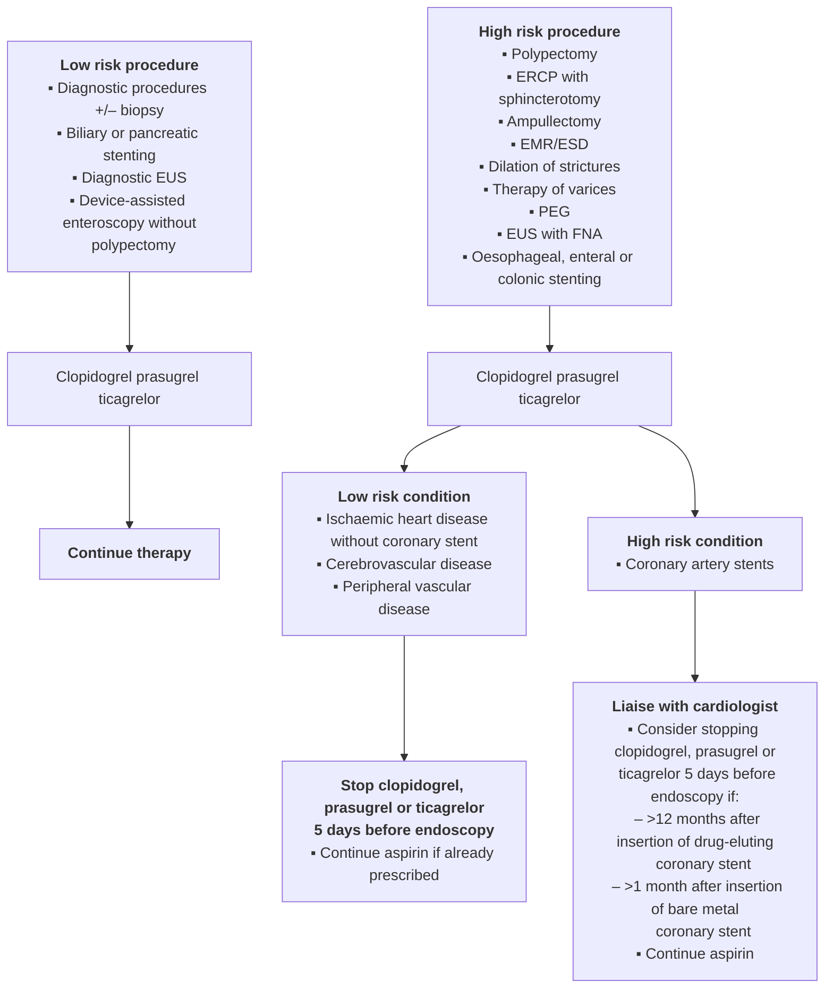
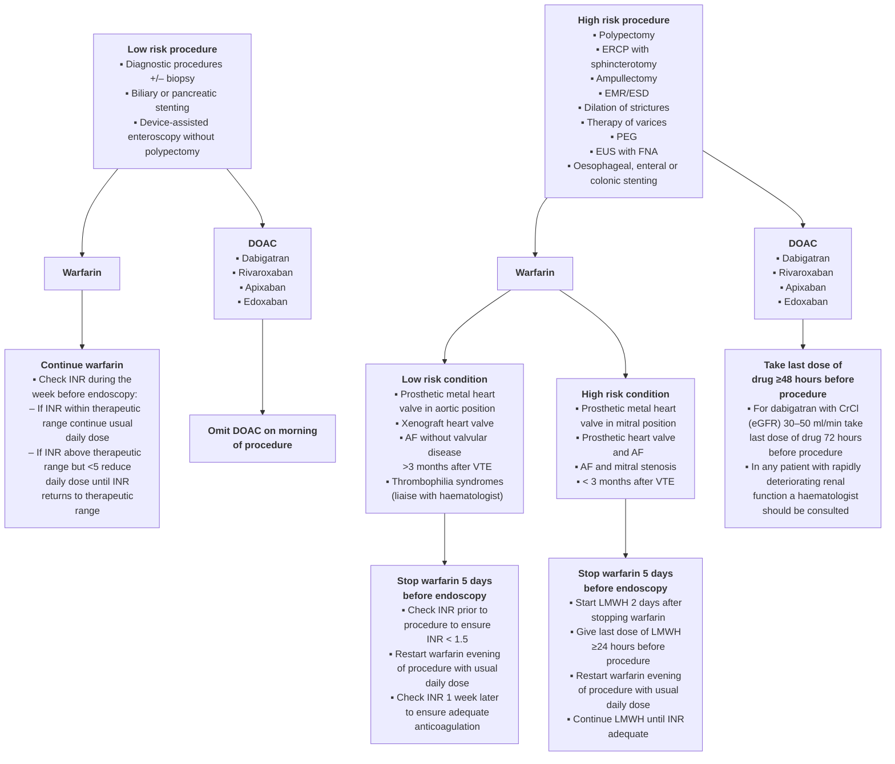

# Endoscopy in patients on antiplatelet or anticoagulant therapy, including direct oral anticoagulants: British Society of Gastroenterology (BSG) and European Society of Gastrointestinal Endoscopy (ESGE) guidelines

**Authors** Andrew M. Veitch1, Geoffroy Vanbiervliet2, Anthony H. Gershlick3, Christian Boustiere4, Trevor P. Baglin5, Lesley-Ann Smith6, Franco Radaelli7, Evelyn Knight8, Ian M. Gralnek9, Cesare Hassan10, Jean-Marc Dumonceau11

**Institutions** Institutions listed at end of article.

**Bibliography**
DOI http://dx.doi.org/10.1055/s-0042-102652
Published online: 0.0.2016
Endoscopy 2016; 48: 1–18
© Georg Thieme Verlag KG Stuttgart · New York
ISSN 0013-726X

**Corresponding author**
**Andrew M. Veitch, MD**
Consultant Gastroenterologist
Clinical Director of Endoscopy
and Bowel Cancer Screening
New Cross Hospital
Wolverhampton
WV10 0QP
andrew.veitch@nhs.net

> This article is published simultaneously in the journals Endoscopy and Gut.
> Copyright 2016 © Georg Thieme Verlag KG and © by BMJ Publishing Group.

---

The risk of endoscopy in patients on antithrombotics depends on the risks of procedural haemorrhage vs. thrombosis due to discontinuation of therapy.

**P2Y12 receptor antagonists (clopidogrel, prasugrel, ticagrelor):** For low-risk endoscopic procedures we recommend continuing P2Y12 receptor antagonists as single or dual antiplatelet therapy (low quality evidence, strong recommendation); For high-risk endoscopic procedures in patients at low thrombotic risk, we recommend discontinuing P2Y12 receptor antagonists five days before the procedure (moderate quality evidence, strong recommendation). In patients on dual antiplatelet therapy, we suggest continuing aspirin (low quality evidence, weak recommendation).

For high-risk endoscopic procedures in patients at high thrombotic risk, we recommend continuing aspirin and liaising with a cardiologist about the risk/benefit of discontinuation of P2Y12 receptor antagonists (high quality evidence, strong recommendation).

**Warfarin:** The advice for warfarin is fundamentally unchanged from BSG 2008 guidance.

**Direct Oral Anticoagulants (DOAC):** For low-risk endoscopic procedures we suggest omitting the morning dose of DOAC on the day of the procedure (very low quality evidence, weak recommendation). For high-risk endoscopic procedures, we recommend that the last dose of DOAC be taken ≥48 hours before the procedure (very low quality evidence, strong recommendation). For patients on dabigatran with CrCl (or estimated glomerular filtration rate, eGFR) of 30–50 mL/min we recommend that the last dose of DOAC be taken 72 hours before the procedure (very low quality evidence, strong recommendation). In any patient with rapidly deteriorating renal function a haematologist should be consulted (low quality evidence, strong recommendation).

## Abbreviations

| Abbreviation | Definition |
|---|---|
| ACS | Acute coronary syndrome |
| ADP | Adenosine diphosphate |
| AF | Atrial fibrillation |
| APA | Antiplatelet agents |
| APTT | Activated partial thromboplastin time |
| BSG | British Society of Gastroenterology |
| CrCl | Creatinine clearance |
| DAPT | Dual antiplatelet therapy |
| DES | Drug eluting stent |
| DOAC | Direct oral anticoagulant |
| eGFR | Estimated glomerular filtration rate |
| EMR | Endoscopic mucosal resection |
| EPBD | Endoscopic papillary balloon dilatation |
| ERCP | Endoscopic retrograde cholangiopancreatography |
| ESD | Endoscopic submucosal dissection |
| ESGE | European Society of Gastrointestinal Endoscopy |
| EUS | Endoscopic ultrasound |
| FNA | Fine needle aspiration |
| HR | Hazard ratio |
| INR | International normalised ratio |
| IPB | Intraprocedural bleeding |
| LMWH | Low molecular weight heparin |
| MI | Myocardial infarction |
| MS | Mitral stenosis |
| N-STEMI | Non ST-elevation myocardial infarction |
| NICE | National Institute for Health Care and Excellence |
| NOAC | Non-vitamin K oral anticoagulants |
| PAR-1 | Protease-activated receptor 1 |
| PCC | Prothrombin complex concentrate |
| PEG | Percutaneous endoscopic gastrostomy |
| PPB | Post polypectomy bleeding |
| PICO | Patients, Interventions, Controls, Outcomes |
| PPI | Proton pump inhibitor |
| PT | Prothrombin time |
| RCT | Randomised controlled trial |
| SEMS | Self-expanding metal stents |

| Abbreviation | Definition |
|---|---|
| TIA | Transient ischaemic attack |
| UFH | Unfractionated heparin |
| VKA | Vitamin K anticoagulants |
| VTE | Venous thromboembolism |

## 1.0 Summary of recommendations

These guidelines refer to patients undergoing elective endoscopic gastrointestinal procedures. Management of antiplatelet therapy and direct oral anticoagulants (DOACs) in acute gastrointestinal haemorrhage is discussed in detail in ESGE guidelines on the management of acute non-variceal upper gastrointestinal bleeding [1].

Recommendations for the management of patients on antiplatelet therapy or anticoagulants undergoing elective endoscopic procedures are outlined in the algorithms in ● **Fig. 1** and ● **Fig. 2**. Risk stratification for endoscopic procedures and antiplatelet agents are detailed in ● **Table 1** and ● **Table 2**. There is no high-risk category of thrombosis for DOACs as they are not indicated for prosthetic metal heart valves. Warfarin risk stratification is detailed in ● **Table 3**. Our recommendations are based on best estimates of risk:benefit analysis for thrombosis vs haemorrhage. When discontinuing antithrombotic therapy, patient preference should be considered as well as clinical opinion: the risk of a potentially catastrophic thrombotic event such as a stroke may not be acceptable to a patient even if that risk is very low.

For all endoscopic procedures we recommend continuing aspirin (moderate evidence, strong recommendation), with the exception of ESD, large colonic EMR (> 2 cm), upper gastrointestinal EMR and ampullectomy. In the latter cases, aspirin discontinuation should be considered on an individual patient basis depending on the risks of thrombosis vs haemorrhage (low quality evidence, weak recommendation).

### 1.1 Low-risk procedures

For low-risk endoscopic procedures we recommend continuing P2Y12 receptor antagonists (e.g., clopidogrel), as single or dual antiplatelet therapy (low quality evidence, strong recommendation).

For low-risk endoscopic procedures we suggest that warfarin therapy should be continued (low quality evidence, weak recommendation). It should be ensured that the INR does not exceed the therapeutic range in the week prior to the procedure (low quality evidence, strong recommendation).

For low-risk endoscopic procedures we suggest omitting the morning dose of DOACs on the day of the procedure (very low quality evidence, weak recommendation).

### 1.2 High-risk procedures

For high-risk endoscopic procedures in patients at low thrombotic risk, we recommend discontinuing P2Y12 receptor antagonists (e.g., clopidogrel) five days before the procedure (moderate quality evidence, strong recommendation). In patients on dual antiplatelet therapy, we suggest continuing aspirin (low quality evidence, weak recommendation).

For high-risk endoscopic procedures in patients at low thrombotic risk, we recommend discontinuing warfarin 5 days before the procedure (high quality evidence, strong recommendation). Check INR prior to the procedure to ensure this value is < 1.5 (low quality evidence, strong recommendation).

For high-risk endoscopic procedures in patients at high thrombotic risk, we recommend continuing aspirin and liaising with a cardiologist about the risk/benefit of discontinuing P2Y12 receptor antagonists (e.g., clopidogrel) (high quality evidence, strong recommendation).

For high-risk endoscopic procedures in patients at high thrombotic risk, we recommend that warfarin should be temporarily discontinued and substituted with low molecular weight heparin (low quality evidence, strong recommendation).

For all patients on warfarin we recommend advising that there is an increased risk of post-procedure bleeding compared to non-anticoagulated patients (low quality evidence, strong recommendation).

For high-risk endoscopic procedures in patients on DOACs, we recommend that the last dose of DOACs be taken at least 48 hours before the procedure (very low quality evidence, strong recommendation).

For patients on dabigatran with a CrCl (or eGFR) of 30–50 mL/min we recommend that the last dose be taken 72 hours prior to the procedure (very low quality evidence, strong recommendation). In any patient with rapidly deteriorating renal function a haematologist should be consulted (low quality evidence, strong recommendation).

### 1.3 Post endoscopic procedure

If antiplatelet or anticoagulant therapy is discontinued, then we recommend this should be resumed up to 48 hours after the procedure depending on the perceived bleeding and thrombotic risks (moderate quality evidence, strong recommendation).

## 2.0 Origin and purpose of these guidelines

Anticoagulants and antiplatelet agents are widely prescribed for a number of cardiovascular and thromboembolic conditions with established benefit to patients. These drugs confer an increased risk of haemorrhage when undertaking therapeutic endoscopic procedures, but also pose risks of thromboembolic sequelae if discontinued. The British Society of Gastroenterology (BSG) published guidelines on the management of anticoagulants and antiplatelet agents in patients undergoing endoscopy in 2008 [2] and the European Society of Gastrointestinal Endoscopy (ESGE) published guidelines on endoscopy and antiplatelet agents in 2011 [3]. Both guidelines are due for revision, and the BSG and ESGE have cooperated to produce a joint guideline. Since the publication of the previous guidelines there has been an expansion in the use of the newer antiplatelet drugs, and new oral anticoagulant drugs have been introduced. The latter have been widely prescribed and pose particular problems for endoscopists with regard to haemorrhage; their effects are difficult to reverse in an emergency situation, and moreover some of these drugs are associated with a higher incidence of spontaneous gastrointestinal haemorrhage compared to warfarin.

# Guideline

## Fig. 1 Guidelines for the management of patients on P2Y12 receptor antagonist antiplatelet agents undergoing endoscopic procedures.

---

## Fig. 2 Guidelines for the management of patients on warfarin or direct oral anticoagulants (DOAC) undergoing endoscopic procedures.

# Guideline

## Table 1 Risk stratification of endoscopic procedures based on the risk of haemorrhage.

| High risk | Low risk |
|---|---|
| Endoscopic polypectomy | Diagnostic procedures ± biopsy |
| ERCP with sphincterotomy | Biliary or pancreatic stenting |
| Sphincterotomy + large balloon papillary dilatation | Device-assisted enteroscopy without polypectomy |
| Ampullectomy | |
| Endoscopic mucosal resection or endoscopic submucosal dissection | |
| Endoscopic dilatation of strictures in the upper or lower GI tract | |
| Endoscopic therapy of varices | |
| Percutaneous endoscopic gastrostomy | |
| Endoscopic ultrasound with fine needle aspiration | |
| Oesophageal, enteral or colonic stenting | |

## Table 2 Risk stratification for discontinuation of clopidogrel, prasugrel or ticagrelor based on the risk of thrombosis.

| High risk | Low risk |
|---|---|
| Drug eluting coronary artery stents within 12 months of placement | Ischaemic heart disease without coronary stents |
| Bare metal coronary artery stents within 1 month of placement | Cerebrovascular disease |
| | Peripheral vascular disease |

## Table 3 Risk stratification for discontinuation of warfarin therapy with respect to the requirement for heparin bridging.

| High risk | Low risk |
|---|---|
| Prosthetic metal heart valve in mitral position | Prosthetic metal heart valve in aortic position |
| Prosthetic heart valve and atrial fibrillation | Xenograft heart valve |
| Atrial fibrillation and mitral stenosis\* | Atrial fibrillation without valvular disease |
| < 3 months after venous thromboembolism | > 3 months after venous thromboembolism  Thrombophilia syndromes (discuss with haematologist) |

\* Uncertainty exists regarding the thrombotic risk of temporarily discontinuing warfarin in patients with atrial fibrillation and mitral stenosis following the BRIDGE trial [17], but there is insufficient evidence at present to alter the risk category.

## 3.0 Preparation of the guidelines

These guidelines were drafted by a working party comprising members of the BSG and ESGE, a haematologist, interventional cardiologist, and a patient representative from the charity AntiCoagulation Europe. Guidelines were prepared according to AGREE II principles [4] and comply with the requirements of the National Institute for Health and Care Excellence (NICE). Clinical questions were formulated using the PICO (Patients, Interventions, Controls, Outcomes) system. Search strategies were delegated to authors with responsibilities for specific sections. Literature searches were conducted using PubMed and OVID Medline, Embase and Cochrane Library. Additional searches were conducted using Google. Literature searches were re-run in February 2015, and any additional relevant studies considered up to August 2015. Quality of evidence and strength of recommendations were determined by the authors and consensus achieved according to the GRADE system [5]. After agreement on a final version, the manuscript was subjected to internal peer review and revision by the BSG and the ESGE and sent to all individual ESGE members and member societies prior to publication. Conflict of interest statements were submitted by all authors. This guideline was produced in 2015 and will be considered for review in 2019, or sooner if new evidence becomes available. This guideline has been co-published with permission in both Gut and Endoscopy.

## 4.0 Warfarin

*For low-risk endoscopic procedures we suggest that warfarin therapy should be continued (low quality evidence, moderate recommendation). It should be ensured that the INR does not exceed the therapeutic range in the week prior to the procedure (low quality evidence, strong recommendation).*

- Tell the patient to continue warfarin and check the INR during the week before the endoscopy;
- If the INR result is within the therapeutic range then continue with the usual daily dose;
- If the INR result is above the therapeutic range, but less than 5, then reduce the daily warfarin dose until the INR returns to within the therapeutic range;
- If the INR is greater than 5 then defer the endoscopy and contact the anticoagulation clinic, or a medical practitioner, for advice.

*For high-risk endoscopic procedures in patients at low thrombotic risk, we recommend discontinuing warfarin 5 days before the procedure (high quality evidence, strong recommendation). Check INR prior to the procedure to ensure < 1.5 (low quality evidence, strong recommendation)*

- Stop warfarin 5 days before the endoscopy;
- Check the INR prior to the procedure to ensure its value is < 1.5;
- On the day of the procedure restart warfarin with the usual daily dose that night;
- Check INR one week later to ensure adequate anticoagulation.

*For high-risk endoscopic procedures in patients at high thrombotic risk, we recommend that warfarin should be temporarily discontinued and substituted with low molecular weight heparin (LMWH) (moderate quality evidence, strong recommendation).*

- Warfarin should be stopped 5 days before the procedure;
- Two days after stopping warfarin commence daily therapeutic dose of LMWH;
- Administer the last dose of LMWH at least 24 hours prior to the procedure;
- Check the INR prior to the procedure to ensure its value is < 1.5;
- Warfarin can be resumed on the day of the procedure with the usual dose that night;
- Restart the daily therapeutic dose of LMWH on the day after the procedure;
- Continue LMWH until a satisfactory INR is achieved.

# Guideline

*For all patients on warfarin we recommend advising that there is an increased risk of post-procedure bleeding compared to non-anticoagulated patients (low quality evidence, strong recommendation).*

Updated literature searches were conducted on the use of warfarin and heparin in patients undergoing endoscopy. Two studies of colonic polypectomy on warfarin for small polyps have been retrieved. A retrospective study of 223 polypectomies (< 1 cm) in 123 patients on continued warfarin therapy found a rate of haemorrhage requiring transfusion of 0.8 %. This was despite routine prophylactic clipping of polypectomies [6]. In a randomised controlled trial (RCT) (159 polyps < 1 cm in 70 patients) examining hot vs cold snaring of polyps in anticoagulated patients, the rate of immediate haemorrhage in the hot snare vs. the cold snare group was 23.0 % vs 5.7 %, respectively, and that of delayed haemorrhage requiring intervention 14 % vs 0 %, respectively [7]. These findings should be considered in the context that polyps have been found at colonoscopy in 22.5 %–32.1 % of patients in large studies [8, 9] and up to 42 % in a bowel cancer screening programme [10], many will be greater than 1 cm in size, and the rates of haemorrhage in the latter study above were greater than the 0.07 %–1.7 % overall rates of haemorrhage reported in non-anticoagulated patients [9, 11–14]. Routine discontinuation of warfarin therapy may therefore be considered necessary in most colonoscopy services. Even when temporarily discontinued, warfarin therapy is associated with an increased risk of post-polypectomy bleeding [15] and patients should be advised of this.

For patients with non-valvular atrial fibrillation (AF), bridging of warfarin therapy with LMWH has not been recommended in previous guidelines [2, 16]. This policy has been tested in a large RCT of 1,884 AF patients with peri-operative interruption of warfarin therapy, randomized to bridging with LMWH or placebo [17]. Approximately half of these patients underwent endoscopic procedures. In the placebo group, there was no increase in thrombotic events, but in the heparin group there was an increase in major bleeding events. Both groups included patients with AF and mitral stenosis (MS) or CHADS2 [18] scores of 5 or 6, situations considered at high risk of thrombotic events. The proportion of these patients was however low (≤2 % for MS and ≤3.4 % for CHADS2 5,6), and the study was not designed for this subgroup analysis. Atrial fibrillation with MS is considered particularly high risk for thromboembolic events [19, 20] and remains in this category for these guidelines. There are insufficient data to make specific recommendations for patients with high CHADS2 scores undergoing endoscopy.

Retrospective studies of LMWH bridging for metal heart valves have suggested that this practice is safe with regard to thrombotic risk [21–23]. Intravenous unfractionated heparin (UFH) is an alternative, and local cardiological advice may influence which is preferred. Bridging with UFH does, however, require a prolonged inpatient stay as warfarin is discontinued, and then restarted, to achieve satisfactory INR. Comparison of LMWH vs UFH for bridging for metal heart valves found no difference in adverse events between the groups in a multicentre registry study [24].

Some patients with a personal or family history of venous thrombosis are found to have identifiable laboratory evidence of a predisposition, so called thrombophilia. In most cases the risk of venous thrombosis if anticoagulation is temporarily interrupted is not substantially different in patients with and without such abnormalities. Therefore, a thrombophilia does not indicate a high-risk condition per se and bridging with LMWH is not indicated when warfarin is interrupted. Factor V Leiden and the common prothrombin mutation F2G20210A are low-risk thrombophilias and bridging is not required. Patients with deficiencies of antithrombin, protein C or protein S are at higher risk of thrombosis, but in most of these patients bridging therapy will not be required. Thrombophilia syndromes have therefore been reclassified as low-risk conditions for the purposes of these guidelines, but we suggest that haematological advice is sought in these cases.

Apart from reclassification of the risk of thrombophilia, no new data were found to alter the recommendations for the use of warfarin or heparin stipulated in the 2008 BSG guidelines [2]. Evidence was reviewed in its entirety and recommendations re-classified using GRADE.

## 5.0 Antiplatelet agents

*For all endoscopic procedures we recommend continuing aspirin (moderate evidence, strong recommendation), with the exception of ESD, large colonic EMR (> 2 cm), upper gastrointestinal EMR and ampullectomy. In the latter cases, aspirin discontinuation should be considered on an individual patient basis depending on the risks of thrombosis vs haemorrhage (low quality evidence, weak recommendation).*

*For high-risk endoscopic procedures in patients at low thrombotic risk, we recommend discontinuing P2Y12 receptor antagonists (e.g., clopidogrel) five days before the procedure (moderate quality evidence, strong recommendation). In patients on dual antiplatelet therapy, we suggest continuing aspirin (low quality evidence, weak recommendation).*

*For high-risk endoscopic procedures in patients at high thrombotic risk, we recommend continuing aspirin and liaising with a cardiologist about the risk/benefit of discontinuing P2Y12 receptor antagonists (e.g., clopidogrel) (high quality evidence, strong recommendation).*

### 5.1 Aspirin

Aspirin is standard of care in patients with ischaemic heart disease. It reduces the mortality associated with acute myocardial infarction (MI) as well as the risk of fatal and non-fatal recurrent MI in patients with unstable coronary syndromes. It also reduces mortality and recurrent stroke in patients with acute cerebrovascular ischaemia. When given as long-term secondary prevention aspirin reduces vascular events by approximately one-third and vascular deaths by about one-sixth. Intra-platelet pathways can still be activated even in the presence of aspirin. Most patients who have suffered an acute coronary event will therefore be on dual anti-platelet therapy (DAPT), i.e. aspirin plus an inhibitor of the P2Y12 receptor, either clopidogrel, prasugrel or ticagrelor.

In the context of endoscopy, aspirin monotherapy has been found to be safe in colonoscopic polypectomy and endoscopic sphincterotomy [25–28]. Studies of aspirin in the context of endoscopic submucosal dissection (ESD) [29, 30] or large (> 20 mm) colonic endoscopic mucosal resections (EMR) [31–33] have found an increased risk of haemorrhage; EMR in the upper gastrointestinal tract confers a high risk of haemorrhage, but there are no studies on continuous aspirin therapy. The thrombotic risk to the patient should also be considered, particularly in those receiving aspirin for secondary prevention as they are at greater risk from discontinuation of therapy than those taking it for primary prevention. In patients on long-term low-dose aspirin for secondary prevention, aspirin interruption was associated with a three-fold increased risk of cardiovascular or cerebrovascular events, and 70 % of these events occurred within 7–10 days after interruption

[34, 35]. In an RCT of 220 patients on low-dose aspirin for secondary prevention undergoing non-cardiac surgery, patients were randomized to continuation or temporary replacement of aspirin by placebo (–7 to +3 days after surgery) [36]. Major cardiac events occurred within 30 days in 1.8 % of the aspirin group compared to 9 % in the placebo group (P= 0.02). No difference in bleeding complications was seen between the two groups.

Haemorrhage secondary to high-risk endoscopic procedures can often be controlled by further endoscopic therapeutic measures, and is rarely fatal. A thrombotic stroke may result in lifelong disability, and a major cardiac event may result in death. The risks of thrombosis vs haemorrhage need to be assessed on an individual patient basis, and caution should be exercised if discontinuing aspirin when prescribed for secondary prevention of ischaemic or thrombotic events.

## 5.2 Clopidogrel

The interlinked processes of platelet deposition, adherence, and aggregation are central to the initiation of the process of thrombus formation in the arterial system. The trigger is arterial wall injury, either spontaneous with an acute plaque event (rupture or erosion) as in acute coronary syndromes (ACS) (non ST-segment Elevation Myocardial Infarction: N-STEMI, or ST-segment Elevation Myocardial Infarction: STEMI), or when angioplasty and stenting are used to treat coronary narrowings. Uncontrolled activation of platelets when stent struts are still exposed can lead to occlusive thrombus and heart attack.

Clopidogrel is an inhibitor of adenosine diphosphate (ADP)-induced platelet aggregation [37]. Clopidogrel plus aspirin is more effective than aspirin alone at attenuating clinical events in acute, platelet-initiated, presentations [38]. Dual anti-platelet therapy has a specific and critical role in preventing occlusion of coronary artery stents. Angioplasty and stenting is the standard of care for specific sub-groups of patients with stable angina, and is the default strategy in the vast majority of patients with ACS. Like that of aspirin, the antiplatelet action of clopidogrel is irreversible and platelet function has been demonstrated to return to normal 5–7 days after withdrawal of clopidogrel, based on the regenerative production of clopidogrel-naive platelets [39].

## 5.3 Newer antiplatelet agents

### 5.3.1 Prasugrel and ticagrelor

Newer, more potent and more rapidly acting agents than clopidogrel have become the standard of care in patients with ACS. The two new agents now available are prasugrel and ticagrelor. Prasugrel is a thienopyridine, like clopidogrel, whereas ticagrelor is a different class of agent and reversible. Prasugrel tends to be used in selected STEMI patients, ticagrelor in both STEMI and N-STEMI ACS patients as recommended by NICE in the UK [40]. Both are recommended to be continued for 12 months after discharge, in combination with aspirin. Aspirin is continued for life thereafter.

### 5.3.2 Vorapaxar

Vorapaxar is the first of a new class of antiplatelet agent; it is a protease-activated receptor (PAR-1) antagonist that inhibits thrombin. It is indicated for preventing cardiovascular events in patients with a history of MI or peripheral arterial disease, and it is administered in addition to aspirin or DAPT [41–43]. It is contraindicated in patients with a previous history of stroke, transient ischaemic attack (TIA) or intracranial haemorrhage due to an increased risk of intracranial haemorrhage. Vorapaxar was approved by the US Food and Drug Administration in 2014, and by the European Medicines Agency in 2015. There are no data on the peri-operative or peri-endoscopic use of this drug, and specific recommendations have not been made at this time. Peri-endoscopic management of patients on this drug should be in consultation with a cardiologist or other specialist in cardiovascular disease.

## 5.4 Ischaemic heart disease and coronary artery stents

Patients with ischaemic heart disease are generally treated with antiplatelet therapy rather than anticoagulant therapy. Coronary artery stenting has increasingly become the dominant therapy for treating patients with coronary artery disease. Most of the exponential increase in the use of these drugs has been due to treating patients for ACS. Patients who have undergone revascularisation therapy with coronary artery surgery will tend to be prescribed aspirin alone, while those treated with stents for stable angina are generally treated with aspirin and clopidogrel for 12 months and then aspirin indefinitely. If they have had an episode of unstable angina with a troponin release they will be treated with the more rapidly acting and more potent, newer, agents, either prasugrel or ticagrelor. Therefore, unless a patient has presented with stable angina and has been treated with a bare metal stent (a minority of patients), they are likely according to current guidance to be treated for 12 months with either clopidogrel or one of the more potent P2Y12 inhibitors as part of their DAPT regimen.

To prevent stent thrombosis DAPT is prescribed for 12 months after drug-eluting stent (DES) deployment while bare metal stents, which are used in < 10 % of cases, require a minimum of 1 month DAPT. Following DAPT, lifetime aspirin should be prescribed for both types of stent.

Dual anti-platelet therapy i.e aspirin plus either clopidogrel, prasugrel or ticagrelor also increases the risk of bleeding [44–46], either spontaneously or when a non-cardiac interventional procedure is required: clopidogrel > aspirin alone, ticagrelor plus aspirin > clopidogrel plus aspirin and prasugrel plus aspirin > any of the other combinations although direct head to head studies comparing prasugrel with ticagrelor have not been reported.

## 5.5 Clinical consequences of DAPT

If patients develop dyspepsia on low-dose aspirin, or in any patient at risk from gastro-intestinal bleeding, co-prescription of a proton pump inhibitor (PPI) should be considered initially. Failing that, and after discussion with a cardiologist, the patient taking aspirin alone could be given clopidogrel instead.

Should the patient spontaneously bleed or require a non-cardiac operative procedure within the recommended time period of DAPT administration, it may seem obvious to stop the DAPT but the clinical risks associated with stopping antiplatelet therapy are high. In one study which examined factors associated with stent thrombosis, discontinuation of therapy was associated with a hazard ratio (HR) of 161 for death and MI [47]. Development of stent thrombosis carries an approximate risk of 40 % for MI and death. The risk of stent thrombosis increases after 5 days without antiplatelet therapy; if clopidogrel needs to be temporarily stopped in the context of an acute gastro-intestinal haemorrhage then discontinuation of therapy should be limited to this interval.

Issues related to the need to consider discontinuation of DAPT for non-cardiac surgical procedures are complex and dependent on a number of potentially confounding factors [48]. For patients with known high risk of needing a future non-cardiac surgical proce-

dure (eg, planned future surgery for cancer) bare metal stenting will be undertaken because DAPT will only be required for 1 month. However this is valid for patients stented for stable conditions only since ACS patients currently still need 12 months DAPT. The variables around stent type and clinical indication, timing of need for non-cardiac operation and or bleeding make conversations with the interventional cardiologist imperative.

### 5.6 Developments in antiplatelet therapy

These include:

1. The introduction of the newer, more potent, P2Y12 inhibitors described above (prasugrel & ticagrelor);
2. The reversibility of one of these (ticagrelor) such that discontinuation may allow for an earlier procedure than for clopidogrel and prasugrel that have irreversible effects. Although platelet inhibition starts to reverse within 48 hours it is still recommended that if clinically feasible 5 days should be allowed to lapse;
3. Newer DES (generation 3 DES) may need DAPT absolutely for only 3–6 months [49]. There are a number of on-going trials comparing short duration (3 months) vs standard duration (12 months) of DAPT administration [50];
4. If the patient has received DES for ACS then the recommendations are still that the DAPT (aspirin plus either prasugrel or ticagrelor) be maintained for 12 months, irrespective of DES type;
5. If, after discussion with a cardiologist, DAPT needs to be modified for a non-cardiac procedure during the 12 months following coronary stent insertion, then only the P2Y12 inhibitor should be discontinued (for 5 days prior to the procedure) – the aspirin should be continued;
6. The situation is further complicated by recent data (DAPT trial) [51] which suggests that certain patients may benefit from an extension of their DAPT till at least 30 months. This study reported fewer ischaemic events in patients receiving DAPT up till 30 months than those discontinuing at 12 months, but at the cost of a higher risk of (non-fatal) bleeding;
7. The PARIS registry [52] studied a real-world population of 5,000 patients, and provided insight into the outcomes from physician-recommended discontinuation of DAPT, or brief interruption (for surgery), disruption (patient non-compliance), or because of bleeding. Compared with patients on continued DAPT, the adjusted HR for major adverse cardiovascular events due to interruption and disruption was 1.41 (95 % confidence interval [CI] 0.94–2.12; P= 0.10) and 1.50 (95 % CI 1.14–1.97; P= 0.004), respectively. Within 7 days, 8–30 days, and more than 30 days after disruption, adjusted HRs were 7.04 (95 % CI 3.31–14.95), 2.17 (95 % CI 0.97–4.88), and 1.3 (95 % CI 0.97–1.76), respectively. These data suggest that the risk of discontinuation is highest soon after stent deployment and attenuate the longer time elapsed;
8. Considering the risk associated with very early discontinuation of DAPT, patients with an early gastrointestinal haemorrhage (within the first 3 months) should be considered for endoscopic haemostasis without discontinuing DAPT.

## 6.0 Direct oral anticoagulants

*For low-risk endoscopic procedures we suggest omitting the morning dose of DOACs on the day of the procedure (very low quality evidence, weak recommendation).*

*For high-risk endoscopic procedures in patients on DOACs, we recommend that the last dose of DOACs be taken at least 48 hours before the procedure. For patients on dabigatran with a CrCl (or eGFR) of 30–50 mL/min we recommend that the last dose be taken 72 hours prior to the procedure (very low quality evidence, strong recommendation). In any patient with rapidly deteriorating renal function a haematologist should be consulted (low quality evidence, strong recommendation).*

### 6.1 Summary

Orally active drugs that directly inhibit thrombin (dabigatran etexilate) [53, 54] and factor Xa (rivaroxaban [55, 56], apixaban [57, 58] and edoxaban [59]) are now licensed for prevention of stroke and systemic embolus in patients with non-rheumatic AF and for prevention and treatment of deep vein thrombosis and pulmonary embolus. These drugs should not be used as anticoagulants in patients with metal heart valve prostheses. These drugs are referred to as NOACs (Non-vitamin K antagonist Oral Anti Coagulants) or DOACs (Direct Oral Anti Coagulants).

For some patients DOACs offer benefits over oral vitamin K antagonists (VKA) such as warfarin. The drugs are prescribed at fixed dose without the need for monitoring or dose adjustment and the rapid onset of anticoagulation and short half-life of DOACs make initiation and interruption of anticoagulation considerably easier than with VKAs.

Specific antidotes are not yet available for clinical use, but are in development [60–62] and will likely be licensed for use in the next one to two years.

As with all anticoagulants produced so far there is a correlation between intensity of anticoagulation and bleeding. Consequently, the need to consider the balance of benefit and risk with a DOAC is no less important than with warfarin. When a patient taking warfarin with a known INR undergoes endoscopic biopsy the intensity of anticoagulation is quantifiable. The pharmacokinetic profile, and hence pharmacodynamic effect, of DOACs varies such that some individuals will have higher peak levels 2 to 6 hours after oral administration [63]. Consequently, at the time of an endoscopic biopsy the anticoagulant effect due to a DOAC is not accurately predictable. In a patient taking a DOAC the intensity of anticoagulation may be relatively high compared to the average intensity and hence until further safety data in this specific situation are available we suggest omitting the morning dose of a DOAC on the day of a low-risk procedure so that biopsies can be sampled at a trough level. In patients undergoing a high-risk procedure with a low thrombotic risk we recommend that the last dose of a DOAC is taken 2 days before the procedure, i.e. no dose in the 48 hours before the procedure. This will ensure a minimal residual anticoagulant effect in the majority of patients.

All DOACs are excreted to some extent by the kidneys but dabigatran pharmacokinetics are most influenced by renal function. Therefore, dabigatran may have to be stopped for more than 48 hours before a procedure when renal function is known to be significantly reduced [64]. For patients on dabigatran with creatinine clearance (CrCl) of 30–50 mL/min we recommend that the drug is stopped at least 72 hours before the procedure. Dabigatran therapy is contraindicated in patients with CrCl < 30 mL/min. Estimated glomerular filtration rate (eGFR) is a suitable alternative measurement of renal function and the same numerical values apply for the purposes of these guidelines. If a patient on any DOAC is clinically deteriorating, his/her renal function should be checked before the procedure, and if there is possible drug accumulation a quantitative measurement of DOAC intensity

should be performed, e. g. by calibrated anti-Xa assay for Xa inhibitors or Hemoclot assay for dabigatran. In patients undergoing high-risk procedures with a high thrombotic risk then advice from a haematologist is recommended. The highest thrombotic risk patients are those with mechanical heart valve prostheses but DOACs are not indicated in such patients, so patients taking DOACs will not require bridging therapy.

It is of the utmost importance that clinicians are aware that unlike reintroduction of warfarin, which results in delayed anticoagulation for several days, a therapeutic intensity of anticoagulation is restored within 3 hours of taking a therapeutic dose of a DOAC. Because of the high risk of bleeding associated with therapeutic intensity anticoagulation after an invasive procedure, we suggest a delay in reintroducing a DOAC after a high-risk procedure. This delay will depend on the risk of hemorrhage specific to the procedure and will usually be 24–48 hours. For procedures with a significant risk of delayed haemorrhage such as EMR or ESD, a longer period of discontinuation may be considered in the context that DOAC patients are in a relatively low thrombotic risk category.

### 6.2 Drug characteristics

Compared with VKAs, DOACs are associated with a lower overall risk of major haemorrhage and particularly a significant reduction in the risk of intracranial bleeding, of the order of about a 50 % risk reduction. The incidence of gastrointestinal bleeding was, however, increased with dabigatran and rivaroxaban compared to warfarin in large RCTs [53, 56], although this was confined to the elderly (> 75 years old) in a real-world study [65]. Additional advantages of DOACs are:

- a predictable dose response;
- the absence of need for routine monitoring;
- a reduced need for dose adjustment;
- the absence of food interactions;
- limited drug interactions.

### 6.3 Dabigatran

In the RE-LY study of patients with AF there was an increase in the rate of lower gastrointestinal bleeding in the higher dabigatran dose (150 mg bd) group [53]. This may be due to the low bioavailability (6.5 %) and consequent high concentrations of dabigatran in the faeces causing a local anticoagulant effect at the level of the bowel wall [66]. Dyspepsia was more common with dabigatran (11.3 % and 11.8 % in the 150 mg and 110 mg dabigatran groups) compared with warfarin (5.8 %). The combination of higher rates of lower gastrointestinal bleeding and drug discontinuation due to dyspepsia may be a reason to choose a different anticoagulant for patients with a history of gastrointestinal disorders.

Dabigatran reaches a peak plama concentration 3 hours after ingestion. After multiple doses a terminal half-life of about 12–14 hours is observed. The half-life is independent of dose, but prolonged if renal function is impaired. With CrCl of 80 mL/min the half life of dabigatran is 13 hours and it increases to 27 hours if the CrCl is below 30 mL/min. The recommended dose is 150 mg bd with a dose reduction to 110 mg bd over the age of 80 years and in patients with a CrCl < 50 mL/min. It should not be prescribed in patients with a CrCl ≤ 30 mL/min. Patients with liver enzymes more than twice the upper limit of normal were excluded from the RE-LY study. Nevertheless, there is no liver toxicity associated with dabigatran and so the drug might be used as long as there is no coagulopathy associated with liver disease. Aspirin or clopidogrel should be used with caution or avoided, and non-steroidal anti-inflammatory drugs should be avoided as their concomitant use was associated with an increased bleeding risk in the RE-LY study.

### 6.4 Rivaroxaban

Rivaroxaban is a direct competitive inhibitor of factor Xa and limits thrombin generation in a dose dependent manner. Absorption of this drug is rapid and it presents a half-life of 7 to 11 hours. Two thirds of rivaroxaban are metabolised in the liver but it can be used in patients with liver disease if there is no coagulopathy. Only about one third of active rivaroxaban is cleared by the kidneys and there is no accumulation of drug when the CrCl is above 15 mL/min. However, a dose reduction from 20 mg once daily to 15 mg once daily has been recommended for patients with a CrCl between 15 and 30 mL/min. Rivaroxaban is not recommended when the CrCl is ≤ 15 mL/min. As with dabigatran, lower gastrointestinal bleeding occurred more frequently in the elderly with rivaroxaban than with warfarin.

### 6.5 Apixaban and Edoxaban

Apixaban and edoxaban are Xa inhibitors that were approved subsequently to rivaroxaban for prevention of stroke in patients with non valvular AF and for treatment and prevention of venous thrombosis [67]. Less than 50 % of these drugs are cleared by the kidneys and similar recommendations to those made for rivaroxaban apply to interruption and recommencement of these drugs.

### 6.6 Measurement of anticoagulant effect of DOACs

Measurement of the anticoagulant effect of DOACs may be required when a patient is bleeding or scheduled for a high-risk intervention. Laboratories should ideally be aware of the sensitivity of their own prothrombin time (PT) and activated partial thromboplastin (APTT) assays to each drug. The result of a qualitative test such as the PT or APTT can indicate whether anticoagulation is supratherapeutic, therapeutic or subtherapeutic but cannot be used to determine the plasma concentration of the drug. The test results are dependent on when the last dose of drug was taken and therefore require interpretation with reference to the dose, anticipated half-life and factors that influence pharmacokinetics. The Hemoclot® thrombin inhibitor assay is a sensitive dabigatran-calibrated thrombin clotting time which can be used to determine the drug concentration [68]. Anti-factor Xa assays are sensitive to factor Xa inhibitors [69–71]. By using specific DOAC calibrators and controls, the anti-factor Xa chromogenic method is suitable for measuring a wide range of plasma concentrations of Xa inhibitors, which covers the expected plasma levels after therapeutic doses.

### 6.7 Bridging therapy

Compared to warfarin, requirement for bridging with heparin when interrupting DOACs are different due to the fast on and off effects of DOACs. In the Dresden DOAC registry heparin bridging for patients on rivaroxaban did not reduce cardiovascular events and led to a significantly higher rate of major bleeding compared to no bridging (2.7 % vs 0.5 %, P = 0.01) [73]. In addition, a substudy of the RE-LY trial found that bridging of dabigatran with LMWH resulted in higher rates of major bleeding (6.5 % vs 1.8 %, P < 0.001) with no reduction in thromboembolism compared to no bridging [73].

## 6.8 Triple antithrombotic therapy

Patients on dual antiplatelet therapy for coronary artery stents may develop AF requiring anticoagulation with warfarin or DOACs. Conversely, patients anticoagulated for chronic AF may develop ACS requiring DAPT. Consensus guidelines have been produced for the management of these situations [74], but patients on triple antithrombotic therapy have a high risk of haemorrhage and caution is advised [75, 76]. There are no data on endoscopy in these patients and advice should be sought from a cardiologist, or other relevant specialist such as a stroke physician, if endoscopy is essential.

## 6.9 Management of bleeding patients treated with DOACs

Management depends on the severity of bleeding. When bleeding is not severe, temporary drug withdrawal may be the only requirement due to the short half-lives of these drugs. For more severe bleeding general treatment measures may be required and consideration should be given to general resuscitation interventions, including endoscopic haemostasis, fluid replacement, correction of anaemia by transfusion of red cells and correction of additional coagulopathy (e. g. dilutional coagulopathy) with platelet transfusion and appropriate blood products. The time of last intake of DOAC should be determined and the half-life can be estimated from measurement of serum creatinine and calculation of the CrCl. The anticoagulant activity of the DOAC should be determined by the most appropriate laboratory assay.

Protamine sulphate and vitamin K have no effect on the anticoagulant effects of DOACs. The effect of antifibrinolytics on bleeding due to DOACs is not known but use of tranexamic acid would be reasonable in some patients. Similarly, the general haemostatic effect of desmopressin (DDAVP) independent of thrombin or factor Xa might be beneficial although this is unknown. Fresh frozen plasma does not reverse the anticoagulant effect of DOACs to any appreciable degree and no clinical benefit has been demonstrated. The effects of prothrombin complex concentrate (PCC) and recombinant factor VIIa (rVIIa) have not been studied in clinical trials in human patients with bleeding. The effect of rivaroxaban on coagulation tests from volunteers is reversed by PCC (50 IU/kg of 4-factor concentrate) but the effect of dabigatran is not [77]. These results do not indicate one way or the other if PCCs would reduce clinical bleeding. For patients with life-threatening bleeding, administration of 40 to 50 IU/kg of PCC has been suggested but there is no clinical evidence as yet that this will reduce clinical bleeding [78, 89].

## 7.0 Endoscopic procedures: risk of haemorrhage

There is an intrinsic risk of haemorrhage associated with endoscopic procedures. Minor haemorrhage is not uncommon during therapeutic endoscopic procedures, but we have considered it to be clinically significant when haemoglobin value falls by more than 20 g/L, necessitates blood transfusion or causes an unplanned hospital admission. Haemorrhage may be immediately apparent at the time of endoscopy, or delayed up to two weeks following the procedure. The latter situation may present a higher risk for patients who are on antiplatelet therapy or anticoagulants following the procedure. It is important that, not only are patients advised of the risks of haemorrhage following endoscopic procedures, but that they are given written advice on how to seek appropriate medical help should this occur following discharge from hospital. Unless otherwise stated, the following sections review the risks of haemorrhage in patients who are not on antithrombotic therapy, and these data are subsequently used to stratify the risk of procedures (▶ **Table 1**).

### 7.1 Diagnostic endoscopy and mucosal biopsy

Diagnostic endoscopies, including mucosal biopsy sampling, harbor a minimal risk of haemorrhage, and no severe haemorrhage has been reported in studies involving thousands of patients in total [9, 80–83]. Furthermore no increased risk of haemorrhage from biopsy has been found in studies of patients on aspirin, clopidogrel or warfarin [84, 85]. In these studies only small numbers of biopsies were taken, and the safety of taking large numbers of biopsies in patients on warfarin, such as in Barrett's oesophagus surveillance, has not been studied. There have been no published reports of excess bleeding in this context, however. There are no data about biopsies in patients taking the newer antiplatelet agents or DOACs. Due to uncertainty regarding the level of anticoagulation on DOACs at the time of endoscopy and the absence of reliable test of anticoagulation on these drugs, we suggest omitting the dose of DOAC on the morning of the procedure to allow an adequate safety margin. This applies to both once daily and twice daily regimens.

### 7.2 Post polypectomy bleeding

Published haemorrhage rates for polypectomy, endoscopic mucosal resection (EMR) or endoscopic submucosal dissection (ESD) are confounded by heterogeneity of definitions of intraprocedural bleeding (IPB) and post-polypectomy bleeding (PPB) between studies. Previous studies of colonoscopic polypectomy have identified a risk of PPB of 0.07–1.7 % [9, 11–14]. In a BSG audit of 20,085 colonoscopies in the UK, 52 (0.26 %) haemorrhages were reported [8]. Thirty nine of these were self-limited, three (0.01 %) required transfusion, and one required surgery. Data from the English National Bowel Cancer Screening Programme on 112,024 participants, of whom 69,028 underwent polypectomy, found an overall PPB rate of 1.14 % [86]. Polypectomy increased the risk of bleeding by a factor of 11.14 compared with no polypectomy. In large series (> 1000 polypectomies) [86–92], delayed PPB varied from 0.6 to 2.2 % and the mean time to onset of bleeding was 4.0 ± 2.9 days [93]. It is important to differentiate between minor haemorrhage associated with polypectomy which is controlled at the time of the procedure and more significant haemorrhage which requires an unplanned admission to hospital, possibly with repeat endoscopy and/or transfusion. The incidence of severe bleeding requiring transfusion in the English Bowel Cancer Screening Programme was 0.08 % [86].

Polyp size is the most consistent risk factor for colonic PPB, and it has been calculated that every 1-mm increase in polyp diameter increases the risk of PPB by 9 % [93]. Use of pure cutting current was found to be an independent predictive factor of immediate PPB compared with blended or coagulation current in a large cohort of 5,152 patients undergoing more than 9,000 polypectomies (OR, 6.95; 95 % CI, 4.42 to 10.94) [94]. In a prospective cohort study, the use of a non microprocessor-controlled current was an independent predictive factor of delayed bleeding when performing a wide field EMR [32]. Two recent meta-analyses have examined data on RCTs for PPB prophylaxis [95, 96]. In the first, the seven studies included a majority of pedunculated large polyps (range, 14 to 26 mm) and the primary outcome focused on the overall risk of PPB [95]. The authors found that any of the prophylactic measures helped prevent PPB (RR, 0.32; 95 % CI, 0.20

to 0.52), and mechanical techniques (detachable loop or endoclip) were superior to submucosal injection of diluted adrenaline (RR, 0.28; 95 % CI, 0.14 to 0.57). Submucosal injection of adrenaline was, however, found to reduce the risk of overall PPB when compared to no treatment or saline injection alone (RR, 0.37; 95 % CI, 0.20 to 0.66). The second meta-analysis evaluated the impact of endoscopic prophylactic methods on early PPB (within the first 24 hours) [96]. Diluted adrenaline injection reduced significantly the risk of early PPB (OR, 0.37; 95 % CI, 0.22 to 0.64) as well as any other single prophylactic modality. No significant difference was observed between endoclip and detachable snare in a recent multicentre RCT to prevent delayed PPB in patients with pedunculated polyps with a large stalk (≥10 mm) (5.1 % vs. 5.7 %, respectively) [97]. One RCT showed no significant difference in delayed PPB when using clips for pedunculated polyps, and the study was closed prematurely due to complications: one perforation (1.5 %) and 3 mucosal burns (4.5 %) [98]. This result could be explained by the incorrect placement of the clip in 10 /66 patients (15 %) with a short stalk, resulting in thermal injury due to the contact between the snare and the clip at the base of the pedicle. In all of these studies, patients on antiplatelet therapy or anticoagulation were excluded.

### 7.2.1 Endoscopic mucosal resection (EMR)

Several studies have examined the prophylactic effect of endoclips on delayed PPB for sessile colonic polyps [99–101]. One RCT of post-EMR defect closure by endoclips compared to no intervention failed to demonstrate any significant benefit [101]. The study was however under-powered for this outcome. Two other studies of prophylaxis of PPB included antiplatelet therapy and/or anticoagulation users (47 % and 10 %, respectively) [99–101]. Pooled analysis showed a reduction of delayed PPB if the EMR defect was closed using endoclips (1.8 % vs. 4.4 %) with an OR of 0.40 (95 % CI, 0.20 to 0.80), especially for large (≥20 mm) polyps. Furthermore a recent cost-efficacy analysis concluded that prophylactic placement of endoscopic clips after polypectomy was a cost-effective strategy for patients receiving antiplatelet or anticoagulation therapy, but not otherwise [102]. For duodenal EMR, the use of endoclips to close the defect was recently found to significantly reduce the risk of delayed bleeding in a recent retrospective study (7 % vs. 32 %) [103]. A large multicentre RCT found no reduction in significant post-EMR bleeding using prophylactic soft coagulation with forceps on visible vessels compared to no endoscopic prophylaxis [31].

In large (> 1,000 cases) series of EMR, the incidence of immediate and delayed bleeding ranged between 3.7–11.3 % and 0.6–6.2 %, respectively [32, 104, 105], which are higher rates than those reported after conventional polypectomy. For EMR of small lesions (< 10 mm), however, PPB rates were similar to those reported following conventional polypectomy [105]. In two thirds of the patients, delayed bleeding developed within 48 hours of colonic EMR [32]. In one study, oesophageal EMR presented a greater risk of intra-procedural bleeding compared with duodenal or colonic EMR [106]. Nevertheless the rate of delayed post-EMR bleeding in the oesophagus remains low (0.6 to 0.9 %), even in studies that include a high proportion of patients with a temporary cessation of antiplatelet therapy [106, 107]. Duodenal EMR had the highest risk of delayed bleeding. In two retrospective observational studies of duodenal EMR, delayed bleeding was reported in 14 /113 (12.3 %) [103] and 7 /111 patients (6.3 %) [106] despite the prophylactic use of endoclips in 82 % of cases in the latter.

### 7.2.2 Endoscopic submucosal dissection

Compared with EMR, ESD presents a higher procedure-related bleeding rates irrespective to the location of the lesion treated (OR, 2.20; 95 % CI, 1.58 to 3.07) [108]. This is mostly a problem in the stomach; the mean rate of post procedural bleeding across five recent large studies (> 6,000 patients in total) of gastric ESD was 5.8 % (range 3.6–6.9 %) [30, 109–113]. Nevertheless, severe consequences were rare (1 death, 3 angiographic interventions, and no surgery). In the oesophagus, a recent meta-analysis of 15 studies provided a pooled estimate of post-ESD delayed bleeding of only 2.1 % (95 % CI, 1.2 % to 3.8 %) [114]. With respect to colonic ESD, a systematic review (total, 2,774 patients) found a bleeding rate of 2 % (95 % CI, 1 to 2 %) [115]. No bleeding-related mortality was noted in oesophageal or colonic studies. A large multicentre prospective Japanese register confirmed this low rate of post colorectal ESD bleeding with only 18 /816 events (2.2 %) [116]. A higher bleeding rate was reported by a small prospective European study (6 /45, 13 %) [117], though this included only rectal lesions, which present a higher risk of delayed bleeding [118, 119].

### 7.2.3 Polypectomy on antithrombotic therapy

A meta-analysis studied the risk of PPB in patients on continued clopidogrel therapy (574 patients and 6,169 controls) [120]. Polyp size was less than 10 mm in 88 % of the cases, and the proportion of patients on DAPT ranged from 54 % to 87.8 % [121–123]. There was an overall increased risk of PPB (RR, 2.54; 95 % CI, 1.68 to 3.84) and of delayed PPB (RR, 4.66; 95 % CI, 2.37 to 9.17). Nevertheless, no patients required surgical or angiographic intervention and there were no fatalities. Another meta-analysis that included 5 studies demonstrated an increased risk of delayed but not immediate PPB on clopidogrel [120].

A prospective study including 823 patients focused on cold polypectomy (using forceps or snare method) with a mean polyp size of 4.7±1.3 mm [91]; 15 % of the patients were taking low dose aspirin or ticlopidine. The risk of immediate PPB was increased in patients on continued antiplatelet agents (APA) (6.2 % vs. 1.4 %; P < 0.001) but all bleeding episodes were successfully treated during the procedure, and no delayed PPB was observed. No data on PPB in patients taking prasugrel, ticagrelor, or DOACs were found.

The impact of APA on colonic post-EMR bleeding was evaluated in two recent prospective observational studies and one RCT comparing endoscopic prophylactic coagulation of visible vessels compared to no prophylaxis for wide field EMR (> 2 cm) [31–33]. Pooled analysis of the results in 1,807 patients showed that clinically significant post-EMR bleeding was associated with the use of aspirin; only 20 patients were on clopidogrel so that no conclusion can be drawn for clopidogrel. No data are available regarding the use of prasugrel, ticagrelor or DOACs in relation to colonic EMR.

There are no studies of the risk of bleeding on continuous antiplatelet therapy for oesophageal or duodenal EMR. Two retrospective observational studies found no relation between previous APA use including clopidogrel (stopped 5 to 7 days before the procedure) and the occurrence of early or delayed bleeding [106, 107]. Caution is required if aspirin therapy is interrupted when prescribed for secondary prophylaxis due to the high risk of thrombotic events [34–36].

The association of thienopyridene or aspirin use with the risk of post-ESD bleeding has been examined in several studies of gastric ESD. These studies are, however, retrospective single-centre case studies with a variety of APA, and differences in regimens for discontinuing or continuing therapy. Bleeding end-points

also vary between studies. Aspirin was an independent risk factor for haemorrhage in one study [29], and in two others there was an increased risk of post-ESD haemorrhage despite temporary interruption of antiplatelet therapy [30, 109]. Recent dual therapy with aspirin and clopidogrel was an independent predictive factor for delayed bleeding (OR > 10 in two studies) [29, 124], but continued use of low dose aspirin alone [125], or after temporary discontinuation of thiopyridene, was not found to be an independent risk factor for post-ESD bleeding in other studies [110, 126, 127]. Insufficient data were available to interpret the role of clopidogrel alone on post-ESD bleeding, and the numbers of patients on aspirin monotherapy in the above studies was small. Two studies have reported no association between post-ESD bleeding and antithrombotic agents for colorectal ESD, but the drugs were discontinued one week before the procedure [118, 119]. No data on APA therapy and oesophageal ESD were found. No data are available regarding the use of prasugrel, ticagrelor or DOACs in relation to ESD.

### 7.3 Endoscopic Retrograde Cholangiopancreatography (ERCP)

Reviews of ERCP practice have found that clinically significant haemorrhage occurs in 0.1 % to 2 % of sphincterotomies [128, 129]. Risk factors for haemorrhage after biliary sphincterotomy included bleeding observed during the procedure, coagulopathy, initiation of anticoagulant therapy within 3 days after the procedure, active cholangitis, and low endoscopist case volume of endoscopic sphincterotomies. For endoscopic sphincterotomy, blended current, as opposed to pure-cutting current, is recommended as a meta-analysis of RCTs demonstrated that it reduces the incidence of post-sphincterotomy haemorrhage without significantly increasing the risk of post-ERCP pancreatitis [130, 131].

To decrease the risk of bleeding, endoscopic papillary balloon dilation (EPBD) has been proposed as an alternative to sphincterotomy for biliary stone extraction. A recent meta-analysis that included 12 RCTs (1,975 patients) concluded that, compared with endoscopic sphincterotomy, EPBD was associated with a lower incidence of haemorrhage, a lower rate of stone clearance, and a higher incidence of post-ERCP pancreatitis [132]. However another meta-analysis of RCTs demonstrated that prolonged (> 1 minute) EPBD actually reduced the incidence of post-ERCP pancreatitis (compared to short EPBD) to a level similar to that observed with sphincterotomy [133]. As bleeding rates were lower with EPBD vs sphincterotomy, in a network meta-analysis, the probabilities of being the safest treatment for long EPBD/short EPBD/sphincterotomy regarding overall complications were 90.3 %/1.3 %/8.4 %, respectively [133]. Therefore, if EPBD is performed without sphincterotomy, balloon inflation should be maintained ≥ 1 minute following waist disappearance. Usual contraindications to EPBD include biliary strictures, ampullary/pancreatic/biliary malignancies, prior biliary surgery except cholecystectomy, acute pancreatitis, precut sphincterotomy for biliary access and large common bile duct (CBD) stones

Finally, sphincterotomy is not required for most placements of biliary plastic stents or self-expanding metal stents (SEMS). A meta-analysis of three RCTs (338 patients) that compared patients with sphincterotomy before biliary stent placement compared to without endoscopic sphincterotomy found that sphincterotomy was associated with a higher incidence of post-ERCP haemorrhage (6.2 % vs. 0) but a lower incidence of post-ERCP pancreatitis (3.5 % vs. 8.9 %) [134]. The rate of stent migration was similar in both groups of patients. A large prospective non-randomized study that compared patients with stent placement preceded or not by sphincterotomy (n = 130 vs. 1,112, respectively) found that stent insertion was successful in all patients, with similar incidences of post-ERCP pancreatitis and bleeding in both groups of patients [135].

#### 7.3.1 ERCP on antithrombotic therapy

Five controlled studies of biliary sphincterotomy in patients receiving APA were found [129, 136–139]; only one of them reported a statistically significant difference in haemorrhage in APA users (9.6 %) vs. non-users (3.9 %). This study was retrospective and the difference was not significant in multivariate analysis. In addition to these studies, a retrospective study compared 40 patients with post-sphincterotomy bleeding vs. 86 matched controls who had no post-sphincterotomy bleeding; similar proportions of patients taking APA were found among both groups of patients (13 % aspirin and 3 % clopidogrel vs. 17 % aspirin and 0 % clopidogrel in cases vs. controls, respectively) [140].

Endoscopic sphincterotomy followed by large balloon dilation is increasingly undertaken for large biliary stone extraction; haemorrhage has been reported in 0 % to 8.6 % of patients [141]. A single series was identified that included 5 patients taking aspirin at the time of endoscopic sphincterotomy followed by large balloon dilation; none of them presented with significant bleeding [142]. There are no data on this technique in patients on thienopyridines, ticagrelor or DOAC.

There are no data on biliary mechanical lithotripsy in patients taking APA or anticoagulants. Similarly there are no data on cholangioscopy and electrohydraulic lithotripsy therapy on these drugs.

### 7.4 Ampullectomy

Endoscopic ampullectomy is an established technique for resection of ampullary adenomas, and this is generally followed by pancreatic duct stenting at ERCP to reduce the risk of post-procedure pancreatitis [143]. The risk of haemorrhage following ampullectomy ranges from 1 to 7 % in published series [144–147]. No study was found that reported on endoscopic ampullectomy in patients taking aspirin or other antithrombotic agents. Some authors have stated that aspirin can be continued in patients at high thrombotic risk [148] but this should be assessed on an individual patient basis, as bleeding is a common complication and may be severe.

### 7.5 Endoscopic ultrasound-guided fine-needle aspiration (EUS-FNA)

The incidence of bleeding following EUS-FNA has been analysed in a systematic review that included 10,941 patients (51 studies); globally the incidence of bleeding was 1.28 per thousand [149]. Incidences per site, per thousand, were, in increasing order: pancreas 1 (pancreatic mass, 0.7; pancreatic cyst, 3.3), mediastinum 1.5, perirectal lesion 5.2, liver 8.7, ascites 11.8. EUS-guided brushing of pancreatic cysts was associated with a relatively high incidence of bleeding in five prospective studies, including one fatality [150–154].

One prospective study assessed the risk of bleeding complicating EUS-FNA in patients taking aspirin/NSAIDs [155]. In this study, 241 lesions were sampled, including solid tumours, cysts and ascites with a mean of approximately 2.5 passes using a 19G or 22G needle. There was no significant difference in bleeding between those taking aspirin/NSAIDs (0 of 26 patients) compared with controls (7 of 190 patients). There are no studies identified that assessed haemorrhage after EUS-FNA in patients taking thienopyridines, ticagrelor or DOAC.

## 7.6 Endoscopic dilatation and stenting

### 7.6.1 Dilatation

Large studies of bougie-dilatation of oesophageal strictures reported no significant haemorrhage [156, 157]. Controlled radial expansion balloons are more commonly used for this purpose now. A study of 472 esophageal dilations included a mixture of bougie and balloon dilations, and no perforations or haemorrhage were reported [158]. A series of 98 balloon dilations of anastomotic strictures of the cervical esophagus reported no hemorrhagic complications [159]. A study of the complications arising from 504 balloon dilations in 237 patients with achalasia revealed 4 (1.7 %) asymptomatic hematomas, but no clinically significant hemorrhage [160]. There were, however, 7 (3 %) perforations. Seven case series have reported no haemorrhages following ileal or colonic dilation [161–166]. Two further case series did however report hemorrhage associated with dilation of ileal or colonic strictures in 1/20 (5 %) [167] and 1/38 (2.6 %) patients [168]. One study included dilation of malignant strictures and encountered no hemorrhagic complication in 94 cases (68 malignant and 26 anastomotic strictures) [169]. In a RCT of pneumatic dilatation vs. laparoscopic myotomy for achalasia there were no reported haemorrhages but 8/108 (9.5 %) patients experienced perforation during the treatment course [170]. None of the abovementioned studies was primarily designed to evaluate the risk of bleeding associated with dilation. There have been no studies evaluating the risk of endoscopic dilatation in the gastrointestinal tract in patients taking APA or anticoagulants.

### 7.6.2 Endoscopic stent insertion

Historical studies of complications associated with endoscopic stenting may be confounded by the variety of stents employed and the improvements in devices with time. There have been no studies on endoscopic stenting at any site in the gastrointestinal tract in patients taking APA or anticoagulants. A US national survey of oesophageal SEMS insertion reported a haemorrhagic complication rate of 0.5 % (2/434) [171]. A haemorrhage rate of 1 % was found in a retrospective study of 92 oesophageal stent placements [174]. In two studies of oesophageal stenting for palliation of malignant strictures, fatal haemorrhage occurred in 7.3 % [173] and 8 % of patients [174]. Haemorrhage was however delayed in these series, often by several weeks. Comparative studies of various types of self-expanding oesophageal stents reported similar rates of efficacy and complications [175–180]. Immediate haemorrhage rates are low, but consideration should be given to delayed severe haemorrhage, and this is likely to be a particular risk in patients on APA or anticoagulant therapy.

A systematic review of duodenal stenting included 606 patients in whom 3 (0.5 %) haemorrhages were reported [181]. An international multicentre prospective cohort study conducted between 1996 and 2003 [182] assessed the efficacy and safety of enteral stents: 188 stents were placed in 176 patients and 2 (1 %) of them suffered from gastrointestinal haemorrhage.

With respect to colorectal stenting, a systematic review of 58 studies (598 patients) [183] found a bleeding rate of 4.5 %. Twenty-four (89 %) haemorrhages required no treatment, but the 3 (0.5 %) remaining patients had severe haemorrhage requiring blood transfusion. A systematic review of 27 studies involving 325 patients with malignant colonic obstruction did not report any cases of gastrointestinal haemorrhage [184]. A third systematic review that included 54 publications, none of which were randomized, found no cases of gastrointestinal haemorrhage in 1,192 patients [185]. A retrospective study of 102 stent placements revealed no hemorrhages, but 4 (4 %) perforations [186], and a multicentre prospective study of 44 stent placements revealed one case of haematoma which resolved spontaneously, and no perforations [187]. In a study of 463 colonic stent placements in 447 patients, there were only 2 (0.5 %) cases of haemorrhage, but 15 (3.9 %) perforations, 3 of which were fatal [188]. In a RCT of colonic stenting vs. emergency surgery in the context of acute malignant colonic obstruction there were no instances of haemorrhage in the stenting group, but 6/47 (13 %) perforations [189].

## 7.7 Percutaneous endoscopic gastrostomy (PEG)

Minor haemorrhage around the wound site at PEG placement is not uncommon and usually ceases spontaneously or with simple pressure at the wound site. Severe haemorrhage is rare, but may occur due to vascular puncture [190, 191]. Rectus sheath haematoma has also been described [192]. Continued administration of aspirin for PEG placement has not been associated with an increased risk of haemorrhage [193]. Additionally, there was no increased risk of haemorhage on clopidogrel in a retrospective single-centre case-control study of 990 patients [194], although this study was statistically underpowered to demonstrate an effect due to this drug. There have been no studies examining the risk of PEG placement in patients on prasugrel, ticagrelor or DOAC.

## 7.8 Device-assisted enteroscopy

Single-balloon, double-balloon and spiral enteroscopy devices are commonly used. The overall risk of haemorrhage associated with double balloon enteroscopy has been estimated at 0.2 %, [195]. and rises to 3.3 % if polypectomy is performed [195]. Spiral enteroscopy has not been associated with a risk of clinically significant haemorrhage [196]. Double balloon enteroscopy is associated with a perforation rate of 0.1–0.4 % [195, 197] and this rises to 1.5 % if polypectomy is performed [197] and 3 % in patients with an altered surgical anatomy [195]. There have been no studies examining the risks of enteroscopy in patients taking APA or anticoagulants.

## 7.9 Oesophageal variceal banding

Emergency variceal banding occurs in the context of active variceal haemorrhage, which is a life-threatening emergency. Elective variceal banding is also associated with a risk of delayed haemorrhage. In a study of 605 patients undergoing variceal ligation, 21 (3.5 %) patients had spontaneous bleeding due to band slippages confirmed at endoscopy, and 11 died [198]. Rebleeding due to band-induced ulcers has been found to occur in up to 14 % of patients [199–202]. Multivariate analysis in the first study found no increased risk of bleeding in those on aspirin, although this applied to only 8/605 patients [198]. There have been no studies of the risks of haemorrhage following variceal banding in patients on thienopyridenes, ticagrelor or DOAC, and indeed it would be usual to discontinue these drugs, if possible, in a population at such a high risk of haemorrhage.

## 8.0 Endoscopy on APA and anticoagulants: risk stratification

Certain endoscopic procedures carry a higher risk of haemorrhage, and certain clinical situations will result in a high risk of thromboembolic complications should APA or anticoagulants be

---

**Table 4** Risk assessment matrix of haemorrhagic and thrombotic risk.

|  |  | **Risk of endoscopic procedure haemorrhage** | | **Risk of thrombosis** | |
|---|---|---|---|---|---|
|  |  | **Low risk** | **High risk** | **Low risk** | **High risk** |
| **Aspirin** | Continue | Biopsy 0 % [84] | Standard risk of procedure, except large colonic EMR 6.2–7 % [32, 33] with "recent" LDA Gastric ESD increased risk on LDA to 21.1 % [29] vs no increased risk 15.5 % [124] | 0.51 % per year [203] | 1.8 % at 30 days [36] |
|  | Discontinue 7 days | N/A | Standard risk of procedure | Estimate < 1 % per year | 9 % at 30 days [36] |
| **Warfarin** | Continue | Biopsy 0 % [84] | Polypectomy 0.8–23 % [6, 7] | < 1 % per year [204] | 1 % per year [205] |
|  | Discontinue 5 days | N/A | Standard risk of procedure; increased PPB risk [15] | AF 0.4 % at 30 days [17] | N/A |
|  | Bridge with LMWH | N/A | Standard risk of procedure; increased PPB risk [15] | AF 0.3 % at 30 days [17] | Metal heart valves 0 % [22, 23] |
| **Dual APA** | Continue | Biopsy 0 % [84, 85] | Polypectomy < 1 cm 2.1–6.45 % [120, 121] | N/A | 1.3 % at 9 months [47] |
|  | Discontinue 5 days | N/A | Estimate standard risk of procedure | N/A | Not advised |
| **DOAC** | Omit day of procedure | No specific data | N/A | No specific data | DOAC not indicated |
|  | Discontinue 48 hrs | N/A | No specific data [73] | DOAC not indicated | DOAC not indicated |

Key references under brackets. N/A: not applicable, LDA: low-dose aspirin, EMR: endoscopic mucosal resection, ESD: endoscopic submucosal dissection, PPB: post-polypectomy bleeding, AF: atrial fibrillation, LMWH: low molecular weight heparin, APA: antiplatelet agent, DOAC: direct oral anticoagulant

---

withdrawn. Procedures have been classified as high-risk or low-risk for haemorrhage based on baseline risks of haemorrhage or perforation associated with the procedures as well as the limited data available regarding endoscopy during therapy with APA or anticoagulants (● Table 1). ● Tables 2 and 3 stratify risk for discontinuation of APA or warfarin according to clinical scenario, and the risks of thromboembolic sequelae on discontinuation of therapy. A risk assessment matrix based on these factors is shown in ● Table 4.

Diagnostic endoscopic procedures, with or without biopsy, are classified as low-risk for haemorrhage. This applies to diagnostic colonoscopy, but polyps are likely to be encountered in 22.5–34.2 % of patients according to large studies [9–11], and endoscopists may therefore choose to manage colonoscopies as high-risk procedures with respect to APA and anticoagulants including DOAC. Similar considerations apply to ERCP if there is uncertainty as to the required therapy.

**Disclaimer:** These joint BSG and ESGE guidelines represent a consensus of best practice based on the available evidence at the time of preparation. They may not apply in all situations and should be interpreted in the light of specific clinical situations and resource availability. Further controlled clinical studies may be needed to clarify aspects of these statements, and revision may be necessary as new data appear. Clinical consideration may justify a course of action at variance to these recommendations. BSG and ESGE guidelines are intended to be an educational device to provide information that may assist endoscopists in providing care to patients. They are not rules and should not be construed as establishing a legal standard of care or as encouraging, advocating, requiring, or discouraging any particular treatment.

**Competing interests:** Prof Gershlick has received lecture fees for advisory boards for Astra Zeneca and Eli Lilley/Daiichi Sankyo. None of the other authors have competing interests to declare.

### Institutions

1. Consultant Gastroenterologist, Clinical Director of Endoscopy and Bowel Cancer Screening, New Cross Hospital, Wolverhampton
2. Pôle digestif, Hôpital Universitaire L'Archet 2
3. Honorary Professor of Interventional Cardiology, Department of Cardiovascular Sciences, University Hospitals of Leicester, Glenfield Hospital
4. Secrétaire Général de la FMCHGE, Chef de Service Unité Endoscopie Digestive, Hopital Saint Joseph, Marseille, France
5. Consultant Haematologist, Department of Haematology, Addenbrookes Hospital, Cambridge
6. Consultant Gastroenterologist, Level 6, Support Building, Auckland City Hospital
7. Unità Operativa Complessa di Gastroenterologia, Servizio di Endoscopia Digestiva, Ospedale Valduce
8. AntiCoagulation Europe
9. Institute of Gastroenterology and Liver Diseases, Ha'Emek Medical Center Afula, Israel
10. Digestive Endoscopy Unit, Catholic University, Rome, Italy
11. Gedyt Endoscopy Center, Buenos Aires, Argentina

### References

1. Gralnek IM, Dumonceau JM, Kuipers EJ et al. Diagnosis and management of nonvariceal upper gastrointestinal hemorrhage: European Society of Gastrointestinal Endoscopy (ESGE) Guideline. Endoscopy 2015; 47: a1–a46
2. Veitch AM, Baglin TP, Gershlick AH et al. Guidelines for the management of anticoagulant and antiplatelet therapy in patients undergoing endoscopic procedures. Gut 2008; 57: 1322–1329
3. Boustiere C, Veitch A, Vanbiervliet G et al. Endoscopy and antiplatelet agents. European Society of Gastrointestinal Endoscopy (ESGE) Guideline. Endoscopy 2011; 43: 445–461
4. Agree Next Steps Consortium. The AGREE II Instrument (Electronic version). 2009: http://www.agreetrust.org
5. Guyatt GH, Oxman AD, Vist GE et al. GRADE: an emerging consensus on rating quality of evidence and strength of recommendations. BMJ 2008; 336: 924–926
6. Friedland S, Sedehi D, Soetikno R. Colonoscopic polypectomy in anticoagulated patients. World J Gastroenterol 2009; 15: 1973–1976
7. Horiuchi A, Nakayama Y, Kajiyama M et al. Removal of small colorectal polyps in anticoagulated patients: a prospective randomized comparison of cold snare and conventional polypectomy. Gastrointest Endosc 2014; 79: 417–423
8. Gavin DR, Valori RM, Anderson JT et al. The national colonoscopy audit: a nationwide assessment of the quality and safety of colonoscopy in the UK. Gut 2013; 62: 242–249
9. Wexner SD, Garbus JE, Singh JJ et al. A prospective analysis of 13,580 colonoscopies. Reevaluation of credentialing guidelines. Surg Endosc 2001; 15: 251–261
10. Ellul P, Fogden E, Simpson CL et al. Downstaging of colorectal cancer by the National Bowel Cancer Screening programme in England: first round data from the first centre. Colorectal Dis 2010; 12: 420–422
11. Bowles CJ, Leicester R, Romaya C et al. A prospective study of colonoscopy practice in the UK today: are we adequately prepared for national colorectal cancer screening tomorrow? Gut 2004; 53: 277–283
12. Gibbs DH, Opelka FG, Beck DE et al. Postpolypectomy colonic hemorrhage. Dis Colon Rectum 1996; 39: 806–810
13. Rosen L, Bub DS, Reed JF3rd et al. Hemorrhage following colonoscopic polypectomy. Dis Colon Rectum 1993; 36: 1126–1131
14. Sieg A, Hachmoeller-Eisenbach U, Eisenbach T. Prospective evaluation of complications in outpatient GI endoscopy: a survey among German gastroenterologists. Gastrointest Endosc 2001; 53: 620–627
15. Witt DM, Delate T, McCool KH et al. Incidence and predictors of bleeding or thrombosis after polypectomy in patients receiving and not receiving anticoagulation therapy. J Thromb Haemost 2009; 7: 1982–1989
16. Eisen GM, Baron TH, Dominitz JA et al. Guideline on the management of anticoagulation and antiplatelet therapy for endoscopic procedures. Gastrointest Endosc 2002; 55: 775–779
17. Douketis JD, Spyropoulos AC, Kaatz S et al. Perioperative bridging anticoagulation in patients with atrial fibrillation. N Engl J Med 2015; 373: 823–833
18. Gage BF, Waterman AD, Shannon W et al. Validation of clinical classification schemes for predicting stroke: results from the National Registry of Atrial Fibrillation. JAMA 2001; 285: 2864–2870
19. Nishimura RA, Otto CM, Bonow RO et al. 2014 AHA/ACC guideline for the management of patients with valvular heart disease: executive summary: a report of the American College of Cardiology/American Heart Association Task Force on Practice Guidelines. J Am Coll Cardiol 2014; 63: 2438–2488
20. Szekely P. Systemic embolism and anticoagulant prophylaxis in rheumatic heart disease. Br Med J 1964; 1: 1209–1212
21. Meurin P, Tabet JY, Weber H et al. Low-molecular-weight heparin as a bridging anticoagulant early after mechanical heart valve replacement. Circulation 2006; 113: 564–569
22. Seshadri N, Goldhaber SZ, Elkayam U et al. The clinical challenge of bridging anticoagulation with low-molecular-weight heparin in patients with mechanical prosthetic heart valves: an evidence-based comparative review focusing on anticoagulation options in pregnant and nonpregnant patients. Am Heart J 2005; 150: 27–34
23. Shapira Y, Sagie A, Battler A. Low-molecular-weight heparin for the treatment of patients with mechanical heart valves. Clin Cardiol 2002; 25: 323–327
24. Spyropoulos AC, Turpie AG, Dunn AS et al. Perioperative bridging therapy with unfractionated heparin or low-molecular-weight heparin in patients with mechanical prosthetic heart valves on long-term oral anticoagulants (from the REGIMEN Registry). Am J Cardiol 2008; 102: 883–889
25. Hui AJ, Wong RM, Ching JY et al. Risk of colonoscopic polypectomy bleeding with anticoagulants and antiplatelet agents: analysis of 1657 cases. Gastrointest Endosc 2004; 59: 44–48
26. Nelson DB, Freeman ML. Major hemorrhage from endoscopic sphincterotomy: risk factor analysis. J Clin Gastroenterol 1994; 19: 283–287
27. Shiffman ML, Farrel MT, Yee YS. Risk of bleeding after endoscopic biopsy or polypectomy in patients taking aspirin or other NSAIDS. Gastrointest Endosc 1994; 40: 458–462
28. Yousfi M, Gostout CJ, Baron TH et al. Postpolypectomy lower gastrointestinal bleeding: potential role of aspirin. Am J Gastroenterol 2004; 99: 1785–1789
29. Cho SJ, Choi IJ, Kim CG et al. Aspirin use and bleeding risk after endoscopic submucosal dissection in patients with gastric neoplasms. Endoscopy 2012; 44: 114–121
30. Takeuchi T, Ota K, Harada S et al. The postoperative bleeding rate and its risk factors in patients on antithrombotic therapy who undergo gastric endoscopic submucosal dissection. BMC Gastroenterol 2013; 13: 136
31. Bahin FF, Naidoo M, Williams SJ et al. Prophylactic endoscopic coagulation to prevent bleeding after wide-field endoscopic mucosal resection of large sessile colon polyps. Clin Gastroenterol Hepatol 2015; 13: 724–730 e1–e2
32. Burgess NG, Metz AJ, Williams SJ et al. Risk factors for intraprocedural and clinically significant delayed bleeding after wide-field endoscopic mucosal resection of large colonic lesions. Clin Gastroenterol Hepatol 2014; 12: 651–661 e1–e3
33. Metz AJ, Bourke MJ, Moss A et al. Factors that predict bleeding following endoscopic mucosal resection of large colonic lesions. Endoscopy 2011; 43: 506–511
34. Biondi-Zoccai GG, Lotrionte M, Agostoni P et al. A systematic review and meta-analysis on the hazards of discontinuing or not adhering to aspirin among 50,279 patients at risk for coronary artery disease. Eur Heart J 2006; 27: 2667–2674
35. Maulaz AB, Bezerra DC, Michel P et al. Effect of discontinuing aspirin therapy on the risk of brain ischemic stroke. Arch Neurol 2005; 62: 1217–1220
36. Oscarsson A, Gupta A, Fredrikson M et al. To continue or discontinue aspirin in the perioperative period: a randomized, controlled clinical trial. Br J Anaesth 2010; 104: 305–312
37. Geiger J, Brich J, Honig-Liedl P et al. Specific impairment of human platelet P2Y(AC) ADP receptor-mediated signaling by the antiplatelet drug clopidogrel. Arterioscler Thromb Vasc Biol 1999; 19: 2007–2011
38. Budaj A, Yusuf S, Mehta SR et al. Benefit of clopidogrel in patients with acute coronary syndromes without ST-segment elevation in various risk groups. Circulation 2002; 106: 1622–1626
39. Korte W, Cattaneo M, Chassot PG et al. Peri-operative management of antiplatelet therapy in patients with coronary artery disease: joint position paper by members of the working group on Perioperative Haemostasis of the Society on Thrombosis and Haemostasis Research (GTH), the working group on Perioperative Coagulation of the Austrian Society for Anesthesiology, Resuscitation and Intensive Care (OGARI) and the Working Group Thrombosis of the European Society for Cardiology (ESC). Thromb Haemost 2011; 105: 743–749
40. NICE. Myocardial infarction with ST-segment elevation: acute management. Available at: https://www.nice.org.uk/guidance/cg167
41. Bonaca MP, Scirica BM, Braunwald E et al. Coronary stent thrombosis with vorapaxar versus placebo: results from the TRA 2 degrees P-TIMI 50 trial. J Am Coll Cardiol 2014; 64: 2309–2317
42. Magnani G, Bonaca MP, Braunwald E et al. Efficacy and safety of vorapaxar as approved for clinical use in the United States. J Am Heart Assoc 2015; 4: e001505
43. Morrow DA, Braunwald E, Bonaca MP et al. Vorapaxar in the secondary prevention of atherothrombotic events. N Engl J Med 2012; 366: 1404–1413
44. Wallentin L, Becker RC, Budaj A et al. Ticagrelor versus clopidogrel in patients with acute coronary syndromes. N Engl J Med 2009; 361: 1045–1057
45. Wiviott SD, Braunwald E, McCabe CH et al. Prasugrel versus clopidogrel in patients with acute coronary syndromes. N Engl J Med 2007; 357: 2001–2015
46. Zeymer U, Hochadel M, Lauer B et al. Use, efficacy and safety of prasugrel in patients with ST segment elevation myocardial infarction scheduled for primary percutaneous coronary intervention in clinical practice. Results of the prospective ATACS-registry. Int J Cardiol 2015; 184C: 122–127
47. Iakovou I, Schmidt T, Bonizzoni E et al. Incidence, predictors, and outcome of thrombosis after successful implantation of drug-eluting stents. JAMA 2005; 293: 2126–2130
48. Gershlick AH, Richardson G. Drug eluting stents. BMJ 2006; 333: 1233–1234
49. Stone GW, Midei M, Newman W et al. Randomized comparison of everolimus-eluting and paclitaxel-eluting stents: two-year clinical follow-up from the Clinical Evaluation of the Xience V Everolimus Eluting Coronary Stent System in the Treatment of Patients with de novo Native Coronary Artery Lesions (SPIRIT) III trial. Circulation 2009; 119: 680–686
50. Feres F, Costa RA, Abizaid A et al. Three vs twelve months of dual antiplatelet therapy after zotarolimus-eluting stents: the OPTIMIZE randomized trial. JAMA 2013; 310: 2510–2522
51. Kereiakes DJ, Yeh RW, Massaro JM et al. Antiplatelet therapy duration following bare metal or drug-eluting coronary stents: the dual antiplatelet therapy randomized clinical trial. JAMA 2015; 313: 1113–1121
52. Mehran R, Baber U, Steg PG et al. Cessation of dual antiplatelet treatment and cardiac events after percutaneous coronary intervention (PARIS): 2 year results from a prospective observational study. Lancet 2013; 382: 1714–1722
53. Connolly SJ, Ezekowitz MD, Yusuf S et al. Dabigatran versus warfarin in patients with atrial fibrillation. N Engl J Med 2009; 361: 1139–1151
54. Schulman S, Kearon C, Kakkar AK et al. Dabigatran versus warfarin in the treatment of acute venous thromboembolism. N Engl J Med 2009; 361: 2342–2352
55. Bauersachs R, Berkowitz SD, Brenner B et al. Oral rivaroxaban for symptomatic venous thromboembolism. N Engl J Med 2010; 363: 2499–2510
56. Patel MR, Mahaffey KW, Garg J et al. Rivaroxaban versus warfarin in nonvalvular atrial fibrillation. N Engl J Med 2011; 365: 883–891
57. Agnelli G, Buller HR, Cohen A et al. Oral apixaban for the treatment of acute venous thromboembolism. N Engl J Med 2013; 369: 799–808
58. Granger CB, Alexander JH, McMurray JJ et al. Apixaban versus warfarin in patients with atrial fibrillation. N Engl J Med 2011; 365: 981–992
59. Giugliano RP, Ruff CT, Braunwald E et al. Edoxaban versus warfarin in patients with atrial fibrillation. N Engl J Med 2013; 369: 2093–2104
60. Ansell JE, Bakhru SH, Laulicht BE et al. Use of PER977 to reverse the anticoagulant effect of edoxaban. N Engl J Med 2014; 371: 2141–2142
61. Lu G, DeGuzman FR, Hollenbach SJ et al. A specific antidote for reversal of anticoagulation by direct and indirect inhibitors of coagulation factor Xa. Nat Med 2013; 19: 446–451
62. Pollack CV Jr, Reilly PA, Eikelboom J et al. Idarucizumab for dabigatran reversal. N Engl J Med 2015; 373: 511–520
63. Baglin T. Clinical use of new oral anticoagulant drugs: dabigatran and rivaroxaban. Br J Haematol 2013; 163: 160–167
64. Schulman S, Carrier M, Lee AY et al. Perioperative management of dabigatran: a prospective cohort study. Circulation 2015; 132: 167–173
65. Abraham NS, Singh S, Alexander GC et al. Comparative risk of gastrointestinal bleeding with dabigatran, rivaroxaban, and warfarin: population based cohort study. BMJ 2015; 350: h1857
66. Blech S, Ebner T, Ludwig-Schwellinger E et al. The metabolism and disposition of the oral direct thrombin inhibitor, dabigatran, in humans. Drug Metabolsim and Disposition 2008; 36: 386–399
67. van Es N, Coppens M, Schulman S et al. Direct oral anticoagulants compared with vitamin K antagonists for acute venous thromboembolism: evidence from phase 3 trials. Blood 2014; 124: 1968–1975
68. Stangier J, Feuring M. Using the HEMOCLOT direct thrombin inhibitor assay to determine plasma concentrations of dabigatran. Blood Coagulation and Fibrinolysis 2012; 23: 138–143
69. Asmis LM, Alberio L, Angelillo-Scherrer A et al. Rivaroxaban: Quantification by anti-FXa assay and influence on coagulation tests A study in 9 Swiss laboratories. Thrombosis Research 2011; 129: 492–498
70. Samama MM, Contant G, Spiro TE et al. Evaluation of the anti-factor Xa chromogenic assay for the measurement of rivaroxaban plasma concentrations using calibrators and controls. Thromb Haemost 2012; 107: 379–387
71. Samama MM, Martinoli JL, Le Flem L et al. Assessment of laboratory assays to measure rivaroxaban–an oral, direct factor Xa inhibitor. Thrombosis and Haemostasis 2010; 103: 815–825
72. Beyer-Westendorf J, Gelbricht V, Forster K et al. Peri-interventional management of novel oral anticoagulants in daily care: results from the prospective Dresden NOAC registry. Eur Heart J 2014; 35: 1888–1896
73. Douketis JD, Healey JS, Brueckmann M et al. Perioperative bridging anticoagulation during dabigatran or warfarin interruption among patients who had an elective surgery or procedure. Substudy of the RE-LY trial. Thromb Haemost 2015; 113: 625–632
74. Lip GY, Huber K, Andreotti F et al. Antithrombotic management of atrial fibrillation patients presenting with acute coronary syndrome and/or undergoing coronary stenting: executive summary–a Consensus Document of the European Society of Cardiology Working Group on Thrombosis, endorsed by the European Heart Rhythm Association (EHRA) and the European Association of Percutaneous Cardiovascular Interventions (EAPCI). Eur Heart J 2010; 31: 1311–1318
75. Dewilde WJ, Janssen PW, Verheugt FW et al. Triple therapy for atrial fibrillation and percutaneous coronary intervention: a contemporary review. J Am Coll Cardiol 2014; 64: 1270–1280
76. Rubboli A, Agewall S, Huber K et al. New-onset atrial fibrillation after recent coronary stenting: Warfarin or non-vitamin K-antagonist oral anticoagulants to be added to aspirin and clopidogrel? A viewpoint. Int J Cardiol 2015; 196: 133–138
77. Eerenberg ES, Kamphuisen PW, Sijpkens MK et al. Reversal of rivaroxaban and dabigatran by prothrombin complex concentrate: a randomized, placebo-controlled, crossover study in healthy subjects. Circulation 2011; 124: 1573–1579
78. Schulman S, Crowther MA. How I treat with anticoagulants in 2012: new and old anticoagulants, and when and how to switch. Blood 2012; 119: 3016–3023
79. Weitz JI, Quinlan DJ, Eikelboom JW. Periprocedural management and approach to bleeding in patients taking dabigatran. Circulation 2012; 126: 2428–2432
80. Cappell MS, Abdullah M. Management of gastrointestinal bleeding induced by gastrointestinal endoscopy. Gastroenterol Clin North Am 2000; 29: 125–167, vi–vii
81. Macrae FA, Tan KG, Williams CB. Towards safer colonoscopy: a report on the complications of 5000 diagnostic or therapeutic colonoscopies. Gut 1983; 24: 376–383
82. Rogers BH, Silvis SE, Nebel OT et al. Complications of flexible fiberoptic colonoscopy and polypectomy. Gastrointest Endosc 1975; 22: 73–77
83. Vu CK, Korman MG, Bejer I et al. Gastrointestinal bleeding after cold biopsy. Am J Gastroenterol 1998; 93: 1141–1143
84. Ono S, Fujishiro M, Kodashima S et al. Evaluation of safety of endoscopic biopsy without cessation of antithrombotic agents in Japan. J Gastroenterol 2012; 47: 770–774
85. Whitson MJ, Dikman AE, von Althann C et al. Is gastroduodenal biopsy safe in patients receiving aspirin and clopidogrel? a prospective, randomized study involving 630 biopsies. J Clin Gastroenterol 2011; 45: 228–233
86. Rutter MD, Nickerson C, Rees CJ et al. Risk factors for adverse events related to polypectomy in the English Bowel Cancer Screening Programme. Endoscopy 2014; 46: 90–97
87. Choung BS, Kim SH, Ahn DS et al. Incidence and risk factors of delayed postpolypectomy bleeding: a retrospective cohort study. J Clin Gastroenterol 2014; 48: 784–789
88. Gimeno-Garcia AZ, de Ganzo ZA, Sosa AJ et al. Incidence and predictors of postpolypectomy bleeding in colorectal polyps larger than 10 mm. Eur J Gastroenterol Hepatol 2012; 24: 520–526
89. Kim JH, Lee HJ, Ahn JW et al. Risk factors for delayed post-polypectomy hemorrhage: a case-control study. J Gastroenterol Hepatol 2013; 28: 645–649
90. Manocha D, Singh M, Mehta N et al. Bleeding risk after invasive procedures in aspirin/NSAID users: polypectomy study in veterans. Am J Med 2012; 125: 1222–1227
91. Repici A, Hassan C, Vitetta E et al. Safety of cold polypectomy for <10mm polyps at colonoscopy: a prospective multicenter study. Endoscopy 2012; 44: 27–31
92. Zhang Q, An S, Chen Z et al. Assessment of risk factors for delayed colonic post-polypectomy hemorrhage: a study of 15553 polypectomies from 2005 to 2013. PLoS One 2014; 9: e108290
93. Sawhney MS, Salfiti N, Nelson DB et al. Risk factors for severe delayed postpolypectomy bleeding. Endoscopy 2008; 40: 115–19
94. Kim HS, Kim TI, Kim WH et al. Risk factors for immediate postpolypectomy bleeding of the colon: a multicenter study. Am J Gastroenterol 2006; 101: 1333–1341
95. Corte CJ, Burger DC, Horgan G et al. Postpolypectomy haemorrhage following removal of large polyps using mechanical haemostasis or epinephrine: a meta-analysis. United European Gastroenterol J 2014; 2: 123–130
96. Li LY, Liu QS, Li L et al. A meta-analysis and systematic review of prophylactic endoscopic treatments for postpolypectomy bleeding. Int J Colorectal Dis 2011; 26: 709–719
97. Ji JS, Lee SW, Kim TH et al. Comparison of prophylactic clip and endoloop application for the prevention of postpolypectomy bleeding in pedunculated colonic polyps: a prospective, randomized, multicenter study. Endoscopy 2014; 46: 598–604
98. Quintanilla E, Castro JL, Rabago LR et al. Is the use of prophylactic hemoclips in the endoscopic resection of large pedunculated polyps useful? A prospective and randomized study. J Interv Gastroenterol 2012; 2: 183–188
99. Liaquat H, Rohn E, Rex DK. Prophylactic clip closure reduced the risk of delayed postpolypectomy hemorrhage: experience in 277 clipped large sessile or flat colorectal lesions and 247 control lesions. Gastrointest Endosc 2013; 77: 401–407
100. Feagins LA, Nguyen AD, Iqbal R et al. The prophylactic placement of hemoclips to prevent delayed post-polypectomy bleeding: an unnecessary practice? A case control study. Dig Dis Sci 2014; 59: 823–828
101. Shioji K, Suzuki Y, Kobayashi M et al. Prophylactic clip application does not decrease delayed bleeding after colonoscopic polypectomy. Gastrointest Endosc 2003; 57: 691–694
102. Parikh ND, Zanocco K, Keswani RN et al. A cost-efficacy decision analysis of prophylactic clip placement after endoscopic removal of large polyps. Clin Gastroenterol Hepatol 2013; 11: 1319–1324
103. Nonaka S, Oda I, Tada K et al. Clinical outcome of endoscopic resection for nonampullary duodenal tumors. Endoscopy 2015; 47: 129–135
104. Cipolletta L, Rotondano G, Bianco MA et al. Endoscopic resection for superficial colorectal neoplasia in Italy: a prospective multicentre study. Dig Liver Dis 2014; 46: 146–151
105. Heresbach D, Kornhauser R, Seyrig JA et al. A national survey of endoscopic mucosal resection for superficial gastrointestinal neoplasia. Endoscopy 2010; 42: 806–813
106. Qumseya BJ, Wolfsen C, Wang Y et al. Factors associated with increased bleeding post-endoscopic mucosal resection. J Dig Dis 2013; 14: 140–146
107. Namasivayam V, Prasad GA, Lutzke LS et al. The risk of endoscopic mucosal resection in the setting of clopidogrel use. ISRN Gastroenterol 2014: 494157
108. Cao Y, Liao C, Tan A et al. Meta-analysis of endoscopic submucosal dissection versus endoscopic mucosal resection for tumors of the gastrointestinal tract. Endoscopy 2009; 41: 751–757
109. Koh R, Hirasawa K, Yahara S et al. Antithrombotic drugs are risk factors for delayed postoperative bleeding after endoscopic submucosal dissection for gastric neoplasms. Gastrointest Endosc 2013; 78: 476–483
110. Lim JH, Kim SG, Kim JW et al. Do antiplatelets increase the risk of bleeding after endoscopic submucosal dissection of gastric neoplasms? Gastrointest Endosc 2012; 75: 719–727
111. Miyahara K, Iwakiri R, Shimoda R et al. Perforation and postoperative bleeding of endoscopic submucosal dissection in gastric tumors: analysis of 1190 lesions in low- and high-volume centers in Saga, Japan. Digestion 2012; 86: 273–280
112. Toyokawa T, Inaba T, Omote S et al. Risk factors for perforation and delayed bleeding associated with endoscopic submucosal dissection for early gastric neoplasms: analysis of 1123 lesions. J Gastroenterol Hepatol 2012; 27: 907–912
113. Toyonaga T, Man-i M, East JE et al. 1,635 Endoscopic submucosal dissection cases in the esophagus, stomach, and colorectum: complication rates and long-term outcomes. Surg Endosc 2013; 27: 1000–1008
114. Kim JS, Kim BW, Shin IS. Efficacy and safety of endoscopic submucosal dissection for superficial squamous esophageal neoplasia: a meta-analysis. Dig Dis Sci 2014; 59: 1862–1869
115. Repici A, Hassan C, De Paula Pessoa D et al. Efficacy and safety of endoscopic submucosal dissection for colorectal neoplasia: a systematic review. Endoscopy 2012; 44: 137–150
116. Nakajima T, Saito Y, Tanaka S et al. Current status of endoscopic resection strategy for large, early colorectal neoplasia in Japan. Surg Endosc 2013; 27: 3262–3270
117. Rahmi G, Hotayt B, Chaussade S et al. Endoscopic submucosal dissection for superficial rectal tumors: prospective evaluation in France. Endoscopy 2014; 46: 670–676
118. Terasaki M, Tanaka S, Shigita K et al. Risk factors for delayed bleeding after endoscopic submucosal dissection for colorectal neoplasms. Int J Colorectal Dis 2014; 29: 877–882
119. Suzuki S, Chino A, Kishihara T et al. Risk factors for bleeding after endoscopic submucosal dissection of colorectal neoplasms. World J Gastroenterol 2014; 20: 1839–1845
120. Gandhi S, Narula N, Mosleh W et al. Meta-analysis: colonoscopic post-polypectomy bleeding in patients on continued clopidogrel therapy. Aliment Pharmacol Ther 2013; 37: 947–952
121. Singh M, Mehta N, Murthy UK et al. Postpolypectomy bleeding in patients undergoing colonoscopy on uninterrupted clopidogrel therapy. Gastrointest Endosc 2010; 71: 998–1005
122. Feagins LA, Iqbal R, Harford WV et al. Low rate of postpolypectomy bleeding among patients who continue thienopyridine therapy during colonoscopy. Clin Gastroenterol Hepatol 2013; 11: 1325–1332
123. Feagins LA, Uddin FS, Davila RE et al. The rate of post-polypectomy bleeding for patients on uninterrupted clopidogrel therapy during elective colonoscopy is acceptably low. Dig Dis Sci 2011; 56: 2631–2638
124. Tounou S, Morita Y, Hosono T. Continuous aspirin use does not increase post-endoscopic dissection bleeding risk for gastric neoplasms in patients on antiplatelet therapy. Endosc Int Open 2015; 3: E31–E38
125. Sanomura Y, Oka S, Tanaka S et al. Continued use of low-dose aspirin does not increase the risk of bleeding during or after endoscopic submucosal dissection for early gastric cancer. Gastric Cancer 2014; 17: 489–496
126. Matsumura T, Arai M, Maruoka D et al. Risk factors for early and delayed post-operative bleeding after endoscopic submucosal dissection of gastric neoplasms, including patients with continued use of antithrombotic agents. BMC Gastroenterol 2014; 14: 172
127. Nakamura M, Nishikawa J, Hamabe K et al. Risk factors for delayed bleeding from endoscopic submucosal dissection of gastric neoplasms. Scand J Gastroenterol 2012; 47: 1108–1114
128. Cotton PB, Lehman G, Vennes J et al. Endoscopic sphincterotomy complications and their management: an attempt at consensus. Gastrointest Endosc 1991; 37: 383–393
129. Freeman ML, Nelson DB, Sherman S et al. Complications of endoscopic biliary sphincterotomy. N Engl J Med 1996; 335: 909–918
130. Rey JF, Beilenhoff U, Neumann CS et al. European Society of Gastrointestinal Endoscopy (ESGE) guideline: the use of electrosurgical units. Endoscopy 2010; 42: 764–772
131. Verma D, Kapadia A, Adler DG. Pure versus mixed electrosurgical current for endoscopic biliary sphincterotomy: a meta-analysis of adverse outcomes. Gastrointest Endosc 2007; 66: 283–290
132. Zhao HC, He L, Zhou DC et al. Meta-analysis comparison of endoscopic papillary balloon dilatation and endoscopic sphincteropapillotomy. World J Gastroenterol 2013; 19: 3883–3891
133. Liao WC, Tu YK, Wu MS et al. Balloon dilation with adequate duration is safer than sphincterotomy for extracting bile duct stones: a systematic review and meta-analyses. Clin Gastroenterol Hepatol 2012; 10: 1101–1109
134. Cui PJ, Yao J, Zhao YJ et al. Biliary stenting with or without sphincterotomy for malignant biliary obstruction: a meta-analysis. World J Gastroenterol 2014; 20: 14033–14039
135. Wilcox CM, Kim H, Ramesh J et al. Biliary sphincterotomy is not required for bile duct stent placement. Dig Endosc 2014; 26: 87–92
136. Hui CK, Lai KC, Yuen MF et al. Does withholding aspirin for one week reduce the risk of post-sphincterotomy bleeding? Aliment Pharmacol Ther 2002; 16: 929–936
137. Lee MG, Kim J, Lee SH et al. Effect of sustained use of platelet aggregation inhibitors on post-endoscopic sphincterotomy bleeding. Dig Endosc 2014; 26: 737–744
138. Onal IK, Parlak E, Akdogan M et al. Do aspirin and non-steroidal anti-inflammatory drugs increase the risk of post-sphincterotomy hemorrhage–a case-control study. Clin Res Hepatol Gastroenterol 2013; 37: 171–176
139. Patai A, Solymosi N, Patai AV. Does rectal indomethacin given for prevention of post-ERCP pancreatitis increase bleeding after biliary endoscopic sphincterotomy or cardiovascular mortality? Post hoc analysis using prospective clinical trial data. Medicine (Baltimore) 2014; 93: e159
140. Hussain N, Alsulaiman R, Burtin P et al. The safety of endoscopic sphincterotomy in patients receiving antiplatelet agents: a case-control study. Aliment Pharmacol Ther 2007; 25: 579–584
141. Rouquette O, Bommelaer G, Abergel A et al. Large balloon dilation post endoscopic sphincterotomy in removal of difficult common bile duct stones: a literature review. World J Gastroenterol 2014; 20: 7760–7766
142. Poincloux L, Rouquette O, Privat J et al. Large-balloon dilation of the sphincter of Oddi after sphincterotomy or infundibulotomy to extract large calculi or multiple common bile duct stones without using mechanical lithotripsy. Scand J Gastroenterol 2013; 48: 246–251
143. Harewood GC, Pochron NL, Gostout CJ. Prospective, randomized, controlled trial of prophylactic pancreatic stent placement for endoscopic snare excision of the duodenal ampulla. Gastrointest Endosc 2005; 62: 367–370
144. Bohnacker S, Seitz U, Nguyen D et al. Endoscopic resection of benign tumors of the duodenal papilla without and with intraductal growth. Gastrointest Endosc 2005; 62: 551–560
145. Catalano MF, Linder JD, Chak A et al. Endoscopic management of adenoma of the major duodenal papilla. Gastrointest Endosc 2004; 59: 225–232
146. Cheng CL, Sherman S, Fogel EL et al. Endoscopic snare papillectomy for tumors of the duodenal papillae. Gastrointest Endosc 2004; 60: 757–764
147. Irani S, Arai A, Ayub K et al. Papillectomy for ampullary neoplasm: results of a single referral center over a 10-year period. Gastrointest Endosc 2009; 70: 923–932
148. Bassan M, Bourke M. Endoscopic ampullectomy: a practical guide. J Interv Gastroenterol 2012; 2: 23–30
149. Wang KX, Ben QW, Jin ZD et al. Assessment of morbidity and mortality associated with EUS-guided FNA: a systematic review. Gastrointest Endosc 2011; 73: 283–290
150. Al-Haddad M, Gill KR, Raimondo M et al. Safety and efficacy of cytology brushings versus standard fine-needle aspiration in evaluating cystic pancreatic lesions: a controlled study. Endoscopy 2010; 42: 127–132
151. Bruno M, Bosco M, Carucci P et al. Preliminary experience with a new cytology brush in EUS-guided FNA. Gastrointest Endosc 2009; 70: 1220–1224
152. Lozano MD, Subtil JC, Miravalles TL et al. EchoBrush may be superior to standard EUS-guided FNA in the evaluation of cystic lesions of the pancreas: preliminary experience. Cancer Cytopathol 2011; 119: 209–214
153. Sendino O, Fernandez-Esparrach G, Sole M et al. Endoscopic ultrasonography-guided brushing increases cellular diagnosis of pancreatic cysts: A prospective study. Dig Liver Dis 2010; 42: 877–881
154. Thomas T, Bebb J, Mannath J et al. EUS-guided pancreatic cyst brushing: a comparative study in a tertiary referral centre. JOP 2010; 11: 163–169
155. Kien-Fong VuC, Chang F, Doig L et al. A prospective control study of the safety and cellular yield of EUS-guided FNA or Trucut biopsy in patients taking aspirin, nonsteroidal anti-inflammatory drugs, or prophylactic low molecular weight heparin. Gastrointest Endosc 2006; 63: 808–813
156. Pereira-Lima JC, Ramires RP, Zamin I Jr et al. Endoscopic dilation of benign esophageal strictures: report on 1043 procedures. Am J Gastroenterol 1999; 94: 1497–1501
157. Raymondi R, Pereira-Lima JC, Valves A et al. Endoscopic dilation of benign esophageal strictures without fluoroscopy: experience of 2750 procedures. Hepatogastroenterology 2008; 55: 1342–1348
158. Polese L, Angriman I, Bonello E et al. Endoscopic dilation of benign esophageal strictures in a surgical unit: a report on 95 cases. Surg Laparosc Endosc Percutan Tech 2007; 17: 477–481
159. Williams VA, Watson TJ, Zhovtis S et al. Endoscopic and symptomatic assessment of anastomotic strictures following esophagectomy and cervical esophagogastrostomy. Surg Endosc 2008; 22: 1470–1476
160. Metman EH, Lagasse JP, d'Alteroche L et al. Risk factors for immediate complications after progressive pneumatic dilation for achalasia. Am J Gastroenterol 1999; 94: 1179–1185
161. Ajlouni Y, Iser JH, Gibson PR. Endoscopic balloon dilatation of intestinal strictures in Crohn's disease: safe alternative to surgery. J Gastroenterol Hepatol 2007; 22: 486–490
162. Araujo SE, Costa AF. Efficacy and safety of endoscopic balloon dilation of benign anastomotic strictures after oncologic anterior rectal resection: report on 24 cases. Surg Laparosc Endosc Percutan Tech 2008; 18: 565–568
163. Blomberg B, Rolny P, Jarnerot G. Endoscopic treatment of anastomotic strictures in Crohn's disease. Endoscopy 1991; 23: 195–198
164. Couckuyt H, Gevers AM, Coremans G et al. Efficacy and safety of hydrostatic balloon dilatation of ileocolonic Crohn's strictures: a prospective longterm analysis. Gut 1995; 36: 577–580
165. Dear KL, Hunter JO. Colonoscopic hydrostatic balloon dilatation of Crohn's strictures. J Clin Gastroenterol 2001; 33: 315–318
166. Thomas-Gibson S, Brooker JC, Hayward CM et al. Colonoscopic balloon dilation of Crohn's strictures: a review of long-term outcomes. Eur J Gastroenterol Hepatol 2003; 15: 485–488
167. Nomura E, Takagi S, Kikuchi T et al. Efficacy and safety of endoscopic balloon dilation for Crohn's strictures. Dis Colon Rectum 2006; 49: 59–67
168. Sabate JM, Villarejo J, Bouhnik Y et al. Hydrostatic balloon dilatation of Crohn's strictures. Aliment Pharmacol Ther 2003; 18: 409–413
169. Suchan KL, Muldner A, Manegold BC. Endoscopic treatment of postoperative colorectal anastomotic strictures. Surg Endosc 2003; 17: 1110–1113
170. Boeckxstaens GE, Annese V, des Varannes SB et al. Pneumatic dilation versus laparoscopic Heller's myotomy for idiopathic achalasia. N Engl J Med 2011; 364: 1807–1816
171. Ramirez FC, Dennert B, Zierer ST et al. Esophageal self-expandable metallic stents–indications, practice, techniques, and complications: results of a national survey. Gastrointest Endosc 1997; 45: 360–364
172. Johnson E, Enden T, Noreng HJ et al. Survival and complications after insertion of self-expandable metal stents for malignant oesophageal stenosis. Scand J Gastroenterol 2006; 41: 252–256
173. Wang MQ, Sze DY, Wang ZP et al. Delayed complications after esophageal stent placement for treatment of malignant esophageal obstructions and esophagorespiratory fistulas. J Vasc Interv Radiol 2001; 12: 465–474
174. Neale JC, Goulden JW, Allan SG et al. Esophageal stents in malignant dysphagia: a two-edged sword? J Palliat Care 2004; 20: 28–31
175. Conio M, Repici A, Battaglia G et al. A randomized prospective comparison of self-expandable plastic stents and partially covered self-expandable metal stents in the palliation of malignant esophageal dysphagia. Am J Gastroenterol 2007; 102: 2667–2677
176. May A, Hahn EG, Ell C. Self-expanding metal stents for palliation of malignant obstruction in the upper gastrointestinal tract. Comparative assessment of three stent types implemented in 96 implantations. J Clin Gastroenterol 1996; 22: 261–266
177. Sabharwal T, Hamady MS, Chui S et al. A randomised prospective comparison of the Flamingo Wallstent and Ultraflex stent for palliation of dysphagia associated with lower third oesophageal carcinoma. Gut 2003; 52: 922–926
178. Saranovic D, Djuric-Stefanovic A, Ivanovic A et al. Fluoroscopically guided insertion of self-expandable metal esophageal stents for palliative treatment of patients with malignant stenosis of esophagus and cardia: comparison of uncovered and covered stent types. Dis Esophagus 2005; 18: 230–238
179. Siersema PD, Hop WC, van Blankenstein M et al. A comparison of 3 types of covered metal stents for the palliation of patients with dysphagia caused by esophagogastric carcinoma: a prospective, randomized study. Gastrointest Endosc 2001; 54: 145–153
180. Vakil N, Morris AI, Marcon N et al. A prospective, randomized, controlled trial of covered expandable metal stents in the palliation of malignant esophageal obstruction at the gastroesophageal junction. Am J Gastroenterol 2001; 96: 1791–1796
181. Dormann A, Meisner S, Verin N et al. Self-expanding metal stents for gastroduodenal malignancies: systematic review of their clinical effectiveness. Endoscopy 2004; 36: 543–550
182. Telford JJ, Carr-Locke DL, Baron TH et al. Palliation of patients with malignant gastric outlet obstruction with the enteral Wallstent: outcomes from a multicenter study. Gastrointest Endosc 2004; 60: 916–920
183. Khot UP, Lang AW, Murali K et al. Systematic review of the efficacy and safety of colorectal stents. Br J Surg 2002; 89: 1096–1102
184. Dionigi G, Villa F, Rovera F et al. Colonic stenting for malignant disease: review of literature. Surg Oncol 2007; 16: S153–S155
185. Sebastian S, Johnston S, Geoghegan T et al. Pooled analysis of the efficacy and safety of self-expanding metal stenting in malignant colorectal obstruction. Am J Gastroenterol 2004; 99: 2051–2057
186. Athreya S, Moss J, Urquhart G et al. Colorectal stenting for colonic obstruction: the indications, complications, effectiveness and outcome–5 year review. Eur J Radiol 2006; 60: 91–94
187. Repici A, Fregonese D, Costamagna G et al. Ultraflex precision colonic stent placement for palliation of malignant colonic obstruction: a prospective multicenter study. Gastrointest Endosc 2007; 66: 920–927
188. Meisner S, Gonzalez-Huix F, Vandervoort JG et al. Self-expandable metal stents for relieving malignant colorectal obstruction: short-term safety and efficacy within 30 days of stent procedure in 447 patients. Gastrointest Endosc 2011; 74: 876–884
189. van Hooft JE, Bemelman WA, Oldenburg B et al. Colonic stenting versus emergency surgery for acute left-sided malignant colonic obstruction: a multicentre randomised trial. Lancet Oncol 2011; 12: 344–352
190. Lau G, Lai SH. Fatal retroperitoneal haemorrhage: an unusual complication of percutaneous endoscopic gastrostomy. Forensic Sci Int 2001; 116: 69–75
191. Schurink CA, Tuynman H, Scholten P et al. Percutaneous endoscopic gastrostomy: complications and suggestions to avoid them. Eur J Gastroenterol Hepatol 2001; 13: 819–823
192. Ubogu EE, Zaidat OO. Rectus sheath hematoma complicating percutaneous endoscopic gastrostomy. Surg Laparosc Endosc Percutan Tech 2002; 12: 430–432
193. Ruthmann O, Seitz A, Richter S et al. [Percutaneous endoscopic gastrostomy. Complications with and without anticoagulation]. Chirurg 2010; 81: 247–254
194. Richter JA, Patrie JT, Richter RP et al. Bleeding after percutaneous endoscopic gastrostomy is linked to serotonin reuptake inhibitors, not aspirin or clopidogrel. Gastrointest Endosc 2011; 74: 22–34e1
195. Gerson LB, Tokar J, Chiorean M et al. Complications associated with double balloon enteroscopy at nine US centers. Clin Gastroenterol Hepatol 2009; 7: 1177–1182 e1–e-3
196. Buscaglia JM, Dunbar KB, Okolo PI et al. The spiral enteroscopy training initiative: results of a prospective study evaluating the Discovery SB overtube device during small bowel enteroscopy (with video). Endoscopy 2009; 41: 194–199
197. Moschler O, May A, Muller MK et al. Complications in and performance of double-balloon enteroscopy (DBE): results from a large prospective DBE database in Germany. Endoscopy 2011; 43: 484–489
198. Vanbiervliet G, Giudicelli-Bornard S, Piche T et al. Predictive factors of bleeding related to post-banding ulcer following endoscopic variceal ligation in cirrhotic patients: a case-control study. Aliment Pharmacol Ther 2010; 32: 225–232
199. Avgerinos A, Armonis A, Manolakopoulos S et al. Endoscopic sclerotherapy versus variceal ligation in the long-term management of patients with cirrhosis after variceal bleeding. A prospective randomized study. J Hepatol 1997; 26: 1034–1041
200. de la Pena J, Rivero M, Sanchez E et al. Variceal ligation compared with endoscopic sclerotherapy for variceal hemorrhage: prospective randomized trial. Gastrointest Endosc 1999; 49: 417–423
201. Hou MC, Lin HC, Kuo BI et al. The rebleeding course and long-term outcome of esophageal variceal hemorrhage after ligation: comparison with sclerotherapy. Scand J Gastroenterol 1999; 34: 1071–1076
202. Petrasch F, Grothaus J, Mossner J et al. Differences in bleeding behavior after endoscopic band ligation: a retrospective analysis. BMC Gastroenterol 2010; 10: 5
203. Baigent C, Blackwell L, Collins R et al. Aspirin in the primary and secondary prevention of vascular disease: collaborative meta-analysis of individual participant data from randomised trials. Lancet 2009; 373: 1849–1860
204. Hart RG, Pearce LA, Aguilar MI. Meta-analysis: antithrombotic therapy to prevent stroke in patients who have nonvalvular atrial fibrillation. Ann Intern Med 2007; 146: 857–867
205. Cannegieter SC, Rosendaal FR, Briet E. Thromboembolic and bleeding complications in patients with mechanical heart valve prostheses. Circulation 1994; 89: 635–641